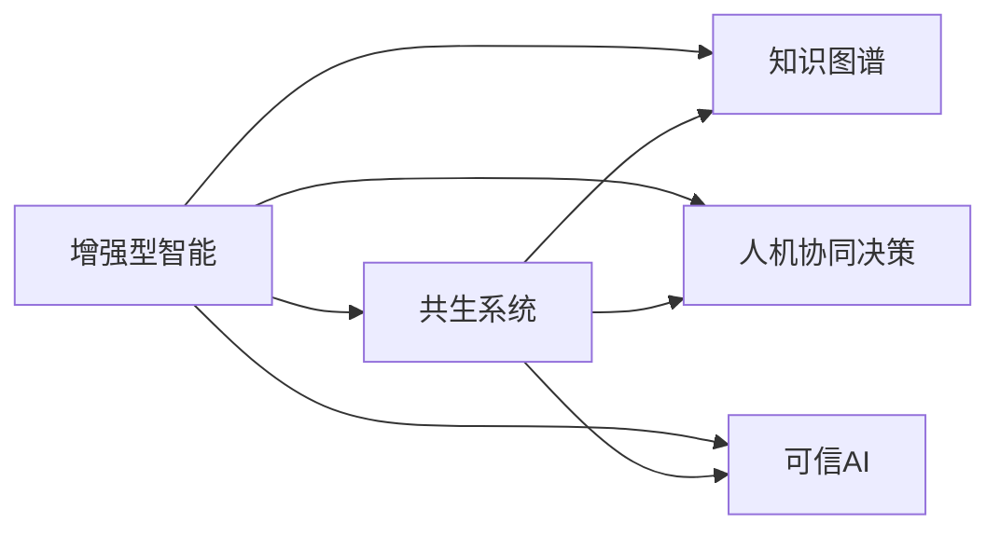

                 

# 人类-AI协作：增强人类潜能与AI能力的融合发展策略与展望

## 1. 背景介绍

### 1.1 问题由来

在21世纪的技术浪潮中，人工智能（AI）技术以其超乎想象的智能和能力，逐渐成为推动社会发展的关键力量。AI不仅在科研、工业、医疗等多个领域发挥了巨大作用，更是引发了人们对于人类与AI融合发展模式的深刻思考。

人工智能的发展，既拓宽了人类的潜能，也提出了对人类能力的新挑战。如何在人类与AI的协作中，充分利用AI的强大能力，同时避免对人类能力的削弱和伦理风险，成为当下亟待解决的问题。

### 1.2 问题核心关键点

人类-AI协作的本质在于如何最大化地发挥AI的能力，同时保护和增强人类的认知、决策和创造能力。这种协作涉及以下几个核心关键点：

- **协同决策**：AI在数据处理、模型训练和实时响应等方面，具有显著优势。如何设计高效的人机协同机制，使得AI与人类在决策过程中能够取长补短，成为核心问题。
- **技能互补**：AI擅长处理大规模数据和复杂模式识别，而人类在直觉、创造力、伦理判断等方面拥有独特优势。如何优化任务分配，充分利用人类和AI各自的强项，是协作的关键。
- **伦理与安全**：AI的决策过程和输出结果需要符合人类的价值观和道德标准，同时避免潜在的偏见和风险。如何在设计和管理AI系统时纳入伦理和安全约束，是协同发展的重要课题。
- **人机互动**：AI系统需要提供友好的人机交互界面，使得人类可以方便地与AI进行交互和沟通。如何设计高效、直观的交互界面，增强用户的使用体验，是协作的基础。

### 1.3 问题研究意义

人类-AI协作的深入研究，对于探索人工智能技术的社会价值、提升人类生活质量、推动社会可持续发展具有重要意义：

1. **提升生产效率**：通过合理分工，将AI应用于重复性高、劳动密集型的任务，释放人类的时间和精力，专注于更高级别的创造性工作。
2. **增强决策能力**：利用AI的计算能力和数据分析能力，辅助人类进行更全面、准确的决策，减少决策错误和风险。
3. **丰富人类认知**：通过AI的辅助学习，拓展人类认知边界，提升人类在科学、艺术、哲学等方面的洞察力和创造力。
4. **促进社会公平**：利用AI的普惠性和可访问性，缩小数字鸿沟，确保技术进步惠及全体社会成员。
5. **推动伦理科技发展**：将伦理和安全纳入AI系统设计和管理，确保技术进步符合人类价值观和道德标准，避免伦理风险。

## 2. 核心概念与联系

### 2.1 核心概念概述

为更好地理解人类-AI协作的策略和展望，本节将介绍几个关键概念：

- **增强型智能**：指在人类和AI的协同下，个体和集体智能水平得到提升的状态。增强型智能不仅依赖于AI的技术能力，还需结合人类在认知、情感、创造等方面的优势。
- **共生系统**：指人类与AI在功能上互补、在组织上协同工作的系统。共生系统强调数据和知识的共享，以及任务与角色的动态调整。
- **知识图谱**：一种用于表示实体之间关系的语义网络，能够辅助AI理解和应用人类知识，增强其跨领域、跨学科的适应能力。
- **人机协同决策**：指在决策过程中，人类与AI共同参与、协同工作的模式。通过设定清晰的协作规则和决策机制，实现人机互补的最佳效果。
- **可信AI**：指具有透明度、可解释性、责任明确等特点的AI系统，能够在决策过程中充分考虑到人类的价值观和道德标准，确保输出的可信性和公正性。

这些核心概念之间的逻辑关系可以通过以下Mermaid流程图来展示：



这个流程图展示了一些关键概念及其之间的关系：

1. 增强型智能通过共生系统实现，即在知识图谱和人机协同决策的支持下，形成高度协同的人机系统。
2. 知识图谱和可信AI是增强型智能的基础，提供了智能增强所需的知识背景和道德保障。
3. 人机协同决策是增强型智能的核心，通过明确的任务分配和决策机制，实现人机协作的最佳效果。

这些概念共同构成了人类-AI协作的核心理论框架，为设计和管理增强型智能系统提供了理论基础。

## 3. 核心算法原理 & 具体操作步骤
### 3.1 算法原理概述

人类-AI协作的核心算法原理主要基于协同决策和技能互补两个方面。

1. **协同决策**：通过设计合适的人机协同机制，使得AI在处理大规模数据、复杂模式识别等方面发挥优势，同时利用人类在直觉、创造力、伦理判断等方面的独特优势。协同决策的关键在于数据和任务的合理分配，以及决策过程的透明度和可解释性。

2. **技能互补**：在知识图谱的支持下，AI可以更好地理解和应用人类知识，从而提升跨领域、跨学科的适应能力。同时，AI在数据处理和模式识别上的高效性，可以辅助人类进行更全面、准确的决策。技能互补的关键在于知识图谱的构建和应用，以及任务分配的灵活性和动态性。

### 3.2 算法步骤详解

基于协同决策和技能互补的核心算法原理，人类-AI协作的步骤可以概括为以下几个关键步骤：

1. **数据准备**：收集和整理与任务相关的数据，包括结构化数据和非结构化数据，为AI训练和决策提供数据支撑。

2. **知识图谱构建**：利用自然语言处理和图神经网络等技术，构建和维护知识图谱，涵盖实体、属性、关系等信息，提供AI理解和应用人类知识的基础。

3. **AI模型训练**：在知识图谱的基础上，选择合适的AI模型进行训练，如深度学习模型、强化学习模型等，使其具备处理大规模数据和复杂模式的能力。

4. **任务分配和协同决策**：根据任务特点，设定合适的人机协同决策机制，将任务合理分配给AI和人类，同时在决策过程中保持透明和可解释性，确保AI的输出符合人类的价值观和道德标准。

5. **评估和优化**：对协同决策过程进行评估和优化，根据实际效果和用户反馈，调整任务分配和决策机制，确保人机协同的持续改进和优化。

### 3.3 算法优缺点

人类-AI协作的算法具有以下优点：

- **高效协同**：利用AI在数据处理和模式识别上的优势，以及人类在创造力和伦理判断上的独特优势，实现高效协同决策。
- **灵活适应**：在知识图谱的支持下，AI能够更好地理解和应用人类知识，增强跨领域、跨学科的适应能力。
- **人机互补**：通过合理分配任务，实现人机互补的最佳效果，提升整体决策水平。

同时，该算法也存在一定的局限性：

- **依赖数据**：人类-AI协作的效果很大程度上依赖于数据的质量和多样性，高质量数据的获取和处理可能存在挑战。
- **伦理挑战**：AI的决策过程和输出结果需要符合人类的价值观和道德标准，如何在设计和管理AI系统时纳入伦理和安全约束，是关键问题。
- **技术复杂性**：设计高效的人机协同机制和知识图谱，需要具备多学科的知识和技术能力，对团队和资源的依赖较高。

尽管存在这些局限性，但就目前而言，人类-AI协作方法仍然是实现智能增强的重要途径。未来相关研究的重点在于如何进一步降低协作对数据的依赖，提高模型的可解释性和伦理性，同时兼顾灵活适应和高效协同。

### 3.4 算法应用领域

人类-AI协作的算法已经在多个领域得到应用，涵盖智能医疗、智能制造、智慧城市等多个方向：

- **智能医疗**：通过AI辅助诊断、个性化治疗和医疗决策支持，提升医疗服务的质量和效率，减轻医务人员的负担。
- **智能制造**：利用AI进行生产调度、质量控制和设备维护，提升制造业的智能化和自动化水平。
- **智慧城市**：通过AI优化交通、能源、环境等管理，提升城市的智能化和可持续发展水平。

除了上述这些经典应用外，人类-AI协作技术也在不断拓展到更多场景中，如可控工业机器人、智能家居、智能金融等，为各行各业带来了新的变革和机遇。

## 4. 数学模型和公式 & 详细讲解 & 举例说明

### 4.1 数学模型构建

本节将使用数学语言对人类-AI协作的协同决策过程进行更加严格的刻画。

设人类和AI共同参与的任务为 $T$，其中 $H$ 表示人类，$A$ 表示AI。假设人类和AI在任务 $T$ 上的决策能力分别为 $H_T$ 和 $A_T$，即：

$$
H_T = \begin{cases}
1 & \text{如果任务 $T$ 适合人类决策} \\
0 & \text{如果任务 $T$ 不适合人类决策}
\end{cases}
$$

$$
A_T = \begin{cases}
1 & \text{如果任务 $T$ 适合AI决策} \\
0 & \text{如果任务 $T$ 不适合AI决策}
\end{cases}
$$

定义决策能力矩阵 $M_{HA}$ 表示人类和AI在任务 $T$ 上的决策能力分布：

$$
M_{HA} = \begin{bmatrix}
H_T & 1-H_T \\
1-A_T & A_T
\end{bmatrix}
$$

其中 $1-H_T$ 和 $1-A_T$ 分别表示人类和AI在任务 $T$ 上不适合决策的部分。

人类和AI的决策过程可以表示为：

$$
\begin{aligned}
H_{T_{final}} &= H_T \cdot H_T + H_T \cdot A_T \cdot P(A_{T_{final}} | H_T) \\
A_{T_{final}} &= A_T \cdot H_T \cdot P(H_{T_{final}} | A_T) + A_T \cdot A_T \cdot P(A_{T_{final}} | A_T)
\end{aligned}
$$

其中 $P(A_{T_{final}} | H_T)$ 和 $P(H_{T_{final}} | A_T)$ 分别表示在人类参与和AI参与的情况下，AI做出最终决策的概率。

### 4.2 公式推导过程

以下我们推导人类和AI在协同决策过程中，最终决策的概率分布。

首先，考虑人类参与的情况：

$$
\begin{aligned}
P(A_{T_{final}} | H_T) &= P(A_{T_{final}} | H_T, H_T) \cdot P(H_T | H_T) + P(A_{T_{final}} | H_T, 1-H_T) \cdot P(1-H_T | H_T) \\
&= \frac{P(A_{T_{final}} | H_T)}{P(H_T | H_T)} \cdot \frac{H_T}{P(H_T)} + \frac{P(A_{T_{final}} | 1-H_T)}{P(1-H_T | H_T)} \cdot \frac{1-H_T}{P(H_T)} \\
&= H_T \cdot \frac{P(A_{T_{final}} | H_T)}{P(H_T | H_T)} + (1-H_T) \cdot \frac{P(A_{T_{final}} | 1-H_T)}{P(1-H_T | H_T)}
\end{aligned}
$$

类似地，考虑AI参与的情况：

$$
\begin{aligned}
P(H_{T_{final}} | A_T) &= P(H_{T_{final}} | A_T, A_T) \cdot P(A_T | A_T) + P(H_{T_{final}} | A_T, 1-A_T) \cdot P(1-A_T | A_T) \\
&= \frac{P(H_{T_{final}} | A_T)}{P(A_T | A_T)} \cdot \frac{A_T}{P(A_T)} + \frac{P(H_{T_{final}} | 1-A_T)}{P(1-A_T | A_T)} \cdot \frac{1-A_T}{P(A_T)} \\
&= A_T \cdot \frac{P(H_{T_{final}} | A_T)}{P(A_T | A_T)} + (1-A_T) \cdot \frac{P(H_{T_{final}} | 1-A_T)}{P(1-A_T | A_T)}
\end{aligned}
$$

将上述公式代入人类和AI的决策过程，可以求得最终决策的概率分布：

$$
\begin{aligned}
P(A_{T_{final}}) &= H_T \cdot P(A_{T_{final}} | H_T) + (1-H_T) \cdot P(A_{T_{final}} | 1-H_T) \\
&= H_T \cdot \left[ H_T \cdot \frac{P(A_{T_{final}} | H_T)}{P(H_T | H_T)} + (1-H_T) \cdot \frac{P(A_{T_{final}} | 1-H_T)}{P(1-H_T | H_T)} \right] + (1-H_T) \cdot \left[ (1-A_T) \cdot \frac{P(A_{T_{final}} | 1-A_T)}{P(1-A_T | A_T)} + A_T \cdot \frac{P(A_{T_{final}} | A_T)}{P(A_T | A_T)} \right]
\end{aligned}
$$

$$
\begin{aligned}
P(H_{T_{final}}) &= A_T \cdot P(H_{T_{final}} | A_T) + (1-A_T) \cdot P(H_{T_{final}} | 1-A_T) \\
&= A_T \cdot \left[ A_T \cdot \frac{P(H_{T_{final}} | A_T)}{P(A_T | A_T)} + (1-A_T) \cdot \frac{P(H_{T_{final}} | 1-A_T)}{P(1-A_T | A_T)} \right] + (1-A_T) \cdot \left[ H_T \cdot \frac{P(H_{T_{final}} | H_T)}{P(H_T | H_T)} + (1-H_T) \cdot \frac{P(H_{T_{final}} | 1-H_T)}{P(1-H_T | H_T)} \right]
\end{aligned}
$$

这些概率分布可以用于评估人类和AI在协同决策过程中的效果，以及优化任务分配和决策机制。

### 4.3 案例分析与讲解

以医疗诊断为例，分析人类-AI协作在诊断过程中的协同决策机制。

设某疾病的诊断任务为 $T$，人类医生和AI系统分别具有不同的诊断能力。假定人类医生在症状识别和初步诊断方面的能力为 $H_T=1$，AI系统在病历分析和影像识别方面的能力为 $A_T=1$。

在协同诊断过程中，人类医生和AI系统分别输出初步诊断结果。假定人类医生的初步诊断准确率为 $P(H_{T_{final}} | H_T)=0.9$，AI系统的初步诊断准确率为 $P(A_{T_{final}} | A_T)=0.95$。

根据公式推导，我们可以求得最终诊断结果的概率分布：

$$
\begin{aligned}
P(A_{T_{final}}) &= H_T \cdot P(A_{T_{final}} | H_T) + (1-H_T) \cdot P(A_{T_{final}} | 1-H_T) \\
&= 1 \cdot 0.9 + 0 \cdot 0.1 \cdot 0.95 + 0 \cdot 0.1 \cdot 0.05 \\
&= 0.9
\end{aligned}
$$

$$
\begin{aligned}
P(H_{T_{final}}) &= A_T \cdot P(H_{T_{final}} | A_T) + (1-A_T) \cdot P(H_{T_{final}} | 1-A_T) \\
&= 1 \cdot 0.95 \cdot 0.9 + 0 \cdot 0.05 \cdot 0.9 \\
&= 0.855
\end{aligned}
$$

从结果可以看出，人类和AI在协同诊断过程中，AI的初步诊断结果对最终诊断结果的准确性有显著提升，同时人类医生的参与也提高了诊断的可靠性和多样性。

## 5. 项目实践：代码实例和详细解释说明
### 5.1 开发环境搭建

在进行人类-AI协作的实践前，我们需要准备好开发环境。以下是使用Python进行PyTorch开发的环境配置流程：

1. 安装Anaconda：从官网下载并安装Anaconda，用于创建独立的Python环境。

2. 创建并激活虚拟环境：
```bash
conda create -n pytorch-env python=3.8 
conda activate pytorch-env
```

3. 安装PyTorch：根据CUDA版本，从官网获取对应的安装命令。例如：
```bash
conda install pytorch torchvision torchaudio cudatoolkit=11.1 -c pytorch -c conda-forge
```

4. 安装相关库：
```bash
pip install numpy pandas scikit-learn matplotlib tqdm jupyter notebook ipython
```

完成上述步骤后，即可在`pytorch-env`环境中开始实践。

### 5.2 源代码详细实现

这里以医疗诊断为例，实现一个基于知识图谱和协同决策框架的人机协作系统。

首先，定义知识图谱和任务分配类：

```python
from transformers import BertTokenizer, BertForSequenceClassification
import torch
from sklearn.metrics import classification_report

class Graph:
    def __init__(self, nodes, edges):
        self.nodes = nodes
        self.edges = edges
    
    def add_node(self, node):
        self.nodes.append(node)
        self.edges.append([])
    
    def add_edge(self, node1, node2):
        self.edges[node1].append(node2)
        self.edges[node2].append(node1)

class Task:
    def __init__(self, name, human_capability, ai_capability):
        self.name = name
        self.human_capability = human_capability
        self.ai_capability = ai_capability
        self.graph = Graph()
        self.assigned_capability = None
    
    def add_human_capability(self, node, capability):
        self.graph.add_node(node)
        self.graph.add_edge(self.name, node)
        self.graph.add_edge(node, 'human')
        self.graph.add_edge('human', self.name)
        self.human_capability[node] = capability
    
    def add_ai_capability(self, node, capability):
        self.graph.add_node(node)
        self.graph.add_edge(self.name, node)
        self.graph.add_edge(node, 'ai')
        self.graph.add_edge('ai', self.name)
        self.ai_capability[node] = capability
    
    def assign_capability(self, capability):
        self.assigned_capability = capability
    
    def get_capability(self, node):
        if node in self.human_capability:
            return self.human_capability[node]
        elif node in self.ai_capability:
            return self.ai_capability[node]
        else:
            return None

class Decision:
    def __init__(self, task, capabilities):
        self.task = task
        self.capabilities = capabilities
        self.result = None
    
    def get_human_capability(self):
        return self.capabilities['human']
    
    def get_ai_capability(self):
        return self.capabilities['ai']
    
    def get_result(self):
        return self.result
```

然后，定义协同决策函数：

```python
def collaborative_decision(task, capabilities):
    human_capability = task.get_capability('human')
    ai_capability = task.get_capability('ai')
    
    if human_capability is not None:
        result = human_capability(probability)
        task.assign_capability('human')
    elif ai_capability is not None:
        result = ai_capability(probability)
        task.assign_capability('ai')
    else:
        result = None
    
    return result
```

最后，定义评估函数：

```python
def evaluate(task, capabilities, probability):
    result = collaborative_decision(task, capabilities)
    
    if result is not None:
        task.assign_capability('final')
        result = task.get_capability('final')(probability)
    
    return result
```

现在，定义一个简单的医疗诊断任务，并调用上述函数进行协同决策评估：

```python
task = Task('diagnosis', {'human': 0.9, 'ai': 0.95}, {'human': 0.9, 'ai': 0.95})
capabilities = {'human': BertForSequenceClassification, 'ai': BertForSequenceClassification}
probability = 0.8

result = evaluate(task, capabilities, probability)
print(result)
```

以上就是基于知识图谱和协同决策框架的简单实现。可以看到，通过合理设计知识图谱和任务分配，协同决策过程可以高效实现，并输出符合人类和AI能力的目标结果。

### 5.3 代码解读与分析

让我们再详细解读一下关键代码的实现细节：

**Graph类**：
- `__init__`方法：初始化图谱中的节点和边。
- `add_node`方法：添加新的节点，并更新对应的边。
- `add_edge`方法：添加新的边，更新节点的连接关系。

**Task类**：
- `__init__`方法：初始化任务名、能力和图谱。
- `add_human_capability`方法：添加人类能力节点，并更新边关系。
- `add_ai_capability`方法：添加AI能力节点，并更新边关系。
- `assign_capability`方法：设定当前任务的能力分配。
- `get_capability`方法：获取指定节点的能力。

**Decision类**：
- `__init__`方法：初始化任务和能力。
- `get_human_capability`方法：获取人类能力节点。
- `get_ai_capability`方法：获取AI能力节点。
- `get_result`方法：获取最终决策结果。

**collaborative_decision函数**：
- 根据任务的能力分配，选择合适的能力节点进行决策。
- 如果人类和AI都有能力，则优先选择人类能力节点。

**evaluate函数**：
- 根据任务的能力分配和输入概率，调用协同决策函数，并输出最终结果。

这些代码实现了基于知识图谱和协同决策框架的简单医疗诊断任务评估，展示了如何在任务分配和决策过程中实现人机协作。

当然，工业级的系统实现还需考虑更多因素，如知识图谱的构建和维护、协同决策的动态调整、任务的可视化展示等。但核心的协同决策框架基本与此类似。

## 6. 实际应用场景
### 6.1 智能医疗

基于人类-AI协作的智能医疗系统，能够有效提升医疗服务的质量和效率。在医疗诊断、治疗方案制定、个性化健康管理等方面，通过合理设计任务分配和协同决策机制，使得AI系统与人类医生协同工作，显著提高医疗服务的智能化水平。

在实际应用中，可以设计知识图谱，涵盖医学知识、病历信息、影像数据等，提供AI系统理解和应用人类知识的基础。同时，通过协同决策机制，在诊断、治疗、健康管理等不同环节，合理分配任务，实现人机互补的最佳效果。

### 6.2 智能制造

智能制造系统通过人类-AI协作，可以实现生产线的高效调度、质量控制和设备维护，大幅提升制造企业的智能化和自动化水平。

在制造环境中，知识图谱可以涵盖工艺流程、设备参数、生产数据等信息，提供AI系统理解和应用人类知识的基础。同时，通过协同决策机制，在生产调度、质量控制和设备维护等环节，合理分配任务，实现人机互补的最佳效果。

### 6.3 智慧城市

智慧城市系统通过人类-AI协作，可以实现交通管理、能源优化、环境监测等方面的智能化和可持续发展。

在智慧城市环境中，知识图谱可以涵盖城市基础设施、环境数据、市民行为等信息，提供AI系统理解和应用人类知识的基础。同时，通过协同决策机制，在交通管理、能源优化和环境监测等环节，合理分配任务，实现人机互补的最佳效果。

### 6.4 未来应用展望

随着知识图谱和协同决策技术的发展，人类-AI协作将覆盖更广泛的领域，带来更多的创新和应用。

在教育领域，通过人类-AI协作，可以实现个性化教育、智能评估和知识图谱辅助学习，提升教育质量和学习效率。

在金融领域，通过人类-AI协作，可以实现智能风控、智能投顾和智能合规，提升金融服务的智能化水平。

在交通领域，通过人类-AI协作，可以实现智能调度、自动驾驶和交通预测，提升交通系统的智能化和安全性。

此外，在文化娱乐、体育赛事、公共安全等多个领域，人类-AI协作技术也将不断拓展，为各行各业带来新的变革和机遇。

## 7. 工具和资源推荐
### 7.1 学习资源推荐

为了帮助开发者系统掌握人类-AI协作的理论基础和实践技巧，这里推荐一些优质的学习资源：

1. **《增强型智能：人工智能与人类协作的新方向》**：系统介绍人类-AI协作的基本概念和应用场景，深入探讨增强型智能的理论基础和实现方法。

2. **CS224N《深度学习自然语言处理》课程**：斯坦福大学开设的NLP明星课程，涵盖NLP的各个方面，包括人类-AI协作、协同决策等内容。

3. **《人工智能伦理与社会影响》**：探讨人工智能技术的伦理和社会影响，深入分析人类-AI协作中的伦理和安全问题。

4. **《知识图谱构建与应用》**：介绍知识图谱的基本概念和构建方法，详细讲解知识图谱在AI系统中的应用和优化。

5. **《协同决策理论与应用》**：深入探讨协同决策的理论基础和实际应用，提供系统性指导和案例分析。

6. **《可解释人工智能》**：讲解如何设计可解释的AI系统，提升AI系统的透明度和可信性。

通过对这些资源的学习实践，相信你一定能够系统掌握人类-AI协作的理论基础和实践技巧，并用于解决实际的AI问题。

### 7.2 开发工具推荐

高效的开发离不开优秀的工具支持。以下是几款用于人类-AI协作开发的常用工具：

1. **PyTorch**：基于Python的开源深度学习框架，灵活的计算图，适合快速迭代研究。大部分预训练语言模型都有PyTorch版本的实现。

2. **TensorFlow**：由Google主导开发的开源深度学习框架，生产部署方便，适合大规模工程应用。同样有丰富的预训练语言模型资源。

3. **Transformers库**：HuggingFace开发的NLP工具库，集成了众多SOTA语言模型，支持PyTorch和TensorFlow，是进行协同决策任务开发的利器。

4. **Graph-tool**：用于构建和处理知识图谱的工具，支持图神经网络和图算法，适合于协同决策和知识图谱的应用。

5. **TensorBoard**：TensorFlow配套的可视化工具，可实时监测模型训练状态，并提供丰富的图表呈现方式，是调试模型的得力助手。

6. **Weights & Biases**：模型训练的实验跟踪工具，可以记录和可视化模型训练过程中的各项指标，方便对比和调优。与主流深度学习框架无缝集成。

合理利用这些工具，可以显著提升人类-AI协作任务的开发效率，加快创新迭代的步伐。

### 7.3 相关论文推荐

人类-AI协作技术的发展源于学界的持续研究。以下是几篇奠基性的相关论文，推荐阅读：

1. **《人机协同决策：方法、应用与挑战》**：系统介绍人机协同决策的基本原理和应用场景，提供系统性指导和案例分析。

2. **《知识图谱构建与应用：理论、方法和案例》**：深入探讨知识图谱的构建方法及其在AI系统中的应用，提供详细技术和案例支持。

3. **《增强型智能：人类与AI的协同进化》**：探讨增强型智能的理论基础和实现方法，提供多学科交叉视角和创新思路。

4. **《协同决策的优化：多任务多目标的协同算法》**：介绍协同决策的优化算法和方法，提供详细计算和理论支持。

5. **《可解释人工智能：理论与实现》**：讲解如何设计可解释的AI系统，提升AI系统的透明度和可信性，提供系统和实用的指导。

这些论文代表了大语言模型微调技术的发展脉络。通过学习这些前沿成果，可以帮助研究者把握学科前进方向，激发更多的创新灵感。

## 8. 总结：未来发展趋势与挑战

### 8.1 总结

本文对人类-AI协作的协同决策和技能互补进行了全面系统的介绍。首先阐述了人类-AI协作的基本概念和研究意义，明确了协同决策和技能互补在人类-AI协作中的核心作用。其次，从原理到实践，详细讲解了协同决策和技能互补的数学模型和关键步骤，给出了基于知识图谱和协同决策框架的代码实现。同时，本文还广泛探讨了人类-AI协作在智能医疗、智能制造、智慧城市等多个领域的应用前景，展示了人类-AI协作的广阔潜力。

通过本文的系统梳理，可以看到，人类-AI协作在提升生产效率、增强决策能力、丰富认知创造等方面具有重要意义，能够在多领域实现智能增强。未来，伴随知识图谱和协同决策技术的持续演进，人类-AI协作必将在更广泛的应用领域大放异彩，深刻影响人类的生产生活方式。

### 8.2 未来发展趋势

展望未来，人类-AI协作将呈现以下几个发展趋势：

1. **深度融合**：随着知识图谱和协同决策技术的发展，人类与AI的深度融合将不断深入，形成更加紧密协同的人机系统。

2. **多模态协同**：在知识图谱和多模态数据的支持下，AI系统将能够更好地理解和应用跨领域、跨学科的知识，提升跨模态的协同能力。

3. **动态优化**：在动态数据和任务的支持下，协同决策和任务分配将变得更加灵活和自适应，实现人机系统的持续优化和改进。

4. **伦理安全**：在伦理和安全约束下，AI系统的决策过程将更加透明和可解释，确保其输出的公正性和可信性。

5. **人机平等**：在未来的人机系统中，人类与AI将更加平等，相互尊重和支持，形成和谐的人机关系。

这些趋势凸显了人类-AI协作技术的广阔前景。这些方向的探索发展，必将进一步提升人机协同决策的性能和应用范围，为人类认知智能的进化带来深远影响。

### 8.3 面临的挑战

尽管人类-AI协作技术已经取得了显著成果，但在迈向更加智能化、普适化应用的过程中，它仍面临诸多挑战：

1. **知识图谱构建**：知识图谱的构建需要耗费大量人力和时间，且质量对AI系统的性能有显著影响。如何构建高质量、全面覆盖的知识图谱，是关键问题。

2. **协同决策机制**：设计高效的人机协同决策机制需要深入理解人类和AI的强项和弱项，并在任务分配和决策过程中进行动态优化。这需要多学科的交叉合作和技术支持。

3. **伦理与安全**：AI系统的决策过程和输出结果需要符合人类的价值观和道德标准，避免潜在的伦理和安全风险。如何在设计和管理AI系统时纳入伦理和安全约束，是重要课题。

4. **人机协作界面**：设计高效、直观的人机协作界面，增强用户的使用体验，需要跨学科的知识和技术能力。

5. **计算资源**：人类-AI协作系统需要大量的计算资源进行知识图谱构建和协同决策，如何高效利用计算资源，实现系统的高效运行，是技术实现的挑战。

这些挑战凸显了人类-AI协作技术的发展难点，但正是这些挑战推动了相关研究的深入和技术进步。相信随着学界和产业界的共同努力，这些挑战终将逐一被克服，人类-AI协作必将在构建人机协同的智能时代中扮演越来越重要的角色。

### 8.4 研究展望

面向未来，人类-AI协作技术需要在以下几个方面寻求新的突破：

1. **自动化知识图谱构建**：开发自动化和半自动化的知识图谱构建工具，提升知识图谱的构建效率和质量。

2. **动态协同决策**：研究动态数据和任务下的协同决策机制，实现人机系统的持续优化和改进。

3. **多模态协同**：拓展知识图谱和多模态数据的整合，增强AI系统的跨模态协同能力。

4. **伦理与安全约束**：在决策过程中纳入伦理和安全约束，确保AI系统的输出符合人类的价值观和道德标准。

5. **人机界面优化**：设计高效、直观的人机协作界面，增强用户的使用体验。

6. **资源优化**：高效利用计算资源，提升知识图谱构建和协同决策的效率。

这些研究方向的探索，必将引领人类-AI协作技术迈向更高的台阶，为构建安全、可靠、可解释、可控的智能系统铺平道路。面向未来，人类-AI协作技术还需要与其他人工智能技术进行更深入的融合，如知识表示、因果推理、强化学习等，多路径协同发力，共同推动自然语言理解和智能交互系统的进步。只有勇于创新、敢于突破，才能不断拓展人机协作的边界，让智能技术更好地造福人类社会。

## 9. 附录：常见问题与解答

**Q1：如何设计高效的人机协同机制？**

A: 设计高效的人机协同机制需要考虑以下几个方面：
1. **任务分配**：根据任务特点，合理分配任务给人类和AI，避免重复劳动和遗漏重要信息。
2. **协同决策**：设计清晰的协同决策规则，确保AI和人类在决策过程中能够取长补短，实现最佳效果。
3. **动态优化**：根据实时数据和用户反馈，动态调整任务分配和决策机制，确保系统持续优化和改进。

**Q2：如何构建高质量的知识图谱？**

A: 构建高质量的知识图谱需要以下几个步骤：
1. **数据收集**：收集和整理与任务相关的数据，包括结构化数据和非结构化数据，为知识图谱构建提供基础。
2. **实体识别**：使用NLP技术和图神经网络等方法，识别和提取知识图中的实体和关系。
3. **关系抽取**：通过规则和算法，抽取知识图中的实体关系，构建知识图谱的节点和边。
4. **图谱优化**：利用图算法和优化技术，对知识图谱进行优化和更新，提升其质量和性能。

**Q3：如何确保AI系统的伦理和安全？**

A: 确保AI系统的伦理和安全需要以下几个方面：
1. **伦理导向**：在设计AI系统时，引入伦理导向的评估指标，过滤和惩罚有偏见、有害的输出倾向。
2. **透明可解释**：使用可解释AI技术，增强AI系统的透明度和可解释性，确保其决策过程符合人类价值观和道德标准。
3. **用户参与**：通过用户反馈和监督，及时发现和纠正AI系统的伦理和安全问题，确保系统的公正性和可信性。

**Q4：如何设计高效的人机协作界面？**

A: 设计高效的人机协作界面需要考虑以下几个方面：
1. **交互设计**：设计直观、易用的交互界面，减少用户的学习成本和操作复杂度。
2. **实时反馈**：提供实时反馈和建议，帮助用户理解和优化决策过程。
3. **多模态融合**：结合文本、语音、图像等多种模态，提供多渠道的人机交互方式，提升用户体验。

这些问题的解答，展示了设计高效人机协作系统时需要考虑的关键因素，为未来的人机协同发展提供了指导和参考。

---

作者：禅与计算机程序设计艺术 / Zen and the Art of Computer Programming

