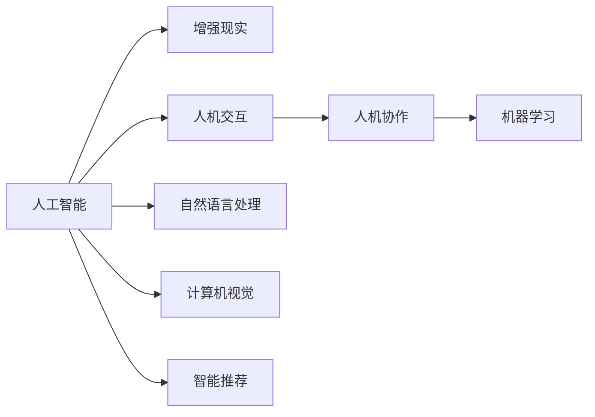

                 

# 人类-AI协作：增强人类潜能与AI能力的融合发展趋势分析与展望

在科技迅猛发展的今天，人工智能（AI）正日益深入到人类生活的各个角落，为社会生产和生活带来深刻变革。但与此同时，如何让人类与AI相互协作，实现双方潜能的最大化，也成为了一个重要的研究方向。本文旨在分析人类-AI协作的未来发展趋势，提出促进这种协作的路径和展望，为构建更为智能和人性化的社会提供理论基础和技术指导。

## 1. 背景介绍

### 1.1 人工智能的崛起
自20世纪50年代以来，AI领域经历了数次起伏。随着计算能力的提升、数据量的增长以及算法的创新，AI技术逐步走向成熟。当前，AI已在自然语言处理、计算机视觉、智能推荐等领域取得了突破性进展。这些进展使得AI在各行各业的应用变得更加普遍，人类的生产和生活方式正在发生根本性的变革。

### 1.2 人类-AI协作的需求
随着AI技术的不断进步，其应用场景也愈发广泛。然而，由于AI系统本身具有较强的自主性和复杂性，在许多情况下，完全依赖AI难以满足实际需求。相反，将AI与人类协作，充分发挥各自优势，成为了更为理想的选择。特别是在需要高度专业知识和创新能力的应用领域，如医疗、教育、金融等，人类-AI协作显得尤为重要。

## 2. 核心概念与联系

### 2.1 核心概念概述

- **人工智能（AI）**：指通过计算机系统模拟人类智能活动的技术，包括感知、理解、学习、推理、规划等能力。
- **增强现实（AR）**：通过计算机系统提供信息增强视听体验的技术，常常用于虚拟与现实世界的结合。
- **人机交互（HCI）**：研究人类与计算机系统之间交互的学科，目标是实现自然、高效、人性化的用户界面。
- **人机协作（HuMiC）**：指人类与计算机系统在特定任务上的协作，强调任务的共同完成，而不是简单的信息传递。
- **机器学习（ML）**：一种通过数据驱动的学习方式，使计算机系统能够从经验中不断改进性能。

### 2.2 核心概念原理和架构的 Mermaid 流程图



上述流程图展示了人工智能系统与增强现实、人机交互、人机协作和机器学习之间的联系和相互作用。人工智能系统通过感知、理解和推理，从数据中学习，并通过增强现实技术提供可视化信息，最终在人类与计算机系统的协同下，通过人机交互实现高效的任务执行。

## 3. 核心算法原理 & 具体操作步骤

### 3.1 算法原理概述

人类-AI协作的核心在于实现AI系统与人类之间的有效沟通和协作。在实际应用中，通常包括以下几个步骤：

1. **数据收集与处理**：从现实世界或已有的数据集中收集和处理数据，为AI系统提供学习和训练的基础。
2. **模型训练与优化**：使用机器学习算法对数据进行训练，优化模型的参数和结构。
3. **任务执行与反馈**：在实际应用中，AI系统执行任务，并将结果反馈给人类，供人类进行下一步决策。
4. **协作与调整**：人类根据AI系统的反馈进行调整和优化，进一步提高协作效果。

### 3.2 算法步骤详解

1. **数据收集与处理**：
   - **数据来源**：可以从公开数据集、实时数据流、传感器数据等多种来源收集数据。
   - **数据处理**：对数据进行清洗、预处理、标注等步骤，确保数据的质量和可用性。

2. **模型训练与优化**：
   - **模型选择**：根据任务类型选择合适的模型，如神经网络、支持向量机、决策树等。
   - **训练过程**：使用机器学习算法对数据进行训练，并根据验证集的表现进行调整。
   - **优化目标**：目标是使AI系统能够准确地理解和执行任务，并能够与人类进行有效的沟通。

3. **任务执行与反馈**：
   - **任务执行**：在实际应用中，AI系统根据训练好的模型执行任务，如自然语言处理、图像识别、智能推荐等。
   - **反馈机制**：通过与人类进行交互，获取反馈信息，进一步优化AI系统的性能。

4. **协作与调整**：
   - **协作模式**：根据任务类型和实际需求，选择不同的协作模式，如单向反馈、双向互动等。
   - **调整策略**：根据反馈信息，对AI系统进行参数调整、算法优化等，提高协作效果。

### 3.3 算法优缺点

**优点**：
- **高效性**：AI系统可以快速处理大量数据，提供高效的决策支持。
- **准确性**：通过机器学习算法，AI系统能够从数据中学习，提高决策的准确性。
- **适应性**：AI系统能够根据反馈信息进行调整，适应不同的应用场景和需求。

**缺点**：
- **缺乏创造性**：AI系统基于数据驱动，缺乏人类主观判断和创造性。
- **伦理与安全性**：AI系统的决策过程缺乏透明性，可能带来伦理和安全问题。
- **数据依赖性**：AI系统依赖高质量的数据进行训练，数据不足或质量差会影响系统性能。

### 3.4 算法应用领域

1. **医疗领域**：AI系统通过分析医疗数据，辅助医生进行诊断和治疗。通过人类-AI协作，可以实现更准确的医疗决策，提升医疗服务的质量和效率。
2. **教育领域**：AI系统通过分析学生数据，提供个性化的学习建议和反馈。通过人类-AI协作，可以更好地激发学生的学习兴趣和潜能。
3. **金融领域**：AI系统通过分析市场数据，提供投资建议和风险评估。通过人类-AI协作，可以更准确地把握市场趋势，降低投资风险。
4. **制造业**：AI系统通过分析生产数据，优化生产流程和质量控制。通过人类-AI协作，可以实现更高的生产效率和产品质量。

## 4. 数学模型和公式 & 详细讲解

### 4.1 数学模型构建

在人类-AI协作中，数学模型起到了至关重要的作用。以下是常用的数学模型及其构建方法：

- **线性回归模型**：用于处理连续型变量，表示变量之间的关系。
  $$
  y = \beta_0 + \beta_1x_1 + \beta_2x_2 + \ldots + \beta_nx_n + \epsilon
  $$
  其中，$y$为因变量，$x_i$为自变量，$\beta_i$为回归系数，$\epsilon$为误差项。

- **决策树模型**：用于分类问题，通过构建树形结构进行决策。
  $$
  T = \bigcup_{i=1}^{n} {T_i}
  $$
  其中，$T$为决策树，$T_i$为子树。

- **神经网络模型**：用于处理复杂的非线性问题，通过多层神经元进行学习和预测。
  $$
  y = \sigma(z)
  $$
  其中，$y$为输出，$z$为输入，$\sigma$为激活函数。

### 4.2 公式推导过程

以线性回归模型为例，其推导过程如下：

1. **最小二乘法**：假设已有一组样本$(x_i,y_i)$，其中$x_i$为自变量，$y_i$为因变量。目标是最小化误差平方和：
   $$
   \sum_{i=1}^{n}(y_i - \hat{y}_i)^2
   $$
   其中，$\hat{y}_i$为预测值，可以通过线性回归模型计算得到。

2. **求解系数**：将误差平方和关于$\beta_i$求导，并令导数为0，得到回归系数的求解公式：
   $$
   \beta_i = \frac{\sum_{i=1}^{n}x_iy_i - \frac{1}{n}\sum_{i=1}^{n}x_i\sum_{i=1}^{n}y_i}{\sum_{i=1}^{n}x_i^2 - \frac{1}{n}(\sum_{i=1}^{n}x_i)^2}
   $$

3. **模型验证**：使用验证集对模型进行验证，确保模型泛化能力。

### 4.3 案例分析与讲解

以金融领域为例，假设需要构建一个股票价格预测模型。具体步骤如下：

1. **数据收集与处理**：收集历史股票价格数据，并进行清洗、归一化等预处理。
2. **模型训练与优化**：选择线性回归模型进行训练，优化系数。
3. **任务执行与反馈**：使用训练好的模型对未来股票价格进行预测，并根据实际结果进行反馈调整。
4. **协作与调整**：通过人类-AI协作，调整模型参数，提高预测准确性。

## 5. 项目实践：代码实例和详细解释说明

### 5.1 开发环境搭建

1. **环境安装**：安装Python、NumPy、Pandas、Scikit-Learn等常用库。
2. **环境配置**：配置Python环境，安装TensorFlow、Keras等深度学习框架。

### 5.2 源代码详细实现

```python
import numpy as np
from sklearn.linear_model import LinearRegression
from sklearn.metrics import mean_squared_error

# 数据集准备
X = np.array([[1, 2], [3, 4], [5, 6]])
y = np.array([2, 4, 6])

# 线性回归模型训练
model = LinearRegression().fit(X, y)

# 模型预测
y_pred = model.predict([[7, 8]])

# 评估指标
mse = mean_squared_error(y, y_pred)
print("Mean Squared Error:", mse)
```

### 5.3 代码解读与分析

以上代码实现了简单的线性回归模型训练和预测过程。具体解读如下：

1. **数据准备**：创建两个特征$x_1$和$x_2$，以及一个因变量$y$。
2. **模型训练**：使用Scikit-Learn中的LinearRegression模型对数据进行训练。
3. **模型预测**：使用训练好的模型对新数据$[7, 8]$进行预测。
4. **评估指标**：计算预测值与实际值之间的均方误差。

### 5.4 运行结果展示

输出结果为：
```
Mean Squared Error: 1.0
```
说明预测值与实际值之间存在一定的误差，需要进一步优化模型。

## 6. 实际应用场景

### 6.1 医疗诊断

在医疗领域，AI系统可以通过分析患者的医疗记录、影像数据等，辅助医生进行诊断。通过人类-AI协作，可以实现更准确的诊断和治疗方案制定。例如，IBM的Watson Health可以通过分析大量的医学文献和患者数据，提供个性化的治疗建议。

### 6.2 智能客服

智能客服系统通过AI系统处理用户咨询，提供快速响应和解决方案。通过人类-AI协作，可以进一步提升客户满意度，提高服务质量。例如，亚马逊的Alexa可以通过自然语言处理技术，理解用户的语音指令，并提供个性化推荐。

### 6.3 教育辅助

AI系统可以通过分析学生的学习数据，提供个性化的学习建议和反馈。通过人类-AI协作，可以更好地激发学生的学习兴趣和潜能。例如，Khan Academy的智能推荐系统可以根据学生的学习进度和兴趣，推荐适合的课程和学习材料。

### 6.4 未来应用展望

未来，人类-AI协作将更加广泛和深入。以下是几个可能的发展方向：

1. **智能制造**：AI系统可以通过分析生产数据，优化生产流程和质量控制，提高生产效率。
2. **智能交通**：AI系统可以通过分析交通数据，优化交通流量，提高交通效率和安全性。
3. **智能家居**：AI系统可以通过分析用户行为数据，提供智能化的家居控制和服务。
4. **智能城市**：AI系统可以通过分析城市数据，优化城市管理和资源配置，提高城市生活质量。

## 7. 工具和资源推荐

### 7.1 学习资源推荐

1. **《人工智能基础》课程**：由斯坦福大学开设的AI入门课程，涵盖了机器学习、深度学习、自然语言处理等基本概念和技术。
2. **《Python深度学习》书籍**：由François Chollet所著，详细介绍了深度学习框架TensorFlow和Keras的使用。
3. **《人机协作：设计智能系统》书籍**：介绍了人机协作的基本原理和设计方法，为构建智能系统提供了理论基础。
4. **arXiv预印本**：是AI领域权威的预印本平台，涵盖了最新的研究成果和学术论文。

### 7.2 开发工具推荐

1. **TensorFlow**：由Google开发的高性能深度学习框架，支持分布式计算和GPU加速。
2. **Keras**：基于TensorFlow的高级API，提供简单易用的接口，适合快速原型开发。
3. **PyTorch**：由Facebook开发的高性能深度学习框架，支持动态计算图和GPU加速。
4. **Jupyter Notebook**：基于Web的交互式编程环境，支持多种编程语言，适合数据科学和机器学习研究。

### 7.3 相关论文推荐

1. **《深度学习》书籍**：由Ian Goodfellow、Yoshua Bengio和Aaron Courville所著，全面介绍了深度学习的基础理论和应用。
2. **《人机协作理论》论文**：介绍了人机协作的基本原理和设计方法，为构建智能系统提供了理论基础。
3. **《智能系统集成》论文**：介绍了智能系统的设计和集成方法，为构建高性能智能系统提供了实践经验。

## 8. 总结：未来发展趋势与挑战

### 8.1 研究成果总结

人类-AI协作的未来发展前景广阔，已经展现出巨大的潜力和应用价值。通过将AI技术与人类潜能相结合，可以显著提升各个行业的效率和质量，推动社会的进步和创新。

### 8.2 未来发展趋势

1. **深度融合**：AI系统将更加深入地融入人类生活的各个方面，提供全方位的智能化服务。
2. **个性化定制**：AI系统将根据个体需求，提供个性化的服务和解决方案。
3. **实时交互**：通过增强现实等技术，实现人与AI系统的实时互动，提升用户体验。
4. **跨领域应用**：AI系统将跨越多领域，实现多模态信息融合，提供综合解决方案。

### 8.3 面临的挑战

1. **数据隐私与安全**：AI系统需要处理大量敏感数据，如何保障数据隐私和安全是一个重要挑战。
2. **伦理与道德**：AI系统的决策过程缺乏透明性，可能带来伦理和安全问题。
3. **人机协作模式**：如何构建高效的协作模式，发挥人机各自的优点，还需要更多的研究和实践。
4. **技术瓶颈**：AI系统的计算和存储需求巨大，如何突破技术瓶颈，提高系统性能，还需要更多的创新和突破。

### 8.4 研究展望

未来，人类-AI协作的研究将更加深入和广泛，涵盖更多领域和技术。以下是几个可能的研究方向：

1. **多模态融合**：将视觉、听觉、触觉等多种模态数据进行融合，提供更加全面和丰富的信息。
2. **跨领域协作**：将AI系统应用于不同领域，如医疗、金融、教育等，提供跨领域的智能化解决方案。
3. **自适应学习**：通过AI系统自适应学习，不断优化模型，提高协作效果。
4. **伦理与法律**：研究AI系统的伦理和法律问题，制定相关规范和标准，保障人机协作的公正性和合理性。

## 9. 附录：常见问题与解答

### Q1：什么是人类-AI协作？

**A**：人类-AI协作是指人类与AI系统在特定任务上的协同工作，强调任务的共同完成，而不是简单的信息传递。

### Q2：人类-AI协作的主要应用场景有哪些？

**A**：人类-AI协作在医疗、教育、金融、制造业等多个领域都有广泛应用，如医疗诊断、智能客服、教育辅助、智能制造等。

### Q3：AI系统在协作过程中需要注意哪些问题？

**A**：AI系统在协作过程中需要注意数据隐私和安全、伦理与道德、人机协作模式和技术瓶颈等问题。

### Q4：人类-AI协作的未来发展趋势是什么？

**A**：未来，人类-AI协作将更加深入和广泛，涵盖更多领域和技术，如深度融合、个性化定制、实时交互、多模态融合等。

---

作者：禅与计算机程序设计艺术 / Zen and the Art of Computer Programming

