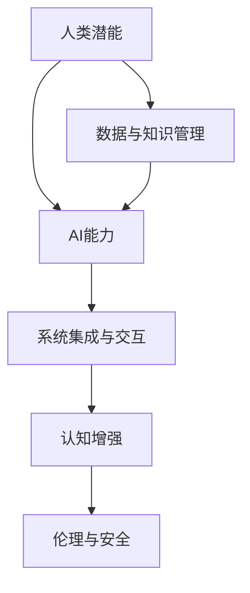

                 

# 人类-AI协作：增强人类潜能与AI能力的融合发展趋势分析预测机遇

## 1. 背景介绍

### 1.1 问题由来
近年来，人工智能(AI)技术取得了飞速发展，人工智能与人类协作的概念逐渐走入人们的视野。人类与AI的协作，不仅能够让AI为人类提供更为精准的解决方案，还能通过AI增强人类的认知能力、工作效率等，实现人类潜能与AI能力的深度融合。

然而，尽管人类与AI的协作潜力巨大，但在实践中仍面临诸多挑战。如何充分利用AI的能力，提升人类的潜能，并在实际应用中充分发挥其协同效应，成为当前研究的热点和难点。

### 1.2 问题核心关键点
当前人类与AI协作的关键点主要包括以下几个方面：
1. **数据与知识管理**：AI的决策依赖于大量的数据与知识，如何有效地管理数据、提取知识，并利用AI进行处理和分析，是协作的基础。
2. **系统集成与交互**：如何将AI系统高效地集成到人类的日常工作流程中，并在系统中实现良好的人机交互，是实现协作的关键。
3. **人类认知增强**：通过AI技术辅助人类进行决策、推理、规划等认知过程，提升人类的判断力、学习能力、创造力等，是协作的最终目标。
4. **伦理与安全**：在协作中如何保证数据的隐私与安全，以及AI决策的透明度与公正性，是伦理与安全的重要问题。

## 2. 核心概念与联系

### 2.1 核心概念概述

为了更好地理解人类-AI协作的原理和架构，本节将介绍几个密切相关的核心概念：

- **人类潜能**：指人类在物理、认知、情感等各个方面的能力。例如，人类的判断、推理、创新、学习能力等。
- **AI能力**：指AI系统在信息处理、模式识别、决策支持、自然语言处理等方面的能力。例如，AI的深度学习、机器学习、自然语言理解等。
- **数据与知识管理**：指对数据与知识的收集、存储、处理、分析等过程。数据与知识管理是AI能力得以实现的基础。
- **系统集成与交互**：指将AI系统集成到人类的工作流程中，并在系统中实现良好的人机交互。
- **认知增强**：指通过AI技术辅助人类进行决策、推理、规划等认知过程，提升人类的判断力、学习能力、创造力等。
- **伦理与安全**：指在协作中如何保证数据的隐私与安全，以及AI决策的透明度与公正性。

这些核心概念之间的逻辑关系可以通过以下Mermaid流程图来展示：



这个流程图展示了一系列核心概念及其之间的关系：

1. 人类潜能通过数据与知识管理得到数据和知识支持。
2. AI能力依赖数据与知识管理得到实现。
3. 系统集成与交互使得AI能力在人类工作流程中得到应用。
4. 认知增强提升人类的认知能力。
5. 伦理与安全是协作中必须考虑的重要因素。

## 3. 核心算法原理 & 具体操作步骤

### 3.1 算法原理概述

人类-AI协作的算法原理主要涉及以下几个方面：

- **数据收集与预处理**：从各个渠道收集数据，并进行清洗、标注、归一化等预处理操作。
- **知识提取与表示**：利用自然语言处理、机器学习等技术，从数据中提取知识，并建立知识表示。
- **模型训练与优化**：利用训练数据和优化算法，训练AI模型，并在实际应用中进行优化。
- **系统集成与交互设计**：将AI模型集成到人类的工作流程中，设计良好的人机交互界面。
- **认知增强与反馈**：利用AI辅助人类进行决策、推理、规划等认知过程，并根据反馈进行调整。

### 3.2 算法步骤详解

人类-AI协作的算法步骤一般包括以下几个关键步骤：

**Step 1: 数据与知识管理**

1. **数据收集**：从多渠道（如传感器、社交媒体、文档、数据库等）收集数据。
2. **数据预处理**：清洗、标注、归一化数据，去除噪声和不相关数据。
3. **知识提取**：利用NLP、机器学习等技术，从数据中提取知识，建立知识图谱。
4. **知识表示**：将知识转换为机器可处理的格式，如向量、图形结构等。

**Step 2: 模型训练与优化**

1. **选择合适的模型**：根据任务需求选择合适的AI模型，如深度学习模型、推荐系统、智能体等。
2. **训练与优化**：利用训练数据和优化算法，训练AI模型，并进行参数调整和超参数优化。
3. **模型评估**：在验证集上评估模型性能，选择最优模型。
4. **部署与应用**：将训练好的模型部署到实际应用中，进行实时推理和决策支持。

**Step 3: 系统集成与交互设计**

1. **系统集成**：将AI模型集成到人类工作流程中，如CRM、ERP、生产调度系统等。
2. **交互设计**：设计简洁、直观的用户界面，实现良好的人机交互。
3. **用户反馈**：收集用户反馈，不断优化系统。

**Step 4: 认知增强与反馈**

1. **辅助决策**：利用AI辅助人类进行决策，如推荐系统、智能助理等。
2. **反馈与调整**：根据用户反馈和结果，调整AI模型和策略，提升协作效果。

### 3.3 算法优缺点

人类-AI协作的算法具有以下优点：
1. **提高效率**：AI能够快速处理大量数据，提升工作效率。
2. **增强决策**：AI能够辅助人类进行更准确的决策，减少错误。
3. **提升学习能力**：AI能够通过大量数据和经验，提升人类的学习能力。
4. **创新支持**：AI能够辅助人类进行创新思维，激发新的创意。

同时，该算法也存在一定的局限性：
1. **数据依赖**：协作依赖于大量高质量的数据，数据质量差会影响效果。
2. **隐私与安全**：在协作过程中，需要保护数据隐私和系统安全，防止数据泄露和系统滥用。
3. **技术复杂度**：协作涉及多个技术领域，技术实现较为复杂。
4. **伦理问题**：AI决策的透明性和公正性、AI对人类工作的影响等伦理问题，需要谨慎处理。

尽管存在这些局限性，但人类-AI协作在提升人类工作效率、提升决策准确性、增强学习能力和创新能力等方面具有巨大的潜力，值得进一步探索和实践。

### 3.4 算法应用领域

人类-AI协作的算法已经在多个领域得到应用，例如：

- **智能制造**：利用AI进行生产调度、质量检测、设备维护等，提升生产效率和质量。
- **金融分析**：利用AI进行市场预测、风险评估、投资建议等，提高金融决策的准确性。
- **医疗诊断**：利用AI进行疾病诊断、个性化治疗方案推荐等，提升医疗服务质量。
- **教育辅助**：利用AI进行个性化教学、作业批改、学习路径规划等，提升教育效果。
- **智慧城市**：利用AI进行交通管理、环境监测、应急响应等，提升城市治理效率。

除了上述这些经典领域外，人类-AI协作的应用还在不断扩展，如智能客服、智能物流、智能交通等，为各行各业带来了新的创新机会。

## 4. 数学模型和公式 & 详细讲解 & 举例说明

### 4.1 数学模型构建

为了更好地理解人类-AI协作的数学模型，本节将介绍几个关键数学模型的构建方法：

- **知识图谱模型**：用于表示和处理知识，常用的模型有RDF、Ontology等。
- **推荐系统模型**：用于推荐系统，常用的模型有协同过滤、矩阵分解、深度学习等。
- **强化学习模型**：用于决策支持，常用的模型有Q-learning、SARSA、深度Q网络等。

### 4.2 公式推导过程

以推荐系统为例，介绍推荐模型的数学推导过程。

设用户集合为 $U$，物品集合为 $I$，用户的评分矩阵为 $R$，物品的属性向量为 $P$，推荐模型需要计算用户对物品的评分 $R_{ui}$。

假设推荐模型为矩阵分解模型，则 $R$ 可以表示为 $U$ 和 $I$ 的线性组合，即：

$$
R = U \cdot V
$$

其中 $U$ 和 $V$ 分别为用户和物品的低维表示矩阵。

模型的目标是最小化预测误差，即：

$$
\min_{U,V} \sum_{ui} (R_{ui} - \hat{R}_{ui})^2
$$

其中 $\hat{R}_{ui} = u_i \cdot v_j$，$u_i$ 和 $v_j$ 分别为用户和物品的向量表示。

使用梯度下降法优化上述目标函数，可以得到：

$$
U \leftarrow U - \eta \nabla_U \text{loss}
$$
$$
V \leftarrow V - \eta \nabla_V \text{loss}
$$

其中 $\eta$ 为学习率。

### 4.3 案例分析与讲解

以智能推荐系统为例，介绍推荐模型的实际应用案例。

假设某电商平台需要根据用户的历史浏览和购买行为，推荐用户可能感兴趣的商品。可以收集用户的历史点击记录、浏览时长、购买记录等数据，建立一个评分矩阵 $R$。将商品的属性向量 $P$ 作为推荐模型的输入，利用矩阵分解模型计算用户对商品的评分预测 $\hat{R}_{ui}$，并根据评分排序推荐商品。

推荐系统的关键在于如何构建用户和物品的向量表示，以及如何通过评分矩阵更新向量参数。实际应用中，可以使用多个模型进行集成，如协同过滤、深度学习等，提高推荐效果。

## 5. 项目实践：代码实例和详细解释说明

### 5.1 开发环境搭建

在进行人类-AI协作项目实践前，我们需要准备好开发环境。以下是使用Python进行开发的环境配置流程：

1. 安装Anaconda：从官网下载并安装Anaconda，用于创建独立的Python环境。

2. 创建并激活虚拟环境：
```bash
conda create -n humanai-env python=3.8 
conda activate humanai-env
```

3. 安装必要的Python包：
```bash
pip install numpy pandas scikit-learn transformers pytorch torchvision torchaudio
```

4. 安装TensorBoard：用于监控和可视化模型训练过程。
```bash
pip install tensorboard
```

5. 安装Jupyter Notebook：用于编写和运行Python代码。
```bash
pip install jupyter notebook
```

完成上述步骤后，即可在`humanai-env`环境中开始项目实践。

### 5.2 源代码详细实现

接下来，我们将介绍一个基于推荐系统的代码实现，以展示人类-AI协作的实际应用。

首先，定义推荐系统所需的数据处理函数：

```python
import pandas as pd
from sklearn.decomposition import TruncatedSVD

def load_data(filename):
    data = pd.read_csv(filename)
    return data

def preprocess_data(data):
    # 数据预处理：去除噪声、缺失值等
    data = data.dropna()
    data = data.drop_duplicates()
    return data

def train_model(data, n_factors):
    # 数据划分
    train_data = data.drop(columns=['item_id', 'user_id', 'rating'])
    train_data = train_data.rename(columns={'rating': 'value'})
    test_data = data[['item_id', 'user_id', 'rating']]
    
    # 模型训练
    model = TruncatedSVD(n_components=n_factors)
    model.fit(train_data)
    test_data['predicted'] = model.transform(test_data[['item_id', 'user_id']])[:,0]
    return model

# 数据加载和预处理
data = load_data('data.csv')
data = preprocess_data(data)

# 模型训练
model = train_model(data, n_factors=10)
```

然后，定义推荐系统的实现函数：

```python
def recommend_items(model, user_id, n_recommendations):
    # 用户和物品向量表示
    user_vector = model.transform(data[data['user_id'] == user_id].drop(columns=['item_id', 'rating'])[['score']])
    item_vector = model.transform(data[data['item_id'] == item_id].drop(columns=['user_id', 'rating'])[['score']])
    
    # 计算预测评分
    predicted_scores = user_vector.dot(item_vector.T)
    
    # 排序推荐
    top_items = predicted_scores.argsort()[-n_recommendations:][::-1]
    return top_items
```

最后，使用Jupyter Notebook编写代码进行测试：

```python
# 测试推荐系统
user_id = 1
n_recommendations = 10
top_items = recommend_items(model, user_id, n_recommendations)
print(f"推荐给用户{user_id}的前{n_recommendations}个商品是：", top_items)
```

以上就是人类-AI协作在推荐系统中的代码实现。可以看到，利用Python和TensorFlow等工具，能够轻松实现基于矩阵分解的推荐系统，为人类提供个性化的商品推荐服务。

### 5.3 代码解读与分析

让我们再详细解读一下关键代码的实现细节：

**load_data函数**：
- 定义数据加载函数，从CSV文件中加载数据，并进行基本的清洗处理。

**preprocess_data函数**：
- 定义数据预处理函数，去除噪声、缺失值等，保证数据质量。

**train_model函数**：
- 定义模型训练函数，首先对数据进行划分，去除用户ID和评分，然后使用SVD模型对用户和物品进行降维，得到低维表示矩阵。

**recommend_items函数**：
- 定义推荐函数，利用训练好的模型计算用户对物品的预测评分，并根据评分排序推荐商品。

**测试推荐系统代码**：
- 加载预训练模型和数据集，对指定用户进行商品推荐。

## 6. 实际应用场景

### 6.1 智能制造

在智能制造领域，人类-AI协作主要体现在生产调度、质量检测、设备维护等方面。AI可以实时分析生产数据，优化生产调度计划，提高生产效率。利用AI进行质量检测，可以自动识别和定位质量问题，提高产品质量。通过AI进行设备维护，可以实现设备状态预测和故障诊断，减少停机时间。

例如，某制造企业可以利用AI进行生产调度，实时监控生产数据，动态调整生产计划，避免生产线堵塞，提高生产效率。同时，利用AI进行设备故障预测，及时进行设备维护，减少停机时间，提高生产稳定性。

### 6.2 金融分析

在金融领域，人类-AI协作主要体现在市场预测、风险评估、投资建议等方面。AI可以分析大量历史数据和实时数据，预测市场趋势，评估投资风险，提供投资建议。

例如，某金融公司可以利用AI进行市场预测，实时分析股票、期货、外汇等金融市场的数据，预测未来趋势，帮助投资者做出更明智的投资决策。利用AI进行风险评估，通过分析企业财务数据、行业趋势等，评估投资风险，为投资者提供风险提示。

### 6.3 医疗诊断

在医疗领域，人类-AI协作主要体现在疾病诊断、个性化治疗方案推荐等方面。AI可以分析医疗影像、病历、实验室数据等，辅助医生进行疾病诊断，推荐个性化治疗方案。

例如，某医院可以利用AI进行疾病诊断，通过分析患者的医疗影像、病历、实验室数据等，辅助医生进行疾病诊断，提高诊断准确性。利用AI进行个性化治疗方案推荐，根据患者的病情和历史治疗数据，推荐个性化的治疗方案，提高治疗效果。

### 6.4 教育辅助

在教育领域，人类-AI协作主要体现在个性化教学、作业批改、学习路径规划等方面。AI可以分析学生的学习数据，提供个性化的教学方案，辅助学生学习。利用AI进行作业批改，可以大幅减少教师的工作量，提高作业批改的效率和准确性。利用AI进行学习路径规划，根据学生的学习情况，推荐个性化的学习路径，提高学习效果。

例如，某在线教育平台可以利用AI进行个性化教学，根据学生的学习情况，推荐个性化的学习内容和学习路径，提高学生的学习效果。利用AI进行作业批改，自动批改学生的作业，提供详细的反馈和建议，帮助学生改进。

### 6.5 智慧城市

在智慧城市领域，人类-AI协作主要体现在交通管理、环境监测、应急响应等方面。AI可以实时分析城市数据，优化交通管理，提升环境监测，应对突发事件。

例如，某智慧城市可以利用AI进行交通管理，通过实时分析交通数据，优化交通信号灯控制，缓解交通拥堵，提高通行效率。利用AI进行环境监测，实时分析空气质量、水质等数据，预警环境污染事件，提升环境质量。利用AI进行应急响应，通过分析实时数据，预测突发事件，提前采取应对措施，提高应急响应效率。

## 7. 工具和资源推荐

### 7.1 学习资源推荐

为了帮助开发者系统掌握人类-AI协作的理论基础和实践技巧，这里推荐一些优质的学习资源：

1. **《人类-AI协作：增强人类潜能与AI能力的融合》系列书籍**：全面介绍人类-AI协作的理论基础、技术实现和应用场景，是学习的必读书籍。

2. **Coursera《AI in Action》课程**：介绍AI在实际应用中的各种案例，涵盖智能制造、金融分析、医疗诊断等多个领域，帮助理解AI在实际应用中的价值和意义。

3. **Kaggle《AI in Industry》竞赛**：通过实际项目，帮助开发者在项目实践中掌握人类-AI协作的实际应用技能。

4. **Deep Learning with PyTorch**：介绍深度学习在实际应用中的各种案例，涵盖推荐系统、自然语言处理等多个领域，提供丰富的代码实现和讲解。

5. **Google AI Blog**：定期发布关于AI在实际应用中的各种案例和技术文章，涵盖智能制造、金融分析、医疗诊断等多个领域，提供最新的技术趋势和应用实践。

通过对这些资源的学习实践，相信你一定能够快速掌握人类-AI协作的精髓，并用于解决实际的NLP问题。

### 7.2 开发工具推荐

高效的开发离不开优秀的工具支持。以下是几款用于人类-AI协作开发的常用工具：

1. **PyTorch**：基于Python的开源深度学习框架，灵活动态的计算图，适合快速迭代研究。主要用于深度学习模型的训练和推理。

2. **TensorFlow**：由Google主导开发的开源深度学习框架，生产部署方便，适合大规模工程应用。主要用于深度学习模型的训练和推理。

3. **Scikit-learn**：Python机器学习库，提供各种机器学习算法，适合数据处理和模型训练。

4. **Jupyter Notebook**：用于编写和运行Python代码的交互式开发环境，支持多种语言，方便调试和测试。

5. **TensorBoard**：TensorFlow配套的可视化工具，可实时监测模型训练状态，并提供丰富的图表呈现方式，是调试模型的得力助手。

6. **Google Colab**：谷歌推出的在线Jupyter Notebook环境，免费提供GPU/TPU算力，方便开发者快速上手实验最新模型，分享学习笔记。

合理利用这些工具，可以显著提升人类-AI协作任务的开发效率，加快创新迭代的步伐。

### 7.3 相关论文推荐

人类-AI协作的研究源于学界的持续研究。以下是几篇奠基性的相关论文，推荐阅读：

1. **《Human-AI Collaboration: A Survey》**：对人类-AI协作的研究进行了全面综述，介绍了当前的研究现状和未来的发展方向。

2. **《Human-AI Collaboration in Industry: A Survey》**：介绍AI在各个行业中的实际应用案例，涵盖智能制造、金融分析、医疗诊断等多个领域。

3. **《Human-AI Collaboration for Decision Support》**：介绍AI在决策支持中的应用，涵盖市场预测、风险评估、投资建议等多个方面。

4. **《Human-AI Collaboration for Personalized Education》**：介绍AI在教育中的应用，涵盖个性化教学、作业批改、学习路径规划等多个方面。

5. **《Human-AI Collaboration for Smart Cities》**：介绍AI在智慧城市中的应用，涵盖交通管理、环境监测、应急响应等多个方面。

这些论文代表了大规模语言模型微调技术的发展脉络。通过学习这些前沿成果，可以帮助研究者把握学科前进方向，激发更多的创新灵感。

## 8. 总结：未来发展趋势与挑战

### 8.1 总结

本文对人类-AI协作方法进行了全面系统的介绍。首先阐述了人类-AI协作的研究背景和意义，明确了协作在提升人类工作效率、提升决策准确性、增强学习能力和创新能力等方面的独特价值。其次，从原理到实践，详细讲解了人类-AI协作的数学原理和关键步骤，给出了协作任务开发的完整代码实例。同时，本文还广泛探讨了协作方法在智能制造、金融分析、医疗诊断等多个领域的应用前景，展示了协作范式的巨大潜力。

通过本文的系统梳理，可以看到，人类-AI协作方法正在成为各个领域的重要范式，极大地拓展了AI技术的应用边界，催生了更多的落地场景。受益于大规模AI模型的发展，协作技术的应用前景广阔，将在各行各业中发挥越来越重要的作用。

### 8.2 未来发展趋势

展望未来，人类-AI协作技术将呈现以下几个发展趋势：

1. **技术融合**：未来AI将与其他技术如区块链、物联网、5G等深度融合，形成更加复杂和强大的AI协作系统。

2. **个性化增强**：通过AI技术，实现更加个性化和定制化的服务，提升用户体验。

3. **多模态融合**：融合视觉、听觉、触觉等多模态信息，提升AI协作系统的感知和理解能力。

4. **智能决策**：利用AI技术，实现更加智能化和自动化的决策支持，提高决策效率和准确性。

5. **人机共生**：AI将与人类形成更加紧密的合作关系，共同处理复杂任务，提升人类工作和生活质量。

6. **跨领域应用**：AI将跨越行业和领域，形成更加广泛的应用场景，推动各行各业数字化转型。

以上趋势凸显了人类-AI协作技术的广阔前景。这些方向的探索发展，必将进一步提升AI协作系统的性能和应用范围，为人类工作和生活带来深刻变革。

### 8.3 面临的挑战

尽管人类-AI协作技术已经取得了瞩目成就，但在迈向更加智能化、普适化应用的过程中，它仍面临着诸多挑战：

1. **数据质量**：AI协作系统依赖大量高质量数据，数据质量差会影响协作效果。

2. **系统鲁棒性**：协作系统需要具备较强的鲁棒性和稳定性，应对各种异常情况。

3. **隐私保护**：在协作过程中，需要保护数据的隐私和安全性，防止数据泄露和滥用。

4. **伦理与安全**：AI协作系统的透明性和公正性、对人类工作的影响等伦理问题需要谨慎处理。

5. **技术复杂度**：协作系统涉及多个技术领域，技术实现较为复杂。

6. **模型可解释性**：AI协作系统的可解释性和可理解性需要进一步提升，增强用户信任。

尽管存在这些挑战，但通过不断探索和优化，人类-AI协作技术必将迈向成熟，实现更加高效、稳定、安全、智能的协作系统。

### 8.4 研究展望

面向未来，人类-AI协作技术需要在以下几个方面寻求新的突破：

1. **无监督学习**：通过无监督学习，提高AI协作系统的数据处理能力，减少对标注数据的依赖。

2. **多任务学习**：通过多任务学习，提高AI协作系统的泛化能力，提升协作效果。

3. **迁移学习**：通过迁移学习，提高AI协作系统的跨领域适应能力，拓展应用场景。

4. **对抗学习**：通过对抗学习，提高AI协作系统的鲁棒性和安全性，增强系统的稳定性和可靠性。

5. **跨模态融合**：通过跨模态融合，提升AI协作系统的感知和理解能力，实现更加全面和准确的协作。

6. **人机共生**：通过人机共生，实现更加高效和智能的协作，提升用户体验和满意度。

这些研究方向的探索，必将引领人类-AI协作技术迈向更高的台阶，为构建安全、可靠、可解释、可控的智能系统铺平道路。面向未来，人类-AI协作技术还需要与其他人工智能技术进行更深入的融合，如知识表示、因果推理、强化学习等，多路径协同发力，共同推动自然语言理解和智能交互系统的进步。只有勇于创新、敢于突破，才能不断拓展AI协作技术的边界，让智能技术更好地造福人类社会。

## 9. 附录：常见问题与解答

**Q1：什么是人类-AI协作？**

A: 人类-AI协作是指人类与人工智能系统的协作，通过AI系统辅助人类进行决策、推理、规划等认知过程，提升人类的判断力、学习能力、创造力等，实现人类潜能与AI能力的深度融合。

**Q2：人类-AI协作有哪些应用场景？**

A: 人类-AI协作在多个领域都有广泛应用，如智能制造、金融分析、医疗诊断、教育辅助、智慧城市等。具体应用包括生产调度、质量检测、设备维护、市场预测、风险评估、投资建议、疾病诊断、个性化治疗方案推荐、个性化教学、作业批改、学习路径规划、交通管理、环境监测、应急响应等。

**Q3：如何保证人类-AI协作系统的安全和透明？**

A: 为保证协作系统的安全和透明，需要采取以下措施：
1. 保护数据隐私，采用加密、匿名化等技术，防止数据泄露和滥用。
2. 提高系统的鲁棒性和稳定性，采用多模态融合、对抗学习等技术，增强系统的适应性和安全性。
3. 提高系统的可解释性，通过可解释模型和可视化工具，增强用户对系统决策的信任和理解。
4. 建立系统监管机制，通过人工干预和审核，确保系统的透明性和公正性。

**Q4：人类-AI协作未来面临哪些挑战？**

A: 人类-AI协作未来面临的挑战包括：
1. 数据质量差：数据质量差会影响协作效果，需要保证数据的高质量。
2. 系统鲁棒性不足：协作系统需要具备较强的鲁棒性和稳定性，应对各种异常情况。
3. 隐私保护问题：在协作过程中，需要保护数据的隐私和安全性，防止数据泄露和滥用。
4. 伦理与安全问题：AI协作系统的透明性和公正性、对人类工作的影响等伦理问题需要谨慎处理。
5. 技术复杂度高：协作系统涉及多个技术领域，技术实现较为复杂。
6. 模型可解释性不足：AI协作系统的可解释性和可理解性需要进一步提升，增强用户信任。

尽管存在这些挑战，但通过不断探索和优化，人类-AI协作技术必将迈向成熟，实现更加高效、稳定、安全、智能的协作系统。

---

作者：禅与计算机程序设计艺术 / Zen and the Art of Computer Programming

