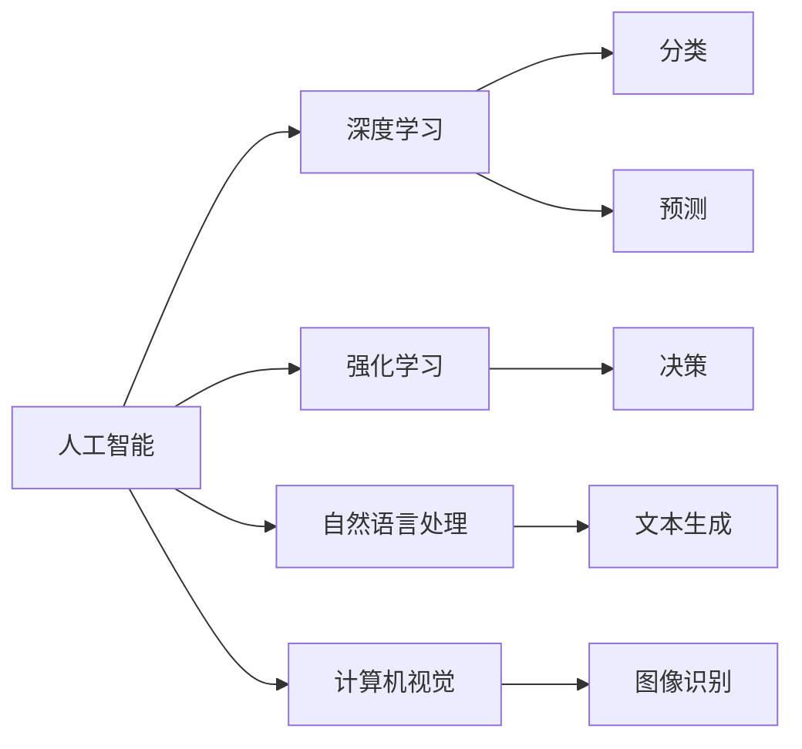

                 

# 人类-AI协作：增强创造力和生产力

> 关键词：
> 人工智能，人机协作，增强创造力，生产力提升，深度学习，强化学习，自然语言处理，计算机视觉

## 1. 背景介绍

随着人工智能(AI)技术的飞速发展，AI在各个领域的应用已经从简单的自动化任务逐渐扩展到复杂的创造性工作。然而，尽管AI能够处理海量数据，但在理解复杂情境、处理抽象概念、创造新意等方面，仍然远远无法比拟人类智慧。因此，探索人类与AI的协作模式，成为当前AI研究的重要方向。本文将详细探讨AI如何通过与人类协作，增强人类的创造力和生产力，推动经济社会的持续发展。

## 2. 核心概念与联系

### 2.1 核心概念概述

为了更好地理解人类-AI协作的原理和应用，我们先来介绍几个核心概念：

- **人工智能(AI)**：通过模拟人类智能行为，包括学习、推理、感知等，完成特定任务的技术。
- **增强创造力**：指通过AI技术辅助人类，拓展思维边界，创造出更多有价值的想法和解决方案。
- **提高生产力**：指通过自动化、优化等手段，减少人类工作量，提升任务完成效率。
- **深度学习**：通过多层神经网络模型，自动从数据中学习抽象特征，进行分类、预测等任务。
- **强化学习**：通过智能体与环境交互，不断调整策略以最大化奖励，实现复杂决策任务。
- **自然语言处理(NLP)**：让计算机理解和生成人类语言的技术。
- **计算机视觉**：使计算机能够识别和理解图像、视频中的物体和场景的技术。

这些概念共同构成了AI技术的基本框架，它们之间的联系可以通过以下Mermaid流程图进行展示：



此流程图展示了AI技术的四大分支（深度学习、强化学习、自然语言处理和计算机视觉）及其在特定任务中的应用，如分类、预测、决策、文本生成和图像识别等。

## 3. 核心算法原理 & 具体操作步骤

### 3.1 算法原理概述

人类-AI协作的核心在于结合AI的能力与人类智慧，共同完成复杂任务。AI技术能够处理海量的数据，识别模式，预测趋势，而人类则能够理解上下文，创造新想法，解决复杂问题。通过协作，AI可以辅助人类提升工作效率，拓展思维边界，创造更多价值。

### 3.2 算法步骤详解

人类-AI协作的基本步骤包括以下几个关键环节：

**Step 1: 确定协作目标**
- 明确具体任务，如数据分析、内容创作、问题解答等。
- 根据任务需求，选择合适的AI技术，如深度学习模型、强化学习策略等。

**Step 2: 数据准备与预处理**
- 收集相关数据，并进行清洗、标注、格式化等预处理。
- 根据任务特点，设计合适的输入输出格式，便于AI模型处理。

**Step 3: 模型训练与优化**
- 使用AI技术对模型进行训练，调整超参数，优化模型性能。
- 定期评估模型效果，进行必要的调整和改进。

**Step 4: 人类与AI交互**
- 将训练好的模型集成到人机交互界面中。
- 利用人类智慧对AI输出结果进行解释、修正、创造，形成最终解决方案。

**Step 5: 持续迭代与反馈**
- 根据用户反馈，不断优化AI模型，提升协作效果。
- 收集人类与AI协作过程中的经验，形成知识库，供未来项目参考。

### 3.3 算法优缺点

人类-AI协作的优点在于：
- **高效处理复杂任务**：AI能够自动化处理大量数据和重复性工作，提升效率。
- **跨界融合创新**：AI技术能够与不同领域知识结合，创造新价值。
- **人机协同优化**：AI与人类智慧互补，提升协作效果。

缺点在于：
- **依赖高质量数据**：AI模型的性能很大程度上依赖于训练数据的质量。
- **人机界面设计复杂**：设计高效、易用的交互界面，需要大量时间和精力。
- **伦理与隐私问题**：AI技术可能带来数据隐私和伦理道德问题。

### 3.4 算法应用领域

人类-AI协作在多个领域已经展现出巨大潜力，具体应用场景包括：

- **内容创作**：AI辅助生成新闻报道、小说、诗歌等文本内容，提升创作效率和质量。
- **医疗诊断**：AI辅助医生进行疾病诊断、治疗方案设计，提高医疗服务水平。
- **智能客服**：AI自动解答客户咨询，减轻人工客服压力，提升服务质量。
- **金融分析**：AI处理大量市场数据，进行风险评估、投资建议等。
- **教育培训**：AI个性化推荐学习资源、评估学生表现，提升教学效果。
- **城市管理**：AI监控交通流量、预测灾害等，优化城市运行。

## 4. 数学模型和公式 & 详细讲解

### 4.1 数学模型构建

以内容生成为例，可以使用基于语言模型的生成框架，如GPT-3，来构建生成内容的数学模型。GPT-3模型基于Transformer结构，通过自回归方式生成文本。其目标是最小化文本与真实标签的差距，即预测下一个单词的概率与真实标签之间的交叉熵损失。

设输入为序列 $X=(x_1, x_2, ..., x_n)$，目标为序列 $Y=(y_1, y_2, ..., y_n)$，则模型的目标函数可以表示为：

$$
\mathcal{L}(X, Y) = -\frac{1}{N} \sum_{i=1}^{N} \log p(y_i | x_1, ..., x_n)
$$

其中 $p(y_i | x_1, ..., x_n)$ 表示在给定前 $n-1$ 个单词的情况下，生成第 $i$ 个单词的概率。

### 4.2 公式推导过程

在生成过程中，模型使用softmax函数将输出转化为概率分布：

$$
p(y_i | x_1, ..., x_n) = \frac{\exp(z_i)}{\sum_{j=1}^{V} \exp(z_j)}
$$

其中 $z_i$ 为模型对单词 $y_i$ 的预测得分。得分 $z_i$ 的计算涉及模型的隐藏状态 $h$ 和权重矩阵 $W$：

$$
z_i = h W_v y_i + b_v
$$

其中 $h$ 为上一时刻的隐藏状态，$W_v$ 为单词向量矩阵，$b_v$ 为偏置向量。通过不断迭代上述过程，模型可以生成具有较高语言流利度的文本内容。

### 4.3 案例分析与讲解

以Google的DeepDream为例，该技术利用深度神经网络对图像进行处理，生成具有艺术感的超现实图像。通过调整神经网络的结构和参数，可以控制生成的图像风格和主题。该技术的成功展示了AI在艺术创作方面的潜力。

## 5. 项目实践：代码实例和详细解释说明

### 5.1 开发环境搭建

为了进行深度学习模型的开发，首先需要搭建相应的开发环境。以下是使用Python进行PyTorch开发的环境配置流程：

1. 安装Anaconda：从官网下载并安装Anaconda，用于创建独立的Python环境。

2. 创建并激活虚拟环境：
```bash
conda create -n pytorch-env python=3.8 
conda activate pytorch-env
```

3. 安装PyTorch：根据CUDA版本，从官网获取对应的安装命令。例如：
```bash
conda install pytorch torchvision torchaudio cudatoolkit=11.1 -c pytorch -c conda-forge
```

4. 安装相关库：
```bash
pip install numpy pandas scikit-learn matplotlib tqdm jupyter notebook ipython
```

完成上述步骤后，即可在`pytorch-env`环境中开始模型开发。

### 5.2 源代码详细实现

以下是一个简单的基于GPT-3生成文本的代码实现：

```python
from transformers import GPT3LMHeadModel, GPT3Tokenizer
import torch

tokenizer = GPT3Tokenizer.from_pretrained('gpt3')
model = GPT3LMHeadModel.from_pretrained('gpt3')

input_prompt = "How do you like the weather in"

inputs = tokenizer(input_prompt, return_tensors='pt')
outputs = model.generate(inputs['input_ids'], max_length=100)

decoded_output = tokenizer.decode(outputs[0])
print(decoded_output)
```

该代码展示了如何使用GPT-3生成一个与输入提示相关的文本。首先，通过`GPT3Tokenizer`将输入提示转换为模型所需的格式。然后，使用`GPT3LMHeadModel`生成文本。最后，通过`GPT3Tokenizer`将生成的文本解码为可读的文本输出。

### 5.3 代码解读与分析

代码中的关键部分包括：

- `GPT3LMHeadModel`：用于生成文本的深度学习模型。
- `GPT3Tokenizer`：用于将输入转换为模型所需的格式，包括分词、编码等。
- `generate`方法：生成文本的接口，输入为模型需要的`input_ids`，输出为生成的文本序列。
- `tokenizer.decode`方法：将生成的文本序列解码为可读的文本。

## 6. 实际应用场景

### 6.1 内容创作

AI在内容创作领域展现出巨大的潜力。通过AI辅助生成新闻报道、小说、诗歌等文本内容，可以极大地提升创作效率和质量。例如，OpenAI的GPT-3能够根据用户输入的关键词，生成高质量的文章。这种技术可以用于新闻机构的自动化报道，提升新闻的发布速度和覆盖范围。

### 6.2 医疗诊断

在医疗领域，AI技术可以帮助医生进行疾病诊断和预测。例如，DeepMind开发的AlphaGo可以辅助医生进行癌症诊断，提高诊断准确率。此外，AI还可以通过分析大量病例，提出个性化的治疗方案，优化医疗资源配置。

### 6.3 智能客服

智能客服是AI在客户服务领域的重要应用。通过AI技术，可以自动解答客户咨询，减轻人工客服压力，提升服务质量。例如，IBM的Watson可以处理大量的客户问题，提供24/7的在线支持。这种技术可以应用于银行、电商等多个领域。

### 6.4 金融分析

AI在金融分析领域也有广泛应用。通过处理海量市场数据，AI可以预测股票价格走势，评估投资风险，提供个性化的投资建议。例如，Kensho公司开发的AI模型能够实时分析全球市场数据，帮助投资者做出更明智的投资决策。

### 6.5 教育培训

AI在教育领域可以个性化推荐学习资源，评估学生表现，提升教学效果。例如，Coursera使用AI技术提供个性化学习建议，帮助学生找到最适合自己的课程。这种技术可以应用于K-12教育、高等教育等多个领域。

### 6.6 城市管理

AI在城市管理中也有广泛应用。通过监控交通流量、预测灾害等，AI可以优化城市运行，提升城市治理水平。例如，腾讯的智慧城市平台可以实时分析交通数据，提供交通优化建议，缓解交通拥堵。

## 7. 工具和资源推荐

### 7.1 学习资源推荐

为了帮助开发者系统掌握人类-AI协作的理论基础和实践技巧，这里推荐一些优质的学习资源：

1. 《人工智能简史》：吴军著作，详细介绍了AI技术的发展历程和未来趋势。
2. 《深度学习》课程：斯坦福大学Andrew Ng教授开设的深度学习课程，系统讲解了深度学习的基本原理和实践方法。
3. 《强化学习》课程：DeepMind公司开设的强化学习课程，介绍了强化学习的基本概念和应用场景。
4. 《自然语言处理》课程：北京大学开设的NLP课程，深入讲解了NLP技术的基本原理和实践方法。
5. 《计算机视觉》课程：麻省理工学院开设的计算机视觉课程，介绍了计算机视觉技术的基本原理和应用场景。

通过对这些资源的学习实践，相信你一定能够快速掌握人类-AI协作的精髓，并用于解决实际的AI问题。

### 7.2 开发工具推荐

高效的开发离不开优秀的工具支持。以下是几款用于AI模型开发的工具：

1. PyTorch：基于Python的开源深度学习框架，灵活动态的计算图，适合快速迭代研究。
2. TensorFlow：由Google主导开发的开源深度学习框架，生产部署方便，适合大规模工程应用。
3. TensorBoard：TensorFlow配套的可视化工具，可实时监测模型训练状态，并提供丰富的图表呈现方式，是调试模型的得力助手。
4. Weights & Biases：模型训练的实验跟踪工具，可以记录和可视化模型训练过程中的各项指标，方便对比和调优。
5. Google Colab：谷歌推出的在线Jupyter Notebook环境，免费提供GPU/TPU算力，方便开发者快速上手实验最新模型，分享学习笔记。

合理利用这些工具，可以显著提升AI模型的开发效率，加快创新迭代的步伐。

### 7.3 相关论文推荐

AI技术的发展源于学界的持续研究。以下是几篇奠基性的相关论文，推荐阅读：

1. **《Attention is All You Need》**：提出Transformer结构，开启了NLP领域的预训练大模型时代。
2. **《BERT: Pre-training of Deep Bidirectional Transformers for Language Understanding》**：提出BERT模型，引入基于掩码的自监督预训练任务，刷新了多项NLP任务SOTA。
3. **《Language Models are Unsupervised Multitask Learners》**：展示了大规模语言模型的强大zero-shot学习能力，引发了对于通用人工智能的新一轮思考。
4. **《AlphaGo Zero: Mastering the Game of Go without Human Knowledge》**：通过强化学习技术，开发了能够击败人类顶级选手的AlphaGo Zero，展示了AI在复杂决策任务中的潜力。
5. **《An End-to-End Approach to Generating Conversational Responses》**：提出Seq2Seq模型，用于生成对话回复，提升了智能客服的对话质量。

这些论文代表了大语言模型微调技术的发展脉络。通过学习这些前沿成果，可以帮助研究者把握学科前进方向，激发更多的创新灵感。

## 8. 总结：未来发展趋势与挑战

### 8.1 总结

本文对人类-AI协作方法进行了全面系统的介绍。首先阐述了AI技术在提升人类创造力和生产力方面的重要性，明确了协作模式在AI应用中的核心地位。其次，从原理到实践，详细讲解了人类-AI协作的基本步骤和核心算法，给出了具体的代码实例。同时，本文还探讨了协作技术在多个行业领域的应用前景，展示了其广泛的应用潜力。此外，本文精选了协作技术的各类学习资源，力求为读者提供全方位的技术指引。

通过本文的系统梳理，可以看到，人类-AI协作技术正在成为AI研究的重要方向，极大地拓展了AI技术的应用边界，催生了更多的落地场景。受益于AI技术的不断演进，相信未来的人类-AI协作将更加高效、灵活，能够更好地服务于人类社会的持续发展。

### 8.2 未来发展趋势

展望未来，人类-AI协作技术将呈现以下几个发展趋势：

1. **多模态协作**：AI将能够同时处理文本、图像、语音等多种模态数据，提升协作效果。
2. **个性化优化**：AI将能够根据用户需求和行为，提供个性化的协作服务。
3. **实时化交互**：AI将能够实现实时响应，提升协作的互动性和即时性。
4. **跨领域融合**：AI将能够与不同领域知识结合，拓展协作的应用范围。
5. **伦理与隐私保护**：AI将更加注重数据隐私和伦理道德，确保协作的合法性和安全性。
6. **自主学习能力**：AI将具备自我学习和自我改进的能力，提升协作的效果和可靠性。

这些趋势将推动人类-AI协作技术迈向新的高度，为构建智能化、高效化的人类社会奠定坚实基础。

### 8.3 面临的挑战

尽管人类-AI协作技术已经取得了显著成果，但在实现广泛应用的过程中，仍面临诸多挑战：

1. **数据质量和隐私**：协作技术需要大量的高质量数据，但数据隐私和伦理问题需要充分考虑。
2. **算法复杂性**：协作算法的复杂性可能导致计算成本高、部署难度大。
3. **人机界面设计**：设计高效、易用的交互界面，需要大量时间和精力。
4. **伦理与法律问题**：AI技术的应用可能引发伦理和法律问题，需要充分考虑和规范。
5. **跨领域知识融合**：AI技术在跨领域知识整合方面存在挑战，需要更多研究和探索。
6. **安全和鲁棒性**：AI系统需要具备高度的鲁棒性和安全性，防止被恶意攻击和误导。

这些挑战需要各界共同努力，才能推动人类-AI协作技术更好地服务于人类社会。

### 8.4 研究展望

未来，人类-AI协作技术的研究方向可能集中在以下几个方面：

1. **强化学习与因果推断**：通过引入因果推断方法，提升AI系统的决策能力和鲁棒性。
2. **多模态协同学习**：将视觉、听觉、文本等多种模态数据融合，提升协作的全面性和准确性。
3. **知识图谱与推理**：结合知识图谱和推理技术，提升AI系统的知识和推理能力。
4. **自主学习与进化**：开发具备自主学习能力的AI系统，使其能够不断适应环境变化。
5. **伦理与法律研究**：加强伦理和法律研究，确保AI技术的合法、合规应用。
6. **隐私保护与数据安全**：研究隐私保护和数据安全技术，保障用户数据的安全。

这些研究方向将引领人类-AI协作技术迈向新的高度，为构建智能化、安全化的人类社会提供更多可能。

## 9. 附录：常见问题与解答

**Q1：人类-AI协作是否适用于所有行业？**

A: 人类-AI协作技术在大多数行业中都有广泛应用潜力，特别是在数据密集型和决策复杂型领域，如金融、医疗、制造等。但某些行业（如农业、手工艺等）可能暂时不适合。

**Q2：AI技术在协作中如何保证数据隐私？**

A: 数据隐私保护是AI协作中的重要问题。可以通过数据加密、匿名化、差分隐私等技术手段，确保数据在传输和存储过程中的安全。

**Q3：协作技术如何应对伦理与法律问题？**

A: 协作技术需要考虑伦理和法律问题，避免歧视、偏见等。可以通过引入伦理导向的评估指标、建立透明可解释的决策过程，确保AI系统的公平性和合法性。

**Q4：AI技术在协作中如何提高用户满意度？**

A: 提高用户满意度需要从多方面入手，如设计易用的交互界面、提供个性化服务、保障数据隐私等。此外，通过收集用户反馈，不断优化AI系统，提升用户体验。

**Q5：AI技术在协作中如何保证系统的安全性和鲁棒性？**

A: 保证系统的安全性和鲁棒性需要综合考虑技术、策略和法律等多方面因素。可以通过安全漏洞扫描、异常检测、数据备份等手段，提升系统的鲁棒性。

总之，人类-AI协作技术正在迎来新的发展机遇，其在提升人类创造力和生产力方面的潜力巨大。未来，随着技术的不断演进和应用场景的不断拓展，人类-AI协作将更加深入、广泛，为构建智能化、高效化的人类社会提供更多可能。

---

作者：禅与计算机程序设计艺术 / Zen and the Art of Computer Programming

