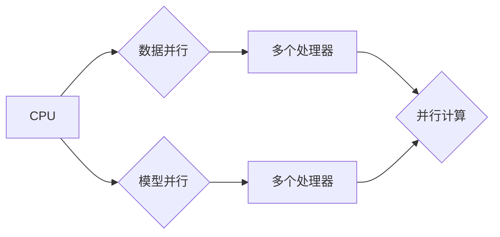

                 

## 并行计算在AI中的应用：从CPU到GPU

> 关键词：并行计算、人工智能、CPU、GPU、深度学习、机器学习、加速计算

## 1. 背景介绍

人工智能（AI）近年来发展迅速，其核心是通过算法学习数据并从中提取知识和模式。然而，许多AI算法，特别是深度学习算法，对计算资源的需求极高。传统的单核CPU架构难以满足这些需求，因此并行计算成为AI发展的重要驱动力。

并行计算是指将一个任务分解成多个子任务，并同时在多个处理器上进行计算，从而缩短计算时间。与单核CPU相比，并行计算架构能够显著提高AI算法的训练速度和推理效率。

## 2. 核心概念与联系

### 2.1 并行计算模型

并行计算模型主要分为两种：

* **数据并行 (Data Parallelism):** 将数据分割成多个部分，分别在不同的处理器上进行计算，最后将结果汇总。
* **模型并行 (Model Parallelism):** 将模型本身分割成多个部分，分别在不同的处理器上进行训练，最后将模型参数融合。

### 2.2 CPU和GPU架构

* **CPU (Central Processing Unit):** 传统的通用处理器，擅长执行顺序性任务，但并行计算能力有限。
* **GPU (Graphics Processing Unit):** 专门用于图形渲染的处理器，拥有大量并行计算单元，非常适合处理海量数据并行计算。

### 2.3 并行计算架构

**Mermaid 流程图:**



## 3. 核心算法原理 & 具体操作步骤

### 3.1 算法原理概述

深度学习算法的核心是神经网络，它由多个层级的神经元组成，每个神经元接收输入信号，进行计算并输出信号。通过训练，神经网络能够学习数据中的模式和关系。

并行计算在深度学习中主要应用于以下两个方面：

* **数据并行:** 将训练数据分割成多个批次，分别在不同的处理器上进行训练，从而加速训练速度。
* **模型并行:** 将神经网络模型分割成多个部分，分别在不同的处理器上进行训练，从而训练更复杂的模型。

### 3.2 算法步骤详解

**数据并行:**

1. 将训练数据分割成多个批次。
2. 将每个批次数据分配到不同的处理器上。
3. 在每个处理器上进行前向传播和反向传播计算。
4. 将每个处理器的梯度信息汇总。
5. 更新模型参数。

**模型并行:**

1. 将神经网络模型分割成多个部分，每个部分负责处理模型的一部分。
2. 将每个模型部分分配到不同的处理器上。
3. 在每个处理器上进行前向传播和反向传播计算。
4. 将每个处理器的梯度信息汇总。
5. 更新模型参数。

### 3.3 算法优缺点

**数据并行:**

* **优点:** 容易实现，并行度高。
* **缺点:** 对于模型规模较小的情况，并行效率可能不高。

**模型并行:**

* **优点:** 可以训练更复杂的模型。
* **缺点:** 实现复杂，需要考虑模型分割和通信问题。

### 3.4 算法应用领域

数据并行和模型并行算法广泛应用于各种AI领域，例如：

* **图像识别:** 识别物体、场景、人脸等。
* **自然语言处理:** 机器翻译、文本摘要、情感分析等。
* **语音识别:** 将语音转换为文本。
* **推荐系统:** 根据用户行为推荐商品或内容。

## 4. 数学模型和公式 & 详细讲解 & 举例说明

### 4.1 数学模型构建

深度学习算法的核心是神经网络，其数学模型可以表示为：

$$
y = f(W^L x^L + b^L)
$$

其中：

* $y$ 是输出结果。
* $x^L$ 是第 $L$ 层的输入。
* $W^L$ 是第 $L$ 层的权重矩阵。
* $b^L$ 是第 $L$ 层的偏置向量。
* $f$ 是激活函数。

### 4.2 公式推导过程

神经网络的训练过程是通过反向传播算法来更新权重和偏置的。反向传播算法的核心是计算梯度，并根据梯度更新权重和偏置。

梯度计算公式为：

$$
\frac{\partial L}{\partial W^L} = \frac{\partial L}{\partial y} \cdot \frac{\partial y}{\partial W^L}
$$

其中：

* $L$ 是损失函数。
* $\frac{\partial L}{\partial y}$ 是损失函数对输出结果的梯度。
* $\frac{\partial y}{\partial W^L}$ 是输出结果对权重矩阵的梯度。

### 4.3 案例分析与讲解

假设我们有一个简单的线性回归模型，其损失函数为均方误差：

$$
L = \frac{1}{2} \sum_{i=1}^{n} (y_i - \hat{y}_i)^2
$$

其中：

* $y_i$ 是真实值。
* $\hat{y}_i$ 是预测值。
* $n$ 是样本数量。

我们可以使用反向传播算法计算梯度，并更新权重和偏置。

## 5. 项目实践：代码实例和详细解释说明

### 5.1 开发环境搭建

* 操作系统: Ubuntu 20.04
* Python 版本: 3.8
* 深度学习框架: TensorFlow 2.0

### 5.2 源代码详细实现

```python
import tensorflow as tf

# 定义模型
model = tf.keras.models.Sequential([
  tf.keras.layers.Dense(units=1, input_shape=[1])
])

# 定义损失函数和优化器
model.compile(loss='mean_squared_error', optimizer='adam')

# 生成训练数据
x_train = tf.random.normal(shape=[100, 1])
y_train = 2 * x_train + 1 + tf.random.normal(shape=[100, 1], mean=0, stddev=0.1)

# 训练模型
model.fit(x_train, y_train, epochs=100)

# 预测结果
predictions = model.predict(x_train)
```

### 5.3 代码解读与分析

* 我们使用 TensorFlow 框架定义了一个简单的线性回归模型。
* 模型只有一个全连接层，输入维度为 1，输出维度为 1。
* 我们使用均方误差作为损失函数，Adam 作为优化器。
* 我们生成了一些随机训练数据，并使用 `model.fit()` 方法训练模型。
* 训练完成后，我们使用 `model.predict()` 方法预测训练数据的输出结果。

### 5.4 运行结果展示

训练完成后，我们可以观察模型的预测结果与真实值的差异。如果模型训练成功，预测结果应该与真实值非常接近。

## 6. 实际应用场景

### 6.1 图像识别

在图像识别领域，并行计算可以加速图像分类、目标检测、图像分割等任务。例如，在训练一个大型图像分类模型时，可以将图像数据并行处理，从而显著缩短训练时间。

### 6.2 自然语言处理

在自然语言处理领域，并行计算可以加速文本分类、机器翻译、文本摘要等任务。例如，在训练一个大型机器翻译模型时，可以将文本数据并行处理，从而提高翻译速度和准确率。

### 6.3 语音识别

在语音识别领域，并行计算可以加速语音转文本任务。例如，在训练一个大型语音识别模型时，可以将语音数据并行处理，从而提高识别速度和准确率。

### 6.4 未来应用展望

随着人工智能技术的不断发展，并行计算在AI领域的应用将更加广泛。例如，在未来，我们可以期待看到：

* 更大规模的AI模型训练，需要更强大的并行计算能力。
* 更复杂的AI算法，需要更灵活的并行计算模型。
* 更广泛的AI应用场景，需要更高效的并行计算框架。

## 7. 工具和资源推荐

### 7.1 学习资源推荐

* **书籍:**
    * 《深度学习》 by Ian Goodfellow, Yoshua Bengio, and Aaron Courville
    * 《动手学深度学习》 by Aurélien Géron
* **在线课程:**
    * Coursera: Deep Learning Specialization
    * Udacity: Deep Learning Nanodegree
* **博客和网站:**
    * TensorFlow Blog: https://blog.tensorflow.org/
    * PyTorch Blog: https://pytorch.org/blog/

### 7.2 开发工具推荐

* **TensorFlow:** https://www.tensorflow.org/
* **PyTorch:** https://pytorch.org/
* **Keras:** https://keras.io/

### 7.3 相关论文推荐

* **AlexNet:** Krizhevsky, A., Sutskever, I., & Hinton, G. E. (2012). Imagenet classification with deep convolutional neural networks. In Advances in neural information processing systems (pp. 1097-1105).
* **ResNet:** He, K., Zhang, X., Ren, S., & Sun, J. (2016). Deep residual learning for image recognition. In Proceedings of the IEEE conference on computer vision and pattern recognition (pp. 770-778).
* **BERT:** Devlin, J., Chang, M. W., Lee, K., & Toutanova, K. (2018). Bert: Pre-training of deep bidirectional transformers for language understanding. arXiv preprint arXiv:1810.04805.

## 8. 总结：未来发展趋势与挑战

### 8.1 研究成果总结

近年来，并行计算在AI领域的应用取得了显著进展，加速了深度学习算法的训练速度和推理效率。

### 8.2 未来发展趋势

未来，并行计算在AI领域的应用将继续发展，主要趋势包括：

* **模型规模的进一步扩大:** 训练更大规模的AI模型需要更强大的并行计算能力。
* **新型并行计算模型的开发:** 需要开发更灵活、更高效的并行计算模型，以适应更复杂的AI算法。
* **硬件加速的进一步发展:** 新一代GPU和TPU等硬件加速器将进一步提升并行计算性能。

### 8.3 面临的挑战

并行计算在AI领域的应用也面临一些挑战，例如：

* **模型并行带来的通信开销:** 模型并行需要处理模型参数之间的通信，这会增加计算开销。
* **数据并行带来的数据不平衡问题:** 数据并行需要将数据均匀分配到不同的处理器上，但数据本身可能存在不平衡问题，需要进行数据预处理和均衡。
* **并行计算的复杂性:** 并行计算的实现和调试相对复杂，需要专业的技术人员。

### 8.4 研究展望

未来，我们需要继续研究并解决并行计算在AI领域的挑战，以推动AI技术的进一步发展。


## 9. 附录：常见问题与解答

### 9.1 如何选择合适的并行计算模型？

选择合适的并行计算模型需要考虑以下因素：

* **模型规模:** 模型规模越大，需要越强的并行计算能力。
* **数据规模:** 数据规模越大，数据并行效果越好。
* **算法特性:** 不同的算法对并行计算的适用性不同。

### 9.2 如何优化并行计算性能？

优化并行计算性能的方法包括：

* **数据并行:** 尽量将数据均匀分配到不同的处理器上。
* **模型并行:** 优化模型参数的通信机制。
* **硬件加速:** 使用GPU或TPU等硬件加速器。

### 9.3 并行计算有哪些安全风险？

并行计算存在以下安全风险：

* **数据泄露:** 并行计算过程中，数据可能在不同的处理器之间进行传输，存在数据泄露风险。
* **恶意代码攻击:** 并行计算环境可能更容易受到恶意代码攻击。

**作者：禅与计算机程序设计艺术 / Zen and the Art of Computer Programming** 


<end_of_turn>

