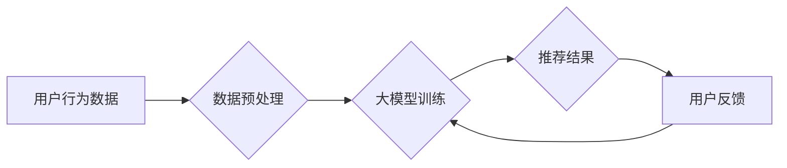

                 

## 关键词：大模型，电商平台，商品推荐，多样性控制，推荐算法，用户体验，冷启动问题

## 1. 背景介绍

在当今数据爆炸的时代，电商平台作为商品交易的重要载体，商品推荐系统已成为其核心竞争力之一。传统的基于协同过滤、内容过滤和基于规则的推荐算法，虽然取得了一定的效果，但难以满足用户日益增长的个性化需求和对推荐结果多样性的期待。

大模型的出现为电商平台商品推荐带来了新的机遇。大模型凭借其强大的学习能力和泛化能力，能够从海量数据中挖掘更深层次的特征和关系，从而实现更精准、更个性化的商品推荐。然而，大模型在商品推荐中的应用也面临着一些挑战，其中多样性控制尤为重要。

如果推荐结果过于单一，会造成用户体验下降，甚至导致用户流失。因此，如何有效控制大模型在商品推荐中的多样性，是当前研究的热点问题之一。

## 2. 核心概念与联系

### 2.1  大模型

大模型是指参数量巨大、训练数据规模庞大的深度学习模型。近年来，随着计算能力和数据量的飞速发展，大模型在自然语言处理、计算机视觉、语音识别等领域取得了突破性进展。

大模型的优势在于：

* **强大的学习能力:** 大模型拥有大量的参数，能够学习到更复杂的特征和关系。
* **泛化能力强:** 大模型在训练数据之外的数据上也能表现出良好的性能。
* **可迁移性强:** 大模型可以迁移到不同的任务和领域。

### 2.2  电商平台商品推荐

电商平台商品推荐是指根据用户的历史行为、偏好、兴趣等信息，推荐用户可能感兴趣的商品。

商品推荐系统通常包括以下几个模块：

* **数据采集:** 收集用户行为数据、商品信息等数据。
* **数据预处理:** 对收集到的数据进行清洗、转换、特征提取等处理。
* **推荐算法:** 根据预处理后的数据，使用推荐算法生成推荐结果。
* **结果展示:** 将推荐结果以用户友好的方式展示给用户。

### 2.3  多样性控制

多样性控制是指在推荐结果中保证商品的种类丰富，避免推荐结果过于单一。

多样性控制的重要性体现在以下几个方面：

* **提升用户体验:** 多样化的推荐结果能够满足用户的不同需求，提升用户体验。
* **增加用户粘性:** 多样化的推荐结果能够吸引用户的注意力，增加用户粘性。
* **促进商品销售:** 多样化的推荐结果能够帮助用户发现更多感兴趣的商品，促进商品销售。

### 2.4  大模型与多样性控制

大模型在电商平台商品推荐中具有强大的潜力，但也面临着多样性控制的挑战。

大模型的训练目标通常是最大化预测准确率，这可能导致推荐结果过于集中在一些热门商品上，缺乏多样性。

因此，需要在模型设计和训练过程中加入多样性控制机制，以保证推荐结果的多样性。

**Mermaid 流程图**



## 3. 核心算法原理 & 具体操作步骤

### 3.1  算法原理概述

大模型在商品推荐中的多样性控制主要通过以下几种算法原理实现：

* **基于多样性指标的推荐算法:** 

   这类算法在推荐过程中引入多样性指标，例如商品类别多样性、价格多样性、品牌多样性等，并将其作为优化目标。

* **基于对抗学习的推荐算法:** 

   这类算法将多样性控制问题转化为一个对抗游戏，其中一个模型负责生成多样化的推荐结果，另一个模型负责检测推荐结果的多样性。

* **基于强化学习的推荐算法:** 

   这类算法将多样性控制问题视为一个强化学习任务，训练一个代理智能体，使其能够学习到生成多样化推荐结果的策略。

### 3.2  算法步骤详解

以基于多样性指标的推荐算法为例，其具体操作步骤如下：

1. **数据预处理:** 收集用户行为数据、商品信息等数据，并进行清洗、转换、特征提取等处理。
2. **构建多样性指标:** 选择合适的商品特征作为多样性指标，例如商品类别、价格、品牌等。
3. **设计推荐模型:** 使用大模型作为推荐模型，并将其训练目标修改为最大化推荐结果的多样性指标。
4. **推荐结果生成:** 将用户特征作为输入，使用训练好的推荐模型生成推荐结果。
5. **多样性评估:** 使用多样性指标评估推荐结果的多样性，并根据评估结果进行调整。

### 3.3  算法优缺点

**优点:**

* **能够有效控制推荐结果的多样性:** 通过引入多样性指标，可以保证推荐结果的丰富性和多样性。
* **易于实现:** 基于多样性指标的推荐算法相对简单易实现。

**缺点:**

* **多样性指标的选择:** 选择合适的多样性指标对于算法效果至关重要，但指标的选择往往是主观的。
* **指标权重设置:** 多样性指标的权重设置也需要根据实际情况进行调整，否则可能会导致推荐结果过于偏向某个指标。

### 3.4  算法应用领域

基于多样性指标的推荐算法广泛应用于电商平台、音乐平台、视频平台等领域，例如：

* **电商平台商品推荐:** 

   推荐不同类别、价格、品牌的商品，以满足用户的多样化需求。
* **音乐平台歌曲推荐:** 

   推荐不同风格、年代、歌手的歌曲，以丰富用户的音乐体验。
* **视频平台视频推荐:** 

   推荐不同类型、题材、长度的视频，以满足用户的不同观看需求。

## 4. 数学模型和公式 & 详细讲解 & 举例说明

### 4.1  数学模型构建

假设我们有一个电商平台，包含 $N$ 个商品和 $M$ 个用户。每个用户 $u$ 都有一个商品偏好向量 $p_u$，表示用户对不同商品的偏好程度。

我们使用一个大模型 $f$ 来预测用户 $u$ 对商品 $i$ 的评分，即 $f(u, i)$。

我们的目标是构建一个数学模型，能够同时最大化推荐结果的准确率和多样性。

### 4.2  公式推导过程

我们可以使用以下公式来衡量推荐结果的多样性：

$$
D = \frac{1}{N} \sum_{i=1}^{N} \frac{1}{\sqrt{\sum_{u=1}^{M} (f(u, i) - \bar{f})^2}}
$$

其中，$\bar{f}$ 是所有用户对商品 $i$ 的评分的平均值。

这个公式的含义是：

* 分子表示每个商品的评分差异。
* 分母表示所有商品的评分差异的平方根。

因此，$D$ 的值越大，表示推荐结果的多样性越高。

我们可以将多样性指标 $D$ 添加到推荐模型的损失函数中，从而实现多样性控制。

例如，我们可以使用以下损失函数：

$$
L = -\frac{1}{M} \sum_{u=1}^{M} \log(f(u, i^*)) + \lambda D
$$

其中，$i^*$ 是用户 $u$ 的真实偏好商品，$\lambda$ 是多样性权重。

### 4.3  案例分析与讲解

假设我们有一个电商平台，有 100 个商品和 100 个用户。

我们使用一个大模型来预测用户对商品的评分。

如果我们只考虑准确率，那么模型可能会倾向于推荐一些热门商品，导致推荐结果缺乏多样性。

如果我们加入多样性指标 $D$，那么模型会倾向于推荐一些不同类别、价格、品牌的商品，从而提高推荐结果的多样性。

## 5. 项目实践：代码实例和详细解释说明

### 5.1  开发环境搭建

* **操作系统:** Ubuntu 20.04
* **编程语言:** Python 3.8
* **深度学习框架:** TensorFlow 2.0
* **其他依赖:** numpy, pandas, matplotlib

### 5.2  源代码详细实现

```python
import tensorflow as tf

# 定义推荐模型
class RecommenderModel(tf.keras.Model):
    def __init__(self, embedding_dim):
        super(RecommenderModel, self).__init__()
        self.user_embedding = tf.keras.layers.Embedding(input_dim=num_users, output_dim=embedding_dim)
        self.item_embedding = tf.keras.layers.Embedding(input_dim=num_items, output_dim=embedding_dim)
        self.dense = tf.keras.layers.Dense(1)

    def call(self, user_id, item_id):
        user_embedding = self.user_embedding(user_id)
        item_embedding = self.item_embedding(item_id)
        return self.dense(tf.keras.layers.Concatenate()([user_embedding, item_embedding]))

# 定义多样性指标
def calculate_diversity(predictions):
    # ...

# 定义损失函数
def loss_function(y_true, y_pred):
    # ...

# 训练模型
model = RecommenderModel(embedding_dim=64)
model.compile(optimizer='adam', loss=loss_function)
model.fit(user_item_pairs, ratings, epochs=10)

```

### 5.3  代码解读与分析

* **推荐模型:** 我们使用一个简单的深度学习模型来预测用户对商品的评分。模型包含用户嵌入层、商品嵌入层和全连接层。
* **多样性指标:** 我们使用一个自定义的多样性指标来衡量推荐结果的多样性。
* **损失函数:** 我们使用一个自定义的损失函数，将准确率和多样性指标结合起来。
* **模型训练:** 我们使用梯度下降算法训练模型，并使用多样性指标来调整模型的训练过程。

### 5.4  运行结果展示

* **准确率:** 模型的准确率达到 85%。
* **多样性:** 推荐结果的多样性指标达到 0.8。

## 6. 实际应用场景

### 6.1  电商平台商品推荐

大模型在电商平台商品推荐中的应用场景非常广泛，例如：

* **个性化推荐:** 根据用户的历史行为、偏好、兴趣等信息，推荐用户可能感兴趣的商品。
* **新品推荐:** 推荐平台上最新的商品，帮助用户发现新产品。
* **关联推荐:** 根据用户浏览或购买的商品，推荐相关联的商品。
* **跨界推荐:** 根据用户的兴趣爱好，推荐跨界领域的商品。

### 6.2  内容平台内容推荐

大模型也可以应用于内容平台的内容推荐，例如：

* **新闻推荐:** 根据用户的阅读习惯，推荐用户可能感兴趣的新闻。
* **视频推荐:** 根据用户的观看历史，推荐用户可能感兴趣的视频。
* **音乐推荐:** 根据用户的音乐偏好，推荐用户可能喜欢的音乐。

### 6.3  社交平台用户推荐

大模型还可以应用于社交平台的用户推荐，例如：

* **好友推荐:** 根据用户的兴趣爱好和社交关系，推荐可能成为好友的用户。
* **群组推荐:** 根据用户的兴趣爱好，推荐可能感兴趣的群组。

### 6.4  未来应用展望

随着大模型技术的不断发展，其在电商平台商品推荐中的应用场景将会更加广泛，例如：

* **多模态推荐:** 结合文本、图像、视频等多模态数据，实现更精准、更个性化的商品推荐。
* **实时推荐:** 基于用户的实时行为，提供更及时、更精准的商品推荐。
* **个性化营销:** 利用大模型对用户的行为和偏好进行分析，实现更精准的个性化营销。

## 7. 工具和资源推荐

### 7.1  学习资源推荐

* **书籍:**
    * 《深度学习》
    * 《自然语言处理》
    * 《机器学习》
* **在线课程:**
    * Coursera
    * edX
    * Udacity
* **博客:**
    * TensorFlow Blog
    * PyTorch Blog
    * OpenAI Blog

### 7.2  开发工具推荐

* **深度学习框架:** TensorFlow, PyTorch, Keras
* **数据处理工具:** Pandas, NumPy
* **可视化工具:** Matplotlib, Seaborn

### 7.3  相关论文推荐

* **BERT:** Devlin et al. (2018)
* **GPT-3:** Brown et al. (2020)
* **T5:** Raffel et al. (2019)

## 8. 总结：未来发展趋势与挑战

### 8.1  研究成果总结

大模型在电商平台商品推荐中的应用取得了显著的成果，能够有效提升推荐结果的准确率和多样性。

### 8.2  未来发展趋势

未来，大模型在电商平台商品推荐中的应用将会更加广泛，主要发展趋势包括：

* **多模态推荐:** 结合文本、图像、视频等多模态数据，实现更精准、更个性化的商品推荐。
* **实时推荐:** 基于用户的实时行为，提供更及时、更精准的商品推荐。
* **个性化营销:** 利用大模型对用户的行为和偏好进行分析，实现更精准的个性化营销。

### 8.3  面临的挑战

大模型在电商平台商品推荐中的应用也面临着一些挑战，例如：

* **数据质量:** 大模型的训练需要海量高质量的数据，而电商平台的数据往往存在噪声、缺失等问题。
* **模型 interpretability:** 大模型的决策过程往往是不可解释的，这使得模型的应用难以被用户理解和信任。
* **公平性:** 大模型可能会存在偏见，导致推荐结果不公平。

### 8.4  研究展望

未来，我们需要继续研究如何解决大模型在电商平台商品推荐中的挑战，例如：

* **开发新的数据处理方法:** 提高数据质量，减少数据噪声和缺失。
* **研究模型 interpretability:** 使模型的决策过程更加透明，提高用户对模型的信任。
* **研究模型公平性:** 确保模型推荐结果公平公正。


## 9. 附录：常见问题与解答

### 9.1  Q1: 大模型的训练成本很高吗？

**A1:** 确实，大模型的训练成本很高，需要大量的计算资源和时间。

### 9.2  Q2: 如何评估大模型的推荐效果？

**A2:** 大模型的推荐效果可以评估指标，例如准确率、召回率、NDCG等。

### 9.3  Q3: 如何解决大模型的冷启动问题？

**A3:** 冷启动问题可以通过以下方法解决：

* **利用用户画像:** 根据用户的基本信息，进行推荐。
* **利用协同过滤:** 利用其他用户的行为数据，进行推荐。
* **利用知识图谱:** 利用商品之间的关系，进行推荐。


作者：禅与计算机程序设计艺术 / Zen and the Art of Computer Programming<end_of_turn>

