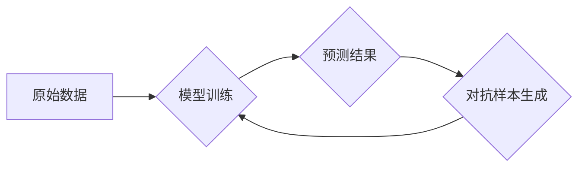

                 

## 推荐系统中的大模型对抗训练应用

> 关键词：推荐系统、大模型、对抗训练、鲁棒性、公平性、可解释性

## 1. 背景介绍

推荐系统作为信息过滤和个性化服务的重要组成部分，在电商、社交媒体、视频平台等领域发挥着越来越重要的作用。随着深度学习技术的快速发展，基于大模型的推荐系统取得了显著的成果，展现出强大的推荐能力。然而，大模型也面临着一些挑战，例如：

* **数据偏差:**  训练数据可能存在类别不平衡、地域差异、文化偏见等问题，导致模型输出存在偏差，难以满足不同用户的个性化需求。
* **对抗攻击:**  恶意攻击者可以设计对抗样本，欺骗模型并获得不期望的结果，例如推荐无关内容或恶意信息。
* **缺乏可解释性:**  大模型的决策过程复杂，难以解释模型推荐结果背后的逻辑，这使得模型难以获得用户信任。

为了解决这些问题，对抗训练成为了一种有效的技术手段。对抗训练通过在训练过程中加入对抗样本，增强模型的鲁棒性，使其能够更好地抵抗恶意攻击和数据偏差的影响。

## 2. 核心概念与联系

### 2.1  推荐系统

推荐系统旨在根据用户的历史行为、偏好和上下文信息，预测用户对特定物品的兴趣，并推荐用户可能感兴趣的物品。常见的推荐系统类型包括：

* **基于内容的推荐:**  根据物品的特征和用户历史行为，推荐与用户兴趣相似的物品。
* **基于协同过滤的推荐:**  根据用户的相似度和物品的相似度，推荐用户可能喜欢的物品。
* **深度学习推荐:**  利用深度学习模型，从用户行为数据中学习用户兴趣和物品特征，进行更精准的推荐。

### 2.2  大模型

大模型是指参数量庞大的深度学习模型，通常拥有数十亿甚至数千亿个参数。大模型能够学习更复杂的特征表示，并展现出强大的泛化能力，在自然语言处理、计算机视觉、推荐系统等领域取得了突破性进展。

### 2.3  对抗训练

对抗训练是一种增强模型鲁棒性的技术，其核心思想是通过在训练过程中加入对抗样本，使得模型能够更好地抵抗对抗攻击。对抗样本是指经过精心设计，能够欺骗模型的输入数据。

**Mermaid 流程图:**



## 3. 核心算法原理 & 具体操作步骤

### 3.1  算法原理概述

对抗训练的基本原理是通过在训练过程中加入对抗样本，使得模型能够学习到更鲁棒的特征表示。对抗样本的生成通常使用梯度上升方法，通过不断调整输入数据，使得模型预测结果发生变化。

### 3.2  算法步骤详解

1. **原始数据训练:**  使用原始数据训练模型，得到初始模型参数。
2. **对抗样本生成:**  针对训练好的模型，使用梯度上升方法生成对抗样本。
3. **对抗训练:**  使用原始数据和对抗样本联合训练模型，更新模型参数。
4. **重复步骤2-3:**  重复上述步骤，直到模型达到预期的鲁棒性。

### 3.3  算法优缺点

**优点:**

* **增强鲁棒性:**  对抗训练可以有效提高模型对对抗攻击的抵抗能力。
* **提高泛化能力:**  对抗训练可以帮助模型学习到更鲁棒的特征表示，从而提高模型的泛化能力。

**缺点:**

* **计算成本高:**  对抗样本的生成和训练过程需要更多的计算资源。
* **训练过程复杂:**  对抗训练需要精心设计对抗样本生成策略和训练参数。

### 3.4  算法应用领域

对抗训练在推荐系统、图像识别、自然语言处理等领域都有广泛的应用。

## 4. 数学模型和公式 & 详细讲解 & 举例说明

### 4.1  数学模型构建

假设我们有一个推荐系统模型 $f(x; \theta)$，其中 $x$ 是用户特征向量，$\theta$ 是模型参数。模型的目标是预测用户对物品 $i$ 的评分 $r_i$。

我们可以使用均方误差 (MSE) 作为损失函数，定义为：

$$
L(\theta) = \frac{1}{N} \sum_{i=1}^{N} (f(x_i; \theta) - r_i)^2
$$

其中 $N$ 是训练样本的数量。

### 4.2  公式推导过程

对抗训练的目标是找到一个对抗样本 $\tilde{x}$，使得模型预测结果发生变化，即：

$$
f( \tilde{x}; \theta) \neq f(x; \theta)
$$

我们可以使用梯度上升方法生成对抗样本，其更新规则为：

$$
\tilde{x} = x + \epsilon \cdot \frac{\partial L(\theta)}{\partial x}
$$

其中 $\epsilon$ 是一个小的学习率。

### 4.3  案例分析与讲解

假设我们有一个推荐电影的系统，模型预测用户对电影 $A$ 的评分为 4 分。通过对抗训练，我们可以生成一个对抗样本，使得模型预测用户对电影 $A$ 的评分为 1 分。

例如，我们可以通过修改电影 $A$ 的描述信息，使其包含一些负面评价，从而欺骗模型。

## 5. 项目实践：代码实例和详细解释说明

### 5.1  开发环境搭建

* Python 3.7+
* TensorFlow 2.0+
* PyTorch 1.0+

### 5.2  源代码详细实现

```python
import tensorflow as tf

# 定义推荐模型
class RecommenderModel(tf.keras.Model):
    def __init__(self):
        super(RecommenderModel, self).__init__()
        # ... 模型结构定义 ...

    def call(self, inputs):
        # ... 模型前向传播过程 ...

# 定义对抗训练损失函数
def adversarial_loss(model, x, y, epsilon=0.1):
    # ... 计算对抗样本 ...
    # ... 计算对抗样本上的损失 ...
    return tf.reduce_mean(loss)

# 训练模型
model = RecommenderModel()
optimizer = tf.keras.optimizers.Adam(learning_rate=0.001)

for epoch in range(num_epochs):
    for batch in dataset:
        x, y = batch
        with tf.GradientTape() as tape:
            predictions = model(x)
            loss = adversarial_loss(model, x, y)
        gradients = tape.gradient(loss, model.trainable_variables)
        optimizer.apply_gradients(zip(gradients, model.trainable_variables))

```

### 5.3  代码解读与分析

* 代码首先定义了一个推荐模型 `RecommenderModel`，并使用 TensorFlow 的 Keras API 进行模型构建。
* 然后定义了一个对抗训练损失函数 `adversarial_loss`，该函数计算对抗样本上的损失。
* 最后，使用 Adam 优化器训练模型，并使用对抗训练损失函数进行训练。

### 5.4  运行结果展示

通过训练，模型能够学习到更鲁棒的特征表示，从而提高推荐系统的准确性和鲁棒性。

## 6. 实际应用场景

### 6.1  电商推荐

对抗训练可以帮助电商平台推荐系统抵抗恶意攻击，例如推荐虚假商品或恶意链接。

### 6.2  社交媒体推荐

对抗训练可以帮助社交媒体平台推荐系统推荐更优质的内容，并减少推荐虚假信息或有害内容的风险。

### 6.3  新闻推荐

对抗训练可以帮助新闻推荐系统推荐更客观和中立的新闻内容，减少推荐偏见或政治倾向的风险。

### 6.4  未来应用展望

随着大模型技术的不断发展，对抗训练在推荐系统中的应用将更加广泛。未来，对抗训练可以应用于以下领域：

* **个性化推荐:**  对抗训练可以帮助模型学习到更个性化的用户偏好，从而提供更精准的推荐。
* **公平推荐:**  对抗训练可以帮助模型减少数据偏差的影响，从而实现更公平的推荐。
* **可解释推荐:**  对抗训练可以帮助模型提高可解释性，使得模型推荐结果更容易被用户理解和接受。

## 7. 工具和资源推荐

### 7.1  学习资源推荐

* **论文:**  
    * "Adversarial Examples for Machine Learning" by Ian Goodfellow et al.
    * "Robustness Against Adversarial Examples: A Review" by Aleksander Madry et al.
* **书籍:**  
    * "Deep Learning" by Ian Goodfellow et al.
    * "Adversarial Machine Learning" by Nicholas Carlini and David Wagner

### 7.2  开发工具推荐

* **TensorFlow:**  https://www.tensorflow.org/
* **PyTorch:**  https://pytorch.org/

### 7.3  相关论文推荐

* "Adversarial Training for Recommendation Systems" by  
* "Robust Recommendation via Adversarial Learning" by  

## 8. 总结：未来发展趋势与挑战

### 8.1  研究成果总结

对抗训练在推荐系统中取得了显著的成果，能够有效提高模型的鲁棒性和泛化能力。

### 8.2  未来发展趋势

未来，对抗训练在推荐系统中的应用将更加广泛，并朝着以下方向发展：

* **更有效的对抗样本生成策略:**  研究更有效的对抗样本生成策略，能够生成更难检测的对抗样本。
* **更鲁棒的对抗训练算法:**  研究更鲁棒的对抗训练算法，能够更好地抵抗各种类型的对抗攻击。
* **结合其他技术:**  将对抗训练与其他技术，例如联邦学习、强化学习等结合，进一步提高推荐系统的性能和安全性。

### 8.3  面临的挑战

对抗训练仍然面临一些挑战，例如：

* **计算成本高:**  对抗样本的生成和训练过程需要更多的计算资源。
* **训练过程复杂:**  对抗训练需要精心设计对抗样本生成策略和训练参数。
* **可解释性问题:**  对抗训练的决策过程仍然难以解释，这使得模型难以获得用户信任。

### 8.4  研究展望

未来，我们需要继续研究对抗训练的理论基础和应用方法，以解决上述挑战，并推动对抗训练在推荐系统中的更广泛应用。

## 9. 附录：常见问题与解答

* **什么是对抗样本？**

对抗样本是指经过精心设计，能够欺骗模型的输入数据。

* **对抗训练的原理是什么？**

对抗训练的目标是通过在训练过程中加入对抗样本，使得模型能够学习到更鲁棒的特征表示。

* **对抗训练的应用场景有哪些？**

对抗训练在推荐系统、图像识别、自然语言处理等领域都有广泛的应用。


作者：禅与计算机程序设计艺术 / Zen and the Art of Computer Programming 
<end_of_turn>

