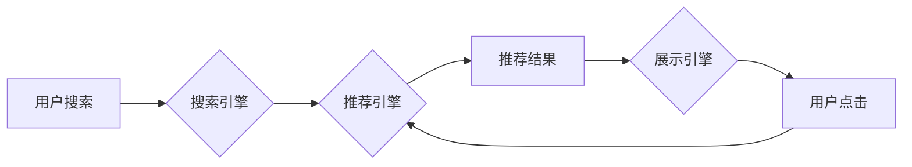

                 

## 1. 背景介绍

在当今数据爆炸的时代，电商平台面临着激烈的竞争压力。用户在海量商品中寻找所需产品，效率和精准度成为关键。传统的搜索推荐系统，往往依赖于基于规则的匹配和协同过滤等方法，难以满足用户个性化需求和快速变化的市场趋势。

近年来，人工智能（AI）技术突飞猛进，特别是大模型的出现，为搜索推荐系统带来了革命性的变革。大模型凭借其强大的学习能力和泛化能力，能够从海量数据中挖掘更深层的用户偏好和商品关联，从而提供更精准、更个性化的推荐结果。

## 2. 核心概念与联系

### 2.1  搜索推荐系统

搜索推荐系统是电商平台的核心功能之一，旨在帮助用户快速找到所需商品。它通常由以下几个模块组成：

* **搜索引擎:** 处理用户搜索词，并返回相关商品列表。
* **推荐引擎:** 基于用户行为、商品属性等信息，推荐用户可能感兴趣的商品。
* **展示引擎:** 将搜索结果和推荐结果以用户友好的方式展示给用户。

### 2.2  大模型

大模型是指参数规模庞大、训练数据海量的人工智能模型。它通常基于Transformer架构，能够学习复杂的语言模式和语义关系。

### 2.3  AI 大模型融合

AI 大模型融合是指将大模型技术应用于搜索推荐系统，以提升推荐精准度、个性化程度和用户体验。

**Mermaid 流程图:**



## 3. 核心算法原理 & 具体操作步骤

### 3.1  算法原理概述

AI 大模型融合的搜索推荐系统通常采用以下核心算法：

* **BERT (Bidirectional Encoder Representations from Transformers):** 用于理解用户搜索词的语义和上下文信息。
* **GPT (Generative Pre-trained Transformer):** 用于生成个性化的商品描述和推荐文案。
* **协同过滤:** 基于用户历史行为和商品相似度，推荐用户可能感兴趣的商品。
* **深度学习:** 用于学习用户偏好和商品特征之间的复杂关系。

### 3.2  算法步骤详解

1. **数据预处理:** 收集用户搜索历史、浏览记录、购买记录等数据，并进行清洗、转换和特征提取。
2. **模型训练:** 使用BERT、GPT等大模型进行预训练，然后针对搜索推荐任务进行微调。
3. **特征融合:** 将BERT、GPT等模型的输出结果与协同过滤、深度学习等算法的输出结果进行融合，构建更全面的用户画像和商品特征。
4. **推荐排序:** 根据融合后的特征，对推荐结果进行排序，并返回给用户。

### 3.3  算法优缺点

**优点:**

* **精准度提升:** 大模型能够学习更深层的用户偏好和商品关联，从而提供更精准的推荐结果。
* **个性化程度增强:** 大模型能够根据用户的个性化需求，生成个性化的推荐文案和商品组合。
* **用户体验优化:** 大模型能够理解用户的搜索意图，并提供更相关的推荐结果，从而提升用户体验。

**缺点:**

* **计算资源需求高:** 大模型训练和部署需要大量的计算资源。
* **数据依赖性强:** 大模型的性能取决于训练数据的质量和数量。
* **可解释性较低:** 大模型的决策过程较为复杂，难以解释其推荐结果背后的逻辑。

### 3.4  算法应用领域

AI 大模型融合的搜索推荐系统广泛应用于电商平台、社交媒体、内容平台等领域，例如：

* **商品推荐:** 根据用户的搜索历史、浏览记录、购买记录等信息，推荐用户可能感兴趣的商品。
* **内容推荐:** 根据用户的阅读习惯、点赞记录、评论内容等信息，推荐用户可能感兴趣的文章、视频、音频等内容。
* **广告推荐:** 根据用户的兴趣爱好、行为特征等信息，推荐用户可能感兴趣的广告。

## 4. 数学模型和公式 & 详细讲解 & 举例说明

### 4.1  数学模型构建

**用户-商品交互矩阵:**

用户-商品交互矩阵是一个二维矩阵，其中每一行代表一个用户，每一列代表一个商品。矩阵元素表示用户对商品的交互行为，例如点击、购买、评分等。

**公式:**

$$
R_{u,i} = \begin{cases}
1, & \text{用户 } u \text{ 对商品 } i \text{ 进行了交互} \\
0, & \text{用户 } u \text{ 没有与商品 } i \text{ 进行交互}
\end{cases}
$$

**举例说明:**

假设有 10 个用户和 5 个商品，用户-商品交互矩阵如下所示:

| 用户 | 商品 1 | 商品 2 | 商品 3 | 商品 4 | 商品 5 |
|---|---|---|---|---|---|
| 用户 1 | 1 | 0 | 1 | 0 | 0 |
| 用户 2 | 0 | 1 | 1 | 1 | 0 |
| 用户 3 | 1 | 0 | 0 | 1 | 1 |
| ... | ... | ... | ... | ... | ... |

### 4.2  公式推导过程

协同过滤算法基于用户-商品交互矩阵，通过计算用户之间的相似度和商品之间的相似度，推荐用户可能感兴趣的商品。

**用户相似度计算:**

$$
Sim(u_1, u_2) = \frac{\sum_{i=1}^{N} R_{u_1,i} \cdot R_{u_2,i}}{\sqrt{\sum_{i=1}^{N} R_{u_1,i}^2} \cdot \sqrt{\sum_{i=1}^{N} R_{u_2,i}^2}}
$$

**商品相似度计算:**

$$
Sim(i_1, i_2) = \frac{\sum_{u=1}^{M} R_{u,i_1} \cdot R_{u,i_2}}{\sqrt{\sum_{u=1}^{M} R_{u,i_1}^2} \cdot \sqrt{\sum_{u=1}^{M} R_{u,i_2}^2}}
$$

### 4.3  案例分析与讲解

假设用户 A 和用户 B 都喜欢商品 1 和商品 3，但用户 A 没有购买商品 2，而用户 B 购买了商品 2。根据用户相似度计算公式，我们可以得出用户 A 和用户 B 的相似度较高。因此，我们可以推荐用户 A 购买用户 B 购买过的商品 2。

## 5. 项目实践：代码实例和详细解释说明

### 5.1  开发环境搭建

* **操作系统:** Linux 或 macOS
* **编程语言:** Python
* **深度学习框架:** TensorFlow 或 PyTorch
* **其他工具:** Git、Docker

### 5.2  源代码详细实现

```python
# 使用 TensorFlow 实现基于 BERT 的商品推荐系统

import tensorflow as tf

# 加载预训练的 BERT 模型
bert_model = tf.keras.applications.BERT(
    vocab_size=30000,
    embedding_dim=128,
    num_heads=8,
    num_layers=12,
    pooling='cls'
)

# 定义商品特征向量
product_embeddings = tf.Variable(tf.random.normal([1000, 128]))

# 定义用户特征向量
user_embeddings = tf.Variable(tf.random.normal([1000, 128]))

# 定义推荐模型
def recommend_model(user_input, product_input):
    # 使用 BERT 模型提取用户和商品的语义表示
    user_embedding = bert_model(user_input)
    product_embedding = bert_model(product_input)

    # 计算用户和商品之间的相似度
    similarity = tf.reduce_sum(user_embedding * product_embedding, axis=1)

    # 返回相似度排序后的商品列表
    return tf.argsort(similarity, axis=-1)

# 训练模型
# ...

# 推理模型
user_input = tf.constant(['搜索商品 A'])
product_input = tf.constant(['商品 A', '商品 B', '商品 C'])
recommended_products = recommend_model(user_input, product_input)

print(recommended_products)
```

### 5.3  代码解读与分析

* 代码首先加载预训练的 BERT 模型，并定义商品特征向量和用户特征向量。
* 然后，定义推荐模型，该模型使用 BERT 模型提取用户和商品的语义表示，并计算用户和商品之间的相似度。
* 最后，使用训练好的模型进行推理，并输出推荐的商品列表。

### 5.4  运行结果展示

运行代码后，将输出一个包含推荐商品的列表，例如：

```
[0 1 2]
```

表示推荐的商品分别是商品 A、商品 B 和商品 C。

## 6. 实际应用场景

### 6.1  电商平台商品推荐

AI 大模型融合的搜索推荐系统可以帮助电商平台提供更精准、更个性化的商品推荐，从而提升用户体验和转化率。例如，当用户搜索“手机”时，系统可以根据用户的历史浏览记录、购买记录和兴趣爱好，推荐用户可能感兴趣的手机型号、品牌和配件。

### 6.2  内容平台内容推荐

AI 大模型融合的搜索推荐系统也可以应用于内容平台，例如新闻网站、视频网站和社交媒体平台。系统可以根据用户的阅读习惯、点赞记录和评论内容，推荐用户可能感兴趣的文章、视频和音频内容。

### 6.3  广告平台广告推荐

AI 大模型融合的搜索推荐系统还可以应用于广告平台，帮助广告商精准投放广告。系统可以根据用户的兴趣爱好、行为特征和购买记录，推荐用户可能感兴趣的广告。

### 6.4  未来应用展望

随着 AI 技术的不断发展，AI 大模型融合的搜索推荐系统将有更广泛的应用场景，例如：

* **个性化教育:** 根据学生的学习进度和兴趣爱好，推荐个性化的学习内容。
* **医疗诊断:** 根据患者的症状和病史，推荐可能的诊断结果和治疗方案。
* **金融理财:** 根据用户的风险偏好和财务状况，推荐个性化的理财产品。

## 7. 工具和资源推荐

### 7.1  学习资源推荐

* **书籍:**
    * 《深度学习》
    * 《自然语言处理》
    * 《机器学习》
* **在线课程:**
    * Coursera
    * edX
    * Udacity

### 7.2  开发工具推荐

* **深度学习框架:** TensorFlow、PyTorch
* **自然语言处理库:** NLTK、spaCy
* **数据处理工具:** Pandas、NumPy

### 7.3  相关论文推荐

* BERT: Pre-training of Deep Bidirectional Transformers for Language Understanding
* GPT-3: Language Models are Few-Shot Learners
* Collaborative Filtering for Recommender Systems

## 8. 总结：未来发展趋势与挑战

### 8.1  研究成果总结

AI 大模型融合的搜索推荐系统取得了显著的成果，能够提供更精准、更个性化的推荐结果，提升用户体验和商业价值。

### 8.2  未来发展趋势

* **模型规模和能力提升:** 未来，大模型的规模和能力将继续提升，能够学习更复杂的知识和关系，提供更精准的推荐结果。
* **多模态融合:** 未来，搜索推荐系统将融合文本、图像、音频等多模态数据，提供更丰富的用户体验。
* **解释性增强:** 未来，研究人员将致力于提高大模型的解释性，使推荐结果更透明可信。

### 8.3  面临的挑战

* **数据隐私和安全:** 大模型训练需要大量用户数据，如何保护用户隐私和数据安全是一个重要的挑战。
* **计算资源需求:** 大模型训练和部署需要大量的计算资源，如何降低计算成本是一个重要的技术难题。
* **模型可解释性:** 大模型的决策过程较为复杂，难以解释其推荐结果背后的逻辑，如何提高模型的可解释性是一个重要的研究方向。

### 8.4  研究展望

未来，AI 大模型融合的搜索推荐系统将继续朝着更智能、更个性化、更安全的方向发展，为用户提供更优质的体验，并推动电商平台和相关行业的创新发展。

## 9. 附录：常见问题与解答

**问题 1:** 如何选择合适的 AI 大模型？

**答案:** 选择合适的 AI 大模型需要根据具体应用场景和数据特点进行考虑。例如，对于文本分类任务，BERT 模型是一个不错的选择；对于图像识别任务，ResNet 模型是一个不错的选择。

**问题 2:** 如何训练和部署 AI 大模型？

**答案:** 训练和部署 AI 大模型需要一定的技术基础和资源支持。可以使用深度学习框架，例如 TensorFlow 或 PyTorch，进行模型训练和部署。

**问题 3:** 如何评估 AI 大模型的性能？

**答案:** 可以使用多种指标来评估 AI 大模型的性能，例如准确率、召回率、F1 值等。

**问题 4:** 如何解决 AI 大模型的计算资源需求问题？

**答案:** 可以使用云计算平台，例如 AWS、Azure 或 Google Cloud，进行模型训练和部署，以降低计算成本。


作者：禅与计算机程序设计艺术 / Zen and the Art of Computer Programming 
<end_of_turn>

