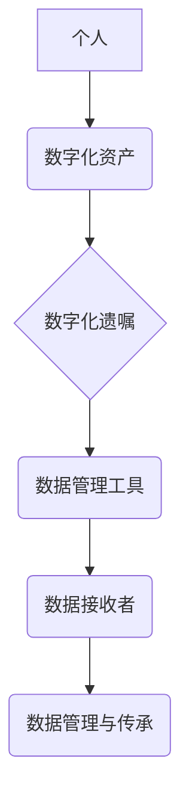

                 

##  数字化遗产规划创业：生命终期的数据管理

> 关键词：数字化遗产、数据管理、生命终期、隐私保护、数据继承、区块链、人工智能、遗嘱管理、法律法规

### 1. 背景介绍

随着科技的飞速发展，我们的生活越来越数字化。从社交媒体账号到银行账户，从电子邮箱到个人照片，我们几乎所有重要信息都存储在数字世界中。然而，当我们离世时，这些数字资产会发生什么？如何确保它们能够安全、有效地传承给下一代？

数字化遗产规划，即在生命终期对数字资产进行规划和管理，成为一个越来越重要的议题。它涉及到个人隐私保护、数据继承、法律法规等多个方面，需要我们认真思考和准备。

### 2. 核心概念与联系

**2.1 数字化遗产的概念**

数字化遗产是指个人在数字化生活中积累的所有数据资产，包括但不限于：

* **社交媒体账号:** Facebook、Twitter、Instagram 等
* **电子邮箱:** Gmail、Outlook 等
* **云存储服务:** Google Drive、Dropbox 等
* **在线购物账户:** Amazon、淘宝等
* **金融账户:** 银行账户、投资账户等
* **个人文件:** 文档、照片、视频等

**2.2 数据管理与传承的挑战**

数字化遗产的管理和传承面临着诸多挑战：

* **隐私保护:** 个人数据在传承过程中可能面临泄露和滥用风险。
* **数据访问权限:**  如何确保指定的人能够访问和管理这些数据？
* **数据格式兼容性:**  随着技术的不断发展，数据格式可能会发生变化，如何确保数据能够长期保存和访问？
* **法律法规:**  不同国家和地区对数字化遗产的法律法规有所不同，需要了解相关法律规定。

**2.3 数字化遗产规划的解决方案**

数字化遗产规划旨在解决这些挑战，通过以下方式实现数据管理和传承：

* **制定数字化遗嘱:** 明确指定数据资产的接收者、管理方式和使用权限。
* **使用数据管理工具:**  帮助用户管理和备份数据，并设置访问权限。
* **寻求专业机构的帮助:**  律师、金融顾问等专业人士可以提供专业的指导和服务。

**2.4  核心概念架构**



### 3. 核心算法原理 & 具体操作步骤

**3.1 算法原理概述**

数字化遗产规划的核心算法原理是基于数据加密、身份验证和访问控制的。通过加密技术保护数据隐私，身份验证机制确保只有授权用户才能访问数据，访问控制策略则规定了不同用户对数据的操作权限。

**3.2 算法步骤详解**

1. **数据收集:** 收集用户的数字化资产清单，包括账号信息、密码、文件路径等。
2. **数据加密:** 使用强加密算法对用户数据进行加密，生成加密后的数据文件。
3. **身份验证:**  用户需要通过身份验证机制，例如生物识别或多因素认证，来证明其身份。
4. **访问控制:** 根据用户身份和权限，控制用户对数据的访问和操作权限。
5. **数据传承:**  根据用户制定的数字化遗嘱，将加密后的数据文件传递给指定的数据接收者。

**3.3 算法优缺点**

**优点:**

* **提高数据安全性:** 加密技术可以有效保护数据隐私，防止未经授权的访问和泄露。
* **确保数据完整性:** 数据加密可以防止数据被篡改，保证数据的完整性。
* **实现数据可控性:** 用户可以根据自己的意愿指定数据接收者和管理方式，实现对数据的可控性。

**缺点:**

* **技术复杂性:**  数据加密和身份验证技术相对复杂，需要专业的技术人员进行实施。
* **成本较高:**  数据加密和安全管理需要一定的成本投入。
* **用户体验:**  身份验证和访问控制可能会增加用户的操作复杂度。

**3.4 算法应用领域**

数字化遗产规划算法的应用领域非常广泛，包括：

* **个人数据管理:**  个人用户可以利用该算法来管理和传承自己的数字化资产。
* **企业数据管理:**  企业可以利用该算法来管理和保护其重要的商业数据。
* **医疗数据管理:**  医疗机构可以利用该算法来管理和传承患者的医疗数据。
* **政府数据管理:**  政府机构可以利用该算法来管理和保护其重要的公共数据。

### 4. 数学模型和公式 & 详细讲解 & 举例说明

**4.1 数学模型构建**

数字化遗产规划的数学模型可以基于信息论和密码学原理构建。

* **信息熵:**  用于衡量数据的不确定性，可以用来评估数据隐私的敏感程度。
* **密码学算法:**  例如RSA算法、AES算法等，用于加密和解密数据，保证数据安全。
* **访问控制模型:**  例如角色基访问控制模型、属性基访问控制模型等，用于控制用户对数据的访问权限。

**4.2 公式推导过程**

* **信息熵公式:**  $H(X) = - \sum_{i=1}^{n} p(x_i) \log_2 p(x_i)$

其中：

* $H(X)$ 是随机变量 $X$ 的信息熵
* $p(x_i)$ 是随机变量 $X$ 取值为 $x_i$ 的概率

* **RSA算法加密公式:**  $C = M^e \pmod{n}$

其中：

* $C$ 是加密后的密文
* $M$ 是明文
* $e$ 是公钥指数
* $n$ 是模数

**4.3 案例分析与讲解**

假设Alice想要保护她的个人照片，可以使用RSA算法加密照片文件。Alice需要生成一对密钥，公钥和私钥。公钥可以公开分享，而私钥需要保密。当Bob想要访问Alice的照片时，需要使用Alice的公钥解密照片文件。只有拥有Alice的私钥的人才能解密照片文件。

### 5. 项目实践：代码实例和详细解释说明

**5.1 开发环境搭建**

* 操作系统: Ubuntu 20.04
* 编程语言: Python 3.8
* 开发工具: VS Code

**5.2 源代码详细实现**

```python
# 导入必要的库
import os
from cryptography.fernet import Fernet

# 生成密钥
key = Fernet.generate_key()

# 创建Fernet对象
cipher = Fernet(key)

# 加密文件
def encrypt_file(filename):
    with open(filename, 'rb') as file:
        original = file.read()
    encrypted = cipher.encrypt(original)
    with open(filename, 'wb') as file:
        file.write(encrypted)

# 解密文件
def decrypt_file(filename):

    with open(filename, 'rb') as file:
        encrypted = file.read()
    decrypted = cipher.decrypt(encrypted)
    with open(filename, 'wb') as file:
        file.write(decrypted)

# 示例用法
encrypt_file('my_photo.jpg')
decrypt_file('my_photo.jpg')
```

**5.3 代码解读与分析**

* 该代码使用Python的`cryptography`库实现文件加密和解密功能。
* `Fernet`类提供了一种简单易用的对称加密算法。
* `generate_key()`函数生成一个随机密钥。
* `encrypt_file()`函数使用密钥加密文件内容。
* `decrypt_file()`函数使用密钥解密文件内容。

**5.4 运行结果展示**

运行该代码后，`my_photo.jpg`文件会被加密，并生成一个新的加密文件。使用`decrypt_file()`函数可以解密加密文件，恢复原始照片文件。

### 6. 实际应用场景

数字化遗产规划的实际应用场景非常广泛，例如：

* **个人用户:**  个人用户可以利用数字化遗产规划工具来管理和传承自己的社交媒体账号、电子邮箱、云存储数据等。
* **企业用户:**  企业用户可以利用数字化遗产规划工具来管理和保护其重要的商业数据，例如客户信息、财务数据、知识产权等。
* **医疗机构:**  医疗机构可以利用数字化遗产规划工具来管理和传承患者的医疗数据，例如病历、检查结果、治疗方案等。

**6.4 未来应用展望**

随着人工智能、区块链等技术的不断发展，数字化遗产规划将迎来更加智能化、安全化的发展趋势。

* **人工智能驱动的遗产规划:**  人工智能可以帮助用户自动识别和分类数字化资产，并根据用户的意愿制定个性化的遗产规划方案。
* **区块链技术的应用:**  区块链可以提供更加安全可靠的数据存储和管理机制，确保数字化遗产的完整性和不可篡改性。
* **虚拟遗产的管理:**  随着虚拟现实和增强现实技术的普及，虚拟遗产也将成为数字化遗产规划的重要组成部分。

### 7. 工具和资源推荐

**7.1 学习资源推荐**

* **书籍:**  《数字化遗产规划》
* **在线课程:**  Coursera、edX等平台提供相关课程
* **博客和论坛:**  关注相关领域的博客和论坛，获取最新资讯和技术分享

**7.2 开发工具推荐**

* **数据加密工具:**  VeraCrypt、7-Zip等
* **身份验证工具:**  Auth0、Okta等
* **数据管理工具:**  Dropbox、Google Drive等

**7.3 相关论文推荐**

* **数字化遗产管理的挑战和机遇**
* **区块链技术在数字化遗产规划中的应用**
* **人工智能驱动的数字化遗产规划系统**

### 8. 总结：未来发展趋势与挑战

**8.1 研究成果总结**

数字化遗产规划是一个新兴的领域，近年来取得了显著的进展。

* **技术方面:**  数据加密、身份验证、访问控制等技术不断成熟，为数字化遗产规划提供了坚实的技术基础。
* **法律法规方面:**  越来越多的国家和地区开始制定相关法律法规，规范数字化遗产的管理和传承。
* **社会认知方面:**  人们对数字化遗产的重视程度不断提高，数字化遗产规划逐渐成为人们生活中的一部分。

**8.2 未来发展趋势**

数字化遗产规划将朝着更加智能化、安全化、个性化的方向发展。

* **人工智能:**  人工智能将被广泛应用于数字化遗产规划，例如自动识别和分类数字化资产、制定个性化的遗产规划方案等。
* **区块链:**  区块链技术将为数字化遗产提供更加安全可靠的数据存储和管理机制，确保数据的完整性和不可篡改性。
* **虚拟遗产:**  随着虚拟现实和增强现实技术的普及，虚拟遗产也将成为数字化遗产规划的重要组成部分。

**8.3 面临的挑战**

数字化遗产规划仍然面临着一些挑战：

* **技术复杂性:**  数字化遗产规划涉及到多种技术，需要专业的技术人员进行实施。
* **法律法规不完善:**  相关法律法规还在不断完善中，需要进一步明确数字化遗产的法律地位和管理规则。
* **用户意识不足:**  许多用户对数字化遗产规划还缺乏了解，需要加强宣传和教育。

**8.4 研究展望**

未来，数字化遗产规划的研究将重点关注以下几个方面：

* **开发更加智能化、安全化的数字化遗产规划工具。**
* **完善相关法律法规，规范数字化遗产的管理和传承。**
* **提高用户对数字化遗产规划的认识和参与度。**


### 9. 附录：常见问题与解答

**9.1 如何制定数字化遗嘱？**

制定数字化遗嘱可以参考以下步骤：

1. 列出你的所有数字化资产，包括账号信息、密码、文件路径等。
2. 指定你的数字化资产的接收者，例如你的家人、朋友、慈善机构等。
3. 明确你的数字化资产的管理方式，例如是否允许接收者访问和修改你的数据。
4. 将你的数字化遗嘱保存到安全的地方，并告知你的接收者。

**9.2 如何保护我的数字化资产安全？**

你可以采取以下措施来保护你的数字化资产安全：

* 使用强密码，并定期更换密码。
* 开启双因素身份验证。
* 使用数据加密工具加密你的重要数据。
* 谨慎使用公共Wi-Fi网络。
* 定期备份你的数据。

**9.3 如果我的家人无法访问我的数字化资产怎么办？**

你可以提前与你的家人沟通，并提供必要的授权信息，例如你的账号密码、备份文件路径等。

**9.4 数字化遗产规划需要多少钱？**

数字化遗产规划的费用取决于你的需求和选择的工具。一些免费的工具可以满足基本需求，而专业的服务则需要一定的费用。


作者：禅与计算机程序设计艺术 / Zen and the Art of Computer Programming 
<end_of_turn>

