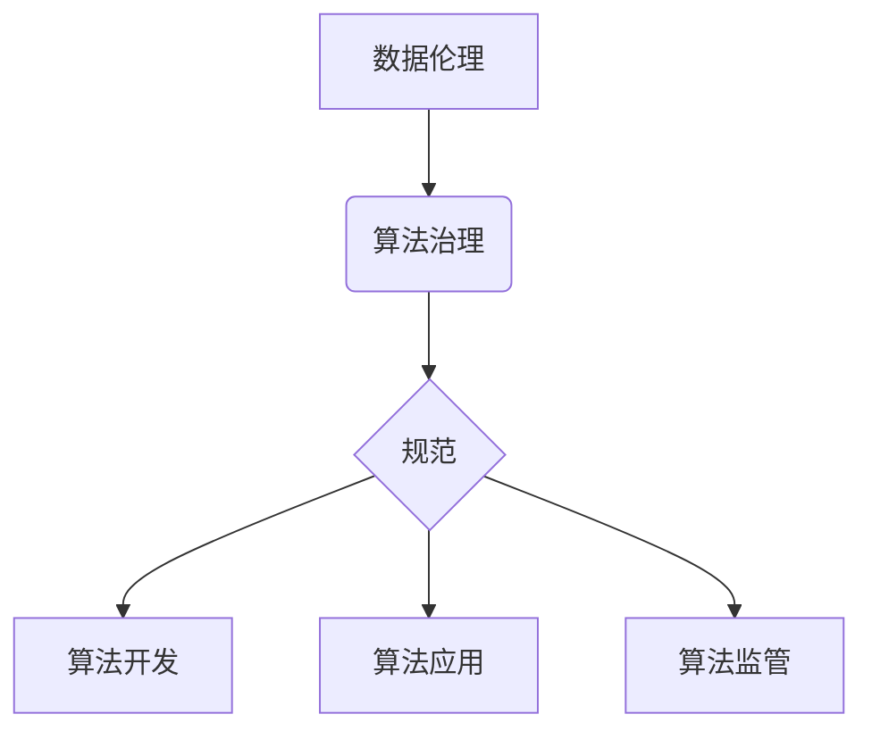

                 

## 数据伦理：算法治理与规范

> 关键词：数据伦理、算法治理、规范、公平性、透明度、可解释性、隐私保护

### 1. 背景介绍

随着人工智能（AI）技术的飞速发展，算法在各个领域扮演着越来越重要的角色，从医疗诊断到金融决策，从自动驾驶到社交推荐，算法的影响力无处不在。然而，算法的强大也带来了新的伦理挑战。数据驱动的算法可能存在偏见、歧视和不透明性，从而导致社会不公、侵犯隐私和损害个人利益。因此，建立健全的算法治理体系，规范算法的开发、应用和监管，成为当今社会面临的 pressing 问题。

### 2. 核心概念与联系

**2.1 数据伦理**

数据伦理是指在收集、存储、使用和共享数据时，遵循道德原则和社会规范，确保数据的使用符合人类价值和利益。它涉及到数据所有权、数据隐私、数据安全、数据公平性等多个方面。

**2.2 算法治理**

算法治理是指对算法的开发、部署和使用进行规范和管理，以确保算法的公平、透明、可解释、安全和可控。它包括制定算法伦理准则、建立算法审计机制、加强算法监管等措施。

**2.3 规范**

规范是指对算法的开发、应用和监管制定的一系列规则、标准和指南，以确保算法的合规性和可信度。规范可以由政府、行业协会、学术机构等制定，并由相关法律法规予以支持。

**2.4 核心概念关系图**



### 3. 核心算法原理 & 具体操作步骤

**3.1 算法原理概述**

算法治理的核心在于建立一个透明、可解释、可控的算法生态系统。这需要从算法的设计、开发、部署和评估各个环节入手，确保算法的公平性、准确性和安全性。

**3.2 算法步骤详解**

1. **识别伦理风险:** 在算法开发初期，需要对算法的潜在伦理风险进行识别和评估，例如算法可能导致的偏见、歧视、隐私侵犯等问题。
2. **制定伦理准则:** 根据识别出的伦理风险，制定相应的伦理准则和规范，指导算法的设计和开发。
3. **设计公平算法:** 使用公平性算法技术，例如去偏见算法、对抗性训练等，减少算法的潜在偏见和歧视。
4. **确保透明度和可解释性:** 使用可解释性算法技术，例如局部解释模型、规则提取等，提高算法的透明度和可解释性，使算法决策更加可理解和可信。
5. **建立审计机制:** 建立算法审计机制，定期对算法进行评估和监控，确保算法的公平性、准确性和安全性。
6. **加强监管和监督:** 加强政府和行业监管，制定相应的法律法规，规范算法的开发、应用和监管。

**3.3 算法优缺点**

**优点:**

* 提高算法的公平性、准确性和安全性。
* 增强公众对算法的信任和接受度。
* 避免算法带来的负面社会影响。

**缺点:**

* 算法治理的复杂性和成本。
* 算法伦理准则的制定和实施面临挑战。
* 算法的可解释性和透明度仍然存在局限性。

**3.4 算法应用领域**

* **医疗保健:** 医疗诊断、疾病预测、个性化治疗。
* **金融服务:** 风险评估、欺诈检测、信用评分。
* **教育:** 个性化学习、学生评估、教学辅助。
* **司法:** 罪犯识别、风险评估、判决辅助。
* **社会治理:** 公共安全、人口普查、资源分配。

### 4. 数学模型和公式 & 详细讲解 & 举例说明

**4.1 数学模型构建**

在算法治理中，可以使用数学模型来量化和评估算法的公平性、准确性和安全性。例如，可以使用偏见度指标来衡量算法对不同群体的不公平对待，可以使用准确率和召回率来衡量算法的准确性，可以使用风险评估模型来衡量算法带来的潜在风险。

**4.2 公式推导过程**

偏见度指标的计算公式如下：

$$
Bias = \frac{TP_1 - TP_2}{TP_1 + TP_2}
$$

其中：

* $TP_1$：算法对第一类群体的正确预测数。
* $TP_2$：算法对第二类群体的正确预测数。

**4.3 案例分析与讲解**

假设我们有一个用于识别信用卡欺诈的算法，该算法对男性和女性的欺诈行为识别率分别为 90% 和 80%。根据上述公式，我们可以计算出该算法的偏见度为：

$$
Bias = \frac{0.9 - 0.8}{0.9 + 0.8} = 0.053
$$

该结果表明，该算法对男性比女性更准确地识别欺诈行为，存在一定的偏见。

### 5. 项目实践：代码实例和详细解释说明

**5.1 开发环境搭建**

* Python 3.x
* TensorFlow 或 PyTorch 等深度学习框架
* Jupyter Notebook 或 VS Code 等代码编辑器

**5.2 源代码详细实现**

```python
import tensorflow as tf

# 定义模型
model = tf.keras.models.Sequential([
  tf.keras.layers.Dense(64, activation='relu', input_shape=(10,)),
  tf.keras.layers.Dense(1, activation='sigmoid')
])

# 编译模型
model.compile(optimizer='adam',
              loss='binary_crossentropy',
              metrics=['accuracy'])

# 训练模型
model.fit(X_train, y_train, epochs=10)

# 评估模型
loss, accuracy = model.evaluate(X_test, y_test)
print('Loss:', loss)
print('Accuracy:', accuracy)
```

**5.3 代码解读与分析**

这段代码实现了简单的深度学习模型，用于分类任务。

* `tf.keras.models.Sequential`：定义一个顺序模型，即层级结构。
* `tf.keras.layers.Dense`：定义一个全连接层，连接所有输入节点和输出节点。
* `activation='relu'`：使用ReLU激活函数，提高模型的非线性表达能力。
* `optimizer='adam'`：使用Adam优化器，更新模型参数。
* `loss='binary_crossentropy'`：使用二分类交叉熵损失函数，衡量模型预测结果与真实标签之间的差异。
* `metrics=['accuracy']`：使用准确率作为评估指标。

**5.4 运行结果展示**

训练完成后，模型会输出训练损失和准确率，并根据测试数据评估模型的性能。

### 6. 实际应用场景

**6.1 医疗诊断**

算法可以辅助医生诊断疾病，例如识别癌症、预测心血管疾病风险等。

**6.2 金融风险评估**

算法可以评估客户的信用风险，帮助银行和金融机构做出贷款决策。

**6.3 人工智能客服**

算法可以构建智能聊天机器人，为客户提供24小时在线服务。

**6.4 个性化推荐**

算法可以根据用户的兴趣和行为，推荐个性化的商品、服务和内容。

**6.5 未来应用展望**

随着人工智能技术的不断发展，算法治理将发挥越来越重要的作用。未来，算法治理将更加注重：

* **解释性AI:** 开发更可解释的算法，使算法决策更加透明和可理解。
* **联邦学习:** 在保护数据隐私的前提下，实现数据共享和模型训练。
* **算法审计:** 建立更加完善的算法审计机制，确保算法的公平性、准确性和安全性。

### 7. 工具和资源推荐

**7.1 学习资源推荐**

* **书籍:**

    * 《算法伦理》
    * 《AI伦理》
    * 《数据科学伦理》

* **在线课程:**

    * Coursera: 算法伦理
    * edX: 人工智能伦理
    * Udacity: 数据科学伦理

**7.2 开发工具推荐**

* **TensorFlow:** 开源深度学习框架
* **PyTorch:** 开源深度学习框架
* **Scikit-learn:** 机器学习库

**7.3 相关论文推荐**

* **On the Dangers of Stochastic Parrots: Can Language Models Be Too Big?**
* **Fairness and Machine Learning**
* **Explainable AI: Interpreting, Explaining and Visualizing Deep Learning**

### 8. 总结：未来发展趋势与挑战

**8.1 研究成果总结**

近年来，数据伦理和算法治理领域取得了显著进展，涌现出许多重要的研究成果，例如偏见度指标、可解释性算法、联邦学习等。这些成果为构建更加公平、透明、可控的算法生态系统提供了理论基础和技术支撑。

**8.2 未来发展趋势**

未来，算法治理将朝着以下几个方向发展：

* **更加注重解释性AI:** 开发更可解释的算法，使算法决策更加透明和可理解。
* **更加重视数据隐私保护:** 利用联邦学习等技术，在保护数据隐私的前提下实现数据共享和模型训练。
* **更加完善的算法审计机制:** 建立更加完善的算法审计机制，确保算法的公平性、准确性和安全性。

**8.3 面临的挑战**

算法治理仍然面临着许多挑战，例如：

* **算法复杂性:** 许多算法过于复杂，难以理解和解释。
* **数据偏差:** 数据本身可能存在偏差，导致算法产生不公平的结果。
* **监管滞后:** 算法治理的法律法规和监管机制尚未完善。

**8.4 研究展望**

未来，我们需要继续加强算法治理的研究，探索更加有效的算法设计、评估和监管方法，以确保算法的伦理性和可持续发展。

### 9. 附录：常见问题与解答

**9.1 如何评估算法的公平性？**

可以使用偏见度指标、公平性测试等方法评估算法的公平性。

**9.2 如何提高算法的可解释性？**

可以使用可解释性算法技术，例如局部解释模型、规则提取等，提高算法的可解释性。

**9.3 如何保护算法中的数据隐私？**

可以使用联邦学习等技术，在保护数据隐私的前提下实现数据共享和模型训练。


作者：禅与计算机程序设计艺术 / Zen and the Art of Computer Programming 
<end_of_turn>

