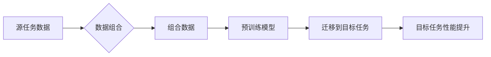

                 

## 数据组合：提升小语言模型表现

> 关键词：小语言模型、数据组合、迁移学习、性能提升、数据增强、下游任务

## 1. 背景介绍

近年来，小语言模型（LLM）在自然语言处理领域取得了显著进展，展现出强大的文本生成、翻译、问答等能力。然而，LLM的训练通常需要海量数据和大量的计算资源，这对于资源有限的团队和研究机构来说是一个挑战。

数据组合技术作为一种有效的解决方案，通过将不同类型、不同来源的数据进行组合，可以有效提升小语言模型的性能。这种方法可以帮助模型学习更丰富的知识，更好地理解和处理复杂的任务。

## 2. 核心概念与联系

数据组合的核心概念是将不同数据源进行融合，以获得更全面、更丰富的训练数据。这种融合可以是简单的拼接，也可以是更复杂的转换和映射。

数据组合与迁移学习密切相关。迁移学习是指利用预训练模型在源任务上的知识，迁移到目标任务上的学习方法。数据组合可以为迁移学习提供更丰富的源任务数据，从而提升模型在目标任务上的性能。

**数据组合与迁移学习的流程图：**



## 3. 核心算法原理 & 具体操作步骤

### 3.1  算法原理概述

数据组合算法的原理是通过将不同数据源的信息融合在一起，构建一个更完整的知识表示。常用的数据组合方法包括：

* **拼接:** 将不同数据源直接拼接在一起，形成新的训练数据。
* **转换:** 将不同数据源转换为相同的格式，然后进行拼接。
* **映射:** 将不同数据源中的信息映射到同一个空间，然后进行融合。

### 3.2  算法步骤详解

1. **数据收集:** 从不同来源收集相关数据，例如文本、代码、图像等。
2. **数据预处理:** 对收集到的数据进行清洗、格式化、标注等预处理操作。
3. **数据组合:** 根据选择的组合方法，将不同数据源的信息融合在一起。
4. **数据评估:** 对组合后的数据进行评估，例如计算数据质量、多样性等指标。
5. **模型训练:** 使用组合后的数据训练小语言模型。

### 3.3  算法优缺点

**优点:**

* 可以有效提升小语言模型的性能。
* 可以利用不同数据源的优势，学习更丰富的知识。
* 可以降低对单一数据源的依赖。

**缺点:**

* 数据组合过程可能比较复杂，需要一定的技术经验。
* 组合后的数据质量需要进行评估和控制。
* 数据源之间的兼容性需要考虑。

### 3.4  算法应用领域

数据组合技术广泛应用于各种自然语言处理任务，例如：

* 文本分类
* 情感分析
* 机器翻译
* 问答系统
* 代码生成

## 4. 数学模型和公式 & 详细讲解 & 举例说明

### 4.1  数学模型构建

数据组合可以看作是一个多源数据融合的过程，可以使用数学模型来描述数据融合的机制。例如，可以使用加权平均法来融合不同数据源的信息：

$$
y = \sum_{i=1}^{n} w_i x_i
$$

其中：

* $y$ 是组合后的数据
* $x_i$ 是第 $i$ 个数据源的数据
* $w_i$ 是第 $i$ 个数据源的权重

### 4.2  公式推导过程

加权平均法的权重可以根据不同数据源的质量、相关性等因素进行设置。例如，可以根据数据源的规模、准确率等指标来计算权重。

### 4.3  案例分析与讲解

假设我们有三个数据源：

* 数据源 1：新闻文本
* 数据源 2：社交媒体评论
* 数据源 3：学术论文

我们可以根据数据源的质量和相关性，设置不同的权重：

* 数据源 1：权重为 0.4
* 数据源 2：权重为 0.3
* 数据源 3：权重为 0.3

然后，使用加权平均法将这三个数据源的信息融合在一起，得到组合后的数据。

## 5. 项目实践：代码实例和详细解释说明

### 5.1  开发环境搭建

* Python 3.7+
* PyTorch 1.7+
* Transformers 4.10+

### 5.2  源代码详细实现

```python
import torch
from transformers import AutoTokenizer, AutoModelForSequenceClassification

# 加载预训练模型和词典
model_name = "bert-base-uncased"
tokenizer = AutoTokenizer.from_pretrained(model_name)
model = AutoModelForSequenceClassification.from_pretrained(model_name)

# 数据加载
train_data = ...
val_data = ...

# 数据组合
def combine_data(train_data, val_data):
    # ... 数据组合逻辑 ...
    return combined_data

# 训练模型
combined_data = combine_data(train_data, val_data)
# ... 训练模型逻辑 ...

# 评估模型
# ... 评估模型逻辑 ...
```

### 5.3  代码解读与分析

* 代码首先加载预训练模型和词典。
* 然后，根据具体的应用场景，实现数据组合逻辑。
* 最后，使用组合后的数据训练模型，并进行评估。

### 5.4  运行结果展示

* 训练完成后，可以展示模型在不同数据集上的性能指标，例如准确率、F1-score等。
* 可以通过可视化方式展示模型的学习过程和结果。

## 6. 实际应用场景

数据组合技术在实际应用场景中具有广泛的应用前景，例如：

* **医疗领域:** 将患者病历、医学文献、基因数据等进行组合，可以帮助医生更准确地诊断疾病和制定治疗方案。
* **金融领域:** 将金融交易数据、市场分析报告、客户行为数据等进行组合，可以帮助金融机构更好地进行风险管理和投资决策。
* **教育领域:** 将学生学习记录、考试成绩、教师评价等进行组合，可以帮助教育机构更好地了解学生的学习情况和制定个性化教学方案。

### 6.4  未来应用展望

随着数据量的不断增长和计算能力的提升，数据组合技术将发挥越来越重要的作用。未来，数据组合技术可能会与其他人工智能技术相结合，例如深度学习、强化学习等，进一步提升小语言模型的性能和应用范围。

## 7. 工具和资源推荐

### 7.1  学习资源推荐

* **论文:**
    * "BERT: Pre-training of Deep Bidirectional Transformers for Language Understanding"
    * "XLNet: Generalized Autoregressive Pretraining for Language Understanding"
    * "T5: Text-to-Text Transfer Transformer"
* **博客:**
    * https://huggingface.co/blog/
    * https://towardsdatascience.com/

### 7.2  开发工具推荐

* **PyTorch:** https://pytorch.org/
* **Transformers:** https://huggingface.co/docs/transformers/index

### 7.3  相关论文推荐

* "Data Augmentation for Text Classification: A Survey"
* "Transfer Learning for Natural Language Processing"
* "Few-Shot Learning with Large Language Models"

## 8. 总结：未来发展趋势与挑战

### 8.1  研究成果总结

数据组合技术为提升小语言模型的性能提供了有效的解决方案。通过将不同数据源的信息融合在一起，可以帮助模型学习更丰富的知识，更好地理解和处理复杂的任务。

### 8.2  未来发展趋势

未来，数据组合技术将会朝着以下方向发展：

* **更智能的数据组合方法:** 探索更智能、更有效的组合方法，例如基于对抗学习、强化学习的数据组合。
* **跨模态数据组合:** 将文本、图像、音频等不同模态的数据进行组合，构建更全面的知识表示。
* **联邦学习下的数据组合:** 在隐私保护的前提下，探索联邦学习下的数据组合方法。

### 8.3  面临的挑战

数据组合技术也面临着一些挑战：

* **数据质量和多样性:** 数据组合的效果依赖于数据质量和多样性。如何获取高质量、多样化的数据仍然是一个挑战。
* **数据兼容性:** 不同数据源的格式、结构可能存在差异，需要进行有效的转换和映射。
* **计算资源:** 数据组合过程可能需要大量的计算资源，对于资源有限的团队来说是一个挑战。

### 8.4  研究展望

未来，我们将继续探索数据组合技术在小语言模型领域的应用，并致力于解决上述挑战，推动数据组合技术的发展。


## 9. 附录：常见问题与解答

* **Q1: 数据组合的具体方法有哪些？**

* **A1:** 数据组合的方法有很多，例如拼接、转换、映射等。具体的组合方法需要根据应用场景和数据特点进行选择。

* **Q2: 数据组合的优缺点是什么？**

* **A2:** 数据组合的优点是能够提升小语言模型的性能，利用不同数据源的优势，降低对单一数据源的依赖。缺点是数据组合过程可能比较复杂，需要一定的技术经验，组合后的数据质量需要进行评估和控制。

* **Q3: 数据组合技术有哪些应用场景？**

* **A3:** 数据组合技术在医疗、金融、教育等多个领域都有广泛的应用前景。

* **Q4: 如何选择合适的组合方法？**

* **A4:** 选择合适的组合方法需要根据应用场景和数据特点进行综合考虑。例如，对于文本分类任务，可以使用拼接或转换方法；对于跨模态任务，可以使用映射方法。

* **Q5: 数据组合技术面临哪些挑战？**

* **A5:** 数据组合技术面临的数据质量、数据多样性、数据兼容性、计算资源等挑战。


作者：禅与计算机程序设计艺术 / Zen and the Art of Computer Programming 
<end_of_turn>

