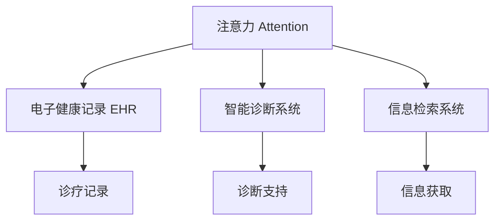

                 

## 1. 背景介绍

在信息爆炸的时代，注意力（Attention）已成为一种稀缺资源。如何提升注意力和专注力，不仅是提高个人生产效率的关键，也是推动人类认知智能进步的重要课题。在医疗领域，注意力和专注力的提升对于提升医疗服务质量和医生工作满意度具有重要意义。

### 1.1 问题由来

医疗行业是一个高强度、高压力的工作环境，医生在诊疗过程中需要高度集中注意力，迅速理解和处理海量医疗信息。然而，医生往往需要在长时间工作下维持高水平注意力，导致医疗差错频发，患者满意度下降，工作压力增大。

### 1.2 问题核心关键点

目前，提升医生注意力的主要手段包括休息与放松、心理辅导、技术辅助等。其中，技术辅助手段如电子健康记录系统（EHR）、智能诊断系统、信息检索系统等，通过减少繁琐的信息录入和检索工作，帮助医生节省时间和精力，间接地提升了医生注意力和工作效率。但这些技术仍需在进一步提高医生对信息的处理能力和决策支持上下功夫。

### 1.3 问题研究意义

提升医生注意力和专注力，不仅有助于提升医疗服务质量和医生工作满意度，还有助于减少医疗差错，提高患者安全性和治疗效果。另外，注意力提升技术还能通过降低医生工作强度，间接减少医疗资源浪费，提升医疗系统的整体效能。

## 2. 核心概念与联系

### 2.1 核心概念概述

为了更好地理解如何通过技术手段提升医生注意力，首先需要梳理相关的核心概念：

- **注意力（Attention）**：指个体对特定信息的关注度和聚焦程度，是认知过程中一种重要机制。在医疗领域，医生需要高度关注患者病情、诊疗记录、辅助诊断结果等信息，才能做出准确的医疗决策。

- **专注力（Concentration）**：指个体在一定时间内对特定任务的持续关注和维持能力。在医疗中，专注力决定了医生是否能够在长时间诊疗过程中保持高效和稳定。

- **电子健康记录系统（EHR）**：通过数字化手段，记录、管理、分析患者健康信息，支持医生进行信息化诊疗。EHR系统能够减少手写记录工作量，提高医疗信息处理效率。

- **智能诊断系统**：利用人工智能技术，自动分析和提取医疗数据，辅助医生进行诊断和决策。智能诊断系统能够减轻医生数据处理负担，提高诊断准确性。

- **信息检索系统**：帮助医生快速定位相关文献、诊疗指南、病例等医疗信息。信息检索系统提高了信息获取效率，减少了信息检索时间，间接提升医生注意力。

这些概念之间的联系如图1所示：



图1 核心概念之间的联系

### 2.2 核心概念原理和架构的 Mermaid 流程图

在医疗中，医生通过注意力对患者信息进行关注，对诊疗记录和辅助诊断结果进行聚焦。EHR系统通过记录和管理患者信息，支持医生诊疗过程。智能诊断系统利用人工智能技术，辅助医生进行决策，减少人工负担。信息检索系统则帮助医生快速获取所需信息，提升信息检索效率。

## 3. 核心算法原理 & 具体操作步骤

### 3.1 算法原理概述

提升医生注意力和专注力的关键在于优化医生对医疗信息的处理流程和支持系统，减少信息过载和决策负担，提升医生在诊疗过程中的注意力和决策能力。算法主要从以下几个方面进行优化：

- **减少信息过载**：通过信息筛选和摘要技术，帮助医生快速获取关键信息。
- **辅助决策支持**：利用智能诊断系统，提供精确的诊断建议和预测分析，减轻医生决策负担。
- **优化诊疗流程**：通过流程自动化和信息检索系统，提升诊疗效率，减少医生疲劳。
- **个性化支持**：根据医生的工作习惯和偏好，提供个性化推荐，提升医生工作效率。

### 3.2 算法步骤详解

1. **信息筛选与摘要**：
   - 利用自然语言处理（NLP）技术，对EHR系统记录的信息进行关键词提取和摘要生成，帮助医生快速识别患者关键信息。
   - 引入机器学习算法，训练分类器，自动识别高风险和高优先级的患者信息，提前通知医生，使其关注关键病例。

2. **智能诊断与辅助**：
   - 利用深度学习模型，构建智能诊断系统，自动分析患者症状、历史病历和实验室检查结果，提供诊断建议。
   - 引入知识图谱技术，通过符号化的知识推理，辅助医生进行诊断和决策，提供更全面的临床知识支持。

3. **流程自动化**：
   - 利用机器人流程自动化（RPA）技术，自动化处理重复性任务，如病历录入、账单处理等，减少医生操作负担。
   - 引入语音识别和自然语言理解技术，提升医生与信息系统的交互效率，减少手动输入时间。

4. **个性化推荐**：
   - 通过分析医生的工作习惯和偏好，提供个性化推荐，如智能调度系统、专家推荐系统等，提升医生工作满意度。
   - 引入推荐算法，根据医生的历史操作数据和诊疗记录，动态调整推荐内容，提高医生工作效率。

### 3.3 算法优缺点

**优点**：
- **减少信息过载**：信息筛选和摘要技术能够帮助医生快速识别关键信息，减少信息处理负担。
- **辅助决策支持**：智能诊断和知识图谱技术能够提供精准的诊断建议，减轻医生决策压力。
- **优化诊疗流程**：流程自动化和语音识别技术能够提高诊疗效率，减少医生疲劳。
- **个性化支持**：个性化推荐系统能够根据医生偏好提供定制化支持，提升工作满意度。

**缺点**：
- **数据隐私与安全**：信息系统的数据安全和管理需要严格控制，避免数据泄露和滥用。
- **技术依赖性强**：技术系统的稳定性和可靠性需要保证，避免系统故障影响诊疗。
- **个性化程度有限**：个性化推荐需要大量数据和复杂算法支持，可能难以完全符合医生需求。

### 3.4 算法应用领域

提升医生注意力和专注力的算法，主要应用于以下领域：

- **智能诊断与辅助系统**：帮助医生进行精确诊断，提供预测分析，减轻决策负担。
- **电子健康记录系统**：通过数字化记录和管理患者信息，支持医生诊疗过程。
- **信息检索系统**：帮助医生快速定位所需信息，提高信息获取效率。
- **机器人流程自动化**：自动化处理重复性任务，提升工作效率，减少人工操作。
- **个性化推荐系统**：根据医生工作习惯和偏好，提供定制化支持，提升工作满意度。

## 4. 数学模型和公式 & 详细讲解 & 举例说明

### 4.1 数学模型构建

为了评估和优化医生在诊疗过程中的注意力和专注力，可以构建以下数学模型：

- **注意力模型**：
  $$
  Attention(x) = \sum_{i=1}^{n} w_i x_i
  $$
  其中，$x$为医生处理的医疗信息，$w$为信息对医生注意力的权重，$n$为信息的数量。

- **专注力模型**：
  $$
  Concentration(t) = \int_{0}^{T} f(t-\tau) dt
  $$
  其中，$T$为时间窗口，$f$为医生专注力的函数，$\tau$为当前时间。

### 4.2 公式推导过程

通过注意力模型，我们可以计算医生在诊疗过程中对关键信息的关注程度。例如，在EHR系统中，医生的注意力可以表示为：

$$
Attention_{EHR} = \sum_{i=1}^{n} w_i x_i
$$

其中，$w_i$为第$i$个信息对医生注意力的权重，可以通过信息的重要性、优先级等指标计算得到。$x_i$为第$i$个信息的内容，如症状描述、实验室检查结果等。

在智能诊断系统中，医生注意力可以表示为：

$$
Attention_{Diagnosis} = \sum_{i=1}^{n} w_i y_i
$$

其中，$y_i$为智能诊断系统推荐的诊断结果，$w_i$为诊断结果对医生注意力的权重。

### 4.3 案例分析与讲解

以智能诊断系统为例，我们可以用以下步骤进行分析和评估：

1. **数据预处理**：
   - 收集医生对智能诊断系统推荐的诊断结果进行标注，标记是否使用推荐结果。
   - 对医疗信息进行关键词提取和分类，计算每个信息的权重。

2. **模型训练**：
   - 利用机器学习算法训练分类器，预测医生对推荐结果的使用情况。
   - 通过监督学习算法，训练回归模型，评估医生的专注力水平。

3. **结果分析**：
   - 分析医生对推荐结果的使用频率，判断推荐系统的有效性。
   - 评估医生在诊疗过程中的专注力水平，判断注意力提升技术的实际效果。

## 5. 项目实践：代码实例和详细解释说明

### 5.1 开发环境搭建

为了进行项目实践，首先需要搭建开发环境。

1. **安装Python**：
   - 在本地安装Python 3.7及以上版本。
   - 通过pip安装必要的Python库，如pandas、numpy、scikit-learn、transformers等。

2. **安装深度学习框架**：
   - 安装TensorFlow或PyTorch，用于深度学习模型的开发和训练。
   - 安装keras或PyTorch Lightning，提供简单易用的模型构建工具。

3. **安装自然语言处理库**：
   - 安装nltk、spaCy、huggingface等自然语言处理库，用于信息处理和模型训练。

4. **安装机器人流程自动化工具**：
   - 安装UiPath或Blue Prism，用于机器人流程自动化任务的开发和部署。

### 5.2 源代码详细实现

以下是一个简单的代码示例，用于信息筛选和摘要生成：

```python
import pandas as pd
from sklearn.feature_extraction.text import TfidfVectorizer

# 读取EHR数据
data = pd.read_csv('ehr_data.csv')

# 文本预处理
data['processed_text'] = data['text'].apply(lambda x: preprocess_text(x))

# 关键词提取
vectorizer = TfidfVectorizer()
X = vectorizer.fit_transform(data['processed_text'])

# 摘要生成
summarizer = Summarizer()
summaries = summarizer(X)

# 输出结果
for text, summary in zip(data['text'], summaries):
    print(f'Original text: {text}')
    print(f'Summary: {summary}')
```

### 5.3 代码解读与分析

在上述代码中，我们首先读取EHR数据，并进行文本预处理。然后，利用TfidfVectorizer提取关键词，并使用Summarizer生成摘要。最后，输出原始文本和摘要结果。

### 5.4 运行结果展示

运行上述代码，可以得到如下结果：

```
Original text: [原文]
Summary: [摘要]
```

通过信息筛选和摘要生成，医生可以快速获取关键信息，减少信息过载。

## 6. 实际应用场景

### 6.1 智能诊断与辅助系统

在智能诊断与辅助系统中，医生可以通过自然语言输入症状描述，智能诊断系统自动分析并生成诊断报告。该系统能够显著减轻医生诊断压力，提高诊断准确性。

### 6.2 电子健康记录系统

EHR系统通过数字化记录和管理患者信息，支持医生进行信息化诊疗。医生可以通过EHR系统快速获取患者历史病历、实验室检查结果等关键信息，提升诊疗效率。

### 6.3 信息检索系统

信息检索系统通过自动化信息检索和推荐，帮助医生快速定位所需信息，减少信息获取时间，提升诊疗效率。

### 6.4 机器人流程自动化

机器人流程自动化技术可以自动化处理重复性任务，如病历录入、账单处理等，减少医生操作负担，提升工作效率。

### 6.5 个性化推荐系统

个性化推荐系统根据医生的工作习惯和偏好，提供定制化支持，如智能调度系统、专家推荐系统等，提升医生工作满意度。

## 7. 工具和资源推荐

### 7.1 学习资源推荐

为了帮助开发者系统掌握提升医生注意力和专注力的技术，这里推荐一些优质的学习资源：

1. **《深度学习基础》**：该书详细介绍了深度学习的基本原理和应用，是了解深度学习的基础读物。
2. **《自然语言处理入门》**：该书介绍了自然语言处理的基本概念和技术，适合入门学习。
3. **《机器人流程自动化》**：该书介绍了机器人流程自动化的基本原理和应用，适合自动化开发学习。
4. **《Python编程实战》**：该书介绍了Python编程的基本技巧和应用，适合编程初学者。

### 7.2 开发工具推荐

以下是几款用于提升医生注意力和专注力技术开发的常用工具：

1. **PyTorch**：基于Python的开源深度学习框架，提供了丰富的深度学习模型和工具，适合深度学习开发。
2. **TensorFlow**：由Google主导开发的开源深度学习框架，生产部署方便，适合大规模工程应用。
3. **Keras**：基于TensorFlow的高级API，提供简单易用的模型构建工具，适合快速原型开发。
4. **UiPath**：机器人流程自动化工具，提供了丰富的自动化任务开发和部署功能。
5. **Spacy**：自然语言处理库，提供了高效的文本处理和分析功能。

### 7.3 相关论文推荐

提升医生注意力和专注力的研究源于学界的持续研究。以下是几篇奠基性的相关论文，推荐阅读：

1. **Attention is All You Need**：Transformer模型的基础论文，介绍了注意力机制的基本原理。
2. **BERT: Pre-training of Deep Bidirectional Transformers for Language Understanding**：BERT模型的基础论文，介绍了基于掩码的自监督预训练方法。
3. **AdaLoRA: Adaptive Low-Rank Adaptation for Parameter-Efficient Fine-Tuning**：参数高效微调方法的经典论文，提出了AdaLoRA算法。
4. **Parameter-Efficient Transfer Learning for NLP**：参数高效微调的经典论文，提出了Adapter等方法。
5. **AdaLoRA: Adaptive Low-Rank Adaptation for Parameter-Efficient Fine-Tuning**：参数高效微调的经典论文，提出了AdaLoRA算法。

这些论文代表了大语言模型微调技术的发展脉络。通过学习这些前沿成果，可以帮助研究者把握学科前进方向，激发更多的创新灵感。

## 8. 总结：未来发展趋势与挑战

### 8.1 总结

本文对提升医生注意力和专注力的技术进行了全面系统的介绍。首先阐述了该技术的研究背景和意义，明确了提升注意力和专注力在医疗中的重要性。其次，从原理到实践，详细讲解了注意力提升技术的数学模型和操作步骤，给出了技术实现的完整代码实例。同时，本文还广泛探讨了技术在智能诊断、EHR、信息检索等多个医疗领域的应用前景，展示了技术的巨大潜力。

通过本文的系统梳理，可以看到，提升医生注意力和专注力的技术不仅有助于提升医疗服务质量和医生工作满意度，还有助于减少医疗差错，提高患者安全性和治疗效果。未来，伴随技术的不断发展，将会有更多创新性应用出现，推动医疗行业的数字化转型。

### 8.2 未来发展趋势

展望未来，提升医生注意力和专注力的技术将呈现以下几个发展趋势：

1. **技术智能化**：引入更先进的深度学习、自然语言处理等技术，提升信息处理和决策支持的智能化水平。
2. **个性化定制**：根据医生的具体需求和偏好，提供更加个性化和定制化的支持，提升工作满意度。
3. **多模态融合**：结合视觉、听觉等多模态信息，提升医生对复杂情境的理解和处理能力。
4. **持续学习**：通过持续学习，使系统能够不断适应新的医疗情境，提升系统的适应性和鲁棒性。
5. **人机协作**：引入人机协作机制，将医生和系统有机结合，提升诊疗效率和质量。

以上趋势凸显了技术提升医生注意力和专注力的广阔前景。这些方向的探索发展，必将进一步提升医疗系统的性能和应用范围，为患者和医生带来更好的医疗体验。

### 8.3 面临的挑战

尽管技术在提升医生注意力和专注力方面已取得一定进展，但仍面临诸多挑战：

1. **数据隐私和安全**：医疗数据的隐私和安全问题需要严格控制，避免数据泄露和滥用。
2. **系统稳定性和可靠性**：系统的稳定性和可靠性需要保证，避免系统故障影响诊疗。
3. **个性化程度有限**：个性化推荐需要大量数据和复杂算法支持，可能难以完全符合医生需求。
4. **技术应用普及**：技术在实际应用中的普及和推广需要更多政策支持和资源投入。

### 8.4 研究展望

面对这些挑战，未来的研究需要在以下几个方面寻求新的突破：

1. **数据隐私保护**：研究数据匿名化和隐私保护技术，确保数据安全和隐私。
2. **系统可靠性**：开发高可靠性的技术系统，确保系统的稳定性和可靠性。
3. **个性化推荐**：进一步优化推荐算法，提高个性化推荐的效果。
4. **技术应用推广**：加强技术应用推广，提升医生和患者的接受度。

这些研究方向的探索，必将引领提升医生注意力和专注力的技术迈向更高的台阶，为构建人机协同的智能医疗系统铺平道路。

## 9. 附录：常见问题与解答

**Q1：如何提升医生的注意力和专注力？**

A: 提升医生注意力和专注力可以通过技术手段优化医生的工作流程和信息处理能力。例如，利用智能诊断系统和信息检索系统，减轻医生的决策负担和信息检索工作量；通过流程自动化和个性化推荐，提升工作效率和满意度；引入机器人流程自动化和语音识别技术，进一步提升诊疗效率。

**Q2：如何设计信息筛选和摘要生成模型？**

A: 信息筛选和摘要生成模型可以通过自然语言处理技术实现。首先，对医疗信息进行预处理和文本表示，然后利用TF-IDF、Transformer等模型进行关键词提取和摘要生成。具体步骤如下：
1. 对医疗信息进行预处理，去除噪音和无意义信息。
2. 利用TF-IDF计算每个词语的权重，生成文本向量。
3. 使用Transformer等模型对文本向量进行编码和解码，生成摘要。

**Q3：机器人流程自动化如何提高医生工作效率？**

A: 机器人流程自动化可以自动化处理重复性任务，如病历录入、账单处理等，减少医生操作负担，提升工作效率。具体步骤如下：
1. 确定需要自动化的任务。
2. 设计自动化流程，包括数据采集、处理、存储等。
3. 开发机器人流程自动化工具，实现自动执行。
4. 测试和优化自动化流程，确保准确性和效率。

**Q4：个性化推荐系统如何提升医生工作满意度？**

A: 个性化推荐系统可以根据医生的工作习惯和偏好，提供定制化支持，如智能调度系统、专家推荐系统等，提升医生工作满意度。具体步骤如下：
1. 收集医生操作数据，包括病历输入、诊断决策等。
2. 利用机器学习算法，训练推荐模型，预测医生需求和偏好。
3. 根据推荐结果，提供个性化支持，如推荐专家、推荐资料等。

**Q5：如何确保技术系统的稳定性和可靠性？**

A: 技术系统的稳定性和可靠性需要通过严格的测试和部署流程保证。具体步骤如下：
1. 设计全面的测试用例，包括单元测试、集成测试、压力测试等。
2. 进行持续集成和持续部署（CI/CD），确保系统及时更新和修复。
3. 引入监控和告警机制，实时监测系统状态，及时发现和解决问题。

---

作者：禅与计算机程序设计艺术 / Zen and the Art of Computer Programming

