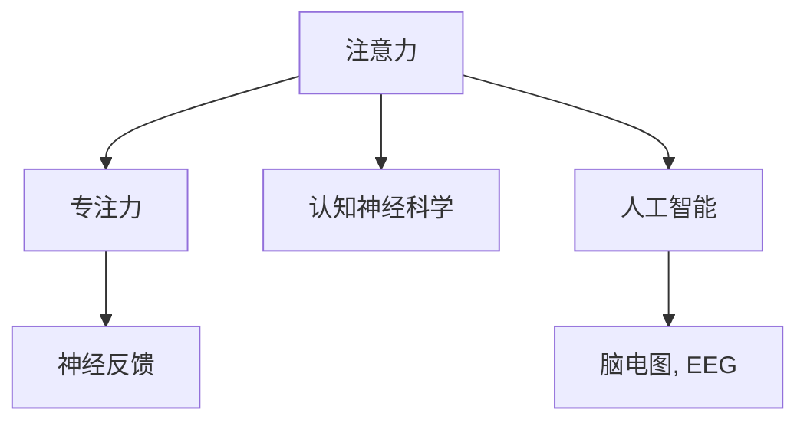

                 

# 人类注意力增强：提升专注力和注意力在教育中的技巧

## 1. 背景介绍

### 1.1 问题由来
在信息化和数字化的浪潮中，人类面临着前所未有的信息过载和注意力分散的挑战。特别是对于教育领域，注意力不集中、专注力不足成为了制约学生学习效率和成绩提升的重要因素。如何有效提升学生的注意力和专注力，成为教育工作者和研究者普遍关注的焦点。

近年来，随着脑科学、认知心理学、人工智能等领域的交叉融合，注意力增强技术逐渐成为研究热点。这些技术结合了生理数据、神经反馈和智能算法，为教育场景下的注意力提升提供了新的可能性。本文将系统介绍人类注意力增强的关键概念、理论原理和实际操作技巧，探讨其在教育中的具体应用，为教育工作者提供参考。

### 1.2 问题核心关键点
提升注意力和专注力的核心在于理解人类注意力机制，并利用技术手段加以增强。本文将围绕以下几个关键点展开：
- 注意力与专注力的定义及重要性。
- 注意力增强技术的理论基础与算法原理。
- 基于神经反馈的注意力增强模型的设计与实现。
- 注意力增强技术在教育中的应用案例与效果评估。

通过这些关键点的探讨，我们希望能为教育工作者提供具体的技巧和方法，帮助学生提升学习效率和成果。

## 2. 核心概念与联系

### 2.1 核心概念概述

为更好地理解注意力增强技术，本节将介绍几个密切相关的核心概念：

- **注意力（Attention）**：是指人类在特定时刻选择并专注于某一事物的心理过程。它涉及信息处理和决策，是认知过程的重要组成部分。

- **专注力（Concentration）**：是一种能够长时间集中注意力的心理状态，通常在需要深入思考或完成任务时表现显著。

- **认知神经科学（Cognitive Neuroscience）**：研究认知过程的神经机制，特别是注意力、记忆、语言等心理活动的神经基础。

- **神经反馈（Neurofeedback）**：通过实时监测和反馈大脑活动，帮助用户主动调整注意力状态，增强专注力。

- **人工智能（Artificial Intelligence）**：利用机器学习和数据分析技术，辅助实现注意力增强。

- **脑电图（Electroencephalogram, EEG）**：通过头皮电极测量大脑电活动，用于监测注意力和专注力水平。

这些核心概念之间的逻辑关系可以通过以下Mermaid流程图来展示：



这个流程图展示出注意力、专注力、认知神经科学、神经反馈、人工智能和脑电图之间的相互关系：

1. 注意力是认知过程的重要组成部分，直接影响专注力。
2. 认知神经科学研究注意力等认知过程的神经基础。
3. 神经反馈通过监测大脑活动，帮助用户主动调整注意力。
4. 人工智能利用技术手段辅助神经反馈，提高注意力增强的效果。
5. 脑电图作为神经反馈的一种方式，提供实时的注意力监测数据。

这些概念共同构成了人类注意力增强的理论基础和实践框架。

## 3. 核心算法原理 & 具体操作步骤

### 3.1 算法原理概述

注意力增强技术主要基于神经反馈的原理，通过实时监测和调整注意力状态，帮助用户提升专注力。其核心思想是：通过脑电图等生理数据监测用户注意力水平，实时反馈注意力状态，引导用户进行有效的注意力管理，从而提升专注力。

具体而言，注意力增强模型通常包含以下几个步骤：

1. **数据采集**：使用脑电图等设备采集用户的脑电活动数据。
2. **信号预处理**：对采集到的数据进行预处理，如滤波、去噪、标准化等。
3. **特征提取**：从预处理后的数据中提取注意力相关的特征，如频率功率谱、相位同步度等。
4. **模型训练**：利用机器学习算法对特征进行建模，建立注意力状态与专注力之间的关系。
5. **实时反馈**：根据模型预测，实时反馈用户的注意力状态，辅助用户调整专注力。

### 3.2 算法步骤详解

以基于脑电图的数据驱动注意力增强模型为例，介绍其详细实现步骤：

1. **数据采集**：使用便携式脑电图设备，如Emotiv、NeuroSky等，采集用户的脑电活动数据。数据采集时需确保环境安静，排除干扰因素。

2. **信号预处理**：对采集到的数据进行预处理，包括：
   - **滤波**：使用数字滤波器（如IIR、FIR）滤除高频噪声。
   - **去噪**：使用独立成分分析（ICA）或噪声减除算法，去除生理信号中的眼电、肌肉电等干扰。
   - **标准化**：对信号进行归一化处理，以消除个体差异。

3. **特征提取**：从预处理后的数据中提取注意力相关的特征，如频率功率谱、相位同步度、熵值等。这些特征可以反映不同注意力水平和状态。

4. **模型训练**：利用机器学习算法（如支持向量机、随机森林、神经网络等）对特征进行建模，建立注意力状态与专注力之间的关系。训练过程中需进行交叉验证，选择最优模型参数。

5. **实时反馈**：根据模型预测，实时反馈用户的注意力状态。通常通过声音提示、视觉提示等方式，告知用户当前注意力水平和建议调整方法。

### 3.3 算法优缺点

注意力增强技术通过实时监测和反馈注意力状态，具有以下优点：
1. 数据驱动：基于客观的生理数据，而不是主观的心理测量，科学可信。
2. 动态调整：实时监测并反馈注意力状态，有助于用户主动管理注意力，提升专注力。
3. 个性化优化：通过学习个体特征，提供个性化的注意力管理方案。

然而，该技术也存在一定的局限性：
1. 技术门槛较高：需要专业设备和算法支持，不易普及。
2. 数据隐私问题：采集生理数据涉及隐私问题，需要严格的隐私保护措施。
3. 用户接受度：部分用户可能对监测和反馈环节感到不适或抗拒。
4. 系统稳定性：生理数据容易受外界因素干扰，如环境噪声、心理压力等。

尽管存在这些局限性，注意力增强技术仍是大数据时代提升专注力和注意力的重要手段之一。

### 3.4 算法应用领域

注意力增强技术不仅在医疗和训练领域有广泛应用，更在教育领域展现出巨大潜力。以下是几个具体的应用场景：

1. **课堂教学**：在课堂上使用脑电图等设备监测学生的注意力状态，根据反馈数据调整教学策略，提高教学效果。
2. **家庭学习**：在家使用智能设备监测儿童的学习行为，提供个性化学习建议和提醒，提升学习效率。
3. **在线教育**：在在线教育平台中集成注意力监测功能，根据学生注意力水平调整课程内容和难度，提升在线学习体验。
4. **考试训练**：在考试和训练中使用注意力增强技术，监测学生注意力水平，提供实时反馈和建议，帮助学生克服考试焦虑，提高应试能力。

这些应用场景展示了注意力增强技术在教育中的广泛应用和重要价值。

## 4. 数学模型和公式 & 详细讲解 & 举例说明

### 4.1 数学模型构建

注意力增强模型通常包含以下步骤：

1. **数据采集**：从脑电图等设备采集大脑电活动数据 $X_t$。
2. **信号预处理**：经过滤波、去噪等预处理步骤，得到预处理后的信号 $X_t'$。
3. **特征提取**：从预处理后的信号中提取注意力相关的特征 $F_t'$。
4. **模型训练**：使用机器学习算法 $M$ 对特征进行建模，得到专注力预测模型 $P_t$。
5. **实时反馈**：根据模型预测，实时反馈注意力状态 $A_t$，辅助用户调整专注力。

具体来说，注意力增强模型可以表示为：

$$
\begin{aligned}
X_t' &= \text{预处理}(X_t) \\
F_t' &= \text{特征提取}(X_t') \\
P_t &= M(F_t') \\
A_t &= \text{实时反馈}(P_t)
\end{aligned}
$$

### 4.2 公式推导过程

以最简单的线性模型为例，推导其特征提取和预测过程：

1. **特征提取**：假设使用频率功率谱作为特征，对于采集到的信号 $X_t$，其功率谱表示为 $P_{ft}$，即：

$$
P_{ft} = \frac{1}{T} \sum_{i=1}^T |X_t(i) e^{-j2\pi fi/T}|^2
$$

2. **模型训练**：使用线性回归模型 $M = \theta^T X + b$ 对功率谱进行建模，得到专注力预测模型：

$$
P_t = \theta^T P_{ft} + b
$$

其中 $\theta$ 和 $b$ 为模型参数。

3. **实时反馈**：根据模型预测，实时反馈注意力状态 $A_t$，如声音提示“集中注意力”或“放松休息”。

### 4.3 案例分析与讲解

以课堂教学中的应用为例，具体说明注意力增强模型的实现过程：

1. **数据采集**：在课堂上使用便携式脑电图设备采集学生的脑电活动数据。
2. **信号预处理**：对采集到的数据进行滤波、去噪等预处理步骤。
3. **特征提取**：从预处理后的信号中提取频率功率谱。
4. **模型训练**：使用线性回归模型对频率功率谱进行建模，得到专注力预测模型。
5. **实时反馈**：根据模型预测，实时反馈学生的注意力状态，并调整教学策略，如暂停讲解、调整教学节奏等。

## 5. 项目实践：代码实例和详细解释说明

### 5.1 开发环境搭建

在进行注意力增强项目的开发前，我们需要准备好开发环境。以下是使用Python进行Scikit-learn和EEGLAB开发的环境配置流程：

1. 安装Anaconda：从官网下载并安装Anaconda，用于创建独立的Python环境。

2. 创建并激活虚拟环境：
```bash
conda create -n attention-env python=3.8 
conda activate attention-env
```

3. 安装相关库：
```bash
pip install scikit-learn eeglab
```

4. 安装各类工具包：
```bash
pip install numpy pandas matplotlib seaborn
```

完成上述步骤后，即可在`attention-env`环境中开始注意力增强项目的开发。

### 5.2 源代码详细实现

下面我们以基于EEGLAB的注意力增强项目为例，给出EEGLAB与Scikit-learn的结合使用代码实现。

1. 使用EEGLAB加载脑电图数据：
```matlab
edf_read('EEG_data.edf');
```

2. 预处理数据：
```matlab
# 滤波
EEG_bandpass('EEG_data', 'filtered_data', [0.5 40], 'filt');
# 去噪
EEG_IIR notch_filter('filtered_data', 'notch_data', 50);
```

3. 特征提取：
```matlab
# 功率谱计算
EEG_spectrum('notch_data', 'spectrum_data', 'psd');
```

4. 加载Scikit-learn模型进行训练：
```python
from sklearn.linear_model import LinearRegression
import numpy as np

# 将EEGLAB提取的功率谱数据转化为NumPy数组
spectrum_data = np.array(EEG.get('spectrum_data'))
x = spectrum_data[:, None]
y = np.array(EEG.get('EEG_concentration'))

# 构建线性回归模型
model = LinearRegression()
model.fit(x, y)
```

5. 使用Scikit-learn模型进行预测：
```python
# 对新数据进行预测
new_data = np.array(EEG.get('new_spectrum_data'))
x_new = new_data[:, None]
predicted_concentration = model.predict(x_new)
```

6. 实时反馈：
```python
# 根据预测结果，实时反馈注意力状态
if predicted_concentration > 0.5:
    print('Concentration is high, please relax.')
else:
    print('Concentration is low, please focus.')
```

以上代码实现展示了EEGLAB与Scikit-learn的结合使用，具体包括数据加载、预处理、特征提取、模型训练和实时反馈等步骤。

### 5.3 代码解读与分析

让我们再详细解读一下关键代码的实现细节：

**EEGLAB部分**：
- `edf_read`函数：用于加载EEGLAB格式的数据文件。
- `EEG_bandpass`函数：使用带通滤波器过滤信号，保留特定频率范围的信号。
- `EEG_IIR notch_filter`函数：使用IIR滤波器去除50Hz的工频干扰。
- `EEG_spectrum`函数：计算功率谱，即每个频率的信号功率。

**Scikit-learn部分**：
- `LinearRegression`类：用于建立线性回归模型。
- `fit`方法：训练模型，使用EEGLAB提取的功率谱数据和EEG浓度数据拟合模型。
- `predict`方法：对新数据进行预测，输出专注力水平。
- `if-else`语句：根据预测结果实时反馈注意力状态。

代码实现展示了EEGLAB与Scikit-learn的结合使用，数据预处理、模型训练和实时反馈等步骤均在代码中得到体现。通过这些代码，我们可以实现基于EEGLAB的注意力增强功能，实时监测并反馈学生的注意力状态。

## 6. 实际应用场景

### 6.1 智能教室

智能教室是注意力增强技术的重要应用场景之一。在智能教室中，教师可以使用EEGLAB等设备实时监测学生的注意力水平，根据反馈结果调整教学策略，提高教学效果。

例如，教师可以在课堂上使用EEGLAB设备监测学生的脑电活动，通过EEGLAB将数据传递到Scikit-learn模型中进行分析。根据模型预测结果，实时反馈学生的注意力状态，并调整教学内容或方式，如调整讲解速度、增加互动环节等，从而提高学生的学习效率。

### 6.2 在线学习平台

在线学习平台也是注意力增强技术的重要应用场景之一。平台可以使用EEGLAB等设备实时监测学生的注意力水平，根据反馈结果调整学习内容或难度，提升学习体验。

例如，在在线课程中，平台可以使用EEGLAB设备监测学生的注意力状态，将数据传递到Scikit-learn模型中进行分析。根据模型预测结果，实时反馈学生的注意力状态，并调整课程内容和难度，如增加或减少讲解内容、调整视频长度等，从而提高学生的学习效率。

### 6.3 远程辅导

远程辅导是注意力增强技术的另一个重要应用场景。辅导教师可以使用EEGLAB等设备实时监测学生的注意力水平，根据反馈结果调整辅导策略，提高辅导效果。

例如，在远程辅导中，教师可以使用EEGLAB设备监测学生的脑电活动，将数据传递到Scikit-learn模型中进行分析。根据模型预测结果，实时反馈学生的注意力状态，并调整辅导内容或方式，如调整讲解速度、增加互动环节等，从而提高学生的学习效率。

## 7. 工具和资源推荐

### 7.1 学习资源推荐

为了帮助开发者系统掌握注意力增强的理论基础和实践技巧，这里推荐一些优质的学习资源：

1. 《注意力机制与深度学习》书籍：全面介绍注意力机制的基本原理、应用案例和前沿进展。

2. 《EEGLAB用户手册》：详细介绍了EEGLAB的使用方法和案例，是学习EEGLAB的必备资料。

3. 《Python机器学习实战》书籍：介绍了机器学习模型的建立和应用，包括Scikit-learn的详细使用。

4. 《认知神经科学》课程：介绍了认知神经科学的基本概念和前沿研究，有助于理解注意力机制的神经基础。

5. 《EEGLAB在线课程》：提供EEGLAB的在线学习资源，帮助开发者掌握EEGLAB的使用技巧。

通过对这些资源的学习实践，相信你一定能够快速掌握注意力增强的精髓，并用于解决实际的注意力问题。

### 7.2 开发工具推荐

高效的开发离不开优秀的工具支持。以下是几款用于注意力增强开发的常用工具：

1. EEGLAB：EEGLAB是一款开源的脑电图数据分析软件，提供了丰富的信号处理和特征提取功能，是注意力增强项目开发的基础工具。

2. Scikit-learn：Scikit-learn是Python的机器学习库，提供了各类经典的机器学习算法和工具，便于构建注意力增强模型。

3. TensorFlow：TensorFlow是Google开发的深度学习框架，支持分布式计算，适合大规模数据处理和模型训练。

4. Jupyter Notebook：Jupyter Notebook是一款开源的交互式笔记本，便于开发者进行数据处理和模型开发。

5. IPython：IPython是一个交互式的Python环境，提供了丰富的命令和函数，便于开发者进行数据处理和模型调试。

合理利用这些工具，可以显著提升注意力增强项目的开发效率，加快创新迭代的步伐。

### 7.3 相关论文推荐

注意力增强技术的发展得益于学术界和工业界的持续研究。以下是几篇奠基性的相关论文，推荐阅读：

1. "Attention is All You Need"：提出Transformer结构，奠定了注意力机制在深度学习中的基础。

2. "Deep learning with cortical signals and neurofeedback"：介绍了神经反馈技术在注意力增强中的应用。

3. "EEGLAB: An open source toolbox for analysis and visualization of single-trial EEG data"：介绍了EEGLAB软件的使用方法，是EEGLAB学习的必备文献。

4. "Neurofeedback for cognitive enhancement"：综述了神经反馈在认知增强中的应用，包括注意力增强技术。

5. "Attention-Based Deep Learning Models for Brain Computer Interfaces"：介绍了注意力机制在脑机接口中的应用，拓展了注意力增强技术的思路。

这些论文代表了大注意力增强技术的发展脉络。通过学习这些前沿成果，可以帮助研究者把握学科前进方向，激发更多的创新灵感。

## 8. 总结：未来发展趋势与挑战

### 8.1 总结

本文对基于神经反馈的注意力增强技术进行了全面系统的介绍。首先阐述了注意力与专注力的定义及重要性，明确了注意力增强技术的理论基础。其次，详细讲解了注意力增强模型的设计与实现过程，提供了具体的代码实例和分析。同时，本文还探讨了注意力增强技术在教育中的具体应用，展示了其在提高学生学习效率和成果方面的潜力。

通过本文的系统梳理，可以看到，注意力增强技术在大数据时代具有广阔的应用前景，特别是在教育领域，为提升学生学习效率提供了新的可能性。

### 8.2 未来发展趋势

展望未来，注意力增强技术将呈现以下几个发展趋势：

1. **多模态融合**：除了脑电图数据外，未来的注意力增强模型还将融合眼动数据、面部表情等多模态信息，提升注意力监测的全面性和准确性。

2. **深度学习增强**：未来将利用深度学习算法提升特征提取和模型训练的效果，如使用卷积神经网络、循环神经网络等。

3. **实时性提升**：随着硬件设备的进步和算法优化，未来的注意力增强系统将具备更强的实时性，能够实时监测并反馈注意力状态。

4. **个性化优化**：未来的模型将更加注重个体差异，通过学习个性化特征，提供个性化的注意力管理方案。

5. **隐私保护**：随着隐私保护意识的提升，未来的系统将更加注重数据隐私和安全，采用加密、匿名化等技术手段保护用户隐私。

以上趋势凸显了注意力增强技术的广阔前景，这些方向的探索发展，必将进一步提升注意力增强的效果和应用范围。

### 8.3 面临的挑战

尽管注意力增强技术已经取得了一定进展，但在迈向更加智能化、普适化应用的过程中，仍面临诸多挑战：

1. **技术复杂性**：注意力增强技术涉及脑电图等生理数据的采集和处理，需要专业设备和算法支持，技术门槛较高。

2. **数据隐私**：采集生理数据涉及隐私问题，需严格遵守隐私保护法规，确保数据安全。

3. **用户体验**：部分用户可能对监测和反馈环节感到不适或抗拒，需提高用户体验以促进应用推广。

4. **系统稳定性**：生理数据容易受外界因素干扰，需优化系统稳定性，提高数据采集和处理的质量。

尽管存在这些挑战，但随着技术的进步和应用的拓展，未来的注意力增强技术有望在教育和其他领域大放异彩，带来更多的创新和突破。

### 8.4 研究展望

面对注意力增强技术所面临的挑战，未来的研究需要在以下几个方面寻求新的突破：

1. **技术简化**：开发更加简便易用的设备和工具，降低技术门槛，促进技术的普及应用。

2. **隐私保护**：研究和开发隐私保护技术，确保数据采集和处理过程中的隐私安全。

3. **用户体验**：设计更人性化、易于接受的监测和反馈系统，提高用户接受度和使用意愿。

4. **模型优化**：开发更加高效、鲁棒的算法，提高系统的实时性和稳定性。

5. **多模态融合**：探索多模态数据的整合方式，提升注意力监测的全面性和准确性。

这些研究方向的探索，将引领注意力增强技术迈向更高的台阶，为构建安全、可靠、高效、个性化的智能系统铺平道路。面向未来，我们期待看到更多关注注意力增强技术的创新突破和应用落地，为教育和其他领域带来更多的可能性。

## 9. 附录：常见问题与解答

**Q1：注意力增强技术是否适用于所有类型的教育应用？**

A: 注意力增强技术主要适用于需要高注意力投入的教育应用，如课堂教学、在线学习、远程辅导等。对于一些不需要高专注力的应用，如自学习、信息浏览等，注意力增强技术的提升效果可能有限。

**Q2：注意力增强技术对学生有哪些具体效果？**

A: 注意力增强技术通过实时监测和反馈注意力状态，对学生有以下具体效果：
1. 提高学习效率：通过实时调整注意力状态，帮助学生集中注意力，提高学习效率。
2. 减少注意力分散：通过监测注意力状态，帮助学生识别和避免注意力分散，减少分心行为。
3. 增强学习动力：通过实时反馈注意力状态，增强学生的学习动力和自信心。

**Q3：注意力增强技术的主要挑战是什么？**

A: 注意力增强技术面临的主要挑战包括：
1. 技术复杂性：需要专业设备和算法支持，技术门槛较高。
2. 数据隐私：采集生理数据涉及隐私问题，需严格遵守隐私保护法规。
3. 用户体验：部分用户可能对监测和反馈环节感到不适或抗拒。
4. 系统稳定性：生理数据容易受外界因素干扰，需优化系统稳定性。

**Q4：注意力增强技术在教育中的应用前景如何？**

A: 注意力增强技术在教育领域具有广阔的应用前景，特别是在提升学生学习效率和成果方面。随着技术的进步和应用的拓展，未来的注意力增强技术有望在课堂教学、在线学习、远程辅导等场景中发挥重要作用，成为提升教育质量的重要工具。

---

作者：禅与计算机程序设计艺术 / Zen and the Art of Computer Programming

