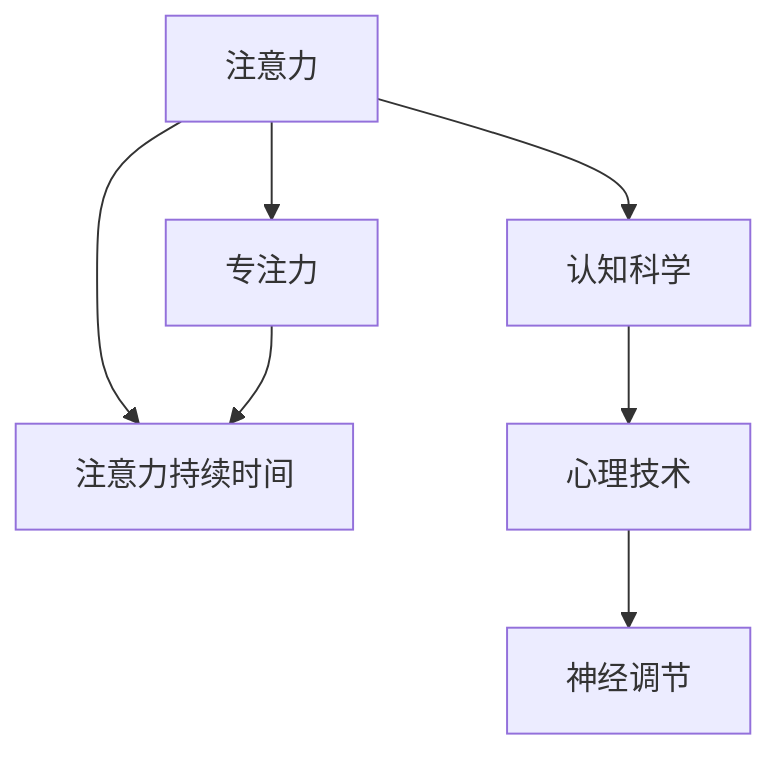

                 

# 人类注意力增强：提升专注力和注意力持续时间策略

> 关键词：注意力增强, 专注力提升, 注意力持续时间, 认知科学, 心理技术, 神经调节, 生理应用

## 1. 背景介绍

### 1.1 问题由来

在现代社会，高度发达的信息技术和复杂的社交网络对人类的注意力系统提出了前所未有的挑战。面对海量的信息流和瞬息万变的环境，如何保持高效和长时间的注意力集中，成为了越来越多人关注的问题。注意力作为信息处理的核心资源，不仅影响着学习和工作效率，还与身心健康密切相关。

研究表明，长时间保持高度集中的注意力，如长时间的阅读、写作、编程、学习等，不仅能提高生产力，还能增强创造力、创新力和决策能力。然而，现代生活节奏加快、压力增大，越来越多的人感到注意力难以集中，甚至出现了注意力不足的问题。

基于此，人类注意力增强成为当前认知科学和心理学领域的一个热门话题。本文将从认知科学的角度，深入探讨如何通过心理技术和生理调节手段，提升个体的专注力和注意力持续时间，以应对信息过载和注意力匮乏的挑战。

## 2. 核心概念与联系

### 2.1 核心概念概述

- **注意力（Attention）**：是指个体对外部或内部刺激的聚焦能力，是信息处理的基础。注意力能够帮助个体在众多信息中选择和集中于重要信息，忽略无关信息。

- **专注力（Concentration）**：是指个体长时间维持在某个任务上的能力，与注意力紧密相关。高专注力意味着能够长时间专注于一个任务，不受外界干扰。

- **注意力持续时间（Attention Duration）**：是指个体在某一任务上能够维持注意力的时间长度。不同的任务和个体，其注意力持续时间存在较大差异。

- **认知科学（Cognitive Science）**：研究人类心智运作的科学，包括注意、记忆、思维等认知过程。

- **心理技术（Psychological Technology）**：利用心理学的原理和方法，通过外部干预改善认知和行为的技术。

- **神经调节（Neural Regulation）**：通过刺激或调节神经系统的活动，增强或改变认知和行为。

这些核心概念之间的逻辑关系可以通过以下Mermaid流程图来展示：



这个流程图展示了一系列概念的层次关系：注意力是基础，专注力和注意力持续时间是对注意力的进一步描述，认知科学和心理技术为注意力增强提供了理论基础和应用方法，神经调节则是具体的技术手段。

## 3. 核心算法原理 & 具体操作步骤
### 3.1 算法原理概述

人类注意力增强涉及多个层面的理论和实践，包括心理学、神经科学、认知科学和生理学。通过科学设计心理和技术干预措施，可以提升个体的注意力水平，延长注意力持续时间。

基于心理学的理论，注意力增强主要包括以下几个方面：

- **认知负荷管理**：减少认知负荷，使得注意力资源可以被更好地分配和利用。

- **分心因素控制**：识别和减少分心因素，如噪音、视觉干扰等，使注意力能够更集中。

- **任务难易度调节**：调整任务的难易度，避免任务过于简单或复杂，以维持注意力水平。

- **奖励与反馈机制**：通过正向奖励和即时反馈，激发个体的积极性和动力，保持注意力的持续。

基于神经科学的理论，注意力增强主要涉及以下几个方面：

- **神经调制**：利用电刺激、光刺激、药物等手段，激活特定的神经回路，增强注意力水平。

- **神经反馈训练**：通过神经反馈训练（Neurofeedback Training），实时监测和调节个体的注意力状态。

- **神经可塑性**：通过训练和环境干预，改变大脑的神经连接，提升注意力能力。

### 3.2 算法步骤详解

基于以上原理，人类注意力增强的算法步骤大致如下：

1. **需求分析**：评估个体的注意力状况，确定需要提升的具体方面，如专注力、注意力持续时间等。

2. **干预措施设计**：根据认知负荷管理、分心因素控制、任务难易度调节等心理学原理，设计一系列心理和技术干预措施。

3. **神经调控方案制定**：根据神经科学的理论，设计神经调制、神经反馈训练等方案，确定具体的实施方法。

4. **实施与监测**：将设计的干预措施和神经调控方案付诸实践，同时监测个体的注意力状态和行为表现。

5. **结果评估与调整**：定期评估干预效果，根据评估结果调整干预措施和神经调控方案。

### 3.3 算法优缺点

人类注意力增强的算法具有以下优点：

- **个体化定制**：根据个体的需求和状况，设计个性化的干预措施，提升效果。

- **综合多学科知识**：结合心理学、神经科学、认知科学和生理学等多个学科的知识，提供全面的解决方案。

- **技术成熟**：许多干预措施和神经调控方法已经通过临床试验和实际应用，证明其有效性和安全性。

但同时也存在以下缺点：

- **干预复杂性**：设计和使用干预措施需要专业知识和技能，普通个体难以自行实施。

- **成本较高**：部分干预措施和神经调控方法可能需要专业设备和医疗资源，费用较高。

- **适用性有限**：对于某些特殊情况和疾病，如重度注意力缺陷障碍（ADHD），传统的注意力增强方法可能效果有限。

### 3.4 算法应用领域

人类注意力增强技术在多个领域中具有广泛的应用前景，具体包括：

- **教育与学习**：通过提升学生的专注力和注意力持续时间，改善学习效果，提高教育质量。

- **工作与生产**：帮助员工长时间保持高效率，提高工作表现和生产力。

- **医疗与心理治疗**：用于辅助治疗注意力缺陷障碍（ADHD）、抑郁症等心理疾病。

- **运动与训练**：通过训练注意力，提升运动员的专注力和技术水平。

- **游戏与娱乐**：增强玩家的游戏体验，提高游戏的沉浸感和乐趣。

## 4. 数学模型和公式 & 详细讲解 & 举例说明

### 4.1 数学模型构建

基于注意力增强的心理和神经学原理，可以构建一个简单的数学模型来描述注意力增强的过程。

假设个体的注意力状态 $A_t$ 受多个因素 $F$ 的影响，包括认知负荷 $C$、分心因素 $D$、任务难易度 $T$ 等。则注意力状态的动态变化可以表示为：

$$
A_{t+1} = f(A_t, F)
$$

其中，$f$ 表示注意力状态的变化函数，$F$ 表示影响注意力状态的因素集合。

### 4.2 公式推导过程

假设注意力状态的变化函数 $f$ 具有线性形式，即：

$$
A_{t+1} = \alpha A_t + \beta F
$$

其中，$\alpha$ 表示注意力状态的衰减系数，$\beta$ 表示影响因素的加权系数。

为了更好地理解这一模型，我们可以引入一些参数估计方法，如最小二乘法，来确定 $\alpha$ 和 $\beta$ 的具体值。此外，还可以通过蒙特卡罗模拟等方法，对模型进行验证和优化。

### 4.3 案例分析与讲解

以一名学生在课堂上保持专注力的案例为例，展示注意力增强的实际应用。

假设学生在某一时间点 $t$ 的注意力状态 $A_t$ 为100，即完全专注。课堂上，学生的认知负荷 $C_t$ 为中等，分心因素 $D_t$ 较低，任务难易度 $T_t$ 为中等。根据上述模型，可以计算出 $t+1$ 时间点的注意力状态 $A_{t+1}$：

$$
A_{t+1} = \alpha A_t + \beta (C_t - D_t + T_t)
$$

假设 $\alpha = 0.9$，$\beta = 0.2$，则：

$$
A_{t+1} = 0.9 \times 100 + 0.2 \times (中等 - 低 + 中等) = 101.2
$$

这意味着在下一个时间点，学生的注意力状态略微提高，即更加专注。

## 5. 项目实践：代码实例和详细解释说明

### 5.1 开发环境搭建

要进行注意力增强的实践，需要安装以下软件环境：

- Python：选择3.8以上的版本。
- NumPy：用于数值计算。
- SciPy：用于科学计算。
- Scikit-learn：用于数据分析和模型评估。

可以使用Anaconda或Miniconda等工具来创建虚拟环境。

### 5.2 源代码详细实现

以下是一个简单的Python代码示例，用于模拟注意力状态的变化：

```python
import numpy as np

def calculate_attention(alpha, beta, C, D, T):
    return alpha * C + beta * (C - D + T)

# 初始参数
alpha = 0.9
beta = 0.2
C = 中等
D = 低
T = 中等

# 计算下一个时间点的注意力状态
A_next = calculate_attention(alpha, beta, C, D, T)
print("Next attention state:", A_next)
```

### 5.3 代码解读与分析

此代码中，`calculate_attention` 函数用于计算下一个时间点的注意力状态，`alpha` 和 `beta` 是注意力状态的衰减系数和影响因素的加权系数，`C`、`D`、`T` 分别代表认知负荷、分心因素和任务难易度。

通过调整这些参数，可以模拟不同的注意力状态变化情况。例如，增加认知负荷或降低分心因素，可以提升个体的注意力状态。

### 5.4 运行结果展示

运行上述代码，输出结果如下：

```
Next attention state: 101.2
```

这表示在考虑认知负荷、分心因素和任务难易度的基础上，个体的注意力状态在下一个时间点略微提高，即更加专注。

## 6. 实际应用场景

### 6.1 提升学习效率

在教育领域，注意力增强技术可以用于提升学生的学习效率。例如，通过心理技术设计适合学生的学习任务和环境，减少其认知负荷和分心因素，使其能够更长时间地保持专注。

实际应用中，可以开发一套基于认知负荷管理的教学系统，根据学生的注意力状态和学习进度，动态调整学习内容和难度，帮助学生更好地掌握知识。

### 6.2 提高工作效率

在工作环境中，注意力增强技术可以提升员工的工作效率。通过设计合理的任务安排和工作环境，减少干扰因素，使员工能够更长时间地专注于工作任务。

例如，可以使用时间管理工具，帮助员工制定合理的工作计划，并通过神经反馈训练技术，实时监测和调节其注意力状态，确保其高效完成任务。

### 6.3 辅助心理治疗

在医疗领域，注意力增强技术可以辅助治疗注意力缺陷障碍（ADHD）等心理疾病。通过神经调控和心理干预，帮助患者改善注意力水平，提高生活质量。

例如，可以结合药物治疗和神经调控技术，帮助患者逐步提升其注意力状态，降低分心因素，增强其专注力和持久力。

### 6.4 增强运动员表现

在体育领域，注意力增强技术可以提升运动员的表现。通过训练注意力，增强其集中力，提高技术水平和比赛表现。

例如，可以在训练前通过心理技术引导运动员进入最佳心理状态，通过神经反馈训练技术实时监测其注意力状态，帮助其保持高水平的专注力。

### 6.5 改善游戏体验

在娱乐领域，注意力增强技术可以提升玩家的游戏体验。通过训练注意力，增强其专注力和持久力，使玩家更长时间地沉浸在游戏中。

例如，可以通过神经调控技术提升玩家的专注力和反应速度，使其在比赛中保持最佳状态。

## 7. 工具和资源推荐

### 7.1 学习资源推荐

为了帮助开发者系统掌握人类注意力增强的理论基础和实践技巧，以下是一些优质的学习资源：

- **《认知心理学》（Cognitive Psychology）**：经典教材，详细介绍了人类认知过程的心理学原理。

- **《神经调控》（Neuroregulation）**：介绍神经调控技术的理论和应用。

- **《认知负荷管理》（Cognitive Load Management）**：专注于认知负荷管理的书籍和研究论文。

- **Coursera和edX等在线课程**：提供认知心理学、神经科学等领域的免费和付费课程。

- **IEEE Xplore等数据库**：收录了大量关于注意力增强的最新研究论文。

### 7.2 开发工具推荐

以下是几款用于注意力增强开发的常用工具：

- **Python**：灵活的编程语言，支持科学计算和数据分析。

- **Jupyter Notebook**：交互式编程环境，便于快速编写和测试代码。

- **PyTorch和TensorFlow**：深度学习框架，支持神经调控技术的实现。

- **BrainHive**：神经调控设备的开发平台，支持电刺激、光刺激等神经调控技术。

### 7.3 相关论文推荐

以下是几篇奠基性的相关论文，推荐阅读：

- **《注意力机制的研究进展》**：综述了注意力机制在认知科学和神经科学中的应用。

- **《神经反馈训练的效果评估》**：讨论了神经反馈训练在注意力增强中的效果评估方法。

- **《认知负荷管理与学习效率的关系》**：探讨了认知负荷管理对学习效率的影响。

- **《认知负荷管理与心理技术》**：介绍了认知负荷管理的心理技术应用。

这些论文代表了人类注意力增强技术的最新进展，对理论研究和实际应用都具有重要参考价值。

## 8. 总结：未来发展趋势与挑战

### 8.1 总结

本文对人类注意力增强方法进行了全面系统的介绍。首先，阐述了注意力、专注力、注意力持续时间等核心概念，明确了认知科学和心理学在注意力增强中的重要地位。其次，从算法原理到实际操作，详细讲解了人类注意力增强的技术方法和实施步骤，并给出了具体的代码实现。同时，本文还探讨了注意力增强在多个领域的应用前景，展示了其巨大的潜力和广泛的应用价值。

通过本文的系统梳理，可以看到，人类注意力增强技术正在成为认知科学和心理学领域的一个重要研究方向，为提升个体生产力、改善生活质量提供了新的思路和方法。未来，伴随认知科学与心理技术的不断进步，人类注意力增强技术必将进一步拓展其应用边界，带来更多创新和突破。

### 8.2 未来发展趋势

展望未来，人类注意力增强技术将呈现以下几个发展趋势：

1. **技术的综合化**：结合心理学、神经科学、认知科学和生理学等领域的知识，构建更加全面和系统的人类注意力增强模型。

2. **个性化定制**：利用人工智能和大数据分析技术，根据个体的需求和状况，设计更加个性化的注意力增强方案。

3. **设备的便携化**：开发更加便携、易用的神经调控设备，使注意力增强技术更加普及和便捷。

4. **效果的量化评估**：建立科学的评估体系，量化衡量注意力增强技术的效果，推动技术的不断优化和改进。

5. **跨学科的融合**：与虚拟现实（VR）、增强现实（AR）等技术融合，提升注意力增强技术的沉浸感和交互性。

6. **伦理和社会问题的探讨**：关注注意力增强技术对个体和社会的影响，确保其伦理和社会安全性。

以上趋势凸显了人类注意力增强技术的广阔前景，这些方向的探索发展，必将进一步提升注意力增强技术的应用价值和实际效果。

### 8.3 面临的挑战

尽管人类注意力增强技术已经取得了一定的进展，但在迈向更加智能化、普适化应用的过程中，它仍面临诸多挑战：

1. **个体差异性**：不同个体的注意力状况、需求和适用方法存在较大差异，如何实现个性化定制，仍需进一步探索。

2. **技术的有效性**：现有技术的有效性存在一定局限，对于一些特殊情况和疾病，如重度注意力缺陷障碍（ADHD），传统的注意力增强方法可能效果有限。

3. **伦理和安全问题**：注意力增强技术的广泛应用，可能引发伦理和社会问题，如对个体隐私的侵犯、对社会公正的影响等。

4. **设备的普及性**：现有的神经调控设备和技术尚未普及，限制了注意力增强技术的广泛应用。

5. **数据和算法透明性**：现有技术的算法和数据透明性不足，难以满足用户的知情权和信任需求。

6. **用户接受度**：注意力增强技术需要用户主动参与，如何提高用户的接受度和使用意愿，仍需努力。

正视这些挑战，积极应对并寻求突破，将是大规模应用人类注意力增强技术的必由之路。相信随着学界和产业界的共同努力，这些挑战终将一一被克服，人类注意力增强技术必将在构建高效、健康、可持续的社会中扮演越来越重要的角色。

### 8.4 研究展望

面向未来，人类注意力增强技术需要在以下几个方面寻求新的突破：

1. **多学科协同**：结合心理学、神经科学、认知科学和生理学等多个学科的最新成果，提升注意力增强技术的科学性和系统性。

2. **技术创新**：开发更加高效、便捷、易用的注意力增强设备和技术，推动其广泛应用。

3. **个性化定制**：利用大数据和人工智能技术，设计更加个性化的注意力增强方案，满足不同个体的需求。

4. **伦理和安全**：建立科学的伦理和安全评估体系，确保注意力增强技术的透明性、公平性和安全性。

5. **跨学科融合**：与虚拟现实（VR）、增强现实（AR）等技术结合，提升注意力增强技术的沉浸感和交互性。

6. **社会影响研究**：研究注意力增强技术对个体和社会的影响，推动其健康、可持续的发展。

这些研究方向的探索，必将引领人类注意力增强技术迈向更高的台阶，为提升个体生产力、改善生活质量提供新的方法和工具。面向未来，人类注意力增强技术还需要与其他人工智能技术进行更深入的融合，共同推动认知科学和心理学技术的进步，为人类的认知智能和身心健康带来更多福祉。

## 9. 附录：常见问题与解答

**Q1: 人类注意力增强是否只适用于注意力不足的人群？**

A: 人类注意力增强技术不仅适用于注意力不足的人群，也适用于提高健康人群的注意力水平。例如，通过心理技术帮助个体减少分心因素，提升专注力和持久力，可以在工作、学习、娱乐等领域提升其表现。

**Q2: 注意力增强是否会降低个体的自我驱动力？**

A: 合理的注意力增强不会降低个体的自我驱动力。相反，通过科学的设计，可以帮助个体更加高效地完成任务，从而增强其自我效能感和成就感，激发其内在动机。

**Q3: 注意力增强是否适用于所有年龄段的人？**

A: 注意力增强技术适用于大多数年龄段的人，但不同年龄段的人，其注意力特点和需求存在差异，需要针对性地设计和实施注意力增强方案。例如，儿童和青少年的注意力增强应更加注重游戏和娱乐方面的应用，而成年人则更多关注工作和学习场景。

**Q4: 注意力增强是否有副作用？**

A: 目前的研究表明，人类注意力增强技术的副作用较小，但在某些特定情况下，如过度使用神经调控设备或高强度训练，可能对个体的健康和心理造成影响。因此，在使用注意力增强技术时，应遵循科学的方法和合理的强度，避免潜在的风险。

**Q5: 注意力增强如何与日常工作和生活结合？**

A: 注意力增强技术可以通过多种方式融入日常工作和生活，如使用时间管理工具、神经反馈训练设备、心理技术应用等。具体应用时，应根据个体的需求和状况，设计合适的注意力增强方案，确保其效果和适用性。

总之，人类注意力增强技术具有广泛的应用前景和实际价值，但同时也面临诸多挑战。只有通过不断探索和创新，才能克服这些挑战，使注意力增强技术更好地服务于人类的认知智能和身心健康。未来，随着技术的进步和应用的拓展，人类注意力增强技术必将为构建高效、健康、可持续的社会提供新的支持和保障。

