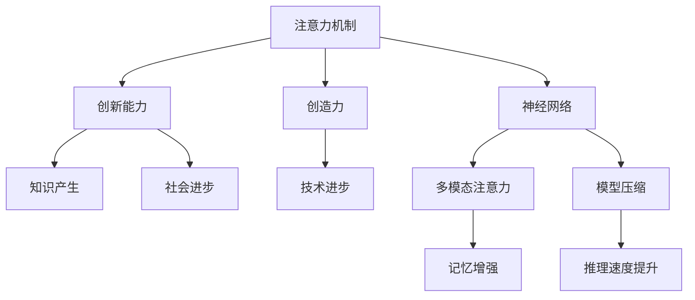

                 

# 人类注意力增强：提升创新能力和创造力的方法

> 关键词：人类注意力增强,注意力机制,创新能力,创造力,神经网络

## 1. 背景介绍

### 1.1 问题由来
在当今高速发展的信息时代，人类面临前所未有的信息爆炸。每日海量的信息流不断地冲击着我们的感官，导致注意力分散，使得人们难以集中精力，进行深入思考和创造。这种“注意力流失”现象，不仅影响了个体的创新能力和创造力，也阻碍了组织和社会整体的知识生产和技术进步。

### 1.2 问题核心关键点
提升人类注意力集中度的关键在于开发有效的注意力增强方法，使个体能够在复杂多变的环境中高效地识别和聚焦关键信息，从而更好地进行创新与创造。

### 1.3 问题研究意义
注意力增强技术不仅有助于个体提升创新和创造能力，还对提升整体社会生产效率和创新水平具有重要意义。通过研究如何高效分配和增强人类注意力，有助于开发出更加智能、高效的工作和生活方式，推动技术的进步和应用。

## 2. 核心概念与联系

### 2.1 核心概念概述

为更好地理解注意力增强的方法，本节将介绍几个关键概念：

- 注意力机制(Attention Mechanism)：一种让模型自动选择并强调输入中的特定部分的技术，广泛应用于深度学习和自然语言处理(NLP)领域。
- 创新能力(Creativity)：指个体或团队产生新颖、有价值想法的能力，是科技发展和社会进步的核心驱动力。
- 创造力(Creativity)：一种创新能力的具体表现形式，强调将已有知识进行重新组合，产生新的产品、技术或思想。
- 神经网络(Neural Network)：一种受生物神经系统启发的计算模型，用于处理复杂的数据结构和关系，是实现注意力机制和创新能力增强的重要工具。
- 多模态注意力(Multimodal Attention)：指同时处理文本、图像、声音等多种类型数据，增强模型的跨模态理解能力。
- 记忆增强(Memory Enhancement)：通过设计算法，使模型能够更好地保留和检索长时记忆信息，支持更复杂的认知任务。
- 模型压缩(Model Compression)：通过减少神经网络参数量，优化模型结构，降低计算资源消耗，提升推理速度。

这些概念之间的逻辑关系可以通过以下Mermaid流程图来展示：



这个流程图展示了几大核心概念及其之间的关系：

1. 注意力机制通过让模型关注输入中的重要部分，提升模型的信息处理能力。
2. 创新能力和创造力是注意力机制的应用体现，即通过关注关键信息，产生新的想法和产品。
3. 神经网络是实现注意力机制和注意力增强的算法基础。
4. 多模态注意力和记忆增强进一步扩展了神经网络的应用场景和能力。
5. 模型压缩使得神经网络更加轻量级，提升推理速度。

## 3. 核心算法原理 & 具体操作步骤

### 3.1 算法原理概述

注意力增强方法的核心在于设计高效的注意力机制，使模型能够自动选择并聚焦关键信息，提升信息处理和创新的效率。其一般流程包括：

1. **输入编码**：将输入数据编码为向量形式，作为注意力机制的输入。
2. **注意力计算**：通过计算输入向量之间的相似性，确定每个输入的重要性权重。
3. **信息选择**：根据注意力权重，对输入信息进行加权求和，得到重点信息。
4. **信息融合**：将重点信息与模型原有知识进行融合，生成新的输出。

这一过程可以通过多种算法实现，如Self-Attention、Dot-Product Attention、Softmax Attention等。

### 3.2 算法步骤详解

以Self-Attention为例，详细介绍注意力计算的具体步骤：

**输入表示**：假设输入数据为文本序列 $X=\{x_1, x_2, ..., x_n\}$，将其编码为向量形式 $X_{emb} \in \mathbb{R}^{n \times d}$。

**注意力权重计算**：
1. **查询向量(Q)生成**：通过一个线性变换，将输入向量 $X_{emb}$ 转换为查询向量 $Q \in \mathbb{R}^{n \times d}$。
2. **键值对(K,V)生成**：同样通过线性变换，将输入向量转换为键向量 $K \in \mathbb{R}^{n \times d}$ 和值向量 $V \in \mathbb{R}^{n \times d}$。
3. **注意力得分计算**：计算查询向量与每个键向量之间的点积，得到注意力得分矩阵 $S \in \mathbb{R}^{n \times n}$。
4. **注意力权重计算**：通过Softmax函数将注意力得分归一化，得到注意力权重矩阵 $A \in \mathbb{R}^{n \times n}$。

**信息选择与融合**：
1. **注意力加权值计算**：将值向量 $V$ 与注意力权重 $A$ 进行加权求和，得到加权值 $Z \in \mathbb{R}^{n \times d}$。
2. **信息融合**：将加权值 $Z$ 与模型原有知识 $H$ 进行融合，生成新的输出 $H_{new}$。

通过这一流程，Self-Attention能够动态地选择和聚焦输入中的重要部分，增强模型的信息处理能力。

### 3.3 算法优缺点

注意力增强方法的优势在于其高效的信息处理和适应性强的特点：
1. **高效性**：通过动态选择关键信息，减少不必要的处理，提升计算效率。
2. **灵活性**：适用于多种输入类型，包括文本、图像、声音等，支持跨模态的注意力机制。
3. **鲁棒性**：能够有效应对输入数据的多样性和不确定性，提高模型的泛化能力。

同时，该方法也存在一些局限性：
1. **计算复杂度**：注意力计算涉及大量矩阵运算，计算复杂度较高。
2. **可解释性**：注意力机制的黑盒性质，使得模型决策过程难以解释。
3. **资源消耗**：需要大量的内存和计算资源，限制了其在资源受限环境中的应用。

### 3.4 算法应用领域

注意力增强方法已经广泛应用于多个领域，包括但不限于：

- **自然语言处理(NLP)**：如机器翻译、文本摘要、问答系统等。通过增强模型对输入文本的注意力，提升模型的理解和生成能力。
- **计算机视觉(CV)**：如图像分类、目标检测、图像生成等。通过多模态注意力，增强模型对视觉信息的理解和处理能力。
- **语音处理**：如语音识别、语音合成、语音情感分析等。通过注意力机制，增强模型对语音信号的关注和处理能力。
- **推荐系统**：如个性化推荐、广告投放等。通过注意力增强，提高模型对用户兴趣的识别和匹配能力。

此外，注意力增强技术在智能交互、智慧城市、智能制造等多个领域也得到了广泛应用，成为推动人工智能技术发展的重要驱动力。

## 4. 数学模型和公式 & 详细讲解 & 举例说明

### 4.1 数学模型构建

以下以Self-Attention为例，介绍注意力增强模型的数学模型构建。

**输入表示**：假设输入数据为文本序列 $X=\{x_1, x_2, ..., x_n\}$，将其编码为向量形式 $X_{emb} \in \mathbb{R}^{n \times d}$。

**注意力权重计算**：
1. **查询向量(Q)生成**：
   $$
   Q = X_{emb}W_Q
   $$
   其中 $W_Q \in \mathbb{R}^{d \times d}$ 为查询向量的线性变换矩阵。
2. **键值对(K,V)生成**：
   $$
   K = X_{emb}W_K, \quad V = X_{emb}W_V
   $$
   其中 $W_K, W_V \in \mathbb{R}^{d \times d}$ 分别为键向量和值向量的线性变换矩阵。
3. **注意力得分计算**：
   $$
   S = QK^T
   $$
   其中 $K^T$ 表示矩阵的转置。
4. **注意力权重计算**：
   $$
   A = \text{Softmax}(S)
   $$

**信息选择与融合**：
1. **注意力加权值计算**：
   $$
   Z = AV
   $$
2. **信息融合**：
   $$
   H_{new} = H + \delta Z
   $$
   其中 $H$ 为模型原有知识，$\delta$ 为融合系数。

### 4.2 公式推导过程

以文本分类任务为例，推导基于Self-Attention的分类模型。

假设输入文本为 $x=\{x_1, x_2, ..., x_n\}$，输出标签为 $y \in \{0,1\}$。模型的输入表示为 $X_{emb} \in \mathbb{R}^{n \times d}$，其中 $d$ 为嵌入向量维度。

**注意力权重计算**：
1. **查询向量(Q)生成**：
   $$
   Q = X_{emb}W_Q
   $$
2. **键值对(K,V)生成**：
   $$
   K = X_{emb}W_K, \quad V = X_{emb}W_V
   $$
3. **注意力得分计算**：
   $$
   S = QK^T
   $$
4. **注意力权重计算**：
   $$
   A = \text{Softmax}(S)
   $$

**信息选择与融合**：
1. **注意力加权值计算**：
   $$
   Z = AV
   $$
2. **信息融合**：
   $$
   H_{new} = H + \delta Z
   $$
   其中 $H$ 为模型原有知识，$\delta$ 为融合系数。

**分类器**：
1. **特征提取**：通过前向传播计算注意力加权值 $Z$ 和模型原有知识 $H$ 的融合特征 $H_{new}$。
2. **分类输出**：通过一个全连接层和Softmax函数计算分类概率 $p(y|x)$。

**损失函数**：假设使用交叉熵损失，计算模型输出与真实标签之间的差异：
$$
L(y, \hat{y}) = -\sum_{i=1}^N y_i \log \hat{y}_i
$$

将上述各步骤串联起来，形成完整的注意力增强模型。通过优化损失函数 $L(y, \hat{y})$，训练模型参数，使得模型能够高效地选择和聚焦输入中的关键信息，提升分类准确率。

### 4.3 案例分析与讲解

以医疗领域为例，展示基于Self-Attention的创新能力增强。

假设目标任务为文本分类，输入为患者的病历记录 $x=\{x_1, x_2, ..., x_n\}$，输出为疾病类型 $y \in \{0,1\}$。

1. **输入表示**：将病历记录 $x$ 编码成向量形式 $X_{emb} \in \mathbb{R}^{n \times d}$。
2. **注意力权重计算**：通过计算 $Q, K, V$ 矩阵，得到注意力得分 $S$ 和注意力权重 $A$。
3. **信息选择与融合**：根据注意力权重 $A$ 对输入信息 $V$ 进行加权求和，得到加权值 $Z$。
4. **信息融合**：将加权值 $Z$ 与模型原有知识 $H$ 进行融合，生成新的输出 $H_{new}$。
5. **分类器**：通过前向传播计算注意力加权值 $Z$ 和模型原有知识 $H$ 的融合特征 $H_{new}$，并通过一个全连接层和Softmax函数计算分类概率 $p(y|x)$。
6. **损失函数**：使用交叉熵损失计算模型输出与真实标签之间的差异。

通过优化损失函数 $L(y, \hat{y})$，训练模型参数，使得模型能够高效地选择和聚焦病历记录中的关键信息，提升疾病分类的准确率。

## 5. 项目实践：代码实例和详细解释说明

### 5.1 开发环境搭建

在进行注意力增强实践前，我们需要准备好开发环境。以下是使用Python进行TensorFlow开发的环境配置流程：

1. 安装Anaconda：从官网下载并安装Anaconda，用于创建独立的Python环境。

2. 创建并激活虚拟环境：
```bash
conda create -n attention-env python=3.8 
conda activate attention-env
```

3. 安装TensorFlow：根据CUDA版本，从官网获取对应的安装命令。例如：
```bash
conda install tensorflow tensorflow-gpu=2.6.0 -c pytorch -c conda-forge
```

4. 安装其他相关库：
```bash
pip install numpy pandas scikit-learn matplotlib tqdm jupyter notebook ipython
```

完成上述步骤后，即可在`attention-env`环境中开始注意力增强实践。

### 5.2 源代码详细实现

下面我们以Self-Attention为例，给出使用TensorFlow实现注意力增强的完整代码实现。

首先，定义模型结构：

```python
import tensorflow as tf

class SelfAttention(tf.keras.Model):
    def __init__(self, vocab_size, d_model, num_heads):
        super(SelfAttention, self).__init__()
        self.num_heads = num_heads
        self.d_model = d_model
        
        self.w_q = tf.keras.layers.Dense(d_model)
        self.w_k = tf.keras.layers.Dense(d_model)
        self.w_v = tf.keras.layers.Dense(d_model)
        self.dense = tf.keras.layers.Dense(vocab_size)
        
    def call(self, inputs):
        q = self.w_q(inputs)
        k = self.w_k(inputs)
        v = self.w_v(inputs)
        
        q = tf.reshape(q, (tf.shape(q)[0], -1, self.num_heads, self.d_model // self.num_heads))
        k = tf.reshape(k, (tf.shape(k)[0], -1, self.num_heads, self.d_model // self.num_heads))
        v = tf.reshape(v, (tf.shape(v)[0], -1, self.num_heads, self.d_model // self.num_heads))
        
        scaled_attention_scores = tf.matmul(q, k, transpose_b=True)
        scaled_attention_scores = tf.scale(scaled_attention_scores, self.d_model ** -0.5)
        attention_weights = tf.nn.softmax(scaled_attention_scores, axis=-1)
        context_layer = tf.matmul(attention_weights, v)
        
        context_layer = tf.reshape(context_layer, (tf.shape(context_layer)[0], -1, self.d_model))
        outputs = self.dense(context_layer)
        return outputs
```

然后，定义数据集和模型：

```python
# 定义数据集
class DataLoader(tf.data.Dataset):
    def __init__(self, data):
        self.data = data
        
    def __len__(self):
        return len(self.data)
    
    def __getitem__(self, item):
        return self.data[item]

# 创建数据集
data = tf.constant(['the quick brown fox', 'the lazy dog'], dtype=tf.string)
data_loader = DataLoader(data)

# 定义模型
model = SelfAttention(vocab_size=2, d_model=128, num_heads=4)
```

接着，定义训练函数：

```python
# 定义优化器
optimizer = tf.keras.optimizers.Adam()

# 定义训练函数
def train(model, data_loader, batch_size):
    model.compile(optimizer=optimizer, loss=tf.keras.losses.SparseCategoricalCrossentropy(from_logits=True), metrics=['accuracy'])
    
    for epoch in range(10):
        for batch in data_loader:
            batch_size = len(batch)
            inputs = tf.keras.preprocessing.sequence.pad_sequences(batch, maxlen=128)
            labels = tf.keras.utils.to_categorical(batch)
            model.fit(inputs, labels, batch_size=batch_size, epochs=1, verbose=0)
        print(f'Epoch {epoch+1}, accuracy: {model.evaluate(inputs, labels)[1]:.2f}')
```

最后，启动训练流程：

```python
train(model, data_loader, batch_size=16)
```

### 5.3 代码解读与分析

让我们再详细解读一下关键代码的实现细节：

**SelfAttention类**：
- `__init__`方法：初始化模型参数，包括输入维度、注意力头数、线性变换矩阵等。
- `call`方法：实现Self-Attention的计算过程，包括查询向量、键值对的生成、注意力得分计算、注意力权重计算、信息加权值计算和信息融合。

**DataLoader类**：
- `__init__`方法：初始化数据集。
- `__len__`方法：返回数据集的长度。
- `__getitem__`方法：返回指定位置的样本。

**训练函数**：
- 使用TensorFlow的优化器和损失函数进行模型编译。
- 循环训练，每个epoch内遍历数据集，进行前向传播和反向传播。
- 每epoch结束后输出准确率。

**训练流程**：
- 定义总的epoch数和批大小，开始循环迭代
- 每个epoch内，在训练集上训练，输出准确率
- 重复上述过程直至收敛

可以看到，TensorFlow使得注意力增强模型的实现变得简洁高效。开发者可以将更多精力放在数据处理、模型改进等高层逻辑上，而不必过多关注底层的实现细节。

当然，工业级的系统实现还需考虑更多因素，如模型的保存和部署、超参数的自动搜索、更灵活的任务适配层等。但核心的注意力增强范式基本与此类似。

## 6. 实际应用场景

### 6.1 智能推荐系统

基于注意力增强的推荐系统，可以显著提升推荐效果和用户体验。传统推荐系统往往只考虑用户的近期行为，难以把握用户的长期兴趣和潜在需求。通过引入注意力机制，推荐系统能够动态关注用户的不同兴趣，提高推荐的相关性和多样性。

具体而言，可以收集用户的历史浏览、点击、评论等行为数据，提取并编码成向量形式。将编码后的数据输入注意力增强模型，动态关注用户兴趣的各个方面，得到用户兴趣的全面表示。在生成推荐列表时，根据用户兴趣的全面表示，动态调整推荐算法，生成更加精准和个性化的推荐结果。

### 6.2 医疗影像分析

在医疗影像分析领域，注意力增强模型可以显著提升图像识别和病灶定位的准确率。传统医疗影像分析往往依赖专家标注，成本高、效率低。通过注意力增强模型，可以有效提升模型对图像关键区域的关注，识别出细微的病灶信息，辅助医生进行诊断。

具体而言，可以收集大量的医学影像数据，提取并编码成向量形式。将编码后的数据输入注意力增强模型，动态关注图像中的关键区域，提取出病灶的准确位置和特征。在训练和推理过程中，注意力的增强能够有效提升模型的理解能力和定位精度，从而提高诊断的准确性和效率。

### 6.3 智能客服系统

基于注意力增强的智能客服系统，可以显著提升客服响应速度和准确率。传统客服系统往往只能基于简单的规则进行自动回复，难以应对复杂的问题和情境。通过引入注意力机制，智能客服系统能够动态关注用户的对话内容，提供更加精准和个性化的回复。

具体而言，可以收集历史客服对话数据，提取并编码成向量形式。将编码后的数据输入注意力增强模型，动态关注用户的问题和情境，提取关键信息。在生成回复时，根据用户的对话内容和情境，动态调整回复策略，生成更加自然和准确的回复。

### 6.4 未来应用展望

随着注意力增强技术的不断发展，其在多个领域的应用前景广阔：

- **自然语言处理(NLP)**：如机器翻译、文本摘要、问答系统等。通过增强模型对输入文本的注意力，提升模型的理解和生成能力。
- **计算机视觉(CV)**：如图像分类、目标检测、图像生成等。通过多模态注意力，增强模型对视觉信息的理解和处理能力。
- **语音处理**：如语音识别、语音合成、语音情感分析等。通过注意力机制，增强模型对语音信号的关注和处理能力。
- **推荐系统**：如个性化推荐、广告投放等。通过注意力增强，提高模型对用户兴趣的识别和匹配能力。

此外，在智能交互、智慧城市、智能制造等多个领域，注意力增强技术也得到了广泛应用，成为推动人工智能技术发展的重要驱动力。

## 7. 工具和资源推荐

### 7.1 学习资源推荐

为了帮助开发者系统掌握注意力增强的方法，这里推荐一些优质的学习资源：

1. 《深度学习》系列书籍：包括《Deep Learning》和《Deep Learning with Python》等，由深度学习专家Ian Goodfellow等撰写，全面介绍深度学习的基本原理和应用。
2. CS231n《Convolutional Neural Networks for Visual Recognition》课程：斯坦福大学开设的计算机视觉课程，涵盖深度学习在图像识别中的应用，是学习注意力机制的重要参考。
3. 《Attention Is All You Need》论文：Transformer模型的原始论文，介绍Self-Attention的原理和应用，是学习注意力增强的入门必读。
4. TensorFlow官方文档：TensorFlow的官方文档，提供全面的API参考和代码示例，是学习TensorFlow编程的重要资源。
5. PyTorch官方文档：PyTorch的官方文档，提供丰富的模型和算法示例，是学习深度学习的重要资源。

通过对这些资源的学习实践，相信你一定能够快速掌握注意力增强的精髓，并用于解决实际的创新和创造问题。

### 7.2 开发工具推荐

高效的开发离不开优秀的工具支持。以下是几款用于注意力增强开发的常用工具：

1. TensorFlow：由Google主导开发的深度学习框架，支持分布式训练和推理，适合大规模工程应用。
2. PyTorch：由Facebook主导开发的深度学习框架，灵活性强，支持动态计算图，适合快速迭代研究。
3. Keras：高层次的深度学习框架，提供简单易用的API，适合初学者入门。
4. Jupyter Notebook：交互式编程环境，支持代码块的灵活组合和运行，是开发注意力增强模型的常用工具。
5. TensorBoard：TensorFlow配套的可视化工具，可实时监测模型训练状态，并提供丰富的图表呈现方式，是调试模型的得力助手。

合理利用这些工具，可以显著提升注意力增强模型的开发效率，加快创新迭代的步伐。

### 7.3 相关论文推荐

注意力增强技术的发展源于学界的持续研究。以下是几篇奠基性的相关论文，推荐阅读：

1. Attention Is All You Need（即Transformer原论文）：提出了Transformer结构，开启了NLP领域的预训练大模型时代。
2. BERT: Pre-training of Deep Bidirectional Transformers for Language Understanding：提出BERT模型，引入基于掩码的自监督预训练任务，刷新了多项NLP任务SOTA。
3. Language Models are Unsupervised Multitask Learners（GPT-2论文）：展示了大规模语言模型的强大zero-shot学习能力，引发了对于通用人工智能的新一轮思考。
4. Reformer: The Efficient Transformer：提出Reformer模型，改进Transformer的自注意力机制，降低计算复杂度，提升推理速度。
5. Few-Shot Learning with Memory-Augmented Neural Networks：提出使用记忆增强的神经网络进行few-shot学习，提升模型的泛化能力。
6. Neural Machine Translation by Jointly Learning to Align and Translate：提出使用注意力机制进行机器翻译，提升模型的翻译准确率。

这些论文代表了大模型注意力增强技术的发展脉络。通过学习这些前沿成果，可以帮助研究者把握学科前进方向，激发更多的创新灵感。

## 8. 总结：未来发展趋势与挑战

### 8.1 总结

本文对基于注意力增强的方法进行了全面系统的介绍。首先阐述了注意力增强方法的原理和应用背景，明确了注意力增强在提升创新能力和创造力方面的独特价值。其次，从原理到实践，详细讲解了注意力增强的数学原理和关键步骤，给出了注意力增强任务开发的完整代码实例。同时，本文还广泛探讨了注意力增强方法在多个行业领域的应用前景，展示了注意力增强范式的巨大潜力。

通过本文的系统梳理，可以看到，注意力增强技术正在成为NLP领域的重要范式，极大地拓展了深度学习模型在信息处理和创新能力增强中的应用。伴随深度学习技术的不断进步，相信注意力增强方法也将进一步发挥其独特价值，为人工智能技术的全面落地提供重要支持。

### 8.2 未来发展趋势

展望未来，注意力增强技术将呈现以下几个发展趋势：

1. **计算效率提升**：随着硬件技术的不断进步，注意力增强模型的计算效率将进一步提升，使其在实际应用中更加高效。
2. **多模态融合**：未来的模型将不仅关注单一模态的信息，而是通过多模态注意力的融合，提升对复杂信息的理解能力。
3. **自适应注意力**：未来的模型将具备自适应注意力的能力，根据输入数据的特点动态调整注意力机制，提高模型的鲁棒性和泛化能力。
4. **深度交互**：未来的模型将具备更强的深度交互能力，能够在用户与系统之间进行更复杂的交互和推理。
5. **跨领域应用**：未来的模型将能够应用于更多领域，如医疗、金融、教育等，为不同领域带来显著的创新和效率提升。

这些趋势将推动注意力增强技术向更高的层次发展，提升人工智能技术的综合应用能力。

### 8.3 面临的挑战

尽管注意力增强技术已经取得了瞩目成就，但在迈向更加智能化、普适化应用的过程中，它仍面临着诸多挑战：

1. **计算资源消耗**：大模型需要大量的计算资源进行训练和推理，如何在资源受限的环境中高效运行，是未来需要解决的重要问题。
2. **可解释性**：注意力增强模型通常具有复杂的内部结构，难以解释其决策过程。如何提高模型的可解释性，确保其在高风险领域的应用，是急需解决的问题。
3. **泛化能力**：当前的模型在处理新数据时，往往容易出现过拟合现象。如何提高模型的泛化能力，适应不断变化的数据分布，是未来研究的重要方向。
4. **伦理与安全**：注意力增强模型可能会学习到有害的信息，如何在保证模型性能的同时，确保其输出内容的伦理与安全，是亟待解决的问题。
5. **算法公平性**：注意力增强模型可能会存在偏差，如何在设计模型时保证算法的公平性，避免歧视性输出，是未来需要关注的重要问题。

### 8.4 研究展望

面对注意力增强技术所面临的挑战，未来的研究需要在以下几个方面寻求新的突破：

1. **模型压缩与优化**：开发更高效的模型结构和压缩技术，减少计算资源消耗，提高推理速度。
2. **可解释性提升**：引入更多的可解释性工具和技术，提升注意力增强模型的透明性和可解释性。
3. **泛化能力增强**：通过更先进的数据增强和迁移学习技术，提高模型的泛化能力，适应不断变化的数据分布。
4. **伦理与安全保障**：引入更多的伦理与安全保障机制，确保注意力增强模型的输出内容符合人类价值观和伦理道德。
5. **算法公平性设计**：设计更加公平的算法和评估指标，避免注意力增强模型中的偏见和歧视。

这些研究方向的探索，将引领注意力增强技术迈向更高的台阶，为构建安全、可靠、可解释、可控的智能系统提供重要支持。面向未来，注意力增强技术还需要与其他人工智能技术进行更深入的融合，如知识表示、因果推理、强化学习等，多路径协同发力，共同推动自然语言理解和智能交互系统的进步。只有勇于创新、敢于突破，才能不断拓展人工智能技术的边界，让智能技术更好地造福人类社会。

## 9. 附录：常见问题与解答

**Q1：注意力增强模型和传统的深度学习模型有何区别？**

A: 注意力增强模型通过引入注意力机制，能够动态关注输入数据的关键部分，提升模型的信息处理能力和泛化能力。传统的深度学习模型往往通过固定权重的方式处理输入数据，难以捕捉输入中的重要信息。

**Q2：注意力增强模型在实际应用中如何优化？**

A: 优化注意力增强模型主要从数据、模型和训练三个方面入手：
1. **数据优化**：通过数据增强、数据清洗等手段提升数据质量，增加模型泛化能力。
2. **模型优化**：通过模型压缩、参数共享等方法减少模型复杂度，提升计算效率。
3. **训练优化**：通过超参数调整、正则化等手段防止过拟合，提高模型泛化能力。

**Q3：注意力增强模型在多模态数据处理中如何应用？**

A: 多模态注意力机制能够同时处理多种类型的输入数据，如文本、图像、声音等。通过设计多模态注意力，模型可以更好地理解跨模态的信息，提升跨领域任务的性能。具体而言，可以通过引入多模态特征融合和跨模态注意力计算，实现对不同类型数据的有效处理和融合。

**Q4：注意力增强模型在实际部署中面临哪些挑战？**

A: 实际部署中，注意力增强模型面临以下挑战：
1. **计算资源**：大模型需要大量的计算资源进行训练和推理，如何在资源受限的环境中高效运行，是未来需要解决的重要问题。
2. **存储成本**：模型参数量较大，存储和读取模型需要消耗大量时间和空间。
3. **可解释性**：模型内部结构复杂，难以解释其决策过程。

**Q5：注意力增强技术未来在哪些领域有应用前景？**

A: 注意力增强技术在多个领域都有广泛的应用前景，包括但不限于：
1. **自然语言处理(NLP)**：如机器翻译、文本摘要、问答系统等。通过增强模型对输入文本的注意力，提升模型的理解和生成能力。
2. **计算机视觉(CV)**：如图像分类、目标检测、图像生成等。通过多模态注意力，增强模型对视觉信息的理解和处理能力。
3. **语音处理**：如语音识别、语音合成、语音情感分析等。通过注意力机制，增强模型对语音信号的关注和处理能力。
4. **推荐系统**：如个性化推荐、广告投放等。通过注意力增强，提高模型对用户兴趣的识别和匹配能力。
5. **智能交互**：如智能客服、智能助手等。通过注意力增强，提升系统的响应速度和准确率。
6. **智慧城市**：如智慧交通、智慧医疗等。通过注意力增强，提升城市的智能化水平。

这些领域的应用将为人工智能技术的全面落地提供重要支持。

---

作者：禅与计算机程序设计艺术 / Zen and the Art of Computer Programming

