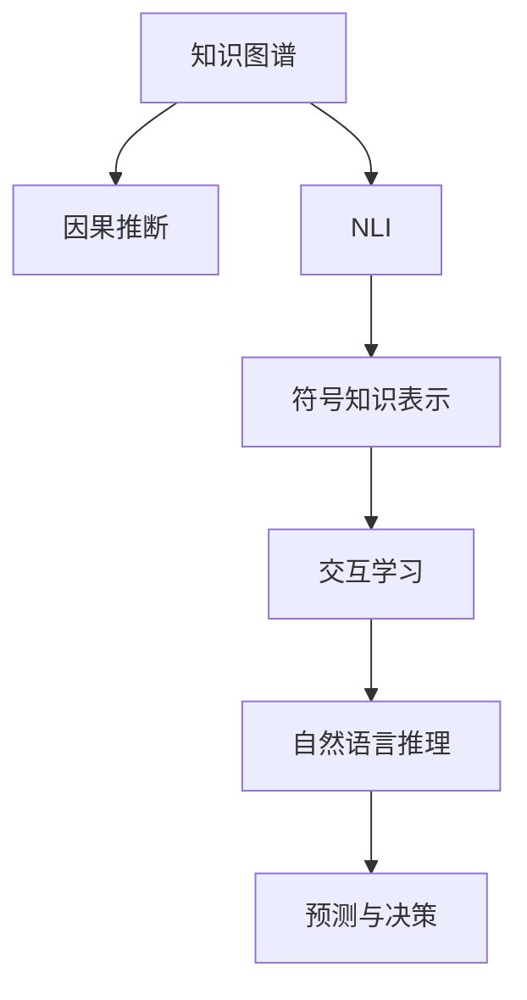

                 

# 人类的知识与智慧：在人工智能时代

## 1. 背景介绍

### 1.1 问题由来

人工智能（AI）技术的迅猛发展，特别是深度学习（Deep Learning）和神经网络（Neural Network）的崛起，为计算机系统带来了前所未有的学习和推理能力。这些技术不仅改变了科技领域，还在医疗、金融、教育等多个行业产生了深远影响。然而，我们必须认识到，机器虽然能够模仿人类的学习方式，但在理解和应用人类知识与智慧方面，仍然存在诸多限制。

### 1.2 问题核心关键点

人工智能的核心在于模拟和扩展人类的智能。尽管深度学习模型在图像识别、自然语言处理等领域取得了显著进步，但在理解和应用人类的知识与智慧方面，仍面临以下关键问题：

1. **知识获取与整合**：如何有效地从大规模无结构数据中提取和整合知识，特别是人类长期积累的专家知识、经验法则等？
2. **常识推理**：模型如何处理模糊和抽象的概念，例如因果关系、道德规范、社会常识等？
3. **知识表示**：如何设计出一种形式化且易于机器理解的表示法，来描述和应用人类的知识与智慧？
4. **持续学习**：如何在不断变化的数据分布和环境中，使机器能够持续学习新知识，并保持原有的知识能力？
5. **道德与伦理**：AI模型如何确保其决策过程符合人类的道德和伦理标准？

这些问题不仅影响着AI技术的未来发展方向，也关系到其在实际应用中的可行性和安全性。本文旨在深入探讨这些核心问题，并提出可能的解决方案。

## 2. 核心概念与联系

### 2.1 核心概念概述

为更好地理解人工智能如何理解和应用人类的知识与智慧，本节将介绍几个关键概念及其相互之间的联系：

- **知识图谱（Knowledge Graph）**：一种结构化表示知识的方式，由节点（实体）和边（关系）组成，用于描述实体间的语义关系。
- **因果推断（Causal Inference）**：研究如何从观测数据中推断因果关系的技术，是理解复杂世界的重要工具。
- **自然语言推理（Natural Language Inference, NLI）**：研究如何使计算机理解自然语言中的逻辑关系和推理过程。
- **符号知识表示（Symbolic Knowledge Representation）**：使用形式化符号（如逻辑、一阶谓词逻辑）来表示和推理知识，具有明确性和可解释性。
- **交互学习（Interactive Learning）**：通过人机交互过程，利用人类的反馈和指导，使机器更高效地学习。

这些概念共同构成了人工智能理解和应用人类知识与智慧的基础框架，通过深入学习这些知识，可以更好地设计和优化AI模型。

### 2.2 核心概念原理和架构的 Mermaid 流程图



这个流程图展示了核心概念之间的相互关系。知识图谱提供了结构化的知识表示，因果推断用于理解变量之间的因果关系，NLI和NLI用于处理语言的逻辑关系，符号知识表示提供了形式化的知识表示方法，交互学习则通过人机交互优化模型的学习过程，最终通过自然语言推理和预测决策实现对人类知识的理解和应用。

## 3. 核心算法原理 & 具体操作步骤

### 3.1 算法原理概述

人工智能理解和应用人类知识与智慧的核心算法包括知识图谱嵌入、因果推断模型、自然语言推理系统等。这些算法通过结构化的知识表示、因果关系推断和语言推理，使机器能够模拟和扩展人类的智能能力。

### 3.2 算法步骤详解

以知识图谱嵌入为例，具体步骤包括：

1. **数据采集与预处理**：从结构化或非结构化数据源中采集知识，并进行清洗和预处理。
2. **构建知识图谱**：使用规则或机器学习方法，构建实体间的关系图谱。
3. **知识图谱嵌入**：通过神经网络模型（如TransE、KG2Vec等），将实体和关系映射到低维向量空间，保留知识结构。
4. **模型训练与优化**：通过训练损失函数，优化模型参数，提升知识图谱嵌入的质量。
5. **推理与应用**：使用嵌入后的知识图谱进行实体关系推理，应用于推荐系统、问答系统等场景。

### 3.3 算法优缺点

知识图谱嵌入算法具有以下优点：

- 结构化的知识表示，便于机器理解和处理。
- 能够捕捉实体间的关系，提高推理准确性。
- 在知识图谱上的推理速度快，效率高。

同时，这些算法也存在以下缺点：

- 构建知识图谱需要大量的人工干预，成本较高。
- 知识图谱嵌入的模型复杂度较高，训练难度较大。
- 对新兴领域和复杂关系的覆盖有限。

### 3.4 算法应用领域

知识图谱嵌入算法广泛应用于以下领域：

- **推荐系统**：通过嵌入用户和商品的知识图谱，提供个性化推荐。
- **问答系统**：利用嵌入后的知识图谱进行实体关系查询和推理，解答用户问题。
- **搜索引擎**：构建知识图谱索引，提升搜索准确性和相关性。
- **金融风险管理**：构建金融机构的交易、监管知识图谱，辅助风险评估。
- **医疗信息管理**：构建医学知识图谱，辅助疾病诊断和治疗方案选择。

## 4. 数学模型和公式 & 详细讲解 & 举例说明

### 4.1 数学模型构建

知识图谱嵌入的数学模型通常基于三元组 $(h, r, t)$，其中 $h$ 和 $t$ 为实体，$r$ 为实体间的关系。目标是将这些三元组映射到一个低维向量空间 $\mathbb{R}^d$，使得同类型实体的向量在空间中接近。

### 4.2 公式推导过程

知识图谱嵌入的典型模型如TransE，其目标函数为：

$$
\min_{\mathbf{e}_h, \mathbf{e}_r, \mathbf{e}_t} \sum_{(h, r, t) \in \mathcal{E}} \text{dist}(\mathbf{e}_h, \mathbf{e}_t - r \mathbf{e}_r)^2
$$

其中 $\mathcal{E}$ 为训练集中的所有三元组，$\text{dist}$ 为向量间的距离函数，如欧几里得距离。模型的参数为实体的嵌入向量 $\mathbf{e}_h, \mathbf{e}_r, \mathbf{e}_t$。

### 4.3 案例分析与讲解

以TransE模型为例，其核心思想是：将实体的嵌入向量视为点，关系嵌入向量视为向量，通过优化距离函数来最大化实体的关系表示。具体实现中，通过反向传播算法不断调整实体的嵌入向量，最小化训练损失。

## 5. 项目实践：代码实例和详细解释说明

### 5.1 开发环境搭建

本节以Python和PyTorch为例，介绍知识图谱嵌入模型的开发环境搭建。

1. 安装Anaconda：从官网下载并安装Anaconda，用于创建独立的Python环境。
2. 创建并激活虚拟环境：
```bash
conda create -n kg-env python=3.8 
conda activate kg-env
```
3. 安装PyTorch和其他必要库：
```bash
conda install pytorch torchvision torchaudio cudatoolkit=11.1 -c pytorch -c conda-forge
pip install numpy pandas scikit-learn tqdm jupyter notebook ipython
```

### 5.2 源代码详细实现

以下是使用PyTorch实现TransE模型的代码实现：

```python
import torch
import torch.nn as nn
from torch.autograd import Variable

class TransE(nn.Module):
    def __init__(self, entity_dim, relation_dim, batch_size=64):
        super(TransE, self).__init__()
        self.entity_dim = entity_dim
        self.relation_dim = relation_dim
        self.batch_size = batch_size
        
        self.entity_embeddings = nn.Embedding(num_entities, self.entity_dim)
        self.relation_embeddings = nn.Embedding(num_relations, self.relation_dim)
        
    def forward(self, h, r, t):
        e_h = self.entity_embeddings(h)
        e_r = self.relation_embeddings(r)
        e_t = self.entity_embeddings(t)
        return (e_h - e_t).norm(dim=1) - (e_r * e_t).sigmoid()
        
    def loss_function(self, output, y):
        return nn.L1Loss()(output, y)

# 假设训练集为 {'(h, r, t)'}，其中 h, r, t 为向量形式
# 训练数据为 [(h, r, t), (h, r, t), ...]
```

### 5.3 代码解读与分析

**TransE模型**：
- `__init__`方法：初始化嵌入层，定义模型参数。
- `forward`方法：前向传播计算模型输出，这里计算实体的距离和关系向量的点积。
- `loss_function`方法：定义损失函数，计算预测值与真实值之间的L1距离。

**训练流程**：
1. 定义模型和损失函数。
2. 准备训练数据，将实体向量作为输入，计算模型输出和真实值。
3. 使用优化器（如Adam）进行梯度下降优化。
4. 周期性在验证集上评估模型性能，记录损失和精度。
5. 重复上述过程直至满足预设的迭代轮数或验证集性能停止改进。

### 5.4 运行结果展示

训练完成后，可以使用模型对新的三元组进行推理，如：

```python
h = torch.tensor([1, 2, 3])
r = torch.tensor([4, 5])
t = torch.tensor([6, 7])

model = TransE(entity_dim=10, relation_dim=5)
optimizer = torch.optim.Adam(model.parameters(), lr=0.01)

for epoch in range(10):
    output = model(h, r, t)
    loss = model.loss_function(output, output)
    optimizer.zero_grad()
    loss.backward()
    optimizer.step()
    print("Epoch {}, Loss: {}".format(epoch+1, loss.item()))
```

以上代码展示了从训练到推理的全流程，通过训练，模型能够对新的三元组进行预测，计算实体之间的距离和关系概率，从而实现知识图谱推理。

## 6. 实际应用场景

### 6.1 智能推荐系统

知识图谱嵌入在智能推荐系统中发挥了重要作用。通过构建用户、商品和评价的知识图谱，推荐系统可以更准确地预测用户对商品的兴趣和偏好。

具体应用时，可以将用户与商品之间的评价作为三元组，训练知识图谱嵌入模型。模型通过推理用户和商品之间的关系，生成推荐结果。此外，利用因果推断模型，可以进一步理解用户行为背后的原因，提供更加个性化和精准的推荐。

### 6.2 智能问答系统

在智能问答系统中，知识图谱嵌入和自然语言推理（NLI）技术结合，使机器能够理解和回答复杂的自然语言问题。

例如，在医疗问答系统中，知识图谱包含了疾病、症状、治疗方法等信息。用户提出的问题通过自然语言处理（NLP）转化为结构化的查询，通过知识图谱嵌入模型进行推理，找到相关的实体和关系，最后使用NLI技术验证推理的逻辑性，确保输出的答案准确无误。

### 6.3 金融风险管理

在金融领域，知识图谱嵌入被用于构建交易和监管知识图谱，辅助风险评估和管理。

具体应用中，知识图谱包含了金融产品、市场数据、监管政策等实体和关系。模型通过推理交易和市场之间的关系，识别潜在的风险因素，提供风险预警和应对策略。同时，利用因果推断模型，可以分析不同因素对风险的影响程度，提供更全面的风险评估。

## 7. 工具和资源推荐

### 7.1 学习资源推荐

为了帮助开发者系统掌握知识图谱嵌入和因果推断的理论基础和实践技巧，这里推荐一些优质的学习资源：

1. 《知识图谱嵌入：理论、算法与应用》系列博文：由知识图谱领域专家撰写，深入浅出地介绍了知识图谱嵌入的基本原理、算法实现和应用场景。
2. CS223《统计学习》课程：斯坦福大学开设的经典课程，介绍了因果推断的基本概念和统计方法。
3. 《因果推断：从基础到应用》书籍：因果推断领域的权威著作，详细讲解了因果推断的基本原理和实用技术。
4. LvCS 2021会议论文：知识图谱嵌入的最新研究成果，涵盖多种模型和方法。
5. KDD 2021会议论文：因果推断在金融领域的应用，展示了在真实世界数据上的效果。

通过这些资源的学习实践，相信你一定能够快速掌握知识图谱嵌入和因果推断的技术要点，并用于解决实际的AI问题。

### 7.2 开发工具推荐

高效的开发离不开优秀的工具支持。以下是几款用于知识图谱嵌入和因果推断开发的常用工具：

1. PyTorch：基于Python的开源深度学习框架，灵活的计算图，适合快速迭代研究。
2. TensorFlow：由Google主导开发的开源深度学习框架，生产部署方便，适合大规模工程应用。
3. NetworkX：Python的图形库，用于构建和分析知识图谱。
4. PyGraphviz：Python的图形可视化库，用于绘制知识图谱的图形表示。
5. Apache OpenNMT：开源的神经机器翻译框架，内置了多种知识图谱嵌入模型。
6. Greta：因果推断框架，支持多种因果模型和算法。

合理利用这些工具，可以显著提升知识图谱嵌入和因果推断任务的开发效率，加快创新迭代的步伐。

### 7.3 相关论文推荐

知识图谱嵌入和因果推断技术的发展源于学界的持续研究。以下是几篇奠基性的相关论文，推荐阅读：

1. **知识图谱嵌入**：
   - Bordes et al., “Translating Embeddings for Knowledge Graphs”（T知识图谱嵌入）
   - Sun et al., “A Simple and Efficient Approach to Learning Knowledge Graph Embeddings”（KG2Vec）
   - Yang et al., “Neural Logic Machine for Knowledge Graph Completion”（Neural Logic Machine）

2. **因果推断**：
   - Pearl, “Causality: Models, Reasoning and Inference”（因果推断的入门书籍）
   - Rubin, “Causal Inference in Statistics: A Primer”（因果推断的统计方法）
   - Sontag et al., “The Geometry of Causal Inference”（因果推断的几何方法）

这些论文代表了两大技术的发展脉络。通过学习这些前沿成果，可以帮助研究者把握学科前进方向，激发更多的创新灵感。

## 8. 总结：未来发展趋势与挑战

### 8.1 总结

本文对知识图谱嵌入和因果推断等关键技术进行了全面系统的介绍。首先阐述了这些技术在理解和应用人类知识与智慧方面的重要性和挑战。其次，从原理到实践，详细讲解了知识图谱嵌入和因果推断的数学原理和关键步骤，给出了具体代码实现。同时，本文还广泛探讨了这些技术在智能推荐、智能问答、金融风险管理等领域的实际应用，展示了其在提升AI系统智能化和鲁棒性方面的巨大潜力。

通过本文的系统梳理，可以看到，知识图谱嵌入和因果推断技术正在成为人工智能理解人类知识与智慧的重要手段，极大地拓展了AI系统的应用边界，催生了更多的落地场景。受益于大数据、深度学习和人工智能的协同发展，这些技术必将在更广泛的领域中发挥关键作用，推动人工智能技术向更加智能化和普适化的方向发展。

### 8.2 未来发展趋势

展望未来，知识图谱嵌入和因果推断技术将呈现以下几个发展趋势：

1. **模型与算法创新**：知识图谱嵌入和因果推断算法将不断创新，出现更多高效、鲁棒的模型，解决现有技术中的局限性和问题。
2. **多模态融合**：未来的知识图谱和因果推断模型将融合多模态数据，处理更为复杂的数据分布和问题场景。
3. **可解释性与透明性**：随着技术的发展，知识图谱嵌入和因果推断模型将越来越注重可解释性和透明性，使决策过程更加透明和可信。
4. **自动化与智能化**：自动化构建知识图谱和因果推断模型将成为可能，进一步降低技术门槛，加速落地应用。
5. **跨领域应用**：知识图谱嵌入和因果推断技术将突破现有应用场景的限制，应用于更多领域，如医疗、交通、物流等。

这些趋势将使知识图谱嵌入和因果推断技术在理解和应用人类知识与智慧方面取得更大的突破，为构建更加智能、可靠、可解释的AI系统提供坚实基础。

### 8.3 面临的挑战

尽管知识图谱嵌入和因果推断技术已经取得了显著进展，但在实现更加智能化、普适化应用的过程中，仍面临诸多挑战：

1. **数据获取与处理**：构建高质量的知识图谱和因果模型需要大量结构化数据，数据获取和处理成本较高。
2. **复杂关系建模**：新兴领域和复杂关系的覆盖有限，现有的知识图谱嵌入和因果推断模型难以应对。
3. **模型可解释性**：模型输出的可解释性不足，难以满足实际应用中的需求。
4. **系统鲁棒性**：模型对噪声和异常数据的鲁棒性不足，容易受到环境变化的影响。
5. **技术壁垒**：知识图谱嵌入和因果推断技术的学习和应用门槛较高，需要深厚的数学和算法背景。

这些挑战需要我们持续努力，在数据、算法、应用等多个维度进行深入研究，方能推动知识图谱嵌入和因果推断技术向更加智能化、普适化的方向发展。

### 8.4 研究展望

面对知识图谱嵌入和因果推断技术所面临的挑战，未来的研究需要在以下几个方面寻求新的突破：

1. **自动化知识获取**：发展自动化的知识图谱构建方法，降低数据获取和处理的成本。
2. **复杂关系建模**：开发能够处理新兴领域和复杂关系的知识图谱嵌入和因果推断模型，提升模型覆盖度。
3. **多模态融合**：探索知识图谱嵌入和因果推断模型与其他AI技术的融合，如NLP、计算机视觉等。
4. **可解释性与透明性**：研究模型的可解释性技术和透明性方法，使模型决策过程更加透明和可信。
5. **系统鲁棒性**：改进模型的鲁棒性，使其能够处理更多噪声和异常数据。
6. **技术普及**：降低知识图谱嵌入和因果推断技术的入门门槛，推动技术在更多领域的应用。

这些研究方向的探索，必将引领知识图谱嵌入和因果推断技术迈向更高的台阶，为构建安全、可靠、可解释的智能系统铺平道路。面向未来，知识图谱嵌入和因果推断技术还需要与其他人工智能技术进行更深入的融合，共同推动自然语言理解和智能交互系统的进步。只有勇于创新、敢于突破，才能不断拓展知识图谱嵌入和因果推断技术的边界，让人工智能更好地造福人类社会。

## 9. 附录：常见问题与解答

**Q1：知识图谱嵌入和因果推断技术是否适用于所有领域？**

A: 知识图谱嵌入和因果推断技术在许多领域都具有广泛的应用前景。然而，不同领域的数据特性和问题结构不同，技术应用的具体方法和效果也有所差异。例如，在金融领域，需要构建更加细致和复杂的知识图谱和因果模型；在医疗领域，需要考虑数据隐私和伦理问题。因此，需要针对具体应用场景进行技术适配和优化。

**Q2：知识图谱嵌入和因果推断技术的核心区别是什么？**

A: 知识图谱嵌入和因果推断技术的核心区别在于其处理数据的方式和目标。知识图谱嵌入主要关注如何通过结构化数据表示知识，并通过嵌入向量捕捉实体之间的关系；因果推断则主要关注如何通过观测数据推断变量间的因果关系，理解复杂世界的因果机制。两者相辅相成，共同构建起人类知识与智慧的人工智能理解框架。

**Q3：知识图谱嵌入和因果推断技术的优势和局限性是什么？**

A: 知识图谱嵌入和因果推断技术的主要优势在于其形式化、可解释性和推理能力。通过结构化表示和逻辑推理，这些技术能够处理复杂的数据关系和因果机制。然而，其局限性在于数据获取和处理的成本较高，模型的复杂度较大，以及在大规模数据和复杂场景中的应用效果。

**Q4：如何提高知识图谱嵌入模型的可解释性？**

A: 提高知识图谱嵌入模型的可解释性，需要从模型设计和数据处理两个方面进行改进。一方面，可以使用符号知识表示方法，如一阶谓词逻辑，将实体关系表示为符号表达式，便于理解。另一方面，可以在模型训练过程中引入可解释性技术，如生成解释文本或可视化模型结构，使模型决策过程更加透明和可信。

**Q5：如何提升知识图谱嵌入和因果推断技术的自动化水平？**

A: 提升知识图谱嵌入和因果推断技术的自动化水平，需要发展自动化的知识图谱构建方法和因果模型学习算法。例如，利用自然语言处理技术自动提取实体和关系，使用强化学习算法自动化构建因果模型。同时，开发自动化评估和优化工具，辅助模型训练和调整，进一步提升技术的应用效果。

---

作者：禅与计算机程序设计艺术 / Zen and the Art of Computer Programming

