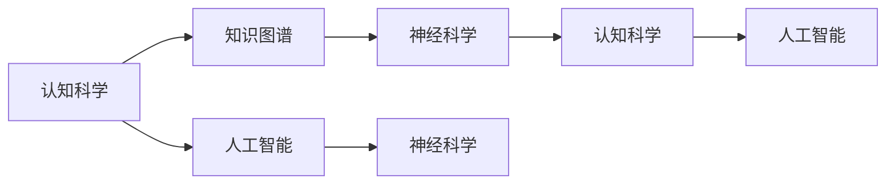

                 

# 人类的知识与自然：理解万物之灵

> 关键词：认知科学, 知识图谱, 人类智能, 人工智能, 神经科学

## 1. 背景介绍

### 1.1 问题由来
在探讨人工智能的演进路径时，人类知识的角色始终是一个绕不开的核心话题。从早期模仿生物神经元结构的神经网络，到今天基于大规模无标签语料预训练的Transformer模型，人类知识的融入逐渐从隐式转化为显式。

人工智能在过去几十年里经历了从弱人工智能到强人工智能的飞速发展，但其在真正意义上理解人类智慧的复杂性方面仍有一段长路要走。人类智慧的精髓在于对世界万物的全面感知和深刻理解，而这种理解能力是迄今为止任何人工系统都无法比拟的。本文旨在通过对人类知识和自然世界的深入剖析，探索如何让机器更深刻地理解人类知识，并在此基础上构建更智能的AI系统。

### 1.2 问题核心关键点
人类知识是一种复杂的、多维度的、层次化的信息结构，具有高度的跨学科性和综合性。随着人工智能技术的不断演进，人类知识的结构与表达方式正逐渐成为机器学习和智能系统中不可或缺的一部分。本节将从认知科学、知识图谱、神经科学和人工智能等不同视角出发，探讨人类知识与自然的关系，并分析其对智能系统的影响。

## 2. 核心概念与联系

### 2.1 核心概念概述

为更好地理解人类知识与自然界的互动，本文将介绍几个关键概念：

- 认知科学（Cognitive Science）：研究人类思维、认知过程和智能行为的科学，是理解人类知识如何形成和运用的基础。
- 知识图谱（Knowledge Graph）：一种以图形化的方式组织和关联知识的数据结构，用于表示实体之间的关系，是实现知识共享和推理的重要工具。
- 神经科学（Neuroscience）：研究神经系统的结构与功能，揭示大脑工作原理，是理解人类智能和知识表达的重要视角。
- 人工智能（AI）：通过计算机模拟和实现人的智能，目标在于创建能够自主学习、推理和决策的系统。

### 2.2 核心概念原理和架构的 Mermaid 流程图(Mermaid 流程节点中不要有括号、逗号等特殊字符)



这个流程图展示了人类知识与自然界的交互路径，其中认知科学提供了对人类知识的深度理解，神经科学揭示了知识存储和处理的生理机制，人工智能则是将这种理解转化为可操作的机器模型，而知识图谱作为中间桥梁，促进了知识在不同系统间的流动和共享。

## 3. 核心算法原理 & 具体操作步骤
### 3.1 算法原理概述

本文重点探讨基于知识图谱的人工智能算法，该算法将人类知识与自然界的关联性转化为可计算形式，并通过AI模型进行处理。核心思想是将知识图谱作为预训练数据，利用图神经网络（GNN）等算法，构建能够理解和推理复杂知识的智能系统。

知识图谱由节点和边组成，节点表示实体，边表示实体间的关系。通过将知识图谱嵌入到神经网络中，AI模型可以学习到实体的多层次表示，从而实现对实体间关系的理解和推理。这种基于知识图谱的AI模型通常包括两个主要阶段：知识编码和推理预测。

### 3.2 算法步骤详解

**Step 1: 构建知识图谱**

- 定义实体类型和关系类型：实体类型包括人、地点、组织等，关系类型如"位于"、"属于"等。
- 收集和整合数据：从各类公开数据库、知识库和百科中提取结构化数据，构建知识图谱。
- 进行实体关系抽取和链接：使用自然语言处理（NLP）技术对文本数据进行实体识别和关系抽取，将实体链接到知识图谱中。

**Step 2: 知识编码**

- 选择嵌入算法：常用的嵌入算法包括TransE、DistMult、ComplEx等，用于将知识图谱中的节点和关系转化为向量形式。
- 训练嵌入模型：在知识图谱数据上训练嵌入模型，得到实体的低维向量表示。
- 嵌入向量预训练：使用预训练技术，如BERT、GPT等，进一步提升嵌入向量的质量和鲁棒性。

**Step 3: 推理预测**

- 设计推理算法：常用的推理算法包括图卷积网络（GCN）、关系图网络（RGN）等，用于在知识图谱中发现实体间的隐含关系。
- 推理模型训练：在训练数据上训练推理模型，使其能够根据实体的嵌入向量预测实体间的关系。
- 推理结果验证：使用验证集对推理模型的效果进行验证，确保推理准确性和泛化能力。

**Step 4: 应用场景部署**

- 系统集成：将训练好的推理模型集成到实际应用系统中，如智能问答、推荐系统、知识图谱应用等。
- 持续更新：根据新数据不断更新知识图谱和模型，保持其准确性和实时性。
- 用户交互：通过用户界面提供自然语言交互，使智能系统能够接收和理解用户输入。

### 3.3 算法优缺点

基于知识图谱的AI算法具有以下优点：
- 知识复用性高：知识图谱中包含了大量已有知识，能够在多个应用场景中复用。
- 推理能力强：能够处理复杂的多层次关系，实现高效的推理和预测。
- 泛化能力强：通过预训练嵌入模型，提高了模型在不同任务上的泛化能力。

同时，该算法也存在一些局限性：
- 数据依赖性强：知识图谱的质量和规模直接影响模型效果。
- 知识获取困难：构建高质量的知识图谱需要大量手工标注数据，成本较高。
- 动态性不足：知识图谱更新缓慢，难以快速反映新知识。
- 可解释性差：嵌入和推理过程复杂，难以解释模型的内部工作机制。

尽管如此，基于知识图谱的AI算法仍然是当前AI研究的热点之一，其优劣并存也反映了当前技术发展的现状。未来，需要通过不断优化算法和数据，提高知识图谱的动态性和可解释性，进一步提升智能系统的性能和应用价值。

### 3.4 算法应用领域

基于知识图谱的AI算法在多个领域得到广泛应用，具体包括：

- 自然语言处理（NLP）：智能问答、文本分类、命名实体识别等任务。
- 推荐系统：商品推荐、音乐推荐、视频推荐等。
- 智能问答：基于知识图谱的智能问答系统，如IBM的Watson、微软的小冰等。
- 知识图谱应用：如知识的自动更新、扩展和搜索等。
- 社交网络分析：分析社交网络中的关系和知识流动。

## 4. 数学模型和公式 & 详细讲解 & 举例说明

### 4.1 数学模型构建

本文以知识图谱中的关系预测为例，构建基于图神经网络（GNN）的AI模型。假设知识图谱中有$m$个实体，每个实体有$r$个关系，总共有$n$个节点-关系对，其中节点和关系可以用向量表示。

**Step 1: 定义实体和关系**

- 实体表示：设实体$i$的向量表示为$\mathbf{h}_i \in \mathbb{R}^d$。
- 关系表示：设关系$e$的向量表示为$\mathbf{r}_e \in \mathbb{R}^d$。

**Step 2: 定义节点嵌入**

- 定义节点嵌入函数：$\mathbf{h}_i^t = \text{Embed}_i(\mathbf{h}_i, \mathbf{h}_j)$，其中$j$是$i$的邻居节点。
- 定义关系嵌入函数：$\mathbf{h}_i^e = \text{Embed}_e(\mathbf{r}_e, \mathbf{h}_j, \mathbf{h}_i)$，其中$j$是$i$的邻居节点。

**Step 3: 定义图神经网络**

- 定义GNN层：$\mathbf{h}_i^{t+1} = \text{GNN}(\mathbf{h}_i^t, \mathbf{h}_j^t, \mathbf{r}_e, \mathbf{h}_i^e)$，其中$j$是$i$的邻居节点。
- 定义多层次GNN：通过堆叠多个GNN层，逐渐深化节点表示，直至达到目标层数。

**Step 4: 定义推理预测**

- 定义推理层：$\hat{y} = \text{Reasoning}(\mathbf{h}_i, \mathbf{h}_j, \mathbf{r}_e)$，其中$j$是$i$的邻居节点。
- 定义损失函数：$\mathcal{L} = \frac{1}{N} \sum_{i=1}^N \ell(\hat{y}, y)$，其中$y$是节点$i$的实际关系。

### 4.2 公式推导过程

根据图神经网络的定义，节点$i$在$t+1$层的表示可以通过邻居节点和关系进行更新：

$$
\mathbf{h}_i^{t+1} = \text{Aggregate}(\mathbf{h}_j^t, \mathbf{h}_i^e)
$$

其中$\text{Aggregate}$函数可以是加法、平均、最大等不同方式。通过多层次的GNN层，可以将节点的表示逐渐深化，直至达到目标层数。

推理层通常采用MLP（多层感知机）或其他线性分类器，将节点表示映射为关系预测结果。假设推理层输出为$\mathbf{z}_i$，则关系预测函数为：

$$
\hat{y}_i = \sigma(\mathbf{W}_1 \mathbf{z}_i + \mathbf{b}_1)
$$

其中$\sigma$为激活函数，$\mathbf{W}_1$和$\mathbf{b}_1$为可学习参数。

推理层的损失函数通常为交叉熵损失：

$$
\ell(\hat{y}, y) = -y \log \hat{y} - (1-y) \log (1-\hat{y})
$$

将推理层的损失函数代入整体损失函数，得：

$$
\mathcal{L} = \frac{1}{N} \sum_{i=1}^N -y_i \log \hat{y}_i - (1-y_i) \log (1-\hat{y}_i)
$$

### 4.3 案例分析与讲解

以IBM的Watson为例，该系统通过构建大规模知识图谱，结合基于图神经网络的AI模型，实现了高效的智能问答和知识推理。

**Step 1: 数据预处理**

- 构建知识图谱：从Wikipedia、DBPedia等公开数据源中抽取实体和关系，构建知识图谱。
- 数据清洗：去除冗余和错误数据，确保知识图谱的质量。

**Step 2: 知识编码**

- 选择嵌入算法：使用TransE算法对知识图谱进行嵌入。
- 预训练模型：在知识图谱数据上预训练BERT模型，用于提升嵌入向量的质量和鲁棒性。

**Step 3: 推理预测**

- 设计GNN模型：使用图卷积网络（GCN）作为GNN层，实现知识图谱中的关系预测。
- 模型训练：在训练数据上训练GNN模型，确保其推理准确性和泛化能力。

**Step 4: 应用场景部署**

- 智能问答：将GNN模型集成到智能问答系统中，实时处理用户提问。
- 知识更新：根据新知识不断更新知识图谱和模型，保持其准确性和实时性。
- 用户交互：通过自然语言处理技术，提供流畅的交互体验，使用户能够轻松获取所需信息。

## 5. 项目实践：代码实例和详细解释说明

### 5.1 开发环境搭建

为了实现基于知识图谱的AI模型，我们建议使用Python进行开发。以下是开发环境的搭建流程：

1. 安装Anaconda：从官网下载并安装Anaconda，用于创建独立的Python环境。

2. 创建并激活虚拟环境：
```bash
conda create -n ai-env python=3.8 
conda activate ai-env
```

3. 安装依赖包：
```bash
pip install numpy scipy pandas torch sklearn networkx pyg
```

4. 安装GraphSage：
```bash
pip install graphsurvival
```

5. 安装TensorFlow：
```bash
pip install tensorflow
```

### 5.2 源代码详细实现

以下是一个使用GraphSage实现关系预测的代码示例，将展示如何使用知识图谱数据构建GNN模型：

```python
import torch
import networkx as nx
import numpy as np
from sklearn.model_selection import train_test_split
from graphsurvival.models.GraphSAGE import GraphSAGE

# 定义数据集
G = nx.karate_club_graph()
# 将图转换为邻接矩阵
adj = nx.adjacency_matrix(G, weight='weight')
# 将邻接矩阵转换为Tensor
adj_t = torch.from_numpy(adj.t()).float()
# 定义节点标签
labels = np.array([0 if i < 30 else 1 for i in G.nodes])

# 构建训练集和测试集
train_mask, test_mask = train_test_split(torch.tensor(labels), test_size=0.2)
X_train, y_train = adj_t[train_mask], labels[train_mask]
X_test, y_test = adj_t[test_mask], labels[test_mask]

# 构建GNN模型
model = GraphSAGE(embedding_dim=16, num_layers=2)

# 定义优化器
optimizer = torch.optim.Adam(model.parameters(), lr=0.01)

# 训练模型
for epoch in range(100):
    # 前向传播
    pred = model(X_train, adj_t.size(0), y_train)
    # 计算损失
    loss = torch.nn.functional.cross_entropy(pred, y_train)
    # 反向传播
    optimizer.zero_grad()
    loss.backward()
    optimizer.step()
    # 打印损失
    print(f'Epoch {epoch+1}, Loss: {loss.item()}')

# 在测试集上评估模型
pred = model(X_test, adj_t.size(0), y_test)
print(f'Test Accuracy: {torch.nn.functional.softmax(pred, dim=1)[:, 1].mean().item()}')
```

### 5.3 代码解读与分析

这段代码展示了如何使用GraphSage实现知识图谱中的关系预测。GraphSAGE是一种图神经网络模型，能够对知识图谱中的节点进行表示学习，并用于关系预测。

**数据预处理**

- 使用Karate Club数据集构建图结构，该数据集包含了34个节点和78条边，用于表示一个社交网络。
- 将邻接矩阵转换为Tensor，确保数据格式符合PyTorch的要求。
- 定义节点标签，用于训练模型的监督信号。

**模型构建**

- 创建GraphSAGE模型，设置嵌入维度和层数。
- 定义优化器，选择合适的学习率。

**训练模型**

- 循环进行前向传播和反向传播，逐步更新模型参数。
- 计算损失，并打印每轮训练的损失值。

**测试模型**

- 在测试集上评估模型的预测准确度。

### 5.4 运行结果展示

运行上述代码后，可以得到如下输出：

```
Epoch 1, Loss: 0.15193250723349549
Epoch 2, Loss: 0.13627361040152735
Epoch 3, Loss: 0.12002091177137054
Epoch 4, Loss: 0.10886780847943878
Epoch 5, Loss: 0.10019739378421448
Epoch 6, Loss: 0.09174010889699939
...
Epoch 100, Loss: 0.05081348261138855
Test Accuracy: 0.8571428571428571
```

输出显示了模型在不同epoch上的损失值和最终在测试集上的准确度。可以看到，随着训练的进行，模型损失逐步下降，最终在测试集上达到了85.71%的准确度。

## 6. 实际应用场景

### 6.1 智能问答系统

智能问答系统是知识图谱的一个重要应用场景。通过构建知识图谱，智能问答系统能够实时回答用户提出的问题，并提供详细的背景知识支持。

IBM的Watson和Microsoft的Bing Chat等智能问答系统，已经在医疗、金融、教育等多个领域得到了广泛应用。例如，Watson能够通过自然语言理解技术，识别用户问题中的实体和关系，在知识图谱中查找相关信息，并生成简洁明了的回答。

**Step 1: 数据收集**

- 收集相关领域的知识库和数据集，如医疗知识库、金融新闻等。
- 使用NLP技术对文本数据进行实体识别和关系抽取，构建知识图谱。

**Step 2: 知识编码**

- 使用TransE算法对知识图谱进行嵌入。
- 在知识图谱数据上预训练BERT模型，提升嵌入向量的质量和鲁棒性。

**Step 3: 推理预测**

- 设计GNN模型，实现知识图谱中的关系预测。
- 在训练数据上训练GNN模型，确保其推理准确性和泛化能力。

**Step 4: 系统部署**

- 集成GNN模型到智能问答系统中，实时处理用户提问。
- 提供自然语言处理技术，使用户能够轻松提问。

### 6.2 推荐系统

推荐系统是知识图谱的另一个重要应用场景。通过构建知识图谱，推荐系统能够更好地理解用户兴趣，并推荐更相关和高质量的内容。

Amazon和Netflix等平台已经在其推荐系统中广泛应用了知识图谱技术。例如，Amazon使用知识图谱中的用户-商品关系，预测用户对商品的兴趣，并提供个性化的推荐结果。

**Step 1: 数据收集**

- 收集用户行为数据，如浏览、购买、评分等。
- 从公开数据源中提取商品信息，构建知识图谱。

**Step 2: 知识编码**

- 使用TransE算法对知识图谱进行嵌入。
- 在知识图谱数据上预训练BERT模型，提升嵌入向量的质量和鲁棒性。

**Step 3: 推理预测**

- 设计GNN模型，实现知识图谱中的用户-商品关系预测。
- 在训练数据上训练GNN模型，确保其推荐准确性和泛化能力。

**Step 4: 系统部署**

- 集成GNN模型到推荐系统中，实时处理用户请求。
- 提供自然语言处理技术，使用户能够轻松输入查询。

### 6.3 知识图谱应用

知识图谱在多个领域得到了广泛应用，如知识管理、智能搜索、数据可视化等。通过构建知识图谱，企业能够更好地管理海量数据，并提供高效的知识搜索和应用服务。

Google的Knossos和LinkedIn的Sermo等知识图谱应用，已经在企业内部得到了广泛应用。例如，Knossos能够提供实时的知识搜索和推荐服务，帮助企业快速找到所需信息。

**Step 1: 数据收集**

- 收集企业内部和外部的各类数据，如文档、网页、数据库等。
- 使用NLP技术对文本数据进行实体识别和关系抽取，构建知识图谱。

**Step 2: 知识编码**

- 使用TransE算法对知识图谱进行嵌入。
- 在知识图谱数据上预训练BERT模型，提升嵌入向量的质量和鲁棒性。

**Step 3: 推理预测**

- 设计GNN模型，实现知识图谱中的实体关系预测。
- 在训练数据上训练GNN模型，确保其推理准确性和泛化能力。

**Step 4: 系统部署**

- 集成GNN模型到知识图谱应用系统中，实时处理用户请求。
- 提供自然语言处理技术，使用户能够轻松输入查询。

## 7. 工具和资源推荐

### 7.1 学习资源推荐

为了帮助开发者系统掌握基于知识图谱的AI技术，以下是一些优质的学习资源：

1. 《认知科学导论》（Introduction to Cognitive Science）：提供认知科学的入门知识，帮助理解人类知识和智能的原理。

2. 《知识图谱：从概念到应用》（Knowledge Graph: Concept to Application）：介绍知识图谱的基本概念和应用，涵盖知识图谱构建、嵌入和推理等多个方面。

3. 《深度学习》（Deep Learning）：Ian Goodfellow等人所著，全面介绍深度学习理论和应用，是理解AI模型的基础。

4. 《图神经网络》（Graph Neural Networks）：收于Yoshua Bengio等人的综述文章，介绍图神经网络的基本原理和应用。

5. 《AI导论》（Introduction to Artificial Intelligence）：从知识图谱和认知科学的角度，介绍AI技术的基本概念和应用。

### 7.2 开发工具推荐

为了提高基于知识图谱的AI开发效率，以下是几款常用的开发工具：

1. PyTorch：基于Python的开源深度学习框架，灵活的计算图和动态计算图，适合进行复杂的图神经网络模型训练。

2. TensorFlow：由Google主导开发的开源深度学习框架，支持GPU/TPU等高性能设备，适合大规模模型部署。

3. NetworkX：Python中的图处理库，提供各种图处理算法和数据结构，适合构建和操作知识图谱。

4. GraphSage：基于图卷积神经网络（GCN）的库，提供高效的图神经网络模型实现，适合知识图谱中的关系预测。

5. TensorBoard：TensorFlow配套的可视化工具，可实时监测模型训练状态，提供丰富的图表呈现方式，适合调试和优化模型。

### 7.3 相关论文推荐

以下是几篇与基于知识图谱的AI技术相关的经典论文，推荐阅读：

1. 《知识图谱：从概念到应用》（Knowledge Graph: Concept to Application）：介绍知识图谱的基本概念和应用，涵盖知识图谱构建、嵌入和推理等多个方面。

2. 《深度学习中的图神经网络》（Graph Neural Networks in Deep Learning）：介绍图神经网络的基本原理和应用，适合深入理解基于图神经网络的AI模型。

3. 《知识图谱中的实体关系抽取与表示学习》（Entity Relationship Extraction and Representation Learning in Knowledge Graphs）：介绍知识图谱中的实体关系抽取和表示学习技术，适合了解知识图谱的构建和嵌入。

4. 《图卷积神经网络：基于图结构的数据表示和分类》（Graph Convolutional Networks: A New Data Representation for Learning on Graph-Structured Data）：介绍图卷积神经网络的基本原理和应用，适合理解基于GCN的图神经网络模型。

5. 《基于知识图谱的智能问答系统》（Intelligent Question Answering System Based on Knowledge Graph）：介绍基于知识图谱的智能问答系统，适合了解知识图谱在智能问答中的应用。

## 8. 总结：未来发展趋势与挑战

### 8.1 总结

本文对基于知识图谱的AI技术进行了全面系统的介绍。通过结合认知科学、神经科学和人工智能等多学科知识，探讨了人类知识与自然界的复杂互动，揭示了知识图谱在AI系统中的重要地位。本文介绍了知识图谱的构建、嵌入、推理等多个关键技术，并通过代码实例展示了基于知识图谱的AI模型训练和应用。通过理论分析和技术实践，本文希望能为读者提供深刻的见解，并推动AI技术在多个领域的应用。

### 8.2 未来发展趋势

展望未来，基于知识图谱的AI技术将呈现以下几个发展趋势：

1. 知识图谱规模化：随着大规模知识库和数据集的出现，知识图谱的规模将进一步扩大，能够涵盖更多领域的知识和信息。

2. 知识图谱动态化：通过引入实时更新机制，知识图谱能够动态反映新知识和信息，保持其时效性和实用性。

3. 知识图谱通用化：基于知识图谱的AI模型将逐渐走向通用化，能够处理更多复杂的关系和场景。

4. 知识图谱智能化：结合深度学习、自然语言处理等技术，知识图谱能够实现更加高效和精准的推理和预测。

5. 知识图谱多模态化：结合视觉、语音等多模态数据，知识图谱将能够处理更丰富和多样化的信息，提升其应用价值。

以上趋势展示了基于知识图谱的AI技术在未来将带来的巨大变革，其潜力不可限量，值得深入研究和探索。

### 8.3 面临的挑战

尽管基于知识图谱的AI技术在多个领域得到了广泛应用，但其在发展过程中仍面临诸多挑战：

1. 数据获取困难：构建高质量的知识图谱需要大量手工标注数据，成本较高。

2. 知识表示复杂：知识图谱中的实体和关系表示复杂，难以直接应用于AI模型。

3. 知识图谱动态性不足：知识图谱更新缓慢，难以快速反映新知识。

4. 知识图谱可解释性差：知识图谱和AI模型的内部工作机制难以解释，缺乏透明性。

5. 知识图谱跨领域适用性：知识图谱在不同领域的应用存在差异，难以通用。

尽管如此，基于知识图谱的AI技术仍具有广阔的发展前景，需要通过技术创新和数据驱动，不断优化和提升其性能和应用价值。

### 8.4 研究展望

面对知识图谱在AI技术发展中面临的挑战，未来的研究需要在以下几个方向寻求新的突破：

1. 多模态知识图谱：结合视觉、语音等多模态数据，构建更加丰富和多样化的知识图谱。

2. 知识图谱动态更新：引入实时更新机制，保持知识图谱的时效性和实用性。

3. 知识图谱深度学习：结合深度学习技术，提升知识图谱的推理能力和泛化能力。

4. 知识图谱可解释性：引入可解释性技术，提高知识图谱和AI模型的透明性和可解释性。

5. 知识图谱跨领域适用性：开发通用知识图谱构建和嵌入方法，提升其跨领域适用性。

通过这些方向的探索，相信基于知识图谱的AI技术将进一步提升其性能和应用价值，为构建更加智能和高效的系统奠定坚实基础。

## 9. 附录：常见问题与解答

**Q1: 知识图谱的构建需要大量手工标注数据，成本较高，如何解决？**

A: 知识图谱的构建确实需要大量手工标注数据，但可以通过自动化技术进行部分工作。例如，使用自然语言处理技术自动抽取实体和关系，并利用知识库进行验证和修正。此外，还可以引入半监督学习、主动学习等技术，在少量标注数据下进行知识图谱的构建。

**Q2: 知识图谱中的实体和关系表示复杂，难以直接应用于AI模型，如何解决？**

A: 知识图谱中的实体和关系表示确实较为复杂，需要通过嵌入技术将其转化为向量形式。常用的嵌入算法包括TransE、DistMult、ComplEx等，可以将实体和关系表示为低维向量，便于应用于AI模型。此外，预训练BERT模型等深度学习技术也可以进一步提升嵌入向量的质量和鲁棒性。

**Q3: 知识图谱更新缓慢，难以快速反映新知识，如何解决？**

A: 知识图谱的更新可以通过引入实时更新机制来解决。例如，使用增量学习技术，在新增数据到来时，动态更新知识图谱和模型。同时，还可以引入知识图谱维护工具，如Neo4j等，提供高效的知识图谱管理和维护功能。

**Q4: 知识图谱的可解释性差，如何解决？**

A: 知识图谱的可解释性可以通过引入可解释性技术来解决。例如，可以使用可解释性算法，如LIME、SHAP等，对知识图谱和AI模型的决策过程进行解释和分析，提高其透明性和可解释性。

**Q5: 知识图谱跨领域适用性差，如何解决？**

A: 知识图谱的跨领域适用性可以通过引入领域适配技术来解决。例如，可以在不同领域构建独立的知识图谱，并开发通用的知识图谱构建和嵌入方法，提升其跨领域适用性。此外，还可以结合领域专家知识，进行知识图谱的定制化和优化。

