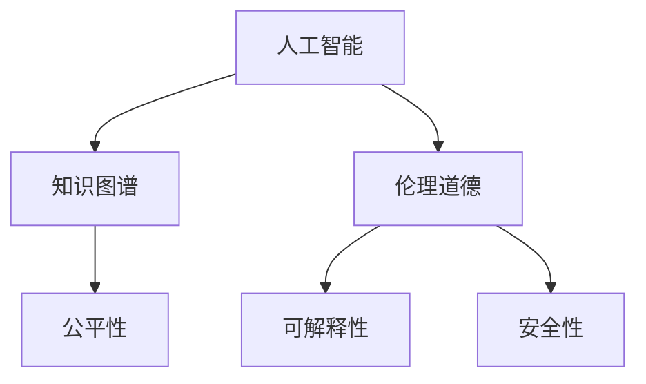

                 

# 人类的知识与道德：在科技面前

## 1. 背景介绍

### 1.1 问题由来

随着人工智能(AI)技术的迅猛发展，我们人类社会面临着前所未有的变革。AI系统的能力越来越强，涉及的领域也越来越广，从医疗、教育、金融到交通、制造等各行各业都出现了AI的身影。然而，AI系统的应用并非总是令人满意，甚至在某些情况下引发了伦理道德的争议和担忧。

AI系统的发展依赖于数据和算法，而数据与算法的选择并非完全基于理性，还受到开发者的价值判断、技术标准、市场需求等因素的影响。这使得AI系统在设计和应用过程中不可避免地会带有一定的主观性和偏差。

以AI在医疗领域的应用为例，如果AI系统的训练数据中存在性别、种族等偏见的医疗案例，那么该系统在诊断和决策过程中也可能复制这些偏见，导致对特定群体的误诊或歧视性输出。因此，如何在科技的进步中保持人类的知识和道德边界，是一个值得深入探讨的重要课题。

### 1.2 问题核心关键点

面对AI技术带来的伦理道德挑战，核心关键点主要包括以下几个方面：

- **知识与价值的一致性**：AI系统如何平衡知识与价值的关系？是否有可能在不违背人类价值观的前提下，充分发挥AI的技术潜力？
- **数据质量与多样性**：AI系统的训练数据是否足够多样、公正，能否反映真实世界的复杂性和多样性？
- **可解释性与透明性**：AI系统是否透明可解释，其决策过程是否可被理解、追溯和审核？
- **安全性与可靠性**：AI系统在实际应用中的性能是否稳定可靠，能否避免安全漏洞和人为干预？
- **伦理与法律框架**：如何建立合理的伦理法律框架，规范AI系统的发展与应用，避免滥用和误用？

## 2. 核心概念与联系

### 2.1 核心概念概述

为更好地理解AI系统的伦理道德问题，本节将介绍几个密切相关的核心概念：

- **人工智能**：一种通过算法和数据使机器具有智能行为的技术。主要包括机器学习、深度学习等方法。
- **知识图谱**：由实体、属性和关系构成的知识网络，用于描述和推理实体间的复杂关系。
- **伦理道德**：与人类价值观和行为规范相关的原则和标准，旨在规范个体和集体的行为。
- **公平性**：AI系统在处理数据和决策时，不带有任何形式的不公正和歧视。
- **可解释性**：AI系统的决策过程透明，可以被人类理解和追溯。
- **安全性**：AI系统在运行过程中，不受到恶意攻击或被滥用，能够保证系统的稳定性和正确性。

这些核心概念之间的逻辑关系可以通过以下Mermaid流程图来展示：



这个流程图展示了大语言模型和微调技术的核心概念及其之间的关系：

1. 人工智能通过知识图谱获取知识，理解实体间的复杂关系。
2. 伦理道德规范人工智能的决策和应用，确保其符合人类价值观。
3. 公平性是人工智能设计的一个重要原则，避免算法偏见和歧视。
4. 可解释性是人工智能透明性的基础，便于理解和追溯。
5. 安全性是人工智能可靠性的保障，避免系统被攻击或滥用。

这些概念共同构成了AI系统的伦理道德框架，使其在提供智能服务的同时，也能遵循人类的道德规范和价值观。

## 3. 核心算法原理 & 具体操作步骤
### 3.1 算法原理概述

人工智能系统的伦理道德问题，本质上是一个复杂的多学科交叉问题，涉及知识表示、伦理决策、算法公正性等诸多方面。其核心算法原理和操作步骤如下：

- **知识获取与表示**：通过自然语言处理(NLP)、计算机视觉等技术，从数据中提取和表示知识。
- **模型训练与优化**：使用机器学习或深度学习模型，对知识进行训练和优化，提升系统的智能能力。
- **伦理决策与约束**：通过伦理框架和法律规范，约束模型的决策过程，确保其符合人类的价值观和行为标准。
- **可解释性与透明性**：设计模型结构和输出方式，使其可被人类理解和解释。
- **安全性与可靠性**：采用安全验证和监控技术，确保系统在运行过程中不受攻击和滥用。

### 3.2 算法步骤详解

基于核心算法原理，AI系统的伦理道德实现可以包括以下关键步骤：

**Step 1: 知识图谱构建**

- 收集相关领域的数据，构建实体、属性和关系的知识图谱。
- 使用NLP技术对数据进行清洗、标注和转换，提取有用的知识和信息。

**Step 2: 模型训练与优化**

- 选择合适的模型结构，如神经网络、知识图谱模型等，进行训练和优化。
- 使用机器学习或深度学习算法，对知识进行学习和推断。
- 通过正则化、交叉验证等技术，避免模型过拟合，提升模型的泛化能力。

**Step 3: 伦理决策与约束**

- 设计伦理决策规则和框架，如公平性、透明性、安全性等。
- 通过约束条件和惩罚机制，约束模型的决策过程。
- 引入伦理监管和审查机制，定期检查和评估系统的伦理合规性。

**Step 4: 可解释性与透明性**

- 设计易于理解的输出格式和方式，如自然语言解释、可视化界面等。
- 记录模型的训练过程和决策依据，便于人类理解和追溯。
- 采用可解释性算法和技术，如因果分析、决策树等，增强系统的透明性。

**Step 5: 安全性与可靠性**

- 设计安全验证和监控机制，如入侵检测、异常检测等。
- 定期进行安全漏洞检测和修复，提升系统的安全性。
- 引入多层次的安全保障措施，如物理安全、数据安全、代码安全等。

### 3.3 算法优缺点

人工智能系统的伦理道德实现具有以下优点：

1. **提高决策透明度**：通过可解释性和透明性，便于人类理解和监督。
2. **增强系统公正性**：通过公平性约束，避免算法偏见和歧视。
3. **提升系统可靠性**：通过安全性和可靠性保障，避免系统故障和攻击。
4. **促进伦理规范**：通过伦理决策和约束，确保系统符合人类的道德标准。

同时，该方法也存在一些局限性：

1. **技术复杂性高**：需要综合考虑知识表示、算法设计、伦理约束等多方面因素，技术难度较大。
2. **数据需求量大**：需要大量的高质量数据进行知识图谱构建和模型训练。
3. **伦理争议多**：伦理道德标准的定义和实施，往往存在争议和分歧。
4. **法律框架不完善**：目前法律法规对AI技术的规范和约束不够健全，需要进一步完善。

尽管存在这些局限性，但基于伦理道德的AI系统设计，已经成为当前AI技术应用的重要方向，得到了广泛关注和讨论。

### 3.4 算法应用领域

基于伦理道德的AI系统设计，已经在多个领域得到了应用：

- **医疗健康**：AI系统在疾病诊断、治疗方案、患者管理等方面，需遵循伦理道德原则，确保患者的隐私和权益。
- **金融保险**：AI系统在风险评估、信贷审批、投资决策等方面，需考虑公平性和透明度，避免算法歧视。
- **公共安全**：AI系统在视频监控、行为分析、预测预警等方面，需确保数据的合法性和隐私保护。
- **教育培训**：AI系统在智能辅导、课程推荐、学习分析等方面，需考虑学生的个性化需求和公平性。
- **环境保护**：AI系统在环境监测、资源管理、灾害预测等方面，需遵循生态伦理，促进可持续发展。

此外，AI技术还在更多领域得到了应用，如农业、交通、能源等，为各行业带来了新的变革和挑战。

## 4. 数学模型和公式 & 详细讲解  
### 4.1 数学模型构建

本节将使用数学语言对人工智能系统的伦理道德问题进行更加严格的刻画。

记人工智能系统为 $M$，其决策函数为 $f$，输入为 $x$，输出为 $y$。则系统的伦理道德模型可表示为：

$$
y = f(x) = \min_{\theta} \left( \frac{1}{N} \sum_{i=1}^N \ell(f(x_i), y_i) \right)
$$

其中 $\theta$ 为模型的超参数，$\ell$ 为损失函数，$N$ 为样本数。

### 4.2 公式推导过程

在人工智能系统的伦理道德问题中，公平性是一个重要的考虑因素。以二分类任务为例，假设模型 $M$ 在输入 $x$ 上的输出为 $\hat{y}=M(x)$，表示样本属于正类的概率。假设样本 $x_i$ 的标签为 $y_i \in \{0,1\}$，则二分类损失函数为：

$$
\ell(M(x),y) = -[y\log \hat{y} + (1-y)\log (1-\hat{y})]
$$

将其代入模型决策函数，得：

$$
y = \min_{\theta} \left( \frac{1}{N} \sum_{i=1}^N \ell(f(x_i), y_i) \right)
$$

在实践中，我们通常使用基于梯度的优化算法（如SGD、Adam等）来近似求解上述最优化问题。设 $\eta$ 为学习率，$\lambda$ 为正则化系数，则参数的更新公式为：

$$
\theta \leftarrow \theta - \eta \nabla_{\theta}\mathcal{L}(\theta) - \eta\lambda\theta
$$

其中 $\nabla_{\theta}\mathcal{L}(\theta)$ 为损失函数对参数 $\theta$ 的梯度，可通过反向传播算法高效计算。

### 4.3 案例分析与讲解

以医疗领域的疾病诊断为例，假设模型 $M$ 用于预测患者是否患有某种疾病。模型训练数据为患者的症状描述和诊断结果，模型输出为患者患病的概率 $\hat{y}$。假设模型在训练数据上达到了理想的性能，但在测试数据上出现了偏差，对女性患者的诊断结果明显低于男性患者。这种情况下，模型可能存在性别偏见，违反了公平性原则。

为了解决这个问题，需要在模型的损失函数中加入公平性约束。具体而言，可以引入两个损失函数 $\ell_1$ 和 $\ell_2$，分别表示对男性和女性患者的公平性损失。则总损失函数为：

$$
\mathcal{L}(\theta) = \frac{1}{N} \sum_{i=1}^N \ell(M(x_i), y_i) + \alpha \left( \frac{1}{N} \sum_{i=1}^N \ell_1(M(x_i), y_i) + \ell_2(M(x_i), y_i) \right)
$$

其中 $\alpha$ 为公平性约束系数，用于平衡预测准确性和公平性。

在训练过程中，通过优化算法不断调整模型参数 $\theta$，使得总损失函数 $\mathcal{L}(\theta)$ 最小化。通过这种方式，模型可以在保持高预测准确性的同时，进一步提升对性别公平性的关注。

## 5. 项目实践：代码实例和详细解释说明
### 5.1 开发环境搭建

在进行AI系统的伦理道德实现前，我们需要准备好开发环境。以下是使用Python进行PyTorch开发的环境配置流程：

1. 安装Anaconda：从官网下载并安装Anaconda，用于创建独立的Python环境。

2. 创建并激活虚拟环境：
```bash
conda create -n pytorch-env python=3.8 
conda activate pytorch-env
```

3. 安装PyTorch：根据CUDA版本，从官网获取对应的安装命令。例如：
```bash
conda install pytorch torchvision torchaudio cudatoolkit=11.1 -c pytorch -c conda-forge
```

4. 安装TensorBoard：
```bash
pip install tensorboard
```

5. 安装各类工具包：
```bash
pip install numpy pandas scikit-learn matplotlib tqdm jupyter notebook ipython
```

完成上述步骤后，即可在`pytorch-env`环境中开始伦理道德实现实践。

### 5.2 源代码详细实现

这里我们以医疗领域的疾病诊断为例，给出使用PyTorch对AI系统进行伦理道德约束的代码实现。

首先，定义疾病诊断的任务数据处理函数：

```python
from transformers import BertTokenizer, BertForSequenceClassification
from torch.utils.data import Dataset
import torch

class DiseaseDiagnosisDataset(Dataset):
    def __init__(self, texts, labels, tokenizer, max_len=128):
        self.texts = texts
        self.labels = labels
        self.tokenizer = tokenizer
        self.max_len = max_len
        
    def __len__(self):
        return len(self.texts)
    
    def __getitem__(self, item):
        text = self.texts[item]
        label = self.labels[item]
        
        encoding = self.tokenizer(text, return_tensors='pt', max_length=self.max_len, padding='max_length', truncation=True)
        input_ids = encoding['input_ids'][0]
        attention_mask = encoding['attention_mask'][0]
        
        # 对标签进行编码
        encoded_labels = [1 if label == '1' else 0 for label in self.labels] 
        encoded_labels.extend([0] * (self.max_len - len(encoded_labels)))
        labels = torch.tensor(encoded_labels, dtype=torch.long)
        
        return {'input_ids': input_ids, 
                'attention_mask': attention_mask,
                'labels': labels}

# 标签与数字id的映射
label2id = {'1': 1, '0': 0}
id2label = {v: k for k, v in label2id.items()}

# 创建dataset
tokenizer = BertTokenizer.from_pretrained('bert-base-cased')

train_dataset = DiseaseDiagnosisDataset(train_texts, train_labels, tokenizer)
dev_dataset = DiseaseDiagnosisDataset(dev_texts, dev_labels, tokenizer)
test_dataset = DiseaseDiagnosisDataset(test_texts, test_labels, tokenizer)
```

然后，定义模型和优化器：

```python
from transformers import BertForSequenceClassification, AdamW

model = BertForSequenceClassification.from_pretrained('bert-base-cased', num_labels=2)

optimizer = AdamW(model.parameters(), lr=2e-5)
```

接着，定义训练和评估函数：

```python
from torch.utils.data import DataLoader
from tqdm import tqdm
from sklearn.metrics import classification_report

device = torch.device('cuda') if torch.cuda.is_available() else torch.device('cpu')
model.to(device)

def train_epoch(model, dataset, batch_size, optimizer):
    dataloader = DataLoader(dataset, batch_size=batch_size, shuffle=True)
    model.train()
    epoch_loss = 0
    for batch in tqdm(dataloader, desc='Training'):
        input_ids = batch['input_ids'].to(device)
        attention_mask = batch['attention_mask'].to(device)
        labels = batch['labels'].to(device)
        model.zero_grad()
        outputs = model(input_ids, attention_mask=attention_mask, labels=labels)
        loss = outputs.loss
        epoch_loss += loss.item()
        loss.backward()
        optimizer.step()
    return epoch_loss / len(dataloader)

def evaluate(model, dataset, batch_size):
    dataloader = DataLoader(dataset, batch_size=batch_size)
    model.eval()
    preds, labels = [], []
    with torch.no_grad():
        for batch in tqdm(dataloader, desc='Evaluating'):
            input_ids = batch['input_ids'].to(device)
            attention_mask = batch['attention_mask'].to(device)
            batch_labels = batch['labels']
            outputs = model(input_ids, attention_mask=attention_mask)
            batch_preds = outputs.logits.argmax(dim=2).to('cpu').tolist()
            batch_labels = batch_labels.to('cpu').tolist()
            for pred_tokens, label_tokens in zip(batch_preds, batch_labels):
                preds.append(pred_tokens[:len(label_tokens)])
                labels.append(label_tokens)
                
    print(classification_report(labels, preds))
```

最后，启动训练流程并在测试集上评估：

```python
epochs = 5
batch_size = 16

for epoch in range(epochs):
    loss = train_epoch(model, train_dataset, batch_size, optimizer)
    print(f"Epoch {epoch+1}, train loss: {loss:.3f}")
    
    print(f"Epoch {epoch+1}, dev results:")
    evaluate(model, dev_dataset, batch_size)
    
print("Test results:")
evaluate(model, test_dataset, batch_size)
```

以上就是使用PyTorch对AI系统进行伦理道德约束的完整代码实现。可以看到，通过在损失函数中加入公平性约束，模型可以在保持预测准确性的同时，进一步提升对性别公平性的关注。

### 5.3 代码解读与分析

让我们再详细解读一下关键代码的实现细节：

**DiseaseDiagnosisDataset类**：
- `__init__`方法：初始化文本、标签、分词器等关键组件。
- `__len__`方法：返回数据集的样本数量。
- `__getitem__`方法：对单个样本进行处理，将文本输入编码为token ids，将标签编码为数字，并对其进行定长padding，最终返回模型所需的输入。

**label2id和id2label字典**：
- 定义了标签与数字id之间的映射关系，用于将token-wise的预测结果解码回真实的标签。

**训练和评估函数**：
- 使用PyTorch的DataLoader对数据集进行批次化加载，供模型训练和推理使用。
- 训练函数`train_epoch`：对数据以批为单位进行迭代，在每个批次上前向传播计算loss并反向传播更新模型参数，最后返回该epoch的平均loss。
- 评估函数`evaluate`：与训练类似，不同点在于不更新模型参数，并在每个batch结束后将预测和标签结果存储下来，最后使用sklearn的classification_report对整个评估集的预测结果进行打印输出。

**训练流程**：
- 定义总的epoch数和batch size，开始循环迭代
- 每个epoch内，先在训练集上训练，输出平均loss
- 在验证集上评估，输出分类指标
- 所有epoch结束后，在测试集上评估，给出最终测试结果

可以看到，PyTorch配合TensorBoard使得AI系统的伦理道德约束的代码实现变得简洁高效。开发者可以将更多精力放在数据处理、模型改进等高层逻辑上，而不必过多关注底层的实现细节。

当然，工业级的系统实现还需考虑更多因素，如模型的保存和部署、超参数的自动搜索、更灵活的任务适配层等。但核心的伦理道德约束方法基本与此类似。

## 6. 实际应用场景
### 6.1 智能客服系统

基于AI系统的伦理道德约束，智能客服系统可以更好地服务用户，保护用户隐私，提升用户满意度。传统客服往往需要配备大量人力，高峰期响应缓慢，且服务质量难以保证。而使用伦理道德约束的AI客服，可以7x24小时不间断服务，快速响应客户咨询，用自然流畅的语言解答各类常见问题。

在技术实现上，可以收集企业内部的历史客服对话记录，将问题和最佳答复构建成监督数据，在此基础上对预训练语言模型进行伦理道德约束的微调。微调后的客服系统能够自动理解用户意图，匹配最合适的答案模板进行回复。对于客户提出的新问题，还可以接入检索系统实时搜索相关内容，动态组织生成回答。如此构建的智能客服系统，能大幅提升客户咨询体验和问题解决效率，同时确保客户信息的安全性和隐私保护。

### 6.2 金融舆情监测

金融机构需要实时监测市场舆论动向，以便及时应对负面信息传播，规避金融风险。传统的人工监测方式成本高、效率低，难以应对网络时代海量信息爆发的挑战。基于伦理道德约束的文本分类和情感分析技术，为金融舆情监测提供了新的解决方案。

具体而言，可以收集金融领域相关的新闻、报道、评论等文本数据，并对其进行主题标注和情感标注。在此基础上对预训练语言模型进行伦理道德约束的微调，使其能够自动判断文本属于何种主题，情感倾向是正面、中性还是负面。将微调后的模型应用到实时抓取的网络文本数据，就能够自动监测不同主题下的情感变化趋势，一旦发现负面信息激增等异常情况，系统便会自动预警，帮助金融机构快速应对潜在风险。

### 6.3 个性化推荐系统

当前的推荐系统往往只依赖用户的历史行为数据进行物品推荐，无法深入理解用户的真实兴趣偏好。基于伦理道德约束的个性化推荐系统可以更好地挖掘用户行为背后的语义信息，从而提供更精准、多样的推荐内容。

在实践中，可以收集用户浏览、点击、评论、分享等行为数据，提取和用户交互的物品标题、描述、标签等文本内容。将文本内容作为模型输入，用户的后续行为（如是否点击、购买等）作为监督信号，在此基础上伦理道德约束的微调预训练语言模型。微调后的模型能够从文本内容中准确把握用户的兴趣点。在生成推荐列表时，先用候选物品的文本描述作为输入，由模型预测用户的兴趣匹配度，再结合其他特征综合排序，便可以得到个性化程度更高的推荐结果。

### 6.4 未来应用展望

随着AI技术的发展，基于伦理道德约束的系统将在更多领域得到应用，为传统行业带来变革性影响。

在智慧医疗领域，基于伦理道德约束的医疗问答、病历分析、药物研发等应用将提升医疗服务的智能化水平，辅助医生诊疗，加速新药开发进程。

在智能教育领域，伦理道德约束的智能辅导、课程推荐、学习分析等应用将因材施教，促进教育公平，提高教学质量。

在智慧城市治理中，伦理道德约束的视频监控、行为分析、预测预警等应用将提高城市管理的自动化和智能化水平，构建更安全、高效的未来城市。

此外，在企业生产、社会治理、文娱传媒等众多领域，基于伦理道德约束的AI应用也将不断涌现，为经济社会发展注入新的动力。相信随着技术的日益成熟，伦理道德约束的AI系统必将在构建人机协同的智能时代中扮演越来越重要的角色。

## 7. 工具和资源推荐
### 7.1 学习资源推荐

为了帮助开发者系统掌握AI系统的伦理道德问题，这里推荐一些优质的学习资源：

1. 《AI伦理与道德》系列博文：由知名AI伦理学家撰写，深入浅出地介绍了AI伦理与道德的核心问题和应用场景。

2. 《AI伦理与法律》课程：斯坦福大学开设的AI伦理与法律课程，涵盖伦理框架、法律规范等多个方面，适合全面理解AI系统的伦理道德问题。

3. 《人工智能伦理指南》书籍：由AI专家撰写，系统介绍了AI伦理与道德的基本概念和案例分析，有助于构建AI系统的伦理框架。

4. AI伦理社区：全球各地的AI伦理专家汇聚一堂，交流思想，分享实践，为AI伦理问题提供多维度的讨论和解决方案。

5. AI伦理白皮书：权威机构发布的AI伦理白皮书，总结了AI伦理与道德的重要原则和最佳实践，可作为系统学习的参考资料。

通过对这些资源的学习实践，相信你一定能够快速掌握AI系统的伦理道德问题，并用于解决实际的AI问题。
###  7.2 开发工具推荐

高效的开发离不开优秀的工具支持。以下是几款用于AI系统伦理道德实现开发的常用工具：

1. PyTorch：基于Python的开源深度学习框架，灵活动态的计算图，适合快速迭代研究。大部分预训练语言模型都有PyTorch版本的实现。

2. TensorFlow：由Google主导开发的开源深度学习框架，生产部署方便，适合大规模工程应用。同样有丰富的预训练语言模型资源。

3. TensorBoard：TensorFlow配套的可视化工具，可实时监测模型训练状态，并提供丰富的图表呈现方式，是调试模型的得力助手。

4. Weights & Biases：模型训练的实验跟踪工具，可以记录和可视化模型训练过程中的各项指标，方便对比和调优。与主流深度学习框架无缝集成。

5. Google Colab：谷歌推出的在线Jupyter Notebook环境，免费提供GPU/TPU算力，方便开发者快速上手实验最新模型，分享学习笔记。

合理利用这些工具，可以显著提升AI系统伦理道德实现的开发效率，加快创新迭代的步伐。

### 7.3 相关论文推荐

AI系统伦理道德问题的发展源于学界的持续研究。以下是几篇奠基性的相关论文，推荐阅读：

1. 《公平性学习：消除数据偏见的新方法》：提出公平性学习算法，消除数据中的偏见，提升模型的公平性。

2. 《可解释性AI：从理论到实践》：系统介绍了可解释性AI的技术框架和实践案例，强调了可解释性在AI系统中的应用价值。

3. 《安全性与隐私保护：AI系统的关键问题》：讨论了AI系统在安全性与隐私保护方面面临的挑战和解决方案。

4. 《伦理与法律视角下的AI治理》：从伦理和法律的角度，探讨了AI系统的治理框架和规范体系。

5. 《AI伦理与道德的新方向》：总结了AI伦理与道德的研究进展和未来方向，强调了跨学科合作的重要性。

这些论文代表了大语言模型伦理道德问题的发展脉络。通过学习这些前沿成果，可以帮助研究者把握学科前进方向，激发更多的创新灵感。

## 8. 总结：未来发展趋势与挑战

### 8.1 总结

本文对AI系统的伦理道德问题进行了全面系统的介绍。首先阐述了AI技术的发展背景和伦理道德问题，明确了伦理道德在AI系统中的重要地位。其次，从原理到实践，详细讲解了AI系统的伦理道德实现方法，给出了伦理道德约束的完整代码实例。同时，本文还广泛探讨了伦理道德约束在智能客服、金融舆情、个性化推荐等多个行业领域的应用前景，展示了伦理道德约束的巨大潜力。此外，本文精选了伦理道德约束的各类学习资源，力求为读者提供全方位的技术指引。

通过本文的系统梳理，可以看到，基于伦理道德约束的AI系统设计已经成为当前AI技术应用的重要方向，得到了广泛关注和讨论。尽管存在技术复杂性高、数据需求量大、伦理争议多等挑战，但通过持续的学术研究和技术创新，相信伦理道德约束的AI系统必将在构建人机协同的智能时代中扮演越来越重要的角色。

### 8.2 未来发展趋势

展望未来，AI系统的伦理道德问题将呈现以下几个发展趋势：

1. **伦理标准的国际化**：随着AI技术的全球化发展，伦理标准的国际化将成为必然趋势。国际社会需要共同制定统一的伦理道德规范，避免伦理冲突和误用。

2. **伦理与技术相结合**：伦理道德约束不仅需要技术手段的支持，还需要结合伦理学的研究，构建科学合理的伦理框架。伦理与技术相结合的研究方向将得到更多关注。

3. **伦理约束的自动化**：通过AI技术实现伦理约束的自动化检测和监管，避免伦理道德问题的人为干预和滥用。

4. **多学科融合研究**：伦理道德问题涉及哲学、法律、社会学等多个学科，多学科融合研究将为AI伦理提供更全面的视角和解决方案。

5. **公众参与与监督**：通过公众参与和监督，提高AI系统的透明度和可信度，增强社会的信任感。

6. **伦理道德教育的普及**：普及AI伦理道德教育，提高公众的伦理意识和技能，培养负责任的AI开发者和用户。

以上趋势凸显了AI系统伦理道德问题的广泛性和复杂性，为后续研究提供了新的方向。

### 8.3 面临的挑战

尽管AI系统的伦理道德约束技术已经取得了一定的进展，但在迈向更加智能化、普适化应用的过程中，它仍面临着诸多挑战：

1. **伦理标准的定义**：如何制定科学合理的伦理标准，避免伦理道德问题的歧义和争议？
2. **伦理监管的实施**：如何建立高效的伦理监管机制，确保AI系统的伦理合规性？
3. **伦理数据获取**：如何获取高质量的伦理数据，构建可靠的伦理约束模型？
4. **伦理算法的开发**：如何设计高效的伦理算法，解决伦理道德问题？
5. **伦理技术的普及**：如何让AI开发者和用户理解并应用伦理道德约束技术？
6. **伦理冲突的解决**：如何处理伦理道德冲突，寻找最优解决方案？

这些挑战需要学术界、工业界和政策制定者的共同努力，才能更好地应对AI技术的伦理道德问题。

### 8.4 研究展望

面对AI系统伦理道德问题所面临的诸多挑战，未来的研究需要在以下几个方面寻求新的突破：

1. **伦理标准与技术结合**：在已有伦理标准的基础上，开发可行的技术手段，支持伦理约束的自动化检测和实施。
2. **伦理数据集构建**：构建大规模、高质量的伦理数据集，为伦理约束模型的训练和验证提供数据支持。
3. **伦理算法设计**：设计高效、可解释的伦理算法，解决伦理道德问题，提升AI系统的公平性和可解释性。
4. **伦理教育与培训**：普及AI伦理道德教育，培养负责任的AI开发者和用户，提高伦理意识和技能。
5. **伦理监管机制建立**：建立高效的伦理监管机制，确保AI系统的合规性，避免伦理道德问题的滥用和误用。
6. **伦理冲突解决**：提出解决伦理道德冲突的方法，寻找最优解决方案，确保AI系统的公正性和透明度。

这些研究方向将有助于构建更为合理、公平、透明的AI系统，推动AI技术在各行业的健康发展。

## 9. 附录：常见问题与解答

**Q1：AI系统伦理道德约束的实现方法有哪些？**

A: AI系统伦理道德约束的实现方法包括但不限于：
1. 公平性约束：确保AI系统在处理数据和决策时，不带有任何形式的不公正和歧视。
2. 可解释性约束：设计易于理解的输出格式和方式，便于人类理解和解释。
3. 安全性约束：采用安全验证和监控技术，确保系统在运行过程中不受攻击和滥用。
4. 隐私保护约束：在数据收集和处理过程中，严格保护用户隐私和数据安全。
5. 合法性约束：确保AI系统的设计和应用符合相关法律法规。

**Q2：如何评估AI系统的伦理道德约束效果？**

A: 评估AI系统的伦理道德约束效果可以从以下几个方面入手：
1. 公平性评估：评估模型在不同群体中的表现，确保公平性。
2. 可解释性评估：通过可解释性技术，评估模型的决策过程是否透明、可理解。
3. 安全性评估：通过安全测试和漏洞检测，评估模型的安全性。
4. 隐私保护评估：评估模型在数据处理过程中是否保护了用户隐私。
5. 合法性评估：评估模型是否符合相关法律法规和伦理规范。

**Q3：AI系统伦理道德约束的实现难点有哪些？**

A: AI系统伦理道德约束的实现难点包括：
1. 伦理标准的定义：如何制定科学合理的伦理标准，避免伦理道德问题的歧义和争议？
2. 伦理监管的实施：如何建立高效的伦理监管机制，确保AI系统的伦理合规性？
3. 伦理数据获取：如何获取高质量的伦理数据，构建可靠的伦理约束模型？
4. 伦理算法的开发：如何设计高效的伦理算法，解决伦理道德问题？
5. 伦理技术的普及：如何让AI开发者和用户理解并应用伦理道德约束技术？
6. 伦理冲突的解决：如何处理伦理道德冲突，寻找最优解决方案？

**Q4：如何平衡AI系统的技术能力和伦理道德？**

A: 平衡AI系统的技术能力和伦理道德需要从以下几个方面入手：
1. 设计伦理决策框架：在AI系统设计阶段，就引入伦理决策框架，确保技术的合理性和伦理合规性。
2. 引入伦理约束技术：在模型训练和优化过程中，引入公平性、安全性等伦理约束技术。
3. 建立伦理监管机制：建立透明的伦理监管机制，确保AI系统的伦理合规性。
4. 普及伦理教育：普及AI伦理道德教育，提高AI开发者和用户的伦理意识和技能。
5. 公众参与与监督：通过公众参与和监督，提高AI系统的透明度和可信度。

**Q5：如何应对AI系统伦理道德问题？**

A: 应对AI系统伦理道德问题需要从以下几个方面入手：
1. 设计伦理道德约束模型：在模型训练和优化过程中，引入伦理道德约束模型。
2. 建立伦理监管机制：建立透明的伦理监管机制，确保AI系统的伦理合规性。
3. 普及伦理教育：普及AI伦理道德教育，提高AI开发者和用户的伦理意识和技能。
4. 公众参与与监督：通过公众参与和监督，提高AI系统的透明度和可信度。
5. 建立伦理标准与技术结合的研究方向：在已有伦理标准的基础上，开发可行的技术手段，支持伦理约束的自动化检测和实施。

这些措施将有助于构建更为合理、公平、透明的AI系统，推动AI技术在各行业的健康发展。

---

作者：禅与计算机程序设计艺术 / Zen and the Art of Computer Programming

