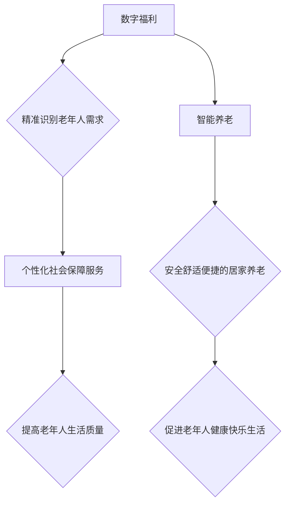

                 

## 未来的社会保障：2050年的数字福利与智能养老

> 关键词：数字福利、智能养老、人工智能、区块链、大数据、云计算、社会保障、未来趋势

## 1. 背景介绍

随着全球人口老龄化进程的加速，社会保障体系面临着前所未有的挑战。传统的社会保障模式难以适应不断变化的社会需求，亟需探索新的解决方案。数字技术的发展为构建更加高效、公平、可持续的社会保障体系提供了新的机遇。

未来社会保障体系将更加注重个性化、智能化和数字化。数字福利将成为主流，通过大数据、人工智能等技术，为老年人提供更加精准、高效、便捷的社会保障服务。智能养老将成为趋势，利用人工智能、物联网等技术，为老年人提供更加安全、舒适、便捷的居家养老服务。

## 2. 核心概念与联系

### 2.1 数字福利

数字福利是指利用数字技术，将社会保障服务数字化、智能化、便捷化的全新模式。它通过大数据分析、人工智能算法等技术，精准识别老年人的需求，提供个性化的社会保障服务，例如：

* **精准补贴:** 根据老年人的实际情况，精准发放养老金、医疗补助等福利，避免资源浪费和漏保现象。
* **智能服务:** 利用人工智能聊天机器人、语音助手等技术，为老年人提供24小时在线咨询、生活服务等智能化服务。
* **远程医疗:** 通过远程医疗平台，为老年人提供远程诊断、远程问诊、远程治疗等医疗服务，解决医疗资源短缺问题。

### 2.2 智能养老

智能养老是指利用人工智能、物联网、云计算等技术，为老年人提供更加安全、舒适、便捷的居家养老服务。它包括以下几个方面：

* **智能家居:** 利用智能传感器、智能设备等技术，为老年人打造更加安全、舒适的居家环境，例如：远程控制家电、智能安防、跌倒报警等。
* **远程陪伴:** 利用视频通话、语音通话等技术，为老年人提供远程陪伴服务，缓解孤独感和心理压力。
* **健康监测:** 利用智能穿戴设备、智能医疗器械等技术，对老年人的健康状况进行实时监测，及时发现潜在的健康问题。

**核心概念与联系流程图:**



## 3. 核心算法原理 & 具体操作步骤

### 3.1 算法原理概述

数字福利和智能养老的核心算法原理主要包括：

* **机器学习:** 利用机器学习算法，对老年人的生活数据进行分析，预测他们的需求，提供个性化的服务。
* **自然语言处理:** 利用自然语言处理技术，让智能系统能够理解和响应老年人的语音和文字指令，提供更加人性化的服务。
* **计算机视觉:** 利用计算机视觉技术，识别老年人的情绪、行为等信息，提供更加精准的养老服务。

### 3.2 算法步骤详解

**以精准补贴为例，算法步骤如下:**

1. **数据收集:** 收集老年人的个人信息、收入情况、医疗状况、生活状况等数据。
2. **数据清洗:** 对收集到的数据进行清洗，去除无效数据和重复数据。
3. **特征提取:** 从数据中提取关键特征，例如年龄、健康状况、家庭结构等。
4. **模型训练:** 利用机器学习算法，对提取的特征进行训练，建立精准补贴模型。
5. **预测和评估:** 利用训练好的模型，预测老年人的补贴需求，并评估补贴方案的公平性和有效性。
6. **方案调整:** 根据评估结果，对补贴方案进行调整，优化补贴分配机制。

### 3.3 算法优缺点

**优点:**

* **精准性:** 通过数据分析，精准识别老年人的需求，避免资源浪费和漏保现象。
* **效率:** 自动化补贴分配流程，提高效率，降低成本。
* **公平性:** 基于数据分析，制定更加公平的补贴方案。

**缺点:**

* **数据隐私:** 数据收集和使用需要保障老年人的数据隐私安全。
* **算法偏见:** 机器学习算法可能存在偏见，导致补贴分配不公平。
* **技术门槛:** 需要具备一定的技术能力才能开发和维护精准补贴系统。

### 3.4 算法应用领域

精准补贴算法可以应用于以下领域:

* **养老金分配:** 根据老年人的实际情况，精准发放养老金。
* **医疗补助:** 根据老年人的医疗状况，精准发放医疗补助。
* **生活补贴:** 根据老年人的生活状况，精准发放生活补贴。

## 4. 数学模型和公式 & 详细讲解 & 举例说明

### 4.1 数学模型构建

精准补贴模型可以构建为一个线性回归模型，用于预测老年人的补贴需求。

**模型公式:**

$$
y = \beta_0 + \beta_1x_1 + \beta_2x_2 + ... + \beta_nx_n + \epsilon
$$

其中:

* $y$：预测的补贴需求
* $x_1, x_2, ..., x_n$：老年人的特征变量，例如年龄、健康状况、家庭结构等
* $\beta_0, \beta_1, \beta_2, ..., \beta_n$：模型参数
* $\epsilon$：随机误差项

### 4.2 公式推导过程

模型参数可以通过最小二乘法进行估计。最小二乘法旨在找到使得模型预测值与实际值之间误差平方和最小的参数值。

### 4.3 案例分析与讲解

假设我们想要预测老年人的医疗补助需求，特征变量包括年龄、健康状况、家庭收入等。通过收集大量老年人的数据，我们可以训练一个精准补贴模型。

例如，模型训练结果显示，年龄每增加1岁，医疗补助需求增加0.1元；健康状况评分每提高1分，医疗补助需求增加0.2元。

当我们遇到一个新的老年人，我们可以根据他的年龄、健康状况、家庭收入等特征，利用训练好的模型预测他的医疗补助需求。

## 5. 项目实践：代码实例和详细解释说明

### 5.1 开发环境搭建

* **操作系统:** Ubuntu 20.04 LTS
* **编程语言:** Python 3.8
* **机器学习库:** scikit-learn
* **数据处理库:** pandas
* **数据可视化库:** matplotlib

### 5.2 源代码详细实现

```python
import pandas as pd
from sklearn.linear_model import LinearRegression

# 加载数据
data = pd.read_csv('elderly_data.csv')

# 选择特征变量和目标变量
X = data[['age', 'health_score', 'family_income']]
y = data['medical_subsidy']

# 创建线性回归模型
model = LinearRegression()

# 训练模型
model.fit(X, y)

# 预测新的医疗补助需求
new_data = pd.DataFrame({'age': [65], 'health_score': [80], 'family_income': [30000]})
predicted_subsidy = model.predict(new_data)

# 打印预测结果
print(f'预测的医疗补助需求: {predicted_subsidy[0]:.2f}')
```

### 5.3 代码解读与分析

* **数据加载:** 使用pandas库加载老年人的数据。
* **特征选择:** 选择年龄、健康状况、家庭收入等特征变量，以及医疗补助需求作为目标变量。
* **模型创建:** 使用scikit-learn库创建线性回归模型。
* **模型训练:** 使用训练数据训练模型，学习特征变量与目标变量之间的关系。
* **模型预测:** 使用训练好的模型预测新的老年人的医疗补助需求。

### 5.4 运行结果展示

运行代码后，会输出预测的医疗补助需求值。

## 6. 实际应用场景

数字福利和智能养老已经开始在一些国家和地区得到应用。例如：

* **新加坡:** 推出“Silver Support”计划，利用大数据分析，精准发放养老金。
* **日本:** 推出“远程医疗”服务，为老年人提供远程诊断、远程问诊、远程治疗等医疗服务。
* **美国:** 推出“智能家居”产品，为老年人提供安全、舒适、便捷的居家养老服务。

### 6.4 未来应用展望

未来，数字福利和智能养老将更加广泛地应用于社会保障体系，为老年人提供更加个性化、智能化、便捷化的服务。

## 7. 工具和资源推荐

### 7.1 学习资源推荐

* **书籍:**
    * 《人工智能：一种现代方法》
    * 《机器学习实战》
    * 《深度学习》
* **在线课程:**
    * Coursera: 人工智能课程
    * edX: 机器学习课程
    * Udacity: 深度学习课程

### 7.2 开发工具推荐

* **Python:** 广泛应用于人工智能和数据科学领域。
* **scikit-learn:** Python机器学习库。
* **TensorFlow:** 深度学习框架。
* **PyTorch:** 深度学习框架。

### 7.3 相关论文推荐

* **AlphaGo论文:** DeepMind公司开发的AlphaGo人工智能程序战胜世界围棋冠军的论文。
* **BERT论文:** Google公司开发的BERT语言模型论文。
* **GPT-3论文:** OpenAI公司开发的GPT-3语言模型论文。

## 8. 总结：未来发展趋势与挑战

### 8.1 研究成果总结

数字福利和智能养老是未来社会保障体系的重要组成部分，利用数字技术，可以更加精准、高效、公平地为老年人提供社会保障服务。

### 8.2 未来发展趋势

* **更加个性化:** 基于大数据分析和人工智能算法，为老年人提供更加个性化的服务。
* **更加智能化:** 利用人工智能、物联网等技术，打造更加智能的养老服务体系。
* **更加便捷化:** 利用移动互联网、云计算等技术，为老年人提供更加便捷的养老服务。

### 8.3 面临的挑战

* **数据隐私:** 数据收集和使用需要保障老年人的数据隐私安全。
* **算法偏见:** 机器学习算法可能存在偏见，导致服务分配不公平。
* **技术门槛:** 需要具备一定的技术能力才能开发和维护数字福利和智能养老系统。

### 8.4 研究展望

未来，需要加强对数字福利和智能养老技术的研发，解决数据隐私、算法偏见等问题，推动数字福利和智能养老的普及应用，为老年人提供更加安全、舒适、便捷的养老生活。

## 9. 附录：常见问题与解答

**常见问题:**

* **数字福利和智能养老会取代传统的社会保障体系吗?**

**解答:** 数字福利和智能养老是补充和完善传统社会保障体系的重要手段，不会取代传统的社会保障体系。

* **数字福利和智能养老对老年人的生活有什么影响?**

**解答:** 数字福利和智能养老可以为老年人提供更加个性化、智能化、便捷化的社会保障服务，提高老年人的生活质量。

* **如何保障数字福利和智能养老的安全性?**

**解答:** 需要加强对数据隐私的保护，制定相应的法律法规，确保数字福利和智能养老的安全可靠。


作者：禅与计算机程序设计艺术 / Zen and the Art of Computer Programming 
<end_of_turn>

