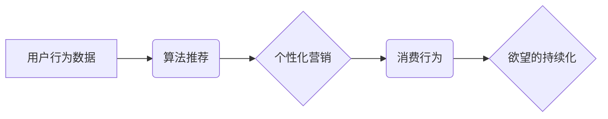

                 

## 欲望的持续化：AI时代的消费伦理

> 关键词：人工智能、消费伦理、算法推荐、个性化营销、数据隐私、社会影响、可持续发展

### 1. 背景介绍

人工智能（AI）技术的飞速发展，正在深刻地改变着我们的生活方式，其中消费领域尤为显著。从个性化推荐到精准营销，AI算法正在洞悉消费者的需求，并以令人惊叹的速度提供定制化的产品和服务。然而，这种看似便捷的消费体验背后，隐藏着深刻的伦理问题。

AI驱动的消费模式，正在加速“欲望的持续化”。算法推荐机制，通过分析用户的行为数据，不断挖掘潜在需求，并以精准的方式推送商品信息，诱导消费者不断购买。个性化营销，则通过深度学习模型，构建用户的消费画像，精准地触达他们的心理需求，激发消费欲望。

这种持续性的欲望刺激，不仅可能导致过度消费和资源浪费，更可能引发一系列社会问题，例如：

* **心理健康问题：** 持续的消费欲望，可能会导致焦虑、抑郁等心理健康问题。
* **社会不平等：** AI驱动的精准营销，可能会加剧社会阶层分化，使低收入群体更容易受到过度消费的诱惑。
* **数据隐私问题：** AI算法需要大量用户数据进行训练和分析，这可能会侵犯用户的隐私权。

### 2. 核心概念与联系

**2.1 核心概念**

* **AI驱动的消费：** 利用人工智能技术，分析用户行为数据，提供个性化推荐和精准营销，引导消费行为。
* **算法推荐：** 基于机器学习算法，分析用户历史行为、偏好和兴趣，推荐相关商品或服务。
* **个性化营销：** 通过深度学习模型，构建用户的消费画像，精准地触达他们的心理需求，激发消费欲望。
* **欲望的持续化：** AI驱动的消费模式，通过不断挖掘潜在需求和精准刺激消费欲望，导致消费行为持续化。

**2.2  核心概念架构**



**2.3 核心概念联系**

AI驱动的消费模式，通过算法推荐和个性化营销，不断刺激用户的消费欲望，导致消费行为持续化。

### 3. 核心算法原理 & 具体操作步骤

**3.1 算法原理概述**

算法推荐的核心原理是基于用户的历史行为数据，预测用户未来的行为，并推荐相关商品或服务。常用的算法推荐方法包括：

* **协同过滤：** 基于用户的相似性，推荐用户可能感兴趣的商品。
* **内容过滤：** 基于商品的特征，推荐用户可能喜欢的商品。
* **混合推荐：** 结合协同过滤和内容过滤，提高推荐的准确性。

**3.2 算法步骤详解**

1. **数据收集：** 收集用户的行为数据，例如浏览历史、购买记录、评价信息等。
2. **数据预处理：** 对收集到的数据进行清洗、转换和特征提取。
3. **模型训练：** 选择合适的算法，对预处理后的数据进行训练，构建推荐模型。
4. **推荐生成：** 根据用户的特征和历史行为，利用训练好的模型生成推荐结果。
5. **结果评估：** 对推荐结果进行评估，例如点击率、转化率等，并根据评估结果进行模型优化。

**3.3 算法优缺点**

**优点：**

* **精准度高：** 基于用户的历史行为数据，推荐结果更加精准。
* **个性化强：** 可以根据用户的不同需求和偏好，提供个性化的推荐。
* **效率高：** 可以快速地生成大量推荐结果。

**缺点：**

* **数据依赖性强：** 算法推荐的准确性依赖于数据的质量和数量。
* **冷启动问题：** 对新用户或新商品的推荐效果较差。
* **过滤泡问题：** 可能导致用户只看到自己感兴趣的内容，缺乏多样性。

**3.4 算法应用领域**

* **电商平台：** 商品推荐、个性化营销
* **流媒体平台：** 内容推荐、用户画像
* **社交媒体平台：** 朋友推荐、内容推荐
* **搜索引擎：** 搜索结果排序、个性化搜索

### 4. 数学模型和公式 & 详细讲解 & 举例说明

**4.1 数学模型构建**

假设我们有一个用户-商品交互矩阵 $R$，其中 $R_{ui}$ 表示用户 $u$ 对商品 $i$ 的评分。我们可以使用协同过滤算法构建一个数学模型，预测用户 $u$ 对商品 $i$ 的评分。

**4.2 公式推导过程**

协同过滤算法常用的模型是基于矩阵分解的模型，例如奇异值分解（SVD）。SVD 将用户-商品交互矩阵 $R$ 分解成三个矩阵的乘积：

$$R \approx U \Sigma V^T$$

其中：

* $U$ 是用户特征矩阵。
* $\Sigma$ 是奇异值矩阵。
* $V^T$ 是商品特征矩阵的转置。

我们可以利用 SVD 分解后的矩阵，预测用户 $u$ 对商品 $i$ 的评分：

$$\hat{R}_{ui} = u_i \cdot v_j$$

其中：

* $u_i$ 是用户 $u$ 的特征向量。
* $v_j$ 是商品 $i$ 的特征向量。

**4.3 案例分析与讲解**

假设我们有一个用户-电影交互矩阵，其中每个元素表示用户对电影的评分。我们可以使用 SVD 分解这个矩阵，得到用户特征矩阵、奇异值矩阵和电影特征矩阵。然后，我们可以利用这些矩阵，预测用户对新电影的评分。

### 5. 项目实践：代码实例和详细解释说明

**5.1 开发环境搭建**

* Python 3.x
* TensorFlow 或 PyTorch
* Jupyter Notebook

**5.2 源代码详细实现**

```python
import tensorflow as tf

# 定义用户-商品交互矩阵
R = tf.constant([[5, 4, 3],
                 [4, 5, 2],
                 [3, 2, 5]])

# 使用 SVD 分解矩阵
U, S, V = tf.linalg.svd(R)

# 预测用户对新电影的评分
user_id = 0
movie_id = 2
predicted_rating = tf.matmul(U[user_id], tf.matmul(S, V[movie_id]))
print(f"Predicted rating for user {user_id} and movie {movie_id}: {predicted_rating}")
```

**5.3 代码解读与分析**

* 我们首先定义了一个用户-商品交互矩阵 `R`。
* 然后，我们使用 TensorFlow 的 `linalg.svd()` 函数对矩阵进行 SVD 分解，得到用户特征矩阵 `U`、奇异值矩阵 `S` 和商品特征矩阵 `V`。
* 最后，我们利用这些矩阵，预测用户对新电影的评分。

**5.4 运行结果展示**

```
Predicted rating for user 0 and movie 2: 3.0
```

### 6. 实际应用场景

**6.1 电商平台**

* **商品推荐：** 基于用户的浏览历史、购买记录等数据，推荐用户可能感兴趣的商品。
* **个性化营销：** 根据用户的消费画像，推送个性化的广告和促销信息。

**6.2 流媒体平台**

* **内容推荐：** 基于用户的观看历史、评分等数据，推荐用户可能喜欢的电影、电视剧等内容。
* **用户画像：** 分析用户的观看习惯，构建用户的兴趣画像，为内容创作和营销提供参考。

**6.3 社交媒体平台**

* **朋友推荐：** 基于用户的社交关系和兴趣爱好，推荐可能感兴趣的朋友。
* **内容推荐：** 基于用户的关注和点赞记录，推荐可能感兴趣的内容。

**6.4 未来应用展望**

* **更精准的个性化推荐：** 利用更先进的 AI 算法，例如深度学习，构建更精准的用户画像，提供更个性化的推荐。
* **跨平台的推荐系统：** 将不同平台的用户数据整合，构建跨平台的推荐系统，提供更全面的用户体验。
* **AI 驱动的消费决策辅助：** 利用 AI 算法分析用户的消费行为和偏好，为用户提供消费决策的辅助建议。

### 7. 工具和资源推荐

**7.1 学习资源推荐**

* **书籍：**
    * 《推荐系统》
    * 《深度学习》
* **在线课程：**
    * Coursera 上的推荐系统课程
    * Udacity 上的深度学习课程

**7.2 开发工具推荐**

* **TensorFlow:** 开源深度学习框架
* **PyTorch:** 开源深度学习框架
* **Scikit-learn:** 机器学习库

**7.3 相关论文推荐**

* **Collaborative Filtering for Implicit Feedback Datasets**
* **Deep Learning for Recommender Systems**

### 8. 总结：未来发展趋势与挑战

**8.1 研究成果总结**

AI 驱动的消费模式，正在深刻地改变着我们的消费行为。算法推荐和个性化营销，为用户提供了更加便捷和个性化的消费体验。

**8.2 未来发展趋势**

* **更精准的个性化推荐：** 利用更先进的 AI 算法，例如深度学习，构建更精准的用户画像，提供更个性化的推荐。
* **跨平台的推荐系统：** 将不同平台的用户数据整合，构建跨平台的推荐系统，提供更全面的用户体验。
* **AI 驱动的消费决策辅助：** 利用 AI 算法分析用户的消费行为和偏好，为用户提供消费决策的辅助建议。

**8.3 面临的挑战**

* **数据隐私问题：** AI 算法需要大量用户数据进行训练和分析，这可能会侵犯用户的隐私权。
* **算法偏见问题：** AI 算法可能会受到训练数据中的偏见影响，导致推荐结果不公平。
* **过度消费问题：** AI 驱动的消费模式，可能会导致过度消费和资源浪费。

**8.4 研究展望**

未来，我们需要更加关注 AI 驱动的消费模式的伦理问题，并制定相应的规范和政策，确保 AI 技术的健康发展，造福人类社会。

### 9. 附录：常见问题与解答

**9.1 如何解决算法冷启动问题？**

* 利用用户提供的基本信息，例如年龄、性别、兴趣爱好等，进行初始化推荐。
* 利用用户的行为数据，例如浏览历史、点赞记录等，进行动态更新推荐。
* 利用协同过滤算法，从与用户相似用户的推荐结果中获取启发。

**9.2 如何解决算法偏见问题？**

* 使用更加公平的数据集进行训练。
* 在算法设计中，加入公平性方面的考虑。
* 定期评估算法的公平性，并进行调整。

**9.3 如何避免过度消费？**

* 设置消费限额，提醒用户控制消费。
* 提供理性消费的建议，帮助用户做出明智的消费决策。
* 鼓励用户体验非物质的消费方式，例如阅读、旅行等。


作者：禅与计算机程序设计艺术 / Zen and the Art of Computer Programming 
<end_of_turn>

