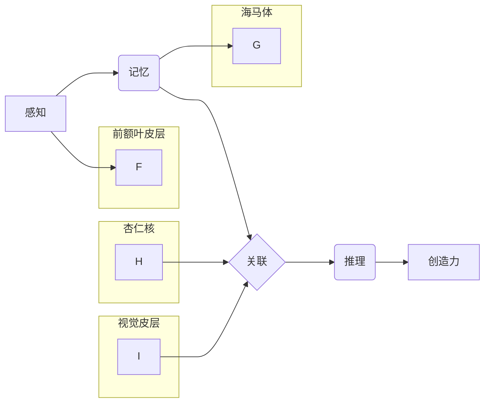

                 

## 理解洞察力的神经科学：揭开大脑奥秘

> 关键词：神经科学、洞察力、人工智能、认知模型、深度学习、脑机接口、神经网络、生物启发式

## 1. 背景介绍

洞察力，即从有限的信息中识别出隐藏的模式和关系，并从中得出新的见解的能力，一直是人类智慧的核心。它驱动着我们的创造力、创新能力和解决复杂问题的本领。然而，洞察力的本质如何形成？大脑是如何实现这一惊人的认知功能的？这些问题一直困扰着科学家们。

近年来，神经科学取得了长足的进步，我们对大脑的结构和功能有了更深入的了解。深度学习技术的兴起也为模拟和理解人类认知提供了新的工具。结合这两方面的研究成果，我们可以开始探索洞察力的神经科学基础，并将其应用于人工智能领域，推动人工智能的更智能化发展。

## 2. 核心概念与联系

洞察力是一个复杂的概念，涉及多个脑区和神经机制的协同作用。

**2.1 核心概念:**

* **感知:** 洞察力始于对信息的感知和收集。
* **记忆:** 丰富的知识储备和经验积累为洞察力提供基础。
* **关联:** 大脑能够将看似无关的信息进行关联，发现隐藏的联系。
* **推理:** 通过逻辑推理和推演，将发现的联系转化为新的见解。
* **创造力:** 洞察力最终体现在对新问题的独特解决和创新的能力上。

**2.2 神经机制:**

* **前额叶皮层:** 负责高级认知功能，如规划、决策和推理，在洞察力的形成中起着关键作用。
* **海马体:** 负责记忆和学习，为洞察力提供知识和经验基础。
* **杏仁核:** 负责情绪处理，情绪状态会影响洞察力的产生和表达。
* **视觉皮层:** 处理视觉信息，为洞察力提供感知基础。
* **多巴胺系统:** 参与奖励机制和学习过程，对洞察力的形成和强化有重要影响。

**2.3 架构图:**



## 3. 核心算法原理 & 具体操作步骤

### 3.1 算法原理概述

模拟洞察力的核心算法通常基于以下原理：

* **非线性映射:** 人类大脑的认知过程是高度非线性的，因此算法需要能够学习和处理复杂的非线性关系。
* **层次化结构:** 人类认知能力是分层组织的，算法也需要具有层次化的结构，以便模拟不同层次的认知功能。
* **反馈机制:** 人类学习和认知是一个不断反馈的过程，算法也需要引入反馈机制，以便不断调整和优化自己的认知模型。

### 3.2 算法步骤详解

1. **数据预处理:** 收集和预处理相关数据，例如文本、图像、音频等。
2. **特征提取:** 从数据中提取关键特征，例如词向量、图像特征、音频特征等。
3. **构建神经网络模型:** 根据算法原理，构建多层神经网络模型，例如卷积神经网络、循环神经网络等。
4. **训练模型:** 使用训练数据训练神经网络模型，学习数据中的模式和关系。
5. **测试模型:** 使用测试数据评估模型的性能，例如准确率、召回率等。
6. **优化模型:** 根据测试结果，调整模型参数和结构，提高模型性能。

### 3.3 算法优缺点

**优点:**

* 可以学习和处理复杂非线性关系。
* 具有层次化结构，可以模拟不同层次的认知功能。
* 可以引入反馈机制，不断优化认知模型。

**缺点:**

* 需要大量的训练数据。
* 训练过程耗时和计算资源消耗大。
* 模型解释性较差，难以理解模型的决策过程。

### 3.4 算法应用领域

* **自然语言处理:** 文本分类、情感分析、机器翻译等。
* **计算机视觉:** 图像识别、物体检测、场景理解等。
* **语音识别:** 语音转文本、语音助手等。
* **医疗诊断:** 病理图像分析、疾病预测等。

## 4. 数学模型和公式 & 详细讲解 & 举例说明

### 4.1 数学模型构建

洞察力的数学模型通常基于概率论和统计学，例如贝叶斯网络、隐马尔可夫模型等。这些模型可以用来表示知识、信念和推理过程。

**4.1.1 贝叶斯网络:**

贝叶斯网络是一种概率图模型，用于表示随机变量之间的依赖关系。每个节点代表一个随机变量，边表示变量之间的依赖关系。

**4.1.2 隐马尔可夫模型:**

隐马尔可夫模型是一种用于处理序列数据的概率模型，它假设每个状态只能由前一个状态决定，并且观察值只依赖于当前状态。

### 4.2 公式推导过程

**4.2.1 贝叶斯定理:**

$$P(A|B) = \frac{P(B|A)P(A)}{P(B)}$$

其中：

* $P(A|B)$ 是在已知事件 B 发生的情况下，事件 A 发生的概率。
* $P(B|A)$ 是在已知事件 A 发生的情况下，事件 B 发生的概率。
* $P(A)$ 是事件 A 发生的概率。
* $P(B)$ 是事件 B 发生的概率。

**4.2.2 隐马尔可夫模型的概率计算公式:**

$$P(O|λ) = \sum_{Q} P(O|Q,λ)P(Q|λ)$$

其中：

* $P(O|λ)$ 是观测序列 O 在模型 λ 下出现的概率。
* $P(O|Q,λ)$ 是在状态序列 Q 下观测序列 O 出现的概率。
* $P(Q|λ)$ 是状态序列 Q 在模型 λ 下出现的概率。

### 4.3 案例分析与讲解

**4.3.1 贝叶斯网络案例:**

假设我们有一个贝叶斯网络，用于表示疾病诊断。网络中包含以下节点：

* 症状 (S)
* 病因 (C)
* 诊断 (D)

我们可以使用贝叶斯定理来计算，在出现特定症状的情况下，患有特定病因的概率。

**4.3.2 隐马尔可夫模型案例:**

假设我们有一个隐马尔可夫模型，用于识别语音序列。模型中包含以下状态：

* 说话状态
* 沉默状态

我们可以使用隐马尔可夫模型的概率计算公式来计算，给定语音序列，最可能的说话状态序列。

## 5. 项目实践：代码实例和详细解释说明

### 5.1 开发环境搭建

* Python 3.x
* TensorFlow 或 PyTorch 深度学习框架
* Jupyter Notebook 或 VS Code 开发环境

### 5.2 源代码详细实现

```python
# 使用 TensorFlow 构建一个简单的洞察力模型

import tensorflow as tf

# 定义模型结构
model = tf.keras.Sequential([
    tf.keras.layers.Dense(64, activation='relu', input_shape=(100,)),
    tf.keras.layers.Dense(32, activation='relu'),
    tf.keras.layers.Dense(1, activation='sigmoid')
])

# 编译模型
model.compile(optimizer='adam', loss='binary_crossentropy', metrics=['accuracy'])

# 训练模型
model.fit(x_train, y_train, epochs=10)

# 评估模型
loss, accuracy = model.evaluate(x_test, y_test)
print('Loss:', loss)
print('Accuracy:', accuracy)
```

### 5.3 代码解读与分析

* 代码首先定义了一个简单的多层感知机模型，包含三个全连接层和一个输出层。
* 每个全连接层使用 ReLU 激活函数，输出层使用 sigmoid 激活函数，用于二分类任务。
* 模型使用 Adam 优化器，损失函数为二分类交叉熵，评估指标为准确率。
* 模型使用训练数据进行训练，训练完成后使用测试数据进行评估。

### 5.4 运行结果展示

运行结果将显示模型在训练和测试集上的损失值和准确率。

## 6. 实际应用场景

### 6.1 医疗诊断

* 识别病理图像中的异常区域，辅助医生诊断疾病。
* 分析患者的电子病历，预测疾病风险和治疗效果。

### 6.2 金融风险管理

* 分析市场数据，识别潜在的金融风险。
* 预测股票价格走势，帮助投资者做出决策。

### 6.3 产品设计

* 分析用户行为数据，洞察用户需求和偏好。
* 预测产品受欢迎程度，帮助企业开发更符合市场需求的产品。

### 6.4 未来应用展望

随着人工智能技术的不断发展，洞察力算法将在更多领域得到应用，例如：

* 自动驾驶
* 个性化教育
* 科学发现

## 7. 工具和资源推荐

### 7.1 学习资源推荐

* **书籍:**
    * 《深度学习》
    * 《神经网络与深度学习》
* **在线课程:**
    * Coursera 深度学习课程
    * Udacity 机器学习工程师课程

### 7.2 开发工具推荐

* **TensorFlow:** 开源深度学习框架
* **PyTorch:** 开源深度学习框架
* **Jupyter Notebook:** 交互式编程环境

### 7.3 相关论文推荐

* **Attention Is All You Need:** https://arxiv.org/abs/1706.03762
* **BERT: Pre-training of Deep Bidirectional Transformers for Language Understanding:** https://arxiv.org/abs/1810.04805

## 8. 总结：未来发展趋势与挑战

### 8.1 研究成果总结

近年来，在神经科学和人工智能领域取得了长足的进步，我们对洞察力的神经机制和算法原理有了更深入的了解。

### 8.2 未来发展趋势

* **更精准的洞察力模型:** 

通过更深入的理解大脑机制，开发更精准、更有效的洞察力模型。
* **跨模态洞察力:** 

研究跨越不同模态（文本、图像、音频等）的洞察力，模拟人类更全面的认知能力。
* **脑机接口:** 

将洞察力算法与脑机接口技术结合，实现人脑与机器的直接交互，提升人类认知能力。

### 8.3 面临的挑战

* **数据获取和标注:** 

洞察力算法需要大量的标注数据，获取和标注高质量数据仍然是一个挑战。
* **模型解释性:** 

深度学习模型的决策过程难以解释，如何提高模型的解释性是一个重要的研究方向。
* **伦理问题:** 

洞察力算法的应用可能带来伦理问题，例如数据隐私、算法偏见等，需要谨慎考虑和解决。

### 8.4 研究展望

未来，洞察力研究将继续朝着更精准、更智能、更安全的方向发展，为人类社会带来更多福祉。


## 9. 附录：常见问题与解答

**9.1 如何评估洞察力的模型性能？**

评估洞察力模型性能需要考虑多种因素，例如准确率、召回率、F1-score、鲁棒性、解释性等。

**9.2 如何处理不完整或噪声数据？**

可以使用数据清洗、填充、降噪等技术处理不完整或噪声数据。

**9.3 如何提高模型的解释性？**

可以使用可解释机器学习方法，例如 LIME、SHAP 等，解释模型的决策过程。


作者：禅与计算机程序设计艺术 / Zen and the Art of Computer Programming 
<end_of_turn>

