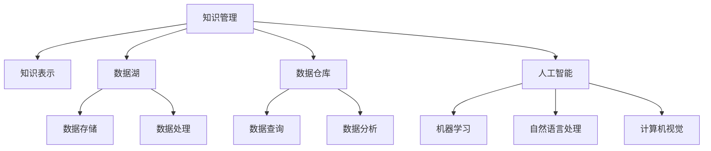

                 

# 人类知识的保存与传承：为未来留存文明

> 关键词：知识保存、知识传承、数字化转型、数据管理、人工智能

## 1. 背景介绍

### 1.1 问题由来
知识的保存与传承是人类文明延续的基石。在数字化时代，如何有效管理和利用海量知识资源，使其更好地服务于社会、教育、科研等多个领域，成为当下亟待解决的重大课题。随着互联网的普及和信息技术的发展，越来越多的知识以数字形式存在，传统的手工记录和传播方式已无法满足快速、高效、精准的知识需求。

### 1.2 问题核心关键点
知识保存与传承的核心在于构建高效的知识管理系统，通过数字化手段对知识进行收集、整理、存储和传播。随着人工智能技术的进步，特别是自然语言处理、计算机视觉、大数据分析等技术的发展，知识管理的智能化水平得到显著提升。然而，如何设计合理的知识管理框架，以及将知识与人工智能技术有机结合，仍需深入探讨。

## 2. 核心概念与联系

### 2.1 核心概念概述

为更好地理解人类知识保存与传承，本节将介绍几个密切相关的核心概念：

- 知识管理(Knowledge Management, KM)：指对组织或个人拥有的知识资源进行识别、存储、检索、共享和应用的过程。
- 知识表示(Knowledge Representation, KR)：将人类知识用计算机可理解的方式进行编码和表示，是知识管理的重要基础。
- 数据湖(Data Lake)：大规模的数据存储和管理环境，支持海量数据的快速读取和处理，为知识管理提供了坚实的数据基础。
- 数据仓库(Data Warehouse)：集中存储和管理企业数据，支持数据查询和分析，是知识管理的主要数据源之一。
- 人工智能(Artificial Intelligence, AI)：利用计算机模拟人类智能行为的技术，包括机器学习、自然语言处理、计算机视觉等，为知识管理提供了强大的技术支持。

这些核心概念之间的逻辑关系可以通过以下Mermaid流程图来展示：



这个流程图展示了这个系统中的核心概念及其之间的关系：

1. 知识管理是核心目标，通过知识表示、数据湖和数据仓库来支撑，最终实现智能化的知识管理。
2. 人工智能技术是工具手段，为知识管理的各个环节提供了技术支持，包括数据存储、处理、查询、分析等。
3. 数据湖和数据仓库是基础设施，提供丰富的数据资源和高效的数据管理能力。
4. 知识表示是桥梁，将人工智能技术生成的知识与实际业务应用进行连接，形成有价值的知识产品。

这些概念共同构成了知识管理的生态系统，使其能够在知识密集型领域发挥强大的作用。通过理解这些核心概念，我们可以更好地把握知识管理的工作原理和优化方向。

## 3. 核心算法原理 & 具体操作步骤
### 3.1 算法原理概述

知识保存与传承的过程可以视为一种特殊的知识管理过程。其核心思想是通过人工智能技术对知识进行系统化管理和有效传播，使其在特定场景下实现价值最大化。这一过程主要包括以下几个关键步骤：

1. **知识采集与标注**：通过自动化工具从互联网、学术文献、社交媒体等渠道采集相关知识，并由专家进行标注。
2. **知识编码与表示**：将采集到的知识进行编码和表示，形成计算机可理解的结构化或半结构化数据。
3. **知识存储与管理**：利用数据湖和数据仓库对知识进行存储和管理，确保数据的安全性、完整性和可访问性。
4. **知识检索与查询**：开发高效的检索与查询工具，方便用户快速定位和获取所需知识。
5. **知识应用与反馈**：将知识应用到实际业务场景中，如决策支持、问题解答等，并通过用户反馈进一步优化知识管理系统的性能。

### 3.2 算法步骤详解

以下是知识保存与传承的一般流程，具体步骤详解如下：

**Step 1: 知识采集与标注**
- 通过Web爬虫、API接口等方式，自动从互联网、文献数据库、社交媒体等渠道获取相关知识。
- 对采集到的文本进行预处理，如分词、去除停用词、标注词性等。
- 邀请领域专家对文本进行标注，标记出文本中重要的信息点、事实、关系等。

**Step 2: 知识编码与表示**
- 使用自然语言处理技术，如命名实体识别、关系抽取、语义分析等，将文本知识转化为结构化数据。
- 采用知识图谱、本体图、树形结构等方式对知识进行表示，使其更易于理解和应用。
- 将知识表示为RDF、JSON-LD、XML等标准格式，方便数据交换和共享。

**Step 3: 知识存储与管理**
- 将编码后的知识数据存储到数据湖或数据仓库中，确保数据的完整性和可靠性。
- 利用元数据管理技术，为每个知识数据项设置标签、分类、权限等信息。
- 采用数据分片、分布式存储、数据一致性协议等技术，确保数据的可扩展性和高性能。

**Step 4: 知识检索与查询**
- 开发基于搜索引擎、图数据库等技术的知识检索系统，支持快速查询。
- 实现知识关联和推理，通过查询和关联工具生成新知识或解答用户问题。
- 提供多维度查询功能，如关键词搜索、关系查询、时间范围查询等，满足不同用户需求。

**Step 5: 知识应用与反馈**
- 将检索到的知识应用到决策支持、问题解答、推荐系统等场景中，提升业务效率和效果。
- 收集用户反馈，对知识管理系统的性能进行评估和改进，优化知识表示和检索算法。
- 定期对知识库进行更新和维护，确保知识的实时性和准确性。

### 3.3 算法优缺点

知识保存与传承方法具有以下优点：
1. 自动化水平高。知识采集、标注、编码和存储等环节大部分采用自动化工具，减少了人工操作和错误。
2. 数据管理严格。通过元数据和权限管理，确保数据的完整性和安全性。
3. 检索效率高。利用高效的检索技术，用户可以快速定位所需知识。
4. 应用灵活。知识可以应用于多个业务场景，提升业务效率和效果。

同时，该方法也存在以下局限性：
1. 对数据质量依赖高。如果数据采集和标注质量不高，知识管理系统的性能也会受到影响。
2. 处理复杂信息困难。某些领域的知识涉及复杂的逻辑关系和语义，难以用简单的数据结构表示。
3. 用户友好度不足。系统的复杂性可能让用户感到困惑，降低用户体验。
4. 数据量庞大。知识库的存储和查询需要大量资源，增加了系统负担。

尽管存在这些局限性，但就目前而言，知识保存与传承方法仍然是大规模知识管理的主要手段。未来相关研究将继续优化算法和架构，提高数据质量处理能力和用户友好度，以满足更复杂和多样化的知识管理需求。

### 3.4 算法应用领域

知识保存与传承方法在多个领域得到了广泛应用，例如：

- 科研知识管理：科研机构通过构建知识库，将研究成果、实验数据、论文等进行结构化存储和共享，加速科研成果的传播和应用。
- 教育资源管理：学校和教育机构建立在线教育平台，存储和提供各类教学资源，提升教学质量和效率。
- 企业知识管理：企业通过知识管理系统，存储和应用内部的业务知识、经验、创新点等，提高决策水平和竞争力。
- 公共知识服务：政府和公共服务机构建立知识服务平台，提供政策法规、公共安全、健康医疗等领域的知识服务，提升公共服务水平。
- 社区知识共享：社区和个人用户利用知识管理工具，分享和获取各类知识，促进社区成员间的学习和交流。

除了上述这些典型领域外，知识保存与传承方法还将在更多场景中得到应用，如文化传承、公共安全、智能家居等，为知识密集型领域带来新的变革。

## 4. 数学模型和公式 & 详细讲解  
### 4.1 数学模型构建

本节将使用数学语言对知识保存与传承过程进行更加严格的刻画。

记知识采集到的文本为 $X=\{x_1, x_2, \cdots, x_n\}$，标注后的知识为 $K=\{k_1, k_2, \cdots, k_m\}$，知识表示为 $R=\{r_1, r_2, \cdots, r_l\}$。

定义知识管理系统的目标函数为：

$$
F = f(X, K, R)
$$

其中 $f$ 为目标函数，通过优化 $X$、$K$、$R$ 的参数，最小化知识管理的总体成本和风险，最大化知识的价值和可用性。

### 4.2 公式推导过程

以下我们以知识检索为例，推导知识检索系统的优化目标和相关公式。

假设知识检索系统由 $N$ 个知识点组成，每个知识点 $k_i$ 与用户查询 $q$ 的相似度为 $s_i$。定义 $s_i$ 为余弦相似度：

$$
s_i = \cos(\theta_i, q) = \frac{\mathbf{k}_i \cdot \mathbf{q}}{\|\mathbf{k}_i\| \cdot \|\mathbf{q}\|}
$$

其中 $\mathbf{k}_i$ 和 $\mathbf{q}$ 分别为知识表示和用户查询的向量表示，$\|\cdot\|$ 为向量的模长。

知识检索系统的目标是最小化用户查询与知识点的差距，即：

$$
\min_{s_i} \sum_{i=1}^N (s_i - \hat{s}_i)^2
$$

其中 $\hat{s}_i$ 为预期的相似度值，根据用户行为和反馈进行调整。

根据上述优化目标，可以使用梯度下降等优化算法求解 $s_i$，得到知识检索系统的输出结果。

## 5. 项目实践：代码实例和详细解释说明
### 5.1 开发环境搭建

在进行知识保存与传承实践前，我们需要准备好开发环境。以下是使用Python进行Elasticsearch开发的环境配置流程：

1. 安装Anaconda：从官网下载并安装Anaconda，用于创建独立的Python环境。

2. 创建并激活虚拟环境：
```bash
conda create -n elasticsearch-env python=3.8 
conda activate elasticsearch-env
```

3. 安装Elasticsearch：从官网下载并安装Elasticsearch，确保其与Python环境兼容。

4. 安装必要的Python包：
```bash
pip install elasticsearch-dsl
pip install elasticsearch-elasticsearch
```

5. 配置Elasticsearch：创建Elasticsearch索引，并配置基本的查询和索引功能。

完成上述步骤后，即可在`elasticsearch-env`环境中开始知识保存与传承的实践。

### 5.2 源代码详细实现

这里我们以构建一个简单的知识库为例，展示使用Elasticsearch进行知识保存与传承的代码实现。

首先，定义数据模型和索引：

```python
from elasticsearch import Elasticsearch
from elasticsearch_dsl import Index

# 创建Elasticsearch客户端
es = Elasticsearch([{'host': 'localhost', 'port': 9200}])

# 创建知识库索引
index = Index(name='knowledge')
index.create()

# 定义知识文档结构
class KnowledgeDocument(Document):
    name = Text(analyzer='english')
    description = Text(analyzer='english')
    keywords = Keyword(analyzer='english')
```

然后，实现知识数据的添加和查询功能：

```python
# 定义知识文档的添加函数
def add_knowledge(name, description, keywords):
    doc = KnowledgeDocument(
        name=name,
        description=description,
        keywords=keywords
    )
    doc.save()

# 定义知识文档的查询函数
def search_knowledge(name):
    query = {
        "query": {
            "match": {
                "name": name
            }
        }
    }
    results = es.search(index='knowledge', body=query)
    for result in results:
        print(result.to_dict())

# 添加示例知识
add_knowledge('Artificial Intelligence', 'This document describes the principles of artificial intelligence.', ['AI', 'Machine Learning', 'Deep Learning'])
add_knowledge('Knowledge Management', 'This document explains the concepts and technologies in knowledge management.', ['KM', 'Knowledge Repository', 'Knowledge Retrieval'])

# 查询知识
search_knowledge('Artificial Intelligence')
```

最后，启动Elasticsearch服务并执行上述代码，即可以完成知识库的基本构建和查询功能。

### 5.3 代码解读与分析

让我们再详细解读一下关键代码的实现细节：

**KnowledgeDocument类**：
- 定义了知识文档的基本字段，包括名称、描述和关键字。
- 使用Elasticsearch的DSL库定义了文档的类型和字段结构。

**add_knowledge函数**：
- 创建一个新的知识文档，设置其名称、描述和关键字，并保存到Elasticsearch索引中。

**search_knowledge函数**：
- 构建一个查询条件，使用match查询匹配名称为指定值的知识文档。
- 在Elasticsearch中执行查询，获取所有匹配的知识文档，并打印输出。

**代码运行结果**：
- 通过执行add_knowledge函数，向知识库中添加了两条示例知识。
- 通过执行search_knowledge函数，成功查询到了名称为'Artificial Intelligence'的知识文档，并打印输出了其详细信息。

可以看到，使用Elasticsearch进行知识保存与传承的代码实现相对简洁，便于快速上手。

当然，工业级的系统实现还需考虑更多因素，如搜索效率优化、索引设计、数据迁移等。但核心的知识管理流程基本与此类似。

## 6. 实际应用场景
### 6.1 科研知识管理

科研机构通常拥有大量的研究成果、实验数据和论文等，传统的知识管理方式往往繁琐且效率低下。通过构建基于Elasticsearch的知识管理系统，可以高效地存储和检索各类科研知识，提升科研工作的效率和水平。

在实践中，科研机构可以将机构内部和外部的科研资源，包括实验数据、论文、专利等，转化为知识文档，存储到Elasticsearch中。通过Elasticsearch提供的丰富查询功能和数据统计功能，科研人员可以快速定位所需知识，加速科研成果的传播和应用。

### 6.2 教育资源管理

学校和教育机构需要管理和共享大量的教学资源，如课件、教材、教案等。通过构建基于Elasticsearch的知识管理系统，可以高效地存储和管理各类教育资源，提升教学质量和管理效率。

在实践中，教育机构可以将各类教学资源转换为知识文档，存储到Elasticsearch中。通过Elasticsearch提供的文本搜索、分类查询等功能，教师和学生可以轻松找到所需资源，提升教学和学习效果。

### 6.3 企业知识管理

企业通常拥有大量的业务知识、经验、创新点等，传统的知识管理方式难以满足快速变化的市场需求。通过构建基于Elasticsearch的知识管理系统，可以高效地存储和检索各类企业知识，提升企业的决策水平和竞争力。

在实践中，企业可以将内部的业务知识、客户数据、项目文档等转换为知识文档，存储到Elasticsearch中。通过Elasticsearch提供的强大搜索功能和数据统计功能，企业可以快速获取所需知识，提升业务效率和管理水平。

### 6.4 未来应用展望

随着Elasticsearch和相关技术的发展，基于知识保存与传承的智能知识管理系统将得到广泛应用，为知识密集型领域带来新的变革。

在智慧城市治理中，智能知识管理系统可应用于城市事件监测、舆情分析、应急指挥等环节，提高城市管理的自动化和智能化水平，构建更安全、高效的未来城市。

在医疗领域，智能知识管理系统可应用于病历管理、药品研发、临床决策支持等环节，提升医疗服务的智能化水平，辅助医生诊疗，加速新药开发进程。

在智能教育领域，智能知识管理系统可应用于作业批改、学情分析、知识推荐等方面，因材施教，促进教育公平，提高教学质量。

此外，在企业生产、社会治理、文娱传媒等众多领域，基于Elasticsearch的知识管理应用也将不断涌现，为经济社会发展注入新的动力。相信随着技术的日益成熟，基于Elasticsearch的知识管理将成为知识密集型领域的重要范式，推动知识密集型产业的规模化发展。

## 7. 工具和资源推荐
### 7.1 学习资源推荐

为了帮助开发者系统掌握知识保存与传承的理论基础和实践技巧，这里推荐一些优质的学习资源：

1. Elasticsearch官方文档：Elasticsearch的官方文档提供了丰富的学习资源和样例代码，是入门Elasticsearch的不二之选。

2. 《Elasticsearch权威指南》书籍：由Elasticsearch的创建者撰写，全面介绍了Elasticsearch的使用方法和最佳实践，是进阶学习的必备资料。

3. Elasticsearch中文社区：Elasticsearch中文社区提供了丰富的学习资料、交流讨论和在线课程，是Elasticsearch学习的重要资源。

4. Coursera《Big Data Specialization》课程：由斯坦福大学教授授课，涵盖大数据处理、分布式系统等知识，是学习Elasticsearch的基础。

5. Udacity《Elasticsearch Engineer》课程：Udacity提供的在线课程，介绍了Elasticsearch的核心概念和应用场景，适合实战练习。

通过对这些资源的学习实践，相信你一定能够快速掌握Elasticsearch知识管理系统的精髓，并用于解决实际的业务问题。

### 7.2 开发工具推荐

高效的开发离不开优秀的工具支持。以下是几款用于知识保存与传承开发的常用工具：

1. Elasticsearch：Elasticsearch是知识管理系统的核心组件，提供了强大的文本检索和数据存储能力。

2. Python语言：Python语言简单易学，语法直观，非常适合进行数据分析和机器学习。

3. Kibana：Kibana是基于Elasticsearch的可视化工具，提供直观的图表和数据展示功能，方便用户进行数据分析和监控。

4. Logstash：Logstash是Elasticsearch的数据管道工具，支持数据的采集、转换、聚合等操作，方便构建复杂的数据流。

5. Drools：Drools是一个基于规则的流程引擎，可以在知识检索系统中引入规则引擎，提升系统决策的智能性。

6. 监控工具：如Zabbix、Grafana等，用于实时监控Elasticsearch的性能和运行状态，确保系统的稳定性和可用性。

合理利用这些工具，可以显著提升知识保存与传承系统的开发效率，加快创新迭代的步伐。

### 7.3 相关论文推荐

知识保存与传承方法的发展离不开学界的持续研究。以下是几篇奠基性的相关论文，推荐阅读：

1. "The Science of Search: Information Retrieval and Information Access"：由Christopher D. Manning等学者撰写，全面介绍了信息检索的原理和方法。

2. "Knowledge Discovery and Data Mining: Concepts and Techniques"：由Pang-Ning Tan等学者撰写，涵盖知识发现和数据挖掘的诸多算法和技术。

3. "Knowledge Management: Capture and Exploitation of Organizational Knowledge"：由D.W. Linden等学者撰写，探讨了知识管理的理论框架和实践方法。

4. "A Survey on Knowledge Graphs for Real-world Applications"：由Jiawei Han等学者撰写，介绍了知识图谱在实际应用中的发展现状和前沿技术。

5. "Deep Learning for Knowledge Representation and Reasoning"：由Tomas Mikolov等学者撰写，探讨了深度学习在知识表示和推理中的应用。

这些论文代表了大规模知识管理方法的发展脉络。通过学习这些前沿成果，可以帮助研究者把握学科前进方向，激发更多的创新灵感。

## 8. 总结：未来发展趋势与挑战

### 8.1 总结

本文对基于Elasticsearch的知识保存与传承方法进行了全面系统的介绍。首先阐述了知识保存与传承的背景和意义，明确了知识管理系统的目标和核心概念。其次，从原理到实践，详细讲解了知识管理的数学模型和关键步骤，给出了知识管理任务开发的完整代码实例。同时，本文还广泛探讨了知识管理方法在科研、教育、企业等多个领域的应用前景，展示了知识管理范式的巨大潜力。此外，本文精选了知识管理的各类学习资源，力求为读者提供全方位的技术指引。

通过本文的系统梳理，可以看到，基于Elasticsearch的知识管理方法正在成为知识密集型领域的重要范式，极大地拓展了知识资源的应用边界，催生了更多的落地场景。受益于Elasticsearch和相关技术的不断进步，知识管理技术必将进一步提升知识的智能化水平，为经济社会发展注入新的动力。

### 8.2 未来发展趋势

展望未来，知识保存与传承技术将呈现以下几个发展趋势：

1. 知识表示更加智能。随着自然语言处理技术的发展，知识表示将更加智能和语义化，从而更好地理解和应用人类知识。

2. 知识检索更加高效。利用人工智能技术，知识检索将更加快速和精准，满足用户多样化的查询需求。

3. 知识应用更加个性化。通过机器学习和推荐系统，知识管理系统的应用将更加个性化和智能化，提升用户体验和满意度。

4. 知识管理更加普适化。知识管理系统将不再局限于特定领域或机构，而是成为面向全社会的知识共享平台。

5. 知识保护更加严格。为了应对数据安全和隐私保护问题，知识管理系统将引入更多安全机制和技术手段，确保知识的安全性和合法性。

6. 知识创新更加活跃。知识管理系统的应用将激发更多的知识创新和应用，推动社会经济的发展和进步。

以上趋势凸显了知识保存与传承技术的广阔前景。这些方向的探索发展，必将进一步提升知识管理的智能化水平，为知识密集型领域带来新的变革。

### 8.3 面临的挑战

尽管知识保存与传承技术已经取得了显著进展，但在迈向更加智能化、普适化应用的过程中，它仍面临着诸多挑战：

1. 数据质量和结构复杂。知识管理的核心在于数据的质量和结构化程度，如何有效地处理无结构化和半结构化的数据，仍是亟待解决的问题。

2. 用户交互体验差。知识管理系统的界面和交互设计需要进一步优化，提升用户的使用体验。

3. 系统复杂度提升。随着功能和服务的多样化，知识管理系统的复杂度将进一步提升，系统开发和维护的难度增加。

4. 知识更新和维护成本高。知识管理系统需要不断更新和维护，以保证知识的准确性和时效性，这将带来较高的维护成本。

5. 技术壁垒高。知识管理系统的开发需要较高的技术门槛，需要专业的技术和人才支持。

6. 数据隐私和安全风险。知识管理系统处理大量敏感数据，如何保护数据隐私和安全，防止数据泄露和滥用，仍需持续改进。

面对知识管理面临的这些挑战，未来需要在数据质量处理、用户体验设计、系统架构优化、数据隐私保护等方面进行深入研究，不断提升系统的智能化水平和用户友好度，确保知识管理的稳定性和安全性。

### 8.4 研究展望

面对知识管理所面临的挑战，未来的研究需要在以下几个方面寻求新的突破：

1. 提升知识表示能力。开发更加智能和语义化的知识表示方法，提升知识的理解和使用效率。

2. 优化知识检索算法。利用深度学习和自然语言处理技术，提升知识检索的效率和准确性。

3. 引入多模态知识管理。将文本、图像、视频等多种类型的知识进行融合管理，提升知识的应用范围和效果。

4. 增强系统可扩展性。通过微服务架构和分布式系统，提升知识管理系统的可扩展性和鲁棒性。

5. 加强数据隐私保护。引入区块链和隐私计算技术，确保知识数据的安全性和隐私性。

6. 开发面向公众的知识平台。构建面向全社会的知识共享平台，促进知识的开放获取和应用。

这些研究方向的探索，必将引领知识管理技术迈向更高的台阶，为人类知识的保存与传承带来新的突破，推动知识密集型产业的进一步发展。

## 9. 附录：常见问题与解答

**Q1：什么是Elasticsearch？**

A: Elasticsearch是一种开源的分布式搜索引擎和全文检索平台，基于Lucene实现，能够高效地处理大规模数据，支持复杂的全文检索和聚合操作。

**Q2：Elasticsearch与传统的关系型数据库有何不同？**

A: Elasticsearch是一种面向文档的数据库，存储和检索的数据以JSON文档的形式存在，支持全文检索、分布式索引、实时查询等功能。与传统的关系型数据库相比，Elasticsearch更适合存储半结构化数据，能够快速处理高并发的查询请求。

**Q3：如何使用Elasticsearch进行知识检索？**

A: 使用Elasticsearch进行知识检索，需要先构建索引，将知识文档转换为Elasticsearch的文档格式，然后使用Elasticsearch的查询API进行搜索。常用的查询方式包括匹配查询、范围查询、聚合查询等。

**Q4：Elasticsearch在知识保存与传承中的应用场景有哪些？**

A: Elasticsearch在知识保存与传承中主要应用于知识文档的存储、检索、统计和展示等方面。具体应用场景包括：
1. 科研知识管理：存储和检索科研成果、实验数据、论文等。
2. 教育资源管理：存储和检索教学资源、课件、教材等。
3. 企业知识管理：存储和检索业务知识、客户数据、项目文档等。
4. 公共知识服务：存储和检索政策法规、公共安全、健康医疗等领域的知识。
5. 社区知识共享：存储和检索社区成员的分享和贡献的知识。

通过合理利用Elasticsearch，可以有效提升知识管理的效率和效果，为知识密集型产业的发展提供有力支持。

**Q5：如何优化Elasticsearch的查询性能？**

A: 优化Elasticsearch查询性能的方法包括：
1. 索引设计：合理设计索引结构和字段，提升查询效率。
2. 分片设计：合理设计分片和副本数量，提升查询的可扩展性和稳定性。
3. 查询优化：使用高效的查询方式，如匹配查询、聚合查询等，减少查询时间。
4. 缓存优化：使用缓存技术，减少查询过程中的数据读取和处理。
5. 硬件优化：使用高性能的硬件设备，如SSD、GPU等，提升查询和索引的速度。

通过以上方法，可以显著提升Elasticsearch的查询性能，满足知识管理系统的实时性需求。

---

作者：禅与计算机程序设计艺术 / Zen and the Art of Computer Programming

