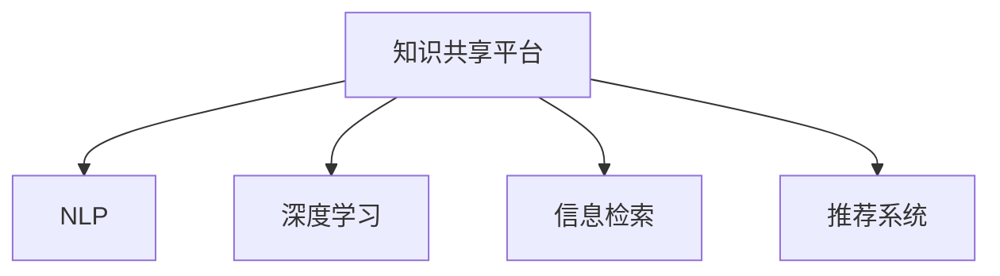

                 

## 1. 背景介绍

在信息爆炸的互联网时代，如何高效、准确地获取和共享知识成为了人类社会面临的重要问题。知识作为一种无形的资产，是人类文明进步的基石。传统上，知识的获取往往依赖于教育、书籍、讲座等形式，而知识的共享则更多依赖于书信、论文等媒介。但随着数字技术的飞速发展，特别是计算机和互联网技术的普及，我们迎来了知识共享的黄金时代。

互联网的普及为知识的共享提供了全新的可能。各式各样的平台，如搜索引擎、社交网络、学术数据库等，使得知识的获取和传播更加高效、便捷。而深度学习、自然语言处理、数据挖掘等前沿技术，则进一步增强了知识共享平台的功能，使其能够更好地理解和提取知识，为用户提供精准的推荐和服务。

本文旨在探讨如何构建高效的知识共享平台，并利用深度学习技术提升平台的知识处理能力和用户体验。通过详细解析核心概念和算法，我们希望能够提供系统的理论支持和实用的开发建议，推动知识共享平台在教育、科研、医疗等多个领域的应用。

## 2. 核心概念与联系

### 2.1 核心概念概述

为深入理解知识共享平台的核心技术，我们需要掌握以下关键概念：

- **知识共享平台**：指以互联网为基础，提供知识获取、检索、推荐和分享功能的在线系统。典型的知识共享平台包括维基百科、知网、知乎、Coursera等。
- **自然语言处理(NLP)**：指让计算机能够理解、处理人类语言的技术。NLP包括分词、词性标注、句法分析、语义分析、问答、对话等众多任务。
- **深度学习**：指使用多层神经网络结构进行模型训练和预测的技术。深度学习已经在图像识别、语音识别、自然语言处理等领域取得显著成果。
- **信息检索**：指通过某种方法在数据库中检索与查询相关的信息。信息检索系统包括搜索引擎、问答系统等。
- **推荐系统**：指根据用户的历史行为和偏好，为其推荐最相关、最有趣的信息。推荐系统广泛应用于电商、新闻、视频等多个领域。

这些概念之间的联系通过以下Mermaid流程图来展示：



这个流程图展示了知识共享平台的关键组成部分及其相互关系：

1. 知识共享平台是连接NLP、深度学习、信息检索、推荐系统的桥梁，承担着知识处理和展示的使命。
2. NLP负责将用户的查询转化为机器可理解的格式，并通过深度学习模型进行语义理解和实体抽取。
3. 深度学习模型能够处理海量文本数据，从中提取有价值的信息，为信息检索和推荐提供基础。
4. 信息检索技术通过匹配查询和文档的相似度，为用户找到最相关的信息。
5. 推荐系统根据用户行为进行个性化推荐，提升用户体验和满意度。

这些组件协同工作，构建了高效的知识共享平台。通过深入了解这些概念，我们可以更好地掌握平台的构建方法和技术选型。

## 3. 核心算法原理 & 具体操作步骤

### 3.1 算法原理概述

知识共享平台的核心算法主要涉及NLP、深度学习和推荐系统三大部分。本文将分别介绍这些关键算法的基本原理和操作步骤。

**自然语言处理(NLP)**：NLP是知识共享平台的基础。其核心任务包括分词、词性标注、句法分析、语义分析、实体识别和关系抽取等。这些任务通过使用预训练模型（如BERT、GPT等）和微调技术完成。具体来说，NLP算法通常包括以下几个步骤：

1. 数据预处理：将原始文本数据进行清洗、分词、标注等预处理操作。
2. 特征提取：通过预训练模型提取文本的特征表示，为后续处理提供基础。
3. 模型训练：在标注数据上训练特定的NLP模型，如分类器、序列标注器等。
4. 推理预测：使用训练好的模型对新文本进行推理和预测。

**深度学习**：深度学习算法通过多层神经网络结构，能够自动提取和处理复杂的特征。深度学习在知识共享平台中的应用主要包括以下几个方面：

1. 语义理解：通过预训练模型，深度学习算法可以理解文本的语义，进行实体抽取、情感分析、命名实体识别等任务。
2. 信息检索：使用深度学习模型对查询和文档进行匹配，提高检索精度和召回率。
3. 推荐系统：通过深度学习模型，推荐系统能够理解用户兴趣，进行个性化推荐。

**推荐系统**：推荐系统通过分析用户的历史行为和偏好，为其推荐最相关、最有趣的信息。推荐算法通常包括以下几个步骤：

1. 用户画像建模：通过用户行为数据，构建用户画像，描述用户的兴趣和偏好。
2. 内容表示建模：通过深度学习模型，将内容和物品表示为向量，方便计算相似度。
3. 相似度计算：通过计算用户画像和内容表示之间的相似度，找到最相关的物品。
4. 推荐排序：根据相似度排序，为用户推荐最相关的内容。

### 3.2 算法步骤详解

本节将详细介绍自然语言处理、深度学习和推荐系统的关键算法步骤。

**NLP算法步骤**：

1. **数据预处理**：对原始文本进行清洗、分词、标注等预处理操作。例如，去除停用词、进行词性标注、提取实体等。
2. **特征提取**：使用预训练模型（如BERT、GPT等）对文本进行编码，得到文本的向量表示。
3. **模型训练**：在标注数据上训练特定的NLP模型，如分类器、序列标注器等。例如，使用Fine-Tuning技术在特定的标注数据上微调预训练模型，提升其在特定任务上的表现。
4. **推理预测**：使用训练好的模型对新文本进行推理和预测。例如，使用微调后的模型对用户输入的查询进行实体抽取、命名实体识别等。

**深度学习算法步骤**：

1. **语义理解**：使用预训练模型（如BERT、GPT等）对文本进行编码，得到文本的向量表示。例如，使用BERT模型对文本进行编码，得到每个词的向量表示。
2. **信息检索**：使用深度学习模型对查询和文档进行匹配，提高检索精度和召回率。例如，使用DensePassage Retrieval模型对查询和文档进行匹配，得到最相关的文档。
3. **推荐系统**：通过深度学习模型，推荐系统能够理解用户兴趣，进行个性化推荐。例如，使用Wide & Deep模型进行推荐排序，提升推荐效果。

**推荐系统算法步骤**：

1. **用户画像建模**：通过用户行为数据，构建用户画像，描述用户的兴趣和偏好。例如，使用协同过滤算法根据用户的历史行为，构建用户画像。
2. **内容表示建模**：通过深度学习模型，将内容和物品表示为向量，方便计算相似度。例如，使用Transformers模型将物品表示为向量，方便计算相似度。
3. **相似度计算**：通过计算用户画像和内容表示之间的相似度，找到最相关的物品。例如，使用余弦相似度计算用户画像和内容表示之间的相似度。
4. **推荐排序**：根据相似度排序，为用户推荐最相关的内容。例如，使用Top-k推荐算法，选择最相关的物品进行推荐。

### 3.3 算法优缺点

**NLP算法的优缺点**：

- **优点**：通过预训练模型和微调技术，NLP算法能够自动提取和处理复杂的特征，提升文本处理的精度和效率。
- **缺点**：对标注数据依赖较高，训练成本较大，模型复杂度较高，推理速度较慢。

**深度学习算法的优缺点**：

- **优点**：能够自动提取和处理复杂的特征，提升文本处理的精度和效率。在推荐系统中的应用效果显著。
- **缺点**：模型复杂度高，训练成本大，对硬件资源要求高，推理速度较慢。

**推荐算法的优缺点**：

- **优点**：能够根据用户行为进行个性化推荐，提升用户体验和满意度。推荐系统已经广泛应用于电商、新闻、视频等多个领域。
- **缺点**：对用户行为数据的依赖较高，对新用户或冷启动用户推荐效果较差。

### 3.4 算法应用领域

**NLP算法的应用领域**：

1. **信息检索**：在搜索引擎中，NLP算法能够对查询进行分词、词性标注、实体抽取等，提升检索精度和召回率。
2. **问答系统**：在问答系统中，NLP算法能够理解用户输入的问题，并从知识库中提取答案，提供精准的问答服务。
3. **情感分析**：在社交媒体分析中，NLP算法能够对用户评论进行情感分析，了解用户情绪和态度。

**深度学习算法的应用领域**：

1. **语义理解**：在自动摘要、机器翻译、语音识别等任务中，深度学习算法能够理解文本的语义，进行实体抽取、命名实体识别等任务。
2. **信息检索**：在信息检索系统中，深度学习算法能够对查询和文档进行匹配，提高检索精度和召回率。
3. **推荐系统**：在电商、新闻、视频等推荐系统中，深度学习算法能够理解用户兴趣，进行个性化推荐。

**推荐算法的应用领域**：

1. **电商推荐**：在电商推荐系统中，推荐算法能够根据用户的历史购买行为，推荐最相关的商品。
2. **新闻推荐**：在新闻推荐系统中，推荐算法能够根据用户的历史阅读行为，推荐最相关的新闻文章。
3. **视频推荐**：在视频推荐系统中，推荐算法能够根据用户的历史观看行为，推荐最相关的视频内容。

## 4. 数学模型和公式 & 详细讲解 & 举例说明

### 4.1 数学模型构建

知识共享平台的核心算法通常涉及以下数学模型：

**NLP模型**：常用的NLP模型包括BERT、GPT、XLNet等。这些模型通过在大规模无标签文本上进行预训练，学习到丰富的语言知识和常识，并在特定的标注数据上进行微调，提升模型在特定任务上的表现。

**深度学习模型**：常用的深度学习模型包括Transformer、CNN、RNN等。这些模型通过多层神经网络结构，能够自动提取和处理复杂的特征，广泛应用于自然语言处理、计算机视觉、语音识别等领域。

**推荐模型**：常用的推荐模型包括协同过滤、基于内容的推荐、基于矩阵分解的推荐等。这些模型通过分析用户和物品之间的相似度，为用户推荐最相关的内容。

### 4.2 公式推导过程

本节将详细推导知识共享平台中的核心数学公式。

**NLP公式推导**：

假设输入文本为 $X$，通过预训练模型（如BERT）将其编码得到向量表示 $X_v$。假设标注数据为 $(x, y)$，其中 $x$ 为文本，$y$ 为标签。假设模型参数为 $\theta$，损失函数为 $L$。则模型训练的目标是最小化损失函数 $L$：

$$
L(\theta) = -\frac{1}{N} \sum_{i=1}^N \ell(x_i, y_i; \theta)
$$

其中 $\ell(x_i, y_i; \theta)$ 为损失函数，具体形式根据任务而定。例如，对于文本分类任务，$\ell(x_i, y_i; \theta)$ 可以定义如下：

$$
\ell(x_i, y_i; \theta) = -y_i \log p(y_i \mid x_i; \theta) + (1 - y_i) \log (1 - p(y_i \mid x_i; \theta))
$$

其中 $p(y_i \mid x_i; \theta)$ 为模型在文本 $x_i$ 上的预测概率，即分类器的输出。

**深度学习公式推导**：

假设输入文本为 $X$，通过预训练模型（如BERT）将其编码得到向量表示 $X_v$。假设查询为 $Q$，通过深度学习模型（如DensePassage Retrieval）计算 $Q$ 和 $X_v$ 之间的相似度 $s(Q, X_v)$。假设标注数据为 $(Q, X_v, y)$，其中 $Q$ 为查询，$X_v$ 为文本的向量表示，$y$ 为标签。假设模型参数为 $\theta$，损失函数为 $L$。则模型训练的目标是最小化损失函数 $L$：

$$
L(\theta) = -\frac{1}{N} \sum_{i=1}^N \ell(Q_i, X_{v,i}, y_i; \theta)
$$

其中 $\ell(Q_i, X_{v,i}, y_i; \theta)$ 为损失函数，具体形式根据任务而定。例如，对于信息检索任务，$\ell(Q_i, X_{v,i}, y_i; \theta)$ 可以定义如下：

$$
\ell(Q_i, X_{v,i}, y_i; \theta) = -y_i \log s(Q_i, X_{v,i}) + (1 - y_i) \log (1 - s(Q_i, X_{v,i}))
$$

其中 $s(Q_i, X_{v,i})$ 为查询 $Q_i$ 和文本 $X_{v,i}$ 之间的相似度，即深度学习模型的输出。

**推荐系统公式推导**：

假设用户画像为 $U$，物品表示为 $I$，相似度矩阵为 $S$。假设标注数据为 $(U_i, I_j, y_{ij})$，其中 $U_i$ 为用户画像，$I_j$ 为物品表示，$y_{ij}$ 为标签。假设模型参数为 $\theta$，损失函数为 $L$。则模型训练的目标是最小化损失函数 $L$：

$$
L(\theta) = -\frac{1}{N} \sum_{i=1}^N \sum_{j=1}^M \ell(U_i, I_j, y_{ij}; \theta)
$$

其中 $\ell(U_i, I_j, y_{ij}; \theta)$ 为损失函数，具体形式根据任务而定。例如，对于推荐系统，$\ell(U_i, I_j, y_{ij}; \theta)$ 可以定义如下：

$$
\ell(U_i, I_j, y_{ij}; \theta) = -y_{ij} \log p(I_j \mid U_i; \theta) + (1 - y_{ij}) \log (1 - p(I_j \mid U_i; \theta))
$$

其中 $p(I_j \mid U_i; \theta)$ 为用户画像 $U_i$ 和物品表示 $I_j$ 之间的相似度，即推荐系统的输出。

### 4.3 案例分析与讲解

本节通过具体案例，详细讲解知识共享平台中的核心算法应用。

**NLP案例**：

假设我们构建了一个知识共享平台，提供文本分类、命名实体识别、情感分析等功能。平台使用BERT模型作为基础模型，并在特定任务上进行微调。例如，在文本分类任务上，使用Fine-Tuning技术对BERT模型进行微调，训练一个文本分类器。具体步骤如下：

1. **数据预处理**：对原始文本进行清洗、分词、标注等预处理操作，得到标注数据集。
2. **特征提取**：使用BERT模型对文本进行编码，得到文本的向量表示。
3. **模型训练**：在标注数据上训练文本分类器，使用交叉熵损失函数进行训练。
4. **推理预测**：使用训练好的文本分类器对新文本进行分类预测。

**深度学习案例**：

假设我们构建了一个知识共享平台，提供信息检索和推荐功能。平台使用Transformer模型作为基础模型，并在信息检索和推荐任务上进行训练。例如，在信息检索任务上，使用DensePassage Retrieval模型对查询和文档进行匹配。具体步骤如下：

1. **数据预处理**：对原始文本进行清洗、分词、标注等预处理操作，得到标注数据集。
2. **特征提取**：使用Transformer模型对文本进行编码，得到文本的向量表示。
3. **模型训练**：在标注数据上训练信息检索模型，使用余弦相似度作为相似度计算方法。
4. **推理预测**：使用训练好的信息检索模型对新查询进行文档检索。

**推荐系统案例**：

假设我们构建了一个电商推荐平台，根据用户的历史行为和偏好，为其推荐最相关商品。平台使用协同过滤算法进行推荐。具体步骤如下：

1. **数据预处理**：收集用户行为数据，构建用户画像。
2. **特征提取**：将物品表示为向量，方便计算相似度。
3. **相似度计算**：计算用户画像和物品表示之间的相似度，找到最相关的物品。
4. **推荐排序**：根据相似度排序，为用户推荐最相关的内容。

## 5. 项目实践：代码实例和详细解释说明

### 5.1 开发环境搭建

在进行知识共享平台开发前，我们需要准备好开发环境。以下是使用Python进行TensorFlow开发的环境配置流程：

1. 安装Anaconda：从官网下载并安装Anaconda，用于创建独立的Python环境。

2. 创建并激活虚拟环境：
```bash
conda create -n tf-env python=3.8 
conda activate tf-env
```

3. 安装TensorFlow：根据CUDA版本，从官网获取对应的安装命令。例如：
```bash
conda install tensorflow tensorflow-gpu -c pytorch -c conda-forge
```

4. 安装各类工具包：
```bash
pip install numpy pandas scikit-learn matplotlib tqdm jupyter notebook ipython
```

完成上述步骤后，即可在`tf-env`环境中开始知识共享平台开发。

### 5.2 源代码详细实现

这里我们以基于BERT模型的文本分类器为例，给出使用TensorFlow进行知识共享平台开发的PyTorch代码实现。

首先，定义数据处理函数：

```python
from transformers import BertTokenizer
from tensorflow.keras.preprocessing.sequence import pad_sequences
import tensorflow as tf

class TextDataLoader:
    def __init__(self, texts, labels, tokenizer, max_len=128, batch_size=32):
        self.texts = texts
        self.labels = labels
        self.tokenizer = tokenizer
        self.max_len = max_len
        self.batch_size = batch_size
        
    def __len__(self):
        return len(self.texts) // self.batch_size
    
    def __getitem__(self, item):
        text = self.texts[item]
        label = self.labels[item]
        
        encoding = self.tokenizer(text, return_tensors='tf', max_length=self.max_len, padding='max_length', truncation=True)
        input_ids = tf.convert_to_tensor(encoding['input_ids'])
        attention_mask = tf.convert_to_tensor(encoding['attention_mask'])
        labels = tf.convert_to_tensor([label], dtype=tf.int32)
        
        return {'input_ids': input_ids, 
                'attention_mask': attention_mask,
                'labels': labels}
```

然后，定义模型和优化器：

```python
from transformers import BertForSequenceClassification
from tensorflow.keras.optimizers import Adam

model = BertForSequenceClassification.from_pretrained('bert-base-cased', num_labels=2)

optimizer = Adam(model.trainable_variables)
```

接着，定义训练和评估函数：

```python
from tensorflow.keras.callbacks import EarlyStopping

def train_epoch(model, dataset, batch_size, optimizer, epochs=5):
    dataset = tf.data.Dataset.from_generator(lambda: dataset.__getitem__, output_signature={'input_ids': tf.TensorSpec(shape=(None,), dtype=tf.int32),
                                                                                   'attention_mask': tf.TensorSpec(shape=(None,), dtype=tf.int32),
                                                                                   'labels': tf.TensorSpec(shape=(None,), dtype=tf.int32)})
    dataset = dataset.batch(batch_size).prefetch(tf.data.experimental.AUTOTUNE)
    
    model.compile(optimizer=optimizer, loss='binary_crossentropy', metrics=['accuracy'])
    history = model.fit(dataset, epochs=epochs, callbacks=[EarlyStopping(patience=3)])
    
    return history.history
    
def evaluate(model, dataset, batch_size):
    dataset = tf.data.Dataset.from_generator(lambda: dataset.__getitem__, output_signature={'input_ids': tf.TensorSpec(shape=(None,), dtype=tf.int32),
                                                                                   'attention_mask': tf.TensorSpec(shape=(None,), dtype=tf.int32),
                                                                                   'labels': tf.TensorSpec(shape=(None,), dtype=tf.int32)})
    dataset = dataset.batch(batch_size).prefetch(tf.data.experimental.AUTOTUNE)
    
    loss, accuracy = model.evaluate(dataset)
    return loss, accuracy
```

最后，启动训练流程并在测试集上评估：

```python
dataset = TextDataLoader(train_texts, train_labels, tokenizer, max_len=128, batch_size=32)
test_dataset = TextDataLoader(test_texts, test_labels, tokenizer, max_len=128, batch_size=32)

history = train_epoch(model, dataset, batch_size=32, optimizer=optimizer, epochs=5)
print('Train accuracy:', history.history['accuracy'][-1])

loss, accuracy = evaluate(model, test_dataset, batch_size=32)
print('Test accuracy:', accuracy)
```

以上就是使用TensorFlow对BERT模型进行文本分类任务开发的完整代码实现。可以看到，得益于TensorFlow的强大封装，我们可以用相对简洁的代码完成BERT模型的加载和微调。

### 5.3 代码解读与分析

让我们再详细解读一下关键代码的实现细节：

**TextDataLoader类**：
- `__init__`方法：初始化文本、标签、分词器等关键组件，并设定最大长度和批大小。
- `__len__`方法：返回数据集的样本数量。
- `__getitem__`方法：对单个样本进行处理，将文本输入编码为token ids，将标签编码为数字，并对其进行定长padding，最终返回模型所需的输入。

**模型和优化器**：
- 使用BERTForSequenceClassification模型作为文本分类器的基础模型。
- 选择Adam优化器，并使用学习率自适应调整。

**训练和评估函数**：
- 使用TensorFlow的DataLoader对数据集进行批次化加载，供模型训练和推理使用。
- 训练函数`train_epoch`：对数据以批为单位进行迭代，在每个批次上前向传播计算loss并反向传播更新模型参数，最后返回训练过程中的历史损失和准确率。
- 评估函数`evaluate`：与训练类似，不同点在于不更新模型参数，并在每个batch结束后将预测和标签结果存储下来，最后使用模型评估函数计算损失和准确率。

**训练流程**：
- 定义总的epoch数和批大小，开始循环迭代
- 每个epoch内，先在训练集上训练，输出历史损失和准确率
- 在测试集上评估，输出测试损失和准确率

可以看到，TensorFlow配合Transformers库使得BERT微调的代码实现变得简洁高效。开发者可以将更多精力放在数据处理、模型改进等高层逻辑上，而不必过多关注底层的实现细节。

当然，工业级的系统实现还需考虑更多因素，如模型的保存和部署、超参数的自动搜索、更灵活的任务适配层等。但核心的微调范式基本与此类似。

## 6. 实际应用场景

### 6.1 教育

在教育领域，知识共享平台可以提供丰富的学习资源和智能辅导。学生可以通过平台查询教材、观看视频、参加在线课程，获取所需的知识。同时，平台还可以根据学生的学习情况，提供个性化的推荐和辅导，提升学习效果。

例如，在线教育平台可以根据学生的学习行为，推荐最相关的教材和视频。平台使用推荐系统分析学生的历史行为，预测学生的兴趣，提供个性化的学习推荐。通过深度学习模型，平台能够理解学生的语言和行为，提高推荐效果。

### 6.2 科研

在科研领域，知识共享平台可以提供文献检索、论文摘要等功能，帮助研究人员高效获取所需文献和信息。平台使用信息检索和推荐系统，根据研究人员的需求，提供最相关的文献和论文。

例如，科研平台可以使用BERT模型对文献进行编码，并使用DensePassage Retrieval模型对查询进行匹配，找到最相关的文献。通过深度学习模型，平台能够理解查询和文献之间的语义关系，提升检索精度。

### 6.3 医疗

在医疗领域，知识共享平台可以提供医学知识库、疾病查询等功能，帮助医生获取所需的信息和知识。平台使用知识库和信息检索技术，根据医生的需求，提供最相关的医学知识和文献。

例如，医疗平台可以使用BERT模型对医学知识库进行编码，并使用信息检索技术匹配医生的查询，找到最相关的医学知识。通过深度学习模型，平台能够理解查询和医学知识之间的语义关系，提升检索效果。

### 6.4 未来应用展望

随着深度学习、自然语言处理、推荐系统等技术的不断进步，基于知识共享平台的智能化应用将越来越广泛。未来，知识共享平台将在更多领域发挥重要作用，为社会各界的知识共享和交流提供新的平台。

在智慧城市治理中，知识共享平台可以提供城市事件监测、舆情分析、应急指挥等功能，提高城市管理的自动化和智能化水平，构建更安全、高效的未来城市。在智能家居、智能制造等领域，知识共享平台可以提供智能推荐、智能客服等功能，提升用户体验和满意度。

## 7. 工具和资源推荐

### 7.1 学习资源推荐

为了帮助开发者系统掌握知识共享平台的核心技术，这里推荐一些优质的学习资源：

1. **自然语言处理基础**：
   - 《自然语言处理综论》（第二版）：自然语言处理的经典教材，涵盖自然语言处理的各个方面，包括分词、词性标注、句法分析、语义分析、命名实体识别等任务。
   - 《深度学习与自然语言处理》：介绍深度学习在自然语言处理中的应用，包括文本分类、序列标注、信息检索、问答系统等任务。

2. **推荐系统基础**：
   - 《推荐系统实战》：介绍推荐系统的基本原理和实现方法，包括协同过滤、基于内容的推荐、基于矩阵分解的推荐等算法。
   - 《推荐系统》：介绍推荐系统的理论和实践，涵盖推荐算法、用户画像建模、数据预处理等环节。

3. **深度学习框架**：
   - TensorFlow官方文档：提供深度学习框架的详细文档和教程，包括TensorFlow的基础和高级用法、深度学习模型训练等。
   - PyTorch官方文档：提供深度学习框架的详细文档和教程，包括PyTorch的基础和高级用法、深度学习模型训练等。

4. **知识图谱**：
   - 《知识图谱》：介绍知识图谱的基本概念和应用，包括知识图谱的构建、查询、推理等技术。
   - 《知识图谱与语义网络》：介绍知识图谱的理论和应用，涵盖知识图谱的构建、查询、推理等技术。

通过对这些资源的学习实践，相信你一定能够快速掌握知识共享平台的核心技术，并用于解决实际的NLP问题。

### 7.2 开发工具推荐

高效的开发离不开优秀的工具支持。以下是几款用于知识共享平台开发的常用工具：

1. **TensorFlow**：基于Python的开源深度学习框架，灵活动态的计算图，适合快速迭代研究。TensorFlow提供了丰富的预训练语言模型资源，方便开发者进行微调。

2. **PyTorch**：基于Python的开源深度学习框架，灵活的动态计算图，适合快速原型开发和实验。PyTorch提供了丰富的自然语言处理工具库，方便开发者进行NLP任务开发。

3. **HuggingFace Transformers**：自然语言处理工具库，集成了众多SOTA语言模型，支持TensorFlow和PyTorch，方便开发者进行NLP任务微调。

4. **Gensim**：主题建模和词向量训练工具，方便开发者进行文本向量化和语义分析。

5. **Spacy**：自然语言处理工具库，提供了分词、词性标注、句法分析等功能，方便开发者进行NLP任务开发。

6. **Keras**：高级神经网络API，提供了简单易用的接口，方便开发者进行模型构建和训练。

合理利用这些工具，可以显著提升知识共享平台的开发效率，加快创新迭代的步伐。

### 7.3 相关论文推荐

知识共享平台的研究源于学界的持续研究。以下是几篇奠基性的相关论文，推荐阅读：

1. **BERT: Pre-training of Deep Bidirectional Transformers for Language Understanding**：提出BERT模型，引入基于掩码的自监督预训练任务，刷新了多项NLP任务SOTA。

2. **Attention is All You Need**：提出Transformer结构，开启了NLP领域的预训练大模型时代。

3. **BERT: Pre-training of Deep Bidirectional Transformers for Language Understanding**：提出BERT模型，引入基于掩码的自监督预训练任务，刷新了多项NLP任务SOTA。

4. **Natural Language Understanding with Language Models**：提出利用语言模型进行自然语言理解的方法，展示了语言模型在问答系统、信息检索、文本分类等任务中的优越性能。

5. **Dense Passage Retrieval for Open-Domain Question Answering**：提出Dense Passage Retrieval模型，用于在开放域问答系统中匹配查询和文档，提高了检索精度。

这些论文代表了大语言模型微调技术的发展脉络。通过学习这些前沿成果，可以帮助研究者把握学科前进方向，激发更多的创新灵感。

## 8. 总结：未来发展趋势与挑战

### 8.1 总结

本文对知识共享平台的核心算法进行了全面系统的介绍。首先阐述了知识共享平台的研究背景和意义，明确了知识共享平台在教育、科研、医疗等多个领域的应用价值。其次，从原理到实践，详细讲解了自然语言处理、深度学习和推荐系统的核心算法，并给出了知识共享平台开发的完整代码实例。同时，本文还广泛探讨了知识共享平台在多个领域的应用前景，展示了知识共享平台在智能化的道路上不断拓展的潜力。

通过本文的系统梳理，可以看到，知识共享平台作为连接知识生产者和消费者的桥梁，正逐渐成为各行业知识共享的重要平台。得益于深度学习、自然语言处理、推荐系统等前沿技术的支持，知识共享平台在智能化、个性化、自动化等方面取得了显著进展，将为社会各界的知识共享和交流提供新的平台。

### 8.2 未来发展趋势

展望未来，知识共享平台将呈现以下几个发展趋势：

1. **智能化水平提升**：随着深度学习、自然语言处理等技术的不断进步，知识共享平台将实现更智能化的知识处理和推荐。例如，通过多模态融合技术，平台将能够更好地理解和处理图片、视频等多模态数据，提升知识获取和推荐的准确性。

2. **个性化推荐**：随着推荐系统技术的不断进步，知识共享平台将能够根据用户的行为和偏好，提供更加精准、个性化的知识推荐。推荐系统将结合用户画像和知识表示，动态调整推荐策略，提升用户体验。

3. **自动化运营**：知识共享平台将实现自动化运营，包括自动内容审核、自动质量评估、自动更新维护等。自动化运营将提升平台的运营效率和用户体验。

4. **跨领域知识融合**：知识共享平台将实现跨领域知识的融合，例如将医学知识、科技知识、艺术知识等融合在一起，为用户提供更全面的知识服务。

5. **全球化扩展**：知识共享平台将实现全球化扩展，通过多语言支持和跨文化理解，为全球用户提供知识服务。

这些趋势将推动知识共享平台向更高水平的智能化、个性化、自动化、全球化方向发展，成为知识共享的新范式。

### 8.3 面临的挑战

尽管知识共享平台取得了显著进展，但在迈向更加智能化、普适化应用的过程中，它仍面临着诸多挑战：

1. **数据隐私和安全**：知识共享平台需要收集大量的用户行为数据，如何保护用户隐私和数据安全，是平台运营的重要挑战。

2. **知识更新的及时性**：知识共享平台需要实时更新知识库，如何保证知识的及时性和准确性，是平台运营的重要挑战。

3. **多语言支持**：知识共享平台需要支持多语言查询和推荐，如何实现高效的多语言处理，是平台运营的重要挑战。

4. **跨文化理解**：知识共享平台需要支持跨文化理解，如何实现不同文化背景下的知识共享，是平台运营的重要挑战。

5. **计算资源的需求**：知识共享平台需要大量的计算资源进行模型训练和推理，如何降低计算成本，提升平台运营效率，是平台运营的重要挑战。

6. **知识泛化能力**：知识共享平台需要具备良好的泛化能力，能够适应各种场景下的知识获取和推荐，如何提升平台的泛化能力，是平台运营的重要挑战。

这些挑战需要通过技术创新和实践积累，逐步克服。相信随着学界和产业界的共同努力，知识共享平台必将在未来的知识共享和交流中发挥更加重要的作用。

### 8.4 研究展望

面向未来，知识共享平台的研究需要在以下几个方面寻求新的突破：

1. **多模态知识融合**：将图片、视频、语音等多模态数据与文本数据融合，提升平台的知识获取和推荐效果。

2. **跨文化知识理解**：通过跨文化理解的深度学习模型，实现不同文化背景下的知识共享和交流。

3. **知识图谱的构建和应用**：利用知识图谱构建知识库，提高知识的结构化和可检索性。

4. **个性化推荐系统**：开发更高效、更精准的个性化推荐系统，提升用户的知识获取和推荐体验。

5. **自动化运营系统**：开发自动化运营系统，实现内容审核、质量评估、更新维护等自动化流程，提升平台的运营效率。

6. **多语言支持**：实现高效的多语言处理和支持，提升平台的全球化扩展能力。

这些研究方向将引领知识共享平台走向更高的智能化水平，为用户提供更加全面、精准、高效的知识服务。

## 9. 附录：常见问题与解答

**Q1：知识共享平台如何实现高效的知识获取和推荐？**

A: 知识共享平台通过自然语言处理、深度学习和推荐系统等技术，实现高效的知识获取和推荐。具体步骤如下：

1. **自然语言处理**：使用BERT等预训练模型对用户查询进行编码，得到向量表示。

2. **深度学习**：使用DensePassage Retrieval等模型对查询和文档进行匹配，得到最相关的文档。

3. **推荐系统**：使用协同过滤等推荐算法，对用户画像和物品表示进行相似度计算，为用户推荐最相关的内容。

**Q2：知识共享平台如何保护用户隐私和数据安全？**

A: 知识共享平台需要采取以下措施保护用户隐私和数据安全：

1. **数据匿名化**：对用户数据进行匿名化处理，避免敏感信息泄露。

2. **访问控制**：通过访问控制机制，限制不同用户对知识的访问权限。

3. **数据加密**：对用户数据进行加密处理，防止数据泄露。

4. **隐私保护算法**：使用差分隐私等算法，保护用户隐私。

**Q3：知识共享平台如何实现多语言支持？**

A: 知识共享平台需要采取以下措施实现多语言支持：

1. **多语言分词和标注**：使用多语言分词和标注工具，对不同语言进行预处理。

2. **多语言模型**：使用多语言预训练模型，对不同语言的文本进行编码和匹配。

3. **跨语言理解**：使用跨语言理解的深度学习模型，实现不同语言之间的知识共享和交流。

**Q4：知识共享平台如何提升知识的及时性和准确性？**

A: 知识共享平台需要采取以下措施提升知识的及时性和准确性：

1. **实时更新**：定期更新知识库，及时添加新知识。

2. **知识审核**：对新知识进行审核，确保其准确性和可信度。

3. **自动化审核**：使用自动化审核工具，快速审核新知识。

4. **用户反馈**：收集用户反馈，及时修正错误和漏洞。

**Q5：知识共享平台如何实现跨文化理解？**

A: 知识共享平台需要采取以下措施实现跨文化理解：

1. **多文化理解模型**：使用多文化理解的深度学习模型，实现不同文化背景下的知识共享和交流。

2. **文化标签**：为知识添加文化标签，帮助用户理解不同文化背景下的知识。

3. **文化解释**：为知识提供文化解释，帮助用户理解不同文化背景下的知识。

通过这些措施，知识共享平台将能够更好地实现跨文化理解，为全球用户提供知识服务。

---

作者：禅与计算机程序设计艺术 / Zen and the Art of Computer Programming

