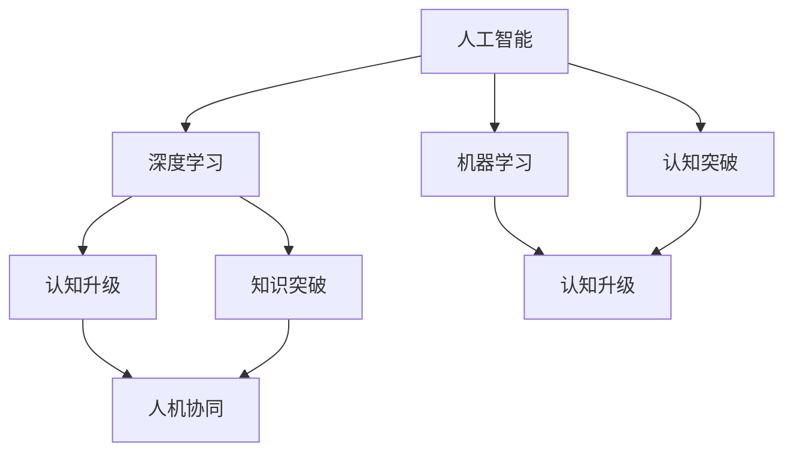

                 

# 人类知识的局限与超越：洞察力的重要意义

> 关键词：人工智能, 人类知识, 洞察力, 机器学习, 认知升级, 认知突破

## 1. 背景介绍

### 1.1 问题由来

在当今信息爆炸的时代，人类面对海量数据和不断变化的环境，需要不断学习和适应。然而，人类的认知能力是有限的，难以处理和理解所有信息。人工智能技术，特别是机器学习和深度学习，为解决这一问题提供了新的可能性。通过对海量数据的分析和建模，人工智能可以发现数据背后的模式和规律，帮助人类进行认知升级和知识突破。

### 1.2 问题核心关键点

尽管人工智能在处理数据方面具有巨大的优势，但其本质仍是一种计算工具。人工智能的局限性在于其无法像人类一样进行情感、道德、艺术等方面的理解和创造。因此，人类知识与人工智能的结合，既需要利用人工智能处理海量数据的能力，又需要保留人类洞察力的独特价值。

### 1.3 问题研究意义

研究人类知识的局限与超越，对于提升人工智能技术在实际应用中的效果，以及推动人类认知的进步，具有重要意义：

1. **认知突破**：通过与人工智能的结合，人类可以突破自身的认知局限，发现和理解更多复杂的问题。
2. **知识创新**：人工智能可以挖掘人类知识库中的潜藏信息，推动新知识的产生和应用。
3. **社会进步**：将人工智能与人类知识结合，可以提升社会治理和公共服务的水平，促进社会进步。
4. **产业升级**：人工智能在生产、医疗、教育等领域的广泛应用，可以推动相关产业的转型升级。

## 2. 核心概念与联系

### 2.1 核心概念概述

为更好地理解人工智能与人类知识的结合，本节将介绍几个关键概念及其联系：

- **人工智能**：以计算机算法和数学模型为基础，通过计算和分析数据，模拟人类智能的科学和技术。
- **机器学习**：通过算法使机器能够从数据中学习规律，并进行预测和决策。
- **深度学习**：一种特殊的机器学习方法，使用多层神经网络进行特征提取和模式识别。
- **认知升级**：通过学习新知识和技能，提升个人的认知能力。
- **知识突破**：在特定领域内，通过创新和突破，发现新知识和规律。
- **人机协同**：将人工智能与人类知识相结合，发挥各自优势，实现更高效的协同工作。

这些概念之间的逻辑关系可以通过以下Mermaid流程图来展示：



这个流程图展示了一系列核心概念及其之间的联系：

1. 人工智能通过机器学习和深度学习等技术，处理数据并发现规律。
2. 认知升级和知识突破是人类通过学习新知识和技能，提升认知能力的过程。
3. 人机协同是将人工智能与人类知识结合，实现更高效的协作。

这些概念共同构成了人工智能技术的发展框架，使其能够更好地服务于人类认知和知识创新。

## 3. 核心算法原理 & 具体操作步骤

### 3.1 算法原理概述

人工智能与人类知识的结合，主要是通过深度学习等技术，在处理大量数据的同时，挖掘数据背后的规律和模式。通过对数据的分析，人工智能可以帮助人类进行认知升级和知识突破。

形式化地，假设有一批标注数据 $D=\{(x_i,y_i)\}_{i=1}^N$，其中 $x_i$ 为输入，$y_i$ 为输出，机器学习算法的目标是找到一个函数 $f(x)$，使得 $f(x)$ 能够在新的输入 $x'$ 上产生正确的输出 $y'$。即最小化损失函数：

$$
\min_{f(x)} \sum_{i=1}^N \ell(f(x_i),y_i)
$$

其中 $\ell$ 为损失函数，用于衡量预测输出与真实标签之间的差异。常见的损失函数包括均方误差、交叉熵等。

### 3.2 算法步骤详解

深度学习模型通常包含多层神经网络，每一层都可以看作一个特征提取器，通过前向传播计算得到输出。在训练过程中，通过反向传播算法，计算损失函数的梯度，并更新模型参数。具体的训练步骤包括：

1. **数据准备**：收集和处理数据，将其转换为模型能够处理的格式。
2. **模型选择**：选择合适的深度学习模型，如卷积神经网络(CNN)、循环神经网络(RNN)、长短时记忆网络(LSTM)等。
3. **模型初始化**：随机初始化模型参数，通常使用Xavier初始化。
4. **训练过程**：将数据输入模型，前向传播计算输出，计算损失函数，反向传播计算梯度，更新模型参数。
5. **模型评估**：在测试集上评估模型的性能，通过准确率、精度、召回率等指标进行评价。

### 3.3 算法优缺点

深度学习在处理数据方面具有强大的能力，但其也存在一些局限性：

**优点**：
1. 处理大量数据的能力强，可以挖掘数据背后的复杂规律。
2. 特征提取能力强，能够自动学习到数据的高级特征。
3. 在特定任务上取得优异性能，如图像识别、语音识别等。

**缺点**：
1. 需要大量标注数据，数据获取成本高。
2. 模型复杂度高，训练和推理速度慢。
3. 模型解释性差，难以理解其内部工作机制。

尽管存在这些局限性，深度学习仍是大数据时代最具代表性的机器学习方法之一。未来相关研究的重点在于如何进一步提升深度学习的解释性和泛化能力，同时降低对标注数据的依赖。

### 3.4 算法应用领域

深度学习技术已经在多个领域得到了广泛应用，例如：

- **计算机视觉**：图像分类、物体检测、人脸识别等。
- **自然语言处理**：机器翻译、文本生成、语音识别等。
- **医疗健康**：疾病诊断、影像分析、基因组学等。
- **金融**：信用评分、风险评估、欺诈检测等。
- **自动驾驶**：环境感知、路径规划、行为决策等。
- **智能家居**：语音控制、人脸识别、环境监测等。

深度学习在处理结构化、非结构化数据方面都取得了显著进展，推动了相关领域的创新和应用。

## 4. 数学模型和公式 & 详细讲解  
### 4.1 数学模型构建

在本节中，我们将详细讲解深度学习模型的数学模型构建。

假设我们有一个二分类问题，数据集 $D=\{(x_i,y_i)\}_{i=1}^N$，其中 $x_i \in \mathbb{R}^d$ 为输入，$y_i \in \{0,1\}$ 为输出。我们的目标是训练一个深度学习模型 $f(x)$，使其能够将输入 $x$ 映射到输出 $y$。

**目标函数**：

$$
\min_{f(x)} \sum_{i=1}^N \ell(f(x_i),y_i)
$$

其中 $\ell$ 为损失函数，常用的损失函数包括交叉熵损失、均方误差损失等。

**模型参数**：

$$
f(x) = W_1 \sigma(W_2 \sigma(\cdots W_L \sigma(W_0 x + b_0) + b_1) + \cdots) + b_L
$$

其中 $W_0, W_1, \cdots, W_L$ 为权重矩阵，$b_0, b_1, \cdots, b_L$ 为偏置向量，$\sigma$ 为激活函数，如ReLU、Sigmoid等。

**目标优化**：

通过梯度下降等优化算法，不断更新模型参数，最小化损失函数：

$$
\theta \leftarrow \theta - \eta \nabla_{\theta}\mathcal{L}(\theta)
$$

其中 $\theta$ 为模型参数，$\eta$ 为学习率，$\nabla_{\theta}\mathcal{L}(\theta)$ 为损失函数对参数 $\theta$ 的梯度。

### 4.2 公式推导过程

以二分类问题为例，推导交叉熵损失函数及其梯度的计算公式。

假设模型 $f(x)$ 在输入 $x$ 上的输出为 $\hat{y}=f(x)$，表示样本属于正类的概率。真实标签 $y \in \{0,1\}$。则二分类交叉熵损失函数定义为：

$$
\ell(f(x),y) = -[y\log \hat{y} + (1-y)\log (1-\hat{y})]
$$

将其代入目标函数，得：

$$
\mathcal{L}(\theta) = -\frac{1}{N}\sum_{i=1}^N [y_i\log f(x_i)+(1-y_i)\log(1-f(x_i))]
$$

根据链式法则，目标函数对参数 $\theta$ 的梯度为：

$$
\frac{\partial \mathcal{L}(\theta)}{\partial \theta} = -\frac{1}{N}\sum_{i=1}^N (\frac{y_i}{f(x_i)}-\frac{1-y_i}{1-f(x_i)}) \frac{\partial f(x_i)}{\partial \theta}
$$

其中 $\frac{\partial f(x_i)}{\partial \theta}$ 可进一步递归展开，利用自动微分技术完成计算。

### 4.3 案例分析与讲解

以图像分类为例，假设我们有500张手写数字图像，每张图像大小为28x28，像素值介于0-255之间。我们希望训练一个深度学习模型，将其分为0-9十个类别。

**数据准备**：
- 将图像转化为向量形式，将每个像素值转换为一个浮点数。
- 将向量归一化，使其满足 $x_i \in [-1,1]$。
- 将标签编码为one-hot向量，即 $y_i$ 为十维向量，对应于数字的类别。

**模型选择**：
- 选择LeNet-5网络结构，包含两个卷积层和两个全连接层。

**模型初始化**：
- 随机初始化权重矩阵 $W_0, W_1, \cdots, W_L$，通常使用Xavier初始化。
- 随机初始化偏置向量 $b_0, b_1, \cdots, b_L$。

**训练过程**：
- 将数据输入模型，前向传播计算输出。
- 计算损失函数，反向传播计算梯度，更新模型参数。
- 重复上述过程直至收敛。

**模型评估**：
- 在测试集上评估模型的性能，通过准确率、精度、召回率等指标进行评价。

## 5. 项目实践：代码实例和详细解释说明

### 5.1 开发环境搭建

在进行深度学习项目实践前，我们需要准备好开发环境。以下是使用Python进行PyTorch开发的环境配置流程：

1. 安装Anaconda：从官网下载并安装Anaconda，用于创建独立的Python环境。

2. 创建并激活虚拟环境：
```bash
conda create -n pytorch-env python=3.8 
conda activate pytorch-env
```

3. 安装PyTorch：根据CUDA版本，从官网获取对应的安装命令。例如：
```bash
conda install pytorch torchvision torchaudio cudatoolkit=11.1 -c pytorch -c conda-forge
```

4. 安装各类工具包：
```bash
pip install numpy pandas scikit-learn matplotlib tqdm jupyter notebook ipython
```

完成上述步骤后，即可在`pytorch-env`环境中开始深度学习项目实践。

### 5.2 源代码详细实现

这里我们以手写数字识别为例，使用PyTorch对LeNet-5模型进行训练和评估。

首先，定义LeNet-5网络结构：

```python
import torch.nn as nn
import torch.nn.functional as F

class LeNet(nn.Module):
    def __init__(self):
        super(LeNet, self).__init__()
        self.conv1 = nn.Conv2d(1, 6, 5)
        self.pool = nn.MaxPool2d(2, 2)
        self.conv2 = nn.Conv2d(6, 16, 5)
        self.fc1 = nn.Linear(16*4*4, 120)
        self.fc2 = nn.Linear(120, 84)
        self.fc3 = nn.Linear(84, 10)

    def forward(self, x):
        x = self.pool(F.relu(self.conv1(x)))
        x = self.pool(F.relu(self.conv2(x)))
        x = x.view(-1, 16*4*4)
        x = F.relu(self.fc1(x))
        x = F.relu(self.fc2(x))
        x = self.fc3(x)
        return x
```

然后，定义损失函数和优化器：

```python
from torch import nn
import torch.optim as optim

criterion = nn.CrossEntropyLoss()
optimizer = optim.SGD(model.parameters(), lr=0.01, momentum=0.5)
```

接着，定义训练和评估函数：

```python
def train_epoch(model, data_loader, optimizer):
    model.train()
    for batch_idx, (data, target) in enumerate(data_loader):
        optimizer.zero_grad()
        output = model(data)
        loss = criterion(output, target)
        loss.backward()
        optimizer.step()

def evaluate(model, data_loader):
    model.eval()
    correct = 0
    total = 0
    with torch.no_grad():
        for data, target in data_loader:
            output = model(data)
            _, predicted = torch.max(output.data, 1)
            total += target.size(0)
            correct += (predicted == target).sum().item()
    return correct/total
```

最后，启动训练流程并在测试集上评估：

```python
from torch.utils.data import DataLoader
import torchvision.datasets as datasets
import torchvision.transforms as transforms

train_dataset = datasets.MNIST(root='./data', train=True, transform=transforms.ToTensor(), download=True)
test_dataset = datasets.MNIST(root='./data', train=False, transform=transforms.ToTensor(), download=True)

train_loader = DataLoader(train_dataset, batch_size=64, shuffle=True)
test_loader = DataLoader(test_dataset, batch_size=64, shuffle=False)

model = LeNet()
model.to(device)

for epoch in range(10):
    train_epoch(model, train_loader, optimizer)
    print(f"Epoch {epoch+1}, train loss: {train_loss:.3f}")
    print(f"Epoch {epoch+1}, test accuracy: {evaluate(model, test_loader):.3f}")
```

以上就是使用PyTorch对LeNet-5模型进行手写数字识别任务训练和评估的完整代码实现。可以看到，得益于PyTorch的强大封装，我们可以用相对简洁的代码完成模型的训练和推理。

### 5.3 代码解读与分析

让我们再详细解读一下关键代码的实现细节：

**LeNet类**：
- `__init__`方法：初始化网络结构，包含两个卷积层和三个全连接层。
- `forward`方法：定义前向传播过程，计算模型输出。

**criterion和optimizer**：
- `nn.CrossEntropyLoss`：定义交叉熵损失函数。
- `optim.SGD`：定义随机梯度下降优化器，设置学习率和动量。

**训练和评估函数**：
- `train_epoch`函数：定义训练过程，包括前向传播、计算损失、反向传播和参数更新。
- `evaluate`函数：定义评估过程，计算模型在测试集上的准确率。

**训练流程**：
- 定义总的epoch数和批大小，开始循环迭代。
- 每个epoch内，先在训练集上训练，输出平均损失。
- 在测试集上评估，输出准确率。
- 所有epoch结束后，打印训练结果和测试结果。

可以看到，PyTorch配合深度学习框架，使得模型训练和评估的代码实现变得简洁高效。开发者可以将更多精力放在数据处理、模型改进等高层逻辑上，而不必过多关注底层的实现细节。

当然，工业级的系统实现还需考虑更多因素，如模型的保存和部署、超参数的自动搜索、更灵活的训练策略等。但核心的训练和评估流程基本与此类似。

## 6. 实际应用场景

### 6.1 智能医疗诊断

深度学习技术在医疗领域的应用，已经极大地提升了医疗诊断的准确性和效率。通过大样本的医学图像和病例数据，深度学习模型可以学习到疾病的特征和规律，辅助医生进行诊断和治疗。

在实际应用中，深度学习模型可以处理医学影像、基因数据、电子病历等多种类型的数据，进行疾病预测、影像分割、病理分析等任务。例如，使用卷积神经网络(CNN)对医学影像进行分类，使用循环神经网络(RNN)对电子病历进行序列建模，使用注意力机制对基因序列进行预测等。

### 6.2 金融风险管理

金融行业面临着大量的数据和复杂的环境，深度学习技术可以帮助金融机构进行风险管理，提升决策效率和准确性。

例如，深度学习模型可以对金融市场数据进行分析和建模，预测股票价格、汇率变化等，进行风险评估和预警。同时，深度学习技术还可以应用于欺诈检测、信用评分等领域，提高金融服务的质量和效率。

### 6.3 自动驾驶

自动驾驶技术是人工智能和深度学习的重要应用领域之一，深度学习模型可以帮助汽车进行环境感知、路径规划和行为决策等任务。

在自动驾驶中，深度学习模型可以处理摄像头、雷达等传感器数据，进行目标检测、行人识别、车道线检测等任务。例如，使用卷积神经网络(CNN)对摄像头图像进行目标检测，使用循环神经网络(RNN)对传感器数据进行序列建模等。

## 7. 工具和资源推荐

### 7.1 学习资源推荐

为了帮助开发者系统掌握深度学习技术，以下是几篇优质的学习资源：

1. **《深度学习》（Deep Learning）**：Ian Goodfellow等人所著，深度学习领域的经典教材，涵盖了深度学习的基本概念和算法。
2. **CS231n《卷积神经网络》课程**：斯坦福大学开设的计算机视觉课程，有Lecture视频和配套作业，带你入门计算机视觉领域的深度学习。
3. **CS224d《序列建模》课程**：斯坦福大学开设的自然语言处理课程，有Lecture视频和配套作业，带你入门自然语言处理领域的深度学习。
4. **《深度学习实战》**：李沐等人所著，深度学习实战领域的经典教材，包含大量代码和实践案例。
5. **Google AI Blog**：谷歌人工智能团队开设的博客，分享最新的深度学习研究成果和应用案例，是学习深度学习的重要资源。

通过学习这些资源，相信你一定能够快速掌握深度学习技术的精髓，并用于解决实际的NLP问题。

### 7.2 开发工具推荐

高效的开发离不开优秀的工具支持。以下是几款用于深度学习开发的常用工具：

1. **PyTorch**：基于Python的开源深度学习框架，灵活动态的计算图，适合快速迭代研究。
2. **TensorFlow**：由Google主导开发的开源深度学习框架，生产部署方便，适合大规模工程应用。
3. **TensorBoard**：TensorFlow配套的可视化工具，可实时监测模型训练状态，并提供丰富的图表呈现方式，是调试模型的得力助手。
4. **Weights & Biases**：模型训练的实验跟踪工具，可以记录和可视化模型训练过程中的各项指标，方便对比和调优。
5. **Jupyter Notebook**：交互式编程环境，支持多种编程语言，方便开发者进行代码编写和调试。
6. **Git**：版本控制系统，方便开发者进行代码版本管理。

合理利用这些工具，可以显著提升深度学习项目的开发效率，加快创新迭代的步伐。

### 7.3 相关论文推荐

深度学习技术的发展离不开学界的持续研究。以下是几篇奠基性的相关论文，推荐阅读：

1. **《ImageNet Classification with Deep Convolutional Neural Networks》**：Alex Krizhevsky等人所著，提出卷积神经网络(CNN)在图像分类任务上取得优异效果。
2. **《Learning Word Vectors in Context》**：Tom Mikolov等人所著，提出Word2Vec模型，为自然语言处理提供新的语言表示方式。
3. **《Deep Architectures for Large-Scale Image Recognition》**：Alex Krizhevsky等人所著，提出AlexNet模型，在图像分类任务上取得突破性成果。
4. **《Convolutional Neural Networks for Sentence Classification》**：Yoon Kim所著，提出使用卷积神经网络进行文本分类任务。
5. **《Attention is All You Need》**：Ashish Vaswani等人所著，提出Transformer模型，改变自然语言处理领域的预训练范式。

这些论文代表了大规模深度学习模型的发展脉络。通过学习这些前沿成果，可以帮助研究者把握学科前进方向，激发更多的创新灵感。

## 8. 总结：未来发展趋势与挑战

### 8.1 研究成果总结

深度学习技术在处理海量数据、挖掘数据背后的规律和模式方面取得了显著进展，推动了人工智能技术在各个领域的应用。然而，深度学习模型仍面临诸多挑战：

1. 对标注数据的依赖。深度学习模型需要大量标注数据进行训练，数据获取成本高，且标注质量对模型性能有重要影响。
2. 模型解释性差。深度学习模型通常被视为“黑盒”系统，难以理解其内部工作机制，缺乏可解释性。
3. 鲁棒性不足。深度学习模型在面对新数据和异常数据时，泛化性能往往不足，容易发生过拟合和灾难性遗忘。
4. 计算资源消耗大。深度学习模型参数量巨大，训练和推理速度慢，对计算资源有较高要求。

尽管存在这些局限性，深度学习仍是大数据时代最具代表性的机器学习方法之一。未来相关研究的重点在于如何进一步提升深度学习的解释性和泛化能力，同时降低对标注数据的依赖。

### 8.2 未来发展趋势

展望未来，深度学习技术将呈现以下几个发展趋势：

1. 深度学习模型的可解释性增强。通过引入因果分析和博弈论工具，增强深度学习模型的可解释性和鲁棒性。
2. 零样本学习和少样本学习技术进一步发展。使深度学习模型在无标注或少标注情况下，仍能快速适应新任务。
3. 多模态学习技术突破。将深度学习模型应用于多模态数据，提升其在图像、语音、文本等多种模态数据的融合能力。
4. 自监督学习技术发展。利用数据本身的特性，进行无监督或半监督学习，降低对标注数据的依赖。
5. 深度学习与其他技术的融合。与知识图谱、符号推理等技术结合，提升深度学习模型的智能水平。

以上趋势凸显了深度学习技术的广阔前景。这些方向的探索发展，必将进一步提升深度学习模型的性能和应用范围，为人类认知的进步提供新的动力。

### 8.3 面临的挑战

尽管深度学习技术在各个领域取得了显著进展，但其仍面临诸多挑战：

1. 数据质量和标注成本。深度学习模型需要大量高质量的标注数据，数据获取和标注成本高，且数据质量对模型性能有重要影响。
2. 模型解释性和可解释性。深度学习模型通常被视为“黑盒”系统，难以理解其内部工作机制，缺乏可解释性。
3. 鲁棒性和泛化性。深度学习模型在面对新数据和异常数据时，泛化性能往往不足，容易发生过拟合和灾难性遗忘。
4. 计算资源消耗大。深度学习模型参数量巨大，训练和推理速度慢，对计算资源有较高要求。
5. 伦理和安全问题。深度学习模型可能学习到有偏见、有害的信息，通过传递到下游任务，产生误导性、歧视性的输出，给实际应用带来安全隐患。

这些挑战需要学界和业界共同努力，通过理论研究和工程实践，不断推动深度学习技术的进步。

### 8.4 研究展望

面对深度学习技术所面临的挑战，未来的研究需要在以下几个方面寻求新的突破：

1. 引入因果分析和博弈论工具。通过引入因果分析方法，增强深度学习模型建立稳定因果关系的能力，学习更加普适、鲁棒的语言表征，从而提升模型泛化性和抗干扰能力。借助博弈论工具，刻画人机交互过程，主动探索并规避模型的脆弱点，提高系统稳定性。
2. 探索无监督和半监督学习技术。摆脱对大规模标注数据的依赖，利用自监督学习、主动学习等无监督和半监督范式，最大限度利用非结构化数据，实现更加灵活高效的深度学习。
3. 开发更加参数高效和计算高效的深度学习模型。开发更加参数高效的深度学习模型，在固定大部分预训练参数的同时，只更新极少量的任务相关参数。同时优化深度学习模型的计算图，减少前向传播和反向传播的资源消耗，实现更加轻量级、实时性的部署。
4. 加强多模态数据的整合。将深度学习模型应用于多模态数据，提升其在图像、语音、文本等多种模态数据的融合能力。多模态信息的融合，将显著提升深度学习模型的智能水平，推动其在更多场景下的应用。
5. 引入伦理和安全约束。在深度学习模型的训练目标中引入伦理导向的评估指标，过滤和惩罚有偏见、有害的输出倾向。同时加强人工干预和审核，建立模型行为的监管机制，确保输出符合人类价值观和伦理道德。

这些研究方向将进一步推动深度学习技术的进步，推动其在更多领域的实际应用。

## 9. 附录：常见问题与解答

**Q1: 深度学习模型如何克服对标注数据的依赖？**

A: 深度学习模型可以通过无监督学习或半监督学习来克服对标注数据的依赖。例如，利用数据本身的特性，如自编码器、生成对抗网络(GAN)等，进行无监督学习。同时，利用主动学习等半监督学习技术，利用少量标注数据进行模型训练，进一步提高模型性能。

**Q2: 如何提高深度学习模型的解释性和可解释性？**

A: 通过引入因果分析和博弈论工具，增强深度学习模型的可解释性。例如，利用因果分析方法，识别出模型决策的关键特征，增强输出解释的因果性和逻辑性。借助博弈论工具，刻画人机交互过程，主动探索并规避模型的脆弱点，提高系统稳定性。

**Q3: 如何提高深度学习模型的鲁棒性和泛化能力？**

A: 通过引入因果分析和博弈论工具，增强深度学习模型的鲁棒性和泛化能力。例如，利用因果分析方法，学习更加普适、鲁棒的语言表征，从而提升模型泛化性和抗干扰能力。借助博弈论工具，刻画人机交互过程，主动探索并规避模型的脆弱点，提高系统稳定性。

**Q4: 如何降低深度学习模型的计算资源消耗？**

A: 通过优化深度学习模型的计算图，减少前向传播和反向传播的资源消耗，实现更加轻量级、实时性的部署。同时，引入参数高效学习技术，如Adapter、Prefix等，在固定大部分预训练参数的同时，只更新极少量的任务相关参数，减少计算资源消耗。

**Q5: 如何加强深度学习模型的多模态数据整合能力？**

A: 将深度学习模型应用于多模态数据，提升其在图像、语音、文本等多种模态数据的融合能力。例如，使用多模态神经网络，将视觉、语音、文本等多种模态数据进行融合，提升模型的智能水平。多模态信息的融合，将显著提升深度学习模型的应用范围和效果。

通过本文的系统梳理，可以看到，深度学习技术正在成为人工智能技术的重要组成部分，为人类认知的进步和知识创新提供了新的可能性。尽管深度学习仍面临诸多挑战，但其广阔的应用前景和研究价值是不可忽视的。面对未来的挑战，我们需要不断探索和创新，推动深度学习技术的进步，为人类社会的进步贡献力量。

---

作者：禅与计算机程序设计艺术 / Zen and the Art of Computer Programming

