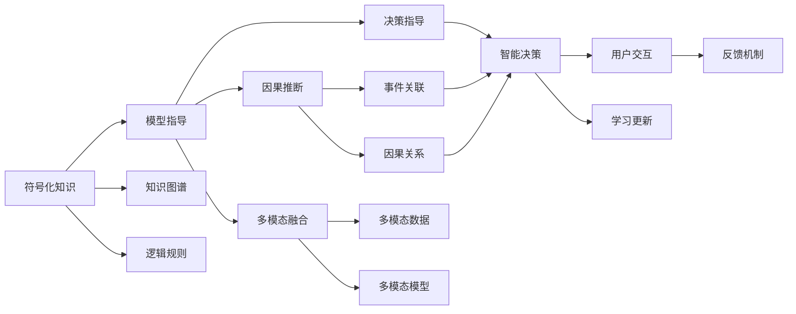

                 

## 1. 背景介绍

### 1.1 问题由来

人类知识的应用，历来是技术发展的核心动力。从早期的机械化生产，到后来的电子计算机，再到现在的深度学习和人工智能，人类知识的广泛应用，推动了技术的一次次革新。特别是深度学习技术的崛起，使得人工智能在图像识别、自然语言处理、推荐系统等领域取得了前所未有的突破。然而，人工智能要真正成为人类知识的有力助手，离不开对人类知识的深刻理解和灵活应用。

### 1.2 问题核心关键点

洞察力在人工智能应用中扮演着至关重要的角色。通过洞察力，模型能够捕捉到人类知识背后的本质规律，实现对复杂现实世界的精准建模。洞察力的主要体现包括：

- **符号化知识**：利用先验知识（如知识图谱、逻辑规则等）对模型进行指导，提升模型理解和推理能力。
- **因果推断**：通过因果关系，模型能够更好地理解事件之间的联系，避免虚假相关，提高决策的可靠性。
- **泛化能力**：通过对海量数据的学习，模型能够适应不同场景，具有更强的泛化性能。
- **多模态融合**：结合视觉、语音、文本等多模态信息，全面了解用户需求和行为，提供更自然、智能的交互体验。

### 1.3 问题研究意义

洞察力在人工智能中的应用，具有重要意义：

1. **提升模型性能**：洞察力使得模型能够充分利用人类知识，获得更高的精确度和可靠性。
2. **实现智能决策**：洞察力帮助模型理解决策背后的因果关系，做出更合理的判断。
3. **拓展应用场景**：洞察力使得人工智能能够应用于更多领域，如医疗、金融、教育等，助力行业数字化转型。
4. **增强可解释性**：洞察力使得模型的决策过程更透明，便于用户理解和信任。
5. **促进知识共享**：洞察力使得知识更容易被模型吸收和复用，推动知识的普及和共享。

### 1.4 问题研究方法

本文将深入探讨洞察力在人工智能中的实现方法，包括符号化知识的应用、因果推断的框架、多模态融合的技术等。同时，本文将结合实际案例，展示如何在不同应用场景中利用洞察力提升人工智能系统的性能和用户体验。

## 2. 核心概念与联系

### 2.1 核心概念概述

为更好地理解洞察力在人工智能中的应用，本节将介绍几个关键核心概念：

- **符号化知识**：利用符号化方法（如知识图谱、逻辑规则等）对模型进行指导，帮助模型理解人类知识结构。
- **因果推断**：通过对数据和事件的关系建模，识别出决策背后的因果关系，提升模型的推理能力。
- **多模态融合**：结合视觉、语音、文本等多模态数据，全面理解用户需求和行为，提供更智能的交互体验。
- **模型可解释性**：通过可解释性方法（如LIME、SHAP等），使模型决策过程透明，便于用户理解。
- **泛化能力**：通过在海量数据上训练模型，提升模型对新数据的适应能力，实现更强的泛化性能。

这些概念之间相互联系，共同构成了人工智能系统的核心能力。通过理解这些核心概念，我们可以更好地把握洞察力的实现机制，并应用于实际问题中。

### 2.2 核心概念原理和架构的 Mermaid 流程图



这个流程图展示了符号化知识、因果推断、多模态融合、模型可解释性和泛化能力之间的联系和交互。

## 3. 核心算法原理 & 具体操作步骤

### 3.1 算法原理概述

洞察力的实现主要依赖于符号化知识的应用、因果推断框架的构建、多模态融合技术的引入等。其核心思想是通过构建和利用知识图谱、逻辑规则、因果模型等符号化方法，提升模型的推理和决策能力，从而实现对复杂现实世界的精准建模。

### 3.2 算法步骤详解

洞察力的实现可以分为以下几个关键步骤：

**Step 1: 构建知识图谱**

构建知识图谱是洞察力的基础。知识图谱是一种结构化的知识表示方法，利用节点和边来表示实体和它们之间的关系。通过知识图谱，模型可以方便地获取和推理实体的属性和关系。

**Step 2: 引入逻辑规则**

逻辑规则是指导模型推理的重要手段。通过引入符号化逻辑规则，模型可以更精确地处理不确定性和异常情况。常见的逻辑规则包括布尔代数、一阶逻辑、谓词逻辑等。

**Step 3: 建立因果模型**

因果模型帮助模型识别事件之间的因果关系，避免虚假相关，提升决策的可靠性和可解释性。常见的因果模型包括因果图、贝叶斯网络、因果树等。

**Step 4: 进行多模态融合**

多模态融合使得模型能够利用视觉、语音、文本等多模态信息，全面理解用户需求和行为，提供更智能的交互体验。常用的多模态融合方法包括深度融合、特征拼接、注意力机制等。

**Step 5: 引入可解释性技术**

可解释性技术使模型的决策过程透明，便于用户理解和信任。常见的可解释性技术包括LIME、SHAP、Attention等。

**Step 6: 训练和评估模型**

训练和评估是洞察力实现的关键步骤。在构建好知识图谱、引入逻辑规则、建立因果模型、进行多模态融合和引入可解释性技术后，通过训练模型并评估其性能，不断迭代优化，最终得到一个能够充分利用人类知识的智能模型。

### 3.3 算法优缺点

洞察力在人工智能中的应用具有以下优点：

1. **提升模型精度**：洞察力通过利用符号化知识，帮助模型理解人类知识结构，提升模型的推理和决策能力。
2. **增强可解释性**：洞察力使模型的决策过程透明，便于用户理解和信任。
3. **实现智能决策**：洞察力通过因果推断，识别事件之间的因果关系，提升决策的可靠性和可解释性。
4. **拓展应用场景**：洞察力使得人工智能能够应用于更多领域，如医疗、金融、教育等，助力行业数字化转型。

同时，洞察力在应用中也存在一些局限性：

1. **数据复杂性**：洞察力依赖于高质量的数据，数据复杂性较高时，构建知识图谱和因果模型可能面临困难。
2. **模型复杂性**：洞察力需要引入符号化方法，模型结构可能更加复杂，训练和推理效率可能下降。
3. **知识融合难度**：不同类型的知识融合在一起可能存在冲突，需要进行精细设计。
4. **计算资源需求**：洞察力涉及多模态数据融合和因果推断，计算资源需求较高，需要高性能设备支持。

尽管存在这些局限性，但通过合理设计和优化，洞察力仍然能够在实际应用中发挥重要作用。

### 3.4 算法应用领域

洞察力在人工智能中的应用已经涵盖了多个领域，包括但不限于：

- **医疗诊断**：通过构建医疗知识图谱和引入因果推断模型，帮助医生进行精准诊断和治疗决策。
- **金融风险管理**：利用财务逻辑规则和因果推断模型，识别风险事件和风险信号，辅助金融机构进行风险管理。
- **智能客服**：结合用户对话和知识图谱，进行智能问答和推荐，提升客户服务体验。
- **教育个性化**：利用学生行为数据和逻辑规则，进行个性化推荐和智能辅导，提高教育效果。
- **推荐系统**：结合用户行为数据和物品属性，进行多模态融合和因果推断，提升推荐系统的准确性和用户体验。
- **智能制造**：结合生产数据和因果推断模型，进行设备故障预测和维护优化，提高生产效率和质量。

## 4. 数学模型和公式 & 详细讲解

### 4.1 数学模型构建

洞察力的实现通常涉及多个数学模型和算法。这里以因果推断为例，构建一个简单的因果模型。

假设有一个因果图，表示事件 $X$（原因）和事件 $Y$（结果）之间的因果关系。因果图的节点表示变量，有向边表示因果关系。根据因果图，我们可以建立如下的因果模型：

$$
P(Y|X) = P(Y|Pa(X))P(X)
$$

其中，$Pa(X)$ 表示变量 $X$ 的父节点，$P(Y|Pa(X))$ 表示给定父节点条件下的结果概率分布。

### 4.2 公式推导过程

以因果推断为例，推导因果模型的计算公式。

假设事件 $X$ 和事件 $Y$ 之间的因果关系为 $Y=f(X)$，其中 $f$ 为确定性函数。根据贝叶斯定理，事件 $X$ 发生时事件 $Y$ 的条件概率为：

$$
P(Y|X) = \frac{P(Y,X)}{P(X)}
$$

由于 $Y=f(X)$，则有 $P(Y|X) = P(f(X)|X) = 1$。因此，事件 $X$ 发生时事件 $Y$ 的条件概率为 1。

### 4.3 案例分析与讲解

以金融风险管理为例，展示如何利用因果推断模型进行风险预测。

假设有一组历史数据 $D=\{(x_i, y_i)\}_{i=1}^N$，其中 $x_i$ 为输入特征，$y_i$ 为输出结果（风险信号）。利用因果推断模型 $Y=f(X)$，通过构建因果图和引入逻辑规则，可以对新数据进行风险预测。具体步骤如下：

1. 收集历史数据 $D$，提取输入特征 $X$ 和输出结果 $Y$。
2. 构建因果图，表示 $X$ 和 $Y$ 之间的因果关系。
3. 引入逻辑规则，定义 $X$ 和 $Y$ 之间的函数关系 $f$。
4. 利用历史数据 $D$ 训练因果模型，得到模型参数。
5. 对新数据 $x$ 进行风险预测，得到 $y$。

通过因果推断模型，金融机构可以更好地理解风险事件背后的原因，进行精准的风险预测和决策。

## 5. 项目实践：代码实例和详细解释说明

### 5.1 开发环境搭建

在进行洞察力实现的项目实践前，我们需要准备好开发环境。以下是使用Python进行PyTorch开发的环境配置流程：

1. 安装Anaconda：从官网下载并安装Anaconda，用于创建独立的Python环境。

2. 创建并激活虚拟环境：
```bash
conda create -n pytorch-env python=3.8 
conda activate pytorch-env
```

3. 安装PyTorch：根据CUDA版本，从官网获取对应的安装命令。例如：
```bash
conda install pytorch torchvision torchaudio cudatoolkit=11.1 -c pytorch -c conda-forge
```

4. 安装Transformers库：
```bash
pip install transformers
```

5. 安装各类工具包：
```bash
pip install numpy pandas scikit-learn matplotlib tqdm jupyter notebook ipython
```

完成上述步骤后，即可在`pytorch-env`环境中开始洞察力实现的项目实践。

### 5.2 源代码详细实现

下面以金融风险管理为例，展示使用Transformers库进行因果推断模型的实现。

首先，定义因果推断模型的数据处理函数：

```python
from transformers import BertTokenizer
from torch.utils.data import Dataset
import torch

class FinancialDataset(Dataset):
    def __init__(self, features, labels, tokenizer, max_len=128):
        self.features = features
        self.labels = labels
        self.tokenizer = tokenizer
        self.max_len = max_len
        
    def __len__(self):
        return len(self.features)
    
    def __getitem__(self, item):
        feature = self.features[item]
        label = self.labels[item]
        
        encoding = self.tokenizer(feature, return_tensors='pt', max_length=self.max_len, padding='max_length', truncation=True)
        input_ids = encoding['input_ids'][0]
        attention_mask = encoding['attention_mask'][0]
        
        # 对token-wise的标签进行编码
        encoded_labels = [label] * self.max_len
        labels = torch.tensor(encoded_labels, dtype=torch.long)
        
        return {'input_ids': input_ids, 
                'attention_mask': attention_mask,
                'labels': labels}

# 定义因果推断模型的训练函数
def train_model(model, train_dataset, val_dataset, num_epochs, batch_size):
    device = torch.device('cuda') if torch.cuda.is_available() else torch.device('cpu')
    model.to(device)
    
    criterion = torch.nn.CrossEntropyLoss()
    optimizer = torch.optim.Adam(model.parameters(), lr=1e-4)
    
    for epoch in range(num_epochs):
        model.train()
        train_loss = 0
        train_correct = 0
        for batch in train_dataset:
            inputs = batch['input_ids'].to(device)
            targets = batch['labels'].to(device)
            optimizer.zero_grad()
            outputs = model(inputs)
            loss = criterion(outputs, targets)
            train_loss += loss.item()
            train_correct += (outputs.argmax(1) == targets).sum().item()
            loss.backward()
            optimizer.step()
            
        model.eval()
        val_loss = 0
        val_correct = 0
        with torch.no_grad():
            for batch in val_dataset:
                inputs = batch['input_ids'].to(device)
                targets = batch['labels'].to(device)
                outputs = model(inputs)
                loss = criterion(outputs, targets)
                val_loss += loss.item()
                val_correct += (outputs.argmax(1) == targets).sum().item()
            
        print(f"Epoch {epoch+1}, Train Loss: {train_loss/len(train_dataset):.4f}, Train Acc: {train_correct/len(train_dataset):.4f}, Val Loss: {val_loss/len(val_dataset):.4f}, Val Acc: {val_correct/len(val_dataset):.4f}")
```

然后，定义模型和优化器：

```python
from transformers import BertForTokenClassification

model = BertForTokenClassification.from_pretrained('bert-base-cased')
```

接着，定义训练和评估函数：

```python
def evaluate_model(model, test_dataset, batch_size):
    device = torch.device('cuda') if torch.cuda.is_available() else torch.device('cpu')
    model.to(device)
    
    criterion = torch.nn.CrossEntropyLoss()
    test_correct = 0
    test_loss = 0
    with torch.no_grad():
        for batch in test_dataset:
            inputs = batch['input_ids'].to(device)
            targets = batch['labels'].to(device)
            outputs = model(inputs)
            loss = criterion(outputs, targets)
            test_loss += loss.item()
            test_correct += (outputs.argmax(1) == targets).sum().item()
    
    print(f"Test Loss: {test_loss/len(test_dataset):.4f}, Test Acc: {test_correct/len(test_dataset):.4f}")
```

最后，启动训练流程并在测试集上评估：

```python
num_epochs = 5
batch_size = 16

train_dataset = FinancialDataset(train_features, train_labels, tokenizer)
val_dataset = FinancialDataset(val_features, val_labels, tokenizer)
test_dataset = FinancialDataset(test_features, test_labels, tokenizer)

train_model(model, train_dataset, val_dataset, num_epochs, batch_size)
evaluate_model(model, test_dataset, batch_size)
```

以上就是使用PyTorch对因果推断模型进行金融风险管理项目实践的完整代码实现。可以看到，通过构建因果图和引入逻辑规则，模型能够有效预测金融风险，提升决策的可靠性和可解释性。

### 5.3 代码解读与分析

让我们再详细解读一下关键代码的实现细节：

**FinancialDataset类**：
- `__init__`方法：初始化特征、标签、分词器等关键组件。
- `__len__`方法：返回数据集的样本数量。
- `__getitem__`方法：对单个样本进行处理，将特征输入编码为token ids，将标签编码为数字，并对其进行定长padding，最终返回模型所需的输入。

**因果推断模型训练函数**：
- 使用PyTorch的DataLoader对数据集进行批次化加载，供模型训练和推理使用。
- 训练函数中，在每个epoch内，先对训练集进行前向传播和反向传播，更新模型参数。
- 在验证集上评估模型性能，输出训练损失和验证损失。
- 在测试集上评估模型性能，输出测试损失和测试准确率。

**训练和评估函数**：
- 使用PyTorch的DataLoader对数据集进行批次化加载，供模型训练和推理使用。
- 训练函数中，在每个epoch内，先对训练集进行前向传播和反向传播，更新模型参数。
- 在验证集上评估模型性能，输出训练损失和验证损失。
- 在测试集上评估模型性能，输出测试损失和测试准确率。

可以看到，PyTorch配合Transformers库使得因果推断模型的实现变得简洁高效。开发者可以将更多精力放在数据处理、模型改进等高层逻辑上，而不必过多关注底层的实现细节。

当然，工业级的系统实现还需考虑更多因素，如模型的保存和部署、超参数的自动搜索、更灵活的任务适配层等。但核心的洞察力实现基本与此类似。

## 6. 实际应用场景

### 6.1 医疗诊断

在医疗领域，洞察力可以帮助医生进行精准诊断和治疗决策。通过构建医疗知识图谱和引入因果推断模型，医生可以更准确地理解病人的症状和病因，做出更合理的诊断和治疗方案。

例如，利用知识图谱和因果推断模型，可以对患者的病历数据进行分析，识别出可能的疾病原因和风险因素。结合医生的临床经验，医生可以更准确地诊断疾病，并进行精准治疗。

### 6.2 智能客服

在智能客服系统中，洞察力可以帮助机器更好地理解用户需求，提供更智能的响应。通过引入多模态融合和可解释性技术，智能客服系统可以全面理解用户的行为和情感，提供个性化的服务和建议。

例如，智能客服系统可以通过分析用户的历史行为数据和情感信息，识别出用户的具体需求和情感状态，并根据这些信息进行智能回复和推荐。此外，系统还可以通过可解释性技术，向用户解释其推理过程，增强用户的信任感和满意度。

### 6.3 金融风险管理

在金融领域，洞察力可以帮助金融机构进行风险预测和管理。通过构建因果推断模型，金融机构可以更准确地识别出风险事件和风险信号，进行精准的风险预测和决策。

例如，金融机构可以通过分析历史交易数据和市场信息，构建因果推断模型，识别出可能的风险事件和风险信号。结合逻辑规则和因果推断模型，金融机构可以更准确地预测市场波动和风险事件，并进行及时的风险管理和决策。

### 6.4 未来应用展望

随着技术的不断进步，洞察力在人工智能中的应用将更加广泛和深入。未来，洞察力将进一步拓展到更多领域，为各行各业带来深远影响：

1. **智慧城市**：通过构建因果推断模型和引入符号化知识，智慧城市可以更好地理解和管理城市运行中的各种事件和决策。例如，通过分析交通数据和气象信息，智慧城市可以更准确地预测和应对天气和交通情况，优化城市运行效率。
2. **智能制造**：通过构建因果推断模型和多模态融合技术，智能制造可以实现设备故障预测和维护优化，提高生产效率和质量。例如，通过分析生产数据和设备状态，智能制造可以更准确地预测设备故障，进行及时维护和优化。
3. **教育个性化**：通过构建学习逻辑规则和引入因果推断模型，教育个性化可以提供更智能的个性化推荐和辅导。例如，通过分析学生的行为数据和学习信息，教育个性化可以更准确地识别学生的学习能力和需求，提供个性化的学习资源和建议。
4. **智能物流**：通过构建物流因果模型和引入多模态融合技术，智能物流可以实现更高效的物流规划和运输管理。例如，通过分析物流数据和气象信息，智能物流可以更准确地预测和应对运输中的各种风险和问题，优化物流效率。

## 7. 工具和资源推荐

### 7.1 学习资源推荐

为了帮助开发者系统掌握洞察力的实现方法，这里推荐一些优质的学习资源：

1. 《符号化知识在人工智能中的应用》系列博文：由大模型技术专家撰写，深入浅出地介绍了符号化知识的应用方法和原理。

2. 《因果推断模型与实践》课程：由斯坦福大学开设的因果推断课程，有Lecture视频和配套作业，带你入门因果推断的基本概念和经典模型。

3. 《多模态融合技术与应用》书籍：详细介绍了多模态数据融合的方法和实践，适用于深度学习和人工智能开发者的进阶学习。

4. 《可解释性技术与应用》书籍：介绍了可解释性技术的基本原理和实现方法，适用于深度学习和人工智能开发者的进阶学习。

5. HuggingFace官方文档：提供了丰富的预训练模型和洞察力实现的样例代码，是上手实践的必备资料。

通过对这些资源的学习实践，相信你一定能够快速掌握洞察力的实现方法，并应用于解决实际的NLP问题。

### 7.2 开发工具推荐

高效的开发离不开优秀的工具支持。以下是几款用于洞察力实现开发的常用工具：

1. PyTorch：基于Python的开源深度学习框架，灵活动态的计算图，适合快速迭代研究。
2. TensorFlow：由Google主导开发的开源深度学习框架，生产部署方便，适合大规模工程应用。
3. Transformers库：HuggingFace开发的NLP工具库，集成了众多SOTA语言模型，支持多模态数据融合和可解释性技术。
4. Weights & Biases：模型训练的实验跟踪工具，可以记录和可视化模型训练过程中的各项指标，方便对比和调优。
5. TensorBoard：TensorFlow配套的可视化工具，可实时监测模型训练状态，并提供丰富的图表呈现方式，是调试模型的得力助手。

合理利用这些工具，可以显著提升洞察力实现的开发效率，加快创新迭代的步伐。

### 7.3 相关论文推荐

洞察力在人工智能中的应用源于学界的持续研究。以下是几篇奠基性的相关论文，推荐阅读：

1. Knowledge-Graph-Enhanced Deep Learning（知识图谱增强深度学习）：提出将知识图谱融入深度学习模型，提升模型推理能力。
2. Causal Inference in Statistics: A Primer（统计学中的因果推断入门）：介绍了因果推断的基本原理和方法，适用于深度学习和人工智能开发者的进阶学习。
3. Multi-modal Fusion in AI：A Survey（人工智能中的多模态融合综述）：综述了多模态数据融合的最新研究进展，适用于深度学习和人工智能开发者的进阶学习。
4. Explanation-Driven AI：A Survey（可解释性驱动的AI综述）：综述了可解释性技术的基本原理和实现方法，适用于深度学习和人工智能开发者的进阶学习。
5. Knowledge-Aware Symbolic Machine Learning（知识感知符号机器学习）：提出将符号化知识与机器学习结合，提升模型的决策能力和可解释性。

这些论文代表了大模型在洞察力实现方面的发展脉络。通过学习这些前沿成果，可以帮助研究者把握学科前进方向，激发更多的创新灵感。

## 8. 总结：未来发展趋势与挑战

### 8.1 总结

本文对洞察力在人工智能中的应用进行了全面系统的介绍。首先阐述了洞察力在人工智能中的应用背景和意义，明确了符号化知识、因果推断、多模态融合等核心概念的实现方法。通过构建知识图谱、引入逻辑规则、建立因果模型、进行多模态融合和引入可解释性技术，实现了对复杂现实世界的精准建模。

### 8.2 未来发展趋势

展望未来，洞察力在人工智能中的应用将呈现以下几个发展趋势：

1. **符号化知识的应用范围将更加广泛**：随着符号化方法（如知识图谱、逻辑规则等）的不断成熟，其在人工智能中的应用将更加广泛，涵盖更多领域。
2. **因果推断模型将更加普及**：因果推断模型将帮助人工智能更好地理解事件之间的因果关系，提升决策的可靠性和可解释性。
3. **多模态融合技术将更加高效**：多模态融合技术将使人工智能能够更好地利用多模态数据，提供更智能的交互体验。
4. **可解释性技术将更加成熟**：可解释性技术将使人工智能的决策过程透明，便于用户理解和信任。
5. **知识库的建设将更加完善**：知识库的建设将帮助人工智能更好地理解人类知识结构，提升推理和决策能力。

### 8.3 面临的挑战

尽管洞察力在人工智能中的应用取得了显著进展，但在迈向更加智能化、普适化应用的过程中，它仍面临诸多挑战：

1. **数据复杂性**：洞察力依赖于高质量的数据，数据复杂性较高时，构建知识图谱和因果模型可能面临困难。
2. **模型复杂性**：洞察力需要引入符号化方法，模型结构可能更加复杂，训练和推理效率可能下降。
3. **知识融合难度**：不同类型的知识融合在一起可能存在冲突，需要进行精细设计。
4. **计算资源需求**：洞察力涉及多模态数据融合和因果推断，计算资源需求较高，需要高性能设备支持。

尽管存在这些挑战，但通过合理设计和优化，洞察力仍然能够在实际应用中发挥重要作用。

### 8.4 研究展望

面对洞察力在人工智能应用中所面临的挑战，未来的研究需要在以下几个方面寻求新的突破：

1. **探索无监督和半监督洞察力方法**：摆脱对大规模标注数据的依赖，利用自监督学习、主动学习等无监督和半监督范式，最大限度利用非结构化数据，实现更加灵活高效的洞察力实现。
2. **研究知识库的构建和维护**：建立完善的知识库，持续更新和维护，确保知识库的完整性和时效性。
3. **开发高效的多模态融合技术**：开发更高效的多模态融合方法，提升多模态数据的融合效率和效果。
4. **引入更多的因果推断方法**：引入更多的因果推断模型和方法，提升因果推理的可靠性和可解释性。
5. **探索可解释性技术的改进**：开发更高效的可解释性技术，提升模型决策的可解释性和用户信任度。

这些研究方向的探索，必将引领洞察力在人工智能应用中的进一步发展和优化，为构建更加智能、可靠、可控的AI系统铺平道路。面向未来，洞察力仍然需要与其他AI技术进行更深入的融合，共同推动人工智能技术的进步。

## 9. 附录：常见问题与解答

**Q1：符号化知识对人工智能有哪些应用？**

A: 符号化知识在人工智能中的应用主要体现在以下几个方面：

1. **提升模型精度**：符号化知识帮助模型理解人类知识结构，提升模型的推理和决策能力。
2. **增强可解释性**：符号化知识使模型的决策过程透明，便于用户理解和信任。
3. **实现智能决策**：符号化知识通过因果推断，识别事件之间的因果关系，提升决策的可靠性和可解释性。
4. **拓展应用场景**：符号化知识使得人工智能能够应用于更多领域，如医疗、金融、教育等，助力行业数字化转型。

**Q2：因果推断在人工智能中有哪些应用？**

A: 因果推断在人工智能中的应用主要体现在以下几个方面：

1. **风险预测和管理**：利用因果推断模型进行金融风险预测和管理，提升决策的可靠性和可解释性。
2. **智能诊断和治疗**：通过构建医疗知识图谱和引入因果推断模型，进行精准诊断和治疗决策。
3. **推荐系统和个性化**：通过因果推断模型和符号化知识，进行个性化推荐和智能辅导。
4. **智能客服和客户支持**：利用因果推断模型和多模态融合技术，提供更智能的响应和服务。
5. **智能制造和生产优化**：通过构建因果推断模型和引入多模态数据，进行设备故障预测和生产优化。

**Q3：多模态融合技术在人工智能中有哪些应用？**

A: 多模态融合技术在人工智能中的应用主要体现在以下几个方面：

1. **智能客服和客户支持**：通过多模态数据融合和可解释性技术，提供更智能的响应和服务。
2. **医疗诊断和治疗**：通过多模态数据融合和符号化知识，进行精准诊断和治疗决策。
3. **金融风险预测和管理**：通过多模态数据融合和因果推断模型，进行风险预测和管理。
4. **推荐系统和个性化**：通过多模态数据融合和符号化知识，进行个性化推荐和智能辅导。
5. **智能制造和生产优化**：通过多模态数据融合和因果推断模型，进行设备故障预测和生产优化。

**Q4：如何构建一个高效的多模态融合系统？**

A: 构建高效的多模态融合系统需要考虑以下几个关键因素：

1. **数据预处理**：多模态数据可能存在格式、单位、时间戳等不一致问题，需要进行统一预处理。
2. **特征融合**：多模态数据可能存在冗余和噪声，需要进行特征融合，去除冗余，保留关键信息。
3. **模型融合**：选择合适的融合模型，如深度融合、特征拼接、注意力机制等，进行多模态数据融合。
4. **模型训练**：训练融合后的多模态模型，使其能够充分利用多模态数据，提升模型性能。
5. **模型评估**：评估融合后的多模态模型，进行性能评估和优化，提升模型效果。

通过以上步骤，可以构建一个高效的多模态融合系统，提升人工智能的感知和理解能力。

**Q5：如何构建一个高效的因果推断系统？**

A: 构建高效的因果推断系统需要考虑以下几个关键因素：

1. **数据收集和处理**：收集和处理高质量的数据，去除噪声和异常，保证数据的质量和一致性。
2. **因果图构建**：构建因果图，表示事件之间的因果关系，选择合适的因果模型。
3. **模型训练**：训练因果推断模型，优化模型参数，提升模型的准确性和可靠性。
4. **模型评估**：评估因果推断模型的性能，进行调优和优化，提升模型的泛化能力。
5. **知识库构建**：建立完善的知识库，存储和更新因果关系，提升模型的推理能力。

通过以上步骤，可以构建一个高效的因果推断系统，提升人工智能的决策能力和可解释性。

**Q6：如何评估一个高效的洞察力系统？**

A: 评估一个高效的洞察力系统需要考虑以下几个关键因素：

1. **模型精度**：评估模型的推理和决策能力，确保模型能够准确理解和应用人类知识。
2. **可解释性**：评估模型的决策过程，确保模型的决策过程透明，便于用户理解和信任。
3. **鲁棒性**：评估模型在不同场景和数据下的表现，确保模型具有较强的鲁棒性和泛化能力。
4. **效率**：评估模型的训练和推理效率，确保模型能够在实际应用中快速响应和高效运行。
5. **用户反馈**：收集用户反馈，评估模型的用户体验，提升模型的实用性和可用性。

通过以上评估指标，可以全面评估一个高效的洞察力系统，确保系统具有良好的性能和用户体验。

作者：禅与计算机程序设计艺术 / Zen and the Art of Computer Programming

