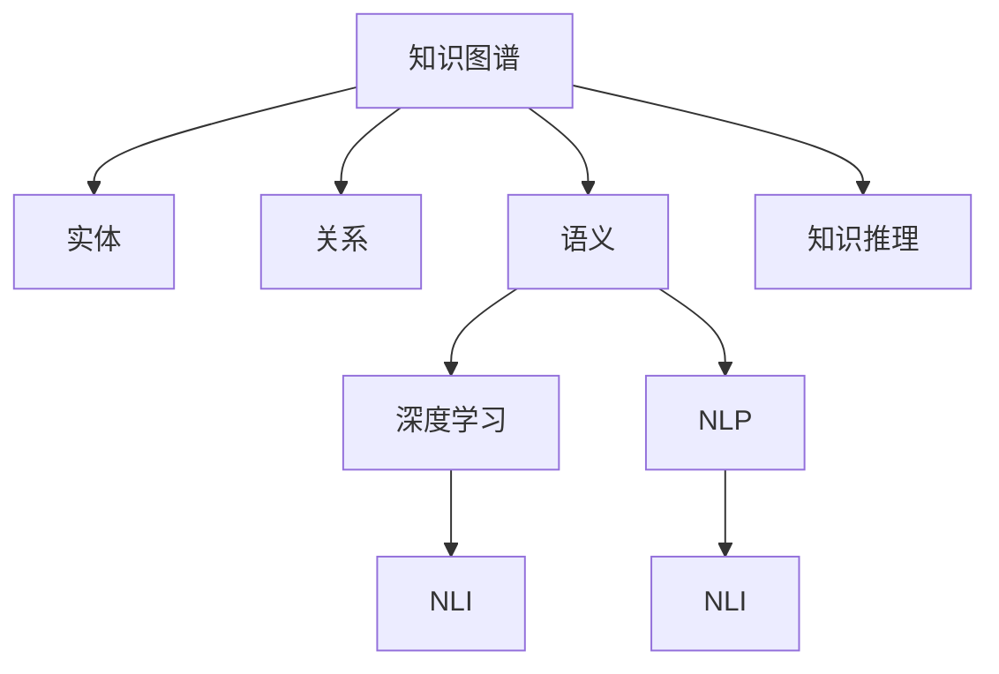

                 

# 人类知识的未来发展：洞察力的关键作用

> 关键词：知识图谱, 语义理解, 自然语言处理, 深度学习, 人工智能, 计算机科学, 洞察力

## 1. 背景介绍

### 1.1 问题由来

在信息爆炸的时代，人类知识量呈指数级增长，而个体对于知识的吸收、处理和应用能力有限。如何高效地管理和利用这些知识，使其服务于更广泛的应用场景，成为当今科技和社会发展的重大挑战。基于深度学习和自然语言处理的知识图谱技术，为这一问题提供了创新的解决方案，通过智能化和自动化手段，挖掘和利用知识背后的洞察力，帮助人类更好地理解世界，做出更明智的决策。

### 1.2 问题核心关键点

知识图谱技术通过构建实体-关系型结构化的知识库，结合深度学习和自然语言处理技术，实现从文本数据中抽取和关联知识，为人类提供强大的洞察力。其核心在于：

1. **知识抽取与关联**：从海量文本数据中抽取实体和关系，构建关系网络，形成结构化的知识库。
2. **语义理解**：利用深度学习模型理解自然语言，提取语义信息，实现跨文本、跨领域的知识关联。
3. **推理与推断**：基于知识图谱中的结构和数据，进行逻辑推理和概率推断，提供更深层次的洞察。

这一过程不仅需要技术手段的支持，还需跨领域知识的融合和应用。因此，研究知识图谱技术的背后逻辑及其应用前景，对未来知识的开发、管理和应用具有重要意义。

### 1.3 问题研究意义

探索知识图谱技术，对提升知识的利用效率、推动科学发现、支持决策制定等方面具有重要意义：

1. **科学发现加速**：通过跨领域知识的深度融合，促进学科交叉，加速新理论和模型的发现。
2. **决策支持强化**：提供结构化的洞察力，帮助决策者快速获取关键信息，做出更明智的判断。
3. **知识管理优化**：自动化处理和存储知识，减轻人工负担，提升知识管理效率。
4. **信息共享与协作**：跨组织、跨行业的知识共享，促进信息对称和协作创新。

## 2. 核心概念与联系

### 2.1 核心概念概述

为更好地理解知识图谱技术及其应用，本节将介绍几个密切相关的核心概念：

- **知识图谱(Knowledge Graph)**：一种表示实体与实体之间关系的结构化知识库，用于存储和检索知识。
- **实体(Entity)**：指具体的事物、概念或抽象对象，如人名、地点、组织、时间等。
- **关系(Relation)**：指实体之间的作用或联系，如“属于”、“交互”、“相似”等。
- **语义(Semantic)**：指语言背后的意义和信息，知识图谱中的语义理解旨在抽取和关联实体的更深层次含义。
- **深度学习(Deep Learning)**：一种基于神经网络的学习方法，通过多层抽象特征提取，实现复杂的模式识别和推理任务。
- **自然语言处理(Natural Language Processing, NLP)**：利用计算机处理和理解人类语言的技术，涉及文本分析、文本生成、语义理解等多个方面。
- **自然语言推理(Natural Language Inference, NLI)**：判断自然语言文本的语义关系，如蕴含、矛盾、一致性等。
- **知识推理(Knowledge Reasoning)**：在知识图谱中，通过逻辑推理和概率推断，获取新的知识或验证已知知识的正确性。

这些核心概念之间的逻辑关系可以通过以下Mermaid流程图来展示：



这个流程图展示出知识图谱技术的核心组件及其相互关系：

1. 知识图谱通过实体和关系构建知识库。
2. 深度学习用于语义理解，从文本中提取和关联实体的语义信息。
3. NLP技术处理自然语言文本，抽取文本中的实体和关系。
4. NLI用于判断文本的语义关系，验证知识的正确性。
5. 知识推理在知识图谱中实现逻辑推理和概率推断，提供更深层次的洞察力。

## 3. 核心算法原理 & 具体操作步骤
### 3.1 算法原理概述

知识图谱技术的核心在于如何高效地从文本数据中抽取和关联知识，构建结构化的知识库。其核心算法包括实体抽取、关系抽取、语义理解、知识推理等。这些算法通过深度学习和自然语言处理技术实现，形成一个完整的知识图谱构建流程。

**核心算法**：

1. **实体抽取(Entity Extraction)**：从文本中识别出具有特定含义的实体。
2. **关系抽取(Relation Extraction)**：识别文本中实体之间的关系。
3. **语义理解(Semantic Understanding)**：利用深度学习模型理解文本背后的语义信息，进行实体的分类和关系的映射。
4. **知识推理(Knowledge Reasoning)**：在知识图谱中，通过逻辑推理和概率推断，获取新的知识或验证已知知识的正确性。

### 3.2 算法步骤详解

知识图谱技术的实现过程大致分为以下几个步骤：

1. **数据预处理**：清洗和整理原始数据，包括去除噪声、处理缺失值等。
2. **实体识别与抽取**：使用命名实体识别(NER)技术从文本中识别出实体，并抽取其类型和属性。
3. **关系抽取**：利用句法分析、依存关系分析等技术，抽取实体之间的关系。
4. **语义理解**：使用深度学习模型，如BERT、GPT等，理解文本中的语义信息，抽取实体之间的深层关系。
5. **知识图谱构建**：将抽取出的实体和关系构建为结构化的知识库，形成知识图谱。
6. **知识推理**：在知识图谱中进行逻辑推理和概率推断，验证知识图谱的正确性，获取新的知识。

### 3.3 算法优缺点

知识图谱技术具有以下优点：

1. **结构化知识库**：结构化的知识库便于存储、检索和应用，为决策提供结构化支持。
2. **深度语义理解**：深度学习模型能够理解自然语言背后的语义信息，提供深层次的洞察力。
3. **跨领域知识关联**：通过知识图谱，实现跨领域、跨文本的知识关联，促进学科交叉和知识创新。
4. **自动化处理**：自动化处理和存储知识，减轻人工负担，提升效率。

同时，该技术也存在一定的局限性：

1. **数据依赖性高**：构建知识图谱需要大量标注数据，标注成本较高。
2. **知识图谱构建复杂**：构建高质量的知识图谱需要多轮迭代和人工干预，过程复杂。
3. **动态知识更新**：知识图谱需要不断更新以反映最新的知识变化，更新过程复杂且耗时。
4. **模型复杂度**：深度学习模型参数量大，计算复杂度高，硬件要求高。

尽管存在这些局限性，但就目前而言，知识图谱技术仍然是大规模知识管理和应用的重要手段。未来相关研究的重点在于如何进一步降低构建知识图谱的门槛，提高知识图谱的动态更新能力，同时兼顾可解释性和模型复杂度等因素。

### 3.4 算法应用领域

知识图谱技术已经在多个领域得到了广泛应用，例如：

1. **医疗健康**：构建医疗知识图谱，支持疾病诊断、治疗方案推荐等。
2. **金融投资**：构建金融知识图谱，支持投资风险评估、市场预测等。
3. **电子商务**：构建电商知识图谱，支持商品推荐、用户画像分析等。
4. **智能客服**：构建客服知识图谱，支持智能问答、问题分类等。
5. **智能制造**：构建工业知识图谱，支持设备维护、生产调度等。

除了上述这些经典应用外，知识图谱技术还被创新性地应用到更多场景中，如可控知识图谱、用户行为预测、新闻推荐等，为知识图谱技术带来了新的应用前景。

## 4. 数学模型和公式 & 详细讲解 & 举例说明

### 4.1 数学模型构建

本节将使用数学语言对知识图谱技术进行更加严格的刻画。

记知识图谱中的实体集合为 $E=\{e_1,e_2,...,e_n\}$，关系集合为 $R=\{r_1,r_2,...,r_m\}$，其中 $e_i$ 和 $r_j$ 分别表示第 $i$ 个实体和第 $j$ 个关系。设知识图谱中的知识三元组为 $K=\{(e_i,r_j,e_k)\}$，表示实体 $e_i$ 和 $e_k$ 之间存在关系 $r_j$。

知识图谱构建的数学模型可以表示为：

$$
\hat{K} = \mathop{\arg\min}_{K} \mathcal{L}(K)
$$

其中 $\mathcal{L}$ 为损失函数，用于衡量构建的知识图谱与真实知识图谱之间的差异。

### 4.2 公式推导过程

以下我们以医疗知识图谱为例，推导实体抽取、关系抽取和语义理解的数学公式。

假设医疗文本数据为 $D=\{d_i\}_{i=1}^N$，其中每个文本 $d_i$ 包含多个句子 $s_{i,j}$。设实体抽取模型为 $M_E$，关系抽取模型为 $M_R$。

**实体抽取模型**：使用BERT等深度学习模型，对每个句子 $s_{i,j}$ 进行实体识别，输出实体列表 $E_i=\{e_{i,j}\}_{j=1}^n$。

**关系抽取模型**：使用序列标注模型，对每个句子 $s_{i,j}$ 进行关系抽取，输出关系列表 $R_i=\{r_{i,j}\}_{j=1}^m$。

**语义理解模型**：使用BERT等深度学习模型，对每个句子 $s_{i,j}$ 进行语义理解，输出实体的分类标签 $L_i=\{l_{i,j}\}_{j=1}^n$ 和关系的映射 $R_i=\{r_{i,j}\}_{j=1}^m$。

通过上述步骤，即可构建知识图谱 $K=\{(e_{i,j},r_{i,j},e_{k,j})\}_{j=1}^m$，其中 $e_{i,j}$ 和 $e_{k,j}$ 分别为句子 $s_{i,j}$ 中的实体，$r_{i,j}$ 表示实体之间的关系。

### 4.3 案例分析与讲解

以下以Google Knowledge Graph为例，展示知识图谱技术的实际应用。

Google Knowledge Graph是一个大规模的跨领域知识图谱，涵盖万亿级实体和数十亿级关系。其构建过程大致包括以下几个步骤：

1. **数据收集与预处理**：收集维基百科、新闻、在线社区等大量数据，并进行清洗和整理。
2. **实体识别与抽取**：使用命名实体识别(NER)技术，从文本中抽取实体，并打上标签。
3. **关系抽取**：利用句法分析、依存关系分析等技术，抽取实体之间的关系。
4. **语义理解**：使用深度学习模型，如BERT，理解文本中的语义信息，抽取实体之间的深层关系。
5. **知识图谱构建**：将抽取出的实体和关系构建为结构化的知识库，形成知识图谱。
6. **知识推理**：在知识图谱中进行逻辑推理和概率推断，验证知识图谱的正确性，获取新的知识。

Google Knowledge Graph的应用范围非常广泛，涵盖了新闻、音乐、电影、旅游、金融等多个领域，提供了丰富的知识查询和推荐服务。

## 5. 项目实践：代码实例和详细解释说明
### 5.1 开发环境搭建

在进行知识图谱技术实践前，我们需要准备好开发环境。以下是使用Python进行PyTorch开发的环境配置流程：

1. 安装Anaconda：从官网下载并安装Anaconda，用于创建独立的Python环境。

2. 创建并激活虚拟环境：
```bash
conda create -n pytorch-env python=3.8 
conda activate pytorch-env
```

3. 安装PyTorch：根据CUDA版本，从官网获取对应的安装命令。例如：
```bash
conda install pytorch torchvision torchaudio cudatoolkit=11.1 -c pytorch -c conda-forge
```

4. 安装各类工具包：
```bash
pip install numpy pandas scikit-learn matplotlib tqdm jupyter notebook ipython
```

完成上述步骤后，即可在`pytorch-env`环境中开始知识图谱技术的开发实践。

### 5.2 源代码详细实现

这里我们以医疗知识图谱为例，给出使用Transformers库进行BERT实体抽取的PyTorch代码实现。

首先，定义BERT模型：

```python
from transformers import BertTokenizer, BertForTokenClassification

tokenizer = BertTokenizer.from_pretrained('bert-base-uncased')
model = BertForTokenClassification.from_pretrained('bert-base-uncased', num_labels=2)
```

然后，定义实体抽取函数：

```python
import torch

def extract_entities(text):
    input_ids = tokenizer.encode(text, return_tensors='pt')
    outputs = model(input_ids)
    entity_scores = outputs.logits
    predicted_entities = []
    for score in entity_scores[0]:
        if score > 0.5:
            predicted_entities.append(tokenizer.decode(input_ids[0]))
    return predicted_entities
```

最后，启动实体抽取过程：

```python
text = "Google was founded in 1998 by Larry Page and Sergey Brin."
entities = extract_entities(text)
print(entities)
```

在上述代码中，我们使用了BertTokenizer和BertForTokenClassification来构建BERT模型，并通过阈值设定（0.5）来确定实体抽取结果。这一过程实现了基于深度学习的实体抽取功能，为知识图谱构建打下了基础。

### 5.3 代码解读与分析

让我们再详细解读一下关键代码的实现细节：

**BERT模型加载**：
- 使用Transformer库的BertTokenizer和BertForTokenClassification分别加载预训练的BERT模型和标签分类器。

**实体抽取函数**：
- `tokenizer.encode`方法将文本转换为BERT模型所需的input_ids。
- `model(input_ids)`将input_ids输入BERT模型，输出每个词的实体得分。
- `entity_scores[0]`获取每个词的得分，阈值设定为0.5，表示得分高于该阈值的词被预测为实体。
- `tokenizer.decode(input_ids[0])`将input_ids解码为文本，得到预测出的实体。

**启动实体抽取**：
- `extract_entities`函数接收一个文本字符串，调用`tokenizer.encode`和`model`方法进行实体抽取，返回预测出的实体列表。

**运行结果展示**：
- 输出结果为预测出的实体列表，包含文本中识别出的实体。

可以看到，通过上述代码，我们可以利用深度学习技术对文本进行实体抽取，为知识图谱构建提供基础。

## 6. 实际应用场景
### 6.1 医疗健康

知识图谱技术在医疗健康领域有着广泛的应用。通过构建医疗知识图谱，医生可以更快速、更准确地获取患者的病历信息、药物信息、治疗方案等，提升诊疗效率和质量。

在技术实现上，可以收集医院、病历系统、药品说明书等医疗文本数据，利用BERT等深度学习模型进行实体抽取、关系抽取和语义理解。构建出的医疗知识图谱可以嵌入到电子病历系统中，提供医疗知识查询、疾病诊断推荐等功能。

### 6.2 金融投资

金融投资领域需要快速、准确地分析海量市场数据，以辅助投资决策。知识图谱技术通过构建金融知识图谱，支持投资风险评估、市场预测、投资组合优化等任务。

具体而言，可以收集金融报告、新闻、社交媒体等数据，构建金融实体、关系和事件的知识图谱。利用知识推理技术，从知识图谱中抽取和验证投资相关信息，提供风险预警、市场预测和投资建议等服务。

### 6.3 电子商务

电子商务领域需要精准推荐商品，提高用户购物体验。知识图谱技术通过构建商品、用户、行为的知识图谱，支持商品推荐、用户画像分析、行为预测等任务。

在具体应用中，可以收集用户浏览历史、购买记录、评价信息等数据，构建商品和用户的关系图谱。利用知识推理技术，从知识图谱中抽取用户兴趣和行为模式，生成个性化的商品推荐列表。

### 6.4 智能客服

智能客服系统需要快速、准确地回答用户问题，提供自动化服务。知识图谱技术通过构建客服知识图谱，支持智能问答、问题分类等任务。

在具体应用中，可以收集客服对话数据，利用BERT等深度学习模型进行实体抽取、关系抽取和语义理解。构建出的客服知识图谱可以嵌入到智能客服系统中，提供自然语言理解、知识检索和问题解答等功能。

### 6.5 未来应用展望

随着知识图谱技术的不断进步，其应用领域将更加广泛，为社会各行业带来深远的影响：

1. **智能制造**：构建工业知识图谱，支持设备维护、生产调度等。
2. **智慧农业**：构建农业知识图谱，支持作物病害诊断、种植方案推荐等。
3. **智能交通**：构建交通知识图谱，支持交通事件预警、路线规划等。
4. **智能家居**：构建家居知识图谱，支持智能家电控制、生活场景推荐等。
5. **智慧城市**：构建城市知识图谱，支持城市事件监测、舆情分析、应急指挥等。

这些领域的知识图谱应用，将显著提升各行业的自动化水平和智能化程度，推动社会生产力的进一步发展。

## 7. 工具和资源推荐
### 7.1 学习资源推荐

为了帮助开发者系统掌握知识图谱技术的理论基础和实践技巧，这里推荐一些优质的学习资源：

1. 《知识图谱构建与应用》系列博文：由知识图谱领域专家撰写，全面介绍知识图谱构建、应用和优化的方法。

2. CS223《信息检索》课程：斯坦福大学开设的课程，系统讲解知识图谱在信息检索中的应用。

3. 《知识图谱导论》书籍：腾讯AI Lab出版，全面介绍知识图谱的构建、应用和优化技术。

4. Google Knowledge Graph官方文档：Google提供的知识图谱构建和使用指南，涵盖大量实用案例和技术细节。

5. Neo4j官方文档：NoSQL图形数据库Neo4j的官方文档，介绍其在知识图谱中的应用和操作技巧。

通过对这些资源的学习实践，相信你一定能够快速掌握知识图谱技术的精髓，并用于解决实际的NLP问题。

### 7.2 开发工具推荐

高效的开发离不开优秀的工具支持。以下是几款用于知识图谱技术开发的常用工具：

1. PyTorch：基于Python的开源深度学习框架，灵活动态的计算图，适合快速迭代研究。BERT模型等预训练语言模型都有PyTorch版本的实现。

2. TensorFlow：由Google主导开发的开源深度学习框架，生产部署方便，适合大规模工程应用。知识图谱相关的深度学习模型也有TensorFlow版本的实现。

3. Neo4j：NoSQL图形数据库，适用于存储和查询结构化的知识图谱。

4. Gephi：开源网络可视化工具，用于可视化和分析知识图谱中的关系网络。

5. Vega-Lite：数据可视化库，支持复杂的数据表示和图形生成。

合理利用这些工具，可以显著提升知识图谱技术的开发效率，加快创新迭代的步伐。

### 7.3 相关论文推荐

知识图谱技术的发展源于学界的持续研究。以下是几篇奠基性的相关论文，推荐阅读：

1. TransE: Learning Entity and Relation Embeddings in Knowledge Graphs：提出TransE模型，通过矩阵分解和L1正则，优化知识图谱中的实体和关系嵌入。

2. DistMult: A Low-Rank Matrix Factorization Approach to Learning Entity Representations in Knowledge Graphs：提出DistMult模型，通过低秩矩阵分解，学习知识图谱中的实体嵌入。

3. ComplEx: Complex Embeddings for Simple Knowledge Graphs：提出ComplEx模型，通过复数向量表示，优化知识图谱中的实体和关系嵌入。

4. RDF2Vec: Mining Knowledge from RDF Datasets by Embedding Entities and Relations：提出RDF2Vec模型，利用神经网络从RDF数据中抽取实体和关系的嵌入向量。

5. Knowledge Graph Embedding by Explicitly Preserving Type and Relation Information：提出KG2Vec模型，通过注意力机制，在知识图谱中同时考虑实体类型和关系信息。

这些论文代表了大规模知识图谱构建技术的发展脉络。通过学习这些前沿成果，可以帮助研究者把握学科前进方向，激发更多的创新灵感。

## 8. 总结：未来发展趋势与挑战

### 8.1 总结

本文对知识图谱技术进行了全面系统的介绍。首先阐述了知识图谱技术的背景和意义，明确了其在知识管理和应用中的独特价值。其次，从原理到实践，详细讲解了知识图谱的构建流程和关键步骤，给出了知识图谱技术开发的完整代码实例。同时，本文还广泛探讨了知识图谱技术在医疗、金融、电商等多个行业领域的应用前景，展示了其广阔的发展空间。此外，本文精选了知识图谱技术的各类学习资源，力求为读者提供全方位的技术指引。

通过本文的系统梳理，可以看到，知识图谱技术正在成为知识管理和应用的重要手段，极大地提升了知识的利用效率和应用范围，为各行各业提供了强大的洞察力。未来，伴随知识图谱技术的持续演进，相信其在社会各领域的落地应用将更加广泛，为人类认知智能的进步带来新的动力。

### 8.2 未来发展趋势

展望未来，知识图谱技术将呈现以下几个发展趋势：

1. **跨领域知识融合**：知识图谱将突破单一领域的限制，实现跨领域知识的深度融合，提供更加全面、深入的洞察力。

2. **实时动态更新**：知识图谱需要实时动态更新，反映最新的知识变化，避免过时的信息对决策产生误导。

3. **多模态知识整合**：知识图谱将支持多种模态数据的融合，如文本、图像、语音等，提供更丰富的信息支持。

4. **智能推理增强**：知识图谱将引入更多智能推理技术，如因果推理、符号推理等，提升知识的推理能力。

5. **可解释性增强**：知识图谱将增强其可解释性，通过可视化工具、因果分析等手段，提供更透明的知识推理过程。

6. **知识图谱自动化构建**：知识图谱将引入更多的自动化技术，如自动化标注、自动化推理等，降低构建知识图谱的门槛。

以上趋势凸显了知识图谱技术的广阔前景。这些方向的探索发展，必将进一步提升知识图谱的智能化水平和应用效果，为人类知识的挖掘和利用带来新的突破。

### 8.3 面临的挑战

尽管知识图谱技术已经取得了瞩目成就，但在迈向更加智能化、普适化应用的过程中，它仍面临着诸多挑战：

1. **数据依赖性高**：构建高质量的知识图谱需要大量标注数据，标注成本较高。如何降低数据依赖，提高知识图谱的自动化构建能力，是一大难题。

2. **知识图谱复杂度**：知识图谱的构建和维护过程复杂，涉及大量实体和关系的信息抽取和关联。如何简化知识图谱构建过程，提高知识图谱的构建效率，是一个亟待解决的问题。

3. **动态知识更新**：知识图谱需要不断更新以反映最新的知识变化，更新过程复杂且耗时。如何实现知识图谱的动态更新，提高知识图谱的时效性和准确性，是一个重要研究方向。

4. **模型复杂度**：知识图谱中的深度学习模型参数量大，计算复杂度高，硬件要求高。如何优化模型结构，降低计算复杂度，提高知识图谱的应用效率，是一个重要的研究方向。

5. **知识图谱可解释性**：知识图谱中的深度学习模型往往是"黑盒"系统，难以解释其内部工作机制和决策逻辑。如何提高知识图谱的可解释性，确保其决策过程透明、可信，是一个重要的研究方向。

6. **知识图谱安全性**：知识图谱中的深度学习模型难免会学习到有偏见、有害的信息，通过推理传递到下游任务，产生误导性、歧视性的输出，给实际应用带来安全隐患。如何从数据和算法层面消除模型偏见，确保输出的安全性，也是一个重要的研究方向。

这些挑战凸显了知识图谱技术在落地应用过程中仍需克服的障碍。未来相关研究需要在这些方面寻求新的突破，才能更好地发挥知识图谱技术的价值。

### 8.4 研究展望

面对知识图谱技术所面临的挑战，未来的研究需要在以下几个方面寻求新的突破：

1. **无监督学习**：探索无监督或半监督的知识图谱构建方法，降低对大量标注数据的依赖，提高知识图谱的自动化构建能力。

2. **跨模态融合**：研究如何更好地融合多种模态数据，提升知识图谱的丰富性和准确性。

3. **知识推理增强**：引入更多智能推理技术，如因果推理、符号推理等，提高知识图谱的推理能力。

4. **模型可解释性**：研究如何提高知识图谱的可解释性，确保其决策过程透明、可信。

5. **知识图谱安全性**：研究如何从数据和算法层面消除模型偏见，确保知识图谱输出的安全性。

这些研究方向将引领知识图谱技术迈向更高的台阶，为人类知识的挖掘和利用带来新的突破。面向未来，知识图谱技术需要与其他人工智能技术进行更深入的融合，如知识表示、因果推理、强化学习等，多路径协同发力，共同推动自然语言理解和智能交互系统的进步。只有勇于创新、敢于突破，才能不断拓展知识图谱的边界，让智能技术更好地服务于人类社会。

## 9. 附录：常见问题与解答

**Q1：知识图谱的构建过程是否需要大量的标注数据？**

A: 知识图谱的构建过程确实需要大量的标注数据，这些数据通常用于实体识别、关系抽取等任务。标注数据的质量和数量直接影响知识图谱的准确性和完备性。尽管如此，一些无监督或半监督的构建方法正在被研究和应用，这些方法可以在一定程度上降低对标注数据的依赖，提高知识图谱的自动化构建能力。

**Q2：知识图谱构建过程中的数据预处理和清洗方法有哪些？**

A: 数据预处理和清洗是知识图谱构建的关键步骤，旨在去除噪声、处理缺失值、统一数据格式等。常用的方法包括：
1. 数据清洗：去除重复、不一致、不完整的数据，如使用规则匹配、数据补全等。
2. 数据标准化：统一数据格式，如使用NLP技术进行实体和关系的命名规范。
3. 数据去重：消除重复数据，避免数据冗余。
4. 数据脱敏：对敏感数据进行脱敏处理，保护用户隐私。

**Q3：如何提高知识图谱的可解释性？**

A: 知识图谱的可解释性主要依赖于模型的可解释性和知识图谱的结构。常用的方法包括：
1. 模型可解释性：使用可解释性较强的模型，如LIME、SHAP等，解释知识图谱的推理过程。
2. 可视化工具：使用可视化工具，如Gephi、Tableau等，展示知识图谱的结构和推理路径。
3. 因果分析：引入因果分析方法，解释知识图谱的决策逻辑和因果关系。
4. 符号推理：结合符号推理技术，提供更加透明的推理过程。

**Q4：如何提高知识图谱的动态更新能力？**

A: 知识图谱的动态更新需要设计高效的更新机制，常用的方法包括：
1. 增量更新：仅更新部分数据或模型参数，减少更新开销。
2. 增量学习：利用在线学习算法，逐步更新知识图谱。
3. 模型压缩：采用模型压缩技术，减少模型大小，提高更新效率。
4. 数据过滤：对变化不大的数据进行过滤，减少更新量。

**Q5：知识图谱在实际应用中面临哪些挑战？**

A: 知识图谱在实际应用中面临以下挑战：
1. 数据依赖性高：构建高质量的知识图谱需要大量标注数据，标注成本较高。
2. 知识图谱复杂度：知识图谱的构建和维护过程复杂，涉及大量实体和关系的信息抽取和关联。
3. 动态知识更新：知识图谱需要不断更新以反映最新的知识变化，更新过程复杂且耗时。
4. 模型复杂度：知识图谱中的深度学习模型参数量大，计算复杂度高，硬件要求高。
5. 知识图谱可解释性：知识图谱中的深度学习模型往往是"黑盒"系统，难以解释其内部工作机制和决策逻辑。
6. 知识图谱安全性：知识图谱中的深度学习模型难免会学习到有偏见、有害的信息，通过推理传递到下游任务，产生误导性、歧视性的输出，给实际应用带来安全隐患。

合理利用这些工具，可以显著提升知识图谱技术的开发效率，加快创新迭代的步伐。

**Q6：如何优化知识图谱中的推理过程？**

A: 优化知识图谱中的推理过程，可以采用以下方法：
1. 引入因果推理：通过因果推理，增强知识图谱的逻辑推理能力，提高推理的准确性和可解释性。
2. 优化知识图谱结构：优化知识图谱中的实体和关系结构，减少冗余和噪声，提高推理效率。
3. 引入智能推理算法：如Monte Carlo Tree Search、AlphaGo等，增强知识图谱的智能推理能力。
4. 采用分布式推理：利用分布式系统，提高知识图谱的推理速度和效率。

这些方法可以有效提升知识图谱的推理能力和应用效果，推动知识图谱技术的不断进步。

通过本文的系统梳理，可以看到，知识图谱技术正在成为知识管理和应用的重要手段，极大地提升了知识的利用效率和应用范围，为各行各业提供了强大的洞察力。未来，伴随知识图谱技术的持续演进，相信其在社会各领域的落地应用将更加广泛，为人类认知智能的进步带来新的动力。

---

作者：禅与计算机程序设计艺术 / Zen and the Art of Computer Programming

