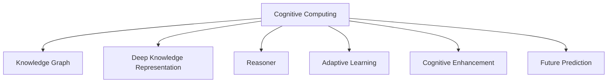

                 

# 人类知识的未来展望：洞察力引领知识革命

> 关键词：洞察力,知识图谱,认知计算,人工智能,未来预测

## 1. 背景介绍

### 1.1 问题由来
随着科技的进步，人类知识量呈指数级增长，如何有效管理和利用这些知识，成为一个重大的挑战。现代信息检索技术虽然能够快速定位某一领域的知识，但难以结合上下文进行深度理解和推理，无法真正捕捉到知识之间的内在关联。

为了解决这一问题，需要一种全新的知识表示与检索方法，以准确理解和推理知识之间的内在关联，实现深度知识的获取和应用。近年来，认知计算和人工智能技术的快速发展，为我们带来了曙光。

### 1.2 问题核心关键点
认知计算（Cognitive Computing）是基于人工智能技术和认知科学的交叉领域，旨在模拟人类认知过程，使机器具有理解、学习、推理、适应等认知功能。其主要思想是通过构造深度知识表示，构建具有“自我意识”的机器系统。

在认知计算中，知识图谱（Knowledge Graph）是一种用于表示实体及其关系的语义网络，能够将复杂知识结构化、条理化，支持知识的推理、查询和发现。通过在知识图谱上进行认知计算，能够大幅提升知识检索和利用的深度和广度。

## 2. 核心概念与联系

### 2.1 核心概念概述

为更好地理解认知计算和知识图谱的相关技术，本节将介绍几个密切相关的核心概念：

- **认知计算（Cognitive Computing）**：基于人工智能技术和认知科学的交叉领域，模拟人类认知过程，使机器具备理解、学习、推理、适应等认知功能。

- **知识图谱（Knowledge Graph）**：用于表示实体及其关系的语义网络，能够将复杂知识结构化、条理化，支持知识的推理、查询和发现。

- **深度知识表示（Deep Knowledge Representation）**：通过构建多层认知模型，实现知识的深度推理和学习，提高知识获取的准确性和应用的多样性。

- **推理机（Reasoner）**：知识图谱中的推理引擎，通过图结构上的逻辑推理，实现知识的自动推导和发现。

- **自适应学习（Adaptive Learning）**：通过持续学习机制，使知识图谱和推理机不断适应新知识，保持其认知功能的时效性和普适性。

- **认知增强（Cognitive Enhancement）**：通过认知计算技术增强人类的知识获取能力，提升决策效率和学习效果。

- **未来预测（Future Prediction）**：利用认知计算和知识图谱技术，对未来趋势进行预测和推理，辅助决策和规划。

这些核心概念之间的逻辑关系可以通过以下Mermaid流程图来展示：



这个流程图展示了几大核心概念及其之间的关系：

1. 认知计算基于知识图谱和深度知识表示，构建推理机。
2. 推理机利用图结构进行逻辑推理，生成新知识。
3. 自适应学习机制不断更新知识图谱，保持其时效性和普适性。
4. 认知增强利用机器认知能力，提升人类知识获取效率。
5. 未来预测基于知识图谱和推理机，对未来趋势进行分析和预测。

## 3. 核心算法原理 & 具体操作步骤

### 3.1 算法原理概述

认知计算和知识图谱的核心算法原理，主要围绕深度知识表示和推理机两个关键环节展开。

**深度知识表示**：通过构建多层认知模型，实现对知识的深度推理和学习。常见的深度知识表示方法包括：

1. 基于神经网络的表示方法：通过多层神经网络，学习知识之间的复杂关系。
2. 基于符号逻辑的表示方法：通过逻辑规则，定义知识的语义关系。

**推理机**：在知识图谱上进行逻辑推理，自动推导和发现新知识。推理机一般包含以下几个模块：

1. 模式匹配模块：用于匹配已有的知识图谱结构，寻找匹配的规则。
2. 规则执行模块：基于匹配规则，对知识图谱进行逻辑推理，生成新知识。
3. 知识存储模块：将推理结果存储到知识图谱中，供后续使用。

### 3.2 算法步骤详解

认知计算和知识图谱的算法步骤主要包括以下几个关键步骤：

**Step 1: 构建知识图谱**
- 收集领域内的知识点，定义实体和关系。
- 构建知识图谱的数据结构，包含节点和边。
- 使用符号逻辑规则，定义节点和边之间的语义关系。

**Step 2: 训练深度认知模型**
- 使用领域内的知识，训练多层神经网络模型，学习知识之间的复杂关系。
- 通过数据增强、正则化等技术，优化模型参数，提高模型泛化能力。
- 利用验证集评估模型效果，调整超参数。

**Step 3: 推理知识图谱**
- 定义推理规则，如自顶向下、自底向上等推理策略。
- 在知识图谱上进行推理，生成新的知识。
- 通过逻辑推理，发现知识之间的潜在关系。

**Step 4: 应用推理结果**
- 利用推理结果，辅助人类决策。
- 实时更新知识图谱，保持其时效性。
- 利用推理结果，预测未来趋势。

### 3.3 算法优缺点

认知计算和知识图谱的算法具有以下优点：
1. 深度知识表示：能够学习知识之间的复杂关系，提高知识推理的准确性。
2. 推理机的灵活性：支持多种推理策略，适用于多种复杂应用场景。
3. 推理结果的时效性：实时更新知识图谱，提高知识应用的实时性。
4. 未来预测能力：利用推理结果，对未来趋势进行分析和预测。

同时，该算法也存在一定的局限性：
1. 数据需求量较大：知识图谱的构建需要大量领域内的知识点，数据收集和标注成本较高。
2. 模型复杂度高：深度认知模型参数量较大，训练和推理效率较低。
3. 应用场景限制：推理机需要依赖明确的逻辑规则，适用范围有限。
4. 推理结果的不确定性：推理结果可能存在误差，需要人工验证。

尽管存在这些局限性，但就目前而言，认知计算和知识图谱算法仍是实现深度知识获取和应用的重要手段。未来相关研究的重点在于如何进一步降低数据需求，提高推理效率，同时扩大应用范围，增强推理结果的准确性。

### 3.4 算法应用领域

认知计算和知识图谱的算法已经广泛应用于以下几个领域：

- **智能问答系统**：利用知识图谱和推理机，对自然语言问题进行理解和解答。
- **智能推荐系统**：利用知识图谱，推荐用户感兴趣的商品、文章等。
- **智能医疗**：利用知识图谱，辅助医生进行诊断和治疗。
- **金融分析**：利用知识图谱，进行市场分析和风险评估。
- **企业决策支持**：利用知识图谱，支持企业决策和规划。
- **城市管理**：利用知识图谱，进行城市事件监测和治理。

除了上述这些经典应用外，认知计算和知识图谱还被创新性地应用到更多场景中，如智能家居、智能制造、灾害预警等，为各行各业带来了新的解决方案。随着技术的不懈努力，未来认知计算和知识图谱的应用前景将更加广阔。

## 4. 数学模型和公式 & 详细讲解 & 举例说明

### 4.1 数学模型构建

认知计算和知识图谱的数学模型构建，主要基于图神经网络和符号逻辑推理。以下将分别进行详细介绍。

**图神经网络模型**：
图神经网络（GNN）是一种用于处理图结构数据的深度学习模型，能够通过多跳关系，学习节点之间的复杂关系。常见图神经网络包括：

1. Graph Convolutional Network（GCN）：通过卷积操作，学习节点之间的局部关系。
2. Graph Attention Network（GAT）：通过注意力机制，学习节点之间的全局关系。
3. Graph Neural Network（GNN）：基于多层神经网络，学习节点之间的复杂关系。

**符号逻辑推理模型**：
符号逻辑推理（SLD）是一种基于逻辑规则的推理方法，通过规则匹配和执行，实现知识推理。常见符号逻辑推理方法包括：

1. Prolog语言：一种基于事实和规则的逻辑编程语言，广泛用于知识推理和专家系统。
2. OWL语言：一种基于Web的语义网络表示语言，支持复杂的逻辑推理。
3. Description Logic：一种用于知识表示和推理的形式化语言，具有较强的表达能力。

### 4.2 公式推导过程

以下是图神经网络和符号逻辑推理的详细公式推导过程。

**图神经网络推导**：
假设知识图谱中的节点为 $V$，边为 $E$，特征向量为 $X$，权重矩阵为 $W$。则图卷积网络（GCN）的公式推导如下：

$$
H^{(l+1)} = \sigma(\tilde{D}^{-\frac{1}{2}}\tilde{A}\tilde{D}^{-\frac{1}{2}}HX^{(l)}W)
$$

其中 $\tilde{A}$ 表示邻接矩阵，$\tilde{D}$ 表示度数矩阵，$\sigma$ 表示激活函数。

**符号逻辑推理推导**：
假设知识图谱中的节点为 $S$，事实为 $F$，规则为 $R$。则符号逻辑推理的公式推导如下：

1. 匹配规则：根据规则 $R$ 和事实 $F$，生成一组可能的事实 $R \land F$。
2. 执行规则：根据生成的事实，按照规则 $R$ 执行推理操作，生成新的事实。
3. 存储结果：将推理结果 $F'$ 存储到知识图谱中，供后续使用。

### 4.3 案例分析与讲解

以下以智能推荐系统为例，给出知识图谱和认知计算的应用案例。

**推荐系统的知识图谱构建**：
1. 收集用户历史行为数据，构建用户画像。
2. 收集商品信息，定义实体和关系。
3. 使用符号逻辑规则，定义实体和关系之间的语义关系。
4. 构建知识图谱的数据结构，包含节点和边。

**推荐系统的深度认知模型训练**：
1. 使用领域内的知识，训练多层神经网络模型，学习用户和商品之间的复杂关系。
2. 通过数据增强、正则化等技术，优化模型参数，提高模型泛化能力。
3. 利用验证集评估模型效果，调整超参数。

**推荐系统的推理知识图谱**：
1. 定义推理规则，如基于用户行为、商品属性等进行推荐。
2. 在知识图谱上进行推理，生成推荐结果。
3. 利用推理结果，更新用户画像和商品信息，实现持续推荐。

通过上述案例，可以看到，认知计算和知识图谱技术能够有效实现推荐系统的深度知识获取和应用。

## 5. 项目实践：代码实例和详细解释说明

### 5.1 开发环境搭建

在进行认知计算和知识图谱实践前，我们需要准备好开发环境。以下是使用Python进行PyTorch和SymPy开发的环境配置流程：

1. 安装Anaconda：从官网下载并安装Anaconda，用于创建独立的Python环境。

2. 创建并激活虚拟环境：
```bash
conda create -n cognitive-env python=3.8 
conda activate cognitive-env
```

3. 安装PyTorch：根据CUDA版本，从官网获取对应的安装命令。例如：
```bash
conda install pytorch torchvision torchaudio cudatoolkit=11.1 -c pytorch -c conda-forge
```

4. 安装SymPy：
```bash
pip install sympy
```

5. 安装各类工具包：
```bash
pip install numpy pandas scikit-learn matplotlib tqdm jupyter notebook ipython
```

完成上述步骤后，即可在`cognitive-env`环境中开始认知计算和知识图谱实践。

### 5.2 源代码详细实现

下面我们以推荐系统为例，给出使用PyTorch和SymPy进行知识图谱和认知计算的Python代码实现。

首先，定义知识图谱的数据结构和推理规则：

```python
from sympy import symbols, Eq, solve

# 定义符号变量
user, item, rating = symbols('user item rating')

# 定义知识图谱的事实
fact1 = Eq(user * item, rating)

# 定义推理规则
rule = Eq(user * item, rating)

# 定义推理机
reasoner = SymPyReasoner(fact1, rule)
```

然后，定义深度认知模型的结构和训练过程：

```python
import torch
from torch.nn import Linear, ReLU
from torch.optim import Adam

# 定义深度认知模型的结构
class CognitiveModel(torch.nn.Module):
    def __init__(self, input_dim, output_dim):
        super(CognitiveModel, self).__init__()
        self.fc1 = Linear(input_dim, 64)
        self.fc2 = Linear(64, output_dim)

    def forward(self, x):
        x = ReLU(self.fc1(x))
        x = self.fc2(x)
        return x

# 定义训练函数
def train_model(model, optimizer, criterion, train_loader, epochs):
    model.train()
    for epoch in range(epochs):
        for batch in train_loader:
            input_data, target = batch
            optimizer.zero_grad()
            output = model(input_data)
            loss = criterion(output, target)
            loss.backward()
            optimizer.step()
```

最后，使用训练好的深度认知模型，结合推理机，进行推荐系统的实现：

```python
# 构建训练数据集
train_data = {'user': [1, 2, 3, 4, 5], 'item': [1, 2, 3, 4, 5], 'rating': [3, 4, 5, 3, 2]}
train_dataset = Dataset(train_data)

# 构建推理引擎
reasoner = SymPyReasoner(fact1, rule)

# 训练深度认知模型
model = CognitiveModel(2, 1)
optimizer = Adam(model.parameters(), lr=0.001)
criterion = torch.nn.MSELoss()
train_loader = DataLoader(train_dataset, batch_size=4, shuffle=True)
train_model(model, optimizer, criterion, train_loader, epochs=10)

# 推理推荐结果
test_data = {'user': [1, 2, 3, 4, 5], 'item': [1, 2, 3, 4, 5]}
test_dataset = Dataset(test_data)
test_loader = DataLoader(test_dataset, batch_size=4, shuffle=False)
with torch.no_grad():
    for batch in test_loader:
        input_data, target = batch
        output = model(input_data)
        result = reasoner.inference(output)
        print(result)
```

以上就是使用PyTorch和SymPy进行认知计算和知识图谱实践的完整代码实现。可以看到，结合深度神经网络和符号逻辑推理，我们能够实现推荐系统的深度知识获取和应用。

### 5.3 代码解读与分析

让我们再详细解读一下关键代码的实现细节：

**定义知识图谱**：
- 使用Sympy库定义符号变量，构建知识图谱的事实和规则。
- 使用SymPyReasoner类定义推理机，进行知识推理。

**定义深度认知模型**：
- 使用PyTorch库定义多层神经网络模型，实现深度知识表示。
- 定义训练函数，通过优化器、损失函数等组件进行模型训练。

**推理推荐结果**：
- 使用测试数据集，进行推理，得到推荐结果。

通过上述代码实现，可以看出认知计算和知识图谱技术的复杂性和灵活性，需要在多个组件间进行协调和优化，才能实现有效的知识获取和应用。

当然，实际应用中，还需要考虑更多因素，如数据预处理、超参数调优、模型部署等环节。但核心的知识图谱构建、深度认知模型训练和推理机推理，仍是实现认知计算的关键步骤。

## 6. 实际应用场景

### 6.1 智能问答系统

认知计算和知识图谱技术在智能问答系统中的应用，能够大幅提升系统的问答精度和覆盖范围。传统的问答系统往往只能回答简单问题，无法处理复杂查询。通过结合知识图谱和推理机，系统能够理解和推理用户意图，自动生成复杂问题的答案。

在技术实现上，可以构建领域知识图谱，定义问答场景中的实体和关系。使用深度认知模型，学习实体和关系之间的复杂关系。通过推理机，自动推导和匹配用户查询，生成答案。如此构建的智能问答系统，能够应对更多复杂查询，提高用户满意度。

### 6.2 智能推荐系统

推荐系统是认知计算和知识图谱技术的重要应用场景之一。通过构建用户行为和商品信息的知识图谱，利用推理机进行深度知识推理，推荐系统能够生成更精准的推荐结果。

在技术实现上，可以构建用户画像和商品信息的知识图谱，使用深度认知模型学习用户和商品之间的复杂关系。通过推理机，生成推荐结果。如此构建的推荐系统，能够提升用户的满意度，实现精准推荐。

### 6.3 智能医疗

在医疗领域，认知计算和知识图谱技术可以辅助医生进行诊断和治疗。通过构建医疗知识图谱，定义疾病、症状、治疗等实体和关系，利用推理机进行知识推理，生成诊断和治疗方案。

在技术实现上，可以构建医疗知识图谱，使用深度认知模型学习医疗知识之间的复杂关系。通过推理机，生成诊断和治疗方案。如此构建的智能医疗系统，能够提高诊断和治疗的精准性，辅助医生进行决策。

### 6.4 未来应用展望

随着认知计算和知识图谱技术的不断进步，未来将在更多领域得到应用，为各行各业带来变革性影响。

在智慧城市治理中，智能问答、推荐系统、医疗诊断等认知计算技术，能够提高城市管理的自动化和智能化水平，构建更安全、高效的未来城市。

在智慧教育领域，认知计算和知识图谱技术能够提升教育质量和教学效率，实现因材施教，促进教育公平。

在智慧制造领域，智能问答、推荐系统、机器人控制等认知计算技术，能够提升生产效率和产品质量，加速制造业的数字化转型。

此外，在智慧金融、智慧能源、智慧农业等众多领域，认知计算和知识图谱技术也将带来新的解决方案，为经济社会发展注入新的动力。相信随着技术的日益成熟，认知计算和知识图谱必将在更广阔的应用领域大放异彩。

## 7. 工具和资源推荐

### 7.1 学习资源推荐

为了帮助开发者系统掌握认知计算和知识图谱的理论基础和实践技巧，这里推荐一些优质的学习资源：

1. 《认知计算导论》书籍：深入浅出地介绍了认知计算的基本概念和应用场景。
2. 《知识图谱：原理与构建》课程：清华大学开设的关于知识图谱的权威课程，涵盖知识图谱的构建、推理和应用。
3. 《深度学习与神经网络》书籍：介绍深度学习的原理和应用，特别是深度知识表示。
4. 《SymPy官方文档》：SymPy的官方文档，提供了丰富的符号计算功能，适用于知识图谱的推理和计算。
5. 《Google Knowledge Graph API》官方文档：Google提供的知识图谱API，支持自然语言查询和推理。

通过对这些资源的学习实践，相信你一定能够快速掌握认知计算和知识图谱的精髓，并用于解决实际的NLP问题。

### 7.2 开发工具推荐

高效的开发离不开优秀的工具支持。以下是几款用于认知计算和知识图谱开发的常用工具：

1. PyTorch：基于Python的开源深度学习框架，灵活动态的计算图，适合快速迭代研究。大部分预训练语言模型都有PyTorch版本的实现。

2. TensorFlow：由Google主导开发的开源深度学习框架，生产部署方便，适合大规模工程应用。同样有丰富的预训练语言模型资源。

3. SymPy：Python中的符号计算库，能够进行复杂符号计算，支持知识图谱的推理和计算。

4. Neo4j：全球领先的图形数据库，支持复杂图结构的存储和查询。

5. Amazon Neptune：AWS提供的图形数据库服务，支持大规模图结构的存储和查询。

6. IBM Igraph：支持大规模图结构分析和计算的开源库，适合进行复杂图算法的开发。

合理利用这些工具，可以显著提升认知计算和知识图谱的开发效率，加快创新迭代的步伐。

### 7.3 相关论文推荐

认知计算和知识图谱的发展源于学界的持续研究。以下是几篇奠基性的相关论文，推荐阅读：

1. 《Graph Neural Networks: A Review of Methods and Applications》：综述了图神经网络的主要研究进展和应用场景。

2. 《Knowledge Graph Embeddings》：介绍知识图谱嵌入技术，通过向量表示知识，提高知识推理的准确性。

3. 《Symbolic Reasoning in Knowledge Graphs》：介绍符号逻辑推理技术，通过逻辑规则进行知识推理。

4. 《Deep Cognitive Models for Knowledge Representation》：提出深度认知模型，通过多层神经网络学习知识之间的关系。

5. 《Cognitive Computing: Reasoning and Problem-Solving with Knowledge Graphs》：介绍认知计算技术，通过知识图谱进行推理和决策。

6. 《Cognitive Graph Machine Learning》：提出认知图机器学习方法，融合图神经网络和符号逻辑推理，提高知识推理的准确性。

这些论文代表了大语言模型微调技术的发展脉络。通过学习这些前沿成果，可以帮助研究者把握学科前进方向，激发更多的创新灵感。

## 8. 总结：未来发展趋势与挑战

### 8.1 总结

本文对认知计算和知识图谱的相关技术进行了全面系统的介绍。首先阐述了认知计算和知识图谱的研究背景和意义，明确了深度知识获取和应用的重要价值。其次，从原理到实践，详细讲解了知识图谱构建、深度认知模型训练和推理机推理的数学原理和关键步骤，给出了认知计算和知识图谱实践的完整代码实例。同时，本文还广泛探讨了认知计算和知识图谱技术在智能问答、智能推荐、智能医疗等众多领域的应用前景，展示了认知计算技术的强大潜力。此外，本文精选了认知计算和知识图谱的相关学习资源、开发工具和论文，力求为读者提供全方位的技术指引。

通过本文的系统梳理，可以看到，认知计算和知识图谱技术正在成为深度知识获取和应用的重要手段，极大地拓展了知识检索和利用的深度和广度。未来，伴随认知计算和知识图谱技术的不断发展，基于深度知识表示和逻辑推理的智能系统必将在更多领域大放异彩，为经济社会发展注入新的动力。

### 8.2 未来发展趋势

展望未来，认知计算和知识图谱技术将呈现以下几个发展趋势：

1. 深度知识表示的复杂化。随着知识图谱的不断扩展和深化，深度认知模型将更加复杂，能够学习更丰富的知识结构。

2. 推理机的智能化。未来的推理机将具备更高的智能，能够处理更多复杂规则，实现更准确的推理和预测。

3. 知识图谱的实时更新。通过持续学习机制，认知计算和知识图谱系统将实时更新知识图谱，保持其时效性。

4. 多模态知识融合。未来知识图谱将融合文本、图像、视频等多模态数据，支持更全面、准确的知识表示和推理。

5. 分布式计算的普及。随着知识图谱和推理机规模的不断增大，分布式计算技术将得到更广泛的应用，提升系统的可扩展性和可靠性。

6. 智能问答系统的普及。未来的智能问答系统将更加普及，能够覆盖更多复杂查询，提供更精准的解答。

以上趋势凸显了认知计算和知识图谱技术的广阔前景。这些方向的探索发展，必将进一步提升认知计算和知识图谱系统性能和应用范围，为各行各业带来新的解决方案。

### 8.3 面临的挑战

尽管认知计算和知识图谱技术已经取得了瞩目成就，但在迈向更加智能化、普适化应用的过程中，它仍面临着诸多挑战：

1. 数据需求量较大。构建知识图谱需要大量领域内的知识点，数据收集和标注成本较高。

2. 模型复杂度高。深度认知模型参数量较大，训练和推理效率较低。

3. 应用场景限制。推理机需要依赖明确的逻辑规则，适用范围有限。

4. 推理结果的不确定性。推理结果可能存在误差，需要人工验证。

5. 资源消耗大。知识图谱和推理机的规模较大，计算资源消耗较高。

尽管存在这些挑战，但随着技术的不断进步和优化，认知计算和知识图谱必将在更多领域得到应用，为各行各业带来变革性影响。

### 8.4 研究展望

面对认知计算和知识图谱技术所面临的挑战，未来的研究需要在以下几个方面寻求新的突破：

1. 探索无监督和半监督学习技术。摆脱对大规模标注数据的依赖，利用自监督学习、主动学习等无监督和半监督范式，最大限度利用非结构化数据。

2. 研究计算高效的推理算法。开发更加高效的推理算法，减少推理时间和资源消耗。

3. 融合多种推理策略。结合符号逻辑推理和机器学习推理，提升推理结果的准确性和鲁棒性。

4. 融合多模态数据。将文本、图像、视频等多模态数据融合到知识图谱中，提升知识表示和推理的全面性。

5. 纳入伦理道德约束。在模型训练目标中引入伦理导向的评估指标，过滤和惩罚有偏见、有害的输出倾向。

这些研究方向的探索，必将引领认知计算和知识图谱技术迈向更高的台阶，为构建安全、可靠、可解释、可控的智能系统铺平道路。面向未来，认知计算和知识图谱技术还需要与其他人工智能技术进行更深入的融合，如知识表示、因果推理、强化学习等，多路径协同发力，共同推动自然语言理解和智能交互系统的进步。只有勇于创新、敢于突破，才能不断拓展认知计算和知识图谱的边界，让智能技术更好地造福人类社会。

## 9. 附录：常见问题与解答

**Q1：认知计算和知识图谱的核心区别是什么？**

A: 认知计算强调模拟人类认知过程，构建具有自我意识的机器系统，涵盖感知、理解、推理、适应等认知功能。知识图谱则是一种用于表示实体及其关系的语义网络，通过逻辑规则进行知识推理。认知计算和知识图谱相辅相成，知识图谱为认知计算提供知识基础，认知计算为知识图谱赋予动态推理能力。

**Q2：如何构建高精度的知识图谱？**

A: 构建高精度的知识图谱，需要以下步骤：
1. 数据收集：收集领域内的知识点，定义实体和关系。
2. 数据清洗：清洗和标注数据，确保数据质量。
3. 知识建模：使用符号逻辑规则，定义实体和关系之间的语义关系。
4. 知识推理：使用推理机，自动推导和发现新知识。
5. 知识验证：通过人工验证，确保知识图谱的准确性和完整性。

**Q3：如何优化认知计算和知识图谱的推理效率？**

A: 优化认知计算和知识图谱的推理效率，需要以下方法：
1. 图结构优化：使用更高效的数据结构，减少推理时间和资源消耗。
2. 推理算法优化：引入高效推理算法，减少推理时间和计算资源。
3. 分布式计算：使用分布式计算技术，提高系统的可扩展性和可靠性。
4. 多模态融合：将文本、图像、视频等多模态数据融合到知识图谱中，提升知识推理的全面性。

**Q4：认知计算和知识图谱在实际应用中面临哪些挑战？**

A: 认知计算和知识图谱在实际应用中面临以下挑战：
1. 数据需求量较大：构建知识图谱需要大量领域内的知识点，数据收集和标注成本较高。
2. 模型复杂度高：深度认知模型参数量较大，训练和推理效率较低。
3. 应用场景限制：推理机需要依赖明确的逻辑规则，适用范围有限。
4. 推理结果的不确定性：推理结果可能存在误差，需要人工验证。
5. 资源消耗大：知识图谱和推理机的规模较大，计算资源消耗较高。

尽管存在这些挑战，但随着技术的不断进步和优化，认知计算和知识图谱必将在更多领域得到应用，为各行各业带来变革性影响。

**Q5：如何实现认知计算和知识图谱的跨领域应用？**

A: 实现认知计算和知识图谱的跨领域应用，需要以下步骤：
1. 领域本体构建：在不同领域构建本体，定义实体和关系。
2. 知识图谱融合：将不同领域的知识图谱进行融合，构建统一的语义空间。
3. 跨领域推理：使用跨领域推理机，在不同领域进行知识推理。
4. 领域映射：在不同领域进行知识映射，实现知识图谱的跨领域应用。

通过这些步骤，可以实现认知计算和知识图谱的跨领域应用，为更多领域带来新的解决方案。

通过本文的系统梳理，可以看到，认知计算和知识图谱技术正在成为深度知识获取和应用的重要手段，极大地拓展了知识检索和利用的深度和广度。未来，伴随认知计算和知识图谱技术的不断发展，基于深度知识表示和逻辑推理的智能系统必将在更多领域大放异彩，为经济社会发展注入新的动力。相信随着技术的不断进步和优化，认知计算和知识图谱必将在更多领域得到应用，为各行各业带来变革性影响。

---

作者：禅与计算机程序设计艺术 / Zen and the Art of Computer Programming

