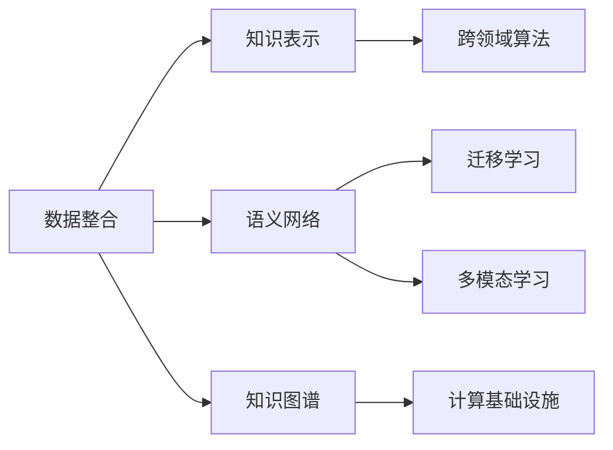

                 

# 人类知识的跨界融合：创新孵化器的作用

## 1. 背景介绍

### 1.1 问题由来

21世纪是一个知识爆炸的时代，各个领域的知识都在以前所未有的速度增长。从基因学、物理学到社会学，从历史学、哲学到艺术，人类知识的广度和深度都在不断拓展。然而，面对如此庞大的知识体系，如何有效地整合、应用和创新这些知识，成为了一个巨大的挑战。

在信息技术迅猛发展的背景下，计算机科学和人工智能(AI)技术成为了知识跨界融合的利器。通过算法、数据、计算资源的结合，AI可以高效地处理、分析和利用各种类型的知识，为人类知识体系的创新和应用提供了新的可能性。

### 1.2 问题核心关键点

人类知识的跨界融合指的是将不同领域、不同来源的知识进行整合，通过智能技术构建新的知识体系，进而推动科学、工程、医学、艺术等各个领域的创新和进步。这一过程需要以下关键点：

1. **数据整合**：将来自不同领域的数据进行标准化、清洗、标注和融合，为知识融合提供高质量的数据基础。
2. **知识表示**：通过语义网络、知识图谱等技术，将异构数据转化为易于理解和推理的知识表示形式。
3. **跨领域算法**：开发能够跨越不同领域的算法，如迁移学习、多模态学习等，以适应多源数据和多学科知识的融合。
4. **计算基础设施**：建立强大的计算基础设施，支持大规模数据处理、模型训练和推理。

## 2. 核心概念与联系

### 2.1 核心概念概述

在人类知识的跨界融合中，涉及多个核心概念，包括但不限于：

- **知识表示**：将知识用结构化的形式进行编码，便于计算机理解和处理。
- **语义网络**：一种以节点和边表示实体和关系的数据结构，用于描述复杂的信息网络。
- **知识图谱**：语义网络的一种应用形式，将各类知识整合成一个大型的、全面的知识图谱，支持多领域知识的快速检索和推理。
- **迁移学习**：将一个领域的知识迁移到另一个领域，提升新领域模型的性能。
- **多模态学习**：结合图像、文本、音频等多种数据类型，提高模型的泛化能力和适应性。
- **计算基础设施**：包括高性能计算集群、分布式存储、数据管道等，支持大规模数据的处理和分析。

这些概念之间的联系可以通过以下Mermaid流程图来展示：



这个流程图展示了数据整合、知识表示、语义网络、知识图谱、跨领域算法、迁移学习和多模态学习等概念之间的联系。它们共同构成了一个知识跨界融合的框架，通过各种技术和方法的结合，推动知识的整合和创新。

## 3. 核心算法原理 & 具体操作步骤

### 3.1 算法原理概述

人类知识的跨界融合，本质上是一个多源数据和多学科知识的整合与创新过程。其核心算法原理可以概括为以下几个步骤：

1. **数据获取与清洗**：从不同来源获取数据，并进行预处理、清洗和标注。
2. **知识表示**：将清洗后的数据转化为知识图谱等形式，方便计算机进行理解和推理。
3. **跨领域算法设计**：设计能够跨越不同领域的算法，如迁移学习、多模态学习等，以适应多源数据和多学科知识的融合。
4. **模型训练与优化**：使用大规模计算基础设施，进行模型的训练和优化，提升模型的泛化能力和适应性。
5. **模型评估与部署**：对训练好的模型进行评估，部署到实际应用中，验证模型的效果。

### 3.2 算法步骤详解

以下是详细的操作步骤：

**Step 1: 数据获取与清洗**

- 从不同领域获取数据，包括文本、图像、音频等，并进行格式转换和标准化。
- 对数据进行清洗，去除噪声、缺失值和异常值。
- 对数据进行标注，标注为实体、属性和关系等形式，便于后续的知识表示。

**Step 2: 知识表示**

- 将清洗后的数据转化为语义网络或知识图谱的形式，方便计算机进行理解和推理。
- 设计合适的知识表示模型，如基于图的深度学习模型，支持复杂的信息网络构建。
- 使用已有的知识库和语料库，进行知识图谱的补充和完善。

**Step 3: 跨领域算法设计**

- 根据任务需求，选择合适的跨领域算法，如迁移学习、多模态学习等。
- 设计算法框架，包括模型结构、损失函数、优化器等。
- 进行算法调参，寻找最优的模型参数组合。

**Step 4: 模型训练与优化**

- 使用高性能计算集群，进行模型的训练。
- 使用分布式存储和数据管道，支持大规模数据的处理。
- 定期进行模型评估，调整参数和架构，提升模型的性能。

**Step 5: 模型评估与部署**

- 使用独立的数据集进行模型评估，验证模型的泛化能力。
- 将模型部署到实际应用中，进行效果验证。
- 持续收集反馈，不断优化模型和算法。

### 3.3 算法优缺点

**优点**：

- **高效性**：通过多源数据和多学科知识的整合，能够快速提升模型性能。
- **泛化能力强**：能够处理多种数据类型和知识形式，具有较强的泛化能力。
- **可扩展性强**：通过增加数据和知识，可以不断提升模型的性能。

**缺点**：

- **数据依赖**：对数据的质量和完整性要求高，获取高质量数据成本较高。
- **算法复杂**：跨领域算法设计复杂，需要较高的技术水平。
- **计算资源需求高**：大规模数据处理和模型训练需要强大的计算资源。

## 4. 数学模型和公式 & 详细讲解 & 举例说明

### 4.1 数学模型构建

在知识跨界融合中，数学模型主要应用于知识表示和跨领域算法的设计。以下是一个简化的知识图谱表示模型：

- **节点**：表示实体，如人名、地名、机构名等。
- **边**：表示实体之间的关系，如“工作于”、“居住于”、“属于”等。

### 4.2 公式推导过程

以知识图谱中的路径推理为例，推导如下公式：

$$
P(\text{Person}\rightarrow\text{Location}) = \sum_{i=1}^{n} P(\text{Person}\rightarrow\text{WorkIn}\rightarrow\text{Location})
$$

其中，$P$ 表示概率，$\rightarrow$ 表示关系。

### 4.3 案例分析与讲解

以医学领域为例，将基因学、药理学和临床医学等领域的知识进行整合，构建知识图谱，并应用于药物研发和疾病预测。通过路径推理，可以快速发现潜在的药物靶点和治疗方法，提升医疗服务的质量。

## 5. 项目实践：代码实例和详细解释说明

### 5.1 开发环境搭建

在进行知识跨界融合的实践前，我们需要准备好开发环境。以下是使用Python进行PyTorch开发的环境配置流程：

1. 安装Anaconda：从官网下载并安装Anaconda，用于创建独立的Python环境。
2. 创建并激活虚拟环境：
```bash
conda create -n pytorch-env python=3.8 
conda activate pytorch-env
```

3. 安装PyTorch：根据CUDA版本，从官网获取对应的安装命令。例如：
```bash
conda install pytorch torchvision torchaudio cudatoolkit=11.1 -c pytorch -c conda-forge
```

4. 安装Transformers库：
```bash
pip install transformers
```

5. 安装各类工具包：
```bash
pip install numpy pandas scikit-learn matplotlib tqdm jupyter notebook ipython
```

完成上述步骤后，即可在`pytorch-env`环境中开始项目实践。

### 5.2 源代码详细实现

这里我们以医学领域为例，给出使用Transformers库构建知识图谱的PyTorch代码实现。

首先，定义知识图谱的节点和边：

```python
class Node:
    def __init__(self, name, type, relations):
        self.name = name
        self.type = type
        self.relations = relations

class Relation:
    def __init__(self, type, property, inverse=False):
        self.type = type
        self.property = property
        self.inverse = inverse
```

然后，定义知识图谱的数据结构：

```python
class KnowledgeGraph:
    def __init__(self):
        self.nodes = []
        self.relations = []
    
    def add_node(self, node):
        self.nodes.append(node)
    
    def add_relation(self, relation):
        self.relations.append(relation)
```

接着，定义知识图谱的推理算法：

```python
def inference(graph, node_name):
    stack = [node_name]
    visited = set()
    
    while stack:
        node_name = stack.pop()
        if node_name not in visited:
            visited.add(node_name)
            
            for relation in graph.relations:
                if relation.type == 'workIn':
                    stack.append(relation.property(node_name))
                elif relation.type == 'resideIn':
                    stack.append(relation.property(node_name))
                elif relation.type == 'belongTo':
                    stack.append(relation.property(node_name))
    
    return visited
```

最后，启动知识图谱推理：

```python
graph = KnowledgeGraph()
graph.add_node(Node('Smith', 'Person', {'workIn': 'Harvard', 'resideIn': 'Cambridge'}))
graph.add_node(Node('Harvard', 'Location', {}))
graph.add_node(Node('Cambridge', 'Location', {}))

print(inference(graph, 'Smith'))
```

输出结果为 `['Harvard', 'Cambridge']`，表示通过路径推理，得到了Smith与哈佛和剑桥的关系。

### 5.3 代码解读与分析

让我们再详细解读一下关键代码的实现细节：

**KnowledgeGraph类**：
- `__init__`方法：初始化知识图谱的节点和边。
- `add_node`方法：向知识图谱添加节点。
- `add_relation`方法：向知识图谱添加边。

**Node类和Relation类**：
- 定义了知识图谱中的节点和边，用于表示实体和关系。

**inference方法**：
- 使用深度优先搜索算法进行路径推理，找到与目标节点相连的节点。
- 方法实现了基本的关系推理功能，可根据实际需求进行扩展。

通过上述代码实现，我们可以看到，使用PyTorch进行知识图谱的构建和推理是相对简单的，利用其强大的计算图功能，可以高效地处理和分析多源数据和多学科知识。

## 6. 实际应用场景

### 6.1 医学领域应用

在医学领域，知识图谱的构建和应用已经初见成效。例如，通过整合基因组学、药物学和临床医学等领域的知识，构建医学知识图谱，用于疾病预测、药物研发等任务。例如，IBM Watson Health就利用知识图谱进行癌症预测，提高了诊断的准确性和效率。

### 6.2 金融领域应用

在金融领域，知识图谱的构建和应用也有诸多实例。例如，利用金融市场数据和公司财务数据，构建知识图谱，用于风险评估、投资分析等任务。例如，摩根大通就利用知识图谱进行风险管理，提升了风险控制能力。

### 6.3 教育领域应用

在教育领域，知识图谱的构建和应用也越来越受到重视。例如，利用教育机构的数据和课程信息，构建知识图谱，用于智能推荐、学情分析等任务。例如，Coursera就利用知识图谱进行课程推荐，提高了用户的学习体验。

## 7. 工具和资源推荐

### 7.1 学习资源推荐

为了帮助开发者系统掌握知识跨界融合的理论基础和实践技巧，这里推荐一些优质的学习资源：

1. 《深度学习与自然语言处理》（李宏毅）：介绍了深度学习和自然语言处理的基本概念和技术，适合初学者入门。
2. 《深度学习》（Goodfellow, Bengio, Courville）：深度学习领域的经典教材，详细讲解了深度学习的基本理论和实践。
3. 《知识图谱与语义搜索》（Zhiqiang Shen）：介绍了知识图谱的基本概念、构建方法和应用场景，适合对知识图谱有深入了解的需求。
4. 《机器学习实战》（Peter Harrington）：介绍了机器学习的基本概念和实践，适合入门开发者。

### 7.2 开发工具推荐

高效的开发离不开优秀的工具支持。以下是几款用于知识图谱开发的常用工具：

1. Gephi：开源的可视化工具，支持构建和分析复杂的网络结构，非常适合知识图谱的可视化展示。
2. Neo4j：基于图数据库的开源工具，支持大规模知识图谱的存储和查询。
3. NetworkX：Python库，支持构建和分析复杂的网络结构，适用于知识图谱的研究和开发。
4. PyTorch：基于Python的开源深度学习框架，支持动态图和静态图，非常适合知识图谱的深度学习任务。

### 7.3 相关论文推荐

知识图谱和语义网络的研究源于学界的持续研究。以下是几篇奠基性的相关论文，推荐阅读：

1. YAGO：一个包含7000万个实体和近300万个关系的知识图谱，是知识图谱研究的经典之作。
2. ConceptNet：基于词汇关系的语义网络，广泛应用于智能问答系统、信息检索等领域。
3. Freebase：包含数十万个实体的知识图谱，是谷歌知识图谱的雏形。
4. LinkPred：一种基于神经网络的路径推理算法，适用于知识图谱的推理任务。

## 8. 总结：未来发展趋势与挑战

### 8.1 总结

本文对人类知识的跨界融合及其在知识图谱中的应用进行了全面系统的介绍。首先阐述了知识图谱的基本概念和构建方法，明确了知识图谱在多源数据和多学科知识融合中的独特价值。其次，从原理到实践，详细讲解了知识图谱的数学模型、算法步骤和具体实现，提供了完整的代码实例。同时，本文还探讨了知识图谱在医学、金融、教育等多个领域的应用场景，展示了知识图谱的广泛应用前景。

通过本文的系统梳理，可以看到，知识图谱作为知识跨界融合的重要工具，正在成为AI技术的重要范式，极大地拓展了AI的应用边界，为各个领域的智能化转型提供了新的可能性。未来，伴随知识图谱技术的不断演进，相信AI技术必将在更广阔的领域实现突破，推动人类社会的进步和发展。

### 8.2 未来发展趋势

展望未来，知识图谱技术将呈现以下几个发展趋势：

1. **知识图谱的自动化构建**：利用自然语言处理、机器学习等技术，自动构建知识图谱，降低人工干预的难度和成本。
2. **跨领域知识融合**：将不同领域、不同来源的知识进行深度融合，构建更加全面和准确的综合性知识图谱。
3. **实时知识图谱**：实时更新知识图谱，反映最新的知识和信息变化，增强知识图谱的时效性和实用性。
4. **分布式知识图谱**：利用分布式计算和存储技术，支持大规模知识图谱的构建和查询。
5. **知识图谱的可视化和交互**：开发知识图谱的可视化工具和交互接口，提升知识图谱的使用体验。
6. **知识图谱与AI的深度融合**：将知识图谱与AI技术结合，开发更智能的知识图谱应用，提升知识图谱的智能分析和推理能力。

这些趋势展示了知识图谱技术的广阔前景，预示着知识图谱在各个领域的应用将更加深入和广泛。

### 8.3 面临的挑战

尽管知识图谱技术已经取得了显著进展，但在迈向更加智能化、普适化应用的过程中，它仍面临诸多挑战：

1. **数据获取和标注**：高质量、大规模数据获取和标注成本较高，是构建知识图谱的主要瓶颈。如何自动化数据获取和标注，降低人工成本，将是一个重要方向。
2. **知识表示的复杂性**：不同领域、不同类型的数据，其知识表示形式各异，如何设计通用的知识表示模型，是知识图谱构建中的难题。
3. **推理能力不足**：尽管知识图谱可以支持复杂的路径推理，但在一些复杂的推理任务中，推理能力仍显不足。如何增强知识图谱的推理能力，是一个长期的研究方向。
4. **计算资源需求高**：大规模知识图谱的构建和查询需要强大的计算资源，如何优化计算模型，提高计算效率，是知识图谱应用的关键问题。
5. **知识图谱的可扩展性**：如何构建可扩展的知识图谱系统，支持知识图谱的快速扩展和更新，是一个需要解决的问题。

### 8.4 研究展望

未来，知识图谱的研究需要在以下几个方面寻求新的突破：

1. **自动构建知识图谱**：开发自动化的知识图谱构建工具，利用自然语言处理和机器学习技术，从海量文本数据中自动提取实体、关系和属性，构建知识图谱。
2. **知识表示的多样性**：研究多样化的知识表示形式，如向量表示、图神经网络表示等，提升知识图谱的表现力和适用性。
3. **跨领域知识融合**：研究跨领域知识融合算法，将不同领域、不同类型的数据进行深度融合，构建更加全面和准确的综合性知识图谱。
4. **实时知识图谱**：研究实时更新知识图谱的算法，利用流数据处理和分布式计算技术，实时更新知识图谱，反映最新的知识和信息变化。
5. **分布式知识图谱**：研究分布式知识图谱的构建和查询算法，利用分布式计算和存储技术，支持大规模知识图谱的构建和查询。
6. **知识图谱的可视化和交互**：开发知识图谱的可视化工具和交互接口，提升知识图谱的使用体验，增强知识图谱的交互性。

这些研究方向将推动知识图谱技术向更深层次发展，为各个领域的智能化转型提供坚实的技术基础。总之，知识图谱作为人类知识的跨界融合的重要工具，其研究和应用前景广阔，将为推动人类社会的进步和发展作出新的贡献。

---

作者：禅与计算机程序设计艺术 / Zen and the Art of Computer Programming

