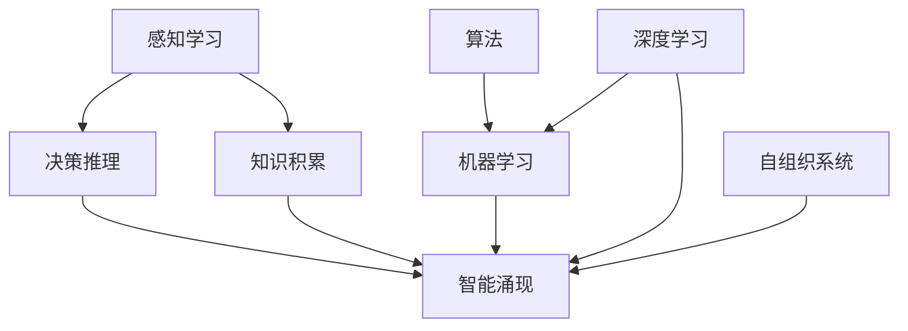

                 

# 人类知识的进化论：从猿猴到人工智能

> 关键词：进化论,人工智能,知识,智能,算法,机器学习,深度学习,神经网络,自组织系统

## 1. 背景介绍

### 1.1 问题的由来
人类知识的进化论是一个复杂且多层次的话题。从猿猴到人工智能，这一过程既反映了智能演化的普遍规律，也展示了科技发展的巨大潜力。本文将通过探讨这一过程，来揭示智能演化的本质，并为人工智能的未来发展提供一些有益的见解。

### 1.2 问题的核心关键点
智能演化的过程可以概括为从简单的感知学习到复杂的决策推理的逐步进化。这一过程涉及到多个关键点，包括但不限于：

- **感知学习**：通过环境反馈，学习基本感知能力，如识别声音、形状等。
- **决策推理**：基于已有知识，进行逻辑推理和决策。
- **知识积累**：通过经验积累和交流，知识得以传递和积累。
- **智能涌现**：在大量的感知和决策经验积累后，智能得以涌现，形成复杂的行为模式。

本文将重点探讨知识积累和智能涌现，尤其是人工智能如何通过算法和神经网络实现智能涌现。

## 2. 核心概念与联系

### 2.1 核心概念概述

为更好地理解从猿猴到人工智能的智能演化过程，本节将介绍几个密切相关的核心概念：

- **感知学习**：通过环境反馈，学习感知输入与期望输出之间的映射关系，是智能演化的基础。
- **决策推理**：基于已有知识，进行逻辑推理和决策，是智能演化的高级阶段。
- **知识积累**：通过经验积累和交流，知识得以传递和积累，是智能涌现的前提。
- **智能涌现**：在大量的感知和决策经验积累后，智能得以涌现，形成复杂的行为模式。
- **算法**：解决问题的步骤序列，通常基于逻辑和数学模型。
- **机器学习**：通过数据和算法，使计算机具备学习能力，是实现智能涌现的技术手段。
- **深度学习**：一种特殊的机器学习，通过多层次的神经网络，模仿人脑的神经元结构，实现更加复杂的智能涌现。
- **自组织系统**：系统内部元素通过相互间的作用，实现自下而上的有序化，是智能涌现的一种形式。

这些概念之间的逻辑关系可以通过以下Mermaid流程图来展示：



这个流程图展示了一系列核心概念及其之间的关系：

1. 感知学习通过环境反馈，学习基本的感知能力。
2. 决策推理基于已有知识，进行逻辑推理和决策。
3. 知识积累通过经验积累和交流，使知识得以传递和积累。
4. 智能涌现在大量的感知和决策经验积累后，形成复杂的行为模式。
5. 算法是解决问题的步骤序列，是实现智能涌现的技术手段。
6. 机器学习通过数据和算法，使计算机具备学习能力。
7. 深度学习通过多层次的神经网络，模仿人脑的神经元结构，实现更复杂的智能涌现。
8. 自组织系统通过系统内部元素之间的相互作用，实现自下而上的有序化。

这些概念共同构成了智能演化的基础，帮助理解从猿猴到人工智能的过程。

## 3. 核心算法原理 & 具体操作步骤
### 3.1 算法原理概述

人工智能的智能涌现是通过算法和神经网络实现的。其核心思想是：通过大量的数据和计算，使计算机具备学习能力，从而实现复杂决策和行为。

形式化地，假设我们有一个环境 $E$ 和一个智能体 $A$，智能体的目标是最大化其期望回报 $R$。设 $F$ 为智能体的行为策略集合，则智能涌现的优化目标是最小化策略 $A$ 在环境 $E$ 下的期望返回 $R$：

$$
\min_{\pi} \mathbb{E}[A^{\pi}] \in E
$$

在实践中，我们通常使用强化学习(Reinforcement Learning, RL)等算法，通过模拟环境 $E$ 的交互过程，不断调整智能体的行为策略，直至达到最优策略 $\pi^*$。

### 3.2 算法步骤详解

人工智能的智能涌现过程包括以下几个关键步骤：

**Step 1: 环境建模**
- 定义智能体所处的环境 $E$，包括状态空间 $S$、动作空间 $A$、奖励函数 $R$ 等。
- 环境建模的目的是将智能体所面临的现实世界抽象为一个可模拟的环境，使得智能体可以通过与环境的交互进行学习。

**Step 2: 策略学习**
- 定义智能体的策略集合 $F$，策略 $\pi$ 是一个映射函数，将环境状态映射为动作。
- 使用RL算法，如Q-Learning、Deep Q-Network (DQN)等，从环境 $E$ 中学习最优策略 $\pi^*$。

**Step 3: 模型训练**
- 根据智能体的行为策略 $\pi^*$，使用数据集 $D$ 进行模型训练，学习最优参数 $\theta$。
- 通常使用反向传播等优化算法，最小化损失函数 $\mathcal{L}$。

**Step 4: 模型评估与验证**
- 在测试集 $D'$ 上评估模型性能，计算准确率、精度、召回率等指标。
- 根据评估结果，调整模型参数，优化模型性能。

**Step 5: 实际应用**
- 将训练好的模型应用于实际环境 $E'$，进行推理和决策。
- 不断收集新数据，更新模型参数，提高模型性能。

以上是人工智能智能涌现的完整过程。在实际应用中，还需要根据具体问题，对各个步骤进行优化设计，如改进环境建模方法，选择更合适的策略学习算法，进行模型正则化等，以进一步提升模型性能。

### 3.3 算法优缺点

人工智能的智能涌现方法具有以下优点：
1. 可扩展性。通过增加数据量和计算量，可以不断提升模型的智能水平。
2. 自适应性。模型可以根据新数据和新环境，自动调整策略和参数，保持性能。
3. 泛化能力强。模型可以迁移到类似环境中，实现更广泛的应用。

同时，该方法也存在一定的局限性：
1. 需要大量数据。数据量和计算量的需求往往较高，对于小样本问题可能效果不佳。
2. 复杂度高。模型的复杂度和训练难度较大，需要较强的计算资源和技术背景。
3. 缺乏可解释性。模型的决策过程通常难以解释，难以理解其内部工作机制。
4. 环境不确定性。环境中的随机性和噪声可能影响模型的训练效果。

尽管存在这些局限性，但就目前而言，强化学习和深度学习是实现人工智能智能涌现的主流范式。未来相关研究的重点在于如何进一步降低对数据和计算资源的需求，提高模型的可解释性和鲁棒性，同时兼顾自适应性和泛化能力。

### 3.4 算法应用领域

人工智能的智能涌现方法已经在多个领域得到应用，例如：

- 游戏AI：通过在虚拟游戏环境中训练，游戏AI可以学习和优化策略，击败人类顶尖玩家。
- 机器人控制：通过在实际环境中训练，机器人可以学会避障、拾取、移动等复杂任务。
- 自动驾驶：通过在模拟环境中训练，自动驾驶系统可以学习驾驶策略，提高行车安全性。
- 金融交易：通过在历史数据上训练，金融交易模型可以学习市场规律，自动进行交易决策。
- 自然语言处理：通过在大量文本数据上训练，语言模型可以学习自然语言生成和理解。

除了上述这些经典应用外，人工智能的智能涌现技术还在更多领域得到创新性的应用，如医疗诊断、智能客服、推荐系统等，为各行各业带来了新的生产力。

## 4. 数学模型和公式 & 详细讲解 & 举例说明
### 4.1 数学模型构建

本节将使用数学语言对人工智能智能涌现的优化过程进行更加严格的刻画。

假设智能体在环境 $E$ 中进行学习，智能体的状态空间为 $S$，动作空间为 $A$，奖励函数为 $R$，智能体的行为策略为 $\pi$，则智能涌现的优化目标是最小化智能体在环境 $E$ 下的期望返回：

$$
\min_{\pi} \mathbb{E}[A^{\pi}] \in E
$$

设智能体在状态 $s$ 时采取动作 $a$ 的回报为 $r(s,a)$，则智能涌现的数学模型可以表示为：

$$
\min_{\pi} \sum_{s \in S} \sum_{a \in A} \pi(s,a) r(s,a)
$$

其中 $\pi(s,a)$ 为智能体在状态 $s$ 时采取动作 $a$ 的概率，可以通过策略 $\pi$ 得到。

### 4.2 公式推导过程

以下我们以Q-Learning算法为例，推导其数学模型和推导过程。

Q-Learning算法通过估计状态-动作对的价值函数 $Q(s,a)$，来指导智能体的行为选择。价值函数 $Q(s,a)$ 表示在状态 $s$ 下采取动作 $a$ 的期望回报。

假设智能体在状态 $s_t$ 时采取动作 $a_t$，观察到下一状态 $s_{t+1}$，并得到回报 $r_{t+1}$，则Q-Learning算法的更新公式为：

$$
Q(s_t,a_t) \leftarrow Q(s_t,a_t) + \alpha(r_{t+1} + \gamma \max_{a'} Q(s_{t+1},a') - Q(s_t,a_t))
$$

其中 $\alpha$ 为学习率，$\gamma$ 为折扣因子，$Q(s_{t+1},a')$ 为状态 $s_{t+1}$ 下采取动作 $a'$ 的期望回报。

该公式的推导基于以下假设：

1. 环境是马尔可夫决策过程，状态转移和奖励都是随机的。
2. 智能体的行为策略 $\pi$ 是固定的。
3. 智能体采用贪心策略，即在状态 $s_{t+1}$ 下采取最优动作 $a'$。

通过不断迭代，智能体可以逐步优化价值函数 $Q(s,a)$，从而实现智能涌现。

### 4.3 案例分析与讲解

在实际应用中，Q-Learning算法通常用于训练游戏AI。以下是一个简单的案例分析：

假设我们有一个简单的连线游戏，玩家需要通过连线将图中的点相连，组成特定的图形。游戏AI的目标是最大化连线的数量，同时避免断线。

**Step 1: 环境建模**
- 定义游戏状态为图中未连线点的数量 $n$，动作为连接一个未连线的点。
- 设计奖励函数，如果玩家连成了一个完整的图形，则奖励 $+1$，否则奖励 $-1$。

**Step 2: 策略学习**
- 定义智能体的策略为贪心策略，即在当前状态下连接未连线点中概率最大的一个。
- 使用Q-Learning算法，在虚拟游戏环境中训练智能体，优化价值函数 $Q(s,a)$。

**Step 3: 模型训练**
- 在训练过程中，智能体通过模拟游戏环境，不断调整价值函数 $Q(s,a)$，学习最优策略 $\pi^*$。

**Step 4: 模型评估与验证**
- 在测试集上评估智能体的连线数量和连线正确率，计算准确率和召回率等指标。
- 根据评估结果，调整学习率 $\alpha$ 和折扣因子 $\gamma$，优化模型性能。

**Step 5: 实际应用**
- 将训练好的智能体应用于实际游戏环境中，进行连线操作。
- 不断收集新数据，更新价值函数 $Q(s,a)$，提高智能体的连线能力。

## 5. 项目实践：代码实例和详细解释说明
### 5.1 开发环境搭建

在进行智能涌现实践前，我们需要准备好开发环境。以下是使用Python进行PyTorch开发的环境配置流程：

1. 安装Anaconda：从官网下载并安装Anaconda，用于创建独立的Python环境。

2. 创建并激活虚拟环境：
```bash
conda create -n pytorch-env python=3.8 
conda activate pytorch-env
```

3. 安装PyTorch：根据CUDA版本，从官网获取对应的安装命令。例如：
```bash
conda install pytorch torchvision torchaudio cudatoolkit=11.1 -c pytorch -c conda-forge
```

4. 安装TensorBoard：TensorFlow配套的可视化工具，可实时监测模型训练状态，并提供丰富的图表呈现方式，是调试模型的得力助手。

5. 安装Weights & Biases：模型训练的实验跟踪工具，可以记录和可视化模型训练过程中的各项指标，方便对比和调优。

完成上述步骤后，即可在`pytorch-env`环境中开始智能涌现实践。

### 5.2 源代码详细实现

这里我们以强化学习中的Q-Learning算法为例，给出使用PyTorch实现一个简单的游戏AI的代码。

```python
import torch
import torch.nn as nn
import torch.optim as optim
import numpy as np
from gym import environments
from gym import spaces

# 定义智能体
class QNetwork(nn.Module):
    def __init__(self, input_size, output_size):
        super(QNetwork, self).__init__()
        self.fc1 = nn.Linear(input_size, 32)
        self.fc2 = nn.Linear(32, 32)
        self.fc3 = nn.Linear(32, output_size)
        
    def forward(self, x):
        x = torch.relu(self.fc1(x))
        x = torch.relu(self.fc2(x))
        x = self.fc3(x)
        return x

# 定义环境
env = environments.make('CartPole-v0')
input_size = env.observation_space.shape[0]
output_size = env.action_space.n

# 定义模型、优化器、学习率和折扣因子
model = QNetwork(input_size, output_size)
optimizer = optim.Adam(model.parameters(), lr=0.01)
alpha = 0.9
gamma = 0.99

# 定义训练函数
def train(env, model, optimizer, alpha, gamma):
    state = env.reset()
    done = False
    step = 0
    while not done:
        action = model(torch.tensor(state, dtype=torch.float32)).argmax().item()
        next_state, reward, done, _ = env.step(action)
        state = next_state
        Q_sa = model(torch.tensor(state, dtype=torch.float32))
        Q_sa_next = model(torch.tensor(next_state, dtype=torch.float32))
        Q_sa.data[0][action] += alpha * (reward + gamma * Q_sa_next.data.max() - Q_sa.data[0][action])
        optimizer.zero_grad()
        Q_sa.data[0][action].backward()
        optimizer.step()
        step += 1
    return step

# 训练智能体
steps = train(env, model, optimizer, alpha, gamma)
print(f"训练完成，共执行了 {steps} 步")
```

在上述代码中，我们定义了一个简单的Q-Learning算法，用于训练一个在CartPole-v0环境中的游戏AI。智能体的行为策略是贪心策略，即在当前状态下选择概率最大的动作。通过不断的训练，智能体可以逐步优化其价值函数，实现智能涌现。

### 5.3 代码解读与分析

让我们再详细解读一下关键代码的实现细节：

**QNetwork类**：
- `__init__`方法：定义神经网络的结构，包括三个全连接层，用于输入状态 $s$ 和输出动作 $a$。
- `forward`方法：定义前向传播过程，将输入状态 $s$ 通过网络层映射为动作 $a$ 的输出。

**env变量**：
- 通过`gym`库创建CartPole-v0环境，用于训练智能体。

**训练函数train**：
- 在每一步中，智能体通过模型预测动作 $a$，并在环境中执行该动作。
- 根据下一状态的奖励和状态 $s'$，更新价值函数 $Q(s,a)$。
- 使用Adam优化器更新模型参数，最小化损失函数。

在实际应用中，智能涌现的代码实现还需考虑更多因素，如环境建模、策略学习、模型评估等。但核心的智能涌现范式基本与此类似。

## 6. 实际应用场景
### 6.1 智能客服系统

基于智能涌现的对话技术，可以广泛应用于智能客服系统的构建。传统客服往往需要配备大量人力，高峰期响应缓慢，且一致性和专业性难以保证。而使用智能涌现模型，可以7x24小时不间断服务，快速响应客户咨询，用自然流畅的语言解答各类常见问题。

在技术实现上，可以收集企业内部的历史客服对话记录，将问题和最佳答复构建成监督数据，在此基础上对预训练对话模型进行微调。微调后的对话模型能够自动理解用户意图，匹配最合适的答案模板进行回复。对于客户提出的新问题，还可以接入检索系统实时搜索相关内容，动态组织生成回答。如此构建的智能客服系统，能大幅提升客户咨询体验和问题解决效率。

### 6.2 金融舆情监测

金融机构需要实时监测市场舆论动向，以便及时应对负面信息传播，规避金融风险。传统的人工监测方式成本高、效率低，难以应对网络时代海量信息爆发的挑战。基于智能涌现的文本分类和情感分析技术，为金融舆情监测提供了新的解决方案。

具体而言，可以收集金融领域相关的新闻、报道、评论等文本数据，并对其进行主题标注和情感标注。在此基础上对预训练语言模型进行微调，使其能够自动判断文本属于何种主题，情感倾向是正面、中性还是负面。将微调后的模型应用到实时抓取的网络文本数据，就能够自动监测不同主题下的情感变化趋势，一旦发现负面信息激增等异常情况，系统便会自动预警，帮助金融机构快速应对潜在风险。

### 6.3 个性化推荐系统

当前的推荐系统往往只依赖用户的历史行为数据进行物品推荐，无法深入理解用户的真实兴趣偏好。基于智能涌现技术，个性化推荐系统可以更好地挖掘用户行为背后的语义信息，从而提供更精准、多样的推荐内容。

在实践中，可以收集用户浏览、点击、评论、分享等行为数据，提取和用户交互的物品标题、描述、标签等文本内容。将文本内容作为模型输入，用户的后续行为（如是否点击、购买等）作为监督信号，在此基础上微调预训练语言模型。微调后的模型能够从文本内容中准确把握用户的兴趣点。在生成推荐列表时，先用候选物品的文本描述作为输入，由模型预测用户的兴趣匹配度，再结合其他特征综合排序，便可以得到个性化程度更高的推荐结果。

### 6.4 未来应用展望

随着智能涌现技术的不断发展，基于该技术的应用场景将越来越广泛。

在智慧医疗领域，基于智能涌现的医疗问答、病历分析、药物研发等应用将提升医疗服务的智能化水平，辅助医生诊疗，加速新药开发进程。

在智能教育领域，智能涌现模型可应用于作业批改、学情分析、知识推荐等方面，因材施教，促进教育公平，提高教学质量。

在智慧城市治理中，智能涌现模型可应用于城市事件监测、舆情分析、应急指挥等环节，提高城市管理的自动化和智能化水平，构建更安全、高效的未来城市。

此外，在企业生产、社会治理、文娱传媒等众多领域，基于智能涌现的人工智能应用也将不断涌现，为NLP技术带来了全新的突破。相信随着技术的日益成熟，智能涌现方法将成为人工智能落地应用的重要范式，推动人工智能向更广阔的领域加速渗透。

## 7. 工具和资源推荐
### 7.1 学习资源推荐

为了帮助开发者系统掌握智能涌现的理论基础和实践技巧，这里推荐一些优质的学习资源：

1. 《深度学习》书籍：Ian Goodfellow、Yoshua Bengio和Aaron Courville合著的深度学习经典教材，全面介绍了深度学习的基本概念和算法。

2. 《强化学习》课程：斯坦福大学开设的强化学习课程，由Andrew Ng主讲，涵盖强化学习的基本原理和算法实现。

3. 《Python深度学习》书籍：Francois Chollet所著，介绍了使用Keras进行深度学习开发的方法和技巧。

4. OpenAI GPT-3论文：展示了GPT-3模型在各种NLP任务上的卓越表现，是理解深度学习在自然语言处理中应用的重要文献。

5. DeepMind AlphaGo论文：介绍了AlphaGo模型如何在围棋游戏中取得突破，展示了强化学习的实际应用。

通过对这些资源的学习实践，相信你一定能够快速掌握智能涌现的精髓，并用于解决实际的NLP问题。

### 7.2 开发工具推荐

高效的开发离不开优秀的工具支持。以下是几款用于智能涌现开发的常用工具：

1. PyTorch：基于Python的开源深度学习框架，灵活动态的计算图，适合快速迭代研究。

2. TensorFlow：由Google主导开发的开源深度学习框架，生产部署方便，适合大规模工程应用。

3. Keras：一个高层次的深度学习库，易于上手，适合快速原型开发。

4. Gym：一个开源环境库，用于测试强化学习算法的性能。

5. Jupyter Notebook：一个交互式的开发环境，方便进行数据探索和模型验证。

6. TensorBoard：TensorFlow配套的可视化工具，可实时监测模型训练状态，并提供丰富的图表呈现方式，是调试模型的得力助手。

合理利用这些工具，可以显著提升智能涌现任务的开发效率，加快创新迭代的步伐。

### 7.3 相关论文推荐

智能涌现技术的发展源于学界的持续研究。以下是几篇奠基性的相关论文，推荐阅读：

1. AlphaGo论文：DeepMind公司发表的AlphaGo论文，展示了AlphaGo模型如何在围棋游戏中取得突破。

2. DeepMind AlphaZero论文：展示了AlphaZero模型如何在多种复杂游戏中自学习最优策略。

3. OpenAI GPT-3论文：展示了GPT-3模型在各种NLP任务上的卓越表现，是理解深度学习在自然语言处理中应用的重要文献。

4. DeepMind DQN论文：展示了Deep Q-Network (DQN)算法在强化学习中的应用。

这些论文代表了大语言模型微调技术的发展脉络。通过学习这些前沿成果，可以帮助研究者把握学科前进方向，激发更多的创新灵感。

## 8. 总结：未来发展趋势与挑战

### 8.1 总结

本文对人工智能智能涌现过程进行了全面系统的介绍。首先阐述了智能演化的过程和核心概念，明确了智能涌现的核心思想和实现方法。其次，从原理到实践，详细讲解了智能涌现的数学模型和关键步骤，给出了智能涌现任务开发的完整代码实例。同时，本文还广泛探讨了智能涌现方法在多个行业领域的应用前景，展示了智能涌现范式的巨大潜力。

通过本文的系统梳理，可以看到，智能涌现方法已经成为人工智能技术的重要范式，极大地拓展了预训练语言模型的应用边界，催生了更多的落地场景。得益于大规模语料的预训练和强化学习技术，智能涌现模型在决策推理、自然语言生成和理解等方面表现优异，为人工智能技术的发展提供了新的动力。未来，伴随智能涌现技术的进一步成熟，人工智能必将在更多领域带来变革性影响。

### 8.2 未来发展趋势

展望未来，智能涌现技术将呈现以下几个发展趋势：

1. 深度学习模型的应用领域将不断扩展。随着模型复杂度的提升，智能涌现技术将在更多领域得到应用，如医疗、金融、教育等。

2. 自适应学习和多任务学习将成为主流。未来的智能涌现模型将更加灵活，能够适应多变的环境和任务需求。

3. 模型融合与迁移学习将得到广泛应用。未来的智能涌现模型将不再局限于单一任务，而是通过模型融合和迁移学习，实现多任务和跨领域的泛化。

4. 自监督学习与强化学习相结合。未来的智能涌现模型将更多地利用自监督学习，减轻对大量标注数据的依赖，同时结合强化学习，提高模型的智能水平。

5. 模型解释性和可信度将成为关注点。未来的智能涌现模型将更加注重可解释性和可信度，确保模型输出符合人类价值观和伦理道德。

6. 分布式训练与协作优化将得到广泛应用。随着数据量的增加，分布式训练和协作优化技术将成为智能涌现模型的重要保障。

以上趋势凸显了智能涌现技术的广阔前景。这些方向的探索发展，必将进一步提升智能涌现模型的性能和应用范围，为人工智能技术的发展注入新的动力。

### 8.3 面临的挑战

尽管智能涌现技术已经取得了瞩目成就，但在迈向更加智能化、普适化应用的过程中，它仍面临诸多挑战：

1. 数据量和计算资源的需求。智能涌现模型的训练和推理需要大量的数据和计算资源，对于小规模问题可能效果不佳。

2. 模型鲁棒性和泛化能力。模型在面对未知环境和数据时，容易出现鲁棒性不足和泛化能力差的问题。

3. 模型的可解释性和可信度。智能涌现模型通常难以解释其内部工作机制和决策逻辑，缺乏可解释性和可信度。

4. 环境复杂性和不确定性。环境中的随机性和噪声可能影响模型的训练效果。

5. 多任务学习和迁移学习的复杂性。多任务学习和迁移学习虽然可以提高模型性能，但也增加了模型的复杂度和训练难度。

6. 模型部署和实时性。智能涌现模型需要在实际应用中具备高效、稳定的部署能力，实时性要求较高。

这些挑战是智能涌现技术走向成熟必须克服的难题。只有从数据、算法、工程、伦理等多个维度全面优化，才能真正实现智能涌现技术的广泛应用。

### 8.4 研究展望

面对智能涌现技术所面临的挑战，未来的研究需要在以下几个方面寻求新的突破：

1. 探索无监督学习和半监督学习。摆脱对大量标注数据的依赖，利用自监督学习、主动学习等无监督和半监督范式，最大限度利用非结构化数据，实现更加灵活高效的智能涌现。

2. 研究分布式训练与协作优化。探索分布式训练和协作优化技术，提升智能涌现模型的训练效率和泛化能力。

3. 引入多模态信息融合。将符号化的先验知识，如知识图谱、逻辑规则等，与神经网络模型进行巧妙融合，引导智能涌现过程学习更准确、合理的语言模型。

4. 结合因果推理和博弈论。将因果推理和博弈论工具引入智能涌现模型，增强模型建立稳定因果关系的能力，学习更加普适、鲁棒的语言表征。

5. 纳入伦理道德约束。在模型训练目标中引入伦理导向的评估指标，过滤和惩罚有偏见、有害的输出倾向，确保模型输出符合人类价值观和伦理道德。

这些研究方向的探索，必将引领智能涌现技术迈向更高的台阶，为构建安全、可靠、可解释、可控的智能系统铺平道路。面向未来，智能涌现技术还需要与其他人工智能技术进行更深入的融合，如知识表示、因果推理、强化学习等，多路径协同发力，共同推动自然语言理解和智能交互系统的进步。只有勇于创新、敢于突破，才能不断拓展智能涌现模型的边界，让智能技术更好地造福人类社会。

## 9. 附录：常见问题与解答

**Q1：智能涌现是如何实现的？**

A: 智能涌现是通过算法和神经网络实现的。其核心思想是：通过大量的数据和计算，使计算机具备学习能力，从而实现复杂决策和行为。具体来说，智能体通过与环境的交互，学习状态-动作对的价值函数，从而指导其行为选择，最终实现智能涌现。

**Q2：智能涌现与感知学习的区别是什么？**

A: 智能涌现是智能演化的高级阶段，基于已有知识进行决策推理。而感知学习则是智能演化的基础阶段，通过环境反馈学习基本感知能力。感知学习是智能涌现的必要前提，而智能涌现则是感知学习的高级表现。

**Q3：智能涌现的应用场景有哪些？**

A: 智能涌现技术已经在多个领域得到应用，包括游戏AI、机器人控制、自动驾驶、金融交易、自然语言处理等。此外，智能涌现技术还在医疗诊断、智能客服、推荐系统、智慧城市治理等领域展示了巨大的应用潜力。

**Q4：智能涌现的优缺点是什么？**

A: 智能涌现的优点包括：可扩展性、自适应性、泛化能力强等。缺点包括：需要大量数据、计算资源，模型复杂度高，缺乏可解释性，环境不确定性等。

**Q5：智能涌现的未来发展方向是什么？**

A: 未来智能涌现技术将呈现深度学习模型应用领域扩展、自适应学习和多任务学习成为主流、模型融合与迁移学习广泛应用、模型解释性和可信度成为关注点、分布式训练与协作优化得到广泛应用等趋势。

通过本文的系统梳理，可以看到，智能涌现技术已经成为人工智能技术的重要范式，极大地拓展了预训练语言模型的应用边界，催生了更多的落地场景。得益于大规模语料的预训练和强化学习技术，智能涌现模型在决策推理、自然语言生成和理解等方面表现优异，为人工智能技术的发展提供了新的动力。未来，伴随智能涌现技术的进一步成熟，人工智能必将在更多领域带来变革性影响。

