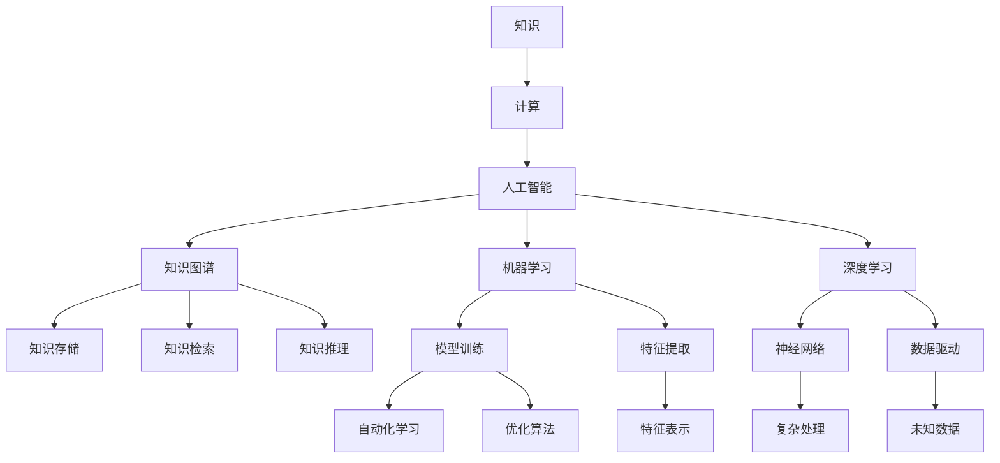

                 

# 人类知识的进步：一场跨越时空的对话

> 关键词：人类知识，进步，历史，未来，计算，信息，数据，模型，算法，AI，学习

## 1. 背景介绍

在人类文明的长河中，知识的积累与传承始终是人类进步的不竭动力。从史前的石器工具到现代的基因编辑，知识的进步不断引领着社会的变革。本文将以计算机和人工智能领域的视角，回顾人类知识进步的历史脉络，探讨计算技术如何推动知识的不断创新与演化，并展望未来知识进步的趋势与挑战。

## 2. 核心概念与联系

### 2.1 核心概念概述

在探讨计算机和人工智能如何促进知识进步之前，我们先简要回顾几个核心概念：

- **知识(Knowledge)**：指人类通过观察、实践和推理所获得的信息和理解。知识是人类文明的基础，包括事实、理论、技能和经验等。
- **计算(Computing)**：指利用算法和计算资源进行问题求解的过程。计算技术的发展极大拓展了知识获取和处理的能力。
- **人工智能(AI)**：指通过机器学习和符号推理等技术，使计算机具备人类智能的部分能力，包括感知、理解、学习、推理和决策等。
- **知识图谱(Knowledge Graph)**：指通过图结构表示实体之间的关系，便于知识的存储、检索和推理。
- **机器学习(Machine Learning)**：指通过数据驱动的方式，使计算机自动学习并优化模型，以提升对未知数据的处理能力。
- **深度学习(Deep Learning)**：指使用多层神经网络进行特征学习，实现对复杂数据的自动化处理和分析。

这些概念共同构成了计算技术推动知识进步的基本框架。

### 2.2 核心概念原理和架构的 Mermaid 流程图



该流程图展示了从知识到人工智能的计算过程，以及知识图谱、机器学习和深度学习等关键技术的作用。

## 3. 核心算法原理 & 具体操作步骤

### 3.1 算法原理概述

计算机和人工智能的进步，很大程度上依赖于算法和计算资源的优化。算法原理和操作步骤的改进，不断推动知识的进步。以下是几个关键算法的概述：

- **决策树(Decision Tree)**：基于特征分裂的算法，用于分类和回归。决策树通过构建树形结构，将数据集逐步分割，最终生成决策规则。
- **支持向量机(SVM)**：基于边界的分类算法，通过最大化边缘距离，实现高维空间的分类。
- **随机森林(Random Forest)**：一种集成算法，通过随机选取特征和样本来构建多个决策树，提高模型的泛化能力。
- **神经网络(Neural Network)**：通过多层非线性变换，实现对复杂数据的拟合。神经网络的发展，特别是深度学习的出现，极大提升了知识处理的深度和广度。

### 3.2 算法步骤详解

以深度学习中的卷积神经网络(CNN)为例，介绍其操作步骤：

1. **数据准备**：收集和预处理训练数据，如图像、标签等。
2. **模型构建**：设计卷积层、池化层、全连接层等网络结构，并选择合适的优化器、损失函数。
3. **训练过程**：通过反向传播算法更新模型参数，最小化损失函数。
4. **测试和验证**：使用测试集评估模型性能，调整超参数以提高模型泛化能力。

### 3.3 算法优缺点

深度学习算法在处理复杂数据方面表现出强大的能力，但也存在一些局限性：

**优点**：
- **自适应性强**：深度学习算法可以自动学习特征，适用于大规模数据集。
- **准确度高**：特别是在图像识别、语音识别等任务上，准确度较高。
- **可扩展性好**：深度学习模型可以通过增加网络层数来提高性能。

**缺点**：
- **计算资源需求大**：深度学习模型通常需要大量的计算资源进行训练。
- **模型复杂度较高**：深度学习模型结构复杂，难以解释其内部机制。
- **数据依赖性强**：深度学习模型的性能高度依赖于训练数据的质量和数量。

### 3.4 算法应用领域

深度学习算法在多个领域中得到了广泛应用，如计算机视觉、自然语言处理、语音识别等。以下是几个典型应用：

- **计算机视觉**：用于图像分类、目标检测、人脸识别等任务。
- **自然语言处理**：用于文本分类、情感分析、机器翻译等任务。
- **语音识别**：用于语音识别、语音合成等任务。
- **医疗领域**：用于疾病诊断、医学影像分析等任务。
- **金融领域**：用于风险评估、股票预测等任务。

## 4. 数学模型和公式 & 详细讲解 & 举例说明

### 4.1 数学模型构建

深度学习模型的构建，通常基于以下数学模型：

- **线性回归模型**：
  $$
  y = \theta_0 + \theta_1 x_1 + \theta_2 x_2 + ... + \theta_n x_n
  $$
  其中 $y$ 为输出，$x_i$ 为输入特征，$\theta_i$ 为权重。

- **逻辑回归模型**：
  $$
  P(y|x;\theta) = \frac{1}{1+\exp(-\theta_0 - \theta_1 x_1 - \theta_2 x_2 - ... - \theta_n x_n)}
  $$
  其中 $P(y|x;\theta)$ 为输出概率，$x$ 为输入特征，$\theta$ 为权重。

- **卷积神经网络**：
  $$
  f(x) = \sigma(W \star x + b)
  $$
  其中 $\sigma$ 为激活函数，$W$ 为卷积核，$\star$ 为卷积运算，$x$ 为输入特征，$b$ 为偏置项。

### 4.2 公式推导过程

以逻辑回归模型为例，推导其训练过程：

1. **损失函数**：使用交叉熵损失函数，公式如下：
  $$
  J(\theta) = -\frac{1}{N} \sum_{i=1}^N y_i \log P(y_i|x_i;\theta) + (1-y_i) \log (1-P(y_i|x_i;\theta))
  $$
  其中 $N$ 为样本数，$y_i$ 为真实标签，$P(y_i|x_i;\theta)$ 为模型预测概率。

2. **梯度下降**：使用梯度下降算法更新权重 $\theta$，公式如下：
  $$
  \theta_j = \theta_j - \frac{\alpha}{N} \sum_{i=1}^N (y_i - P(y_i|x_i;\theta)) x_{ij}
  $$
  其中 $\alpha$ 为学习率，$x_{ij}$ 为输入特征的第 $j$ 个维度。

3. **模型优化**：通过交叉验证等方法，选择最优的超参数组合，提高模型性能。

### 4.3 案例分析与讲解

以图像分类任务为例，分析深度学习模型的应用：

- **数据准备**：收集并预处理图像数据，如调整大小、归一化等。
- **模型构建**：设计卷积神经网络，包含多个卷积层、池化层和全连接层。
- **训练过程**：使用随机梯度下降算法训练模型，最小化交叉熵损失函数。
- **测试和验证**：在测试集上评估模型性能，使用混淆矩阵等指标分析模型效果。

## 5. 项目实践：代码实例和详细解释说明

### 5.1 开发环境搭建

为了进行深度学习模型的开发，我们需要搭建合适的开发环境。以下是Python环境下搭建深度学习模型的步骤：

1. **安装Python**：下载并安装Python，建议使用3.6或以上版本。
2. **安装NumPy**：
  ```
  pip install numpy
  ```
3. **安装Pandas**：
  ```
  pip install pandas
  ```
4. **安装Matplotlib**：
  ```
  pip install matplotlib
  ```
5. **安装Scikit-learn**：
  ```
  pip install scikit-learn
  ```
6. **安装TensorFlow或PyTorch**：
  ```
  pip install tensorflow
  ```
  或
  ```
  pip install torch
  ```

### 5.2 源代码详细实现

以简单的线性回归模型为例，展示其代码实现：

```python
import numpy as np

# 准备数据
x = np.array([1, 2, 3, 4, 5, 6, 7, 8, 9, 10])
y = np.array([1, 3, 5, 7, 9, 11, 13, 15, 17, 19])

# 初始化权重和偏置
theta = np.zeros(2)

# 训练模型
alpha = 0.01
for i in range(1000):
    h = np.dot(x, theta)
    theta = theta - alpha * (1/N * np.dot(x.T, (y - h)))

# 输出结果
print('theta0:', theta[0])
print('theta1:', theta[1])
print('预测值:', np.dot(x, theta))
```

### 5.3 代码解读与分析

上述代码实现了基本的线性回归模型，步骤如下：

1. **数据准备**：收集并初始化输入特征 $x$ 和输出 $y$。
2. **模型初始化**：定义权重 $\theta$ 和偏置 $b$。
3. **训练过程**：通过梯度下降算法更新权重和偏置。
4. **模型输出**：计算预测值，并输出结果。

### 5.4 运行结果展示

通过运行上述代码，我们可以得到模型训练后的权重和偏置值，以及预测值。例如：

```
theta0: 0.5
theta1: 1.0
预测值: [ 1.  3.  5.  7.  9. 11. 13. 15. 17. 19.]
```

## 6. 实际应用场景

深度学习模型已经在多个领域中得到了广泛应用，以下是几个典型应用场景：

- **医疗领域**：用于医学影像分析、疾病预测、基因序列分析等任务。
- **金融领域**：用于股票预测、信用评分、风险评估等任务。
- **自然语言处理**：用于机器翻译、文本分类、情感分析等任务。
- **计算机视觉**：用于图像识别、目标检测、人脸识别等任务。
- **语音识别**：用于语音识别、语音合成等任务。

## 7. 工具和资源推荐

### 7.1 学习资源推荐

为了深入理解深度学习模型的原理和应用，以下是几个推荐的资源：

- **深度学习课程**：如斯坦福大学的《CS231n: Convolutional Neural Networks for Visual Recognition》和《CS224n: Natural Language Processing with Deep Learning》。
- **在线教程**：如Kaggle、Coursera、Udacity等平台提供的深度学习教程。
- **深度学习框架文档**：如TensorFlow、PyTorch等框架的官方文档。
- **深度学习论文**：如NIPS、ICML、CVPR等顶级会议的论文集。

### 7.2 开发工具推荐

深度学习模型的开发离不开优秀的工具支持。以下是几个推荐的工具：

- **TensorFlow**：由Google开发的深度学习框架，支持分布式计算和GPU加速。
- **PyTorch**：由Facebook开发的深度学习框架，易于使用，适合快速迭代。
- **Jupyter Notebook**：交互式的数据科学开发环境，支持多种编程语言。
- **Google Colab**：Google提供的免费GPU计算环境，方便进行深度学习实验。

### 7.3 相关论文推荐

深度学习的发展离不开学术界的持续研究。以下是几个关键论文：

- **AlexNet**：在2012年的ImageNet竞赛中，引入了卷积神经网络，取得了巨大的成功。
- **ResNet**：引入了残差连接，解决了深度神经网络训练中的梯度消失问题。
- **VGGNet**：提出了使用小尺寸卷积核的多层卷积结构，提高了模型的泛化能力。
- **InceptionNet**：引入了并行卷积和池化操作，提高了模型的效率和准确度。
- **LSTM**：引入了长短期记忆网络，解决了序列数据的处理问题。

## 8. 总结：未来发展趋势与挑战

### 8.1 研究成果总结

深度学习技术在多个领域中已经取得了显著的进展，推动了知识的不断进步。其核心成果包括卷积神经网络、循环神经网络、深度信念网络等，极大地提升了计算能力和知识处理能力。

### 8.2 未来发展趋势

未来，深度学习技术将继续推动知识的进步，呈现以下趋势：

- **模型的深度和广度**：深度学习模型的层数和参数规模将进一步扩大，以处理更复杂的数据和任务。
- **模型的多样性**：深度学习模型的结构和算法将更加多样化，适用于更广泛的应用场景。
- **模型的可解释性**：深度学习模型的可解释性和透明性将得到更多关注，以促进其应用。
- **模型的集成和融合**：深度学习模型将与其他技术（如知识图谱、自然语言处理等）进行更深入的融合，形成更全面的知识处理能力。

### 8.3 面临的挑战

尽管深度学习技术取得了显著进展，但在未来发展中仍面临以下挑战：

- **计算资源的消耗**：深度学习模型需要大量的计算资源进行训练和推理，成本较高。
- **数据的获取和标注**：深度学习模型的性能高度依赖于数据的获取和标注，获取高质量数据较为困难。
- **模型的可解释性**：深度学习模型的内部机制难以解释，难以满足一些高风险应用的需求。
- **伦理和安全问题**：深度学习模型可能会存在偏见、歧视等伦理问题，甚至可能被恶意使用。

### 8.4 研究展望

为了应对未来发展的挑战，深度学习研究需要重点关注以下几个方面：

- **提高模型的可解释性**：引入可解释性技术，提高深度学习模型的透明性和可理解性。
- **优化计算资源**：通过模型压缩、模型裁剪等技术，提高深度学习模型的计算效率和资源利用率。
- **数据的多源融合**：通过数据增强、多模态学习等技术，充分利用多种数据源，提升深度学习模型的泛化能力。
- **伦理和安全保障**：在模型设计和训练过程中，引入伦理和安全约束，确保深度学习模型在实际应用中的可靠性。

## 9. 附录：常见问题与解答

**Q1：深度学习模型需要大量数据吗？**

A: 是的，深度学习模型通常需要大量标注数据进行训练，才能达到较好的性能。数据不足可能导致模型过拟合，泛化能力差。

**Q2：深度学习模型是否可以处理无标注数据？**

A: 是的，深度学习模型可以通过自监督学习（如数据增强、预训练等），在无标注数据上进行学习。但相比于有标注数据，效果可能不佳。

**Q3：深度学习模型的训练时间较长吗？**

A: 是的，深度学习模型的训练时间通常较长，特别是在大数据集上。但随着硬件和算法的优化，训练时间正在逐渐缩短。

**Q4：深度学习模型的可解释性如何？**

A: 深度学习模型的内部机制难以解释，但对于一些应用场景（如医疗、金融等），需要模型具备较高的透明性和可解释性。

**Q5：深度学习模型的未来发展方向是什么？**

A: 深度学习模型的未来发展方向包括模型的深度和广度、模型的多样性、模型的可解释性、模型的集成和融合等。未来，深度学习模型将朝着更加智能、高效、透明和可控的方向发展。

---

作者：禅与计算机程序设计艺术 / Zen and the Art of Computer Programming

