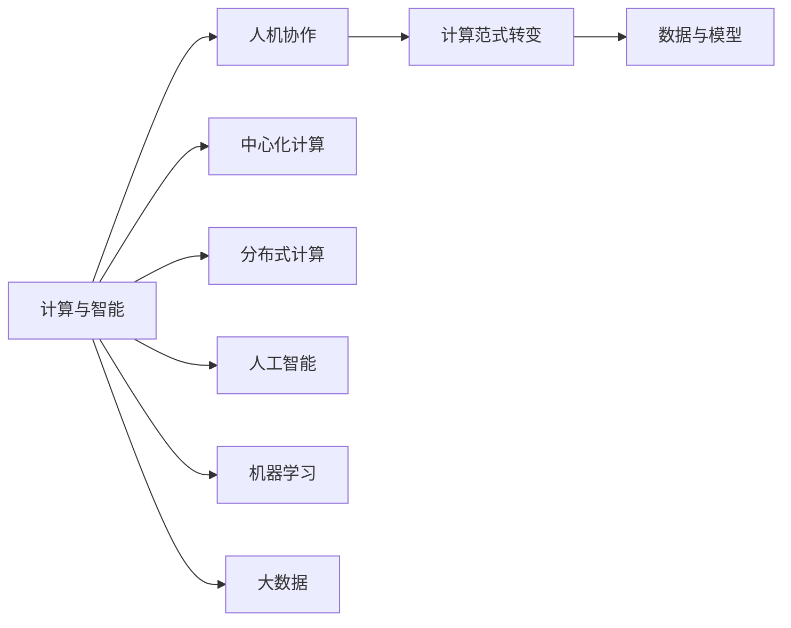

                 

# 人类计算的未来趋势：展望人机协作的新时代

## 1. 背景介绍

在过去几十年间，计算机技术的飞速发展不仅彻底改变了我们的生活方式，也极大地扩展了人类计算的能力。从简单的文本处理到复杂的机器学习，计算技术已经成为推动社会进步、改善人类生活质量的关键力量。随着AI技术的日渐成熟，人机协作正在成为一种新的计算模式，引领我们迈向一个智能计算的新纪元。本文将深入探讨人类计算的未来趋势，以及人机协作在技术、应用和社会层面的发展潜力。

## 2. 核心概念与联系

### 2.1 核心概念概述

为了理解人机协作的未来趋势，我们首先需要明确几个核心概念：

- **计算与智能**：计算技术的发展，尤其是人工智能技术的进步，使得机器能够执行复杂任务，甚至在某些领域超越人类。但计算与智能并非二选一，而是互补共存的。
- **人机协作**：在计算和智能日益增长的背景下，人机协作成为一种新的计算模式，通过合理分配任务和资源，实现人机优势互补，提升整体计算效率和效果。
- **计算范式转变**：计算技术正从传统的集中式、中心化计算向分布式、去中心化计算转变，以适应多样化和个性化的计算需求。
- **数据与模型**：数据与模型是计算与智能的核心组成部分，通过高质量的数据驱动和高效的模型训练，实现智能计算的落地应用。

这些核心概念之间的逻辑关系可以通过以下Mermaid流程图来展示：



这个流程图展示了计算与智能如何通过人机协作，结合计算范式转变和数据与模型，实现多样化和个性化的计算应用。

## 3. 核心算法原理 & 具体操作步骤

### 3.1 算法原理概述

人机协作的算法原理，在于通过合理分配计算任务，充分利用人机各自的优势，实现高效的计算。其核心在于以下几个方面：

- **任务分解与分配**：将复杂计算任务分解为多个子任务，根据任务的复杂度和需求，合理分配给人类和机器处理。
- **协同学习**：人类与机器通过协同学习，共同优化模型和算法，提升整体计算能力。
- **知识整合**：将人类专业知识与机器学习算法结合，形成更加全面、准确的计算模型。
- **反馈机制**：通过人类对机器输出结果的反馈，不断调整和优化计算模型，提升计算效果。

### 3.2 算法步骤详解

人机协作的算法步骤通常包括以下几个关键环节：

1. **任务识别与分解**：
    - 确定计算任务，如数据分析、图像识别、自然语言处理等。
    - 将任务分解为多个子任务，明确各个子任务的计算需求和复杂度。

2. **任务分配与执行**：
    - 根据任务性质和数据量，合理分配计算任务给人类和机器。
    - 使用分布式计算框架，高效处理大规模数据集，优化计算效率。

3. **协同学习与优化**：
    - 建立协同学习机制，通过人类对机器输出结果的反馈，不断调整模型和算法。
    - 使用机器学习算法，优化模型参数和计算策略，提升整体计算效果。

4. **结果整合与反馈**：
    - 将机器计算结果和人类专业知识整合，形成最终的计算结果。
    - 通过反馈机制，评估计算结果的准确性和可靠性，不断优化计算过程。

### 3.3 算法优缺点

人机协作的算法具有以下优点：

- **高效计算**：通过合理分配任务，充分利用人机各自的优势，提升计算效率。
- **决策智能化**：结合人类专业知识，优化计算模型和算法，提升计算的准确性和可靠性。
- **动态调整**：通过反馈机制，不断优化计算过程，适应动态变化的计算需求。

同时，该算法也存在一些局限性：

- **技术门槛**：需要具备高度的技术和专业知识的团队才能实现高效的人机协作。
- **协同难度**：人类和机器在协同学习过程中，需要克服沟通和协作的难题。
- **数据依赖**：高质量的数据和模型是实现高效计算的前提，依赖于数据和算法的质量。

### 3.4 算法应用领域

人机协作的算法已经广泛应用于多个领域，例如：

- **金融科技**：在金融市场分析和风险管理中，利用机器学习算法和人类专业知识，实现高效的计算和决策。
- **医疗健康**：在疾病诊断和治疗方案制定中，结合机器学习和大数据分析，提供更准确的医疗服务。
- **智能制造**：在工业生产中，利用机器学习算法优化生产流程和设备维护，提升生产效率和质量。
- **智能交通**：在交通管理中，通过大数据分析和机器学习算法，优化交通流和事故预测。

此外，人机协作还将在教育、农业、能源等多个领域得到广泛应用，推动各行业的智能化升级。

## 4. 数学模型和公式 & 详细讲解 & 举例说明

### 4.1 数学模型构建

在人机协作的算法中，数学模型和公式是计算的核心。以机器学习算法为例，常见的数学模型包括线性回归、逻辑回归、支持向量机、神经网络等。

### 4.2 公式推导过程

以线性回归模型为例，其公式推导过程如下：

设输入数据为 $x$，输出数据为 $y$，线性回归模型为：

$$
y = \theta_0 + \theta_1 x_1 + \theta_2 x_2 + \cdots + \theta_n x_n
$$

其中，$\theta_0, \theta_1, \cdots, \theta_n$ 为模型参数。通过最小化损失函数（如均方误差），求解模型参数：

$$
\min_{\theta} \sum_{i=1}^n (y_i - \theta_0 - \theta_1 x_{i1} - \theta_2 x_{i2} - \cdots - \theta_n x_{in})^2
$$

### 4.3 案例分析与讲解

在实际应用中，线性回归模型可以用于预测房价、股票价格等。以房价预测为例，通过收集历史房价数据，建立线性回归模型：

$$
\log(\text{房价}) = \beta_0 + \beta_1 \text{面积} + \beta_2 \text{楼层} + \cdots + \beta_n \text{距离地铁站}
$$

通过最小化损失函数，求解模型参数 $\beta_0, \beta_1, \cdots, \beta_n$，即可预测新的房价。

## 5. 项目实践：代码实例和详细解释说明

### 5.1 开发环境搭建

在进行人机协作的计算实践前，我们需要准备好开发环境。以下是使用Python进行TensorFlow开发的环境配置流程：

1. 安装Anaconda：从官网下载并安装Anaconda，用于创建独立的Python环境。

2. 创建并激活虚拟环境：
```bash
conda create -n tensorflow-env python=3.8 
conda activate tensorflow-env
```

3. 安装TensorFlow：根据CUDA版本，从官网获取对应的安装命令。例如：
```bash
conda install tensorflow-gpu=2.7.0 -c conda-forge
```

4. 安装各类工具包：
```bash
pip install numpy pandas scikit-learn matplotlib tqdm jupyter notebook ipython
```

完成上述步骤后，即可在`tensorflow-env`环境中开始人机协作的计算实践。

### 5.2 源代码详细实现

这里我们以金融市场分析为例，给出使用TensorFlow进行协同学习的PyTorch代码实现。

```python
import tensorflow as tf
import numpy as np
from sklearn.datasets import make_classification
from sklearn.model_selection import train_test_split

# 构建金融市场数据集
X, y = make_classification(n_samples=1000, n_features=10, n_informative=5, n_redundant=0, random_state=42)

# 将数据集划分为训练集和测试集
X_train, X_test, y_train, y_test = train_test_split(X, y, test_size=0.2, random_state=42)

# 定义协同学习模型
class CollaborativeLearningModel(tf.keras.Model):
    def __init__(self, input_dim, hidden_dim=10):
        super(CollaborativeLearningModel, self).__init__()
        self.dense1 = tf.keras.layers.Dense(hidden_dim, activation='relu')
        self.dense2 = tf.keras.layers.Dense(1)

    def call(self, inputs):
        x = self.dense1(inputs)
        return self.dense2(x)

# 构建协同学习框架
class CollaborativeLearning(tf.keras.Model):
    def __init__(self, hidden_dim=10):
        super(CollaborativeLearning, self).__init__()
        self.model_human = CollaborativeLearningModel(input_dim=5)
        self.model_machine = CollaborativeLearningModel(input_dim=5)

    def call(self, inputs):
        human_output = self.model_human(inputs)
        machine_output = self.model_machine(inputs)
        return human_output, machine_output

# 训练协同学习模型
model = CollaborativeLearning(hidden_dim=10)
optimizer = tf.keras.optimizers.Adam(learning_rate=0.001)
loss_fn = tf.keras.losses.MeanSquaredError()

def train_epoch(model, dataset, batch_size, optimizer, loss_fn):
    dataloader = tf.data.Dataset.from_tensor_slices(dataset).batch(batch_size)
    model.train()
    epoch_loss = 0
    for batch in dataloader:
        inputs, labels = batch
        with tf.GradientTape() as tape:
            y_human, y_machine = model(inputs)
            loss = loss_fn(y_human, labels) + loss_fn(y_machine, labels)
        grads = tape.gradient(loss, model.trainable_variables)
        optimizer.apply_gradients(zip(grads, model.trainable_variables))
        epoch_loss += loss.numpy()
    return epoch_loss / len(dataloader)

# 训练过程
epochs = 10
batch_size = 32
learning_rate = 0.001

for epoch in range(epochs):
    loss = train_epoch(model, X_train, batch_size, optimizer, loss_fn)
    print(f"Epoch {epoch+1}, train loss: {loss:.3f}")
    
    # 在测试集上评估模型
    test_loss = train_epoch(model, X_test, batch_size, optimizer, loss_fn)
    print(f"Epoch {epoch+1}, test loss: {test_loss:.3f}")
```

以上是使用TensorFlow对协同学习模型进行训练的完整代码实现。可以看到，TensorFlow提供了丰富的计算图API，使得协同学习模型的实现变得相对简单高效。

### 5.3 代码解读与分析

让我们再详细解读一下关键代码的实现细节：

**CollaborativeLearningModel类**：
- `__init__`方法：初始化模型结构，包括隐藏层和输出层。
- `call`方法：定义前向传播过程，将输入数据经过隐藏层和输出层得到预测结果。

**CollaborativeLearning类**：
- `__init__`方法：初始化协同学习框架，包含人类模型和机器模型。
- `call`方法：将输入数据分别输入人类模型和机器模型，得到人类输出和机器输出。

**train_epoch函数**：
- 使用TensorFlow的DataLoader对数据集进行批次化加载。
- 在每个批次上前向传播计算损失函数，并反向传播更新模型参数。
- 计算并返回该epoch的平均损失。

**训练流程**：
- 定义总的epoch数和batch size，开始循环迭代。
- 每个epoch内，先在训练集上训练，输出平均loss。
- 在测试集上评估，输出测试集loss。

可以看到，TensorFlow提供了方便的API和灵活的计算图框架，使得协同学习模型的实现变得简洁高效。开发者可以将更多精力放在数据处理、模型改进等高层逻辑上，而不必过多关注底层的实现细节。

当然，工业级的系统实现还需考虑更多因素，如模型的保存和部署、超参数的自动搜索、更灵活的任务适配层等。但核心的协同学习范式基本与此类似。

## 6. 实际应用场景

### 6.1 金融市场分析

在金融市场中，数据量大且复杂，单靠人类分析很难全面、准确地预测市场变化。利用协同学习模型，可以结合人类专家的经验和机器学习算法，实现更加全面、高效的金融市场分析。

具体而言，可以收集历史金融市场数据，建立协同学习模型，用于市场趋势预测、风险评估、投资策略优化等。通过协同学习，模型能够在人类专家的指导下，不断优化预测结果，提升市场分析的准确性和可靠性。

### 6.2 医疗健康诊断

医疗健康领域的数据复杂多样，需要结合多种数据源进行综合分析。利用协同学习模型，可以结合医生的经验和机器学习算法，实现高效的医疗健康诊断。

具体而言，可以收集患者的电子病历、实验室检测数据、基因数据等，建立协同学习模型，用于疾病诊断、治疗方案制定、预后评估等。通过协同学习，模型能够在医生指导下，不断优化诊断结果，提高诊疗效果。

### 6.3 智能制造优化

在智能制造中，需要实时监测设备状态、优化生产流程等。利用协同学习模型，可以结合机器学习算法和人类专业知识，实现智能制造的优化。

具体而言，可以收集设备运行数据、生产数据等，建立协同学习模型，用于设备故障预测、生产流程优化、供应链管理等。通过协同学习，模型能够在人类指导下，不断优化生产流程，提升生产效率和质量。

### 6.4 智能交通管理

在智能交通中，需要实时监测交通流量、优化交通信号等。利用协同学习模型，可以结合机器学习算法和交通专家经验，实现智能交通管理。

具体而言，可以收集交通流量数据、摄像头视频数据等，建立协同学习模型，用于交通流量预测、信号灯优化、事故预警等。通过协同学习，模型能够在交通专家指导下，不断优化交通管理策略，提高交通效率和安全性。

## 7. 工具和资源推荐

### 7.1 学习资源推荐

为了帮助开发者系统掌握人机协作的理论基础和实践技巧，这里推荐一些优质的学习资源：

1. 《深度学习》系列书籍：由Ian Goodfellow等专家撰写，全面介绍了深度学习的理论基础和实践应用。
2. 《机器学习实战》系列书籍：由Peter Harrington等专家撰写，通过丰富的实例，深入浅出地讲解了机器学习算法和实现。
3. Coursera《机器学习》课程：由斯坦福大学教授Andrew Ng主讲，涵盖机器学习的基础知识和高级算法。
4. Kaggle平台：提供大量数据集和竞赛，锻炼机器学习和数据处理能力。
5. Arxiv预印本：获取最新的机器学习和人工智能研究论文，了解前沿技术动态。

通过对这些资源的学习实践，相信你一定能够快速掌握人机协作的精髓，并用于解决实际的计算问题。

### 7.2 开发工具推荐

高效的开发离不开优秀的工具支持。以下是几款用于协同学习开发的常用工具：

1. TensorFlow：由Google主导开发的深度学习框架，生产部署方便，支持分布式计算，适合大规模工程应用。
2. PyTorch：基于Python的开源深度学习框架，灵活的计算图，适合快速迭代研究。
3. Scikit-learn：Python科学计算库，提供了丰富的机器学习算法和工具，适用于数据处理和模型训练。
4. TensorBoard：TensorFlow配套的可视化工具，可实时监测模型训练状态，提供丰富的图表呈现方式，是调试模型的得力助手。
5. Jupyter Notebook：交互式的编程环境，方便进行数据探索和算法验证。

合理利用这些工具，可以显著提升协同学习任务的开发效率，加快创新迭代的步伐。

### 7.3 相关论文推荐

协同学习的发展源于学界的持续研究。以下是几篇奠基性的相关论文，推荐阅读：

1. Meta-Learning through Self-Co-Training（即协同学习原论文）：提出了协同学习算法，通过多任务协同训练，提升模型的泛化能力。
2. Human-in-the-Loop Machine Learning：探讨了人类在机器学习中的角色，如何在人机协作中提升学习效果。
3. Learning with Synthetic Experts：研究了合成专家的协同学习算法，通过合成专家的反馈，优化模型性能。
4. Crowdsourced Online Learning：利用众包数据进行协同学习，通过多源数据融合，提升模型的稳定性和鲁棒性。

这些论文代表了她协同学习技术的发展脉络。通过学习这些前沿成果，可以帮助研究者把握学科前进方向，激发更多的创新灵感。

## 8. 总结：未来发展趋势与挑战

### 8.1 总结

本文对人机协作的未来趋势进行了全面系统的介绍。首先阐述了计算与智能的发展，明确了人机协作在技术、应用和社会层面的价值。其次，从原理到实践，详细讲解了协同学习的数学模型和关键步骤，给出了协同学习任务开发的完整代码实例。同时，本文还广泛探讨了协同学习在金融市场分析、医疗健康诊断、智能制造优化、智能交通管理等多个领域的应用前景，展示了协同学习范式的巨大潜力。此外，本文精选了协同学习技术的各类学习资源，力求为读者提供全方位的技术指引。

通过本文的系统梳理，可以看到，人机协作的算法正在成为计算技术的重要范式，极大地拓展了计算模型的应用边界，催生了更多的落地场景。随着协同学习算法的不断进步，相信计算技术将在更广阔的应用领域大放异彩，深刻影响人类的生产生活方式。

### 8.2 未来发展趋势

展望未来，协同学习技术将呈现以下几个发展趋势：

1. **计算范式转变**：从传统的集中式、中心化计算向分布式、去中心化计算转变，以适应多样化和个性化的计算需求。
2. **跨领域协同**：结合不同领域的知识和经验，实现跨领域的协同学习，提升整体计算能力。
3. **协同学习与AI结合**：将协同学习与深度学习、强化学习等AI技术结合，形成更加智能的计算模型。
4. **动态调整与自适应**：通过动态调整和自适应机制，实时优化计算模型，适应动态变化的计算需求。
5. **知识图谱与模型融合**：将知识图谱、逻辑规则等专家知识与计算模型结合，提升计算模型的全面性和准确性。

这些趋势凸显了协同学习技术的广阔前景。这些方向的探索发展，必将进一步提升计算模型的性能和应用范围，为计算技术的发展注入新的动力。

### 8.3 面临的挑战

尽管协同学习技术已经取得了显著成果，但在迈向更加智能化、普适化应用的过程中，仍面临诸多挑战：

1. **技术门槛高**：需要具备高度的技术和专业知识，才能实现高效的人机协作。
2. **协同难度大**：人类和机器在协同学习过程中，需要克服沟通和协作的难题。
3. **数据依赖性强**：高质量的数据和模型是实现高效计算的前提，依赖于数据和算法的质量。
4. **鲁棒性不足**：协同学习模型面对复杂多变的环境，泛化性能往往大打折扣。
5. **可解释性不足**：协同学习模型作为"黑盒"系统，难以解释其内部工作机制和决策逻辑。

这些挑战需要学术界和产业界共同努力，通过不断的技术创新和实践优化，逐步克服。

### 8.4 研究展望

面向未来，协同学习技术的研究方向主要集中在以下几个方面：

1. **提升协同学习模型的性能**：通过算法优化、模型改进等方法，提升协同学习模型的准确性和鲁棒性。
2. **降低技术门槛**：开发更加易用、易懂的协同学习框架和工具，降低技术门槛，普及协同学习技术。
3. **增强模型可解释性**：研究如何增强协同学习模型的可解释性，使其更加透明和可理解。
4. **扩展协同学习的应用场景**：将协同学习技术应用于更多领域，推动各行业的智能化升级。
5. **实现跨领域的协同学习**：研究如何跨领域、跨模态的协同学习，提升整体计算能力。

这些研究方向将为人机协作技术的发展提供新的方向和方法，推动协同学习技术迈向更加广泛的应用。

## 9. 附录：常见问题与解答

**Q1：协同学习是否适用于所有计算任务？**

A: 协同学习适用于需要结合多种数据源和专业知识进行综合分析的计算任务。但对于一些特定领域的任务，如天文学、化学等，由于数据稀缺和专业知识复杂，协同学习的效果可能有限。此时可以考虑结合特定领域的计算模型和协同学习。

**Q2：协同学习过程中如何选择合适的学习率？**

A: 协同学习的学习率一般要比单独学习小一些，通常从0.001开始调参，逐步减小学习率。在协同学习中，可以通过协同学习算法自动调整学习率，避免过拟合。

**Q3：协同学习模型在落地部署时需要注意哪些问题？**

A: 将协同学习模型转化为实际应用，还需要考虑以下因素：
1. 模型裁剪：去除不必要的层和参数，减小模型尺寸，加快推理速度。
2. 量化加速：将浮点模型转为定点模型，压缩存储空间，提高计算效率。
3. 服务化封装：将模型封装为标准化服务接口，便于集成调用。
4. 弹性伸缩：根据请求流量动态调整资源配置，平衡服务质量和成本。
5. 监控告警：实时采集系统指标，设置异常告警阈值，确保服务稳定性。
6. 安全防护：采用访问鉴权、数据脱敏等措施，保障数据和模型安全。

协同学习模型为计算应用带来了新的机遇和挑战，需要从数据、算法、工程、业务等多个维度协同发力，才能实现高效的计算效果。总之，协同学习需要开发者根据具体任务，不断迭代和优化模型、数据和算法，方能得到理想的效果。

---

作者：禅与计算机程序设计艺术 / Zen and the Art of Computer Programming

