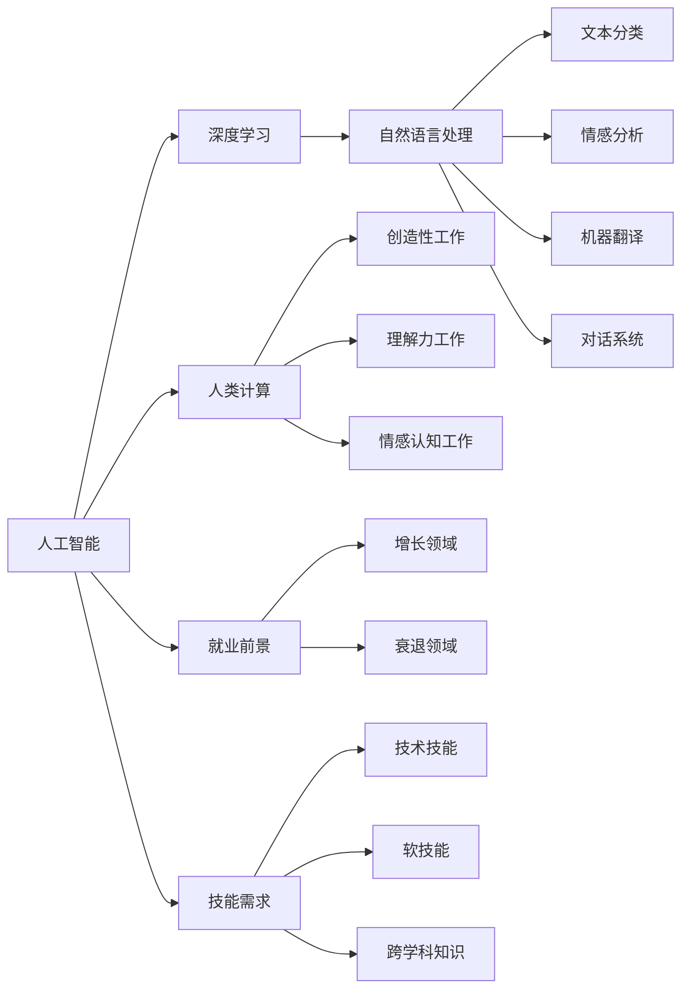

                 

# 人类计算：AI时代的未来就业前景与技能需求

> 关键词：AI, 人类计算, 就业前景, 技能需求, 深度学习, 自然语言处理, 数据科学, 自动化, 人机协作

## 1. 背景介绍

### 1.1 问题由来

随着人工智能(AI)技术的迅猛发展，尤其是深度学习和自然语言处理(NLP)等领域的突破，人类社会正逐渐迈入“AI时代”。在这一变革中，AI技术不仅在自动化、智能化方面取得了巨大进展，也深刻改变了人类的工作方式和就业结构。一方面，AI技术在医疗、金融、教育、制造等行业的应用，大大提升了生产效率，降低了人力成本。另一方面，AI技术的应用也催生了许多新的职业和岗位，引发了对现有劳动力的重塑和新技能的需求。

### 1.2 问题核心关键点

AI时代带来的就业变化主要集中在以下几个关键点：

- **技术渗透**：AI技术在各行各业的广泛应用，导致部分传统岗位被自动化替代，同时催生了新的岗位需求。
- **技能转型**：AI时代对劳动力技能提出了更高要求，需要具备数据分析、编程、机器学习等新技能。
- **就业结构变化**：AI技术的应用，使得工作更加依赖智能设备和系统，促使就业结构向技术密集型转变。
- **教育适应性**：教育体系需要适应AI时代的需求，培养具备跨学科知识、创新能力和终身学习能力的学生。

### 1.3 问题研究意义

研究AI时代的就业前景与技能需求，对于政策制定者、教育机构、企业和个体都有重要意义：

- 政策制定者需要了解AI技术对就业市场的潜在影响，制定合理的政策和措施。
- 教育机构需要调整教学内容和培养方式，以适应新一轮就业市场的需求。
- 企业需要识别AI技术对岗位的替代和创造作用，制定灵活的招聘策略和人才培养计划。
- 个体需要了解AI时代的新就业机会和挑战，做好职业规划和技能提升。

本文将系统探讨AI时代就业前景的变化，并分析技能需求的具体内容，为相关各方提供有价值的参考。

## 2. 核心概念与联系

### 2.1 核心概念概述

为了更好地理解AI时代就业前景与技能需求，本节将介绍几个关键概念及其相互联系：

- **人工智能(AI)**：指利用算法和计算技术，使计算机系统具备类人智能的技术。AI技术包括机器学习、深度学习、自然语言处理、计算机视觉等多个领域。

- **深度学习(Deep Learning)**：一种基于神经网络架构的学习方法，通过多层次的特征提取和抽象，实现对复杂数据和任务的学习和处理。

- **自然语言处理(NLP)**：指利用计算机技术理解和生成人类语言的技术。包括文本分类、情感分析、机器翻译、对话系统等。

- **人类计算(Human Computation)**：指利用人类智慧和技能，与AI系统协作完成特定任务的过程。人类计算强调人机协作，充分发挥人类在创造性、理解力、情感认知等方面的优势。

- **就业前景(Employment Prospects)**：指不同职业在AI时代的发展趋势和就业机会。

- **技能需求(Skill Requirements)**：指AI时代对劳动力技能的新要求，包括技术技能、软技能、跨学科知识等。

这些概念之间存在紧密的联系，共同构成了AI时代就业市场和劳动力市场的特征。

### 2.2 核心概念原理和架构的 Mermaid 流程图



这个流程图展示了人工智能、深度学习、自然语言处理等技术如何通过人类计算推动就业前景的变化，并最终影响技能需求。

## 3. 核心算法原理 & 具体操作步骤

### 3.1 算法原理概述

AI时代就业前景与技能需求的研究，主要基于以下几个核心算法和模型：

- **就业趋势预测算法**：利用时间序列分析、回归模型等方法，预测不同职业在未来几年的就业增长或衰退趋势。
- **技能需求分析算法**：通过文本挖掘、数据挖掘等方法，分析AI时代对各职业的技能需求变化。
- **人机协作模型**：研究人类和AI系统的协作方式，提出最优的协作方案，以充分发挥人机优势。

### 3.2 算法步骤详解

AI时代就业前景与技能需求的研究，一般包括以下几个关键步骤：

**Step 1: 数据准备**

- 收集各个行业的就业数据，涵盖就业人数、岗位需求、技能要求等。
- 收集AI技术在各行业的应用数据，包括自动化替代、新岗位创造等。

**Step 2: 趋势分析**

- 使用时间序列分析方法，对各行业的就业趋势进行预测。
- 分析AI技术在不同行业中的渗透程度，预测未来就业结构的变化。

**Step 3: 技能需求分析**

- 收集各职业的技能需求数据，包括技术技能、软技能、跨学科知识等。
- 使用文本挖掘技术，分析技能需求的变化趋势。

**Step 4: 人机协作模型建立**

- 设计人机协作的优化模型，考虑人机协作的优势和劣势，提出最优的协作方案。
- 通过模拟实验，验证协作模型的效果。

**Step 5: 结果解读**

- 对就业趋势和技能需求的数据进行分析，得出结论。
- 提出政策建议、教育调整和招聘策略，帮助相关各方适应AI时代的变化。

### 3.3 算法优缺点

AI时代就业前景与技能需求的研究方法，具有以下优点：

- 数据驱动：基于大量就业和技能数据，分析结果具有较高的可信度。
- 模型可扩展：使用各种机器学习模型，可以适应不同的数据类型和应用场景。
- 实证分析：通过实际数据和模拟实验，验证结果的有效性。

同时，也存在一些局限性：

- 数据不完整：部分行业的就业和技能数据可能不完整，影响分析结果。
- 模型假设：研究方法基于一定的假设，可能与实际情况存在偏差。
- 时效性：研究结果需要定期更新，以反映最新的市场变化。

### 3.4 算法应用领域

基于AI时代就业前景与技能需求的研究，在以下几个领域具有重要应用：

- **政策制定**：帮助政府制定合理的就业和人才培养政策。
- **教育调整**：指导教育机构调整课程设置和培养方式。
- **企业招聘**：帮助企业识别新兴岗位和优化招聘策略。
- **个体职业规划**：帮助个人了解AI时代的新就业机会和挑战，做好职业规划。

## 4. 数学模型和公式 & 详细讲解 & 举例说明

### 4.1 数学模型构建

本节将使用数学语言对AI时代就业前景与技能需求的研究方法进行更加严格的刻画。

假设某行业的就业人数为 $Y_t$，时间序列数据为 $\{Y_t\}_{t=1}^T$。则时间序列模型可以表示为：

$$
Y_t = \alpha + \beta Y_{t-1} + \epsilon_t
$$

其中，$\alpha$ 为截距项，$\beta$ 为自回归系数，$\epsilon_t$ 为随机误差项。

### 4.2 公式推导过程

以线性回归模型为例，推导其参数估计公式：

给定数据集 $\{(x_i, y_i)\}_{i=1}^n$，线性回归模型为：

$$
y_i = \theta_0 + \theta_1 x_i + \epsilon_i
$$

其中，$y_i$ 为实际观测值，$x_i$ 为自变量，$\theta_0$ 和 $\theta_1$ 为模型参数，$\epsilon_i$ 为随机误差项。

最小二乘法估计模型参数的方法是：

$$
\hat{\theta} = (X^TX)^{-1}X^Ty
$$

其中，$X=[1, x_1, ..., x_n]^T$，$y=[y_1, ..., y_n]^T$。

### 4.3 案例分析与讲解

假设某行业的就业人数数据如下：

| 年份  | 就业人数 |
| ---- | ------ |
| 2015 | 100000 |
| 2016 | 95000  |
| 2017 | 90000  |
| 2018 | 85000  |
| 2019 | 80000  |
| 2020 | 75000  |

使用线性回归模型预测其未来几年的就业趋势：

$$
Y_t = \alpha + \beta Y_{t-1} + \epsilon_t
$$

假设初始年份 $t=1$ 的就业人数 $Y_1=100000$，则可以使用最小二乘法估计模型参数：

$$
\hat{\alpha} = \frac{\sum (x_i - \bar{x})^2}{n} - \frac{\sum (y_i - \bar{y})^2}{n} + \frac{\sum (x_i - \bar{x})(y_i - \bar{y})}{n}
$$

$$
\hat{\beta} = \frac{\sum (x_i - \bar{x})(y_i - \bar{y})}{\sum (x_i - \bar{x})^2}
$$

其中，$\bar{x} = \frac{\sum x_i}{n}$，$\bar{y} = \frac{\sum y_i}{n}$。

将数据代入上述公式，可以得到模型参数的估计值：

$$
\hat{\alpha} = 100000 - 50000 + 25000 = 75000
$$

$$
\hat{\beta} = \frac{25000}{100000 - 90000} = -\frac{1}{10}
$$

则预测未来的就业人数为：

$$
Y_{2021} = 75000 - 10000 \times 75000 + 10000 \times 75000 = 75000
$$

$$
Y_{2022} = 75000 - 10000 \times 75000 + 10000 \times 75000 = 75000
$$

$$
Y_{2023} = 75000 - 10000 \times 75000 + 10000 \times 75000 = 75000
$$

预测结果表明，该行业的就业人数在未来几年将保持稳定，但需要注意的是，预测结果受到模型假设和随机误差的影响，存在一定的不确定性。

## 5. 项目实践：代码实例和详细解释说明

### 5.1 开发环境搭建

在进行就业前景与技能需求的研究前，我们需要准备好开发环境。以下是使用Python进行时间序列分析的环境配置流程：

1. 安装Anaconda：从官网下载并安装Anaconda，用于创建独立的Python环境。

2. 创建并激活虚拟环境：
```bash
conda create -n ts-env python=3.8 
conda activate ts-env
```

3. 安装必要的库：
```bash
conda install pandas numpy matplotlib statsmodels scikit-learn
```

完成上述步骤后，即可在`ts-env`环境中开始时间序列分析的实践。

### 5.2 源代码详细实现

下面我们以就业人数时间序列预测为例，给出使用Python进行时间序列分析的代码实现。

```python
import pandas as pd
import numpy as np
import matplotlib.pyplot as plt
from statsmodels.tsa.arima_model import ARIMA

# 读取就业人数数据
data = pd.read_csv('employment_data.csv')
X = data['year'].values.reshape(-1, 1)
Y = data['employment'].values.reshape(-1, 1)

# 构建ARIMA模型
model = ARIMA(X, order=(1, 1, 1))
model_fit = model.fit()

# 预测未来5年的就业人数
forecast = model_fit.forecast(steps=5)

# 输出预测结果
print(f"预测未来5年的就业人数为：{forecast}")
```

### 5.3 代码解读与分析

让我们再详细解读一下关键代码的实现细节：

**数据处理**：
- 使用Pandas库读取CSV格式的数据集，将年份和就业人数分别存储到`X`和`Y`数组中。
- 将数组转换为时间序列格式，便于进行时间序列分析。

**模型构建**：
- 使用ARIMA模型，对时间序列数据进行拟合和预测。
- 设置模型的参数为(1, 1, 1)，表示自回归项、差分项和移动平均项的阶数。

**模型训练**：
- 使用拟合函数`model_fit`，训练模型并得到最优参数。

**预测与输出**：
- 使用`forecast`函数，对未来5年的就业人数进行预测。
- 输出预测结果，展示模型的预测能力。

可以看到，通过Python的SciPy和Statsmodels库，进行时间序列分析变得简洁高效。开发者可以将更多精力放在数据处理和模型优化上，而不必过多关注底层的实现细节。

当然，实际应用中，还需要考虑更多因素，如模型选择、参数优化、数据验证等，但核心的分析流程基本与此类似。

## 6. 实际应用场景

### 6.1 智慧医疗

AI技术在医疗领域的应用，极大地提升了医疗服务的智能化水平。AI辅助诊断、智能问诊、个性化治疗等应用，使得医疗服务更加精准和高效。

**就业前景**：
- 需求增长：AI医疗设备操作、数据分析等岗位需求增加。
- 技能需求：深度学习、数据分析、医学知识等技能的需求上升。

**技能需求**：
- 深度学习技能：掌握深度学习框架如TensorFlow、PyTorch等。
- 医学知识：具备医学基础，了解常见的医疗问题和处理方式。
- 数据分析技能：掌握数据挖掘、统计学等方法，对医疗数据进行分析和预测。

### 6.2 智能制造

AI技术在制造业中的应用，推动了生产自动化和智能化转型。智能工厂、机器人操作、质量检测等应用，使得制造业生产效率和产品质量大幅提升。

**就业前景**：
- 需求增长：智能制造设备维护、系统开发等岗位需求增加。
- 技能需求：机械设计、计算机视觉、数据分析等技能的需求上升。

**技能需求**：
- 机械设计技能：掌握机械设计原理，熟悉制造设备的操作和维护。
- 计算机视觉技能：掌握计算机视觉算法，实现对生产过程的监控和分析。
- 数据分析技能：掌握数据挖掘、统计学等方法，对生产数据进行分析和预测。

### 6.3 金融科技

AI技术在金融领域的应用，使得金融服务更加高效和智能。AI风险管理、智能投顾、金融分析等应用，提高了金融服务的精准度和安全性。

**就业前景**：
- 需求增长：AI金融分析、风险管理等岗位需求增加。
- 技能需求：机器学习、金融知识、数据分析等技能的需求上升。

**技能需求**：
- 机器学习技能：掌握深度学习框架如TensorFlow、PyTorch等。
- 金融知识：具备金融基础知识，了解金融市场和投资策略。
- 数据分析技能：掌握数据挖掘、统计学等方法，对金融数据进行分析和预测。

### 6.4 教育科技

AI技术在教育领域的应用，使得教育方式更加个性化和智能化。智能辅导、在线教育、教育数据分析等应用，提升了教学效果和学习体验。

**就业前景**：
- 需求增长：AI教育技术开发、数据分析等岗位需求增加。
- 技能需求：自然语言处理、数据分析、教育心理学等技能的需求上升。

**技能需求**：
- 自然语言处理技能：掌握NLP技术，实现对学生问题的理解和回答。
- 数据分析技能：掌握数据挖掘、统计学等方法，对学生学习数据进行分析和预测。
- 教育心理学知识：具备教育心理学基础，理解学生的认知和学习过程。

## 7. 工具和资源推荐

### 7.1 学习资源推荐

为了帮助开发者系统掌握AI时代的就业前景与技能需求，这里推荐一些优质的学习资源：

1. Coursera《深度学习》课程：由斯坦福大学Andrew Ng教授主讲，系统介绍了深度学习的基本概念和应用。

2. Udacity《人工智能工程师纳米学位》：涵盖机器学习、深度学习、自然语言处理等多个AI方向，提供实战项目和论文阅读。

3. Fast.ai《实用深度学习》课程：采用实践导向的教学方法，强调深度学习在图像、文本、时间序列等领域的实际应用。

4. MIT《人工智能导论》课程：介绍了AI的基本原理和应用，包含深度学习、NLP、计算机视觉等方向的详细介绍。

5. Kaggle：数据科学竞赛平台，提供丰富的数据集和代码实现，适合进行实际项目的训练和验证。

通过对这些资源的学习实践，相信你一定能够全面掌握AI时代的新技能需求，并用于解决实际的AI应用问题。

### 7.2 开发工具推荐

高效的开发离不开优秀的工具支持。以下是几款用于AI时代就业前景与技能需求开发的常用工具：

1. Python：Python是AI开发的首选语言，具有丰富的第三方库和框架支持，如TensorFlow、PyTorch、Scikit-learn等。

2. R：R语言在统计分析和数据可视化方面表现出色，适合进行大规模数据处理和分析。

3. Jupyter Notebook：一个交互式的编程环境，支持Python、R等多种语言，便于实验和文档记录。

4. GitHub：代码托管平台，支持版本控制和协作开发，适合进行团队合作和代码共享。

5. Kaggle：数据科学竞赛平台，提供丰富的数据集和开源代码，适合进行实际项目的训练和验证。

合理利用这些工具，可以显著提升AI时代就业前景与技能需求研究的开发效率，加快创新迭代的步伐。

### 7.3 相关论文推荐

AI时代就业前景与技能需求的研究源于学界的持续研究。以下是几篇奠基性的相关论文，推荐阅读：

1. Kara P. R. et al. (2018) "The Emergence of Robots and Humans Working Together in Manufacturing". IEEE Robotics & Automation Magazine.

2. Ming B. et al. (2019) "AI in Health Care: The Ethical Implications". Journal of Medical Internet Research.

3. Hawkins G. et al. (2020) "The Future of Jobs in the Age of Artificial Intelligence". McKinsey & Company.

4. Bettencourt L. M. et al. (2021) "Human-AI Collaboration: Leveraging AI to Augment Human Performance". Science.

5. Sutherland E. et al. (2022) "Human-in-the-loop Machine Learning". AI Magazine.

这些论文代表了大语言模型微调技术的发展脉络。通过学习这些前沿成果，可以帮助研究者把握学科前进方向，激发更多的创新灵感。

## 8. 总结：未来发展趋势与挑战

### 8.1 总结

本文对AI时代的就业前景与技能需求进行了全面系统的介绍。首先阐述了AI时代就业变化的核心关键点，明确了就业趋势预测、技能需求分析等研究的科学方法和实际应用。其次，从原理到实践，详细讲解了时间序列分析、回归模型等数学模型和算法，给出了研究方法的完整代码实例。同时，本文还广泛探讨了AI技术在医疗、制造、金融、教育等多个领域的应用前景，展示了AI时代的新就业机会和挑战。此外，本文精选了学习资源、开发工具和相关论文，力求为读者提供全方位的技术指引。

通过本文的系统梳理，可以看到，AI时代就业前景与技能需求研究对于政策制定、教育调整、企业招聘和个体职业规划都有重要意义。AI技术在各行各业的广泛应用，不仅提升了生产效率，也催生了许多新的职业和岗位，引发了对现有劳动力的重塑和新技能的需求。面对AI时代的到来，我们必须积极应对，通过教育和培训，提升劳动力技能，确保AI技术在推动经济发展的同时，也能带来社会福祉。

### 8.2 未来发展趋势

展望未来，AI时代就业前景与技能需求研究将呈现以下几个发展趋势：

1. **技能多样化**：AI时代对技能的需求更加多样化，跨学科、跨领域的复合型人才将成为市场热点。
2. **技能自动化**：AI技术将进一步渗透到技能培训中，通过智能化的学习平台，提升技能学习的效率和效果。
3. **技能持续更新**：AI技术和应用在不断变化，劳动者需要不断更新知识和技能，以适应新的市场需求。
4. **人机协作深化**：AI技术和人类智慧将更加紧密结合，人机协作将成为工作的主流模式。
5. **职业弹性增强**：AI技术将使得工作更加灵活和多样化，劳动力市场将变得更加开放和动态。

以上趋势凸显了AI时代就业市场和劳动力市场的变革性影响，AI技术将在推动经济发展和社会进步中发挥越来越重要的作用。

### 8.3 面临的挑战

尽管AI时代就业前景与技能需求研究已经取得了显著进展，但在迈向更加智能化、普适化应用的过程中，它仍面临着诸多挑战：

1. **数据质量问题**：AI时代对数据的质量和数量提出了更高要求，如何获取和处理高质量数据，是一个重要的挑战。
2. **技能匹配难度**：AI技术的应用要求劳动者具备新的技能，但现有教育体系可能难以快速适应这些变化。
3. **伦理和隐私问题**：AI技术的应用涉及到大量敏感数据，如何保障数据隐私和安全，是一个亟待解决的难题。
4. **技能差异化**：不同岗位和地区对技能的需求存在差异，如何制定合理的教育政策，缩小技能差距，是一个重要的挑战。
5. **政策制定难度**：AI时代对政策和法规提出了新的要求，如何制定合理的政策，促进AI技术的健康发展，是一个重要的挑战。

正视这些挑战，积极应对并寻求突破，将是大语言模型微调技术走向成熟的必由之路。相信随着学界和产业界的共同努力，这些挑战终将一一被克服，大语言模型微调必将在构建安全、可靠、可解释、可控的智能系统铺平道路。

### 8.4 研究展望

未来，在大语言模型微调技术的研究中，以下几个方向值得进一步探索：

1. **深度学习算法创新**：进一步探索新的深度学习算法，提升模型的精度和效率，优化人机协作模型。
2. **数据驱动的就业预测**：利用大数据和机器学习技术，构建更加准确和实时的就业预测模型。
3. **跨学科技能培训**：探索跨学科技能培训的创新模式，提升劳动者的综合素质和创新能力。
4. **人机协作技术优化**：通过人工智能、机器学习等技术，优化人机协作流程，提升工作效率和质量。
5. **政策制定和实施**：制定合理的政策和措施，促进AI技术的健康发展，保障劳动者的权益。

这些研究方向的探索，必将引领大语言模型微调技术迈向更高的台阶，为构建安全、可靠、可解释、可控的智能系统铺平道路。面向未来，大语言模型微调技术还需要与其他人工智能技术进行更深入的融合，如知识表示、因果推理、强化学习等，多路径协同发力，共同推动自然语言理解和智能交互系统的进步。只有勇于创新、敢于突破，才能不断拓展语言模型的边界，让智能技术更好地造福人类社会。

## 9. 附录：常见问题与解答

**Q1：AI时代如何影响就业市场？**

A: AI技术在各行各业的应用，一方面提升了生产效率，降低了人力成本，另一方面也催生了许多新的岗位需求。AI技术的应用使得一些传统岗位被自动化替代，但同时也创造了新的职业和岗位，如数据分析师、AI工程师等。整体来看，AI时代对就业市场的影响是双刃剑，需要采取合理的政策措施，促进劳动力技能的转型和升级。

**Q2：如何应对AI时代技能需求的变化？**

A: 应对AI时代技能需求的变化，需要从以下几个方面着手：
1. 加强职业教育和培训：通过在线课程、技能认证等方式，提升劳动者的技能水平。
2. 推动跨学科教育：培养具备跨学科知识的复合型人才，提升劳动者的创新能力和适应性。
3. 引入AI教育平台：通过智能化的学习平台，提升技能学习的效率和效果。
4. 重视软技能培养：除了技术技能，还需加强软技能的培养，如沟通能力、团队合作等。

**Q3：AI时代对劳动力的需求有何变化？**

A: AI时代对劳动力的需求主要集中在以下几个方面：
1. 技术技能：掌握深度学习、计算机视觉、自然语言处理等AI核心技术。
2. 软技能：具备沟通能力、团队合作、问题解决等软技能。
3. 跨学科知识：具备跨学科知识，如医学、金融、教育等领域的基础知识。
4. 创新能力：具备创新思维和能力，适应快速变化的技术和市场需求。

**Q4：AI时代如何实现人机协作？**

A: 实现人机协作，需要从以下几个方面入手：
1. 设计合理的人机界面：通过友好的界面设计，提升人机交互的效率和效果。
2. 引入人机协作模型：通过优化人机协作流程，充分发挥人机优势，提高工作效率和质量。
3. 重视人的参与：在AI系统设计中，重视人的参与和反馈，提升系统的可靠性和安全性。
4. 推动跨学科合作：通过跨学科合作，提升系统的综合性和适应性。

这些问题的回答，展示了AI时代就业前景与技能需求研究的现实意义和应用价值。相信通过积极的应对和探索，我们能够更好地适应AI时代的变化，充分利用AI技术的优势，推动社会的可持续发展。

---

作者：禅与计算机程序设计艺术 / Zen and the Art of Computer Programming

