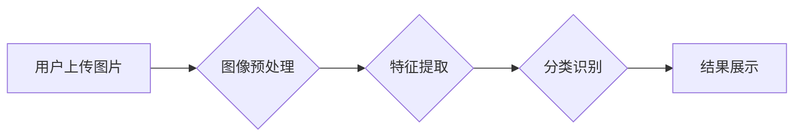

                 

## 电商平台中的图像识别：大模型的创新应用

> 关键词：图像识别、大模型、电商平台、计算机视觉、深度学习、模型部署、推荐系统

## 1. 背景介绍

随着电商平台的蓬勃发展，用户对购物体验的需求日益提高。图像识别技术作为计算机视觉领域的重要分支，在电商平台的应用场景日益广泛，为用户提供更便捷、更智能的购物体验。传统的图像识别技术主要依赖于人工特征提取，效率低、准确率有限。近年来，深度学习技术的兴起，特别是大模型的出现，为图像识别带来了革命性的变革。大模型凭借其强大的学习能力和泛化能力，能够自动学习图像特征，实现更精准、更智能的识别。

电商平台的图像识别应用场景涵盖多个方面，例如：

* **商品搜索**: 用户可以通过上传图片搜索相似商品，提高购物效率。
* **商品分类**: 自动识别商品类别，方便用户浏览和筛选。
* **商品属性识别**: 自动识别商品的品牌、颜色、尺寸等属性，提供更详细的商品信息。
* **视觉推荐**: 根据用户的浏览历史和画像，推荐与用户兴趣相关的商品。
* **反欺诈**: 检测商品图片的真实性，防止假冒伪劣商品的销售。

## 2. 核心概念与联系

### 2.1  图像识别

图像识别是指计算机能够理解和解释图像内容的技术。它涉及到图像的获取、预处理、特征提取、分类和识别等多个环节。

### 2.2  深度学习

深度学习是一种机器学习的子领域，它利用多层神经网络来模拟人类大脑的学习过程。深度学习模型能够自动学习图像特征，无需人工特征提取。

### 2.3  大模型

大模型是指参数量巨大、训练数据量庞大的深度学习模型。大模型具有强大的学习能力和泛化能力，能够在各种图像识别任务中取得优异的性能。

### 2.4  电商平台

电商平台是指提供商品展示、交易、支付等服务的在线平台。电商平台利用图像识别技术来提升用户体验、提高运营效率。

**Mermaid 流程图**



## 3. 核心算法原理 & 具体操作步骤

### 3.1  算法原理概述

大模型在图像识别中的应用主要基于卷积神经网络（CNN）的架构。CNN能够自动学习图像特征，并将其映射到不同的类别。大模型的优势在于其庞大的参数量和训练数据量，能够学习到更丰富的图像特征，从而提高识别精度。

### 3.2  算法步骤详解

1. **数据预处理**: 将原始图像进行尺寸调整、归一化等处理，使其适合模型训练。
2. **特征提取**: 利用CNN的卷积层和池化层提取图像特征。卷积层通过卷积核对图像进行卷积运算，提取图像局部特征。池化层对卷积层的输出进行降维，提取图像全局特征。
3. **分类识别**: 利用全连接层对提取的特征进行分类识别。全连接层将特征映射到不同的类别，并输出每个类别的概率。
4. **结果输出**: 根据分类结果，输出识别结果。

### 3.3  算法优缺点

**优点**:

* **高识别精度**: 大模型能够学习到更丰富的图像特征，从而提高识别精度。
* **泛化能力强**: 大模型在训练数据之外的图像上也能表现良好。
* **可迁移性强**: 大模型可以迁移到不同的图像识别任务中。

**缺点**:

* **训练成本高**: 大模型需要大量的计算资源和训练数据。
* **模型复杂度高**: 大模型的结构复杂，调试和优化难度较大。
* **部署成本高**: 大模型的部署需要强大的硬件支持。

### 3.4  算法应用领域

大模型在图像识别领域有着广泛的应用，例如：

* **人脸识别**: 用于身份验证、人脸追踪等场景。
* **物体检测**: 用于自动驾驶、安防监控等场景。
* **图像分类**: 用于图像检索、内容推荐等场景。
* **图像分割**: 用于医学图像分析、自动驾驶等场景。

## 4. 数学模型和公式 & 详细讲解 & 举例说明

### 4.1  数学模型构建

大模型的图像识别任务通常使用卷积神经网络（CNN）作为数学模型。CNN由多个卷积层、池化层和全连接层组成。

**卷积层**: 使用卷积核对图像进行卷积运算，提取图像局部特征。卷积核是一个小的矩阵，通过滑动在图像上，计算每个位置的卷积结果。

**池化层**: 对卷积层的输出进行降维，提取图像全局特征。常见的池化操作包括最大池化和平均池化。

**全连接层**: 将卷积层和池化层的输出进行分类识别。全连接层将特征映射到不同的类别，并输出每个类别的概率。

### 4.2  公式推导过程

**卷积运算**:

$$
y_{i,j} = \sum_{m=0}^{M-1} \sum_{n=0}^{N-1} x_{i+m,j+n} * w_{m,n}
$$

其中：

* $y_{i,j}$ 是卷积结果的像素值。
* $x_{i+m,j+n}$ 是输入图像的像素值。
* $w_{m,n}$ 是卷积核的权重值。
* $M$ 和 $N$ 是卷积核的大小。

**最大池化**:

$$
y_{i,j} = \max_{m=0}^{k-1} \max_{n=0}^{l-1} x_{i+m,j+n}
$$

其中：

* $y_{i,j}$ 是最大池化结果的像素值。
* $x_{i+m,j+n}$ 是输入图像的像素值。
* $k$ 和 $l$ 是池化窗口的大小。

### 4.3  案例分析与讲解

假设我们使用一个卷积核大小为3x3的卷积层对一个图像进行卷积运算。卷积核的权重值如下：

$$
w = \begin{bmatrix}
1 & 2 & 1 \\
2 & 4 & 2 \\
1 & 2 & 1
\end{bmatrix}
$$

输入图像的像素值如下：

$$
x = \begin{bmatrix}
1 & 2 & 3 \\
4 & 5 & 6 \\
7 & 8 & 9
\end{bmatrix}
$$

通过卷积运算，我们可以得到卷积结果的像素值。

## 5. 项目实践：代码实例和详细解释说明

### 5.1  开发环境搭建

* **操作系统**: Ubuntu 20.04
* **编程语言**: Python 3.8
* **深度学习框架**: TensorFlow 2.0
* **GPU**: NVIDIA GeForce RTX 3080

### 5.2  源代码详细实现

```python
import tensorflow as tf

# 定义卷积神经网络模型
model = tf.keras.models.Sequential([
    tf.keras.layers.Conv2D(32, (3, 3), activation='relu', input_shape=(224, 224, 3)),
    tf.keras.layers.MaxPooling2D((2, 2)),
    tf.keras.layers.Conv2D(64, (3, 3), activation='relu'),
    tf.keras.layers.MaxPooling2D((2, 2)),
    tf.keras.layers.Flatten(),
    tf.keras.layers.Dense(10, activation='softmax')
])

# 编译模型
model.compile(optimizer='adam',
              loss='sparse_categorical_crossentropy',
              metrics=['accuracy'])

# 训练模型
model.fit(x_train, y_train, epochs=10)

# 评估模型
loss, accuracy = model.evaluate(x_test, y_test)
print('Loss:', loss)
print('Accuracy:', accuracy)
```

### 5.3  代码解读与分析

* **定义模型**: 使用 `tf.keras.models.Sequential` 创建一个顺序模型，并添加卷积层、池化层和全连接层。
* **编译模型**: 使用 `adam` 优化器、`sparse_categorical_crossentropy` 损失函数和 `accuracy` 评价指标编译模型。
* **训练模型**: 使用 `model.fit` 函数训练模型，输入训练数据 `x_train` 和标签 `y_train`，训练 10 个 epochs。
* **评估模型**: 使用 `model.evaluate` 函数评估模型，输入测试数据 `x_test` 和标签 `y_test`，输出损失值和准确率。

### 5.4  运行结果展示

训练完成后，模型的损失值和准确率将被打印出来。

## 6. 实际应用场景

### 6.1  商品搜索

用户可以通过上传图片搜索相似商品，例如上传一张衣服图片，搜索平台可以识别衣服的款式、颜色、品牌等信息，并推荐相似的商品。

### 6.2  商品分类

电商平台可以利用图像识别技术自动识别商品类别，例如识别衣服、鞋子、电子产品等不同类别的商品，方便用户浏览和筛选。

### 6.3  商品属性识别

图像识别技术可以自动识别商品的品牌、颜色、尺寸等属性，例如识别手机的品牌、颜色、内存大小等信息，提供更详细的商品信息。

### 6.4  视觉推荐

根据用户的浏览历史和画像，电商平台可以利用图像识别技术推荐与用户兴趣相关的商品，例如推荐用户之前浏览过的商品、用户喜欢的品牌的商品等。

## 7. 工具和资源推荐

### 7.1  学习资源推荐

* **书籍**:
    * 深度学习
    * 计算机视觉
* **在线课程**:
    * Coursera
    * edX
    * Udacity

### 7.2  开发工具推荐

* **深度学习框架**: TensorFlow, PyTorch
* **图像处理库**: OpenCV
* **云平台**: AWS, Azure, Google Cloud

### 7.3  相关论文推荐

* **ImageNet Classification with Deep Convolutional Neural Networks**
* **Deep Residual Learning for Image Recognition**
* **Attention Is All You Need**

## 8. 总结：未来发展趋势与挑战

### 8.1  研究成果总结

大模型在图像识别领域取得了显著的成果，例如在 ImageNet 图像识别挑战赛中取得了领先的成绩。大模型的出现，为图像识别带来了革命性的变革，提高了识别精度和泛化能力。

### 8.2  未来发展趋势

* **模型规模进一步扩大**: 大模型的规模将继续扩大，参数量将达到数千亿甚至万亿级别。
* **模型架构更加复杂**: 大模型的架构将更加复杂，例如引入 Transformer 架构、自注意力机制等。
* **模型训练效率提升**: 大模型的训练效率将得到提升，例如使用分布式训练、模型压缩等技术。
* **模型应用场景更加广泛**: 大模型将应用于更多图像识别场景，例如医学图像分析、自动驾驶、人机交互等。

### 8.3  面临的挑战

* **训练成本高**: 大模型的训练成本非常高，需要大量的计算资源和训练数据。
* **模型复杂度高**: 大模型的结构复杂，调试和优化难度较大。
* **模型部署成本高**: 大模型的部署需要强大的硬件支持。
* **数据安全和隐私问题**: 大模型的训练需要大量数据，如何保证数据安全和隐私是一个重要的挑战。

### 8.4  研究展望

未来，大模型在图像识别领域将继续发挥重要作用，推动图像识别技术的发展。研究者将继续探索大模型的架构、训练方法和应用场景，以解决上述挑战，并开发出更强大、更智能的图像识别模型。

## 9. 附录：常见问题与解答

**Q1: 大模型的训练数据量有多大？**

A1: 大模型的训练数据量通常在数百万甚至数十亿级别。

**Q2: 大模型的训练需要多少计算资源？**

A2: 大模型的训练需要大量的计算资源，例如数百甚至数千个 GPU。

**Q3: 如何部署大模型？**

A3: 大模型的部署需要强大的硬件支持，例如高性能服务器、GPU 等。

**Q4: 大模型的安全性如何保证？**

A4: 大模型的安全性需要从多个方面考虑，例如数据安全、模型安全、部署安全等。

**Q5: 大模型的未来发展趋势是什么？**

A5: 大模型的未来发展趋势包括模型规模扩大、模型架构更加复杂、模型训练效率提升、模型应用场景更加广泛等。


作者：禅与计算机程序设计艺术 / Zen and the Art of Computer Programming 
<end_of_turn>

