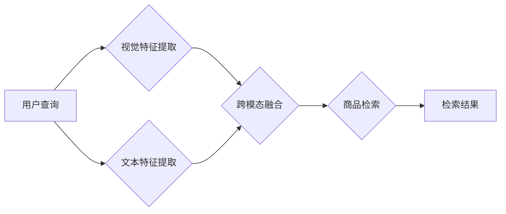

                 

## 电商搜索中的多模态商品检索深度学习模型

> 关键词：多模态检索、深度学习、电商搜索、商品图像、商品文本、BERT、视觉特征提取、跨模态融合

## 1. 背景介绍

随着电商行业的蓬勃发展，商品搜索已成为用户获取商品信息和完成购买的重要途径。传统的基于文本关键词的商品搜索方式存在着局限性，难以准确理解用户意图，尤其是在用户搜索描述模糊或缺乏关键词的情况下。为了提升商品搜索的精准度和用户体验，多模态商品检索逐渐成为研究热点。

多模态商品检索是指利用商品图像、文本描述等多种模态信息进行商品搜索的技术。相比于单模态检索，多模态检索能够更全面地刻画商品特征，提高搜索结果的准确性和相关性。例如，用户可以通过搜索一张商品图片，或者描述商品的属性，都能获得精准的搜索结果。

## 2. 核心概念与联系

### 2.1  多模态检索的原理

多模态检索的核心是将不同模态的信息融合起来，构建一个统一的商品表示。通过学习不同模态之间的关系，模型能够更好地理解用户意图，并返回更相关的商品结果。

### 2.2  多模态检索的架构

多模态检索模型通常由以下几个模块组成：

* **视觉特征提取模块:** 用于提取商品图像的视觉特征，例如颜色、纹理、形状等。常用的视觉特征提取方法包括卷积神经网络（CNN）和自编码器。
* **文本特征提取模块:** 用于提取商品文本描述的语义特征，例如关键词、句法结构、语义关系等。常用的文本特征提取方法包括词嵌入模型（如Word2Vec、GloVe）和Transformer模型（如BERT、RoBERTa）。
* **跨模态融合模块:** 用于将视觉特征和文本特征融合起来，构建一个统一的商品表示。常用的跨模态融合方法包括注意力机制、多层感知机（MLP）和图神经网络（GNN）。
* **检索模块:** 用于根据用户查询和商品表示的相似度，返回相关的商品结果。常用的检索方法包括余弦相似度、欧式距离和BM25算法。



## 3. 核心算法原理 & 具体操作步骤

### 3.1  算法原理概述

多模态商品检索算法的核心是学习不同模态之间的关系，并构建一个统一的商品表示。常用的算法包括：

* **基于匹配的算法:** 这种算法将视觉特征和文本特征分别进行编码，然后通过计算相似度进行匹配。例如，可以使用余弦相似度或欧式距离来衡量视觉特征和文本特征之间的相似度。
* **基于学习的算法:** 这种算法通过训练深度学习模型来学习不同模态之间的关系。常用的模型包括CNN-RNN、Transformer和图神经网络。

### 3.2  算法步骤详解

以基于学习的算法为例，其具体操作步骤如下：

1. **数据预处理:** 将商品图像和文本描述进行预处理，例如图像裁剪、增强、文本分词、词嵌入等。
2. **特征提取:** 使用CNN模型提取商品图像的视觉特征，使用Transformer模型提取商品文本描述的语义特征。
3. **跨模态融合:** 使用注意力机制或多层感知机将视觉特征和文本特征融合起来，构建一个统一的商品表示。
4. **模型训练:** 使用训练数据训练深度学习模型，优化模型参数，使模型能够准确地预测商品之间的相似度。
5. **模型评估:** 使用测试数据评估模型的性能，例如准确率、召回率和F1-score。
6. **模型部署:** 将训练好的模型部署到生产环境中，用于实际的商品检索。

### 3.3  算法优缺点

**优点:**

* 能够更好地理解用户意图，提高搜索结果的准确性和相关性。
* 可以利用多种模态信息，更全面地刻画商品特征。

**缺点:**

* 需要大量的训练数据，训练成本较高。
* 模型复杂度较高，推理速度较慢。

### 3.4  算法应用领域

多模态商品检索算法广泛应用于电商搜索、图像识别、视频理解等领域。

## 4. 数学模型和公式 & 详细讲解 & 举例说明

### 4.1  数学模型构建

多模态商品检索模型通常采用以下数学模型：

* **视觉特征表示:** 使用CNN模型提取商品图像的视觉特征，可以表示为一个向量 $v_i \in R^d$，其中 $d$ 是特征向量的维度。
* **文本特征表示:** 使用Transformer模型提取商品文本描述的语义特征，可以表示为一个向量 $t_i \in R^e$，其中 $e$ 是特征向量的维度。
* **跨模态融合:** 使用注意力机制将视觉特征和文本特征融合起来，可以表示为一个新的向量 $h_i \in R^f$，其中 $f$ 是融合后的特征向量的维度。

### 4.2  公式推导过程

注意力机制的公式如下：

$$
\alpha_{ij} = \frac{\exp(s_{ij})}{\sum_{k=1}^{n} \exp(s_{ik})}
$$

其中， $s_{ij}$ 是视觉特征 $v_i$ 和文本特征 $t_j$ 之间的相似度得分， $n$ 是商品数量。

融合后的特征向量 $h_i$ 可以表示为：

$$
h_i = \sum_{j=1}^{n} \alpha_{ij} t_j
$$

### 4.3  案例分析与讲解

假设我们有一个商品图像和一个商品文本描述，我们需要使用多模态检索模型来找到与之最相似的商品。

1. 使用CNN模型提取商品图像的视觉特征，得到一个向量 $v_i$。
2. 使用Transformer模型提取商品文本描述的语义特征，得到一个向量 $t_i$。
3. 使用注意力机制计算视觉特征 $v_i$ 和文本特征 $t_i$ 之间的相似度得分 $s_{ij}$。
4. 根据相似度得分计算注意力权重 $\alpha_{ij}$。
5. 将注意力权重与文本特征 $t_i$ 进行加权求和，得到融合后的特征向量 $h_i$。
6. 使用余弦相似度或欧式距离来衡量融合后的特征向量 $h_i$ 和其他商品的融合特征向量之间的相似度。
7. 返回相似度最高的商品结果。

## 5. 项目实践：代码实例和详细解释说明

### 5.1  开发环境搭建

* **操作系统:** Ubuntu 20.04
* **深度学习框架:** PyTorch 1.7.1
* **其他依赖:** numpy, pandas, matplotlib, opencv-python

### 5.2  源代码详细实现

```python
import torch
import torch.nn as nn
from torchvision import models

class MultiModalRetrievalModel(nn.Module):
    def __init__(self, image_embedding_dim, text_embedding_dim, fusion_dim):
        super(MultiModalRetrievalModel, self).__init__()
        self.image_encoder = models.resnet18(pretrained=True)
        self.image_encoder.fc = nn.Linear(self.image_encoder.fc.in_features, image_embedding_dim)
        self.text_encoder = nn.TransformerEncoder(nn.TransformerEncoderLayer(d_model=text_embedding_dim, nhead=8), num_layers=6)
        self.fusion_layer = nn.Linear(image_embedding_dim + text_embedding_dim, fusion_dim)

    def forward(self, images, texts):
        image_features = self.image_encoder(images)
        text_features = self.text_encoder(texts)
        fused_features = torch.cat((image_features, text_features), dim=1)
        fused_features = self.fusion_layer(fused_features)
        return fused_features
```

### 5.3  代码解读与分析

* **图像编码器:** 使用预训练的ResNet18模型提取商品图像的视觉特征。
* **文本编码器:** 使用Transformer模型提取商品文本描述的语义特征。
* **融合层:** 将视觉特征和文本特征进行拼接，并使用全连接层进行融合。

### 5.4  运行结果展示

训练好的模型可以用于预测商品之间的相似度，并返回与用户查询最相似的商品结果。

## 6. 实际应用场景

### 6.1  电商搜索

多模态商品检索可以显著提升电商搜索的精准度和用户体验。例如，用户可以通过搜索一张商品图片，或者描述商品的属性，都能获得精准的搜索结果。

### 6.2  图像识别

多模态商品检索可以用于图像识别，例如识别商品类型、品牌、颜色等。

### 6.3  视频理解

多模态商品检索可以用于视频理解，例如识别视频中的商品、场景和事件。

### 6.4  未来应用展望

随着深度学习技术的不断发展，多模态商品检索将在更多领域得到应用，例如：

* **个性化推荐:** 根据用户的历史浏览记录和偏好，推荐更符合用户需求的商品。
* **虚拟试衣间:** 利用多模态信息，实现虚拟试衣间功能，帮助用户在线试穿衣服。
* **智能客服:** 利用多模态信息，构建智能客服系统，帮助用户解决购物问题。

## 7. 工具和资源推荐

### 7.1  学习资源推荐

* **书籍:**
    * Deep Learning by Ian Goodfellow, Yoshua Bengio, and Aaron Courville
    * Natural Language Processing with PyTorch by Yoav Goldberg
* **课程:**
    * Stanford CS231n: Convolutional Neural Networks for Visual Recognition
    * Deep Learning Specialization by Andrew Ng
* **博客:**
    * https://blog.openai.com/
    * https://towardsdatascience.com/

### 7.2  开发工具推荐

* **深度学习框架:** PyTorch, TensorFlow
* **图像处理库:** OpenCV
* **自然语言处理库:** NLTK, spaCy

### 7.3  相关论文推荐

* **Multimodal Deep Learning for Visual Question Answering**
* **Show, Attend and Tell: Neural Image Captioning with Visual Attention**
* **BERT: Pre-training of Deep Bidirectional Transformers for Language Understanding**

## 8. 总结：未来发展趋势与挑战

### 8.1  研究成果总结

多模态商品检索技术取得了显著进展，能够有效提升商品搜索的精准度和用户体验。

### 8.2  未来发展趋势

* **模型复杂度提升:** 研究更深、更复杂的深度学习模型，提高模型的表达能力和泛化能力。
* **跨模态融合方法创新:** 研究更有效的跨模态融合方法，更好地学习不同模态之间的关系。
* **数据规模扩大:** 收集和构建更丰富、更全面的多模态商品数据，为模型训练提供更多数据支持。

### 8.3  面临的挑战

* **数据标注成本高:** 多模态商品数据标注成本较高，需要投入大量人力和时间。
* **模型训练复杂度高:** 多模态商品检索模型训练复杂度高，需要强大的计算资源。
* **跨模态知识表示:** 如何更好地表示跨模态知识，是多模态商品检索领域的一个重要挑战。

### 8.4  研究展望

未来，多模态商品检索技术将继续朝着更智能、更精准、更个性化的方向发展，为用户提供更便捷、更丰富的购物体验。

## 9. 附录：常见问题与解答

* **Q1: 多模态商品检索与传统文本搜索有什么区别？**

**A1:** 传统文本搜索只利用商品文本描述进行检索，而多模态商品检索利用商品图像和文本描述等多种模态信息进行检索，能够更全面地刻画商品特征，提高搜索结果的准确性和相关性。

* **Q2: 多模态商品检索模型需要多少数据才能训练？**

**A2:** 训练一个高质量的多模态商品检索模型需要大量的训练数据，通常需要百万甚至数百万条商品图像和文本描述数据。

* **Q3: 多模态商品检索模型的推理速度如何？**

**A3:** 多模态商品检索模型的推理速度取决于模型的复杂度和硬件资源。目前，一些轻量级的模型可以实现实时的推理速度，但更复杂的模型可能需要较长的推理时间。


作者：禅与计算机程序设计艺术 / Zen and the Art of Computer Programming 
<end_of_turn>

