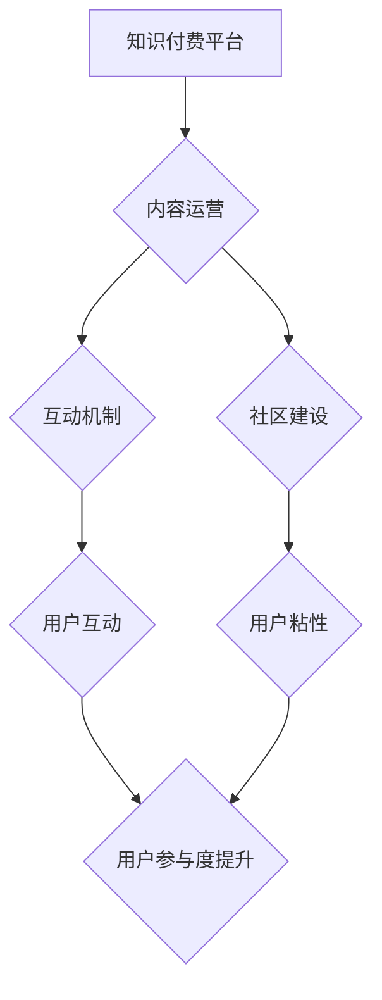

                 

## 知识付费创业中的用户参与度提升策略

> 关键词：知识付费、用户参与度、社区建设、互动机制、内容运营、数据分析、用户画像

## 1. 背景介绍

知识付费行业近年来发展迅速，从线上课程、付费咨询到会员体系，各种模式层出不穷。然而，用户参与度一直是知识付费平台面临的挑战。高昂的付费门槛、缺乏互动性、内容单一化等问题都可能导致用户流失和平台发展瓶颈。提升用户参与度，不仅能提高用户粘性，还能促进平台内容的传播和迭代，最终实现可持续发展。

## 2. 核心概念与联系

**2.1 知识付费的核心概念**

知识付费是指以知识、技能、经验等为核心内容，通过付费的方式获取和学习。它是一种基于价值交换的商业模式，用户通过支付获得知识和技能的提升，而平台则通过知识的传播和分享获取收益。

**2.2 用户参与度的核心概念**

用户参与度是指用户在平台上进行各种互动行为的程度，包括但不限于：

* **内容消费:** 阅读文章、观看视频、下载资源等
* **社区互动:** 评论、点赞、转发、参与讨论等
* **付费行为:** 购买课程、订阅会员、参与付费活动等

**2.3 核心概念联系**

知识付费平台的核心目标是通过提供优质的知识内容，吸引用户付费学习，并建立一个活跃的学习社区。用户参与度是实现这一目标的关键因素。

**2.4 用户参与度提升策略架构**



## 3. 核心算法原理 & 具体操作步骤

**3.1 算法原理概述**

提升用户参与度的核心算法原理是基于用户行为数据分析，精准推送个性化内容，并设计有效的互动机制，引导用户积极参与平台活动。

**3.2 算法步骤详解**

1. **数据采集:** 收集用户在平台上的所有行为数据，包括浏览记录、阅读时长、点赞评论、购买记录等。
2. **数据清洗:** 对收集到的数据进行清洗和处理，去除无效数据，确保数据质量。
3. **用户画像构建:** 基于用户行为数据，构建用户画像，包括用户兴趣爱好、学习习惯、付费意愿等。
4. **内容推荐:** 根据用户画像，推荐个性化内容，提高用户兴趣和参与度。
5. **互动机制设计:** 设计各种互动机制，例如问答环节、讨论区、直播互动等，鼓励用户积极参与平台活动。
6. **数据分析与优化:** 持续分析用户行为数据，优化内容推荐和互动机制，不断提升用户参与度。

**3.3 算法优缺点**

* **优点:** 能够精准推送个性化内容，提高用户兴趣和参与度，促进平台内容的传播和迭代。
* **缺点:** 需要大量的数据支持，算法模型的构建和优化需要专业技术人员，数据安全和隐私保护也需要引起重视。

**3.4 算法应用领域**

* **知识付费平台:** 推荐个性化课程、文章、视频等内容，提高用户学习兴趣和参与度。
* **电商平台:** 推荐个性化商品，提高用户购买意愿和转化率。
* **社交平台:** 推荐个性化好友和内容，提高用户活跃度和粘性。

## 4. 数学模型和公式 & 详细讲解 & 举例说明

**4.1 数学模型构建**

用户参与度可以被定义为用户在平台上进行各种互动行为的频率和强度。

* **频率:** 指用户在特定时间段内进行互动行为的次数。
* **强度:** 指用户每次互动行为的持续时间或参与程度。

我们可以用以下公式来表示用户参与度：

$$
User Engagement = \frac{Total Interactions}{Total Time Spent}
$$

其中：

* **Total Interactions:** 用户在平台上进行的所有互动行为的次数。
* **Total Time Spent:** 用户在平台上花费的总时间。

**4.2 公式推导过程**

该公式的推导过程基于以下假设：

* 用户参与度与互动行为的频率和强度成正比。
* 用户在平台上花费的时间越长，参与度越高。

**4.3 案例分析与讲解**

假设一个知识付费平台有 1000 个用户，其中 500 个用户在平台上浏览了课程内容，平均每次浏览时长为 10 分钟，总共花费了 5000 分钟。

根据公式，该平台的用户参与度为：

$$
User Engagement = \frac{500}{5000} = 0.1
$$

该平台的用户参与度为 0.1，表示用户平均每分钟进行 0.1 次互动行为。

## 5. 项目实践：代码实例和详细解释说明

**5.1 开发环境搭建**

* 操作系统: Ubuntu 20.04 LTS
* 编程语言: Python 3.8
* 开发框架: Django 3.2
* 数据库: PostgreSQL 13

**5.2 源代码详细实现**

```python
# models.py
from django.db import models

class User(models.Model):
    username = models.CharField(max_length=255)
    # ... 其他用户属性

class Course(models.Model):
    title = models.CharField(max_length=255)
    # ... 其他课程属性

class Interaction(models.Model):
    user = models.ForeignKey(User, on_delete=models.CASCADE)
    course = models.ForeignKey(Course, on_delete=models.CASCADE)
    type = models.CharField(max_length=255)  # e.g., 'view', 'comment', 'like'
    timestamp = models.DateTimeField(auto_now_add=True)

# views.py
from django.shortcuts import render
from .models import User, Course, Interaction

def user_engagement(request, user_id):
    user = User.objects.get(pk=user_id)
    interactions = Interaction.objects.filter(user=user)
    total_interactions = interactions.count()
    total_time_spent = interactions.aggregate(total_time=Sum('timestamp'))['total_time']
    user_engagement = total_interactions / total_time_spent
    return render(request, 'user_engagement.html', {'user': user, 'user_engagement': user_engagement})
```

**5.3 代码解读与分析**

* **models.py:** 定义了用户、课程和互动行为的模型。
* **views.py:** 定义了用户参与度计算的视图函数。

该代码示例展示了如何使用 Django 来构建一个简单的知识付费平台，并计算用户的参与度。

**5.4 运行结果展示**

运行该代码后，可以访问用户参与度计算页面，输入用户的 ID，即可获取该用户的参与度值。

## 6. 实际应用场景

**6.1 在线课程平台**

* **个性化推荐:** 根据用户的学习记录和兴趣爱好，推荐相关的课程和学习资源。
* **互动学习:** 设计互动式课程、讨论区、问答环节等，鼓励用户积极参与学习。
* **社区建设:** 建立学习社区，让用户可以互相交流学习经验，分享学习资源。

**6.2 付费咨询平台**

* **专家匹配:** 根据用户的咨询需求，匹配合适的专家进行付费咨询。
* **互动咨询:** 设计实时聊天、视频咨询等互动机制，提高咨询效率和用户体验。
* **案例分享:** 鼓励用户分享咨询案例，帮助其他用户解决问题。

**6.3 会员体系平台**

* **个性化内容:** 为会员提供专属内容，例如VIP课程、会员专区等。
* **专属服务:** 为会员提供专属服务，例如优先答疑、会员活动等。
* **社区互动:** 建立会员社区，让会员可以互相交流学习经验，分享学习资源。

**6.4 未来应用展望**

随着人工智能技术的不断发展，用户参与度提升策略将更加智能化和个性化。例如，利用自然语言处理技术，更精准地理解用户的需求和意图，提供更个性化的内容推荐和互动体验。

## 7. 工具和资源推荐

**7.1 学习资源推荐**

* **书籍:**
    * 《用户体验设计》
    * 《内容营销》
    * 《数据分析》
* **在线课程:**
    * Coursera
    * Udemy
    * edX

**7.2 开发工具推荐**

* **编程语言:** Python, JavaScript
* **开发框架:** Django, Flask, React, Vue.js
* **数据库:** PostgreSQL, MySQL, MongoDB

**7.3 相关论文推荐**

* **用户参与度模型研究:**
    * "A Framework for Understanding User Engagement in Online Communities"
    * "Measuring User Engagement in Social Media: A Comprehensive Review"
* **知识付费平台研究:**
    * "The Rise of the Knowledge Economy: A Review of the Literature on Knowledge-Based Services"
    * "The Impact of Online Learning on Higher Education"

## 8. 总结：未来发展趋势与挑战

**8.1 研究成果总结**

通过对用户参与度提升策略的研究，我们发现：

* 用户参与度是知识付费平台发展的重要指标。
* 数据分析和个性化推荐是提升用户参与度的关键技术。
* 社区建设和互动机制设计也是提升用户参与度的重要因素。

**8.2 未来发展趋势**

* **人工智能技术:** 利用人工智能技术，更精准地理解用户的需求和意图，提供更个性化的内容推荐和互动体验。
* **虚拟现实技术:** 利用虚拟现实技术，打造沉浸式的学习体验，提高用户参与度。
* **元宇宙:** 将知识付费平台融入元宇宙，创造更丰富的学习场景和互动体验。

**8.3 面临的挑战**

* **数据安全和隐私保护:** 知识付费平台需要收集大量用户数据，如何保障数据安全和隐私保护是一个重要的挑战。
* **算法公平性:** 算法模型的构建和优化需要避免偏见和歧视，确保算法公平性。
* **内容质量:** 知识付费平台需要提供高质量的内容，才能吸引用户付费学习。

**8.4 研究展望**

未来，我们将继续研究用户参与度提升策略，探索更有效的提升用户参与度的技术和方法，推动知识付费行业健康发展。

## 9. 附录：常见问题与解答

**9.1 如何提高用户参与度？**

* 提供高质量、个性化的内容
* 设计有效的互动机制
* 建立活跃的学习社区
* 利用数据分析，精准推送内容

**9.2 如何保障用户数据安全？**

* 采用加密技术保护用户数据
* 明确用户数据使用协议
* 严格遵守数据安全法规

**9.3 如何避免算法偏见？**

* 使用多元化的数据训练算法模型
* 定期评估算法模型的公平性
* 邀请专家对算法模型进行审计


作者：禅与计算机程序设计艺术 / Zen and the Art of Computer Programming 
<end_of_turn>

