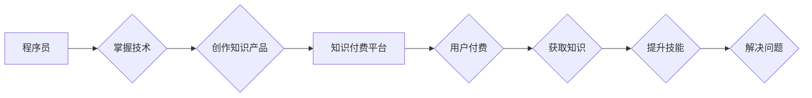

                 

## 知识付费时代程序员的创业机会

> 关键词：知识付费、程序员、创业机会、在线教育、技术博客、开源项目、技术社区

### 1. 背景介绍

随着互联网技术的飞速发展和数字化浪潮的席卷，知识付费行业正迎来爆发式增长。人们对知识的需求日益增长，而程序员作为掌握着核心技术和解决问题的能力的群体，在知识付费领域拥有着独特的优势和机遇。

传统教育模式的局限性，例如高昂的学费、时间和地域的限制，使得人们对更灵活、便捷、个性化的学习方式越来越渴望。知识付费平台则提供了这样一个平台，让程序员可以将自己的技术经验和知识转化为有价值的产品，并通过线上平台进行销售和传播。

### 2. 核心概念与联系

**2.1 知识付费模式**

知识付费是指通过付费的方式获取知识、技能和服务的商业模式。它打破了传统教育的壁垒，让知识更加易于获取和分享。

**2.2 程序员的知识价值**

程序员掌握着编程语言、算法、数据结构等核心技术，能够解决实际问题，开发软件产品。这些技术和经验是宝贵的知识资产，具有很高的市场价值。

**2.3 知识付费平台**

知识付费平台是提供知识付费服务的线上平台，例如 Udemy、Coursera、Skillshare 等。这些平台为程序员提供了发布课程、销售知识产品和与用户互动交流的渠道。

**2.4 知识付费生态系统**

知识付费生态系统包括知识付费平台、内容创作者（程序员）、用户和相关服务商。它们相互依存，共同构成了一个完整的知识付费体系。

**Mermaid 流程图**



### 3. 核心算法原理 & 具体操作步骤

**3.1 算法原理概述**

知识付费平台的运营需要依靠一系列算法来实现内容推荐、用户匹配、付费转化等功能。这些算法通常基于机器学习和数据挖掘技术，通过分析用户行为数据、内容特征数据等，来预测用户需求和推荐合适的知识产品。

**3.2 算法步骤详解**

1. **数据收集:** 收集用户行为数据（例如浏览记录、购买记录、评论记录等）、内容特征数据（例如主题、标签、作者等）以及平台运营数据（例如用户画像、市场趋势等）。

2. **数据预处理:** 对收集到的数据进行清洗、转换、编码等预处理操作，使其能够被算法模型所使用。

3. **模型训练:** 选择合适的机器学习算法模型，例如协同过滤、内容推荐、深度学习等，并利用训练数据对模型进行训练，使其能够学习到用户需求和内容特征之间的关系。

4. **模型评估:** 使用测试数据对训练好的模型进行评估，并根据评估结果进行模型调优，提高模型的预测精度和推荐效果。

5. **模型部署:** 将训练好的模型部署到线上平台，并实时对用户行为数据进行分析，推荐合适的知识产品。

**3.3 算法优缺点**

**优点:**

* **个性化推荐:** 能够根据用户的兴趣和需求，推荐更精准的知识产品。
* **数据驱动:** 基于数据分析，能够不断优化推荐算法，提高推荐效果。
* **自动化运营:** 可以自动化完成内容推荐、用户匹配等运营任务，降低运营成本。

**缺点:**

* **数据依赖:** 算法模型的性能依赖于数据的质量和数量。
* **算法黑盒:** 一些复杂的算法模型难以解释，其推荐结果难以被用户理解。
* **数据安全:** 需要妥善处理用户行为数据，保障用户隐私安全。

**3.4 算法应用领域**

* **内容推荐:** 推荐用户感兴趣的知识产品、课程、文章等。
* **用户匹配:** 将用户与合适的知识创作者、学习小组等进行匹配。
* **付费转化:** 通过算法模型预测用户付费意愿，并进行精准营销。
* **知识发现:** 通过分析用户行为数据，发现新的知识需求和市场趋势。

### 4. 数学模型和公式 & 详细讲解 & 举例说明

**4.1 数学模型构建**

知识推荐算法通常使用协同过滤模型，该模型基于用户的历史行为数据和内容的特征数据，预测用户对特定内容的兴趣。

**4.2 公式推导过程**

协同过滤模型的核心是计算用户和内容之间的相似度。常用的相似度度量方法包括余弦相似度和皮尔逊相关系数。

* **余弦相似度:**

$$
\text{相似度} = \frac{\mathbf{u} \cdot \mathbf{v}}{\|\mathbf{u}\| \|\mathbf{v}\|}
$$

其中，$\mathbf{u}$ 和 $\mathbf{v}$ 分别表示用户和内容的特征向量，$\cdot$ 表示点积，$\|\mathbf{u}\|$ 和 $\|\mathbf{v}\|$ 分别表示特征向量的模长。

* **皮尔逊相关系数:**

$$
\text{相似度} = \frac{\sum_{i=1}^{n}(u_i - \bar{u})(v_i - \bar{v})}{\sqrt{\sum_{i=1}^{n}(u_i - \bar{u})^2} \sqrt{\sum_{i=1}^{n}(v_i - \bar{v})^2}}
$$

其中，$u_i$ 和 $v_i$ 分别表示用户和内容的第 $i$ 个特征值，$\bar{u}$ 和 $\bar{v}$ 分别表示用户的平均特征值和内容的平均特征值。

**4.3 案例分析与讲解**

假设有一个用户A喜欢编程语言Python，并且购买了Python基础课程。平台根据用户的历史行为数据和内容特征数据，计算出用户A与其他用户和Python相关课程的相似度。

如果发现用户B也喜欢Python，并且购买了Python进阶课程，那么平台就可以推荐Python进阶课程给用户A。

### 5. 项目实践：代码实例和详细解释说明

**5.1 开发环境搭建**

* Python 3.x
* Flask 或 Django 框架
* 数据库 (例如 MySQL, PostgreSQL)
* 前端框架 (例如 React, Vue.js)

**5.2 源代码详细实现**

```python
# 使用 Flask 框架构建知识付费平台

from flask import Flask, render_template

app = Flask(__name__)

@app.route('/')
def index():
    return render_template('index.html')

if __name__ == '__main__':
    app.run(debug=True)
```

**5.3 代码解读与分析**

* 创建 Flask 应用实例。
* 定义一个路由 `/`，返回 `index.html` 模板页面。

**5.4 运行结果展示**

运行代码后，访问 `http://127.0.0.1:5000/`，即可看到知识付费平台的首页。

### 6. 实际应用场景

**6.1 在线课程平台**

程序员可以将自己的编程知识和经验录制成视频课程，通过在线课程平台进行销售。

**6.2 技术博客和文章**

程序员可以撰写技术博客文章和教程，并通过付费订阅的方式提供更深入的技术内容和服务。

**6.3 开源项目维护和咨询**

程序员可以维护开源项目，并提供付费咨询服务，帮助用户解决技术问题和定制开发需求。

**6.4 技术社区和论坛**

程序员可以创建技术社区和论坛，并提供付费会员服务，例如优先答疑、专属资源等。

**6.5 未来应用展望**

随着人工智能、大数据等技术的不断发展，知识付费平台将更加智能化、个性化和互动化。程序员可以利用这些技术，开发更具创新性和价值的知识产品，满足用户不断增长的学习需求。

### 7. 工具和资源推荐

**7.1 学习资源推荐**

* **在线学习平台:** Udemy, Coursera, Skillshare
* **技术博客:** Hacker News, Medium, Dev.to
* **开源社区:** GitHub, GitLab

**7.2 开发工具推荐**

* **Python 框架:** Flask, Django
* **数据库:** MySQL, PostgreSQL
* **前端框架:** React, Vue.js

**7.3 相关论文推荐**

* **协同过滤推荐算法:** "Collaborative Filtering for Implicit Feedback Datasets"
* **内容推荐算法:** "Content-Based Recommendation Systems"
* **深度学习推荐算法:** "Deep Learning for Recommender Systems"

### 8. 总结：未来发展趋势与挑战

**8.1 研究成果总结**

知识付费时代为程序员提供了新的创业机会，他们可以通过将自己的技术经验和知识转化为有价值的产品，并通过线上平台进行销售和传播。

**8.2 未来发展趋势**

* **个性化推荐:** 利用人工智能技术，提供更加精准的知识推荐服务。
* **互动式学习:** 鼓励用户参与互动，例如在线讨论、项目合作等，提升学习体验。
* **多元化内容:** 不仅限于视频课程，还可以包括直播、文档、代码库等多种形式的知识产品。

**8.3 面临的挑战**

* **内容质量:** 需要保证知识产品的质量和价值，避免低质量内容的泛滥。
* **用户信任:** 需要建立用户信任，确保知识产品能够满足用户的真实需求。
* **平台竞争:** 知识付费平台市场竞争激烈，需要不断创新和提升服务质量。

**8.4 研究展望**

未来，知识付费平台将更加智能化、个性化和互动化，程序员需要不断学习新技术，开发更具创新性和价值的知识产品，才能在知识付费时代脱颖而出。

### 9. 附录：常见问题与解答

**9.1 如何选择合适的知识付费平台？**

需要考虑平台的流量、用户群体、服务功能、收费模式等因素。

**9.2 如何制作高质量的知识产品？**

需要深入了解用户需求，精心设计课程内容，并使用高质量的视频、音频和文本素材。

**9.3 如何推广自己的知识产品？**

可以通过社交媒体、技术社区、博客等渠道进行推广，并与其他创作者合作。


作者：禅与计算机程序设计艺术 / Zen and the Art of Computer Programming 
<end_of_turn>

