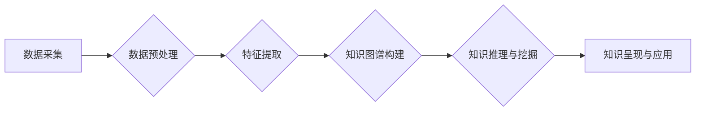

                 

## 知识发现引擎：推动创意产业的创新动力

> 关键词：知识发现引擎、创意产业、人工智能、机器学习、数据挖掘、知识图谱、创新驱动

### 1. 背景介绍

在当今数据爆炸的时代，创意产业正处于一个前所未有的变革期。海量数据蕴藏着丰富的创意灵感和市场洞察力，但如何有效地挖掘和利用这些数据，成为了创意产业发展面临的重大挑战。知识发现引擎作为一种能够从海量数据中自动发现隐藏的知识和模式的技术，为创意产业的创新驱动提供了强大的工具和支持。

创意产业涵盖了广泛的领域，包括影视、音乐、文学、游戏、设计等。这些领域都依赖于灵感、创意和创新。传统的创意流程往往依赖于个人经验和灵感，效率低下，难以规模化。而知识发现引擎能够通过分析历史数据、用户行为、市场趋势等信息，为创意人员提供数据驱动的洞察和建议，帮助他们更快、更有效地发现灵感，激发创意，并最终转化为商业价值。

### 2. 核心概念与联系

知识发现引擎的核心是将人工智能、机器学习、数据挖掘等技术应用于创意产业的数据分析和处理。其工作原理是通过构建知识图谱、分析文本、图像、音频等多模态数据，识别出潜在的关联和模式，并将其转化为可理解的知识和洞察。

**知识发现引擎架构**



**核心概念解释:**

* **数据采集:** 从各种来源收集创意产业相关的数据，例如用户行为数据、作品数据、市场趋势数据等。
* **数据预处理:** 对收集到的数据进行清洗、转换、格式化等处理，使其能够被后续算法有效地处理。
* **特征提取:** 从数据中提取关键特征，例如文本中的关键词、图像中的物体识别、音频中的音乐风格等。
* **知识图谱构建:** 将提取的特征和关系组织成知识图谱，以便于知识的表示和推理。
* **知识推理与挖掘:** 利用机器学习算法和知识推理技术，从知识图谱中发现隐藏的知识和模式，例如作品风格的演变趋势、用户偏好的音乐类型等。
* **知识呈现与应用:** 将发现的知识以可视化、可交互的方式呈现给创意人员，并将其应用于创意过程的各个环节，例如剧本创作、音乐制作、产品设计等。

### 3. 核心算法原理 & 具体操作步骤

#### 3.1  算法原理概述

知识发现引擎的核心算法主要包括：

* **文本挖掘算法:** 用于分析文本数据，提取关键词、主题、情感等信息。常见的算法包括TF-IDF、LDA主题模型、BERT等。
* **图像识别算法:** 用于识别图像中的物体、场景、人物等信息。常见的算法包括卷积神经网络(CNN)、YOLO等。
* **音频分析算法:** 用于分析音频数据，识别音乐风格、音调、节奏等信息。常见的算法包括MFCC、谱分析等。
* **关联规则挖掘算法:** 用于发现数据中隐藏的关联规则，例如哪些作品风格经常出现在一起、哪些用户喜欢观看哪些类型的作品等。常见的算法包括Apriori算法、FP-Growth算法等。

#### 3.2  算法步骤详解

以文本挖掘算法为例，其具体操作步骤如下：

1. **数据预处理:** 对文本数据进行清洗、去停用词、分词等处理，使其符合算法的输入要求。
2. **特征提取:** 使用TF-IDF算法计算每个词语在文档中的重要性，并将其作为特征向量。
3. **主题模型训练:** 使用LDA主题模型训练，将文档聚类到不同的主题类别中。
4. **主题分析:** 分析每个主题的关键词和文档分布，了解每个主题所代表的内容。
5. **知识呈现:** 将主题结果以可视化图表形式呈现给用户，例如主题词云、主题分布图等。

#### 3.3  算法优缺点

**优点:**

* **自动化:** 能够自动从海量数据中发现知识，解放人力资源。
* **效率:** 比传统人工分析方法效率更高，能够快速处理大量数据。
* **客观性:** 基于数据分析，结果更客观、更准确。

**缺点:**

* **数据依赖:** 算法的性能取决于数据的质量和数量。
* **解释性:** 一些算法的内部机制较为复杂，难以解释其发现的知识。
* **伦理问题:** 数据隐私保护、算法偏见等伦理问题需要得到重视。

#### 3.4  算法应用领域

知识发现引擎的应用领域非常广泛，包括：

* **影视创作:** 分析剧本、角色、场景等信息，发现新的故事创意和人物设定。
* **音乐制作:** 分析音乐风格、旋律、节奏等信息，创作新的音乐作品。
* **文学创作:** 分析写作风格、主题、人物等信息，发现新的写作思路和灵感。
* **游戏设计:** 分析玩家行为、游戏机制等信息，优化游戏体验和设计新的游戏玩法。
* **产品设计:** 分析用户需求、市场趋势等信息，设计更符合用户需求的产品。

### 4. 数学模型和公式 & 详细讲解 & 举例说明

#### 4.1  数学模型构建

知识发现引擎的数学模型主要基于概率论、统计学和机器学习等理论。

* **概率论:** 用于描述数据之间的概率关系，例如词语在文档中的出现概率。
* **统计学:** 用于分析数据的分布特征和统计指标，例如平均值、方差等。
* **机器学习:** 用于构建预测模型，例如文本分类、主题模型等。

#### 4.2  公式推导过程

以LDA主题模型为例，其核心公式是：

$$P(D|θ,β) = \prod_{i=1}^{N} P(w_i|θ_i,β)$$

其中：

* $D$ 表示文档集。
* $θ_i$ 表示第 $i$ 个文档的主题分布。
* $β$ 表示每个主题的词语分布。
* $w_i$ 表示第 $i$ 个词语。

该公式表示文档集在给定主题分布和词语分布下的概率。通过最大化该概率，可以学习出文档集的主题分布和每个主题的词语分布。

#### 4.3  案例分析与讲解

假设我们有一个关于电影的文本数据集，包含了电影的剧情、角色、导演等信息。我们可以使用LDA主题模型对该数据集进行主题分析，发现以下主题：

* **动作片:** 关键词包括“打斗”、“枪战”、“爆炸”等。
* **爱情片:** 关键词包括“爱情”、“浪漫”、“亲情”等。
* **科幻片:** 关键词包括“未来”、“科技”、“外星人”等。

通过分析这些主题，我们可以了解到电影的创作趋势和观众的喜好，为电影创作提供参考。

### 5. 项目实践：代码实例和详细解释说明

#### 5.1  开发环境搭建

* **操作系统:** Linux/macOS/Windows
* **编程语言:** Python
* **库依赖:** scikit-learn、gensim、pandas、numpy等

#### 5.2  源代码详细实现

```python
# 使用gensim库进行LDA主题模型训练
from gensim import corpora
from gensim.models import LdaModel

# 数据预处理
# ...

# 创建词袋模型
dictionary = corpora.Dictionary(documents)
corpus = [dictionary.doc2bow(doc) for doc in documents]

# 训练LDA主题模型
num_topics = 5  # 设置主题数量
lda_model = LdaModel(corpus, num_topics=num_topics, id2word=dictionary)

# 获取主题词
for idx, topic in lda_model.print_topics(-1):
    print('Topic: {} \nWords: {}'.format(idx, topic))

# 主题分配
# ...
```

#### 5.3  代码解读与分析

* **数据预处理:** 将文本数据清洗、去停用词、分词等处理，使其符合算法的输入要求。
* **词袋模型:** 将文本数据转换为词袋模型，每个文档表示为一个词语频率向量。
* **LDA主题模型训练:** 使用gensim库的LdaModel类训练LDA主题模型，并设置主题数量。
* **主题词获取:** 使用`print_topics()`方法获取每个主题的关键词。
* **主题分配:** 使用`get_document_topics()`方法将每个文档分配到不同的主题类别中。

#### 5.4  运行结果展示

运行代码后，会输出每个主题的关键词和主题分配结果。例如，主题 0 的关键词可能是“动作”、“打斗”、“枪战”，主题 1 的关键词可能是“爱情”、“浪漫”、“亲情”。

### 6. 实际应用场景

#### 6.1  影视创作

* **剧本创作:** 分析成功剧本的结构、人物设定、情节发展等信息，为剧本创作提供参考。
* **角色设计:** 分析角色的性格特点、行为模式等信息，为角色设计提供灵感。
* **场景设计:** 分析场景的氛围、视觉效果等信息，为场景设计提供参考。

#### 6.2  音乐制作

* **音乐风格分析:** 分析音乐风格的特征，例如旋律、节奏、音调等，为音乐创作提供方向。
* **歌曲推荐:** 根据用户的音乐偏好，推荐符合用户口味的歌曲。
* **音乐版权保护:** 利用音乐特征识别，防止音乐版权侵权。

#### 6.3  文学创作

* **写作风格分析:** 分析作者的写作风格，例如语言风格、叙事技巧等，为写作提供参考。
* **主题挖掘:** 分析作品的主题，例如爱情、战争、社会等，为创作提供灵感。
* **人物塑造:** 分析人物的性格特点、行为模式等信息，为人物塑造提供参考。

#### 6.4  未来应用展望

随着人工智能技术的不断发展，知识发现引擎将在创意产业的应用领域得到更广泛的应用，例如：

* **虚拟现实/增强现实:** 利用知识发现引擎，为虚拟现实和增强现实场景生成更逼真的内容。
* **个性化内容推荐:** 根据用户的兴趣爱好和行为数据，提供更个性化的内容推荐。
* **跨界创意:** 利用知识发现引擎，将不同领域的知识和灵感融合在一起，创造出全新的创意作品。

### 7. 工具和资源推荐

#### 7.1  学习资源推荐

* **书籍:**
    * 《Python数据科学手册》
    * 《机器学习实战》
    * 《自然语言处理入门》
* **在线课程:**
    * Coursera: 自然语言处理
    * edX: 机器学习
    * Udacity: 深度学习

#### 7.2  开发工具推荐

* **Python:** 强大的编程语言，广泛应用于数据科学和机器学习领域。
* **Jupyter Notebook:** 用于交互式编程和数据可视化的工具。
* **scikit-learn:** Python机器学习库，提供各种算法和工具。
* **gensim:** Python自然语言处理库，用于主题模型训练和文本分析。

#### 7.3  相关论文推荐

* **LDA主题模型:** Blei, D. M., Ng, A. Y., & Jordan, M. I. (2003). Latent Dirichlet allocation. Journal of machine learning research, 3, 993-1022.
* **文本挖掘:** Manning, C. D., Raghavan, P., & Schütze, H. (2008). Introduction to information retrieval. Cambridge university press.
* **知识图谱:**  Bizer, C., Heath, T., & Berners-Lee, T. (2009). Linked data - the story so far. Proceedings of the 1st international workshop on semantic web technologies and applications, 1-10.

### 8. 总结：未来发展趋势与挑战

#### 8.1  研究成果总结

知识发现引擎在创意产业的应用取得了显著的成果，例如：

* **提高创意效率:** 自动化发现灵感和创意，加速创意流程。
* **提升创意质量:** 基于数据分析，发现更符合用户需求和市场趋势的创意。
* **降低创意成本:** 自动化分析和处理数据，减少人工成本。

#### 8.2  未来发展趋势

* **多模态数据融合:** 将文本、图像、音频等多模态数据融合在一起，进行更深入的知识发现。
* **个性化创意:** 基于用户数据，提供更个性化的创意服务。
* **跨领域创意:** 将不同领域的知识和灵感融合在一起，创造出更具创新性的作品。

#### 8.3  面临的挑战

* **数据质量:** 知识发现引擎的性能取决于数据的质量和数量，如何获取高质量的数据仍然是一个挑战。
* **算法解释性:** 一些算法的内部机制较为复杂，难以解释其发现的知识，这可能会影响用户的信任和接受度。
* **伦理问题:** 数据隐私保护、算法偏见等伦理问题需要得到重视。

#### 8.4  研究展望

未来，知识发现引擎将继续朝着更智能、更个性化、更跨领域的發展方向前进，为创意产业的发展提供更强大的技术支持。


### 9. 附录：常见问题与解答

**Q1: 知识发现引擎需要哪些数据才能进行训练？**

**A1:** 知识发现引擎需要与目标领域相关的各种数据，例如文本数据、图像数据、音频数据、用户行为数据等。

**Q2: 知识发现引擎的应用场景有哪些？**

**A2:** 知识发现引擎的应用场景非常广泛，包括影视创作、音乐制作、文学创作、游戏设计、产品设计等。

**Q3: 知识发现引擎的伦理问题有哪些？**

**A3:** 知识发现引擎的伦理问题包括数据隐私保护、算法偏见、知识产权等。


作者：禅与计算机程序设计艺术 / Zen and the Art of Computer Programming 
<end_of_turn>

