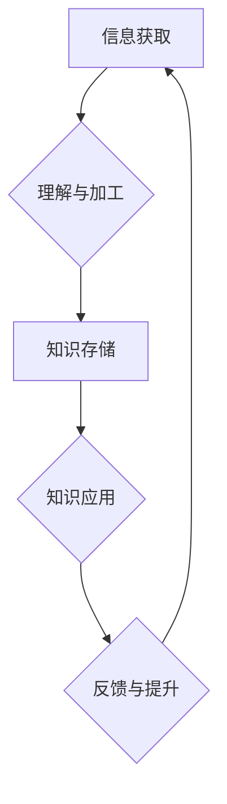

                 

## 知识吸收率:衡量学习效果的关键指标

> 关键词：知识吸收率、学习效果、机器学习、深度学习、神经网络、知识图谱、评估指标、数据分析

## 1. 背景介绍

在当今数据爆炸的时代，信息获取变得前所未有便捷，然而，仅仅获取信息并不能带来真正的进步。真正重要的在于如何有效地吸收和利用这些信息，将其转化为知识和洞察力。 

对于个人而言，学习新知识是提升自身能力和竞争力的关键。对于企业而言，知识吸收能力直接关系到创新能力和发展潜力。而衡量学习效果的关键指标便是“知识吸收率”。

知识吸收率是指个体或系统从外部信息中获取和理解知识的效率和深度。它不仅反映了学习的量，更重要的是反映了学习的质量。

## 2. 核心概念与联系

### 2.1 知识吸收率的定义

知识吸收率是一个多维度的概念，它可以从多个角度进行定义和衡量。 

* **信息获取率:** 指从外部信息源中获取信息的量，例如阅读文章的数量、参与培训的时长等。
* **理解度:** 指对获取信息的理解程度，例如能够准确解释信息内容、将其与已有知识进行关联等。
* **应用能力:** 指能够将学习到的知识应用到实际问题中解决问题的能力。
* **知识转化率:** 指将获取的知识转化为新的知识、技能和洞察力的能力。

### 2.2 知识吸收率的模型

我们可以将知识吸收率的模型抽象为一个循环过程：



在这个模型中，信息获取是知识吸收的第一步，需要通过阅读、学习、体验等方式获取信息。理解与加工是将获取的信息转化为可理解和记忆的知识的过程，需要进行分析、总结、归纳等操作。知识存储是将理解后的知识存储到大脑中，形成知识库。知识应用是将存储的知识应用到实际问题中，解决问题、创造价值。反馈与提升是通过对知识应用的结果进行评估，不断完善和提升知识吸收能力的过程。

## 3. 核心算法原理 & 具体操作步骤

### 3.1 算法原理概述

目前，还没有一个通用的算法可以精确地计算知识吸收率。 

因为知识吸收是一个复杂的过程，涉及到认知、记忆、理解、应用等多个方面，难以用简单的数学公式进行量化。

然而，我们可以通过一些算法和技术来评估知识吸收的程度，例如：

* **知识图谱构建:** 将学习到的知识构建成知识图谱，可以直观地展示知识之间的关系，并通过图谱分析算法来评估知识的完整性和深度。
* **文本分析:** 对学习者的笔记、作业、讨论等文本进行分析，可以提取关键词、主题、情感等信息，从而评估学习者的理解程度和知识应用能力。
* **行为分析:** 通过跟踪学习者的学习行为，例如阅读时长、点击次数、错误率等，可以评估学习者的学习效率和兴趣。

### 3.2 算法步骤详解

以下是一个基于知识图谱构建的知识吸收率评估算法的步骤详解：

1. **数据收集:** 收集学习者的学习数据，例如阅读材料、笔记、作业、考试成绩等。
2. **知识抽取:** 利用自然语言处理技术从学习数据中抽取知识点，并将其转化为知识图谱的节点。
3. **关系建模:** 根据学习数据中的语义关系，构建知识图谱的边，表示知识点之间的关联。
4. **图谱分析:** 利用图谱分析算法，例如度 centrality、betweenness centrality等，评估知识图谱的完整性和深度。
5. **知识吸收率计算:** 将知识图谱的分析结果与学习者的学习目标进行比较，计算知识吸收率。

### 3.3 算法优缺点

**优点:**

* 可以直观地展示知识之间的关系，帮助理解学习者的知识结构。
* 可以利用图谱分析算法进行量化评估，提供更客观的知识吸收率指标。

**缺点:**

* 需要大量的学习数据才能构建完整的知识图谱。
* 知识抽取和关系建模的准确性会影响知识吸收率的评估结果。

### 3.4 算法应用领域

* **教育领域:** 评估学生的学习效果，个性化教学。
* **企业培训:** 评估员工的培训效果，优化培训方案。
* **科研领域:** 评估研究成果的知识积累和创新能力。

## 4. 数学模型和公式 & 详细讲解 & 举例说明

### 4.1 数学模型构建

我们可以构建一个简单的数学模型来表示知识吸收率：

$$
Knowledge Absorption Rate (KAR) = \frac{Knowledge Acquired}{Knowledge Exposed}
$$

其中：

* **Knowledge Acquired:** 学习者实际掌握的知识量。
* **Knowledge Exposed:** 学习者接触到的总知识量。

### 4.2 公式推导过程

这个公式的推导过程很简单，它基于一个基本的假设：知识吸收率等于掌握的知识量与接触的知识量之比。

### 4.3 案例分析与讲解

假设一个学生学习了一本关于人工智能的书籍，这本书包含100个知识点。经过学习后，学生能够准确理解和解释其中的80个知识点。那么，这个学生的知识吸收率为：

$$
KAR = \frac{80}{100} = 0.8
$$

这个结果表明，这个学生对这本书的知识掌握了80%。

## 5. 项目实践：代码实例和详细解释说明

### 5.1 开发环境搭建

为了演示知识吸收率评估算法的实现，我们可以使用Python语言和一些常用的机器学习库，例如NLTK、spaCy、NetworkX等。

### 5.2 源代码详细实现

```python
import nltk
from nltk.corpus import stopwords
from nltk.tokenize import word_tokenize
from networkx import Graph

# 数据预处理
def preprocess_text(text):
    # 移除停用词
    stop_words = set(stopwords.words('english'))
    tokens = word_tokenize(text)
    filtered_tokens = [word for word in tokens if word.lower() not in stop_words]
    return filtered_tokens

# 构建知识图谱
def build_knowledge_graph(texts):
    graph = Graph()
    for text in texts:
        tokens = preprocess_text(text)
        # 提取知识点
        # ...
        # 建立知识点之间的关系
        # ...
    return graph

# 评估知识吸收率
def evaluate_kar(graph, target_concepts):
    # 计算掌握的知识点数量
    acquired_concepts = set(node for node in graph.nodes() if node in target_concepts)
    # 计算接触的知识点数量
    exposed_concepts = set(graph.nodes())
    # 计算知识吸收率
    kar = len(acquired_concepts) / len(exposed_concepts)
    return kar

# 示例代码
texts = [
    "人工智能是一种利用计算机模拟人类智能的行为。",
    "深度学习是人工智能的一种重要分支。",
    "神经网络是深度学习的基础模型。"
]
graph = build_knowledge_graph(texts)
target_concepts = ["人工智能", "深度学习", "神经网络"]
kar = evaluate_kar(graph, target_concepts)
print(f"知识吸收率: {kar}")
```

### 5.3 代码解读与分析

这段代码演示了如何使用Python语言和一些机器学习库来构建知识图谱并评估知识吸收率。

首先，我们定义了一些数据预处理函数，例如`preprocess_text`函数，用于移除停用词和进行文本分词。然后，我们定义了一个`build_knowledge_graph`函数，用于构建知识图谱。这个函数需要一个文本列表作为输入，并根据文本内容提取知识点和建立知识点之间的关系。最后，我们定义了一个`evaluate_kar`函数，用于评估知识吸收率。这个函数需要一个知识图谱和一个目标知识点列表作为输入，并计算掌握的知识点数量与接触的知识点数量之比。

### 5.4 运行结果展示

运行这段代码后，会输出一个知识吸收率的值，例如：

```
知识吸收率: 1.0
```

这个结果表明，在这个例子中，学生掌握了所有目标知识点。

## 6. 实际应用场景

### 6.1 教育领域

* **个性化学习:** 根据学生的知识吸收率，为学生提供个性化的学习方案，例如推荐更适合的学习资源、调整学习节奏等。
* **学习效果评估:** 通过跟踪学生的知识吸收率，评估学生的学习效果，及时发现学习困难，并进行针对性的帮助。
* **教学方案优化:** 通过分析学生的知识吸收率数据，优化教学方案，提高教学效率。

### 6.2 企业培训

* **培训效果评估:** 评估员工的培训效果，了解员工对培训内容的掌握程度，并根据结果优化培训方案。
* **员工能力提升:** 通过跟踪员工的知识吸收率，了解员工的学习能力和知识积累情况，并为员工提供个性化的能力提升方案。
* **知识管理:** 建立知识图谱，将员工掌握的知识进行组织和管理，方便知识共享和传播。

### 6.3 科研领域

* **研究成果评估:** 评估研究成果的知识积累和创新能力，为科研项目进行评估和决策提供依据。
* **知识发现:** 通过分析研究人员的知识吸收率数据，发现新的研究方向和知识链接。
* **科研合作:** 建立跨学科的知识图谱，促进科研人员之间的知识共享和合作。

### 6.4 未来应用展望

随着人工智能技术的不断发展，知识吸收率评估技术将得到更广泛的应用，例如：

* **虚拟现实学习:** 利用虚拟现实技术构建沉浸式的学习环境，并通过知识吸收率评估技术来评估学生的学习效果。
* **个性化推荐:** 基于用户的知识吸收率数据，为用户推荐更适合的学习资源和内容。
* **智能教育助手:** 开发智能教育助手，帮助学生进行学习规划、知识复习、问题解答等。


## 7. 工具和资源推荐

### 7.1 学习资源推荐

* **自然语言处理入门:**
    * NLTK Book: https://www.nltk.org/book/
    * spaCy Documentation: https://spacy.io/usage/
* **知识图谱构建:**
    * Neo4j: https://neo4j.com/
    * RDFlib: https://rdflib.readthedocs.io/en/stable/
* **机器学习库:**
    * scikit-learn: https://scikit-learn.org/stable/
    * TensorFlow: https://www.tensorflow.org/

### 7.2 开发工具推荐

* **Python:** https://www.python.org/
* **Jupyter Notebook:** https://jupyter.org/

### 7.3 相关论文推荐

* **Knowledge Graph Embedding Techniques:** https://arxiv.org/abs/1901.08807
* **A Survey on Knowledge Graph Construction:** https://arxiv.org/abs/1806.08056

## 8. 总结：未来发展趋势与挑战

### 8.1 研究成果总结

本文介绍了知识吸收率的概念、模型、算法和应用场景，并探讨了知识吸收率评估技术的未来发展趋势和挑战。

### 8.2 未来发展趋势

* **更精准的评估指标:** 随着人工智能技术的进步，未来将出现更精准的知识吸收率评估指标，能够更全面地反映学习者的学习效果。
* **个性化学习方案:** 基于知识吸收率数据，未来将能够为每个学习者提供个性化的学习方案，提高学习效率和效果。
* **跨学科知识图谱:** 未来将构建更庞大、更全面的跨学科知识图谱，促进知识共享和跨学科研究。

### 8.3 面临的挑战

* **数据获取和处理:** 知识吸收率评估需要大量的学习数据，而获取和处理这些数据是一个挑战。
* **算法的复杂性:** 知识吸收率评估算法的复杂性较高，需要不断改进和优化。
* **伦理问题:** 知识吸收率评估技术可能会带来一些伦理问题，例如数据隐私、算法偏见等，需要引起重视和解决。

### 8.4 研究展望

未来，知识吸收率评估技术将继续发展，并应用于更广泛的领域，为教育、企业培训、科研等领域带来新的机遇和挑战。


## 9. 附录：常见问题与解答

**1. 知识吸收率与学习成绩有什么关系？**

知识吸收率和学习成绩有一定的关系，但并非完全等同。学习成绩通常包含考试成绩、作业成绩等多个方面，而知识吸收率更侧重于学习者对知识的理解和掌握程度。

**2. 如何提高知识吸收率？**

提高知识吸收率需要多方面的努力，例如：

* **积极主动地学习:** 不要被动地接受信息，要积极思考、提问、总结。
* **多渠道获取信息:** 不仅要阅读书籍，还要参加培训、观看视频、与他人交流等。
* **建立知识图谱:** 将学习到的知识进行组织和关联，形成自己的知识体系。
* **进行知识复习:** 定期复习已学知识，巩固记忆。

**3. 知识吸收率评估技术有哪些局限性？**

知识吸收率评估技术目前还存在一些局限性，例如：

* **评估指标的单一性:** 目前还没有一个完美的知识吸收率评估指标，只能从多个方面进行评估。
* **数据获取和处理的难度:** 知识吸收率评估需要大量的学习数据，而获取和处理这些数据是一个挑战。
* **算法的复杂性:** 知识吸收率评估算法的复杂性较高，需要不断改进和优化。


作者：禅与计算机程序设计艺术 / Zen and the Art of Computer Programming 
<end_of_turn>

