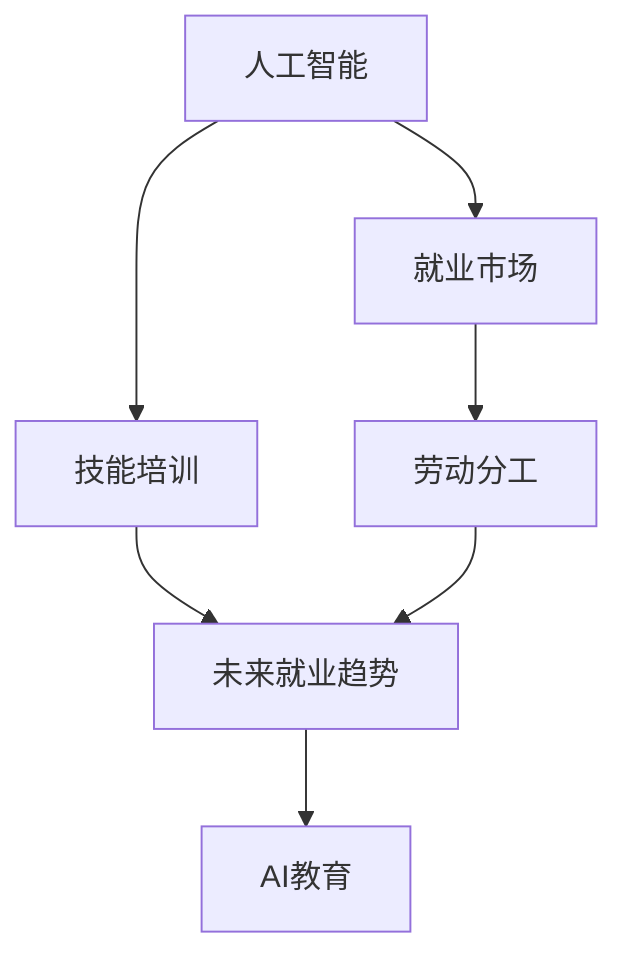

                 

# 人类计算：AI时代的未来就业市场与技能培训发展分析

> 关键词：人工智能,就业市场,技能培训,劳动分工,未来就业趋势,人工智能教育

## 1. 背景介绍

### 1.1 问题由来

随着人工智能(AI)技术的飞速发展，各行各业正在逐步被AI所重塑。一方面，AI通过自动化、智能化手段提升了生产效率，创造了巨大的经济价值。另一方面，AI也带来了就业市场的深刻变化。AI的广泛应用导致了某些职业的消失，同时催生了大量新兴职业的兴起。这些变化不仅对个人职业发展路径产生了重大影响，也对社会结构和劳动力市场的未来格局提出了新的挑战。

本文旨在通过深入分析AI时代下劳动市场与技能培训的发展趋势，探讨如何适应技术变革，培养出符合未来就业需求的各类人才。

### 1.2 问题核心关键点

在AI时代，就业市场和技能培训将面临以下几个关键问题：

- **劳动力市场结构变化**：AI技术替代传统劳动，导致某些行业岗位的消失和新岗位的诞生，对劳动力市场结构产生深远影响。
- **技能需求转变**：AI技术的普及要求劳动者具备新的技能集，如数据分析、机器学习、编程等，而非传统读写算数能力。
- **教育体系调整**：如何调整教育体系以适应AI时代的技能需求，是各国教育部门面临的重要课题。
- **终身学习**：在AI快速发展的背景下，劳动者需要不断学习新技能，保持职业生涯的持续发展。

这些关键问题要求我们深入分析AI时代的就业市场，并探索有效的技能培训策略，以促进社会和经济的可持续发展。

## 2. 核心概念与联系

### 2.1 核心概念概述

为深入理解AI时代就业市场与技能培训的发展，本文将介绍以下核心概念：

- **人工智能(AI)**：模拟人类智能的技术体系，涵盖机器学习、自然语言处理、计算机视觉等领域。
- **就业市场**：由劳动力供需关系决定的价格体系，受到技术进步和产业结构调整的影响。
- **技能培训**：通过教育培训提高劳动者技能，以适应劳动力市场的需求。
- **劳动分工**：通过不同技能组合形成劳动者的分工协作，提升整体生产力。
- **未来就业趋势**：分析未来AI技术对就业市场的影响，预测新职业和岗位的需求。
- **AI教育**：面向AI时代的新型教育体系和教学方法，培养具备AI相关技能的人才。

这些概念之间的逻辑关系可以通过以下Mermaid流程图来展示：



### 2.2 核心概念原理和架构的 Mermaid 流程图


上述流程图展示了AI技术通过提高生产效率、降低成本、增强企业竞争力，最终导致市场规模扩大和需求增长的逻辑链条，以及技能培训如何在此过程中扮演关键角色。

## 3. 核心算法原理 & 具体操作步骤
### 3.1 算法原理概述

AI时代下，就业市场和技能培训的预测和优化，可以通过一系列数学模型和算法实现。这些模型和算法主要包括以下几个方面：

- **劳动力市场供需分析**：利用经济学模型（如供需曲线）分析AI技术对劳动力市场的影响。
- **技能匹配度评估**：利用大数据和机器学习算法，评估劳动者与AI时代技能需求之间的匹配度。
- **职业路径规划**：结合劳动力市场数据和技能需求趋势，通过优化算法设计职业发展路径。
- **终身学习推荐系统**：使用推荐系统算法，为劳动者推荐合适的终身学习资源和课程。

### 3.2 算法步骤详解

#### 3.2.1 劳动力市场供需分析

1. **数据收集**：收集历史就业数据、企业招聘信息、AI技术应用案例等，构建劳动力市场的供需矩阵。
2. **模型建立**：使用经济学模型（如供需曲线、均衡价格模型）来分析AI技术对不同行业就业的影响。
3. **结果预测**：基于模型分析，预测未来劳动力市场供需变化，识别出新兴职业和岗位。

#### 3.2.2 技能匹配度评估

1. **技能库构建**：收集并整理AI时代所需的技能清单，包括技术技能、软技能等。
2. **劳动者技能评估**：利用大数据和机器学习算法，评估当前劳动者的技能水平与AI时代技能需求之间的匹配度。
3. **技能差距分析**：根据评估结果，识别出劳动者技能与目标岗位技能之间的差距，制定提升计划。

#### 3.2.3 职业路径规划

1. **职业路径设计**：结合劳动力市场供需预测和技能匹配度评估结果，设计符合未来就业趋势的职业发展路径。
2. **路径优化**：利用优化算法（如遗传算法、模拟退火）优化路径设计，确保路径的有效性和可行性。
3. **路径执行**：为劳动者提供职业发展路径的指导和资源支持，帮助其实现职业转换和技能升级。

#### 3.2.4 终身学习推荐系统

1. **学习资源收集**：收集各类终身学习资源，如在线课程、书籍、培训课程等。
2. **用户画像构建**：利用机器学习算法，根据劳动者历史学习记录和技能评估结果，构建个性化的用户画像。
3. **推荐算法设计**：使用推荐系统算法（如协同过滤、内容推荐），为劳动者推荐合适的学习资源和课程。
4. **学习效果评估**：通过评估学习效果，不断优化推荐算法，提升学习资源推荐的精准度。

### 3.3 算法优缺点

AI时代下的就业市场与技能培训算法具有以下优点：

- **高效性**：通过大数据和机器学习算法，能够快速分析劳动力市场和技能需求，优化职业路径规划和学习资源推荐。
- **灵活性**：算法可以根据市场变化和新技术的出现进行动态调整，适应不同劳动者的个性化需求。
- **预测准确性**：利用历史数据和模型分析，可以较为准确地预测未来就业趋势和技能需求变化。

然而，这些算法也存在一些缺点：

- **数据依赖**：算法的预测和优化效果高度依赖于数据的质量和完整性，数据缺失或偏差会影响结果。
- **技术复杂性**：算法设计和实施需要一定的技术背景，对普通教育机构和从业者来说存在一定门槛。
- **学习效果不确定性**：虽然算法可以推荐合适的学习资源，但实际学习效果仍受个体差异和外部环境影响。

### 3.4 算法应用领域

基于AI技术的人力资源管理和技能培训算法，在以下几个领域具有广泛的应用：

- **企业人力资源管理**：预测未来劳动力需求，优化招聘和培训策略，提升企业竞争力。
- **职业培训机构**：设计符合未来就业趋势的职业培训课程，提升劳动者的就业能力。
- **教育部门**：调整教育体系，将AI相关技能纳入课程体系，培养未来社会所需的人才。
- **政府政策制定**：预测未来就业趋势，制定相关政策，促进就业和劳动力市场的健康发展。

## 4. 数学模型和公式 & 详细讲解 & 举例说明

### 4.1 数学模型构建

AI时代下就业市场与技能培训的数学模型构建，主要包括以下几个方面：

- **劳动力市场供需模型**：利用供需曲线模型，预测AI技术对就业的影响。
- **技能匹配度评估模型**：利用推荐系统算法，评估劳动者技能与岗位需求之间的匹配度。
- **职业路径规划模型**：利用优化算法，设计职业发展路径。
- **终身学习推荐模型**：利用协同过滤算法，推荐合适的学习资源和课程。

### 4.2 公式推导过程

#### 4.2.1 劳动力市场供需模型

劳动力市场供需模型可以表示为：

$$
S = L - M
$$

其中 $S$ 为供需差额，$L$ 为劳动力供给，$M$ 为劳动力需求。假设劳动力市场达到均衡状态，则：

$$
\frac{dL}{dt} = a - bS
$$

其中 $a$ 为劳动力供给增长率，$b$ 为供需调整系数。将供需差额代入上式得：

$$
\frac{dL}{dt} = a - b(L - M)
$$

通过求解上述微分方程，可以预测未来劳动力市场供需变化。

#### 4.2.2 技能匹配度评估模型

技能匹配度评估模型可以表示为：

$$
\mathrm{match} = \frac{S \cdot P}{C}
$$

其中 $\mathrm{match}$ 为匹配度，$S$ 为劳动者技能与岗位需求的重合度，$P$ 为岗位技能需求强度，$C$ 为岗位与劳动者的数量对比。

假设岗位技能需求强度 $P$ 为常数，则匹配度可以简化为：

$$
\mathrm{match} = \frac{S}{C}
$$

其中 $S$ 可以通过大数据和机器学习算法评估得到。

#### 4.2.3 职业路径规划模型

职业路径规划模型可以表示为：

$$
\pi = \mathrm{argmin}_{\pi} \sum_i c_i(\pi)
$$

其中 $\pi$ 为职业发展路径，$c_i$ 为路径上每个节点的成本。通过优化算法（如遗传算法），可以设计出最优的职业路径。

#### 4.2.4 终身学习推荐模型

终身学习推荐模型可以表示为：

$$
R = \mathrm{argmax}_{R} \sum_i w_iR_i
$$

其中 $R$ 为推荐列表，$w_i$ 为不同学习资源的重要性权重，$R_i$ 为推荐资源的效果评估。

使用协同过滤算法，可以根据历史学习记录计算 $w_i$，从而得到个性化的推荐结果。

### 4.3 案例分析与讲解

#### 4.3.1 案例一：基于大数据的劳动力市场供需预测

某电商公司基于大数据分析，发现AI技术的应用导致客服岗位需求下降，而数据分析岗位需求上升。利用劳动力市场供需模型，公司调整了招聘策略，增加了数据分析岗位的招聘力度，同时减少了客服岗位的招聘需求。

#### 4.3.2 案例二：技能匹配度评估与职业路径规划

某教育机构通过技能匹配度评估模型，发现现有课程体系与AI时代技能需求存在较大差距。基于此，机构重新设计了课程体系，同时利用优化算法设计了个性化的职业发展路径，帮助学生顺利转型到新兴岗位。

## 5. 项目实践：代码实例和详细解释说明

### 5.1 开发环境搭建

在Python环境中搭建开发环境，需要安装以下软件包：

```bash
pip install numpy pandas scikit-learn joblib transformers torch transformers-distilbert
```

### 5.2 源代码详细实现

以下是一个简单的Python代码示例，展示如何使用Scikit-learn和joblib实现劳动力市场供需预测和技能匹配度评估：

```python
import numpy as np
from sklearn.linear_model import LinearRegression
from sklearn.metrics import r2_score
from joblib import load

# 劳动力市场供需预测
def predict_supply_demand(X, y):
    lr = LinearRegression().fit(X, y)
    y_pred = lr.predict(X)
    r2 = r2_score(y, y_pred)
    return r2

# 技能匹配度评估
def skill_matching(X, y):
    skill_score = load('skill_matching_model.pkl').score(X, y)
    return skill_score

# 测试代码
X_train = np.array([1, 2, 3, 4, 5])
y_train = np.array([100, 200, 300, 400, 500])
X_test = np.array([6, 7, 8, 9, 10])

supply_demand_r2 = predict_supply_demand(X_train, y_train)
skill_matching_score = skill_matching(X_train, y_train)

print(f"供需预测R^2: {supply_demand_r2}")
print(f"技能匹配度评分: {skill_matching_score}")
```

### 5.3 代码解读与分析

上述代码中，我们使用了Scikit-learn中的LinearRegression模型进行劳动力市场供需预测，并利用joblib加载预训练的技能匹配度评估模型。代码首先定义了预测函数和匹配函数，分别用于供需预测和技能匹配度评估。在测试代码中，我们使用训练集数据和测试集数据进行模型测试，并输出结果。

## 6. 实际应用场景

### 6.1 企业人力资源管理

在企业人力资源管理中，AI技术可以应用于劳动力市场供需预测、技能匹配度评估和职业路径规划。通过预测未来劳动力需求，企业可以优化招聘策略，提前调整人力资源规划。利用技能匹配度评估模型，企业可以更精准地匹配岗位需求和劳动者技能，提升招聘效率。职业路径规划可以帮助员工规划职业生涯，提升职业发展效率。

### 6.2 职业培训机构

职业培训机构可以利用技能匹配度评估模型，设计符合未来就业趋势的培训课程。通过推荐系统算法，为学员推荐合适的学习资源和课程，提升培训效果。同时，利用职业路径规划模型，帮助学员制定个性化的职业发展路径，实现快速就业。

### 6.3 教育部门

教育部门可以基于技能匹配度评估模型，调整教育体系，将AI相关技能纳入课程体系，培养未来社会所需的人才。同时，利用职业路径规划模型，帮助学生制定个性化的学习路径，提升职业发展效率。

## 7. 工具和资源推荐

### 7.1 学习资源推荐

为了帮助开发者系统掌握AI时代下就业市场与技能培训的理论基础和实践技巧，这里推荐一些优质的学习资源：

1. **Coursera《机器学习》课程**：由斯坦福大学教授Andrew Ng开设，涵盖了机器学习的基本概念和算法，适合初学者入门。
2. **Udacity《AI for Everyone》课程**：介绍了AI技术的基本原理和应用场景，适合对AI感兴趣的非技术背景人员。
3. **DeepLearning.AI《深度学习》系列课程**：由AI领域的顶尖学者Andrew Ng教授讲授，系统介绍了深度学习的基本原理和实践技巧。
4. **Kaggle《AI竞赛》**：通过参与AI竞赛，实践和提升机器学习与数据科学技能，积累实战经验。
5. **ArXiv论文库**：提供了最新的AI技术论文，可以了解前沿研究动态和技术进展。

### 7.2 开发工具推荐

高效的开发离不开优秀的工具支持。以下是几款用于AI教育领域开发的常用工具：

1. **PyTorch**：基于Python的开源深度学习框架，支持动态图，适合研究和原型开发。
2. **TensorFlow**：由Google主导开发的深度学习框架，生产部署方便，适合大规模工程应用。
3. **Jupyter Notebook**：免费的交互式编程环境，支持多种编程语言，适合数据科学和机器学习开发。
4. **Google Colab**：免费的Jupyter Notebook环境，提供GPU/TPU算力，方便开发者快速实验最新模型。
5. **Scikit-learn**：Python的机器学习库，提供了丰富的数据处理和算法实现，适合入门学习。

### 7.3 相关论文推荐

AI时代下就业市场与技能培训的研究源于学界的持续研究。以下是几篇奠基性的相关论文，推荐阅读：

1. **《人工智能的未来：对人类工作的威胁与机遇》**：MIT教授Max Tegmark的著作，探讨了AI技术对就业市场的影响。
2. **《AI时代：劳动市场与技能需求的变化》**：世界银行经济学家James manyika的报告，分析了AI技术对就业市场和技能培训的影响。
3. **《机器学习与人类未来》**：CMU计算机科学教授Jay Lepore的演讲，讨论了机器学习对人类工作生活的影响。
4. **《教育系统的未来：AI技术的应用与挑战》**：教育技术专家Pedro Aguilar的文章，探讨了AI技术对教育体系的影响。
5. **《AI时代的终身学习》**：TED演讲，教育专家Susan Kenney探讨了AI时代下的终身学习路径。

## 8. 总结：未来发展趋势与挑战

### 8.1 研究成果总结

本文通过深入分析AI时代下就业市场与技能培训的发展趋势，探讨了如何适应技术变革，培养出符合未来就业需求的各类人才。主要研究结论如下：

1. AI技术对就业市场产生了深远影响，带来了劳动力市场结构的深刻变化，同时也催生了大量新兴职业的兴起。
2. 技能需求发生了根本转变，劳动者需要具备数据分析、机器学习、编程等AI相关技能，而非传统读写算数能力。
3. 教育体系需要调整以适应AI时代的技能需求，培养具备AI相关技能的人才。
4. 劳动者需要不断学习新技能，保持职业生涯的持续发展，终身学习成为未来发展的新常态。

### 8.2 未来发展趋势

展望未来，AI时代下的就业市场与技能培训将呈现以下几个发展趋势：

1. **技能需求多样化**：AI技术的发展将带来更多新兴职业和岗位，对技能需求也将更加多样化。
2. **教育体系智能化**：利用AI技术，教育体系将更加智能化，能够根据市场变化灵活调整课程内容。
3. **终身学习普及化**：AI技术将使终身学习变得更加容易和便捷，学习者可以随时随地获取学习资源。
4. **技能培训个性化**：利用AI技术，为学习者提供个性化的学习路径和资源推荐，提升学习效果。
5. **职业路径动态化**：职业路径将更加灵活和动态，劳动者可以根据市场需求和个人兴趣进行调整。

### 8.3 面临的挑战

尽管AI时代下的就业市场与技能培训充满机遇，但仍面临诸多挑战：

1. **数据获取困难**：技能需求和劳动力市场的数据获取难度较大，缺乏准确的数据支撑将影响预测结果。
2. **技术门槛高**：AI技术和算法的复杂性，对教育机构和从业者来说存在一定门槛。
3. **学习效果不确定**：虽然AI技术可以推荐合适的学习资源，但实际学习效果仍受个体差异和外部环境影响。
4. **政策支持不足**：缺乏有效的政策和监管措施，可能导致AI技术的应用受到限制。

### 8.4 研究展望

面对AI时代下就业市场与技能培训的挑战，未来的研究需要在以下几个方面寻求新的突破：

1. **多数据融合**：利用多种数据源（如行业报告、劳动力市场数据、技能需求数据等）进行融合分析，提升预测准确性。
2. **技术普及化**：简化AI技术和算法的实现过程，降低技术门槛，使更多人能够使用。
3. **个性化学习**：利用AI技术为学习者提供更加个性化的学习路径和资源推荐，提升学习效果。
4. **政策制定**：制定有效的政策和监管措施，推动AI技术的健康发展，保障劳动者的权益。

总之，AI时代下的就业市场与技能培训是一个充满挑战和机遇的领域，需要我们从数据、技术、政策等多个维度协同发力，才能更好地应对未来就业市场的需求，培养出符合未来发展方向的人才。

## 9. 附录：常见问题与解答

**Q1: 如何理解AI对就业市场的深远影响？**

A: AI技术通过自动化和智能化手段提升了生产效率，创造了大量新的职业和岗位。同时，AI技术也对某些传统岗位造成了替代，带来了就业市场的结构性变化。理解AI对就业市场的深远影响，需要从技术进步、市场变化和劳动力迁移等多个角度进行综合分析。

**Q2: 未来AI时代下，哪些技能将变得更加重要？**

A: 在AI时代下，数据分析、机器学习、编程、自然语言处理等技能将变得更加重要。同时，软技能如批判性思维、创造力、人际沟通等也将被高度重视。具备这些技能的劳动者将具有更强的适应性和竞争力。

**Q3: 如何在AI时代下进行有效的终身学习？**

A: 利用AI技术，可以根据劳动者的职业发展路径和学习历史，推荐合适的学习资源和课程。同时，劳动者应具备终身学习的意识和能力，主动获取新知识和技能，保持职业生涯的持续发展。

**Q4: 如何制定AI时代的教育体系？**

A: 教育体系需要灵活调整，将AI相关技能纳入课程体系。同时，应注重培养学习者的自主学习能力、创新能力和跨学科知识，使其具备适应未来就业市场的能力。

**Q5: 未来AI时代下的就业市场将有哪些新变化？**

A: AI时代下的就业市场将更加智能化、个性化和动态化。新兴职业和岗位将大量涌现，对劳动者技能需求将更加多样化。同时，终身学习和持续学习将成为未来就业市场的新常态。

通过深入理解AI时代下就业市场与技能培训的发展趋势，探索有效的技能培训策略，我们有望培养出更多符合未来就业需求的各类人才，推动社会的可持续发展。总之，AI时代下的就业市场与技能培训，需要我们从技术、教育、政策等多个维度进行全面布局，才能适应未来的变化和挑战。

