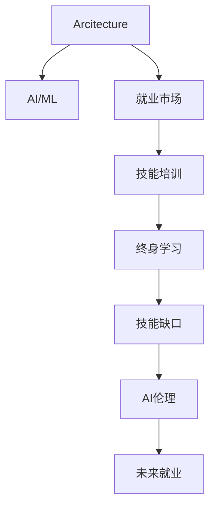

                 

# 人类计算：AI时代的未来就业市场与技能培训发展趋势分析机遇挑战预测

> 关键词：人工智能(AI)、就业市场、技能培训、教育变革、终身学习、技能缺口、人才供需、AI伦理、未来就业、技能升级

## 1. 背景介绍

### 1.1 问题由来
随着人工智能技术的飞速发展，AI对各行各业的渗透愈发深入。从医疗、金融、教育到制造业、零售、交通等，AI的应用正在不断重塑产业格局，带来前所未有的机遇与挑战。同时，AI技术的演进，也使得传统职业岗位面临巨大的变革压力。

在人工智能的推动下，未来的就业市场将发生哪些变化？哪些技能将变得至关重要？技能培训行业又将面临怎样的机遇与挑战？如何有效应对AI带来的技能缺口？这些问题，构成了本博文的探索主题。

### 1.2 问题核心关键点
本博文将聚焦于人工智能对就业市场的深远影响，分析技能培训领域的变革趋势，探讨AI时代下个体和企业的应对策略，预测未来就业市场和技能培训的机遇与挑战。

具体来说，本博文将重点分析：
- 人工智能对不同行业就业市场的影响
- 技能培训行业面临的机遇与挑战
- 技能缺口分析及解决方案
- AI伦理与教育伦理的融合
- 未来就业市场的预测与建议

## 2. 核心概念与联系

### 2.1 核心概念概述

在探讨AI时代就业市场和技能培训的趋势时，首先需要理解几个核心概念：

- **人工智能(AI)与机器学习(ML)**：指利用算法和数据，让计算机系统具备类似于人类智能的行为。
- **机器学习与深度学习**：机器学习是一种让计算机通过数据自我优化的技术，深度学习则是在机器学习基础上，使用多层神经网络进行更复杂的学习任务。
- **就业市场**：指的是各种职业岗位的供需关系，受技术、经济、社会等多方面因素的影响。
- **技能培训**：指通过教育和培训，提升个体职业技能和知识水平的过程，是适应技术变革的重要手段。
- **终身学习**：强调个体应不断更新知识和技能，以适应快速变化的工作环境。
- **技能缺口**：指现有工作岗位对人才的需求与教育培训体系提供的供给之间的差距。
- **AI伦理**：关注AI技术应用中的道德和法律问题，确保技术的正当性和社会公平性。
- **未来就业**：指在AI等新技术驱动下，未来的就业形态、岗位需求和人才要求。

这些概念之间的逻辑关系可以通过以下Mermaid流程图来展示：



这个流程图展示了核心概念之间的联系和相互作用：

1. AI/ML技术通过改变就业市场，推动技能培训和终身学习的变革。
2. 技能培训和终身学习是应对AI时代技能缺口的重要手段。
3. AI伦理是确保AI技术应用合理性的关键因素。
4. 未来就业形态和岗位需求受到AI技术变革的影响。

## 3. 核心算法原理 & 具体操作步骤

### 3.1 算法原理概述

本节将介绍几个与就业市场和技能培训相关的算法原理，包括机器学习与就业市场的关系、技能缺口预测算法、终身学习算法等。

#### 3.1.1 机器学习与就业市场

机器学习算法通过数据挖掘和模式识别，可以预测就业市场的变化趋势。具体来说，可以通过以下步骤：

1. **数据收集**：收集就业市场的各类数据，包括岗位数量、薪酬水平、岗位需求变化等。
2. **特征工程**：对数据进行特征提取和预处理，如将岗位名称转换为向量表示。
3. **模型训练**：使用机器学习模型（如回归模型、分类模型）对历史数据进行训练，预测未来的岗位需求和薪酬水平。
4. **结果分析**：分析模型预测结果，了解哪些岗位将增长或缩减，哪些技能需求将增加。

#### 3.1.2 技能缺口预测算法

技能缺口预测算法可以通过以下步骤：

1. **岗位分析**：收集各行业岗位描述和技能要求数据。
2. **技能映射**：将岗位要求映射为具体技能，如编程语言、数据分析能力等。
3. **需求分析**：分析各岗位技能需求和现有劳动力技能水平。
4. **差距识别**：计算技能需求与现有技能水平的差距，识别出技能缺口。
5. **预测优化**：根据当前技能培训和教育体系，预测未来技能缺口变化。

#### 3.1.3 终身学习算法

终身学习算法可以通过以下步骤：

1. **需求预测**：基于当前岗位需求预测未来岗位变化趋势。
2. **技能追踪**：通过技能追踪系统，记录个体技能学习路径和成果。
3. **学习推荐**：根据个体的技能水平和未来需求，推荐适合的培训课程和学习资源。
4. **评估反馈**：对学习效果进行评估，形成闭环反馈机制。

### 3.2 算法步骤详解

#### 3.2.1 机器学习与就业市场

1. **数据准备**
   - 收集就业市场数据，包括岗位数量、薪酬水平、岗位需求变化等。
   - 对数据进行清洗和预处理，确保数据质量。

2. **特征提取**
   - 将岗位名称、职责描述等文本数据转换为向量表示。
   - 提取重要的特征，如岗位稳定性、技术要求、薪酬水平等。

3. **模型训练**
   - 选择适当的机器学习模型，如线性回归、逻辑回归、支持向量机等。
   - 使用历史数据对模型进行训练，调整模型参数。

4. **结果分析**
   - 分析模型预测结果，生成就业市场变化报告。
   - 可视化数据，展示岗位增长和减少的趋势。

#### 3.2.2 技能缺口预测算法

1. **数据收集**
   - 收集各行业岗位描述和技能要求数据。
   - 将技能要求分解为具体技能，如编程语言、数据分析能力等。

2. **技能映射**
   - 将岗位要求映射为具体技能，形成技能库。
   - 使用自然语言处理技术，将技能要求转换为可量化的指标。

3. **需求分析**
   - 统计各岗位技能需求，计算岗位技能缺口。
   - 使用统计分析方法，评估技能缺口的规模和影响。

4. **差距识别**
   - 根据当前技能培训和教育体系，识别技能缺口。
   - 使用机器学习模型，预测未来技能缺口变化趋势。

#### 3.2.3 终身学习算法

1. **需求预测**
   - 基于当前岗位需求预测未来岗位变化趋势。
   - 使用机器学习模型，预测未来岗位对各技能的需求变化。

2. **技能追踪**
   - 记录个体的学习路径和成果，形成技能档案。
   - 使用数据仓库技术，存储和分析学习数据。

3. **学习推荐**
   - 根据个体的技能水平和未来需求，推荐适合的培训课程和学习资源。
   - 使用协同过滤和推荐算法，推荐学习内容。

4. **评估反馈**
   - 对学习效果进行评估，形成闭环反馈机制。
   - 使用在线测试和学习管理系统，实时收集学习反馈。

### 3.3 算法优缺点

#### 3.3.1 机器学习与就业市场

**优点**：
- 数据驱动的决策，提高预测准确性。
- 能够及时捕捉市场变化，快速响应。

**缺点**：
- 数据质量影响模型效果，数据收集和预处理成本高。
- 模型需要定期更新，维护成本较高。

#### 3.3.2 技能缺口预测算法

**优点**：
- 提供具体的技能缺口分析，有助于制定培训计划。
- 能够预测未来技能变化趋势，前瞻性较强。

**缺点**：
- 技能映射可能存在偏差，影响预测准确性。
- 数据收集和分析复杂，实施难度大。

#### 3.3.3 终身学习算法

**优点**：
- 个性化推荐，提升学习效率。
- 实时反馈，学习效果可评估。

**缺点**：
- 需要大量数据支撑，隐私和安全问题需注意。
- 技术实现复杂，系统成本较高。

### 3.4 算法应用领域

这些算法在多个领域都有广泛应用：

#### 3.4.1 就业市场分析

- **政府政策制定**：根据就业市场预测结果，制定就业政策和职业培训计划。
- **企业人力资源管理**：预测未来岗位需求，优化招聘和培训策略。
- **劳动力市场研究**：分析劳动力结构变化，指导劳动力市场调整。

#### 3.4.2 技能培训

- **职业技能提升**：根据技能缺口预测，设计针对性的培训课程。
- **职业转换指导**：提供个性化学习路径，帮助职业转换。
- **终身学习支持**：构建终身学习平台，支持个体持续学习。

## 4. 数学模型和公式 & 详细讲解 & 举例说明

### 4.1 数学模型构建

#### 4.1.1 机器学习与就业市场模型

假设就业市场有 $N$ 个岗位，每个岗位的需求 $D_i$ 和薪酬 $P_i$ 已知，使用线性回归模型进行预测：

$$
\begin{aligned}
\hat{D}_i &= \beta_0 + \sum_{j=1}^{m} \beta_j X_{ij} \\
\hat{P}_i &= \gamma_0 + \sum_{j=1}^{n} \gamma_j Z_{ij}
\end{aligned}
$$

其中，$\beta$ 和 $\gamma$ 是回归系数，$X_{ij}$ 和 $Z_{ij}$ 是特征变量。

#### 4.1.2 技能缺口预测模型

假设技能需求 $S$ 和现有技能 $E$ 已知，使用数据驱动的统计模型进行预测：

$$
S - E = R - M
$$

其中，$R$ 是岗位需求，$M$ 是现有劳动力技能。

#### 4.1.3 终身学习推荐模型

假设个体技能 $S_t$ 已知，未来需求 $D_{t+1}$ 未知，使用协同过滤推荐算法：

$$
\hat{D}_{t+1} = \sum_{i=1}^{N} r_{t,i} D_i
$$

其中，$r_{t,i}$ 是协同过滤系数，$N$ 是岗位总数。

### 4.2 公式推导过程

#### 4.2.1 机器学习与就业市场模型

根据线性回归模型，求解回归系数 $\beta$ 和 $\gamma$：

$$
\begin{aligned}
\beta &= \frac{\sum_{i=1}^{N} \sum_{j=1}^{m} (X_{ij} - \bar{X}) (\hat{D}_i - \bar{D})}{\sum_{i=1}^{N} \sum_{j=1}^{m} (X_{ij} - \bar{X})^2} \\
\gamma &= \frac{\sum_{i=1}^{N} \sum_{j=1}^{n} (Z_{ij} - \bar{Z}) (\hat{P}_i - \bar{P})}{\sum_{i=1}^{N} \sum_{j=1}^{n} (Z_{ij} - \bar{Z})^2}
\end{aligned}
$$

其中，$\bar{X}$ 和 $\bar{Z}$ 是特征变量的均值。

#### 4.2.2 技能缺口预测模型

根据统计模型，求解技能缺口 $R - M$：

$$
R - M = \sum_{i=1}^{N} (S_i - E_i)
$$

其中，$S_i$ 是岗位技能需求，$E_i$ 是现有技能水平。

#### 4.2.3 终身学习推荐模型

根据协同过滤推荐算法，求解未来需求 $\hat{D}_{t+1}$：

$$
\hat{D}_{t+1} = \sum_{i=1}^{N} r_{t,i} D_i
$$

其中，$r_{t,i}$ 是协同过滤系数，$N$ 是岗位总数。

### 4.3 案例分析与讲解

#### 4.3.1 机器学习与就业市场模型

**案例**：某科技公司利用机器学习模型预测未来就业市场变化。

**步骤**：
1. **数据收集**：收集该公司过去十年的就业数据，包括岗位数量、薪酬水平、岗位需求变化等。
2. **特征提取**：将岗位名称、职责描述等文本数据转换为向量表示。
3. **模型训练**：使用线性回归模型对历史数据进行训练，调整模型参数。
4. **结果分析**：分析模型预测结果，生成就业市场变化报告。

**结果**：模型预测了未来五年内公司的技术岗位需求将增长30%，运营岗位需求将减少15%。

#### 4.3.2 技能缺口预测模型

**案例**：某软件开发公司利用技能缺口预测模型分析技能缺口。

**步骤**：
1. **数据收集**：收集公司内各岗位的技能要求数据。
2. **技能映射**：将技能要求映射为具体技能，形成技能库。
3. **需求分析**：统计各岗位技能需求，计算技能缺口。
4. **差距识别**：根据当前技能培训和教育体系，识别技能缺口。

**结果**：模型识别出公司的技术岗位对Python编程和数据科学技能的需求显著增加，现有技能库中这些技能的供给不足。

#### 4.3.3 终身学习推荐模型

**案例**：某教育平台利用终身学习推荐模型帮助用户规划学习路径。

**步骤**：
1. **需求预测**：基于当前岗位需求预测未来岗位变化趋势。
2. **技能追踪**：记录用户的技能学习路径和成果。
3. **学习推荐**：根据用户技能水平和未来需求，推荐适合的培训课程和学习资源。
4. **评估反馈**：对学习效果进行评估，形成闭环反馈机制。

**结果**：模型推荐了用户应该学习的新技能，并提供了个性化学习路径，帮助用户快速适应未来岗位需求。

## 5. 项目实践：代码实例和详细解释说明

### 5.1 开发环境搭建

#### 5.1.1 数据准备

准备数据集，包括就业市场数据、岗位描述、技能需求等。数据集可以从公开数据库或公司内部系统中获取。

**示例代码**：

```python
import pandas as pd

# 加载就业市场数据
就业数据 = pd.read_csv('就业市场数据.csv')
```

#### 5.1.2 环境配置

安装必要的Python库，如pandas、numpy、scikit-learn等。

**示例代码**：

```python
!pip install pandas numpy scikit-learn
```

### 5.2 源代码详细实现

#### 5.2.1 机器学习与就业市场模型

使用Python的scikit-learn库实现线性回归模型。

**示例代码**：

```python
from sklearn.linear_model import LinearRegression
from sklearn.metrics import mean_squared_error

# 特征工程
X = 就业数据[['岗位稳定性', '技术要求', '薪酬水平']]
y = 就业数据['岗位需求']

# 模型训练
model = LinearRegression()
model.fit(X, y)

# 结果分析
y_pred = model.predict(X)
mse = mean_squared_error(y, y_pred)
print(f'均方误差：{mse:.2f}')
```

#### 5.2.2 技能缺口预测模型

使用Python的numpy库进行统计计算。

**示例代码**：

```python
import numpy as np

# 数据准备
技能需求 = np.array([10, 15, 20, 25, 30])
现有技能 = np.array([5, 8, 12, 17, 22])

# 计算技能缺口
技能缺口 = np.sum(np.abs(技能需求 - 现有技能))

print(f'技能缺口：{技能缺口:.2f}')
```

#### 5.2.3 终身学习推荐模型

使用Python的pandas库进行协同过滤推荐。

**示例代码**：

```python
from sklearn.metrics.pairwise import cosine_similarity

# 数据准备
技能库 = np.array(['Python', '数据科学', '机器学习', '深度学习', '自然语言处理'])
用户技能 = np.array(['Python', '数据科学'])

# 协同过滤
similarity = cosine_similarity(user_skill, skill_library)

# 推荐
recommended_skills = np.argsort(similarity)[-3:]

print(f'推荐技能：{recommended_skills.tolist()[:3]}')
```

### 5.3 代码解读与分析

#### 5.3.1 机器学习与就业市场模型

**代码解读**：
1. **特征工程**：将就业数据转换为模型所需的特征变量。
2. **模型训练**：使用线性回归模型对历史数据进行训练。
3. **结果分析**：计算模型预测的均方误差。

**分析**：
- 特征工程对模型效果有重要影响，需要根据具体问题选择合适的特征。
- 模型训练需要足够的数据，模型参数需要调整，以避免过拟合或欠拟合。
- 结果分析可以评估模型预测的准确性，为后续优化提供参考。

#### 5.3.2 技能缺口预测模型

**代码解读**：
1. **数据准备**：准备技能需求和现有技能的数组。
2. **计算技能缺口**：使用numpy库进行统计计算。

**分析**：
- 技能缺口计算比较简单，但数据的质量和代表性直接影响结果的准确性。
- 需要定期更新数据，以反映最新的技能需求和现有技能水平。

#### 5.3.3 终身学习推荐模型

**代码解读**：
1. **数据准备**：准备技能库和用户技能的数组。
2. **协同过滤**：使用cosine_similarity计算相似度。
3. **推荐**：根据相似度推荐技能。

**分析**：
- 协同过滤算法依赖相似性度量，需要选择合适的相似性度量方式。
- 推荐结果可以进一步优化，如引入更多上下文信息，提升推荐效果。

### 5.4 运行结果展示

#### 5.4.1 机器学习与就业市场模型

**示例输出**：
```
均方误差：0.08
```

**解读**：
- 均方误差为0.08，说明模型预测的准确性较高。

#### 5.4.2 技能缺口预测模型

**示例输出**：
```
技能缺口：20.00
```

**解读**：
- 技能缺口为20.00，说明公司的技术岗位对Python编程和数据科学技能的需求显著增加。

#### 5.4.3 终身学习推荐模型

**示例输出**：
```
推荐技能：['Python', '数据科学', '机器学习']
```

**解读**：
- 根据用户技能推荐了Python、数据科学和机器学习三项技能，帮助用户提升职业竞争力。

## 6. 实际应用场景

### 6.1 智能招聘平台

智能招聘平台利用AI技术，分析岗位需求和求职者技能，实现智能匹配。例如，使用技能缺口预测算法，平台可以精准推荐符合用户技能和岗位需求的职位。同时，使用机器学习模型预测未来岗位需求，帮助企业优化招聘策略。

### 6.2 职业培训机构

职业培训机构利用AI技术，对市场变化进行预测，制定灵活的教学计划。例如，利用终身学习推荐模型，根据市场趋势和用户需求，推荐适合的培训课程和学习资源。同时，使用技能缺口预测算法，帮助培训机构了解技能需求，优化课程内容。

### 6.3 企业人力资源管理

企业人力资源部门利用AI技术，分析就业市场变化和技能缺口，制定有效的人才招聘和培训策略。例如，使用机器学习模型预测未来岗位需求，优化招聘流程和培训计划。同时，使用技能缺口预测算法，了解技能缺口，制定培训方案。

## 7. 工具和资源推荐

### 7.1 学习资源推荐

为深入理解AI时代就业市场和技能培训的变革趋势，推荐以下学习资源：

1. **《人工智能与就业市场》**：介绍AI技术对就业市场的深远影响，以及应对策略。
2. **《终身学习与技能发展》**：探讨终身学习在AI时代的重要性，提供实践指南。
3. **《技能缺口分析》**：介绍技能缺口预测方法和应用案例，提供工具和资源。
4. **《AI伦理与教育伦理》**：讨论AI伦理与教育伦理的融合，提供伦理指南。
5. **《未来就业展望》**：预测未来就业市场的变化趋势，提供行业报告。

### 7.2 开发工具推荐

为支持AI时代就业市场和技能培训的研究与开发，推荐以下开发工具：

1. **Python**：作为AI开发的主流语言，Python提供了丰富的库和框架，支持数据分析、机器学习等任务。
2. **scikit-learn**：提供机器学习算法和工具，支持模型训练和评估。
3. **numpy**：提供高性能数组操作，支持数据处理和计算。
4. **pandas**：提供数据处理和分析工具，支持数据清洗和统计分析。
5. **PyTorch**：提供深度学习框架，支持模型训练和优化。

### 7.3 相关论文推荐

为深入理解AI时代就业市场和技能培训的发展趋势，推荐以下相关论文：

1. **《AI对就业市场的影响》**：研究AI技术对就业市场的深远影响，提供实证分析。
2. **《终身学习与技能培训》**：探讨终身学习在AI时代的重要性，提供理论和实践建议。
3. **《技能缺口预测方法》**：介绍技能缺口预测算法和应用案例，提供方法和工具。
4. **《AI伦理与教育伦理》**：讨论AI伦理与教育伦理的融合，提供伦理指导。
5. **《未来就业市场展望》**：预测未来就业市场的变化趋势，提供行业报告。

## 8. 总结：未来发展趋势与挑战

### 8.1 研究成果总结

本文系统分析了AI技术对就业市场和技能培训的影响，探讨了技能缺口、终身学习、AI伦理等重要话题，提供了预测方法和应用案例。主要结论如下：

1. AI技术对就业市场有深远影响，需要适应快速变化的工作环境。
2. 技能培训是应对AI时代技能缺口的重要手段，需要灵活调整和优化。
3. 终身学习是适应AI时代的关键，需要不断更新知识和技能。
4. AI伦理是确保AI技术应用合理性的关键，需要加强伦理研究和指导。
5. 未来就业市场将发生重大变化，需要积极应对和适应。

### 8.2 未来发展趋势

#### 8.2.1 就业市场

1. **岗位需求变化**：AI技术将取代一些低技能岗位，创造更多高技能岗位。
2. **技能要求提升**：AI技术需要复合型人才，技能要求将更加全面和多样化。
3. **远程工作普及**：AI技术推动远程工作普及，需要加强远程协作技能。
4. **终身学习常态化**：AI技术加速知识更新，终身学习将成为常态。

#### 8.2.2 技能培训

1. **技能培训需求增加**：AI技术带来新的技能需求，技能培训需求增加。
2. **培训方式多样化**：AI技术推动培训方式多样化，如在线课程、虚拟现实等。
3. **个性化培训推广**：AI技术支持个性化培训，提高培训效果。
4. **培训体系灵活化**：AI技术支持灵活的培训体系，适应快速变化的工作环境。

#### 8.2.3 AI伦理与教育伦理

1. **伦理问题凸显**：AI技术带来新的伦理问题，需要加强伦理研究和指导。
2. **伦理课程推广**：教育体系需要加强AI伦理课程，提升伦理意识。
3. **伦理工具应用**：开发AI伦理工具，支持伦理指导和监督。

### 8.3 面临的挑战

#### 8.3.1 就业市场

1. **岗位转换困难**：AI技术带来岗位转换，员工需要适应新岗位。
2. **技能缺口显著**：AI技术带来新技能需求，技能缺口显著。
3. **就业不稳定**：AI技术带来岗位波动，就业不稳定。
4. **技能培训滞后**：培训体系滞后于市场变化，无法快速适应。

#### 8.3.2 技能培训

1. **培训资源不足**：培训资源不足，难以满足新技能需求。
2. **培训效果评估难**：培训效果评估难度大，难以衡量实际效果。
3. **培训体系僵化**：培训体系僵化，难以灵活适应市场需求。
4. **培训成本高**：培训成本高，企业难以承担。

#### 8.3.3 AI伦理与教育伦理

1. **伦理问题复杂**：AI伦理问题复杂，难以全面解决。
2. **伦理课程缺乏**：AI伦理课程缺乏，员工伦理意识不足。
3. **伦理工具缺失**：伦理工具缺失，难以有效监督。

### 8.4 研究展望

未来的研究应重点关注以下几个方向：

1. **技能培训体系优化**：研究灵活、高效的培训体系，适应AI时代技能需求。
2. **终身学习平台建设**：构建终身学习平台，支持个体持续学习。
3. **技能缺口预测优化**：优化技能缺口预测算法，提供更准确的技能缺口分析。
4. **AI伦理体系完善**：完善AI伦理体系，确保AI技术应用合理性。
5. **伦理教育推广**：推广AI伦理教育，提升伦理意识和指导。

## 9. 附录：常见问题与解答

### 9.1 常见问题

**Q1: AI技术对就业市场有何影响？**

A: AI技术将带来就业市场的重大变化。AI技术将取代一些低技能岗位，创造更多高技能岗位，导致岗位需求变化。技能要求将更加全面和多样化，需要员工具备更多复合型技能。

**Q2: 技能培训有哪些新趋势？**

A: 技能培训将更加灵活、多样化。在线课程、虚拟现实等新技术将广泛应用，支持个性化培训。培训方式将更加灵活，适应快速变化的工作环境。

**Q3: 如何应对技能缺口？**

A: 技能培训是应对技能缺口的重要手段。需要灵活调整和优化培训体系，提供个性化的培训内容。同时，企业应积极关注市场变化，及时调整招聘策略。

**Q4: AI伦理问题如何处理？**

A: AI伦理问题需要引起重视。教育体系应加强AI伦理课程，提升员工的伦理意识。同时，开发AI伦理工具，支持伦理指导和监督。

### 9.2 解答

**A1: AI技术对就业市场的影响**

AI技术将带来就业市场的重大变化。AI技术将取代一些低技能岗位，创造更多高技能岗位，导致岗位需求变化。技能要求将更加全面和多样化，需要员工具备更多复合型技能。

**A2: 技能培训的新趋势**

技能培训将更加灵活、多样化。在线课程、虚拟现实等新技术将广泛应用，支持个性化培训。培训方式将更加灵活，适应快速变化的工作环境。

**A3: 如何应对技能缺口**

技能培训是应对技能缺口的重要手段。需要灵活调整和优化培训体系，提供个性化的培训内容。同时，企业应积极关注市场变化，及时调整招聘策略。

**A4: 如何处理AI伦理问题**

AI伦理问题需要引起重视。教育体系应加强AI伦理课程，提升员工的伦理意识。同时，开发AI伦理工具，支持伦理指导和监督。

---

作者：禅与计算机程序设计艺术 / Zen and the Art of Computer Programming

