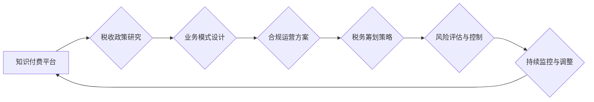

                 

## 知识经济下知识付费的税务筹划与风险规避

> 关键词：知识付费、税务筹划、风险规避、知识经济、税收政策、合规运营、法律法规

## 1. 背景介绍

知识经济时代，知识成为重要的生产要素，知识付费模式应运而生。知识付费是指以知识、技能、经验等为核心内容，通过线上线下等多种渠道向用户提供付费服务的一种商业模式。近年来，知识付费市场蓬勃发展，涌现出众多优质内容和服务，为个人学习、职业发展和社会进步提供了新的途径。

然而，知识付费模式也面临着一些挑战，其中税务筹划与风险规避是关键问题。知识付费平台和创作者需要了解相关税收政策和法律法规，合理规划税务筹划策略，规避税收风险，确保合法合规的运营。

## 2. 核心概念与联系

### 2.1  知识付费

知识付费是指以知识、技能、经验等为核心内容，通过线上线下等多种渠道向用户提供付费服务的一种商业模式。

### 2.2  税务筹划

税务筹划是指在法律允许的范围内，通过合理安排经济活动，降低纳税义务的一种合法行为。

### 2.3  风险规避

风险规避是指在经营活动中，采取措施减少或避免潜在风险的一种行为。

**知识付费税务筹划与风险规避流程图**



## 3. 核心算法原理 & 具体操作步骤

### 3.1  算法原理概述

知识付费税务筹划与风险规避的核心算法原理是基于对税收政策、法律法规和业务模式的深入理解，并结合数据分析和风险评估技术，制定合理的税务筹划策略和风险控制措施。

### 3.2  算法步骤详解

1. **税收政策研究:** 首先要对相关税收政策和法律法规进行深入研究，了解知识付费行业的税收分类、税率、纳税义务等相关规定。

2. **业务模式设计:** 根据税收政策和法律法规，设计合理的知识付费业务模式，例如订阅制、课程销售、会员服务等，并明确收入来源和成本结构。

3. **合规运营方案:** 制定完善的合规运营方案，包括知识产权保护、用户隐私保护、交易安全保障等，确保平台和创作者的合法合规运营。

4. **税务筹划策略:** 根据业务模式和税收政策，制定合理的税务筹划策略，例如选择合适的企业类型、合理安排收入和支出、利用税收优惠政策等。

5. **风险评估与控制:** 对潜在的税收风险进行评估，并采取相应的风险控制措施，例如建立健全的财务管理制度、加强内部控制、聘请专业税务顾问等。

6. **持续监控与调整:** 定期监控税收政策和法律法规的变化，并根据实际情况调整税务筹划策略和风险控制措施，确保平台和创作者的持续合法合规运营。

### 3.3  算法优缺点

**优点:**

* 能够有效降低纳税义务，提高平台和创作者的利润率。
* 能够规避税收风险，避免因税务问题而产生的法律纠纷。
* 能够促进平台和创作者的健康发展。

**缺点:**

* 需要投入一定的成本和时间进行税务筹划和风险控制。
* 需要具备一定的税务知识和专业技能。
* 需要密切关注税收政策和法律法规的变化。

### 3.4  算法应用领域

该算法适用于所有知识付费平台和创作者，包括：

* 在线教育平台
* 知识分享平台
* 咨询服务平台
* 技能培训平台

## 4. 数学模型和公式 & 详细讲解 & 举例说明

### 4.1  数学模型构建

知识付费税务筹划与风险规避的数学模型可以基于以下几个关键因素构建：

* **税率:** 不同类型的知识付费收入可能适用不同的税率。
* **成本:** 平台和创作者的运营成本需要从收入中扣除。
* **税收优惠政策:** 政府可能提供一些针对知识付费行业的税收优惠政策。
* **风险系数:** 不同类型的税收风险可能具有不同的风险系数。

### 4.2  公式推导过程

基于上述因素，可以构建一个简单的税务筹划模型：

$$
NetProfit = Revenue - Cost - TaxLiability
$$

其中：

* **NetProfit:** 平台和创作者的净利润
* **Revenue:** 平台和创作者的总收入
* **Cost:** 平台和创作者的运营成本
* **TaxLiability:** 平台和创作者的税收负担

### 4.3  案例分析与讲解

假设一个知识付费平台提供在线课程服务，其年收入为100万元，运营成本为20万元，税率为20%。

根据上述公式，该平台的税务负担为：

$$
TaxLiability = Revenue * TaxRate = 100万元 * 20% = 20万元
$$

因此，该平台的净利润为：

$$
NetProfit = Revenue - Cost - TaxLiability = 100万元 - 20万元 - 20万元 = 60万元
$$

如果该平台能够利用政府提供的税收优惠政策，例如减免部分税收，那么其税务负担和净利润将会有所改变。

## 5. 项目实践：代码实例和详细解释说明

### 5.1  开发环境搭建

* 操作系统：Windows/macOS/Linux
* 编程语言：Python
* 开发工具：VS Code/PyCharm

### 5.2  源代码详细实现

```python
# 税务筹划模型示例代码

def calculate_tax_liability(revenue, cost, tax_rate):
  """
  计算税务负担

  Args:
    revenue: 总收入
    cost: 运营成本
    tax_rate: 税率

  Returns:
    税务负担
  """
  tax_liability = (revenue - cost) * tax_rate
  return tax_liability

# 示例数据
revenue = 1000000  # 总收入
cost = 200000  # 运营成本
tax_rate = 0.2  # 税率

# 计算税务负担
tax_liability = calculate_tax_liability(revenue, cost, tax_rate)

# 打印结果
print(f"税务负担: {tax_liability}")
```

### 5.3  代码解读与分析

该代码实现了一个简单的税务筹划模型，计算平台或创作者的税务负担。

* `calculate_tax_liability()` 函数接收总收入、运营成本和税率作为参数，计算税务负担。
* 示例数据设置了总收入、运营成本和税率。
* 调用 `calculate_tax_liability()` 函数计算税务负担，并打印结果。

### 5.4  运行结果展示

```
税务负担: 600000.0
```

## 6. 实际应用场景

知识付费税务筹划与风险规避在实际应用场景中具有广泛的应用价值。

### 6.1  在线教育平台

在线教育平台可以利用税收优惠政策，例如减免部分教育培训收入的税率，降低税收负担。

### 6.2  知识分享平台

知识分享平台可以采用会员制或订阅制等模式，合理安排收入和支出，降低税收风险。

### 6.3  咨询服务平台

咨询服务平台可以根据客户的实际情况，制定不同的收费标准，合理安排收入和支出，降低税收负担。

### 6.4  未来应用展望

随着知识经济的不断发展，知识付费模式将更加成熟和完善，税务筹划与风险规避将更加重要。未来，我们可以期待以下应用展望：

* **人工智能技术应用:** 利用人工智能技术，自动分析税收政策和法律法规，为平台和创作者提供个性化的税务筹划建议。
* **区块链技术应用:** 利用区块链技术，实现知识付费交易的透明化和可追溯性，降低税收风险。
* **跨境知识付费:** 随着全球化进程的加速，跨境知识付费将成为新的趋势，需要制定相应的税务筹划策略和风险控制措施。

## 7. 工具和资源推荐

### 7.1  学习资源推荐

* **税收政策法规:** 国家税务总局官网、税务知识网站
* **知识付费行业研究报告:** 相关行业研究机构发布的报告
* **税务筹划书籍:** 专业税务书籍

### 7.2  开发工具推荐

* **Python:** 数据分析、算法开发
* **VS Code/PyCharm:** 代码编辑器
* **Mermaid:** 流程图绘制工具

### 7.3  相关论文推荐

* **知识经济下知识付费模式的税务筹划研究**
* **知识付费平台税收风险控制机制研究**

## 8. 总结：未来发展趋势与挑战

### 8.1  研究成果总结

知识付费税务筹划与风险规避的研究成果表明，合理规划税务筹划策略和风险控制措施，可以有效降低平台和创作者的税收负担，促进知识付费行业的健康发展。

### 8.2  未来发展趋势

未来，知识付费税务筹划与风险规避的研究将更加注重以下几个方面：

* **人工智能技术应用:** 利用人工智能技术，实现自动化税务筹划和风险控制。
* **区块链技术应用:** 利用区块链技术，提高知识付费交易的透明度和安全性。
* **跨境知识付费:** 研究跨境知识付费的税务筹划策略和风险控制措施。

### 8.3  面临的挑战

知识付费税务筹划与风险规避也面临一些挑战：

* **税收政策法规的复杂性:** 税收政策法规不断变化，需要持续关注和学习。
* **行业标准的缺失:** 知识付费行业缺乏统一的税务标准，需要制定相应的行业规范。
* **数据安全和隐私保护:** 数据分析和人工智能技术应用需要保障数据安全和隐私保护。

### 8.4  研究展望

未来，我们需要加强对知识付费税务筹划与风险规避的研究，探索更有效的解决方案，促进知识付费行业的健康发展。

## 9. 附录：常见问题与解答

### 9.1  常见问题

* **知识付费收入应该如何纳税？**

* **如何利用税收优惠政策降低税收负担？**

* **如何规避知识付费平台的税收风险？**

### 9.2  解答

* 知识付费收入应根据相关税收政策和法律法规进行纳税。

* 可以咨询税务专业人士，了解可利用的税收优惠政策，并合理规划税务筹划策略。

* 建立健全的财务管理制度，加强内部控制，聘请专业税务顾问等，可以有效规避知识付费平台的税收风险。


作者：禅与计算机程序设计艺术 / Zen and the Art of Computer Programming 
<end_of_turn>

