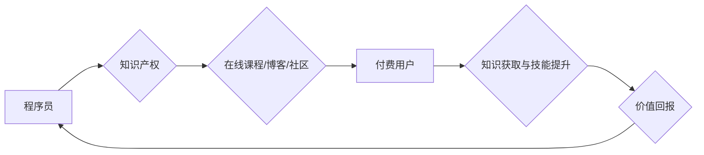

                 

## 程序员利用知识付费实现被动收入的秘诀

> 关键词：知识付费、程序员、被动收入、在线课程、技术博客、内容创作、社区运营、产品开发

## 1. 背景介绍

在当今数字时代，互联网为知识分享和传播提供了前所未有的平台。程序员，作为拥有专业技能和技术知识的群体，具备了独特的优势，可以利用知识付费模式实现被动收入。知识付费是指通过提供有价值的知识和技能，向付费用户收取费用，从而获得收益的商业模式。

对于程序员来说，知识付费可以帮助他们将自身积累的经验和技能转化为可持续的收入来源，实现财务自由。同时，知识付费也能够促进技术传播和人才培养，推动软件行业的发展。

## 2. 核心概念与联系

知识付费的核心概念是价值交换。程序员提供有价值的知识和技能，付费用户获得相应的学习和提升。

**知识付费模式的架构**



**知识付费模式的优势**

* **被动收入:** 一旦课程或内容发布，可以持续为程序员带来收入。
* **规模化效应:** 在线平台可以帮助程序员将知识传播给更广泛的受众。
* **知识积累:** 创作知识付费内容可以帮助程序员系统化和巩固自己的知识体系。
* **个人品牌建设:** 通过知识付费，程序员可以建立个人品牌，提升行业影响力。

## 3. 核心算法原理 & 具体操作步骤

### 3.1  算法原理概述

知识付费的成功关键在于提供有价值、实用、易懂的内容。程序员需要根据目标用户的需求和学习水平，设计合理的课程结构和教学内容。

**算法步骤详解**

1. **市场调研:** 了解目标用户的需求、痛点和学习习惯。
2. **内容规划:** 制定课程主题、内容框架和学习目标。
3. **内容创作:** 制作高质量的课程视频、文章、代码示例等学习资源。
4. **平台选择:** 选择合适的知识付费平台，例如 Udemy、Coursera、知识星球等。
5. **营销推广:** 利用社交媒体、技术社区等渠道推广课程。
6. **用户服务:** 提供及时有效的答疑服务，帮助用户解决学习问题。

### 3.2  算法优缺点

**优点:**

* **可持续性:** 一旦课程发布，可以持续为程序员带来收入。
* **规模化效应:** 在线平台可以帮助程序员将知识传播给更广泛的受众。

**缺点:**

* **前期投入:** 内容创作需要投入时间和精力。
* **竞争激烈:** 知识付费市场竞争激烈，需要不断更新内容和提升服务质量。

### 3.3  算法应用领域

* **编程语言学习:** 教授 Python、Java、C++ 等编程语言的知识。
* **软件开发技术:** 分享软件开发框架、设计模式、测试技术等方面的经验。
* **数据科学与机器学习:** 传授数据分析、机器学习算法等知识。
* **云计算与人工智能:** 讲解云计算平台、人工智能技术等相关内容。

## 4. 数学模型和公式 & 详细讲解 & 举例说明

知识付费的收益可以看作是一个函数，受课程价格、用户数量、转化率等因素影响。

**4.1  数学模型构建**

$$
收益 = 价格 * 用户数量 * 转化率
$$

其中：

* **价格:** 课程的售价。
* **用户数量:** 购买课程的用户数量。
* **转化率:** 访问课程页面并最终购买的用户比例。

**4.2  公式推导过程**

该公式的推导基于以下假设：

* 每个购买课程的用户都会支付课程的全部价格。
* 转化率是一个稳定的比例。

**4.3  案例分析与讲解**

假设一个程序员开发了一门 Python 编程课程，售价为 100 美元，预计用户数量为 1000 人，转化率为 10%。

根据公式，该课程的预期收益为：

$$
收益 = 100 美元 * 1000 人 * 0.1 = 1000 美元
$$

## 5. 项目实践：代码实例和详细解释说明

### 5.1  开发环境搭建

* **操作系统:** Windows、macOS 或 Linux
* **编程语言:** Python
* **开发工具:** VS Code、PyCharm 等

### 5.2  源代码详细实现

以下是一个简单的 Python 课程示例代码：

```python
def hello_world():
  print("Hello, world!")

hello_world()
```

### 5.3  代码解读与分析

这段代码定义了一个名为 `hello_world` 的函数，该函数打印 "Hello, world!" 到控制台。

### 5.4  运行结果展示

运行这段代码后，会在控制台中输出以下结果：

```
Hello, world!
```

## 6. 实际应用场景

程序员可以通过以下方式利用知识付费实现被动收入：

* **在线课程:** 制作编程语言、软件开发技术、数据科学等领域的在线课程。
* **技术博客:** 分享技术经验、代码示例、学习资源等内容，并通过广告、会员订阅等方式获得收益。
* **社区运营:** 建立技术社区，提供技术交流、学习支持等服务，并通过会员订阅、赞助等方式获得收益。
* **产品开发:** 开发技术工具、插件、软件等产品，并通过付费销售或订阅模式获得收益。

### 6.4  未来应用展望

随着人工智能、大数据等技术的快速发展，程序员的知识付费模式将更加多样化和智能化。未来，我们可以看到：

* **个性化学习:** 基于用户的学习习惯和需求，提供个性化的学习路径和内容。
* **沉浸式体验:** 利用虚拟现实、增强现实等技术，打造更加沉浸式的学习体验。
* **自动化运营:** 利用人工智能技术，自动生成学习内容、推荐学习资源、提供答疑服务等。

## 7. 工具和资源推荐

### 7.1  学习资源推荐

* **Coursera:** https://www.coursera.org/
* **Udemy:** https://www.udemy.com/
* **Udacity:** https://www.udacity.com/

### 7.2  开发工具推荐

* **VS Code:** https://code.visualstudio.com/
* **PyCharm:** https://www.jetbrains.com/pycharm/
* **Git:** https://git-scm.com/

### 7.3  相关论文推荐

* **The Economics of Online Education**
* **The Impact of Online Learning on Student Outcomes**

## 8. 总结：未来发展趋势与挑战

### 8.1  研究成果总结

知识付费模式为程序员提供了实现被动收入的有效途径，同时也推动了技术传播和人才培养。

### 8.2  未来发展趋势

未来，知识付费模式将更加智能化、个性化和沉浸式。

### 8.3  面临的挑战

知识付费市场竞争激烈，需要程序员不断提升内容质量和服务水平。

### 8.4  研究展望

未来研究可以关注知识付费模式的个性化推荐、沉浸式体验、自动化运营等方面。

## 9. 附录：常见问题与解答

**Q1: 如何确定课程价格？**

A1: 课程价格需要根据课程内容、目标用户、市场竞争等因素综合考虑。

**Q2: 如何推广我的课程？**

A2: 可以利用社交媒体、技术社区、博客等渠道推广课程。

**Q3: 如何提供优质的用户服务？**

A3: 及时回复用户提问，提供学习支持，收集用户反馈，不断改进课程内容和服务质量。


作者：禅与计算机程序设计艺术 / Zen and the Art of Computer Programming 
<end_of_turn>

