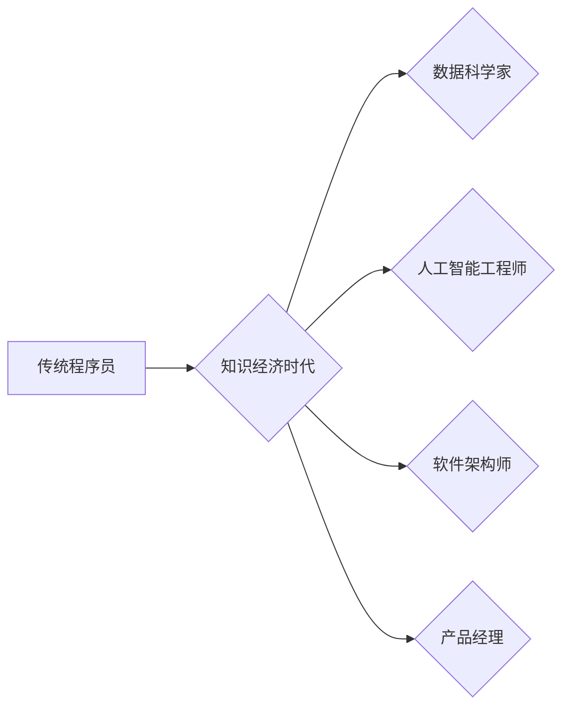

                 

## 程序员在知识经济时代的角色升级

> 关键词：知识经济、程序员、角色升级、人工智能、数据科学、软件架构、敏捷开发、持续学习

### 1. 背景介绍

知识经济时代，信息化成为社会发展的主导力量，数据成为新的生产要素。在这个背景下，程序员作为构建数字世界的关键力量，面临着前所未有的机遇和挑战。传统的编程思维和技能体系正在被重新定义，程序员的角色也随之发生着深刻的转变。

#### 1.1  知识经济的兴起

知识经济时代，知识、技术和创新成为经济增长的主要驱动力。信息技术的发展加速了知识的传播和应用，使得知识成为比资本和土地更重要的生产要素。

#### 1.2  程序员的角色演变

随着互联网、移动互联网、大数据、人工智能等技术的快速发展，程序员的角色从单纯的代码编写者，逐渐演变为：

* **数据科学家:**  能够从海量数据中挖掘价值，并利用数据驱动决策。
* **人工智能工程师:**  能够设计、开发和部署人工智能模型，解决复杂问题。
* **软件架构师:**  能够设计和构建复杂软件系统，确保系统的稳定性和可扩展性。
* **产品经理:**  能够理解用户需求，并将其转化为产品功能，推动产品创新。

### 2. 核心概念与联系

程序员在知识经济时代的角色升级，本质上是**从代码编写者向知识创造者和价值创造者**的转变。

**Mermaid 流程图:**



#### 2.1  知识经济的核心要素

* **知识:**  包括理论知识、实践经验、技能和创造力等。
* **信息:**  指经过加工和处理后的知识，能够被人们理解和利用。
* **技术:**  指利用知识和信息解决问题和创造价值的手段。
* **创新:**  指创造新的知识、信息、技术和产品的过程。

#### 2.2  程序员的角色升级与知识经济的关系

程序员在知识经济时代的角色升级，是知识经济发展趋势的必然结果。

* **数据驱动:**  数据成为新的生产要素，程序员需要具备数据分析和挖掘的能力。
* **人工智能时代:**  人工智能技术的发展，需要程序员具备人工智能算法和模型开发的能力。
* **软件定义一切:**  软件正在渗透到各个领域，程序员需要具备软件架构设计和开发的能力。
* **用户体验至上:**  用户体验成为核心竞争力，程序员需要具备产品经理的思维和能力。

### 3. 核心算法原理 & 具体操作步骤

#### 3.1  算法原理概述

**机器学习算法**是人工智能领域的核心算法之一，它能够通过学习数据，自动发现模式和规律，并进行预测或分类。

#### 3.2  算法步骤详解

1. **数据收集和预处理:**  收集相关数据，并进行清洗、转换和特征工程等预处理操作。
2. **模型选择:**  根据具体任务选择合适的机器学习算法，例如线性回归、逻辑回归、决策树、支持向量机等。
3. **模型训练:**  利用训练数据训练模型，调整模型参数，使模型能够准确地预测或分类。
4. **模型评估:**  利用测试数据评估模型的性能，例如准确率、召回率、F1-score等。
5. **模型部署:**  将训练好的模型部署到实际应用场景中，用于预测或分类新的数据。

#### 3.3  算法优缺点

**优点:**

* 自动学习，无需人工编程。
* 能够处理复杂数据，发现隐藏模式。
* 性能不断提升，应用范围不断扩大。

**缺点:**

* 需要大量数据进行训练。
* 模型解释性较差，难以理解模型决策过程。
* 容易受到数据噪声和偏差的影响。

#### 3.4  算法应用领域

机器学习算法广泛应用于各个领域，例如：

* **图像识别:**  识别物体、人脸、场景等。
* **自然语言处理:**  文本分类、情感分析、机器翻译等。
* **推荐系统:**  根据用户喜好推荐商品、内容等。
* **金融风险控制:**  预测信用风险、欺诈行为等。

### 4. 数学模型和公式 & 详细讲解 & 举例说明

#### 4.1  数学模型构建

机器学习算法通常基于数学模型进行构建，例如线性回归模型：

$$
y = w_0 + w_1x_1 + w_2x_2 + ... + w_nx_n + \epsilon
$$

其中：

* $y$ 是预测值。
* $w_0, w_1, w_2, ..., w_n$ 是模型参数。
* $x_1, x_2, ..., x_n$ 是输入特征。
* $\epsilon$ 是误差项。

#### 4.2  公式推导过程

模型参数的学习过程通常使用**梯度下降算法**，通过不断调整参数，使模型预测值与真实值之间的误差最小化。

梯度下降算法的核心思想是：沿着梯度的负方向更新参数，从而逐渐逼近最小值。

#### 4.3  案例分析与讲解

例如，使用线性回归模型预测房价，输入特征包括房屋面积、房间数量、地理位置等。通过训练数据，模型会学习到每个特征对房价的影响程度，并最终得到一个预测房价的公式。

### 5. 项目实践：代码实例和详细解释说明

#### 5.1  开发环境搭建

使用Python语言和机器学习库Scikit-learn进行项目实践。

#### 5.2  源代码详细实现

```python
from sklearn.linear_model import LinearRegression
from sklearn.model_selection import train_test_split
from sklearn.metrics import mean_squared_error

# 加载数据
data = ...

# 将数据分为训练集和测试集
X_train, X_test, y_train, y_test = train_test_split(data.drop('price', axis=1), data['price'], test_size=0.2)

# 创建线性回归模型
model = LinearRegression()

# 训练模型
model.fit(X_train, y_train)

# 预测测试集数据
y_pred = model.predict(X_test)

# 计算模型性能
mse = mean_squared_error(y_test, y_pred)
print(f'Mean Squared Error: {mse}')
```

#### 5.3  代码解读与分析

* 使用`train_test_split`函数将数据分为训练集和测试集，用于模型训练和评估。
* 使用`LinearRegression`类创建线性回归模型。
* 使用`fit`方法训练模型，将训练数据输入模型，学习模型参数。
* 使用`predict`方法预测测试集数据，得到模型预测结果。
* 使用`mean_squared_error`函数计算模型性能，评估模型预测的准确性。

#### 5.4  运行结果展示

运行代码后，会输出模型的平均平方误差（MSE）值，用于评估模型的预测精度。

### 6. 实际应用场景

#### 6.1  金融领域

* **信用风险评估:**  利用机器学习算法分析客户的财务数据，预测客户是否会违约。
* **欺诈检测:**  识别异常交易行为，防止金融欺诈。
* **投资决策:**  分析市场数据，预测股票价格走势，辅助投资决策。

#### 6.2  医疗领域

* **疾病诊断:**  根据患者的症状和检查结果，预测患者患有哪种疾病。
* **药物研发:**  加速药物研发过程，发现新的药物靶点。
* **个性化医疗:**  根据患者的基因信息和生活习惯，提供个性化的医疗方案。

#### 6.3  电商领域

* **商品推荐:**  根据用户的购买历史和浏览记录，推荐用户可能感兴趣的商品。
* **价格预测:**  预测商品价格走势，帮助商家制定定价策略。
* **客户服务:**  利用聊天机器人技术，提供智能客户服务。

#### 6.4  未来应用展望

随着人工智能技术的不断发展，程序员在知识经济时代的角色将更加重要，并将应用于更多领域，例如：

* **自动驾驶:**  开发自动驾驶汽车的算法和系统。
* **机器人技术:**  设计和开发智能机器人，用于工业生产、服务业等领域。
* **虚拟现实和增强现实:**  开发虚拟现实和增强现实应用，创造沉浸式体验。

### 7. 工具和资源推荐

#### 7.1  学习资源推荐

* **在线课程:**  Coursera、edX、Udacity等平台提供丰富的机器学习和人工智能课程。
* **书籍:**  《Python机器学习》、《深度学习》等书籍是学习机器学习和人工智能的经典教材。
* **开源项目:**  TensorFlow、PyTorch等开源项目提供了丰富的机器学习工具和资源。

#### 7.2  开发工具推荐

* **Python:**  Python语言是机器学习和人工智能开发的常用语言。
* **Scikit-learn:**  Scikit-learn是Python机器学习库，提供各种机器学习算法和工具。
* **TensorFlow:**  TensorFlow是Google开发的开源机器学习框架，支持深度学习。
* **PyTorch:**  PyTorch是Facebook开发的开源机器学习框架，以其灵活性和易用性而闻名。

#### 7.3  相关论文推荐

* **《ImageNet Classification with Deep Convolutional Neural Networks》:**  AlexNet论文，标志着深度学习的兴起。
* **《Attention Is All You Need》:**  Transformer论文，提出了一种新的序列建模方法，在自然语言处理领域取得了突破性进展。
* **《Generative Adversarial Networks》:**  GAN论文，提出了一种生成对抗网络的框架，用于生成逼真的图像和文本。

### 8. 总结：未来发展趋势与挑战

#### 8.1  研究成果总结

程序员在知识经济时代的角色升级，是人工智能、大数据等技术的驱动下，对传统编程思维和技能体系的深刻变革。程序员需要具备数据分析、机器学习、软件架构等方面的能力，才能在知识经济时代保持竞争力。

#### 8.2  未来发展趋势

* **人工智能技术将更加成熟:**  人工智能算法将更加智能化、自动化，应用场景将更加广泛。
* **数据规模将继续增长:**  数据将成为更加重要的生产要素，程序员需要具备处理海量数据的能力。
* **软件开发模式将更加敏捷:**  程序员需要具备快速迭代、持续交付的能力。

#### 8.3  面临的挑战

* **技术更新迭代速度快:**  程序员需要不断学习新的技术和知识，才能跟上时代步伐。
* **人才短缺:**  人工智能和数据科学领域的人才需求量大，供不应求。
* **伦理和安全问题:**  人工智能技术的应用引发了伦理和安全问题，需要程序员关注和解决。

#### 8.4  研究展望

未来，程序员的角色将更加多元化、复杂化，需要具备更强的跨学科能力和创新能力。

### 9. 附录：常见问题与解答

#### 9.1  如何学习机器学习和人工智能？

* 参加在线课程，例如Coursera、edX、Udacity等平台的课程。
* 阅读相关书籍，例如《Python机器学习》、《深度学习》等。
* 参与开源项目，例如TensorFlow、PyTorch等。

#### 9.2  哪些编程语言适合学习机器学习和人工智能？

* Python是机器学习和人工智能开发的常用语言，拥有丰富的库和工具。
* R语言也用于统计分析和机器学习。
* Java和C++等语言也可以用于开发一些大型机器学习系统。

#### 9.3  如何应对技术更新迭代速度快？

* 保持学习的热情，不断学习新的技术和知识。
* 关注行业趋势，了解最新的技术发展动态。
* 参与技术社区，与其他程序员交流学习。


作者：禅与计算机程序设计艺术 / Zen and the Art of Computer Programming 
<end_of_turn>

