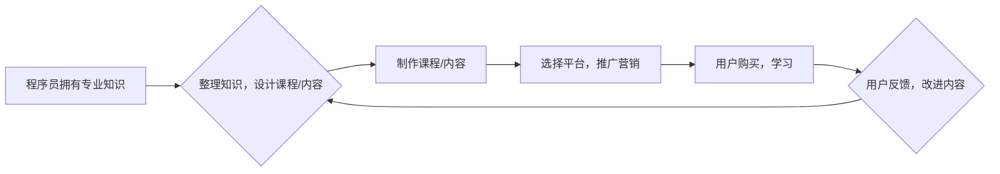

                 

## 程序员如何利用知识付费获得被动收入

> 关键词：知识付费、程序员、被动收入、在线课程、技术博客、电子书、开源项目、社区建设

## 1. 背景介绍

在当今数字时代，程序员的需求量持续增长，技术技能也日益重要。然而，传统的编程工作模式往往以项目为单位，收入波动较大，缺乏稳定性。知识付费模式的兴起为程序员提供了新的收入来源，并能帮助他们将专业知识转化为持续的被动收入。

知识付费是指通过提供有价值的知识和技能，向用户收取费用的一种商业模式。对于程序员来说，知识付费可以涵盖以下几个方面：

* **在线课程:**  录制和销售编程语言、框架、工具、算法等方面的课程。
* **技术博客:**  撰写高质量的技术文章，并通过广告、会员订阅等方式获得收入。
* **电子书:**  编写编程指南、技术书籍，并在电子书平台销售。
* **开源项目:**  开发高质量的开源项目，并通过赞助、捐赠等方式获得收入。
* **社区建设:**  建立技术社区，提供学习、交流、协作的平台，并通过会员订阅、赞助等方式获得收入。

## 2. 核心概念与联系

知识付费的核心在于提供价值，并建立信任关系。程序员需要将自己的专业知识和经验转化为易于理解、易于学习的内容，并通过多种渠道推广和销售。

以下是一个简单的知识付费流程图：



## 3. 核心算法原理 & 具体操作步骤

知识付费的成功离不开有效的运营策略和技术手段。以下是一些核心算法原理和具体操作步骤：

### 3.1  算法原理概述

* **内容推荐算法:**  根据用户的学习历史、兴趣偏好等信息，推荐相关的课程或内容。
* **用户画像算法:**  分析用户的学习行为、反馈信息等数据，构建用户画像，以便更好地理解用户的需求。
* **营销推广算法:**  利用数据分析和机器学习，优化广告投放、内容推广等策略，提高用户转化率。

### 3.2  算法步骤详解

* **数据采集:**  收集用户学习行为、反馈信息、平台数据等。
* **数据清洗:**  处理数据中的缺失值、异常值等问题。
* **特征提取:**  从原始数据中提取有价值的特征，例如用户年龄、性别、学习时间、学习进度等。
* **模型训练:**  利用机器学习算法，训练推荐、画像、营销等模型。
* **模型评估:**  评估模型的性能，并进行调整优化。

### 3.3  算法优缺点

* **优点:**  能够精准推荐内容，提高用户学习效率，并优化营销推广效果。
* **缺点:**  需要大量的训练数据，模型训练成本较高，且存在算法偏差和数据安全问题。

### 3.4  算法应用领域

* **在线教育平台:**  推荐课程、个性化学习路径、用户画像分析等。
* **技术博客:**  内容推荐、用户分层、广告投放等。
* **电子书平台:**  书籍推荐、用户阅读习惯分析等。

## 4. 数学模型和公式 & 详细讲解 & 举例说明

知识付费的运营策略可以借助数学模型和公式进行分析和优化。例如，用户价值模型可以用来评估用户的潜在价值，并制定相应的营销策略。

### 4.1  数学模型构建

用户价值模型可以表示为以下公式：

$$
UV = \alpha \cdot L + \beta \cdot E + \gamma \cdot R
$$

其中：

* UV: 用户价值
* L: 学习时长
* E: 参与度 (例如评论、点赞、分享等)
* R: 购买行为 (例如购买课程、订阅会员等)
* α, β, γ:  权重系数，根据实际情况进行调整

### 4.2  公式推导过程

该公式的推导过程基于以下假设：

* 用户学习时长越长，价值越高。
* 用户参与度越高，价值越高。
* 用户购买行为越多，价值越高。

权重系数 α, β, γ 的确定可以通过数据分析和实验验证。

### 4.3  案例分析与讲解

假设一个在线课程平台，通过数据分析发现：

* 学习时长与用户价值呈正相关，α = 0.6
* 参与度与用户价值呈正相关，β = 0.3
* 购买行为与用户价值呈正相关，γ = 0.1

那么，对于一个学习时长为 10 小时的用户，参与度为 5 次，购买了 1 个课程的用户，其用户价值可以计算为：

$$
UV = 0.6 \cdot 10 + 0.3 \cdot 5 + 0.1 \cdot 1 = 6 + 1.5 + 0.1 = 7.6
$$

## 5. 项目实践：代码实例和详细解释说明

以下是一个简单的 Python 代码实例，用于计算用户价值：

```python
def calculate_user_value(learning_time, engagement, purchase):
  """
  计算用户价值

  Args:
    learning_time: 学习时长
    engagement: 参与度
    purchase: 购买行为

  Returns:
    用户价值
  """
  alpha = 0.6
  beta = 0.3
  gamma = 0.1
  uv = alpha * learning_time + beta * engagement + gamma * purchase
  return uv

# 示例数据
learning_time = 10
engagement = 5
purchase = 1

# 计算用户价值
user_value = calculate_user_value(learning_time, engagement, purchase)

# 打印结果
print(f"用户价值: {user_value}")
```

### 5.1  开发环境搭建

该代码示例可以使用任何 Python 环境运行，例如 Jupyter Notebook、VS Code 等。

### 5.2  源代码详细实现

代码示例中定义了一个函数 `calculate_user_value`，用于计算用户价值。该函数接受三个参数：学习时长、参与度和购买行为。

### 5.3  代码解读与分析

代码中使用权重系数 α, β, γ 来调整不同因素的影响力。

### 5.4  运行结果展示

运行该代码示例，输出结果为：

```
用户价值: 7.6
```

## 6. 实际应用场景

知识付费模式在程序员领域有着广泛的应用场景：

* **在线编程课程平台:**  例如 Udemy、Coursera、Codecademy 等平台，提供各种编程语言、框架、工具等方面的课程。
* **技术博客和网站:**  例如 Medium、Hacker News、Stack Overflow 等平台，程序员可以通过撰写高质量的技术文章，并通过广告、会员订阅等方式获得收入。
* **开源项目赞助:**  程序员可以开发高质量的开源项目，并通过赞助、捐赠等方式获得收入。
* **技术社区建设:**  程序员可以建立技术社区，提供学习、交流、协作的平台，并通过会员订阅、赞助等方式获得收入。

### 6.4  未来应用展望

随着人工智能、大数据等技术的不断发展，知识付费模式将更加智能化、个性化。未来，程序员可以利用这些技术，打造更加精准、高效的知识付费平台，并获得更大的被动收入。

## 7. 工具和资源推荐

### 7.1  学习资源推荐

* **在线课程平台:** Udemy、Coursera、Codecademy、Udacity 等
* **技术博客和网站:** Medium、Hacker News、Stack Overflow、GitHub 等
* **书籍:** 《代码的艺术》、《设计模式》、《算法导论》等

### 7.2  开发工具推荐

* **Python:**  用于数据分析、机器学习等
* **Node.js:**  用于构建 Web 应用
* **React:**  用于构建用户界面
* **MongoDB:**  用于存储数据

### 7.3  相关论文推荐

* **Recommender Systems Handbook**
* **The Elements of Statistical Learning**
* **Deep Learning**

## 8. 总结：未来发展趋势与挑战

知识付费模式为程序员提供了新的收入来源，并推动了技术知识的传播和共享。未来，知识付费模式将更加智能化、个性化，并与人工智能、大数据等技术深度融合。

### 8.1  研究成果总结

* 知识付费模式能够有效地将程序员的专业知识转化为被动收入。
* 算法模型和数据分析技术可以帮助优化知识付费平台的运营策略。
* 知识付费模式促进了技术知识的传播和共享。

### 8.2  未来发展趋势

* **个性化学习:**  根据用户的学习习惯和需求，提供个性化的学习路径和内容。
* **人工智能驱动:**  利用人工智能技术，自动生成学习内容、推荐课程、评估用户学习效果等。
* **沉浸式体验:**  利用虚拟现实、增强现实等技术，打造更加沉浸式的学习体验。

### 8.3  面临的挑战

* **内容质量:**  保证知识付费内容的质量和原创性。
* **用户信任:**  建立用户对知识付费平台的信任关系。
* **数据安全:**  保护用户数据安全和隐私。

### 8.4  研究展望

* 研究更有效的知识付费模式和运营策略。
* 开发更智能、更个性化的知识付费平台。
* 探索知识付费与其他技术融合的应用场景。

## 9. 附录：常见问题与解答

* **如何选择合适的知识付费平台？**

  需要考虑平台的受众群体、课程质量、收费标准、运营模式等因素。

* **如何制作高质量的知识付费内容？**

  需要深入了解目标用户的需求，并以清晰、易懂的方式呈现知识。

* **如何推广和销售知识付费内容？**

  可以通过社交媒体、博客、邮件营销等方式进行推广。

* **如何维护用户关系？**

  需要及时回复用户咨询，并根据用户反馈不断改进内容。


作者：禅与计算机程序设计艺术 / Zen and the Art of Computer Programming 
<end_of_turn>

