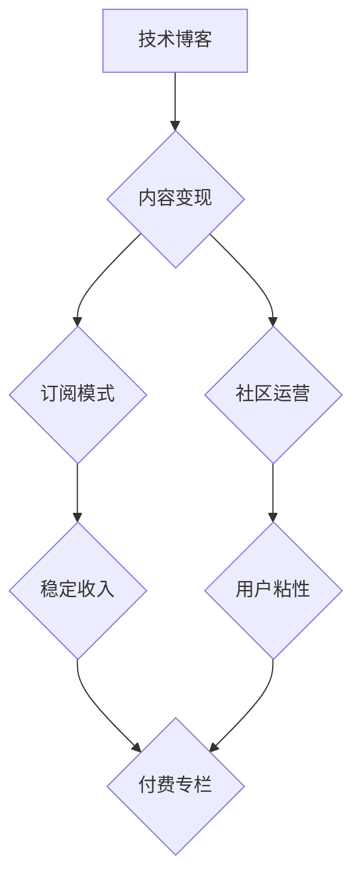

                 

## 程序员如何将技术博客转化为付费专栏

> 关键词：技术博客、付费专栏、内容变现、社区运营、订阅模式、知识付费、技术写作、程序员

## 1. 背景介绍

在当今互联网时代，技术博客已成为程序员展示技术能力、分享经验、建立个人品牌的重要平台。然而，单纯依靠广告收入或赞助难以实现可持续发展。越来越多的程序员开始探索将技术博客转化为付费专栏，通过提供更深入、更有价值的内容，获取稳定的收入来源。

付费专栏模式，本质上是一种知识付费模式，程序员通过提供独家技术文章、视频教程、在线课程等付费内容，吸引付费用户订阅，从而实现内容变现。

## 2. 核心概念与联系

### 2.1 技术博客与付费专栏

技术博客通常是免费开放的，内容涵盖技术领域广泛，形式多样，主要依靠广告收入或赞助来维持运营。付费专栏则是一种订阅制模式，用户需要付费才能访问专栏内容，内容通常更深入、更有价值，例如：

* **独家技术文章：** 深入探讨特定技术领域，提供原创研究成果、实践经验分享等。
* **视频教程：** 以视频形式讲解技术知识，更直观易懂。
* **在线课程：** 提供系统化的技术培训课程，涵盖多个模块，并提供答疑服务。
* **社区交流：** 为付费用户提供专属社区，方便交流学习，解答技术问题。

### 2.2 订阅模式与社区运营

付费专栏的成功运营离不开订阅模式和社区运营。订阅模式可以保证稳定的收入来源，而社区运营则可以增强用户粘性，形成良好的用户生态。

**Mermaid 流程图：**



## 3. 核心算法原理 & 具体操作步骤

### 3.1 算法原理概述

将技术博客转化为付费专栏，本质上是一个内容运营和用户管理的算法。

* **内容运营算法：** 

    * **内容定位：** 确定目标用户群体，分析他们的需求，提供符合他们兴趣和需求的技术内容。
    * **内容生产：** 创作高质量、原创的技术文章、视频教程、在线课程等内容。
    * **内容推广：** 利用社交媒体、技术论坛等平台推广付费专栏内容，吸引潜在用户。

* **用户管理算法：**

    * **用户画像：** 分析用户行为数据，构建用户画像，了解用户的兴趣爱好、阅读习惯等。
    * **个性化推荐：** 根据用户画像，推荐符合用户兴趣的内容，提高用户粘性。
    * **社区互动：** 建立付费用户专属社区，鼓励用户交流互动，增强用户归属感。

### 3.2 算法步骤详解

1. **市场调研：** 分析目标用户群体，了解他们的技术需求和付费意愿。
2. **内容规划：** 制定内容生产计划，确定内容主题、形式、频率等。
3. **内容创作：** 创作高质量、原创的技术内容，并进行排版、编辑、校对等工作。
4. **平台搭建：** 选择合适的付费专栏平台，搭建网站或应用，并进行用户注册、支付等功能开发。
5. **内容推广：** 利用社交媒体、技术论坛等平台推广付费专栏内容，吸引潜在用户。
6. **用户运营：** 分析用户行为数据，构建用户画像，进行个性化推荐，并积极参与社区互动。
7. **数据分析：** 定期分析付费专栏数据，例如用户增长、付费转化率、内容阅读量等，并根据数据调整运营策略。

### 3.3 算法优缺点

**优点：**

* **可持续收入：** 订阅模式可以保证稳定的收入来源。
* **用户粘性：** 社区运营可以增强用户粘性，形成良好的用户生态。
* **品牌价值：** 付费专栏可以提升个人品牌价值，吸引更多合作机会。

**缺点：**

* **内容运营成本：** 需要投入大量时间和精力进行内容创作和运营。
* **用户获取成本：** 需要花费时间和资源进行用户推广和引流。
* **竞争压力：** 技术领域付费专栏市场竞争激烈，需要不断提升内容质量和用户体验。

### 3.4 算法应用领域

* **技术培训：** 提供专业的技术培训课程，帮助用户提升技术技能。
* **技术咨询：** 为用户提供技术咨询服务，解决技术难题。
* **技术研究：** 分享技术研究成果，促进技术进步。
* **技术社区：** 建立技术社区，方便用户交流学习，分享经验。

## 4. 数学模型和公式 & 详细讲解 & 举例说明

### 4.1 数学模型构建

付费专栏的成功运营可以看作是一个用户增长和收入模型。

* **用户增长模型：** 可以使用指数增长模型来描述用户增长趋势，例如：

$$
U(t) = U_0 * e^{rt}
$$

其中：

* $U(t)$：t时刻的用户数量
* $U_0$：初始用户数量
* $r$：用户增长率
* $t$：时间

* **收入模型：** 可以使用线性回归模型来预测收入，例如：

$$
R = a * U + b
$$

其中：

* $R$：收入
* $U$：用户数量
* $a$：用户价值
* $b$：固定成本

### 4.2 公式推导过程

* **用户增长率推导：**

用户增长率可以根据用户注册、付费转化率等数据进行计算。例如，如果用户注册率为10%，付费转化率为5%，则用户增长率可以近似为：

$$
r = 0.1 * 0.05 = 0.005
$$

* **用户价值推导：**

用户价值可以根据用户的平均付费金额、使用时长等数据进行计算。例如，如果用户的平均付费金额为100元，使用时长为3个月，则用户价值可以近似为：

$$
a = 100 / 3 = 33.33
$$

### 4.3 案例分析与讲解

假设一个技术博客拥有1000个用户，用户增长率为0.005，用户价值为33.33元，固定成本为1000元。

根据以上数据，我们可以使用公式计算出该博客的收入：

$$
R = 33.33 * 1000 + 1000 = 34333元
$$

## 5. 项目实践：代码实例和详细解释说明

### 5.1 开发环境搭建

* **操作系统：** Linux/macOS/Windows
* **编程语言：** Python/JavaScript
* **框架：** Django/Flask/Node.js/React
* **数据库：** MySQL/PostgreSQL/MongoDB

### 5.2 源代码详细实现

以下是一个简单的Python代码示例，用于实现付费专栏的订阅功能：

```python
class User:
    def __init__(self, username, password):
        self.username = username
        self.password = password
        self.is_subscribed = False

    def subscribe(self):
        self.is_subscribed = True
        print(f"{self.username} 已订阅付费专栏")

    def unsubscribe(self):
        self.is_subscribed = False
        print(f"{self.username} 已取消订阅付费专栏")

user = User("john", "password123")
user.subscribe()
user.unsubscribe()
```

### 5.3 代码解读与分析

* **User类：** 定义了用户对象，包含用户名、密码、订阅状态等属性。
* **subscribe()方法：** 设置用户订阅状态为True，并打印订阅成功信息。
* **unsubscribe()方法：** 设置用户订阅状态为False，并打印取消订阅信息。

### 5.4 运行结果展示

运行以上代码，将输出以下信息：

```
john 已订阅付费专栏
john 已取消订阅付费专栏
```

## 6. 实际应用场景

付费专栏可以应用于各种技术领域，例如：

* **软件开发：** 提供编程语言、框架、工具等方面的技术培训和咨询服务。
* **数据科学：** 分享机器学习、深度学习、数据分析等方面的知识和经验。
* **云计算：** 提供云平台、容器、微服务等方面的技术培训和咨询服务。
* **网络安全：** 分享网络安全知识、漏洞分析、安全测试等方面的技术内容。

### 6.4 未来应用展望

随着技术发展和用户需求的变化，付费专栏将呈现以下发展趋势：

* **内容形式多样化：** 除了文字和视频，将会有更多形式的付费内容，例如音频、直播、互动游戏等。
* **个性化定制化：** 根据用户的兴趣爱好和学习进度，提供个性化的学习路径和内容推荐。
* **社区互动增强：** 建立更完善的社区功能，方便用户交流学习，分享经验。
* **跨平台融合：** 付费专栏将与其他平台，例如社交媒体、电商平台等进行融合，提供更丰富的服务。

## 7. 工具和资源推荐

### 7.1 学习资源推荐

* **书籍：** 《程序员的自我修养》、《代码的艺术》、《设计模式》
* **在线课程：** Coursera、edX、Udemy
* **技术博客：** Hacker News、Medium、Stack Overflow

### 7.2 开发工具推荐

* **内容管理系统：** WordPress、Ghost、Drupal
* **支付平台：** Stripe、PayPal、Alipay
* **社区平台：** Discourse、Slack、Discord

### 7.3 相关论文推荐

* **知识付费模式研究：** 《知识付费模式的现状与发展趋势》
* **社区运营研究：** 《社区运营的理论与实践》
* **用户增长模型研究：** 《用户增长模型的构建与应用》

## 8. 总结：未来发展趋势与挑战

### 8.1 研究成果总结

将技术博客转化为付费专栏，需要结合内容运营、用户管理、技术开发等多方面因素，通过构建合理的数学模型和算法，实现可持续发展。

### 8.2 未来发展趋势

付费专栏将朝着内容形式多样化、个性化定制化、社区互动增强、跨平台融合等方向发展。

### 8.3 面临的挑战

* **内容竞争激烈：** 需要不断提升内容质量和用户体验，才能在竞争中脱颖而出。
* **用户获取成本高：** 需要投入时间和资源进行用户推广和引流。
* **技术发展快速：** 需要不断学习新技术，更新平台和内容。

### 8.4 研究展望

未来研究方向包括：

* **更精准的用户画像和个性化推荐算法。**
* **更完善的社区运营模式和互动机制。**
* **更智能化的内容创作和运营工具。**


## 9. 附录：常见问题与解答

**Q1：如何确定付费专栏的主题？**

**A1：** 需要根据自身技术优势、市场需求和用户兴趣进行分析，选择一个有竞争力的主题。

**Q2：如何吸引用户订阅付费专栏？**

**A2：** 可以通过以下方式吸引用户订阅：

* 提供高质量、原创的技术内容。
* 利用社交媒体、技术论坛等平台进行推广。
* 建立付费用户专属社区，提供更优质的服务。

**Q3：如何保证付费专栏的持续运营？**

**A3：** 需要不断提升内容质量和用户体验，并积极探索新的盈利模式。


作者：禅与计算机程序设计艺术 / Zen and the Art of Computer Programming 
<end_of_turn>

