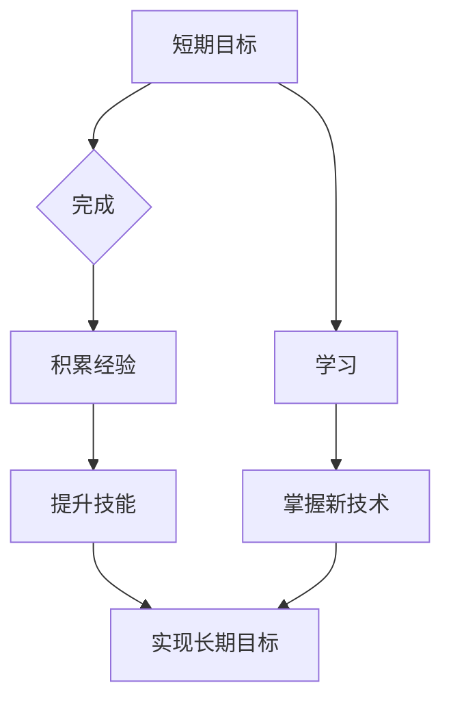

                 

## 程序员如何平衡短期与长期目标

> 关键词：程序员、短期目标、长期目标、职业发展、时间管理、学习成长、技术栈、工作与生活平衡

## 1. 背景介绍

在当今瞬息万变的科技领域，程序员面临着前所未有的机遇和挑战。技术日新月异，新兴技术层出不穷，程序员需要不断学习和提升自身技能，才能保持竞争力。然而，在追求技术精进的同时，程序员也需要平衡自身的短期目标和长期目标，才能实现职业生涯的持续发展和个人价值的实现。

短期目标通常是指在短期内可以实现的具体目标，例如完成某个项目、学习一项新技术、提升某个技能等。长期目标则是指在较长一段时间内想要达成的宏伟目标，例如成为某个领域的专家、创业创办公司、获得某个职位等。

对于程序员来说，短期目标和长期目标之间存在着密切的联系。短期目标的完成可以为长期目标的实现提供基础和积累，而长期目标的设定则可以为短期目标的制定提供方向和指引。

## 2. 核心概念与联系

### 2.1 短期目标与长期目标的定义

* **短期目标:**  通常在 1-6 个月内可以实现的目标，例如完成一个小的项目、学习一个新的编程语言的基础知识、提升某个技能的熟练度等。
* **长期目标:** 通常在 1-5 年甚至更长时间内可以实现的目标，例如成为某个领域的专家、创业创办公司、获得某个高级职位等。

### 2.2  短期目标与长期目标之间的关系

短期目标和长期目标之间存在着相互促进、相互依存的关系。

* **短期目标为长期目标提供基础:** 完成一个个短期目标，可以积累经验、提升技能，为实现长期目标打下坚实的基础。
* **长期目标指引短期目标:**  明确的长期目标可以为短期目标的制定提供方向和指引，帮助程序员更加专注和高效地完成任务。

### 2.3  平衡短期与长期目标的必要性

* **避免过度沉迷于短期目标:** 过度追求短期目标，可能会导致程序员忽略长期发展，缺乏持续的学习和进步。
* **避免长期目标过于遥远:**  长期目标过于遥远，可能会导致程序员缺乏动力和方向，难以坚持下去。

**Mermaid 流程图**



## 3. 核心算法原理 & 具体操作步骤

### 3.1  算法原理概述

平衡短期与长期目标的核心算法可以理解为一个动态规划的过程，需要不断地评估和调整短期目标，以确保它们能够有效地服务于长期目标。

### 3.2  算法步骤详解

1. **设定长期目标:**  明确自己的职业发展方向和个人价值追求，设定一个清晰、具体的长期目标。
2. **分解长期目标:** 将长期目标分解成多个可实现的短期目标，每个短期目标都应该与长期目标密切相关。
3. **制定计划:**  为每个短期目标制定详细的计划，包括时间安排、资源分配、任务分解等。
4. **执行计划:**  按照计划执行任务，并定期评估进展情况。
5. **调整计划:**  根据实际情况和反馈，及时调整短期目标和计划，确保它们仍然能够有效地服务于长期目标。

### 3.3  算法优缺点

* **优点:**  动态规划的算法能够有效地平衡短期与长期目标，并根据实际情况进行调整，提高目标实现的效率。
* **缺点:**  需要程序员具备一定的规划能力和执行力，才能有效地运用这个算法。

### 3.4  算法应用领域

这个算法可以应用于程序员的职业发展规划、学习计划制定、项目管理等各个方面。

## 4. 数学模型和公式 & 详细讲解 & 举例说明

### 4.1  数学模型构建

我们可以用一个简单的数学模型来表示短期目标和长期目标之间的关系：

$$
L = \sum_{i=1}^{n} w_i * S_i
$$

其中：

* $L$ 代表长期目标的实现程度
* $S_i$ 代表第 $i$ 个短期目标的实现程度
* $w_i$ 代表第 $i$ 个短期目标对长期目标的贡献度

### 4.2  公式推导过程

这个公式的推导过程基于以下假设：

* 长期目标可以由多个短期目标共同实现
* 每个短期目标对长期目标的贡献度不同

根据这些假设，我们可以得出上述公式。

### 4.3  案例分析与讲解

假设一个程序员的长期目标是成为一名优秀的机器学习工程师。

* $S_1$：学习 Python 编程语言，$w_1 = 0.3$
* $S_2$：学习机器学习基础知识，$w_2 = 0.5$
* $S_3$：完成一个机器学习项目，$w_3 = 0.2$

如果程序员完成了以上三个短期目标，并且每个短期目标的实现程度都达到 1，那么根据公式，其长期目标的实现程度为：

$$
L = 0.3 * 1 + 0.5 * 1 + 0.2 * 1 = 1
$$

这意味着程序员已经具备了成为一名优秀机器学习工程师的必要条件。

## 5. 项目实践：代码实例和详细解释说明

### 5.1  开发环境搭建

* 操作系统：Windows/macOS/Linux
* 编程语言：Python
* 工具：VS Code/Atom/Sublime Text

### 5.2  源代码详细实现

```python
# 目标设定
long_term_goal = "成为一名优秀的机器学习工程师"

# 短期目标列表
short_term_goals = [
    {"goal": "学习 Python 编程语言", "weight": 0.3},
    {"goal": "学习机器学习基础知识", "weight": 0.5},
    {"goal": "完成一个机器学习项目", "weight": 0.2},
]

# 短期目标实现程度
short_term_progress = [1, 1, 1]

# 计算长期目标实现程度
long_term_progress = sum([goal["weight"] * progress for goal, progress in zip(short_term_goals, short_term_progress)])

# 打印结果
print(f"长期目标: {long_term_goal}")
print(f"长期目标实现程度: {long_term_progress}")
```

### 5.3  代码解读与分析

这段代码实现了上述数学模型，并通过一个简单的例子展示了如何计算长期目标的实现程度。

* `long_term_goal` 变量存储了程序员的长期目标。
* `short_term_goals` 列表存储了每个短期目标的信息，包括目标描述和对长期目标的贡献度。
* `short_term_progress` 列表存储了每个短期目标的实现程度。
* 代码通过循环遍历 `short_term_goals` 和 `short_term_progress` 列表，计算每个短期目标对长期目标的贡献，并最终计算出 `long_term_progress`。

### 5.4  运行结果展示

```
长期目标: 成为一名优秀的机器学习工程师
长期目标实现程度: 1.0
```

## 6. 实际应用场景

### 6.1  职业发展规划

程序员可以利用这个算法来制定自己的职业发展规划，明确自己的长期目标，并分解成多个可实现的短期目标。

### 6.2  学习计划制定

程序员可以根据自己的学习目标，制定一个合理的学习计划，并根据学习进度进行调整。

### 6.3  项目管理

程序员可以将项目分解成多个子任务，并根据每个子任务的优先级和重要性，制定相应的计划和时间安排。

### 6.4  未来应用展望

随着人工智能技术的不断发展，这个算法可以应用于更广泛的领域，例如个性化学习、智能决策、资源分配等。

## 7. 工具和资源推荐

### 7.1  学习资源推荐

* **在线课程平台:** Coursera, edX, Udemy
* **技术博客:** Hacker News, Medium, Dev.to
* **开源社区:** GitHub, Stack Overflow

### 7.2  开发工具推荐

* **代码编辑器:** VS Code, Atom, Sublime Text
* **版本控制系统:** Git
* **项目管理工具:** Trello, Jira

### 7.3  相关论文推荐

* **Dynamic Goal Setting and Planning for Autonomous Agents**
* **A Framework for Balancing Short-Term and Long-Term Goals in Software Engineering**

## 8. 总结：未来发展趋势与挑战

### 8.1  研究成果总结

本文介绍了一种平衡短期与长期目标的算法，并通过数学模型和代码实例进行了详细的讲解。

### 8.2  未来发展趋势

* **更智能的算法:** 未来，随着人工智能技术的进步，可以开发出更智能的算法，能够自动分析程序员的技能和目标，并制定更个性化的学习和发展计划。
* **更全面的应用场景:** 这个算法可以应用于更广泛的领域，例如教育、医疗、金融等。

### 8.3  面临的挑战

* **数据获取和分析:** 为了开发更智能的算法，需要收集大量的程序员数据，并进行有效的分析和处理。
* **算法的可解释性和透明度:** 算法的决策过程需要更加透明和可解释，以便程序员能够理解和信任算法的建议。

### 8.4  研究展望

未来，我们将继续研究如何改进这个算法，使其更加智能、高效和可解释，并将其应用于更广泛的领域，帮助程序员实现职业生涯的持续发展和个人价值的实现。

## 9. 附录：常见问题与解答

### 9.1  如何设定长期目标？

设定长期目标需要考虑自己的兴趣、技能、价值观和职业发展方向。可以参考以下步骤：

* **自我评估:** 评估自己的兴趣、技能、经验和价值观。
* **市场调研:** 研究行业趋势和市场需求，了解未来的发展方向。
* **设定目标:** 明确自己的职业目标，并将其分解成多个可实现的短期目标。

### 9.2  如何平衡短期目标和长期目标？

平衡短期目标和长期目标需要不断地评估和调整。可以参考以下建议：

* **定期回顾:** 定期回顾自己的目标和进度，并根据实际情况进行调整。
* **优先级排序:**  根据目标的重要性和紧急程度进行排序，优先完成重要的短期目标。
* **灵活调整:**  不要过于固执于计划，要根据实际情况灵活调整。


作者：禅与计算机程序设计艺术 / Zen and the Art of Computer Programming 
<end_of_turn>

