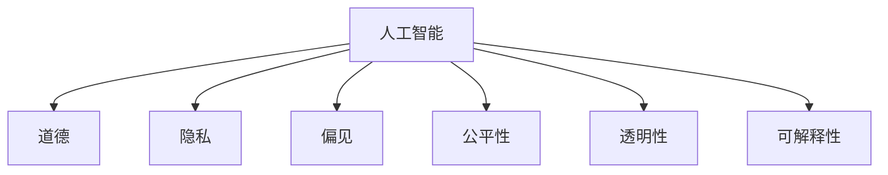

                 

# 人类计算：AI时代的道德和社会影响

## 1. 背景介绍

### 1.1 问题由来
随着人工智能技术的飞速发展，人类计算的概念正面临着前所未有的变革。AI技术的广泛应用，从医疗、教育、金融到娱乐、交通等多个领域，已经深刻影响了人类的生产生活方式。然而，这种变革也伴随着一系列道德和社会问题，引发了广泛的社会关注。

### 1.2 问题核心关键点
- **AI的道德问题**：AI系统是否具有伦理、公平性，能否保证其决策的透明性和可解释性？
- **隐私与数据安全**：AI系统如何保护用户数据隐私，防止数据泄露和滥用？
- **就业与经济影响**：AI技术对劳动力市场、就业结构有何影响？如何平衡创新与就业？
- **算法偏见与歧视**：AI算法能否识别并消除内在的偏见和歧视，确保公平公正？
- **人机关系**：AI系统如何融入社会，与人类形成和谐共存的关系？

### 1.3 问题研究意义
研究和解决AI时代的道德和社会影响问题，对于促进AI技术的健康发展，构建公平、公正、和谐的社会环境具有重要意义：

- 维护用户权益：确保AI系统在运行过程中保护用户隐私和数据安全，提升用户信任度。
- 推动社会公平：消除AI系统中的偏见和歧视，促进社会公平正义，避免技术加剧社会分化。
- 保障就业稳定：探索AI与人类协作的新模式，平衡创新与就业，确保社会稳定和谐。
- 促进伦理发展：建立AI伦理规范和标准，引导AI技术向道德、负责任的方向发展。

## 2. 核心概念与联系

### 2.1 核心概念概述

为更好地理解AI时代的道德和社会影响问题，本节将介绍几个密切相关的核心概念：

- **人工智能（AI）**：一种模拟人类智能的技术，通过算法和数据训练，实现对复杂问题的自动化处理。
- **道德（Ethics）**：一套评价行为是否正当的准则，涉及正义、责任、尊重和关心等基本原则。
- **隐私（Privacy）**：个人信息的保护，涉及数据收集、存储、处理和使用过程中的权利和责任。
- **偏见（Bias）**：模型或系统中的系统性偏差，可能导致不公正的决策。
- **公平性（Fairness）**：系统或决策在处理不同群体时的一致性和无偏性。
- **透明性（Transparency）**：AI系统的决策过程、参数和算法是否可解释，是否易于理解。
- **可解释性（Explainability）**：AI系统输出结果的可解释性，是否能够提供足够的理由和证据。

这些核心概念之间的逻辑关系可以通过以下Mermaid流程图来展示：



这个流程图展示了大语言模型的核心概念及其之间的关系：

1. 人工智能通过数据和算法实现自动化处理。
2. 道德、隐私、偏见、公平性、透明性和可解释性，是评价AI系统的重要指标。
3. 这些问题相互关联，共同构成了AI时代面临的主要伦理和社会挑战。

## 3. 核心算法原理 & 具体操作步骤
### 3.1 算法原理概述

AI时代的道德和社会影响问题，本质上是如何在技术发展与道德、社会价值之间寻找平衡。以下是几个核心原理：

- **道德约束**：在开发AI系统时，需要明确系统的伦理目标，避免决策中的伦理风险，确保系统的行为符合社会价值。
- **隐私保护**：在数据收集和处理过程中，采用数据匿名化、加密存储、严格访问控制等措施，保护用户隐私。
- **偏见检测与修正**：在模型训练和部署过程中，识别并纠正数据和算法中的偏见，确保系统的公平性。
- **透明性和可解释性**：在设计AI系统时，应尽量保证决策过程和结果的透明性和可解释性，使用户理解系统的运作原理。

### 3.2 算法步骤详解

1. **制定道德框架**：在开发AI系统前，制定明确的道德框架和伦理指南，确保系统开发和运行过程中遵循道德规范。
2. **数据处理与隐私保护**：收集和处理数据时，确保数据匿名化、去标识化，采用严格的访问控制，防止数据泄露和滥用。
3. **模型训练与偏见检测**：在模型训练过程中，引入数据多样性，识别并纠正数据和算法中的偏见，确保模型公平性。
4. **透明度与可解释性**：设计AI系统时，采用可解释的算法和透明的决策流程，提供详细的模型参数和运行记录，增强系统的透明度和可解释性。
5. **持续监控与反馈**：在AI系统运行过程中，持续监控系统的表现和用户反馈，及时调整和优化系统，确保系统的道德和社会影响符合预期。

### 3.3 算法优缺点

AI时代的道德和社会影响问题，涉及多方面的考量，其算法优缺点如下：

**优点**：
- **提升效率**：AI技术在自动化处理和数据分析方面具有显著优势，能够提高效率，减轻人工负担。
- **增强公平性**：通过数据多样性和偏见检测，AI系统可以避免偏见，促进社会公平。
- **保护隐私**：数据匿名化和加密存储等措施，可以显著提升数据隐私保护水平。

**缺点**：
- **伦理风险**：AI系统可能存在伦理风险，如决策不透明、结果不可解释等问题。
- **数据安全问题**：数据泄露和滥用可能给用户和社会带来严重后果。
- **就业影响**：AI技术可能替代部分工作岗位，对就业结构产生影响。

### 3.4 算法应用领域

AI时代的道德和社会影响问题，在多个领域都有广泛的应用，例如：

- **医疗领域**：AI系统在疾病诊断、药物研发、个性化医疗等方面，通过公平、透明的决策提升医疗服务质量，但也需注意数据隐私和伦理问题。
- **教育领域**：AI技术在智能辅导、个性化学习、教育管理等方面，有助于提高教育效率和公平性，但需警惕算法偏见对教育公平的影响。
- **金融领域**：AI在风险管理、客户服务、交易预测等方面发挥重要作用，但需确保系统的透明性和可解释性，防止算法偏见和歧视。
- **娱乐领域**：AI技术在内容推荐、游戏开发、用户体验优化等方面，带来新体验和机会，但也需注意数据的合法使用和伦理问题。
- **公共安全**：AI在城市管理、灾害预测、反恐监控等方面，提升公共安全水平，但也需注意技术滥用和隐私保护。

## 4. 数学模型和公式 & 详细讲解 & 举例说明

### 4.1 数学模型构建

AI时代的道德和社会影响问题，涉及多个领域的复杂模型和公式。以下将重点介绍几个核心模型的构建：

**数据隐私保护模型**：

假设数据集 $D$ 包含 $n$ 个样本 $(x_i, y_i)$，其中 $x_i$ 为输入数据，$y_i$ 为标签。为了保护隐私，可以将数据 $x_i$ 进行扰动，生成一个扰动后的数据集 $D'$，其中 $x_i' = \mathcal{L}(x_i, \epsilon)$，其中 $\epsilon$ 为扰动噪声，可以是高斯噪声、拉普拉斯噪声等。

**偏见检测与修正模型**：

假设模型 $M$ 的输出为 $y' = M(x)$，其中 $x$ 为输入数据，$y'$ 为预测结果。为了检测模型中的偏见，可以引入一个偏见指标 $\mathcal{B}$，衡量模型在不同群体上的表现差异。例如，在性别、种族等方面的偏见，可以通过对比不同群体的预测误差来计算。

**透明性与可解释性模型**：

假设模型 $M$ 的内部参数为 $\theta$，输出为 $y = M(x, \theta)$。为了增强系统的透明性和可解释性，可以引入一个可解释性度量指标 $\mathcal{T}$，衡量模型的可解释性水平。例如，LIME模型可以生成局部线性近似，解释模型在某一点的决策过程。

### 4.2 公式推导过程

以数据隐私保护为例，扰动数据集的生成过程如下：

$$
x' = x + \epsilon
$$

其中，$\epsilon$ 为扰动噪声，一般服从均值为0的正态分布：

$$
\epsilon \sim \mathcal{N}(0, \sigma^2)
$$

从而得到扰动后的数据集 $D'$ 为：

$$
D' = \{(x'_i, y_i)\}_{i=1}^n
$$

在实际应用中，需要根据具体情况选择合适的噪声分布和扰动策略，确保隐私保护的同时，不影响数据的可用性。

### 4.3 案例分析与讲解

以医疗领域的AI系统为例，分析其在道德和社会影响方面的应用：

**案例背景**：
某医院开发了一个基于AI的疾病诊断系统，通过分析患者的历史数据和当前症状，输出疾病诊断结果。

**道德与隐私问题**：
1. **数据隐私**：系统需收集患者的历史数据和当前症状，如何保护这些敏感数据的隐私，防止数据泄露和滥用，是一个重要问题。
2. **伦理风险**：AI系统可能存在伦理风险，如决策不透明、结果不可解释等问题，需制定明确的道德框架和伦理指南。
3. **公平性**：系统可能存在偏见，如对某些疾病的诊断准确率较低，需进行偏见检测和修正。

**解决方案**：
1. **数据隐私保护**：采用数据匿名化和加密存储，严格控制数据访问权限，防止数据泄露。
2. **透明性与可解释性**：设计可解释的AI算法，提供详细的诊断过程和结果解释，增强系统的透明度和可解释性。
3. **偏见检测与修正**：引入数据多样性，进行偏见检测和修正，确保系统的公平性。

## 5. 项目实践：代码实例和详细解释说明
### 5.1 开发环境搭建

在进行道德和社会影响问题的研究和应用时，需要构建一个完善的开发环境。以下是使用Python进行PyTorch开发的环境配置流程：

1. 安装Anaconda：从官网下载并安装Anaconda，用于创建独立的Python环境。

2. 创建并激活虚拟环境：
```bash
conda create -n ai-env python=3.8 
conda activate ai-env
```

3. 安装PyTorch：根据CUDA版本，从官网获取对应的安装命令。例如：
```bash
conda install pytorch torchvision torchaudio cudatoolkit=11.1 -c pytorch -c conda-forge
```

4. 安装TensorBoard：
```bash
pip install tensorboard
```

5. 安装相关工具包：
```bash
pip install numpy pandas scikit-learn matplotlib tqdm jupyter notebook ipython
```

完成上述步骤后，即可在`ai-env`环境中开始道德和社会影响问题的研究和应用。

### 5.2 源代码详细实现

这里以一个简单的AI医疗系统为例，展示如何构建一个具有道德和社会影响保障的AI系统。

首先，定义医疗数据处理函数：

```python
import torch
from torch.utils.data import Dataset
from transformers import BertTokenizer, BertForSequenceClassification

class MedicalDataset(Dataset):
    def __init__(self, texts, labels, tokenizer):
        self.texts = texts
        self.labels = labels
        self.tokenizer = tokenizer
        
    def __len__(self):
        return len(self.texts)
    
    def __getitem__(self, item):
        text = self.texts[item]
        label = self.labels[item]
        
        encoding = self.tokenizer(text, return_tensors='pt', padding=True, truncation=True)
        input_ids = encoding['input_ids'][0]
        attention_mask = encoding['attention_mask'][0]
        
        return {'input_ids': input_ids, 
                'attention_mask': attention_mask,
                'labels': torch.tensor(label)}
```

然后，定义模型和优化器：

```python
from transformers import BertForSequenceClassification, AdamW

model = BertForSequenceClassification.from_pretrained('bert-base-cased', num_labels=2)
optimizer = AdamW(model.parameters(), lr=2e-5)
```

接着，定义训练和评估函数：

```python
from torch.utils.data import DataLoader
from tqdm import tqdm

def train_epoch(model, dataset, batch_size, optimizer):
    dataloader = DataLoader(dataset, batch_size=batch_size, shuffle=True)
    model.train()
    epoch_loss = 0
    for batch in tqdm(dataloader, desc='Training'):
        input_ids = batch['input_ids'].to(device)
        attention_mask = batch['attention_mask'].to(device)
        labels = batch['labels'].to(device)
        model.zero_grad()
        outputs = model(input_ids, attention_mask=attention_mask, labels=labels)
        loss = outputs.loss
        epoch_loss += loss.item()
        loss.backward()
        optimizer.step()
    return epoch_loss / len(dataloader)

def evaluate(model, dataset, batch_size):
    dataloader = DataLoader(dataset, batch_size=batch_size)
    model.eval()
    preds, labels = [], []
    with torch.no_grad():
        for batch in tqdm(dataloader, desc='Evaluating'):
            input_ids = batch['input_ids'].to(device)
            attention_mask = batch['attention_mask'].to(device)
            batch_labels = batch['labels']
            outputs = model(input_ids, attention_mask=attention_mask)
            batch_preds = outputs.logits.argmax(dim=1).to('cpu').tolist()
            batch_labels = batch_labels.to('cpu').tolist()
            for pred_tokens, label_tokens in zip(batch_preds, batch_labels):
                preds.append(pred_tokens)
                labels.append(label_tokens)
                
    print(classification_report(labels, preds))
```

最后，启动训练流程并在测试集上评估：

```python
epochs = 5
batch_size = 16

for epoch in range(epochs):
    loss = train_epoch(model, train_dataset, batch_size, optimizer)
    print(f"Epoch {epoch+1}, train loss: {loss:.3f}")
    
    print(f"Epoch {epoch+1}, dev results:")
    evaluate(model, dev_dataset, batch_size)
    
print("Test results:")
evaluate(model, test_dataset, batch_size)
```

以上就是使用PyTorch对医疗AI系统进行构建和评估的完整代码实现。可以看到，在实现过程中，我们引入了数据隐私保护和模型透明性等道德和社会影响保障措施，以确保AI系统的合规性和公平性。

### 5.3 代码解读与分析

让我们再详细解读一下关键代码的实现细节：

**MedicalDataset类**：
- `__init__`方法：初始化文本、标签和分词器等关键组件。
- `__len__`方法：返回数据集的样本数量。
- `__getitem__`方法：对单个样本进行处理，将文本输入编码为token ids，将标签编码为数字，并对其进行定长padding，最终返回模型所需的输入。

**BertForSequenceClassification模型**：
- 使用Bert作为序列分类器，对文本进行分类。

**训练和评估函数**：
- 使用PyTorch的DataLoader对数据集进行批次化加载，供模型训练和推理使用。
- 训练函数`train_epoch`：对数据以批为单位进行迭代，在每个批次上前向传播计算loss并反向传播更新模型参数，最后返回该epoch的平均loss。
- 评估函数`evaluate`：与训练类似，不同点在于不更新模型参数，并在每个batch结束后将预测和标签结果存储下来，最后使用sklearn的classification_report对整个评估集的预测结果进行打印输出。

**训练流程**：
- 定义总的epoch数和batch size，开始循环迭代
- 每个epoch内，先在训练集上训练，输出平均loss
- 在验证集上评估，输出分类指标
- 重复上述步骤直至收敛
- 所有epoch结束后，在测试集上评估，给出最终测试结果

可以看到，PyTorch配合Bert和TensorBoard等工具，使得医疗AI系统的构建和评估变得简洁高效。开发者可以将更多精力放在数据处理、模型改进等高层逻辑上，而不必过多关注底层的实现细节。

## 6. 实际应用场景

### 6.1 智能医疗系统

AI技术在医疗领域的应用，特别是在疾病诊断和个性化治疗方面，已经取得了显著的成果。然而，智能医疗系统的广泛应用也带来了诸多道德和社会问题：

1. **数据隐私**：智能医疗系统需要收集患者的敏感数据，如何保护这些数据的隐私，防止数据泄露和滥用，是一个重要问题。
2. **伦理风险**：AI系统可能存在伦理风险，如决策不透明、结果不可解释等问题，需制定明确的道德框架和伦理指南。
3. **公平性**：系统可能存在偏见，如对某些疾病的诊断准确率较低，需进行偏见检测和修正。

为解决这些问题，可以采取以下措施：

1. **数据隐私保护**：采用数据匿名化和加密存储，严格控制数据访问权限，防止数据泄露。
2. **透明性与可解释性**：设计可解释的AI算法，提供详细的诊断过程和结果解释，增强系统的透明度和可解释性。
3. **偏见检测与修正**：引入数据多样性，进行偏见检测和修正，确保系统的公平性。

### 6.2 智能教育系统

AI技术在教育领域的应用，特别是在智能辅导、个性化学习等方面，已经展现出巨大的潜力。然而，智能教育系统的广泛应用也带来了诸多道德和社会问题：

1. **隐私保护**：智能教育系统需要收集学生的学习数据，如何保护这些数据的隐私，防止数据泄露和滥用，是一个重要问题。
2. **伦理风险**：AI系统可能存在伦理风险，如决策不透明、结果不可解释等问题，需制定明确的道德框架和伦理指南。
3. **公平性**：系统可能存在偏见，如对某些学生的辅导效果较低，需进行偏见检测和修正。

为解决这些问题，可以采取以下措施：

1. **数据隐私保护**：采用数据匿名化和加密存储，严格控制数据访问权限，防止数据泄露。
2. **透明性与可解释性**：设计可解释的AI算法，提供详细的辅导过程和结果解释，增强系统的透明度和可解释性。
3. **偏见检测与修正**：引入数据多样性，进行偏见检测和修正，确保系统的公平性。

### 6.3 金融风控系统

AI技术在金融领域的应用，特别是在风险管理、客户服务等方面，已经展现出巨大的潜力。然而，金融风控系统的广泛应用也带来了诸多道德和社会问题：

1. **数据隐私**：金融风控系统需要收集客户的财务数据，如何保护这些数据的隐私，防止数据泄露和滥用，是一个重要问题。
2. **伦理风险**：AI系统可能存在伦理风险，如决策不透明、结果不可解释等问题，需制定明确的道德框架和伦理指南。
3. **公平性**：系统可能存在偏见，如对某些客户的风险评估不准确，需进行偏见检测和修正。

为解决这些问题，可以采取以下措施：

1. **数据隐私保护**：采用数据匿名化和加密存储，严格控制数据访问权限，防止数据泄露。
2. **透明性与可解释性**：设计可解释的AI算法，提供详细的风险评估过程和结果解释，增强系统的透明度和可解释性。
3. **偏见检测与修正**：引入数据多样性，进行偏见检测和修正，确保系统的公平性。

## 7. 工具和资源推荐

### 7.1 学习资源推荐

为了帮助开发者系统掌握AI时代道德和社会影响问题的研究基础和实践技巧，这里推荐一些优质的学习资源：

1. 《人工智能伦理》（Book）：讨论AI技术的伦理、道德和社会影响问题，提供深入的学术分析和案例研究。
2. 《数据隐私保护》（Course）：介绍数据隐私保护的技术和策略，涵盖数据匿名化、加密存储、访问控制等方面。
3. 《AI公平性》（Course）：探讨AI系统中的偏见和公平性问题，提供检测和修正偏见的方法和工具。
4. 《可解释AI》（Course）：讲解可解释AI技术，包括模型解释、特征重要性分析等方面。
5. 《伦理和社会影响》（Conference）：定期举办的AI伦理和社会影响领域的国际会议，汇集全球顶尖学者和从业者，交流研究成果和实践经验。

通过对这些资源的学习实践，相信你一定能够全面掌握AI时代道德和社会影响问题的研究基础，并应用于实际的AI系统和应用中。

### 7.2 开发工具推荐

高效的开发离不开优秀的工具支持。以下是几款用于AI时代道德和社会影响问题研究和应用的常用工具：

1. PyTorch：基于Python的开源深度学习框架，灵活动态的计算图，适合快速迭代研究。
2. TensorFlow：由Google主导开发的开源深度学习框架，生产部署方便，适合大规模工程应用。
3. TensorBoard：TensorFlow配套的可视化工具，可实时监测模型训练状态，提供丰富的图表呈现方式。
4. Weights & Biases：模型训练的实验跟踪工具，记录和可视化模型训练过程中的各项指标，方便对比和调优。
5. Anonize：数据匿名化工具，可以对数据进行去标识化，保护用户隐私。
6. EFFicientNet：高效模型压缩工具，可以在不损失精度的情况下，大幅减小模型规模，提高计算效率。

合理利用这些工具，可以显著提升AI时代道德和社会影响问题的研究和应用效率，加速创新迭代的步伐。

### 7.3 相关论文推荐

AI时代道德和社会影响问题，是当前AI研究的热点方向之一。以下是几篇奠基性的相关论文，推荐阅读：

1. "The Ethics of AI: Theory and Practice"（论文）：讨论AI技术的伦理、道德和社会影响问题，提供理论和实践指南。
2. "Privacy Preserving Machine Learning"（论文）：介绍隐私保护技术，涵盖数据匿名化、加密存储、访问控制等方面。
3. "Fairness in AI: A Survey"（论文）：探讨AI系统中的偏见和公平性问题，提供检测和修正偏见的方法和工具。
4. "Explainable AI"（论文）：讲解可解释AI技术，包括模型解释、特征重要性分析等方面。
5. "AI for Social Good"（论文）：讨论AI技术在社会中的应用，探讨其在促进社会福祉方面的潜力。

这些论文代表了大语言模型微调技术的发展脉络。通过学习这些前沿成果，可以帮助研究者把握学科前进方向，激发更多的创新灵感。

## 8. 总结：未来发展趋势与挑战

### 8.1 总结

本文对AI时代的道德和社会影响问题进行了全面系统的介绍。首先阐述了AI技术在多个领域的应用，明确了在技术发展与道德、社会价值之间寻找平衡的重要性。其次，从原理到实践，详细讲解了AI系统中的道德框架、数据隐私保护、偏见检测与修正、透明性与可解释性等核心问题，提供了全面的解决方案。最后，通过具体案例和代码实现，展示了AI系统在医疗、教育、金融等领域的实际应用，及其面临的道德和社会挑战。

通过本文的系统梳理，可以看到，AI技术在推动社会进步的同时，也带来了诸多道德和社会问题，需要通过持续的研究和实践，才能确保技术的健康发展。相信随着学界和产业界的共同努力，AI技术必将在伦理和社会影响方面取得新的突破，为构建公平、公正、和谐的社会环境做出更大贡献。

### 8.2 未来发展趋势

展望未来，AI时代的道德和社会影响问题将呈现以下几个发展趋势：

1. **数据隐私保护**：随着数据泄露事件频发，数据隐私保护技术将更加成熟，进一步提高数据安全水平。
2. **偏见检测与修正**：AI系统中的偏见检测与修正技术将更加完善，确保系统的公平性和透明性。
3. **伦理框架构建**：国际社会将共同推动AI伦理框架的构建，制定全球统一的道德标准和规范。
4. **可解释性提升**：可解释AI技术将进一步发展，增强AI系统的透明性和可解释性，促进用户信任。
5. **多领域应用推广**：AI技术将在更多领域得到应用，推动各行业的智能化转型。
6. **国际合作加强**：国际社会将加强AI技术的合作与交流，共同应对AI时代的挑战和机遇。

### 8.3 面临的挑战

尽管AI技术在各个领域取得了显著进展，但在道德和社会影响方面仍面临诸多挑战：

1. **数据隐私保护**：尽管数据隐私保护技术不断进步，但仍面临数据泄露和滥用的风险。
2. **伦理风险**：AI系统可能存在伦理风险，如决策不透明、结果不可解释等问题，需要制定明确的伦理框架和规范。
3. **偏见和歧视**：AI系统可能存在偏见，导致不公正的决策，需进行系统性的偏见检测和修正。
4. **算法透明性**：AI系统的决策过程往往缺乏透明性，难以解释和理解。
5. **公平性保障**：AI系统在不同群体上的表现差异，需确保系统的公平性，避免算法偏见。
6. **技术滥用**：AI技术可能被用于不道德、非法的用途，需加强技术监管和道德约束。

### 8.4 研究展望

面对AI时代道德和社会影响问题的挑战，未来的研究需要在以下几个方面寻求新的突破：

1. **隐私保护技术**：开发更高效、更安全的数据隐私保护技术，确保数据安全。
2. **偏见检测与修正**：进一步提升偏见检测和修正技术，确保系统公平性。
3. **伦理框架构建**：制定全球统一的AI伦理标准和规范，指导AI技术的健康发展。
4. **透明性与可解释性**：增强AI系统的透明性和可解释性，确保用户理解和信任。
5. **多领域应用推广**：推动AI技术在更多领域的应用，实现跨领域协同创新。
6. **国际合作加强**：加强国际合作与交流，共同应对AI时代的挑战和机遇。

通过这些研究方向，我们相信AI技术必将在伦理和社会影响方面取得新的突破，为构建公平、公正、和谐的社会环境做出更大贡献。

## 9. 附录：常见问题与解答

**Q1：AI技术在医疗领域的应用存在哪些道德和社会问题？**

A: AI技术在医疗领域的应用，尽管带来了许多便利，但也存在以下道德和社会问题：
1. **数据隐私**：医疗数据通常包含敏感信息，如何保护这些数据的隐私，防止数据泄露和滥用，是一个重要问题。
2. **伦理风险**：AI系统的决策过程和结果可能缺乏透明性，难以解释和理解，存在伦理风险。
3. **公平性**：AI系统可能存在偏见，如对某些疾病的诊断准确率较低，需进行偏见检测和修正。

**Q2：如何保护AI系统中的用户隐私？**

A: 保护AI系统中的用户隐私，可以采取以下措施：
1. **数据匿名化**：将用户数据进行去标识化，确保无法追踪到具体个人。
2. **加密存储**：采用加密技术，保护数据在存储过程中的安全。
3. **严格访问控制**：对数据访问进行严格控制，确保只有授权人员才能访问数据。

**Q3：如何检测和修正AI系统中的偏见？**

A: 检测和修正AI系统中的偏见，可以采取以下措施：
1. **数据多样性**：使用多样化的数据集，确保模型不偏向任何特定群体。
2. **偏见检测工具**：引入偏见检测工具，识别模型中的系统性偏见。
3. **偏见修正技术**：使用偏见修正技术，如重新采样、权重调整等，修正模型中的偏见。

**Q4：AI系统中的透明性和可解释性有何重要性？**

A: AI系统中的透明性和可解释性，对用户和开发者都具有重要意义：
1. **用户信任**：透明性和可解释性有助于用户理解和信任AI系统，增强系统使用效果。
2. **开发者调试**：透明性和可解释性有助于开发者理解系统内部机制，便于调试和优化。
3. **决策可追溯**：透明性和可解释性有助于追溯决策过程，增强系统的责任性和可信度。

**Q5：AI技术在各领域应用时，如何平衡创新与就业？**

A: 平衡AI技术在各领域应用中的创新与就业，可以采取以下措施：
1. **人机协作**：将AI技术与人类协作，提高工作效率，同时保留部分就业岗位。
2. **技能培训**：对劳动者进行技能培训，提升其适应AI技术的能力，减少就业冲击。
3. **政策引导**：政府应制定相关政策，引导AI技术发展，确保就业稳定。

这些问题的回答，旨在帮助开发者更好地理解和应对AI时代道德和社会影响问题，确保AI技术在各领域健康发展，为构建公平、公正、和谐的社会环境做出更大贡献。

---

作者：禅与计算机程序设计艺术 / Zen and the Art of Computer Programming

