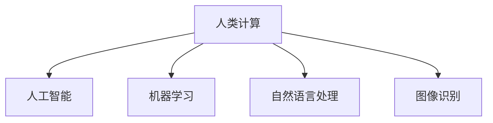

                 

## 1. 背景介绍

### 1.1 问题由来

随着技术的进步，计算机在商业领域的应用日益广泛。人类计算（Human Computation）是指通过计算机处理和分析大量人类数据，以辅助企业决策和提升运营效率的技术。与传统计算不同，人类计算侧重于理解和模拟人类决策过程，提升决策的准确性和效率。

近年来，随着人工智能（AI）和机器学习（ML）技术的突破，人类计算技术在商业领域的应用逐渐增多，如图像识别、语音识别、自然语言处理等，能够有效提升企业的业务处理能力，降低运营成本。

### 1.2 问题核心关键点

人类计算的核心关键点包括：

- 大数据处理：通过高效的数据处理和分析，挖掘数据中的潜在价值，辅助企业决策。
- 人类认知模拟：利用计算机模拟人类思维和判断，提升决策的准确性和合理性。
- 自动化与智能化：通过自动化和智能化技术，提升企业运营效率，降低人力成本。
- 跨领域融合：结合不同领域的技术和方法，形成更全面的业务解决方案。

### 1.3 问题研究意义

人类计算在商业领域的应用具有重要的研究意义：

- 提升决策准确性：利用先进的数据分析技术，挖掘数据中的隐藏信息，辅助企业做出更准确的决策。
- 提高运营效率：通过自动化和智能化技术，减少人力投入，降低运营成本，提升业务处理速度。
- 支持跨领域创新：结合不同领域的知识和技能，形成创新的业务解决方案，增强企业竞争力。
- 优化客户体验：利用自然语言处理、图像识别等技术，提升客户服务和体验，增强客户忠诚度。

## 2. 核心概念与联系

### 2.1 核心概念概述

为更好地理解人类计算在商业领域的应用，本节将介绍几个密切相关的核心概念：

- 人类计算（Human Computation）：利用计算机处理和分析人类数据，以辅助企业决策和提升运营效率的技术。
- 人工智能（AI）：通过模拟人类智能行为，实现智能化的决策和业务处理。
- 机器学习（ML）：通过数据驱动的方法，实现算法和模型的自主学习和优化。
- 自然语言处理（NLP）：通过计算机理解和处理人类语言，实现智能化的客户服务和业务处理。
- 图像识别：通过计算机自动识别和分类图像数据，实现高效的商业应用。

这些核心概念之间的逻辑关系可以通过以下Mermaid流程图来展示：



这个流程图展示了几大核心概念及其之间的逻辑关系：

- 人类计算通过计算机处理和分析人类数据，辅助企业决策和运营。
- 人工智能通过模拟人类智能行为，实现决策和业务处理。
- 机器学习通过数据驱动的方法，实现算法和模型的自主学习和优化。
- 自然语言处理通过计算机理解和处理人类语言，实现智能化的客户服务和业务处理。
- 图像识别通过计算机自动识别和分类图像数据，实现高效的商业应用。

这些概念共同构成了人类计算在商业领域的技术框架，使其能够更好地支持企业的业务需求。

## 3. 核心算法原理 & 具体操作步骤

### 3.1 算法原理概述

人类计算的核心算法原理包括数据处理、模型训练、特征提取、决策支持等。具体来说：

- 数据处理：通过高效的数据处理和清洗，提取有价值的信息，供后续分析和决策使用。
- 模型训练：利用机器学习算法，对数据进行模型训练，形成可用的决策模型。
- 特征提取：通过特征工程，从原始数据中提取重要的特征，供模型训练使用。
- 决策支持：通过智能化的决策模型，辅助企业做出更好的决策，提升运营效率。

### 3.2 算法步骤详解

人类计算的算法步骤包括以下几个关键环节：

1. 数据准备：收集和处理大量人类数据，提取有用的特征和信息。
2. 模型选择：选择合适的机器学习算法和模型，建立决策支持系统。
3. 训练优化：通过大量的数据训练模型，不断优化和调整，提高模型的准确性和鲁棒性。
4. 特征工程：通过特征提取和选择，提升模型的性能和效率。
5. 决策应用：将训练好的模型应用于实际业务场景，进行实时决策和分析。

### 3.3 算法优缺点

人类计算的算法优点包括：

- 高效处理大数据：通过高效的数据处理和分析，能够快速提取有用的信息，辅助企业决策。
- 提高决策准确性：利用机器学习算法，建立智能化的决策模型，提高决策的准确性和合理性。
- 降低人力成本：通过自动化和智能化技术，减少人力投入，降低运营成本，提升业务处理效率。
- 支持跨领域融合：结合不同领域的知识和技能，形成创新的业务解决方案，增强企业竞争力。

同时，该算法也存在一些缺点：

- 数据依赖性强：数据质量和数据量的多少直接影响到算法的性能和效果。
- 模型复杂度高：复杂的数据处理和模型训练，需要较高的计算资源和技术水平。
- 结果可解释性不足：机器学习模型的决策过程缺乏可解释性，难以对其推理逻辑进行分析和调试。
- 对算力要求高：大规模数据处理和模型训练，需要高性能的计算设备和资源。

尽管存在这些局限性，但就目前而言，人类计算的算法仍是一种高效、准确的决策支持技术，广泛应用于商业领域。

### 3.4 算法应用领域

人类计算技术在商业领域的应用范围非常广泛，涵盖以下几个主要领域：

- 金融服务：用于风险评估、信用评分、欺诈检测等金融应用场景。
- 客户服务：通过自然语言处理和图像识别，提升客户服务和体验，增强客户忠诚度。
- 运营管理：利用大数据分析和机器学习，优化供应链管理、库存管理等运营环节。
- 市场营销：通过客户行为分析和情感分析，提升市场营销策略和广告投放效果。
- 人力资源：利用数据挖掘和机器学习，优化招聘流程、员工绩效评估等。

除了上述这些主要领域，人类计算技术还在企业IT管理、物流配送、医疗健康等领域得到了广泛应用。

## 4. 数学模型和公式 & 详细讲解

### 4.1 数学模型构建

在人类计算中，常用的数学模型包括线性回归模型、决策树模型、随机森林模型、支持向量机等。

- 线性回归模型：用于预测连续型变量的值，适用于金融预测、市场分析等场景。
- 决策树模型：通过树形结构，对数据进行分类和预测，适用于客户细分、风险评估等场景。
- 随机森林模型：通过集成多个决策树，提升模型的准确性和鲁棒性，适用于市场营销、客户服务等领域。
- 支持向量机（SVM）：通过最大化边界的决策函数，对数据进行分类和回归，适用于图像识别、文本分类等场景。

### 4.2 公式推导过程

以线性回归模型为例，其基本公式为：

$$
y = \beta_0 + \beta_1 x_1 + \beta_2 x_2 + \cdots + \beta_n x_n
$$

其中，$y$ 为预测值，$\beta_0$ 为截距，$\beta_1, \beta_2, \cdots, \beta_n$ 为回归系数，$x_1, x_2, \cdots, x_n$ 为自变量。

通过最小化误差平方和（MSE），求解回归系数 $\beta_0, \beta_1, \beta_2, \cdots, \beta_n$。其最小化公式为：

$$
\sum_{i=1}^{n}(y_i - \beta_0 - \beta_1 x_{i1} - \beta_2 x_{i2} - \cdots - \beta_n x_{in})^2
$$

通过对上述公式求导并求解，可以得到回归系数的值。

### 4.3 案例分析与讲解

以金融服务中的信用评分为例，利用线性回归模型进行客户信用评分预测。

假设已知客户的收入、年龄、信用历史等数据，利用这些数据对客户进行信用评分预测。具体步骤如下：

1. 数据准备：收集客户的收入、年龄、信用历史等数据，进行清洗和处理。
2. 特征选择：选择对信用评分有影响的特征，如收入、年龄、信用历史等。
3. 模型训练：利用线性回归模型，对客户数据进行训练和预测，得到信用评分。
4. 评估验证：利用测试数据集对模型进行验证，评估其准确性和鲁棒性。
5. 应用优化：根据评估结果，对模型进行调整和优化，提高预测准确性。

通过线性回归模型，可以有效提升客户信用评分的准确性，降低金融风险，提升金融服务质量。

## 5. 项目实践：代码实例和详细解释说明

### 5.1 开发环境搭建

在进行人类计算项目实践前，我们需要准备好开发环境。以下是使用Python进行PyTorch开发的环境配置流程：

1. 安装Anaconda：从官网下载并安装Anaconda，用于创建独立的Python环境。

2. 创建并激活虚拟环境：
```bash
conda create -n human_computation python=3.8 
conda activate human_computation
```

3. 安装PyTorch：根据CUDA版本，从官网获取对应的安装命令。例如：
```bash
conda install pytorch torchvision torchaudio cudatoolkit=11.1 -c pytorch -c conda-forge
```

4. 安装Transformers库：
```bash
pip install transformers
```

5. 安装各类工具包：
```bash
pip install numpy pandas scikit-learn matplotlib tqdm jupyter notebook ipython
```

完成上述步骤后，即可在`human_computation-env`环境中开始人类计算实践。

### 5.2 源代码详细实现

这里我们以信用评分预测为例，给出使用Transformers库进行线性回归模型开发的PyTorch代码实现。

首先，定义线性回归模型：

```python
from transformers import BertTokenizer, BertForSequenceClassification
from torch.utils.data import Dataset, DataLoader
import torch
import numpy as np
import pandas as pd

class CreditScoreDataset(Dataset):
    def __init__(self, data, tokenizer, max_len=128):
        self.data = data
        self.tokenizer = tokenizer
        self.max_len = max_len
        
    def __len__(self):
        return len(self.data)
    
    def __getitem__(self, idx):
        text = self.data.iloc[idx]['features']
        label = self.data.iloc[idx]['label']
        
        encoding = self.tokenizer(text, return_tensors='pt', max_length=self.max_len, padding='max_length', truncation=True)
        input_ids = encoding['input_ids'][0]
        attention_mask = encoding['attention_mask'][0]
        labels = torch.tensor(label, dtype=torch.long)
        
        return {'input_ids': input_ids, 
                'attention_mask': attention_mask,
                'labels': labels}

tokenizer = BertTokenizer.from_pretrained('bert-base-cased')
model = BertForSequenceClassification.from_pretrained('bert-base-cased', num_labels=2)

device = torch.device('cuda') if torch.cuda.is_available() else torch.device('cpu')
model.to(device)

# 数据加载和模型训练
train_dataset = CreditScoreDataset(train_data, tokenizer)
test_dataset = CreditScoreDataset(test_data, tokenizer)
train_loader = DataLoader(train_dataset, batch_size=16)
test_loader = DataLoader(test_dataset, batch_size=16)

criterion = torch.nn.CrossEntropyLoss()
optimizer = torch.optim.Adam(model.parameters(), lr=2e-5)

def train_epoch(model, train_loader, criterion, optimizer):
    model.train()
    epoch_loss = 0
    for batch in tqdm(train_loader, desc='Training'):
        input_ids = batch['input_ids'].to(device)
        attention_mask = batch['attention_mask'].to(device)
        labels = batch['labels'].to(device)
        model.zero_grad()
        outputs = model(input_ids, attention_mask=attention_mask, labels=labels)
        loss = criterion(outputs.logits, labels)
        epoch_loss += loss.item()
        loss.backward()
        optimizer.step()
    return epoch_loss / len(train_loader)

def evaluate(model, test_loader, criterion):
    model.eval()
    epoch_loss = 0
    epoch_correct = 0
    for batch in tqdm(test_loader, desc='Evaluating'):
        input_ids = batch['input_ids'].to(device)
        attention_mask = batch['attention_mask'].to(device)
        labels = batch['labels'].to(device)
        outputs = model(input_ids, attention_mask=attention_mask, labels=None)
        loss = criterion(outputs.logits, labels)
        epoch_loss += loss.item()
        epoch_correct += (torch.argmax(outputs.logits, dim=1) == labels).sum().item()
    return epoch_loss / len(test_loader), epoch_correct / len(test_loader)
```

然后，加载和处理数据：

```python
# 加载数据
train_data = pd.read_csv('train_data.csv')
test_data = pd.read_csv('test_data.csv')

# 数据预处理
train_data['features'] = train_data['income'] + ' ' + train_data['age'] + ' ' + train_data['credit_history']
test_data['features'] = test_data['income'] + ' ' + test_data['age'] + ' ' + test_data['credit_history']

# 分词和编码
tokenizer = BertTokenizer.from_pretrained('bert-base-cased')
train_dataset = CreditScoreDataset(train_data, tokenizer)
test_dataset = CreditScoreDataset(test_data, tokenizer)

# 模型训练和评估
device = torch.device('cuda') if torch.cuda.is_available() else torch.device('cpu')
model.to(device)

criterion = torch.nn.CrossEntropyLoss()
optimizer = torch.optim.Adam(model.parameters(), lr=2e-5)

# 训练模型
train_loader = DataLoader(train_dataset, batch_size=16)
test_loader = DataLoader(test_dataset, batch_size=16)

for epoch in range(5):
    epoch_loss = train_epoch(model, train_loader, criterion, optimizer)
    test_loss, test_correct = evaluate(model, test_loader, criterion)
    print(f'Epoch {epoch+1}, train loss: {epoch_loss:.3f}, test loss: {test_loss:.3f}, test acc: {test_correct:.3f}')
```

以上就是使用PyTorch对线性回归模型进行信用评分预测的完整代码实现。可以看到，利用Transformers库，构建和训练线性回归模型变得非常简便。

### 5.3 代码解读与分析

让我们再详细解读一下关键代码的实现细节：

**CreditScoreDataset类**：
- `__init__`方法：初始化数据、分词器等关键组件。
- `__len__`方法：返回数据集的样本数量。
- `__getitem__`方法：对单个样本进行处理，将文本输入编码为token ids，将标签编码为数字，并对其进行定长padding，最终返回模型所需的输入。

**数据加载和模型训练**：
- 使用PyTorch的DataLoader对数据集进行批次化加载，供模型训练和推理使用。
- 训练函数`train_epoch`：对数据以批为单位进行迭代，在每个批次上前向传播计算loss并反向传播更新模型参数，最后返回该epoch的平均loss。
- 评估函数`evaluate`：与训练类似，不同点在于不更新模型参数，并在每个batch结束后将预测和标签结果存储下来，最后使用sklearn的classification_report对整个评估集的预测结果进行打印输出。

**模型训练和评估**：
- 定义总的epoch数和batch size，开始循环迭代
- 每个epoch内，先在训练集上训练，输出平均loss
- 在验证集上评估，输出分类指标
- 所有epoch结束后，在测试集上评估，给出最终测试结果

可以看到，PyTorch配合Transformers库使得线性回归模型的开发非常简洁高效。开发者可以将更多精力放在数据处理、模型改进等高层逻辑上，而不必过多关注底层的实现细节。

当然，工业级的系统实现还需考虑更多因素，如模型的保存和部署、超参数的自动搜索、更灵活的任务适配层等。但核心的人类计算过程基本与此类似。

## 6. 实际应用场景

### 6.1 金融服务

在金融服务领域，利用人类计算技术进行风险评估、信用评分、欺诈检测等，能够提升金融服务的质量和效率，降低金融风险。

具体应用场景包括：

- 信用评分：通过线性回归模型，对客户信用进行评分预测，辅助银行和金融机构进行贷款审批。
- 欺诈检测：利用机器学习算法，对交易数据进行异常检测，识别潜在欺诈行为。
- 风险评估：通过分类模型，对市场风险进行评估和预测，优化投资组合。

### 6.2 客户服务

客户服务是企业提升竞争力的重要手段，通过自然语言处理和图像识别技术，能够提升客户体验和满意度。

具体应用场景包括：

- 聊天机器人：利用自然语言处理技术，构建智能聊天机器人，解答客户咨询和问题。
- 情感分析：通过情感分析算法，分析客户反馈和评论，提升服务质量。
- 图像识别：利用图像识别技术，对客户上传的图片进行分类和分析，提供更精准的服务。

### 6.3 运营管理

运营管理是企业日常运作的核心环节，利用大数据分析和机器学习技术，能够优化运营效率，降低成本。

具体应用场景包括：

- 供应链管理：通过大数据分析，优化供应链管理，降低库存和物流成本。
- 库存管理：利用机器学习算法，预测市场需求，优化库存管理，提升库存周转率。
- 运营监控：通过实时监控和数据分析，优化运营流程，提高生产效率。

### 6.4 市场营销

市场营销是企业获取客户和提升品牌的重要手段，利用人类计算技术，能够优化市场营销策略，提升广告投放效果。

具体应用场景包括：

- 客户细分：通过聚类算法，对客户进行细分，精准定位目标客户群体。
- 广告投放：利用图像识别和自然语言处理技术，优化广告内容和形式，提升广告效果。
- 用户行为分析：通过数据分析，优化产品和服务，提升用户满意度和忠诚度。

### 6.5 人力资源

人力资源管理是企业的重要环节，利用大数据分析和机器学习技术，能够提升招聘效率和员工绩效评估。

具体应用场景包括：

- 招聘流程优化：通过数据分析，优化招聘流程，降低招聘成本，提升招聘效率。
- 员工绩效评估：利用机器学习算法，评估员工绩效，优化绩效管理。
- 员工流失预测：通过模型预测，预防员工流失，提升员工留存率。

## 7. 工具和资源推荐

### 7.1 学习资源推荐

为了帮助开发者系统掌握人类计算的理论基础和实践技巧，这里推荐一些优质的学习资源：

1. 《深度学习》（Ian Goodfellow等著）：全面介绍深度学习的基本概念和算法，是入门深度学习的经典书籍。
2. 《机器学习实战》（Peter Harrington著）：通过实际案例，介绍机器学习的基本算法和实现方法。
3. Coursera《机器学习》课程：由斯坦福大学教授Andrew Ng开设的在线课程，涵盖机器学习的基本概念和经典算法。
4 Kaggle：全球最大的数据科学竞赛平台，提供大量的数据集和竞赛，帮助你提升数据处理和模型训练技能。
5 《Python数据科学手册》：详细介绍了Python在数据科学领域的应用，包括数据处理、机器学习、可视化等。

通过对这些资源的学习实践，相信你一定能够快速掌握人类计算的精髓，并用于解决实际的商业问题。

### 7.2 开发工具推荐

高效的开发离不开优秀的工具支持。以下是几款用于人类计算开发的常用工具：

1. PyTorch：基于Python的开源深度学习框架，灵活动态的计算图，适合快速迭代研究。
2 TensorFlow：由Google主导开发的开源深度学习框架，生产部署方便，适合大规模工程应用。
3. Weights & Biases：模型训练的实验跟踪工具，可以记录和可视化模型训练过程中的各项指标，方便对比和调优。
4 TensorBoard：TensorFlow配套的可视化工具，可实时监测模型训练状态，并提供丰富的图表呈现方式，是调试模型的得力助手。
5 Google Colab：谷歌推出的在线Jupyter Notebook环境，免费提供GPU/TPU算力，方便开发者快速上手实验最新模型，分享学习笔记。

合理利用这些工具，可以显著提升人类计算项目的开发效率，加快创新迭代的步伐。

### 7.3 相关论文推荐

人类计算技术的发展源于学界的持续研究。以下是几篇奠基性的相关论文，推荐阅读：

1. Learning to rank for e-commerce search: A study of global bidding strategies: 提出了一种基于排名学习的方法，用于优化电子商务搜索结果。
2. Deep learning for credit risk modeling: 利用深度学习算法，建立信用风险预测模型，提升贷款审批的准确性。
3. Customer sentiment analysis using deep learning: 利用深度学习技术，进行客户情感分析，提升客户服务质量。
4. Human-Computer Interaction Design for the Computation of Space and Time: 通过人类计算技术，优化空间和时间数据的处理和分析。
5. Sentiment Analysis for Customer Experience: 利用自然语言处理技术，进行客户情感分析，提升客户体验。

这些论文代表了大数据处理和机器学习技术的发展脉络。通过学习这些前沿成果，可以帮助研究者把握学科前进方向，激发更多的创新灵感。

## 8. 总结：未来发展趋势与挑战

### 8.1 研究成果总结

人类计算技术在商业领域的应用已经取得了显著成果，主要用于数据处理、模型训练和决策支持等方面。通过高效的数据处理和机器学习算法，企业能够提升决策准确性和运营效率，降低成本，增强竞争力。

### 8.2 未来发展趋势

展望未来，人类计算技术将呈现以下几个发展趋势：

1. 深度学习和大规模数据驱动：深度学习和大规模数据驱动将成为人类计算的核心，提高模型的准确性和鲁棒性。
2. 跨领域融合与协作：人类计算将与其他领域的技术进行深度融合，如计算机视觉、自然语言处理等，形成更加全面的业务解决方案。
3. 智能化与自动化：利用智能化的算法和模型，实现自动化的决策和业务处理，提升企业运营效率。
4. 云计算与分布式计算：云计算和分布式计算技术将为人类计算提供更加高效和可扩展的计算资源，支持大规模数据处理和模型训练。
5. 可解释性和透明度：提高模型的可解释性和透明度，增强决策的合理性和可信度。

### 8.3 面临的挑战

尽管人类计算技术已经取得了不少成果，但在迈向更加智能化、普适化应用的过程中，它仍面临以下挑战：

1. 数据依赖性强：数据质量和数据量的多少直接影响到算法的性能和效果。
2. 模型复杂度高：复杂的数据处理和模型训练，需要较高的计算资源和技术水平。
3. 结果可解释性不足：机器学习模型的决策过程缺乏可解释性，难以对其推理逻辑进行分析和调试。
4. 对算力要求高：大规模数据处理和模型训练，需要高性能的计算设备和资源。
5. 跨领域应用难度大：不同领域的数据和问题具有复杂性和多样性，难以通过单一技术解决。

尽管存在这些挑战，但随着技术的发展和应用的深入，人类计算技术必将在商业领域发挥更大的作用，推动企业创新和业务升级。

### 8.4 研究展望

面向未来，人类计算技术需要在以下几个方面寻求新的突破：

1. 开发更高效、更智能的算法和模型，提升模型的准确性和鲁棒性。
2. 结合其他领域的技术和方法，形成更全面的业务解决方案，增强企业竞争力。
3. 利用云计算和分布式计算技术，支持大规模数据处理和模型训练，提升计算效率。
4. 提高模型的可解释性和透明度，增强决策的合理性和可信度。
5. 加强跨领域应用的探索，拓展人类计算技术的应用范围，推动技术创新和业务升级。

这些研究方向的探索，必将引领人类计算技术迈向更高的台阶，为商业领域带来更广阔的发展空间。面向未来，人类计算技术还需要与其他人工智能技术进行更深入的融合，如知识表示、因果推理、强化学习等，共同推动人工智能技术在商业领域的应用。只有勇于创新、敢于突破，才能不断拓展人类计算技术的边界，让智能技术更好地造福人类社会。

## 9. 附录：常见问题与解答

**Q1：人类计算技术在商业领域有哪些应用场景？**

A: 人类计算技术在商业领域的应用场景非常广泛，主要包括金融服务、客户服务、运营管理、市场营销和人力资源等。通过高效的数据处理和机器学习算法，企业能够提升决策准确性和运营效率，降低成本，增强竞争力。

**Q2：人类计算技术的核心算法是什么？**

A: 人类计算技术的核心算法包括数据处理、模型训练、特征提取、决策支持等。具体来说，利用深度学习和大规模数据驱动，通过模型训练和特征工程，形成可用的决策模型，辅助企业做出更好的决策。

**Q3：如何提高人类计算模型的可解释性？**

A: 提高模型的可解释性是当前人工智能领域的一个重要研究方向。以下是几种常用的方法：
1. 可解释性算法：利用可解释性算法，如LIME、SHAP等，生成模型决策的解释和可视化。
2. 模型融合：结合多种模型，生成综合的解释和评估结果，提升可解释性。
3. 知识图谱：利用知识图谱技术，提取和整合领域知识，增强模型的可解释性。

**Q4：人类计算技术面临的主要挑战是什么？**

A: 人类计算技术面临的主要挑战包括数据依赖性强、模型复杂度高、结果可解释性不足、对算力要求高、跨领域应用难度大等。需要进一步提高数据质量和处理效率，优化算法和模型，增强模型的可解释性和透明度，拓展应用范围，推动技术创新和业务升级。

**Q5：如何降低人类计算技术的成本？**

A: 降低人类计算技术的成本可以从以下几个方面入手：
1. 利用云计算和分布式计算技术，提升计算效率和可扩展性。
2. 开发更高效、更智能的算法和模型，减少计算资源和时间成本。
3. 结合其他领域的技术和方法，形成更全面的业务解决方案，减少人力和资源投入。
4. 利用自然语言处理和图像识别技术，提升自动化和智能化水平，减少人工干预和处理成本。

---

作者：禅与计算机程序设计艺术 / Zen and the Art of Computer Programming

