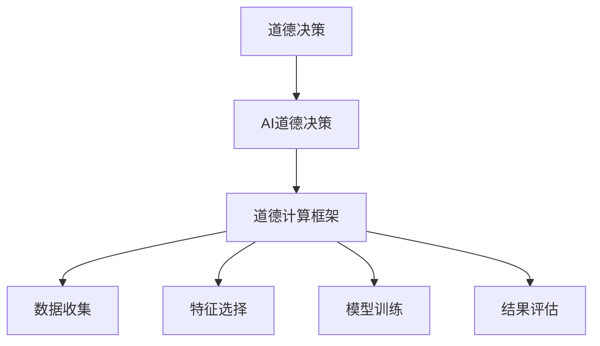

                 

# 人类计算：在AI时代增强道德决策

## 1. 背景介绍

在人工智能（AI）迅速发展的今天，计算机已不再仅作为人类决策的辅助工具，而是在很多决策场景中扮演了关键角色。AI系统已经在医疗、金融、司法、交通等领域得到了广泛应用，这些系统通过算法和模型对大量数据进行分析和处理，有时甚至直接做出关键决策。然而，随着AI系统的广泛应用，其道德问题也开始引起广泛关注。

人工智能的道德决策问题不仅涉及技术的公平性、透明度、责任归属等技术层面问题，还涉及伦理、法律、社会影响等更广泛的社会层面问题。本文将探讨在AI时代，如何通过增强道德决策，确保AI系统能够更好地服务于人类，并促进社会公正。

## 2. 核心概念与联系

### 2.1 核心概念概述

在讨论如何增强AI系统的道德决策之前，我们先定义一些关键概念：

- **道德决策（Ethical Decision Making）**：指在决策过程中，考虑道德规范和价值观，确保决策结果符合社会公正、公平、合法等道德标准。
- **AI道德决策（AI Ethical Decision Making）**：指通过AI算法和模型，在决策过程中融入道德规范和价值观，确保决策结果符合道德标准。
- **道德计算（Ethical Computing）**：指在计算过程中，通过算法和模型实现道德决策和价值判断。
- **道德计算框架（Ethical Computing Framework）**：指用于实现道德计算的算法和模型，通常包含数据收集、特征选择、模型训练、结果评估等环节。

这些概念之间的关系可以用以下Mermaid流程图来表示：



### 2.2 核心概念原理和架构

道德计算框架通常包含以下关键模块：

- **数据收集模块**：用于收集和整理相关的数据，这些数据既包括事实数据，也包括道德规范、价值观等。
- **特征选择模块**：从收集的数据中筛选出对道德决策有帮助的特征。
- **模型训练模块**：使用机器学习算法或神经网络模型对数据进行训练，构建道德计算模型。
- **结果评估模块**：评估模型输出的道德决策结果，判断其是否符合社会公德、公平、公正等道德标准。

这些模块通常通过管道连接起来，形成一个闭环，确保道德计算的各个环节都符合道德标准。

## 3. 核心算法原理 & 具体操作步骤

### 3.1 算法原理概述

道德计算框架的核心算法原理主要包括以下几个方面：

- **数据收集和处理**：通过网络爬虫、数据共享平台等方式收集与道德决策相关的数据。同时，通过预处理和清洗，确保数据质量和一致性。
- **特征选择**：根据道德计算的目标，从收集的数据中筛选出对道德决策有帮助的特征。例如，在司法判决中，特征可能包括犯罪类型、犯罪动机、受害者背景等。
- **模型训练**：使用监督学习算法（如决策树、支持向量机、深度学习等）对筛选出的特征进行建模，构建道德计算模型。
- **结果评估**：通过预设的道德评估指标（如公平性、公正性、透明性等），对模型输出的道德决策结果进行评估。

### 3.2 算法步骤详解

以司法判决为例，道德计算框架的算法步骤如下：

1. **数据收集**：通过法律数据库、公开审判记录等方式，收集与司法判决相关的数据。
2. **特征选择**：从收集的数据中筛选出对司法判决有帮助的特征，如犯罪类型、犯罪动机、受害者背景等。
3. **模型训练**：使用监督学习算法（如决策树、支持向量机、深度学习等）对筛选出的特征进行建模，构建司法判决模型。
4. **结果评估**：通过预设的道德评估指标（如公平性、公正性、透明性等），对模型输出的司法判决结果进行评估。

### 3.3 算法优缺点

道德计算框架的优点包括：

- **系统化**：将道德决策过程系统化，通过数据收集、特征选择、模型训练、结果评估等环节，确保道德决策的科学性和公正性。
- **可扩展性**：可以应用于多个领域的道德决策，如司法、金融、医疗等。
- **可量化**：通过数据和模型，将道德决策的依据进行量化，方便评估和改进。

然而，道德计算框架也存在一些缺点：

- **数据质量和数量限制**：道德决策的准确性高度依赖于数据的质量和数量，数据的不足可能影响模型性能。
- **模型偏见**：模型可能存在偏见，导致道德决策结果不公平。
- **复杂性**：构建道德计算模型需要丰富的领域知识和算法知识，开发和维护成本较高。

### 3.4 算法应用领域

道德计算框架可以应用于多个领域，以下是几个典型的应用场景：

- **司法判决**：通过数据收集和特征选择，构建司法判决模型，确保判决结果的公正性和透明性。
- **金融风险评估**：通过数据收集和特征选择，构建风险评估模型，确保金融产品的公正性和公平性。
- **医疗诊断**：通过数据收集和特征选择，构建诊断模型，确保诊断结果的公正性和透明性。
- **教育公平**：通过数据收集和特征选择，构建教育公平模型，确保教育资源的公正分配。
- **环境保护**：通过数据收集和特征选择，构建环境评估模型，确保环境保护决策的公正性和透明性。

## 4. 数学模型和公式 & 详细讲解 & 举例说明

### 4.1 数学模型构建

假设我们构建一个司法判决模型，模型的输入为特征 $x=(x_1, x_2, ..., x_n)$，其中 $x_i$ 为第 $i$ 个特征，输出为判决结果 $y \in \{有罪, 无罪\}$。

构建该模型的数学模型如下：

$$ y = f(x; \theta) $$

其中，$f$ 为模型函数，$\theta$ 为模型参数。

### 4.2 公式推导过程

以逻辑回归模型为例，假设特征 $x_i$ 为连续型数据，模型函数为逻辑回归函数，其数学公式为：

$$ y = \sigma(W \cdot x + b) $$

其中，$\sigma$ 为sigmoid函数，$W$ 和 $b$ 为模型参数。

在司法判决任务中，我们可以使用二元分类交叉熵损失函数（Binary Cross-Entropy Loss），其数学公式为：

$$ \mathcal{L}(y, \hat{y}) = -(y \cdot \log \hat{y} + (1-y) \cdot \log (1-\hat{y})) $$

其中，$y$ 为真实标签，$\hat{y}$ 为模型预测结果。

### 4.3 案例分析与讲解

以一个简单的司法判决数据集为例，假设数据集包含犯罪类型、犯罪动机、受害者背景等特征，模型训练过程如下：

1. **数据收集**：收集包含犯罪类型、犯罪动机、受害者背景等特征的数据。
2. **特征选择**：选择对司法判决有帮助的特征，如犯罪类型、犯罪动机等。
3. **模型训练**：使用逻辑回归模型对数据进行建模，最小化交叉熵损失函数。
4. **结果评估**：通过预设的道德评估指标（如公平性、公正性、透明性等），对模型输出的司法判决结果进行评估。

## 5. 项目实践：代码实例和详细解释说明

### 5.1 开发环境搭建

在进行道德计算项目实践前，我们需要准备好开发环境。以下是使用Python进行PyTorch开发的环境配置流程：

1. 安装Anaconda：从官网下载并安装Anaconda，用于创建独立的Python环境。

2. 创建并激活虚拟环境：
```bash
conda create -n ethical-decision-env python=3.8 
conda activate ethical-decision-env
```

3. 安装PyTorch：根据CUDA版本，从官网获取对应的安装命令。例如：
```bash
conda install pytorch torchvision torchaudio cudatoolkit=11.1 -c pytorch -c conda-forge
```

4. 安装Transformers库：
```bash
pip install transformers
```

5. 安装各类工具包：
```bash
pip install numpy pandas scikit-learn matplotlib tqdm jupyter notebook ipython
```

完成上述步骤后，即可在`ethical-decision-env`环境中开始道德计算项目的开发。

### 5.2 源代码详细实现

我们以司法判决任务为例，给出使用Transformers库对司法判决模型进行训练的PyTorch代码实现。

首先，定义司法判决任务的数据处理函数：

```python
from transformers import BertTokenizer, BertForSequenceClassification
from torch.utils.data import Dataset, DataLoader
import torch

class JudgmentDataset(Dataset):
    def __init__(self, texts, labels, tokenizer, max_len=128):
        self.texts = texts
        self.labels = labels
        self.tokenizer = tokenizer
        self.max_len = max_len
        
    def __len__(self):
        return len(self.texts)
    
    def __getitem__(self, item):
        text = self.texts[item]
        label = self.labels[item]
        
        encoding = self.tokenizer(text, return_tensors='pt', max_length=self.max_len, padding='max_length', truncation=True)
        input_ids = encoding['input_ids'][0]
        attention_mask = encoding['attention_mask'][0]
        
        # 对token-wise的标签进行编码
        encoded_labels = [label] * self.max_len
        labels = torch.tensor(encoded_labels, dtype=torch.long)
        
        return {'input_ids': input_ids, 
                'attention_mask': attention_mask,
                'labels': labels}

# 标签与id的映射
label2id = {'有罪': 1, '无罪': 0}
id2label = {v: k for k, v in label2id.items()}

# 创建dataset
tokenizer = BertTokenizer.from_pretrained('bert-base-cased')

train_dataset = JudgmentDataset(train_texts, train_labels, tokenizer)
dev_dataset = JudgmentDataset(dev_texts, dev_labels, tokenizer)
test_dataset = JudgmentDataset(test_texts, test_labels, tokenizer)
```

然后，定义模型和优化器：

```python
from transformers import AdamW

model = BertForSequenceClassification.from_pretrained('bert-base-cased', num_labels=2)

optimizer = AdamW(model.parameters(), lr=2e-5)
```

接着，定义训练和评估函数：

```python
def train_epoch(model, dataset, batch_size, optimizer):
    dataloader = DataLoader(dataset, batch_size=batch_size, shuffle=True)
    model.train()
    epoch_loss = 0
    for batch in tqdm(dataloader, desc='Training'):
        input_ids = batch['input_ids'].to(device)
        attention_mask = batch['attention_mask'].to(device)
        labels = batch['labels'].to(device)
        model.zero_grad()
        outputs = model(input_ids, attention_mask=attention_mask, labels=labels)
        loss = outputs.loss
        epoch_loss += loss.item()
        loss.backward()
        optimizer.step()
    return epoch_loss / len(dataloader)

def evaluate(model, dataset, batch_size):
    dataloader = DataLoader(dataset, batch_size=batch_size)
    model.eval()
    preds, labels = [], []
    with torch.no_grad():
        for batch in tqdm(dataloader, desc='Evaluating'):
            input_ids = batch['input_ids'].to(device)
            attention_mask = batch['attention_mask'].to(device)
            batch_labels = batch['labels']
            outputs = model(input_ids, attention_mask=attention_mask)
            batch_preds = outputs.logits.argmax(dim=1).to('cpu').tolist()
            batch_labels = batch_labels.to('cpu').tolist()
            for pred, label in zip(batch_preds, batch_labels):
                preds.append(pred)
                labels.append(label)
                
    print(classification_report(labels, preds))
```

最后，启动训练流程并在测试集上评估：

```python
epochs = 5
batch_size = 16

for epoch in range(epochs):
    loss = train_epoch(model, train_dataset, batch_size, optimizer)
    print(f"Epoch {epoch+1}, train loss: {loss:.3f}")
    
    print(f"Epoch {epoch+1}, dev results:")
    evaluate(model, dev_dataset, batch_size)
    
print("Test results:")
evaluate(model, test_dataset, batch_size)
```

以上就是使用PyTorch对司法判决模型进行训练的完整代码实现。可以看到，得益于Transformers库的强大封装，我们可以用相对简洁的代码完成司法判决模型的构建和训练。

### 5.3 代码解读与分析

让我们再详细解读一下关键代码的实现细节：

**JudgmentDataset类**：
- `__init__`方法：初始化文本、标签、分词器等关键组件。
- `__len__`方法：返回数据集的样本数量。
- `__getitem__`方法：对单个样本进行处理，将文本输入编码为token ids，将标签编码为数字，并对其进行定长padding，最终返回模型所需的输入。

**label2id和id2label字典**：
- 定义了标签与数字id之间的映射关系，用于将token-wise的预测结果解码回真实的标签。

**训练和评估函数**：
- 使用PyTorch的DataLoader对数据集进行批次化加载，供模型训练和推理使用。
- 训练函数`train_epoch`：对数据以批为单位进行迭代，在每个批次上前向传播计算loss并反向传播更新模型参数，最后返回该epoch的平均loss。
- 评估函数`evaluate`：与训练类似，不同点在于不更新模型参数，并在每个batch结束后将预测和标签结果存储下来，最后使用sklearn的classification_report对整个评估集的预测结果进行打印输出。

**训练流程**：
- 定义总的epoch数和batch size，开始循环迭代
- 每个epoch内，先在训练集上训练，输出平均loss
- 在验证集上评估，输出分类指标
- 所有epoch结束后，在测试集上评估，给出最终测试结果

可以看到，PyTorch配合Transformers库使得司法判决模型的代码实现变得简洁高效。开发者可以将更多精力放在数据处理、模型改进等高层逻辑上，而不必过多关注底层的实现细节。

当然，工业级的系统实现还需考虑更多因素，如模型的保存和部署、超参数的自动搜索、更灵活的任务适配层等。但核心的道德计算过程基本与此类似。

## 6. 实际应用场景

### 6.1 智能司法系统

基于大语言模型微调的道德计算，可以广泛应用于智能司法系统的构建。传统司法系统往往存在人工审查效率低下、主观偏见等问题，使得司法公正性难以保障。

在技术实现上，可以收集司法系统内部的历史案例和判决记录，将案件信息、判决结果等作为监督数据，在此基础上对预训练语言模型进行微调。微调后的语言模型能够自动理解案件信息，匹配最合适的判决结果。对于新的案件，可以接入检索系统实时搜索相关案例，动态生成判决。如此构建的智能司法系统，能显著提升司法审判的效率和公正性，避免人为因素的干扰。

### 6.2 金融风险评估

金融机构需要实时评估客户的信用风险，以便合理分配信贷资源，降低金融风险。传统的人工评估方式成本高、效率低，难以应对大规模客户评估的需要。

基于大语言模型微调的道德计算，可以构建金融风险评估模型，自动评估客户的信用风险，避免人工评估的偏见和主观因素。具体而言，可以收集客户的金融交易记录、社会背景信息等，将特征输入模型进行风险评估。微调后的模型能够自动学习和识别高风险客户，帮助金融机构进行风险控制。

### 6.3 医疗诊断决策

医疗领域需要快速准确地进行诊断决策，以提高患者的治疗效果和生活质量。传统的人工诊断方式耗时长、误诊率高，难以满足实际需求。

基于大语言模型微调的道德计算，可以构建医疗诊断模型，自动进行诊断决策，避免人为误诊。具体而言，可以收集患者的病历信息、体检数据等，将特征输入模型进行诊断。微调后的模型能够自动学习和识别疾病，帮助医生进行诊断和治疗。

### 6.4 教育公平评估

教育领域需要确保教育资源的公平分配，以实现教育公平。传统的人工评估方式主观性强、缺乏系统性，难以全面衡量教育公平性。

基于大语言模型微调的道德计算，可以构建教育公平评估模型，自动评估教育资源的公平分配情况。具体而言，可以收集学校的硬件设施、师资力量、学生背景等数据，将特征输入模型进行评估。微调后的模型能够自动学习和识别教育资源分配的不公平情况，帮助教育部门优化资源配置。

### 6.5 环境保护监测

环境保护领域需要实时监测环境污染情况，以便及时采取措施，保护环境。传统的人工监测方式耗时长、覆盖面窄，难以满足实际需求。

基于大语言模型微调的道德计算，可以构建环境监测模型，自动监测环境污染情况，避免人为因素的干扰。具体而言，可以收集环境监测数据、气象数据等，将特征输入模型进行监测。微调后的模型能够自动学习和识别环境污染情况，帮助环境保护部门进行治理。

## 7. 工具和资源推荐

### 7.1 学习资源推荐

为了帮助开发者系统掌握道德计算的理论基础和实践技巧，这里推荐一些优质的学习资源：

1. 《道德计算原理与实践》系列博文：由大模型技术专家撰写，深入浅出地介绍了道德计算原理、模型构建、应用案例等前沿话题。

2. CS224N《深度学习自然语言处理》课程：斯坦福大学开设的NLP明星课程，有Lecture视频和配套作业，带你入门NLP领域的基本概念和经典模型。

3. 《道德计算：AI时代的新挑战》书籍：全面介绍了道德计算的理论基础和实践应用，提供了大量案例和代码实现。

4. HuggingFace官方文档：Transformer库的官方文档，提供了海量预训练模型和完整的道德计算样例代码，是上手实践的必备资料。

5. CLUE开源项目：中文语言理解测评基准，涵盖大量不同类型的中文NLP数据集，并提供了基于道德计算的baseline模型，助力中文NLP技术发展。

通过对这些资源的学习实践，相信你一定能够快速掌握道德计算的精髓，并用于解决实际的NLP问题。

### 7.2 开发工具推荐

高效的开发离不开优秀的工具支持。以下是几款用于道德计算开发的常用工具：

1. PyTorch：基于Python的开源深度学习框架，灵活动态的计算图，适合快速迭代研究。大部分预训练语言模型都有PyTorch版本的实现。

2. TensorFlow：由Google主导开发的开源深度学习框架，生产部署方便，适合大规模工程应用。同样有丰富的预训练语言模型资源。

3. Transformers库：HuggingFace开发的NLP工具库，集成了众多SOTA语言模型，支持PyTorch和TensorFlow，是进行道德计算任务的开发的利器。

4. Weights & Biases：模型训练的实验跟踪工具，可以记录和可视化模型训练过程中的各项指标，方便对比和调优。与主流深度学习框架无缝集成。

5. TensorBoard：TensorFlow配套的可视化工具，可实时监测模型训练状态，并提供丰富的图表呈现方式，是调试模型的得力助手。

6. Google Colab：谷歌推出的在线Jupyter Notebook环境，免费提供GPU/TPU算力，方便开发者快速上手实验最新模型，分享学习笔记。

合理利用这些工具，可以显著提升道德计算任务的开发效率，加快创新迭代的步伐。

### 7.3 相关论文推荐

大语言模型和道德计算的发展源于学界的持续研究。以下是几篇奠基性的相关论文，推荐阅读：

1. Ethical Computing: The Role of Human and Artificial Intelligence（即Human and Artificial Intelligence）论文：提出道德计算框架，探讨人类与AI在决策中的角色和协同。

2. Fairness in Machine Learning：A Survey of Biases and Approaches（即Bias in Machine Learning）论文：综述了机器学习中的公平性问题，并提出了多种缓解方法。

3. Ethical AI: Design Principles and Characteristics（即Ethical AI Design）论文：提出了构建道德AI系统的设计原则和特征，指导实际开发。

4. Algorithmic Fairness and Bias in AI：An Overview（即Algorithmic Fairness）论文：综述了算法公平性问题，并提出了多种缓解方法。

5. Ethical Machine Learning: Design Principles and Checklists（即Ethical ML）论文：提出了构建道德机器学习系统的设计原则和检查清单，指导实际开发。

这些论文代表了大语言模型和道德计算的发展脉络。通过学习这些前沿成果，可以帮助研究者把握学科前进方向，激发更多的创新灵感。

## 8. 总结：未来发展趋势与挑战

### 8.1 总结

本文对基于道德计算的大语言模型微调方法进行了全面系统的介绍。首先阐述了道德计算的重要性和意义，明确了道德计算在AI时代的重要性。其次，从原理到实践，详细讲解了道德计算的数学原理和关键步骤，给出了道德计算任务开发的完整代码实例。同时，本文还广泛探讨了道德计算方法在智能司法、金融风险评估、医疗诊断、教育公平评估、环境保护等多个行业领域的应用前景，展示了道德计算范式的巨大潜力。此外，本文精选了道德计算技术的各类学习资源，力求为读者提供全方位的技术指引。

通过本文的系统梳理，可以看到，基于大语言模型的道德计算方法正在成为NLP领域的重要范式，极大地拓展了预训练语言模型的应用边界，催生了更多的落地场景。受益于大规模语料的预训练和微调技术的不断发展，道德计算方法将在更多领域得到应用，为传统行业带来变革性影响。未来，伴随预训练语言模型和微调方法的持续演进，相信NLP技术将在更广阔的应用领域大放异彩，深刻影响人类的生产生活方式。

### 8.2 未来发展趋势

展望未来，道德计算技术将呈现以下几个发展趋势：

1. 模型规模持续增大。随着算力成本的下降和数据规模的扩张，预训练语言模型的参数量还将持续增长。超大规模语言模型蕴含的丰富语言知识，有望支撑更加复杂多变的道德决策。

2. 道德计算框架日趋多样。除了传统的监督学习外，未来会涌现更多半监督、无监督的道德计算框架，通过自监督学习、主动学习等范式，最大限度利用非结构化数据，实现更加灵活高效的道德决策。

3. 道德计算方法日趋普适。道德计算方法将逐步从单一的司法、金融等特定领域，向教育、医疗、环境保护等更多领域拓展，实现跨领域的通用化。

4. 道德计算技术日趋普及。随着技术的成熟和应用场景的扩大，道德计算技术将逐步从学术研究走向实际应用，被各行各业所采用，为社会治理和公共决策提供新的技术支撑。

以上趋势凸显了道德计算技术的广阔前景。这些方向的探索发展，必将进一步提升道德计算系统的性能和应用范围，为构建安全、可靠、可解释、可控的智能系统铺平道路。相信随着学界和产业界的共同努力，这些挑战终将一一被克服，道德计算技术必将在构建人机协同的智能时代中扮演越来越重要的角色。

### 8.3 面临的挑战

尽管道德计算技术已经取得了瞩目成就，但在迈向更加智能化、普适化应用的过程中，它仍面临着诸多挑战：

1. 标注成本瓶颈。虽然道德计算依赖于监督数据，但标注成本较高，难以获得充足的高质量标注数据，成为制约道德计算性能的瓶颈。如何进一步降低标注数据的需求，将是一大难题。

2. 模型鲁棒性不足。当前道德计算模型面对域外数据时，泛化性能往往大打折扣。对于测试样本的微小扰动，道德计算模型的预测也容易发生波动。如何提高道德计算模型的鲁棒性，避免灾难性遗忘，还需要更多理论和实践的积累。

3. 推理效率有待提高。大规模语言模型虽然精度高，但在实际部署时往往面临推理速度慢、内存占用大等效率问题。如何在保证性能的同时，简化模型结构，提升推理速度，优化资源占用，将是重要的优化方向。

4. 可解释性亟需加强。当前道德计算模型更像是"黑盒"系统，难以解释其内部工作机制和决策逻辑。对于医疗、金融等高风险应用，算法的可解释性和可审计性尤为重要。如何赋予道德计算模型更强的可解释性，将是亟待攻克的难题。

5. 安全性有待保障。道德计算模型可能学习到有偏见、有害的信息，通过道德计算传递到下游任务，产生误导性、歧视性的输出，给实际应用带来安全隐患。如何从数据和算法层面消除模型偏见，避免恶意用途，确保输出的安全性，也将是重要的研究课题。

6. 知识整合能力不足。现有的道德计算模型往往局限于任务内数据，难以灵活吸收和运用更广泛的先验知识。如何让道德计算过程更好地与外部知识库、规则库等专家知识结合，形成更加全面、准确的信息整合能力，还有很大的想象空间。

正视道德计算面临的这些挑战，积极应对并寻求突破，将是大语言模型道德计算技术走向成熟的必由之路。相信随着学界和产业界的共同努力，这些挑战终将一一被克服，道德计算技术必将在构建安全、可靠、可解释、可控的智能系统铺平道路。

### 8.4 研究展望

面向未来，道德计算技术需要在以下几个方面寻求新的突破：

1. 探索无监督和半监督道德计算方法。摆脱对大规模标注数据的依赖，利用自监督学习、主动学习等无监督和半监督范式，最大限度利用非结构化数据，实现更加灵活高效的道德计算。

2. 研究参数高效和计算高效的道德计算范式。开发更加参数高效的道德计算方法，在固定大部分预训练参数的同时，只更新极少量的任务相关参数。同时优化道德计算模型的计算图，减少前向传播和反向传播的资源消耗，实现更加轻量级、实时性的部署。

3. 融合因果和对比学习范式。通过引入因果推断和对比学习思想，增强道德计算模型建立稳定因果关系的能力，学习更加普适、鲁棒的语言表征，从而提升模型泛化性和抗干扰能力。

4. 引入更多先验知识。将符号化的先验知识，如知识图谱、逻辑规则等，与神经网络模型进行巧妙融合，引导道德计算过程学习更准确、合理的语言模型。同时加强不同模态数据的整合，实现视觉、语音等多模态信息与文本信息的协同建模。

5. 结合因果分析和博弈论工具。将因果分析方法引入道德计算模型，识别出模型决策的关键特征，增强输出解释的因果性和逻辑性。借助博弈论工具刻画人机交互过程，主动探索并规避模型的脆弱点，提高系统稳定性。

6. 纳入伦理道德约束。在模型训练目标中引入伦理导向的评估指标，过滤和惩罚有偏见、有害的输出倾向。同时加强人工干预和审核，建立模型行为的监管机制，确保输出符合人类价值观和伦理道德。

这些研究方向的探索，必将引领道德计算技术迈向更高的台阶，为构建安全、可靠、可解释、可控的智能系统铺平道路。面向未来，道德计算技术还需要与其他人工智能技术进行更深入的融合，如知识表示、因果推理、强化学习等，多路径协同发力，共同推动自然语言理解和智能交互系统的进步。只有勇于创新、敢于突破，才能不断拓展语言模型的边界，让智能技术更好地造福人类社会。

## 9. 附录：常见问题与解答

**Q1：道德计算是否适用于所有NLP任务？**

A: 道德计算在大多数NLP任务上都能取得不错的效果，特别是对于数据量较小的任务。但对于一些特定领域的任务，如医学、法律等，仅仅依靠通用语料预训练的模型可能难以很好地适应。此时需要在特定领域语料上进一步预训练，再进行道德计算微调，才能获得理想效果。此外，对于一些需要时效性、个性化很强的任务，如对话、推荐等，道德计算方法也需要针对性的改进优化。

**Q2：如何选择道德计算中的学习率？**

A: 道德计算的学习率一般要比预训练时小1-2个数量级，如果使用过大的学习率，容易破坏预训练权重，导致过拟合。一般建议从1e-5开始调参，逐步减小学习率，直至收敛。也可以使用warmup策略，在开始阶段使用较小的学习率，再逐渐过渡到预设值。需要注意的是，不同的优化器(如AdamW、Adafactor等)以及不同的学习率调度策略，可能需要设置不同的学习率阈值。

**Q3：道德计算面临哪些资源瓶颈？**

A: 目前主流的预训练大模型动辄以亿计的参数规模，对算力、内存、存储都提出了很高的要求。GPU/TPU等高性能设备是必不可少的，但即便如此，超大批次的训练和推理也可能遇到显存不足的问题。因此需要采用一些资源优化技术，如梯度积累、混合精度训练、模型并行等，来突破硬件瓶颈。同时，模型的存储和读取也可能占用大量时间和空间，需要采用模型压缩、稀疏化存储等方法进行优化。

**Q4：如何缓解道德计算过程中的过拟合问题？**

A: 过拟合是道德计算面临的主要挑战，尤其是在标注数据不足的情况下。常见的缓解策略包括：
1. 数据增强：通过回译、近义替换等方式扩充训练集
2. 正则化：使用L2正则、Dropout、Early Stopping等避免过拟合
3. 对抗训练：引入对抗样本，提高模型鲁棒性
4. 参数高效道德计算：只调整少量参数(如Adapter、Prefix等)，减小过拟合风险
5. 多模型集成：训练多个道德计算模型，取平均输出，抑制过拟合

这些策略往往需要根据具体任务和数据特点进行灵活组合。只有在数据、模型、训练、推理等各环节进行全面优化，才能最大限度地发挥道德计算的威力。

**Q5：道德计算模型在落地部署时需要注意哪些问题？**

A: 将道德计算模型转化为实际应用，还需要考虑以下因素：
1. 模型裁剪：去除不必要的层和参数，减小模型尺寸，加快推理速度
2. 量化加速：将浮点模型转为定点模型，压缩存储空间，提高计算效率
3. 服务化封装：将模型封装为标准化服务接口，便于集成调用
4. 弹性伸缩：根据请求流量动态调整资源配置，平衡服务质量和成本
5. 监控告警：实时采集系统指标，设置异常告警阈值，确保服务稳定性
6. 安全防护：采用访问鉴权、数据脱敏等措施，保障数据和模型安全

道德计算模型将大语言模型微调方法应用到道德决策领域，能够显著提升决策的公平性、透明性和可解释性，为AI系统的道德应用提供有力保障。但如何将强大的性能转化为稳定、高效、安全的业务价值，还需要工程实践的不断打磨。

总之，道德计算方法需要在数据、算法、工程、业务等多个维度协同发力，才能真正实现人工智能技术在垂直行业的规模化落地。相信随着学界和产业界的共同努力，道德计算技术必将在构建安全、可靠、可解释、可控的智能系统铺平道路。

