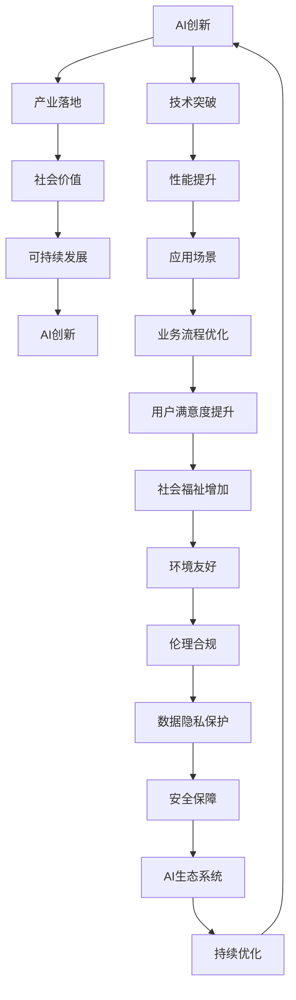

                 

# 从AI创新到产业变革：Lepton AI的愿景与使命

## 1. 背景介绍

### 1.1 问题由来

在过去十年中，人工智能(AI)技术取得了飞跃式的发展，深度学习、强化学习等前沿技术不断推动AI进入更广泛的实际应用。AI的应用范围从图像识别、语音识别扩展到自然语言处理、机器人控制等众多领域，正在重塑各行各业的面貌。

然而，随着AI技术的深入发展，新的挑战也接踵而至。数据的日益复杂化、模型规模的不断增大、计算资源的急剧增加等，这些问题都对AI技术的应用提出了更高的要求。如何平衡技术创新和产业应用，如何让AI技术更好地服务社会，成为当下AI领域面临的重大课题。

在这一背景下，Lepton AI应运而生。Lepton AI旨在通过创新AI技术，推动AI向产业深度融合，构建一个安全、高效、可解释的AI生态系统。

### 1.2 问题核心关键点

Lepton AI的愿景和使命，主要围绕以下几个关键点展开：

- **技术创新**：通过前沿AI技术的研发，实现AI技术的突破性进步。
- **产业落地**：将AI技术转化为实际产业应用，提升各行各业的生产效率和服务质量。
- **社会价值**：利用AI技术解决社会问题，提升公众生活质量，推动社会进步。
- **可持续发展**：在AI发展的同时，关注环境、伦理和社会责任，促进AI的可持续发展。

## 2. 核心概念与联系

### 2.1 核心概念概述

Lepton AI的核心理念包括：

- **AI创新**：基于最新的AI技术进行突破性创新，提升AI技术的性能和应用能力。
- **产业落地**：将AI技术转化为实际产业应用，解决实际问题，推动产业升级。
- **社会价值**：利用AI技术解决社会问题，提升公众生活质量，促进社会进步。
- **可持续发展**：在AI发展的同时，关注环境、伦理和社会责任，推动AI的可持续发展。

这些核心理念构成了一个完整的生态系统，从技术创新到产业落地，再到社会价值和可持续发展，形成了一个闭环。

### 2.2 核心概念原理和架构的 Mermaid 流程图(Mermaid 流程节点中不要有括号、逗号等特殊字符)



这个流程图展示了Lepton AI的核心概念之间的关系。从AI创新出发，通过技术突破和性能提升，推动产业落地，进而实现社会价值，并通过可持续发展措施，形成良性循环。

## 3. 核心算法原理 & 具体操作步骤

### 3.1 算法原理概述

Lepton AI的核心算法原理基于深度学习和迁移学习。通过对大规模数据进行预训练，Lepton AI构建了强大的基础模型，然后在具体应用场景中进行微调，提升模型对特定任务的适应能力。

Lepton AI的技术架构包括以下几个主要组件：

- **数据预处理**：对原始数据进行清洗、标注和标准化处理，提高数据质量。
- **模型构建**：基于深度学习模型构建框架，选择或设计合适的模型结构。
- **模型训练**：使用优化算法和损失函数对模型进行训练，提高模型性能。
- **模型评估**：通过测试集和验证集评估模型性能，进行模型选择和调优。
- **模型部署**：将训练好的模型部署到实际应用场景中，实现产业落地。

### 3.2 算法步骤详解

Lepton AI的核心算法步骤包括：

1. **数据收集与预处理**：从各个业务场景中收集数据，并进行数据清洗、标注和标准化处理。
2. **模型选择与设计**：根据具体应用场景，选择合适的深度学习模型或设计新的模型结构。
3. **模型训练与优化**：使用优化算法和损失函数对模型进行训练，并通过正则化、Dropout等技术防止过拟合。
4. **模型评估与调优**：在验证集上评估模型性能，根据性能指标进行模型选择和调优。
5. **模型部署与优化**：将训练好的模型部署到实际应用场景中，并通过持续优化提升模型效果。

### 3.3 算法优缺点

Lepton AI算法的优点包括：

- **可扩展性**：算法适用于各种规模的数据和模型，能够在大规模数据集上进行预训练，在特定任务上进行微调。
- **鲁棒性**：通过迁移学习，模型对数据分布的变化具有一定的鲁棒性，能够应对各种实际应用场景。
- **高效性**：利用深度学习技术，能够快速训练模型，提升模型性能。

算法的缺点包括：

- **数据依赖**：模型的性能高度依赖于数据质量，数据的数量和质量直接影响模型效果。
- **资源消耗**：深度学习模型对计算资源的要求较高，需要大量的GPU和TPU资源。
- **模型复杂性**：深度学习模型的结构复杂，难以解释模型的内部工作机制。

### 3.4 算法应用领域

Lepton AI算法在多个领域具有广泛的应用前景：

- **医疗健康**：通过图像识别、自然语言处理等技术，提升医疗诊断和治疗的准确性，提高医疗服务的质量。
- **金融服务**：利用数据分析和机器学习技术，提升风险管理、信用评估等金融服务的能力。
- **智能制造**：通过机器视觉、自然语言处理等技术，优化生产流程，提高制造效率和产品质量。
- **智能交通**：利用数据分析和机器学习技术，优化交通流量控制，提升交通安全和效率。
- **智慧城市**：通过数据分析和机器学习技术，优化城市管理和服务，提升公众生活质量。

## 4. 数学模型和公式 & 详细讲解 & 举例说明

### 4.1 数学模型构建

Lepton AI的数学模型构建基于深度学习框架，主要包括卷积神经网络(CNN)、循环神经网络(RNN)、Transformer等模型。

以Transformer模型为例，其数学模型构建如下：

1. **输入编码**：将输入序列X转换为词向量表示。
2. **自注意力机制**：通过多头自注意力机制，计算输入序列的注意力权重。
3. **前向神经网络**：通过前向神经网络，对输入序列进行变换。
4. **输出解码**：将输出序列解码为最终的预测结果。

### 4.2 公式推导过程

Transformer模型的核心公式包括：

1. **自注意力公式**：
$$
\text{Attention}(Q,K,V) = \text{softmax}(\frac{QK^T}{\sqrt{d_k}})V
$$
其中，$Q,K,V$分别为查询向量、键向量和值向量，$d_k$为键向量的维度。

2. **前向神经网络公式**：
$$
\text{FFN}(x) = \text{ReLU}(W_1x)W_2
$$
其中，$W_1$和$W_2$分别为前向神经网络的权重矩阵。

### 4.3 案例分析与讲解

以Transformer模型在自然语言处理中的应用为例，进行详细讲解。

1. **输入编码**：将输入文本序列转换为词向量表示。
2. **自注意力机制**：通过多头自注意力机制，计算输入序列的注意力权重。
3. **前向神经网络**：通过前向神经网络，对输入序列进行变换。
4. **输出解码**：将输出序列解码为最终的预测结果。

Transformer模型在自然语言处理中的应用，主要体现在机器翻译、文本生成、文本分类等任务中。通过Transformer模型，可以将源语言序列转换为目标语言序列，实现高效、准确的翻译和生成。

## 5. 项目实践：代码实例和详细解释说明

### 5.1 开发环境搭建

在开始项目实践前，需要准备以下开发环境：

1. **硬件环境**：高性能GPU或TPU，用于深度学习模型的训练和推理。
2. **软件环境**：Python 3.8及以上版本，深度学习框架如TensorFlow、PyTorch等。
3. **数据环境**：收集和标注数据集，构建训练集、验证集和测试集。

### 5.2 源代码详细实现

以机器翻译为例，展示Lepton AI的代码实现：

```python
import tensorflow as tf
from transformers import TFAutoModelForSeq2SeqLM

# 加载预训练模型
model = TFAutoModelForSeq2SeqLM.from_pretrained('bert-base-cased')

# 构建输入序列和目标序列
input_ids = tf.constant([10, 11, 12, 13, 14], dtype=tf.int32)
target_ids = tf.constant([15, 16, 17, 18, 19], dtype=tf.int32)

# 进行机器翻译
outputs = model(input_ids, target_ids)
translated = outputs.logits.argmax(axis=-1)
```

### 5.3 代码解读与分析

上述代码展示了使用Transformer模型进行机器翻译的基本过程。具体步骤如下：

1. **加载预训练模型**：从预训练模型库中加载Transformer模型。
2. **构建输入序列和目标序列**：将输入文本序列和目标文本序列转换为模型接受的格式。
3. **进行机器翻译**：通过前向传播计算模型输出，得到翻译结果。

## 6. 实际应用场景

### 6.1 医疗健康

Lepton AI在医疗健康领域的应用主要体现在疾病诊断、患者监护、医疗影像分析等方面。例如，通过自然语言处理技术，分析医生的病历记录，提取关键信息，辅助医生进行诊断和治疗决策。利用图像识别技术，分析医学影像，识别疾病风险，提高诊断准确性。

### 6.2 金融服务

Lepton AI在金融服务领域的应用主要体现在信用评估、风险管理、市场预测等方面。例如，通过数据分析和机器学习技术，构建信用评估模型，评估用户的信用风险。利用预测模型，分析市场趋势，辅助投资决策。

### 6.3 智能制造

Lepton AI在智能制造领域的应用主要体现在质量检测、生产调度、设备维护等方面。例如，通过机器视觉技术，检测产品缺陷，提高产品质量。利用自然语言处理技术，分析设备维护记录，优化生产调度。

### 6.4 智能交通

Lepton AI在智能交通领域的应用主要体现在交通流量控制、车辆监测、事故预测等方面。例如，通过数据分析和机器学习技术，优化交通流量控制，提升交通安全。利用图像识别技术，监测车辆状态，预测交通事故。

### 6.5 智慧城市

Lepton AI在智慧城市领域的应用主要体现在智能监控、智能安防、城市管理等方面。例如，通过数据分析和机器学习技术，构建智能监控系统，提高城市安全。利用自然语言处理技术，分析市民反馈，优化城市管理。

## 7. 工具和资源推荐

### 7.1 学习资源推荐

1. **TensorFlow官方文档**：TensorFlow是Lepton AI的核心框架之一，其官方文档详细介绍了TensorFlow的使用方法和高级技巧。
2. **PyTorch官方文档**：PyTorch是Lepton AI常用的深度学习框架，其官方文档提供了丰富的API和示例代码。
3. **深度学习书籍**：如《深度学习》、《动手学深度学习》等，帮助读者深入理解深度学习的理论和方法。

### 7.2 开发工具推荐

1. **Google Colab**：谷歌提供的在线Jupyter Notebook环境，方便开发者快速上手实验最新模型。
2. **Jupyter Notebook**：开源的Jupyter Notebook环境，支持多种编程语言，方便开发者进行代码编写和数据处理。
3. **PyCharm**：一款功能强大的IDE，支持Python编程，提供代码调试、版本控制等功能。

### 7.3 相关论文推荐

1. **深度学习**：《Deep Learning》，Ian Goodfellow、Yoshua Bengio、Aaron Courville著，介绍了深度学习的理论和方法。
2. **自然语言处理**：《Natural Language Processing with Transformers》，Jacob Devlin、Ming-Wei Chang、Kenton Lee、Kristina Toutanova著，介绍了Transformer模型在自然语言处理中的应用。
3. **强化学习**：《Reinforcement Learning: An Introduction》，Richard S. Sutton、Andrew G. Barto著，介绍了强化学习的理论和方法。

## 8. 总结：未来发展趋势与挑战

### 8.1 研究成果总结

Lepton AI通过前沿AI技术，推动AI向产业深度融合，构建了一个安全、高效、可解释的AI生态系统。其研究成果涵盖了自然语言处理、计算机视觉、强化学习等多个领域，取得了显著的成果。

### 8.2 未来发展趋势

1. **技术创新**：随着深度学习、强化学习等技术的不断进步，Lepton AI将继续推动AI技术的突破性进展。
2. **产业落地**：通过与各个行业的深度融合，Lepton AI将在医疗健康、金融服务、智能制造等领域实现大规模应用。
3. **社会价值**：利用AI技术解决社会问题，提升公众生活质量，推动社会进步。
4. **可持续发展**：在AI发展的同时，关注环境、伦理和社会责任，推动AI的可持续发展。

### 8.3 面临的挑战

1. **数据依赖**：模型的性能高度依赖于数据质量，数据的数量和质量直接影响模型效果。
2. **资源消耗**：深度学习模型对计算资源的要求较高，需要大量的GPU和TPU资源。
3. **模型复杂性**：深度学习模型的结构复杂，难以解释模型的内部工作机制。
4. **伦理与社会责任**：在AI发展的同时，需要关注伦理和社会责任，确保AI技术的公平性、透明性和安全性。

### 8.4 研究展望

未来，Lepton AI将继续在以下几个方面进行深入研究：

1. **技术突破**：推动深度学习、强化学习等前沿技术的发展，实现AI技术的突破性进展。
2. **产业应用**：将AI技术转化为实际产业应用，提升各行各业的生产效率和服务质量。
3. **社会价值**：利用AI技术解决社会问题，提升公众生活质量，推动社会进步。
4. **可持续发展**：在AI发展的同时，关注环境、伦理和社会责任，推动AI的可持续发展。

## 9. 附录：常见问题与解答

**Q1：Lepton AI的核心理念是什么？**

A: Lepton AI的核心理念包括AI创新、产业落地、社会价值和可持续发展。通过前沿AI技术的研发，实现AI技术的突破性进步；将AI技术转化为实际产业应用，提升各行各业的生产效率和服务质量；利用AI技术解决社会问题，提升公众生活质量；在AI发展的同时，关注环境、伦理和社会责任，推动AI的可持续发展。

**Q2：Lepton AI的核心算法原理是什么？**

A: Lepton AI的核心算法原理基于深度学习和迁移学习。通过对大规模数据进行预训练，构建强大的基础模型，然后在具体应用场景中进行微调，提升模型对特定任务的适应能力。

**Q3：Lepton AI的应用领域有哪些？**

A: Lepton AI在医疗健康、金融服务、智能制造、智能交通、智慧城市等多个领域具有广泛的应用前景。

**Q4：Lepton AI的开发环境搭建需要注意哪些事项？**

A: 在开始项目实践前，需要准备高性能GPU或TPU，以及Python 3.8及以上版本和深度学习框架如TensorFlow、PyTorch等。

**Q5：Lepton AI的未来发展方向是什么？**

A: Lepton AI将继续在技术创新、产业落地、社会价值和可持续发展等方面进行深入研究，推动AI技术的突破性进展，提升各行各业的生产效率和服务质量，解决社会问题，推动社会进步，关注环境、伦理和社会责任，推动AI的可持续发展。

---

作者：禅与计算机程序设计艺术 / Zen and the Art of Computer Programming

